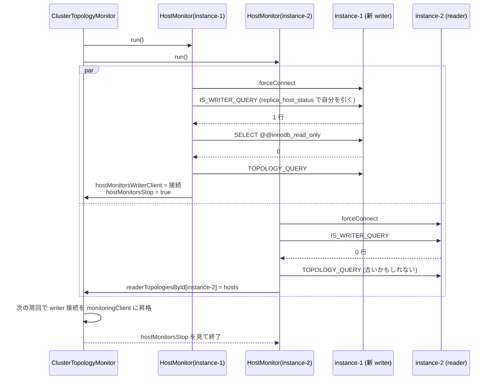

## 何を学んだか

`replica_host_status` は各インスタンスがストレージ層経由で共有している表で、フェイルオーバー直後は reader 側の表が古い。`UsingTheFailover2Plugin.md` の Picture 3 は、reader の `Instance-3` が「自分がまだ writer」と主張している例を挙げている。

だから [ClusterTopologyMonitor](../cluster-topology-monitor/) はパニックモードで表を信じない。**ホストごとに `HostMonitor` を 1 本走らせ、そのホスト自身に「writer か」を聞く**。

- writer だと答えたホストの接続を、そのまま監視接続に昇格させる
- reader だと答えたホストからはトポロジを取り、baseline の writer と違う writer が現れたらキャッシュを先に更新する
- どのホストも writer と答えないが reader 全員の答えが 15 秒一致したら、その答えを採用する

「聞く」には 2 段階あり、`replica_host_status` を自分の `@@aurora_server_id` で引いた結果と、`@@innodb_read_only` の両方が writer と言ったときだけ writer と認める。



## ソースコードのどこか

### `HostMonitor.run` — 1 ホスト分のループ

[`common/lib/host_list_provider/monitoring/cluster_topology_monitor.ts#L862`](https://github.com/aws/aws-advanced-nodejs-wrapper/blob/6d0ba1bdae81a4e1fd274b3569c5dc50cf0a7095/common/lib/host_list_provider/monitoring/cluster_topology_monitor.ts#L862)。接続の部分から。

```ts title="common/lib/host_list_provider/monitoring/cluster_topology_monitor.ts"
while (!this.monitor.hostMonitorsStop) {
  if (!this.client) {
    try {
      this.client = await pluginService.forceConnect(this.hostInfo, this.monitor.monitoringProperties);
      this.connectionAttempts = 0;
    } catch (error) {
      // A problem occurred while connecting.
      if (pluginService.isNetworkError(error)) {
        // It's a network issue that's expected during a cluster failover.
        // We will try again on the next iteration.
        await sleep(100);
        this.monitor.completedOneCycle.set(this.hostInfo.hostId, true);
        this.monitor.readerTopologiesById.delete(this.hostInfo.hostId);
        continue;
      } else if (pluginService.isLoginError(error)) {
        throw new AwsWrapperError(Messages.get("HostMonitor.loginErrorDuringMonitoring"), error);
      } else {
        // It might be some transient error. Let's try again.
        // If the error repeats, we will try again after a longer delay.
        const backoff = this.calculateBackoffWithJitter(this.connectionAttempts++);
        await sleep(backoff);
        this.monitor.completedOneCycle.set(this.hostInfo.hostId, true);
        this.monitor.readerTopologiesById.delete(this.hostInfo.hostId);
        continue;
      }
    }
  }
```

接続失敗は 3 種類に分けられる。ネットワークエラーは「フェイルオーバー中なら当然」なので 100ms 後に再試行、ログインエラーは再試行しても無駄なので投げて終了、それ以外はジッタ付き指数バックオフである ([`#L1033`](https://github.com/aws/aws-advanced-nodejs-wrapper/blob/6d0ba1bdae81a4e1fd274b3569c5dc50cf0a7095/common/lib/host_list_provider/monitoring/cluster_topology_monitor.ts#L1033))。

```ts title="common/lib/host_list_provider/monitoring/cluster_topology_monitor.ts"
private calculateBackoffWithJitter(attempt: number): number {
  let backoff = HostMonitor.INITIAL_BACKOFF_MS * Math.round(Math.pow(2, Math.min(attempt, 6)));
  backoff = Math.min(backoff, HostMonitor.MAX_BACKOFF_MS);
  return Math.round(backoff * (0.5 + Math.random() * 0.5));
}
```

100ms → 200 → 400 → ... → 6.4 秒、上限 10 秒、そこに 50〜100% のジッタが掛かる。エラー分類の中身は [MySQLErrorHandler](../mysql-error-handler/) にある。

どの失敗経路でも `completedOneCycle` を true にし、`readerTopologiesById` から自分を消す。「試みた」ことと「今は答えを持っていない」ことを親に伝えるためで、後の合意判定で使われる。

### 2 段階の writer 確認

```ts title="common/lib/host_list_provider/monitoring/cluster_topology_monitor.ts (L896)"
if (this.client) {
  let isWriter: boolean = false;
  try {
    isWriter = await this.monitor.topologyUtils.isWriterInstance(this.client);
  } catch (error) {
    logger.error(Messages.get("ClusterTopologyMonitor.invalidWriterQuery", error?.message));
    await this.monitor.closeConnection(this.client);
    this.client = null;
  }

  if (isWriter) {
    try {
      // First connection after failover may be stale.
      const hostRole = await this.monitor.pluginService.getHostRole(this.client);
      if (hostRole !== HostRole.WRITER) {
        isWriter = false;
      }
    } catch (error: any) {
      // Invalid connection, retry.
      this.monitor.completedOneCycle.set(this.hostInfo.hostId, true);
      this.monitor.readerTopologiesById.delete(this.hostInfo.hostId);
      continue;
    }
  }
```

1 段目の `isWriterInstance` は Aurora なら `IS_WRITER_QUERY`、

```sql
SELECT server_id FROM information_schema.replica_host_status
WHERE SESSION_ID = 'MASTER_SESSION_ID' AND SERVER_ID = @@aurora_server_id
```

で、「`replica_host_status` の writer 行が自分か」を見る。2 段目の `getHostRole` は `SELECT @@innodb_read_only` で、「自分の InnoDB は書けるか」を見る。コメントの「First connection after failover may be stale」は、降格したばかりの旧 writer では `replica_host_status` がまだ自分を writer と書いているのに `innodb_read_only` はもう 1 になっている、という状況を指している。表は共有情報で遅れ、変数はローカルで即時なので、変数の方を最終判断にする。

Multi-AZ ではこの 2 段目が別の意味で必須になる。`getWriterId` が reader でも非 null を返すため、1 段目は常に true になる ([トポロジクエリ (Multi-AZ MySQL)](../topology-query-multi-az/))。

### writer と分かったら

```ts title="common/lib/host_list_provider/monitoring/cluster_topology_monitor.ts (L921)"
if (isWriter) {
  // This prevents us from closing the connection in the finally block.
  if (this.monitor.hostMonitorsWriterClient) {
    // The writer connection is already set up, probably by another host monitor.
    await this.monitor.closeConnection(this.client);
  } else {
    // Successfully updated the host monitor writer connection.
    logger.debug(
      Messages.get("HostMonitor.detectedWriter", this.hostInfo.hostId, this.hostInfo.url),
    );
    this.servicesContainer.importantEventService.registerEvent(() =>
      Messages.get("HostMonitor.detectedWriter", this.hostInfo.hostId, this.hostInfo.url),
    );

    await this.monitor.fetchTopologyAndUpdateCache(this.client);
    this.hostInfo.setAvailability(HostAvailability.AVAILABLE);
    this.monitor.hostMonitorsWriterClient = this.client;
    this.monitor.hostMonitorsWriterInfo = this.hostInfo;
    // Connection is already assigned to this.monitor.hostMonitorsWriterClient
    // so we need to reset client without closing it.
    this.client = null;
    this.monitor.hostMonitorsStop = true;
  }
  return;
}
```

writer の接続で `fetchTopologyAndUpdateCache` を打ってキャッシュを更新し、接続を `hostMonitorsWriterClient` に渡す。`this.client = null` にするのは `finally` で閉じられないためで、所有権が親に移る。`hostMonitorsStop = true` で他の `HostMonitor` は次の周回で止まる。

親のメインループは次の周回で `hostMonitorsWriterClient` を見て `monitoringClient` に昇格させる ([`#L481`](https://github.com/aws/aws-advanced-nodejs-wrapper/blob/6d0ba1bdae81a4e1fd274b3569c5dc50cf0a7095/common/lib/host_list_provider/monitoring/cluster_topology_monitor.ts#L481))。この時点で failover2 が待っている `waitTillTopologyGetsUpdated` は、`fetchTopologyAndUpdateCache` がキャッシュを差し替えた瞬間に抜けている。

### reader だったら

```ts title="common/lib/host_list_provider/monitoring/cluster_topology_monitor.ts (L945)"
} else if (this.client) {
  // Client is a reader.
  if (!this.monitor.hostMonitorsWriterClient) {
    // We can use this reader connection to update the topology while we wait for the writer connection to
    // be established.
    if (updateTopology) {
      await this.readerTaskFetchTopology(this.client, this.writerHostInfo);
    } else if (!this.monitor.hostMonitorsReaderClient) {
      this.monitor.hostMonitorsReaderClient = this.client;
      updateTopology = true;
      await this.readerTaskFetchTopology(this.client, this.writerHostInfo);
    } else {
      await this.readerTaskFetchTopology(this.client, this.writerHostInfo);
    }
  }
}
```

3 分岐は全部 `readerTaskFetchTopology` に落ちる。`hostMonitorsReaderClient` を最初の reader が名乗るだけで、それ以外の違いはない。`readerTaskFetchTopology` ([`#L988`](https://github.com/aws/aws-advanced-nodejs-wrapper/blob/6d0ba1bdae81a4e1fd274b3569c5dc50cf0a7095/common/lib/host_list_provider/monitoring/cluster_topology_monitor.ts#L988)) が本体である。

```ts title="common/lib/host_list_provider/monitoring/cluster_topology_monitor.ts"
private async readerTaskFetchTopology(client: ClientWrapper, writerHostInfo: HostInfo | null) {
  let hosts: HostInfo[] | null;
  try {
    hosts = await this.monitor.queryForTopology(client);
    if (!hosts) {
      return;
    }
  } catch (error) {
    return;
  }

  // Share this topology so that the main monitoring task can adjust the node monitoring tasks.
  this.monitor.hostMonitorsLatestTopology = hosts;
  this.monitor.readerTopologiesById.set(this.hostInfo.hostId, hosts);

  if (this.writerChanged) {
    this.monitor.updateHostsAvailability(hosts);
    this.monitor.updateTopologyCache(hosts);
    return;
  }

  const latestWriterHostInfo = hosts.find((x) => x.role === HostRole.WRITER);
  if (latestWriterHostInfo && writerHostInfo && latestWriterHostInfo.hostAndPort !== writerHostInfo.hostAndPort) {
    this.writerChanged = true;
    logger.debug(Messages.get("HostMonitor.writerHostChanged", writerHostInfo.hostAndPort, latestWriterHostInfo.hostAndPort));
    this.monitor.updateHostsAvailability(hosts);
    this.monitor.updateTopologyCache(hosts);
    // ... (一部リージョン到達不能時の早期脱出、後述)
  }
}
```

reader から取ったトポロジは `readerTopologiesById` に自分の `hostId` で登録され、`hostMonitorsLatestTopology` にも置かれる。親はこれを見て、新しく現れたホストに `HostMonitor` を追加で撒く。

**baseline と違う writer が見えたら、reader のトポロジでもキャッシュを更新する。** `writerHostInfo` はパニックに入る前の `lastKnownWriterHostInfo` で、それと違う writer を reader が報告したなら「フェイルオーバーが起きた」証拠になる。この更新で failover2 の待ちが解け、failover2 側はその writer に繋いで自分で役割を確かめる ([failover2 の writer フェイルオーバー](../failover2-writer/))。一度 `writerChanged` になったら、以後の取得は無条件でキャッシュを更新する。

### 合意で抜ける — `checkForStableReaderTopologies`

writer が名乗り出ない場合の脱出路が親にある ([`#L610`](https://github.com/aws/aws-advanced-nodejs-wrapper/blob/6d0ba1bdae81a4e1fd274b3569c5dc50cf0a7095/common/lib/host_list_provider/monitoring/cluster_topology_monitor.ts#L610))。

```ts title="common/lib/host_list_provider/monitoring/cluster_topology_monitor.ts"
protected async checkForStableReaderTopologies(): Promise<void> {
  const latestHosts: HostInfo[] = this.getStoredHosts();
  if (!latestHosts || latestHosts.length === 0) {
    this.stableTopologiesStartNs = BigInt(0);
    return;
  }

  const readerIds: string[] = this.filterHostsForHostMonitoring(latestHosts).map((host) => host.hostId);
  for (const id of readerIds) {
    const completedCycle = this.completedOneCycle.get(id) ?? false;
    if (!completedCycle) {
      // Not all reader monitors have completed a cycle. ...
      this.stableTopologiesStartNs = BigInt(0);
      return;
    }
  }

  const readerTopologyValues = Array.from(this.readerTopologiesById.values());
  const readerTopology: HostInfo[] | undefined = readerTopologyValues.length > 0 ? readerTopologyValues[0] : undefined;
  if (!readerTopology) {
    this.stableTopologiesStartNs = BigInt(0);
    return;
  }

  const reference = JSON.stringify(readerTopology.map(this.hostInfoExtractor).sort());
  const allTopologiesMatch = readerTopologyValues.every((hosts) => JSON.stringify(hosts.map(this.hostInfoExtractor).sort()) === reference);

  if (!allTopologiesMatch) {
    this.stableTopologiesStartNs = BigInt(0);
    return;
  }

  if (this.stableTopologiesStartNs === BigInt(0)) {
    this.stableTopologiesStartNs = getTimeInNanos();
  }

  if (getTimeInNanos() > this.stableTopologiesStartNs + ClusterTopologyMonitorImpl.STABLE_TOPOLOGIES_DURATION_NS) {
    this.stableTopologiesStartNs = BigInt(0);
    this.updateHostsAvailability(readerTopology);
    this.updateTopologyCache(readerTopology);
    await this.adoptHarvestedMonitoringConnection(readerTopology);
  }
}
```

条件は 3 つ重なる。全ホストの `HostMonitor` が 1 周は終えている、答えを持っている reader 全員のトポロジが `host:port:availability:role` で一致している、その一致が 15 秒続いている。1 つでも崩れたら計時はゼロに戻る。

合意が取れたら `updateHostsAvailability` が走る ([`#L339`](https://github.com/aws/aws-advanced-nodejs-wrapper/blob/6d0ba1bdae81a4e1fd274b3569c5dc50cf0a7095/common/lib/host_list_provider/monitoring/cluster_topology_monitor.ts#L339))。

```ts title="common/lib/host_list_provider/monitoring/cluster_topology_monitor.ts"
updateHostsAvailability(hosts: HostInfo[]): void {
  hosts.forEach((host) => {
    host.setAvailability(this.readerTopologiesById.has(host.hostId) ? HostAvailability.AVAILABLE : HostAvailability.NOT_AVAILABLE);
  });
}
```

「その host の `HostMonitor` が答えを持っているか」で可用性を決める。接続できなかったホストは `readerTopologiesById` から消えているので `NOT_AVAILABLE` になる。トポロジ表には載っているが実際には繋がらないホストを、ここで落とす。

なお、合意で抜けても監視接続は得られない (`adoptHarvestedMonitoringConnection` は一部リージョンが到達不能なときだけ動く)。通常の Aurora クラスタでは、キャッシュが更新されて failover2 の待ちは解けるが、モニタ自身はパニックのまま `HostMonitor` を撒き直し続け、writer が名乗り出るまで抜けない。

### `HostMonitor` は自分の plugin chain を持つ

`HostMonitor` は `ServiceUtils.createMinimalServiceContainerFrom` で作った最小のサービスコンテナを持ち、`pluginManager.init()` してから `forceConnect` を呼ぶ ([`#L464`](https://github.com/aws/aws-advanced-nodejs-wrapper/blob/6d0ba1bdae81a4e1fd274b3569c5dc50cf0a7095/common/lib/host_list_provider/monitoring/cluster_topology_monitor.ts#L464))。監視用の接続も plugin chain を通るということで、IAM 認証や Secrets Manager のプラグインは監視接続にも効く。逆に failover2 や efm は `forceConnect` を購読していないので、監視接続には掛からない ([9 本のパイプライン](../pipelines/))。

### 一部リージョンに届かないとき

`someRegionsInaccessible` と `harvestConnection` は Global Database 用である。writer が到達できないリージョンにいると、どの `HostMonitor` も writer を見つけられない。そのとき reader の接続を「収穫」して監視接続に昇格させ、パニックを抜ける。Aurora の単一クラスタでは `filterHostsForHostMonitoring` が全ホストを返すので、この経路は動かない。[Aurora Global Database](../global-database/) で読む。

## なぜそうなっているか

### なぜ表を信じないのか

`replica_host_status` はストレージ層を通じて全インスタンスに配られる。新 writer は自分が writer になったことを即座に知るが、その事実が各 reader の表に反映されるまでに遅れがある。フェイルオーバー直後に reader へトポロジを聞くと、旧 writer がまだ writer として載っていることがある。

その古い答えを信じて旧 writer に繋ぐと、`errno 1290` (read-only) で落ちる。だから「誰が writer か」は表ではなく、各ホストに自分自身のことを聞く。自分が writer かどうかは、自分が一番早く正しく知っている。

### なぜ 2 段階か

`replica_host_status` を自分で引く 1 段目も「表」である。旧 writer が降格した直後、自分の行がまだ `MASTER_SESSION_ID` のままなら 1 段目は true を返す。しかし `@@innodb_read_only` はそのインスタンスの InnoDB の状態で、降格と同時に 1 になる。2 段目でそれを見る。

逆に 2 段目だけにしない理由は、`innodb_read_only = 0` は「書ける」であって「クラスタの writer である」とは限らないからだ。単独インスタンスや、Aurora 以外の MySQL では常に 0 である。両方が揃って初めて「このクラスタの writer」と言える。

### なぜ 15 秒の合意か

writer が名乗り出ないケースはある。writer への到達性がない (セキュリティグループ、Global DB の別リージョン)、writer がまだ起動中、などだ。そのとき永遠にパニックのままだと、failover2 の待ちは `failoverTimeoutMs` (既定 5 分) まで解けない。

reader 全員が同じトポロジを 15 秒報告し続けているなら、それはもう古い情報ではなく安定した状態だと見なす。15 秒は「フェイルオーバー中に reader の表が更新される時間」より十分長く、「5 分のタイムアウト」より十分短い値として置かれている。

### なぜ reader が writer の変化を見たら即更新するのか

writer の名乗りを待つのが最も確実だが、時間がかかる。reader が「baseline と違う writer」を報告した時点で、少なくとも「フェイルオーバーが起きた」ことは確実で、新 writer の候補も分かる。それをキャッシュに書けば failover2 は待ちを抜けて候補に繋ぎに行き、自分で役割を確かめる。確認は failover2 側にもあるので、ここで待ち続ける必要はない。

## どう活かすか

- **分散した状態の「正」は、その状態を持つ本人に聞く。** 共有された表は遅れる。本人への問い合わせを並列に撒き、1 人でも確答すればそこで打ち切る
- **確認は「共有情報」と「ローカル情報」を組み合わせる。** どちらか一方では偽陽性か偽陰性が出る
- **合意ベースの脱出路には「全員が試みた」というゲートを置く。** `completedOneCycle` がそれで、まだ聞いていないホストがいる間は合意を認めない
- **ジッタ付きバックオフは「同時に落ちた大量の試行が同時に再試行する」のを避けるためで、ここでは HostMonitor 同士の衝突を減らしている**

### 実務で踏む失敗パターン

- **監視ユーザに `replica_host_status` の読み取り権限がない。** 1 段目が例外になり `ClusterTopologyMonitor.invalidWriterQuery` を吐いて接続を閉じ、再試行し続ける。エラーメッセージは「Aurora or RDS DB cluster に繋いでいるか確認せよ」で、権限の話とは分からない
- **ログインエラーで `HostMonitor` が即死する。** ローテーション直後のパスワードなどで `isLoginError` が true になると、そのホストの監視は投げて終わる。親は `submittedHosts` に登録したままなので、次の周回で撒き直されはしない。writer 検出後に `closeHostMonitors` で片付くまで欠けたままになる
- **reader の合意でキャッシュが更新されても、監視接続は戻らない。** モニタはパニックのままで、writer が名乗り出るまで 100ms 周期の `HostMonitor` 撒き直しが続く。writer に到達できない構成では、これがずっと続く
- **`writerHostInfo` (baseline) が null だと変化検出が働かない。** 起動直後の最初のパニック (`lastKnownWriterHostInfo` 未設定) では、reader のトポロジからの早期更新は起きず、writer の名乗りか 15 秒合意を待つ
