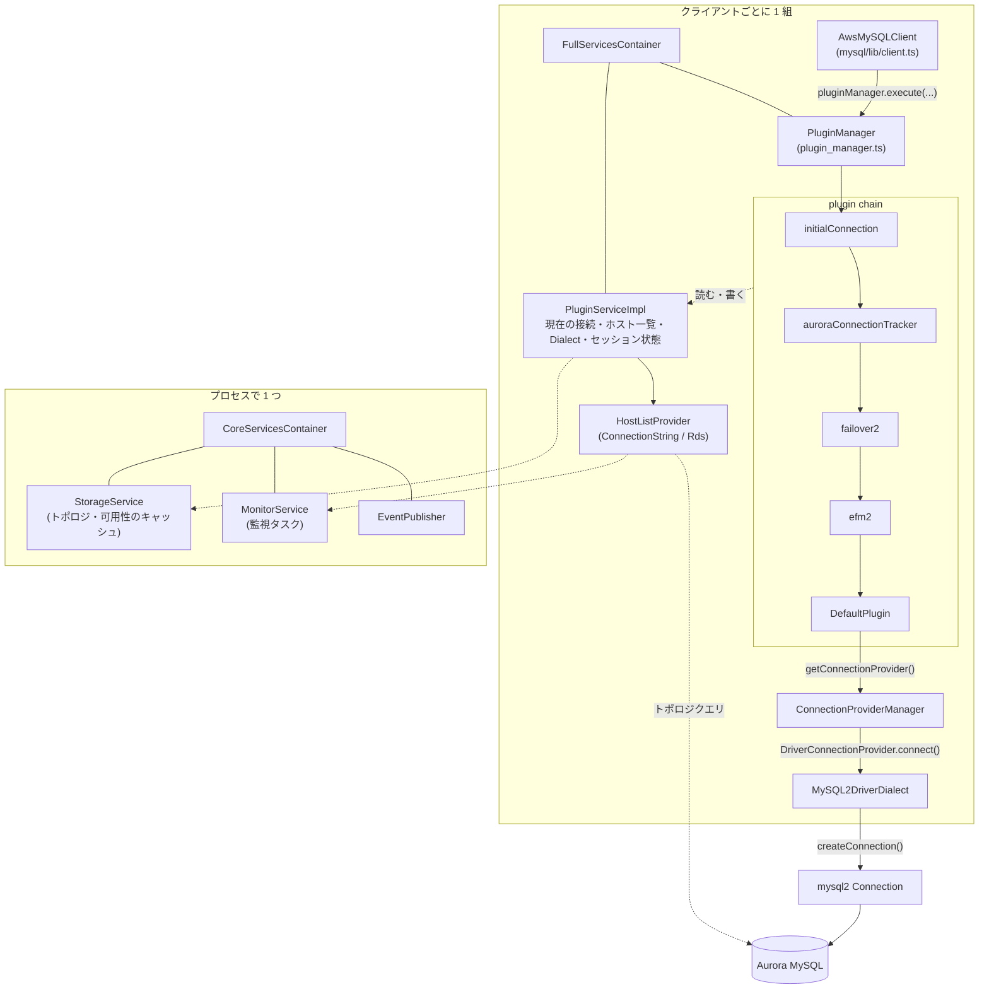
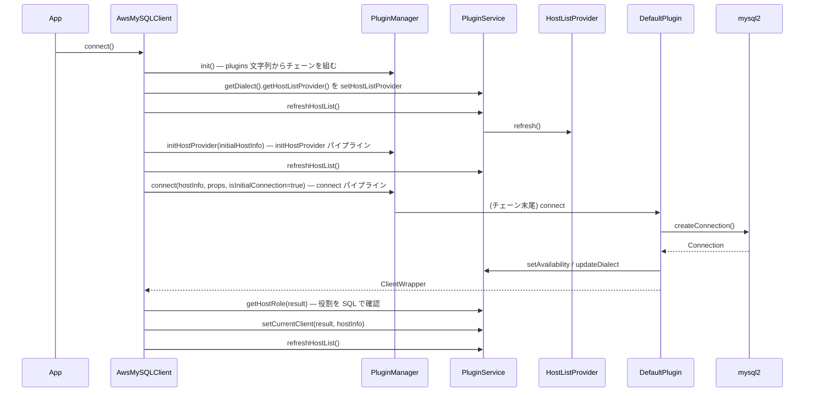

## この層の責務

このラッパは mysql2 の `createConnection` を自分で呼ぶ以外、DB とは何も話さない。やっているのは、アプリが `client.query()` を呼んでから mysql2 の `connection.query()` に届くまでの**間に割り込む**ことだけである。

割り込みの仕掛けは 1 種類しかない。全メソッドが `PluginManager.execute()` を通り、そこで**プラグインの列がクロージャとして入れ子になる**。フェイルオーバーも、監視も、IAM トークンの生成も、全部この入れ子のどこかの層でやっている。

だから、この群 (骨格) を読み終えたときに答えられるべき問いは 3 つある。

- `client.query()` を呼んだとき、**誰が、どの順で、何を挟んで** mysql2 に届くのか
- プラグイン同士は**何を共有して**いるのか (答え: `PluginService` だけ)
- **何がクライアントごとで、何がプロセスで 1 つ**なのか

以降のページは全部、この 3 つの答えを前提に書かれている。

## 主要な型とその関係



| 型                      | 場所                                                                                                                                                                                                                  | 何を持つか                                                                      | 単位                    |
| ----------------------- | --------------------------------------------------------------------------------------------------------------------------------------------------------------------------------------------------------------------- | ------------------------------------------------------------------------------- | ----------------------- |
| `AwsMySQLClient`        | [`mysql/lib/client.ts#L51`](https://github.com/aws/aws-advanced-nodejs-wrapper/blob/6d0ba1bdae81a4e1fd274b3569c5dc50cf0a7095/mysql/lib/client.ts#L51)                                                                 | アプリが触る面。`targetClient` (= mysql2 接続の包み) と `properties`            | クライアント            |
| `PluginManager`         | [`common/lib/plugin_manager.ts#L70`](https://github.com/aws/aws-advanced-nodejs-wrapper/blob/6d0ba1bdae81a4e1fd274b3569c5dc50cf0a7095/common/lib/plugin_manager.ts#L70)                                               | プラグインの配列 `_plugins`。呼び出しごとにチェーンを組む                       | クライアント            |
| `ConnectionPlugin` × N  | [`common/lib/connection_plugin.ts#L24`](https://github.com/aws/aws-advanced-nodejs-wrapper/blob/6d0ba1bdae81a4e1fd274b3569c5dc50cf0a7095/common/lib/connection_plugin.ts#L24)                                         | 割り込みの本体。末尾は必ず `DefaultPlugin`                                      | クライアント            |
| `PluginServiceImpl`     | [`common/lib/plugin_service.ts#L166`](https://github.com/aws/aws-advanced-nodejs-wrapper/blob/6d0ba1bdae81a4e1fd274b3569c5dc50cf0a7095/common/lib/plugin_service.ts#L166)                                             | 現在の接続、ホスト一覧、Dialect、セッション状態。プラグインが共有する唯一の状態 | クライアント            |
| `HostListProvider`      | [`common/lib/host_list_provider/host_list_provider.ts#L24`](https://github.com/aws/aws-advanced-nodejs-wrapper/blob/6d0ba1bdae81a4e1fd274b3569c5dc50cf0a7095/common/lib/host_list_provider/host_list_provider.ts#L24) | トポロジの出所。Dialect が決める                                                | クライアント            |
| `MySQL2DriverDialect`   | [`mysql/lib/dialect/mysql2_driver_dialect.ts#L30`](https://github.com/aws/aws-advanced-nodejs-wrapper/blob/6d0ba1bdae81a4e1fd274b3569c5dc50cf0a7095/mysql/lib/dialect/mysql2_driver_dialect.ts#L30)                   | mysql2 の `createConnection` を呼ぶ唯一の場所                                   | クライアント (状態なし) |
| `CoreServicesContainer` | [`common/lib/utils/core_services_container.ts#L29`](https://github.com/aws/aws-advanced-nodejs-wrapper/blob/6d0ba1bdae81a4e1fd274b3569c5dc50cf0a7095/common/lib/utils/core_services_container.ts#L29)                 | `StorageService` / `MonitorService` / `EventPublisher`                          | **プロセス**            |

「クライアントごと」の列は `docs/development-guide/Architecture.md` の NOTE にそのまま書いてある。

> Each client has its own instances of: plugin manager / plugin service / loaded plugin classes. Multiple clients opened to the same database server will have separate sets of instances mentioned above.

つまり `new AwsMySQLClient()` を 10 回呼べば、プラグインの列も `PluginService` も 10 組できる。それでもクラスタのトポロジを 10 回別々に問い合わせないのは、トポロジのキャッシュとそれを更新するモニタが**プロセスで 1 つ**の `CoreServicesContainer` 側に置かれているからである ([CoreServicesContainer](../core-services-container/))。

## 処理の流れ

### 組み立て: `new AwsMySQLClient(config)`

`AwsClient` のコンストラクタ ([`common/lib/aws_client.ts#L60`](https://github.com/aws/aws-advanced-nodejs-wrapper/blob/6d0ba1bdae81a4e1fd274b3569c5dc50cf0a7095/common/lib/aws_client.ts#L60)) がやることは 3 つに絞れる。

```ts title="common/lib/aws_client.ts (抜粋)"
this.properties = new Map<string, any>(Object.entries(config));
// ... profileName の処理 (MySQL では使わない) ...
const coreServicesContainer: CoreServicesContainer = CoreServicesContainer.getInstance();
this.storageService = coreServicesContainer.storageService;
this.monitorService = coreServicesContainer.monitorService;
this.eventPublisher = coreServicesContainer.eventPublisher;
this.telemetryFactory = new DefaultTelemetryFactory(this.properties);

this.fullServiceContainer = ServiceUtils.instance.createStandardServiceContainer(
  this.storageService,
  this.monitorService,
  this.eventPublisher,
  this,
  this.properties,
  dbType,
  knownDialectsByCode,
  this._configurationProfile?.getDriverDialect() ?? driverDialect,
  this.telemetryFactory,
  connectionProvider,
);

this.pluginService = this.fullServiceContainer.pluginService;
this.pluginManager = this.fullServiceContainer.pluginManager;
```

1. **設定オブジェクトを `Map` にする。** 以降ラッパの中では `config` ではなく `properties: Map<string, any>` が回る。mysql2 に渡す直前に、ラッパ固有のキーだけを剥がす ([WrapperProperties](../wrapper-properties/))
2. **プロセス唯一の `CoreServicesContainer` を掴む**
3. **`FullServicesContainer` を作る。** この中で `PluginServiceImpl` と `PluginManager` が生成され、相互参照が結ばれる ([`service_utils.ts#L43`](https://github.com/aws/aws-advanced-nodejs-wrapper/blob/6d0ba1bdae81a4e1fd274b3569c5dc50cf0a7095/common/lib/utils/service_utils.ts#L43))

この時点では**プラグインはまだ 1 つも作られていない**。`plugins` 文字列の解釈は `connect()` の中で起きる。

### 接続: `client.connect()`

[`mysql/lib/client.ts#L71`](https://github.com/aws/aws-advanced-nodejs-wrapper/blob/6d0ba1bdae81a4e1fd274b3569c5dc50cf0a7095/mysql/lib/client.ts#L71) と [`aws_client.ts#L138`](https://github.com/aws/aws-advanced-nodejs-wrapper/blob/6d0ba1bdae81a4e1fd274b3569c5dc50cf0a7095/common/lib/aws_client.ts#L138) を合わせると、順序はこうなる。



見ておくべき点が 3 つある。

- **`pluginManager.init()` はここで初めて呼ばれる。** `setup()` ([`aws_client.ts#L133`](https://github.com/aws/aws-advanced-nodejs-wrapper/blob/6d0ba1bdae81a4e1fd274b3569c5dc50cf0a7095/common/lib/aws_client.ts#L133)) の中。`plugins` の値が不正でも、コンストラクタでは例外にならない
- **`refreshHostList()` が 3 回呼ばれる。** 1 回目は接続文字列を解釈するため、2 回目は `initHostProvider` パイプラインでプラグインが `HostListProvider` を差し替えた場合に備えて、3 回目は接続後にトポロジクエリを実行するため。1〜2 回目は接続がないので `ConnectionStringHostListProvider` なら文字列のパース、`RdsHostListProvider` なら初期ホストだけが返る
- **接続後に役割を SQL で確認する。** `getHostRole(result)` は Aurora なら `SELECT @@innodb_read_only`。接続文字列から推測した役割 (cluster-ro なら READER、それ以外は WRITER) を、実際の接続で上書きする。クラスタエンドポイントが古い writer を指していた場合に、ここで初めて「実は reader だった」と分かる

### 実行: `client.query()`

[`mysql/lib/client.ts#L517`](https://github.com/aws/aws-advanced-nodejs-wrapper/blob/6d0ba1bdae81a4e1fd274b3569c5dc50cf0a7095/mysql/lib/client.ts#L517)。

```ts title="mysql/lib/client.ts"
async query(options: string | QueryOptions, values?: any): Promise<[any, any]> {
  if (!this.isConnected) {
    await this.connect(); // client.connect is not required for MySQL clients
    this.isConnected = true;
  }
  const host = this.pluginService.getCurrentHostInfo();
  const context = this.telemetryFactory.openTelemetryContext("awsClient.query", TelemetryTraceLevel.TOP_LEVEL);
  return await context.start(async () => {
    return await this.pluginManager.execute(
      host,
      this.properties,
      "query",
      async () => {
        if (!this.targetClient) {
          throw new UndefinedClientError();
        }
        await this.updateState(this.targetClient.client, options, values);
        return await ClientUtils.queryWithTimeout(this.targetClient.client?.query(options, values), this.properties);
      },
      [options, values]
    );
  });
}
```

`pluginManager.execute(host, props, "query", fn, args)` の 5 引数がこの章の中心語彙になる。

| 引数      | 意味                                                                       |
| --------- | -------------------------------------------------------------------------- |
| `host`    | 現在の接続先 `HostInfo`。null なら即例外                                   |
| `props`   | `properties` Map                                                           |
| `"query"` | メソッド名。プラグインはこの名前で購読の可否を決める                       |
| `fn`      | **最内側で実行される本体**。mysql2 の `query` を呼ぶクロージャ             |
| `args`    | プラグインが引数を覗くための配列。readWriteSplitting はここから SQL を読む |

`fn` の中で `this.targetClient` を**呼び出し時に**読んでいることに注意してほしい。フェイルオーバーで `targetClient` が差し替わった後に再実行されても、新しい接続を掴む。これが「接続を差し替えても壊れない」の最小単位である。

## 守られている不変条件

- **`DefaultPlugin` が常にチェーンの末尾にいる。** `ConnectionPluginChainBuilder.getPlugins` が最後に `push` する ([`connection_plugin_chain_builder.ts#L175`](https://github.com/aws/aws-advanced-nodejs-wrapper/blob/6d0ba1bdae81a4e1fd274b3569c5dc50cf0a7095/common/lib/connection_plugin_chain_builder.ts#L175))。`plugins: ""` でも `DefaultPlugin` だけは残る。「プラグインなし = mysql2 と同じ挙動」は、この 1 個が接続と実行の終端を担うから成立する
- **プラグインは接続を自分で張らない。** 張るのは `DefaultPlugin` → `ConnectionProvider` → `DriverDialect` の 1 本道だけ。プラグインが新しい接続を欲しがるときは `pluginService.connect()` / `forceConnect()` を呼び、それが `PluginManager` の connect パイプラインに戻る
- **プラグインは共有状態のローカルコピーを持たない。** 現在の接続もホスト一覧も `PluginService` から都度取る。`docs/development-guide/LoadablePlugins.md` の "What is Not Allowed" の 1 番目
- **`PluginService` は `AwsClient` を知っているが、`AwsClient` の型に依存しない。** `getCurrentClient()` が返すのは `AwsClient` で、`targetClient` の差し替えは `pluginService.setCurrentClient()` が `this.getCurrentClient().targetClient = newClient` と書き込む形で行う。つまり `AwsMySQLClient.targetClient` の所有者は実質 `PluginService` である

## つまずきどころ

- **`connect()` を呼ばなくても動く**が、それは `query()` が内部で `connect()` を呼ぶからで、mysql2 の「`createConnection` した時点で接続が始まる」挙動とは違う。`new AwsMySQLClient()` の直後はソケットすら開いていない
- **コンストラクタは例外を投げにくい。** `plugins` のタイプミス (`unknownPluginCode`) も、`dialect` の不正も、`connect()` まで分からない。設定検証を起動時にやりたければ `connect()` を起動シーケンスに入れる
- **`PluginManager` と `PluginService` の境界が読みにくい。** 目安は「呼び出しの流れを組むのが Manager、状態を持つのが Service」。Manager は `_plugins` 以外ほぼ状態を持たず、Service は `hosts` / `_currentHostInfo` / `dialect` / `sessionStateService` を持つ
- **`FullServicesContainer` はプラグインに丸ごと渡される。** プラグインのファクトリは `getInstance(servicesContainer, props)` で受け取るので、どのプラグインも `pluginManager` にも `storageService` にも触れる。境界は型ではなく規律で守られている
- **静的なものが 4 つある。** `CoreServicesContainer.INSTANCE`、`PluginManager.PLUGINS` (全クライアントのプラグインの和集合、`releaseResources` 用)、`PluginManager.STRATEGY_PLUGIN_CHAIN_CACHE`、`DatabaseDialectManager.knownEndpointDialects`。テストや hot reload で「前の接続の状態が残る」と感じたら、この 4 つを疑う
