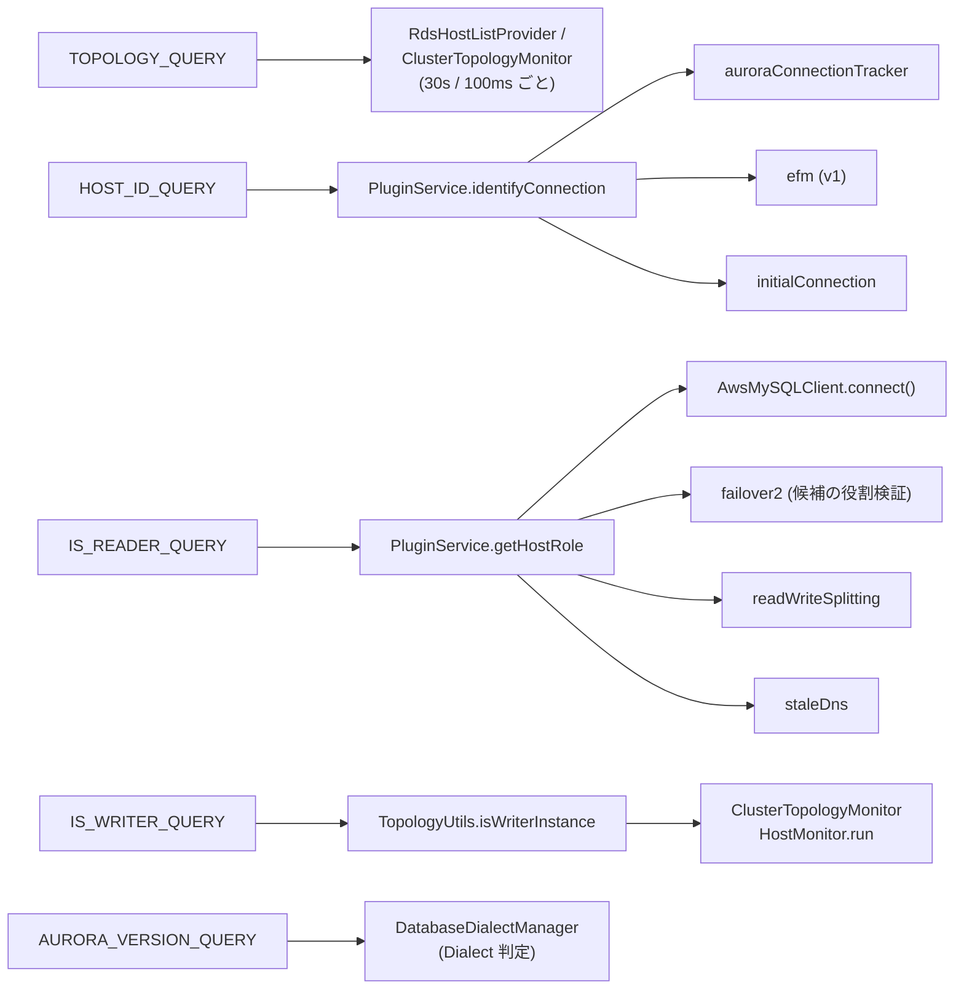

## 何を学んだか

ラッパが Aurora MySQL から「知識」を得る手段は、`AuroraMySQLDatabaseDialect` に定数として並ぶ **5 本の SQL** に尽きる。

| 定数                   | SQL                                                                                                                   | 答える問い                                                    |
| ---------------------- | --------------------------------------------------------------------------------------------------------------------- | ------------------------------------------------------------- |
| `TOPOLOGY_QUERY`       | `SELECT ... FROM information_schema.replica_host_status WHERE ...`                                                    | クラスタに誰がいて、誰が writer で、どれくらい遅れているか    |
| `HOST_ID_QUERY`        | `SELECT @@aurora_server_id as host`                                                                                   | この接続はどのインスタンスか                                  |
| `IS_READER_QUERY`      | `SELECT @@innodb_read_only as is_reader`                                                                              | この接続先は reader か                                        |
| `IS_WRITER_QUERY`      | `SELECT server_id FROM replica_host_status WHERE SESSION_ID = 'MASTER_SESSION_ID' AND SERVER_ID = @@aurora_server_id` | この接続先は writer か (トポロジ表と自分の名前を突き合わせる) |
| `AURORA_VERSION_QUERY` | `SHOW VARIABLES LIKE 'aurora_version'`                                                                                | そもそも Aurora か                                            |

この 5 本が、群 3 (トポロジ)・群 4 (フェイルオーバー)・群 5 (EFM) のほぼ全ページの土台になる。ここで覚えておくべき性質は 2 つ。

- `replica_host_status` は**各インスタンスが持つローカルコピー**で、フェイルオーバー直後は古いことがある
- `@@innodb_read_only` は**そのインスタンス自身の状態**で、コピーではない

だからラッパは、「誰が writer か」を表から読むのではなく、`IS_WRITER_QUERY` で「表の writer 行が自分の名前と一致するか」を聞く。表 (コピー) と変数 (自身) を 1 クエリで突き合わせる形になっている。

## ソースコードのどこか

### 5 本の定数

[`mysql/lib/dialect/aurora_mysql_database_dialect.ts#L30`](https://github.com/aws/aws-advanced-nodejs-wrapper/blob/6d0ba1bdae81a4e1fd274b3569c5dc50cf0a7095/mysql/lib/dialect/aurora_mysql_database_dialect.ts#L30)。

```ts title="mysql/lib/dialect/aurora_mysql_database_dialect.ts"
export class AuroraMySQLDatabaseDialect extends MySQLDatabaseDialect implements TopologyAwareDatabaseDialect, BlueGreenDialect {
  private static readonly TOPOLOGY_QUERY: string =
    "SELECT server_id, CASE WHEN SESSION_ID = 'MASTER_SESSION_ID' THEN TRUE ELSE FALSE END as is_writer, " +
    "cpu, REPLICA_LAG_IN_MILLISECONDS as 'lag', LAST_UPDATE_TIMESTAMP as last_update_timestamp " +
    "FROM information_schema.replica_host_status " +
    // filter out nodes that haven't been updated in the last 5 minutes
    "WHERE time_to_sec(timediff(now(), LAST_UPDATE_TIMESTAMP)) <= 300 OR SESSION_ID = 'MASTER_SESSION_ID' ";
  private static readonly HOST_ID_QUERY: string = "SELECT @@aurora_server_id as host";
  private static readonly IS_READER_QUERY: string = "SELECT @@innodb_read_only as is_reader";
  private static readonly IS_WRITER_QUERY: string =
    "SELECT server_id " +
    "FROM information_schema.replica_host_status " +
    "WHERE SESSION_ID = 'MASTER_SESSION_ID' AND SERVER_ID = @@aurora_server_id";
  protected static readonly INSTANCE_ID_QUERY: string = "SELECT @@aurora_server_id as instance_id, @@aurora_server_id as instance_name";
  private static readonly AURORA_VERSION_QUERY = "SHOW VARIABLES LIKE 'aurora_version'";

  private static readonly BG_STATUS_QUERY: string = "SELECT * FROM mysql.rds_topology";
  private static readonly TOPOLOGY_TABLE_EXIST_QUERY: string =
    "SELECT 1 AS tmp FROM information_schema.tables WHERE table_schema = 'mysql' AND table_name = 'rds_topology'";
```

`INSTANCE_ID_QUERY` は `@@aurora_server_id` を 2 列に複製しているだけで、Multi-AZ 版で `id` と `instance_name` が別物になる ([RDS Multi-AZ DB Cluster](../rds-multi-az-cluster/)) のに合わせたインタフェースである。末尾の `BG_STATUS_QUERY` / `TOPOLOGY_TABLE_EXIST_QUERY` は Blue/Green 用で、[次のページ](../rds-topology-table/) に回す。

### `replica_host_status` の列と、5 分フィルタ

`information_schema.replica_host_status` は Aurora だけにある表で、クラスタ内の各インスタンスにつき 1 行ある。ラッパが使う列は次の 5 つ。

| 列                            | 意味                                                        | ラッパでの用途                                      |
| ----------------------------- | ----------------------------------------------------------- | --------------------------------------------------- |
| `SERVER_ID`                   | インスタンス識別子 (DB インスタンス名)                      | `HostInfo.hostId` と、テンプレートの `?` に入る名前 |
| `SESSION_ID`                  | writer なら固定文字列 `MASTER_SESSION_ID`、reader なら UUID | `is_writer` の判定                                  |
| `CPU`                         | CPU 使用率                                                  | 重み                                                |
| `REPLICA_LAG_IN_MILLISECONDS` | レプリカ遅延                                                | 重み                                                |
| `LAST_UPDATE_TIMESTAMP`       | その行が最後に更新された時刻                                | 5 分フィルタと、writer 重複時の判定                 |

`WHERE` 句の `time_to_sec(timediff(now(), LAST_UPDATE_TIMESTAMP)) <= 300 OR SESSION_ID = 'MASTER_SESSION_ID'` は、**5 分以上更新のない行を落とす、ただし writer 行は落とさない**という意味である。削除されたインスタンスの行がしばらく残ることがあり、それを「まだいる」と誤認しないためのフィルタだ。writer 行を除外条件から外しているのは、writer が 1 台もいないトポロジより古い writer 行が残るほうがましだからと読める。

`queryForTopology` ([`#L54`](https://github.com/aws/aws-advanced-nodejs-wrapper/blob/6d0ba1bdae81a4e1fd274b3569c5dc50cf0a7095/mysql/lib/dialect/aurora_mysql_database_dialect.ts#L54)) が結果を `TopologyQueryResult` にする。

```ts title="mysql/lib/dialect/aurora_mysql_database_dialect.ts"
rows.forEach((row) => {
  // According to the topology query the result set
  // should contain 4 columns: node ID, 1/0 (writer/reader), CPU utilization, node lag in time.
  const hostName: string = row["server_id"];
  const isWriter: boolean = row["is_writer"];
  const cpuUtilization: number = row["cpu"];
  const hostLag: number = row["lag"];
  const lastUpdateTime: number = row["last_update_timestamp"]
    ? Date.parse(row["last_update_timestamp"])
    : Date.now();
  const result: TopologyQueryResult = new TopologyQueryResult({
    host: hostName,
    isWriter: isWriter,
    weight: Math.round(hostLag) * 100 + Math.round(cpuUtilization),
    lastUpdateTime: lastUpdateTime,
  });
  results.push(result);
});
```

`weight = lag × 100 + cpu`。遅延 1ms が CPU 1% の 100 倍重い。この重みは `roundRobin` 選択戦略で使われる ([ホスト可用性戦略と選択戦略](../host-availability-and-selection/))。

その後 `AuroraTopologyUtils.createHosts` ([`aurora_topology_utils.ts#L43`](https://github.com/aws/aws-advanced-nodejs-wrapper/blob/6d0ba1bdae81a4e1fd274b3569c5dc50cf0a7095/common/lib/host_list_provider/aurora_topology_utils.ts#L43)) が名前をエンドポイントに変換し、`verifyWriter` ([`topology_utils.ts#L151`](https://github.com/aws/aws-advanced-nodejs-wrapper/blob/6d0ba1bdae81a4e1fd274b3569c5dc50cf0a7095/common/lib/host_list_provider/topology_utils.ts#L151)) が「writer は 1 台だけ」を保証する。writer が 2 行あれば `lastUpdateTime` の新しいほうを採り、0 行なら `null` を返してトポロジ全体を無効にする。

### 自分は誰か、自分は reader か

`identifyConnection` と `getHostRole` ([`#L77`](https://github.com/aws/aws-advanced-nodejs-wrapper/blob/6d0ba1bdae81a4e1fd274b3569c5dc50cf0a7095/mysql/lib/dialect/aurora_mysql_database_dialect.ts#L77))。

```ts title="mysql/lib/dialect/aurora_mysql_database_dialect.ts"
async identifyConnection(targetClient: ClientWrapper): Promise<string> {
  const res = await targetClient.query(AuroraMySQLDatabaseDialect.HOST_ID_QUERY);
  return res[0][0]["host"] ?? "";
}

async getHostRole(targetClient: ClientWrapper): Promise<HostRole> {
  const res = await targetClient.query(AuroraMySQLDatabaseDialect.IS_READER_QUERY);
  return Promise.resolve(res[0][0]["is_reader"] === 1 ? HostRole.READER : HostRole.WRITER);
}
```

`@@innodb_read_only` は、Aurora が reader インスタンスで `1` にする InnoDB の変数である。素の MySQL では `innodb_read_only` は「読み取り専用モードで起動したか」を示す起動オプションで、レプリカでも通常 `0` だ。Aurora はこれを役割のフラグとして転用している。

### 「自分は writer か」を 1 クエリで

`getWriterId` ([`#L87`](https://github.com/aws/aws-advanced-nodejs-wrapper/blob/6d0ba1bdae81a4e1fd274b3569c5dc50cf0a7095/mysql/lib/dialect/aurora_mysql_database_dialect.ts#L87))。

```ts title="mysql/lib/dialect/aurora_mysql_database_dialect.ts"
async getWriterId(targetClient: ClientWrapper): Promise<string | null> {
  const res = await targetClient.query(AuroraMySQLDatabaseDialect.IS_WRITER_QUERY);
  try {
    const writerId: string = res[0][0]["server_id"];
    return writerId ? writerId : null;
  } catch (e: any) {
    if (e.message.includes("Cannot read properties of undefined")) {
      // Query returned no result, targetClient is not connected to a writer.
      return null;
    }
    throw e;
  }
}
```

`IS_WRITER_QUERY` は「`replica_host_status` の writer 行の `SERVER_ID` が、`@@aurora_server_id` (自分の名前) と等しい」ときだけ 1 行返す。reader で打てば 0 行で、`res[0][0]` が `undefined` になり、`["server_id"]` で `TypeError` が飛ぶ。それを `"Cannot read properties of undefined"` というメッセージ文字列で捕まえている。V8 のエラーメッセージに依存した書き方で、`rows.length === 0` を見れば済むところだが、そうなっている。

この関数を呼ぶのは `TopologyUtils.isWriterInstance` ([`#L208`](https://github.com/aws/aws-advanced-nodejs-wrapper/blob/6d0ba1bdae81a4e1fd274b3569c5dc50cf0a7095/common/lib/host_list_provider/topology_utils.ts#L208)) で、それを呼ぶのは `ClusterTopologyMonitor` の 2 か所 ([`#L294`](https://github.com/aws/aws-advanced-nodejs-wrapper/blob/6d0ba1bdae81a4e1fd274b3569c5dc50cf0a7095/common/lib/host_list_provider/monitoring/cluster_topology_monitor.ts#L294)、[`#L899`](https://github.com/aws/aws-advanced-nodejs-wrapper/blob/6d0ba1bdae81a4e1fd274b3569c5dc50cf0a7095/common/lib/host_list_provider/monitoring/cluster_topology_monitor.ts#L899)) だけである。パニックモードで全ホストに張った監視接続が、それぞれ自分の接続先にこれを打つ ([「自分は writer か」を全ホストに聞く](../am-i-a-writer/))。

### 誰がどのクエリを呼ぶか

`grep` で追うと、5 本のクエリの呼び出し元はこう分かれる。



`getHostRole` の呼び出し元が一番多い。`AwsMySQLClient.connect()` は繋いだ直後に役割を確かめて `HostInfo.role` を上書きし、failover2 は候補ホストに繋いだ後で「本当に writer か」を確かめてから `setCurrentClient` する。**接続を確立しても、役割を確認するまで信用しない**のがこのラッパの基本姿勢で、その確認手段が `@@innodb_read_only` である。

### Dialect の判定

`isDialect` ([`#L116`](https://github.com/aws/aws-advanced-nodejs-wrapper/blob/6d0ba1bdae81a4e1fd274b3569c5dc50cf0a7095/mysql/lib/dialect/aurora_mysql_database_dialect.ts#L116)) は `SHOW VARIABLES LIKE 'aurora_version'` の `Value` が空でなければ Aurora とみなす。素の MySQL や RDS MySQL にはこの変数が無く、空の結果が返る。`getDialectUpdateCandidates` は `GLOBAL_AURORA_MYSQL` と `RDS_MULTI_AZ_MYSQL` を返し、Aurora と判定された後にさらに Global Database か Multi-AZ かを調べる ([Dialect の自動判定](../dialect-resolution/))。

## なぜそうなっているか

### なぜ表 (コピー) と変数 (自身) を分けて持つのか

`replica_host_status` は Aurora のストレージ層から各インスタンスに配られる情報で、ハートビートで更新される。だから `LAST_UPDATE_TIMESTAMP` があり、古い行を落とすフィルタが要る。フェイルオーバー直後は、新 writer だけが真の構成を知っていて、reader のコピーは数秒遅れる。

`@@innodb_read_only` はそのインスタンス自身のプロセスの状態で、遅れようがない。だから「役割を確かめる」ときは必ずこちらを使い、表は「誰がいるか」の一覧としてだけ使う。`IS_WRITER_QUERY` はその中間で、表の writer 行と自分の名前を突き合わせるので、**自分が writer であるかどうかについては**表のコピーが古くても正しい答えが出る (自分が writer になったばかりなら自分の表は最新だから)。

### なぜトポロジ取得に権限が要らないのか

`information_schema` は全ユーザが読める。`replica_host_status` も同様なので、アプリ用の一般ユーザでトポロジが取れる。Multi-AZ の `mysql.rds_topology` は `mysql` スキーマにあって `GRANT SELECT ON mysql.*` が要るのと対照的で、Aurora 側が「クラスタ構成はクライアントが自由に読んでよい情報」として設計していることが分かる。

### なぜ Dialect 判定を `aurora_version` にしたのか

`replica_host_status` の存在を `information_schema.tables` で確かめる手もある。`aurora_version` を選んだのは、1 クエリで済み、結果が単純 (行があるか無いか) だからだろう。副作用として、Aurora でも権限の都合で `information_schema` の一部が見えないような特殊な環境でも判定できる。

## どう活かすか

- **「一覧」と「自身の状態」を別のソースから取り、役割の判断は後者に寄せる。** 分散システムのメンバーシップ情報は必ずどこかで遅れる。決定的な判断 (ここに書き込んでいいか) は、対象自身に聞く
- **古い行を落とすフィルタを SQL 側に置く。** ラッパは取得後に JavaScript で除外するのではなく、`WHERE` で落としている。取得元の時刻 (`now()`) で判定できるので、クライアントの時計ずれの影響を受けない
- **重みの式は単純でよい。** `lag × 100 + cpu` は根拠のある定数ではないが、「遅延が支配的、CPU は同点の判定用」という意図が式から読める。細かい調整より、意図が読める式のほうが運用で扱いやすい
- **例外メッセージで分岐しない。** `getWriterId` の `"Cannot read properties of undefined"` は反面教師で、`rows.length` を見るべき場所である。自分のコードでは避ける

### 実務で踏む失敗パターン

- **削除したインスタンスがトポロジに残る。** 5 分フィルタがあるので、削除後 5 分以内はまだ「いる」ように見え、接続試行が失敗する。フェイルオーバー先の候補にはならないが (`NOT_AVAILABLE` になる)、ログには出る
- **`@@innodb_read_only` を素の MySQL の意味で読む。** Aurora 固有の転用なので、RDS MySQL や自前の MySQL では役割の判定に使えない。Multi-AZ は `@@read_only` を使う
- **reader で取ったトポロジを正とする。** フェイルオーバー直後に自分でこの表を読むツールを書くなら、writer から読むか、`SESSION_ID` の変化を複数ホストで突き合わせる
