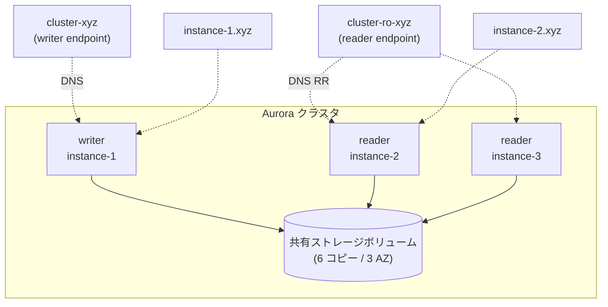

## 何を学んだか

Aurora MySQL のクラスタは、**1 つの共有ストレージボリュームの上に、writer 1 台と reader 最大 15 台が乗っている**。クライアントから見えるのは、その各インスタンスを指す DNS 名と、クラスタ全体を代表する DNS 名だ。

| エンドポイント    | 形                                                       | 指す先                                    |
| ----------------- | -------------------------------------------------------- | ----------------------------------------- |
| クラスタ (writer) | `<cluster>.cluster-<xyz>.<region>.rds.amazonaws.com`     | 現在の writer 1 台                        |
| リーダー          | `<cluster>.cluster-ro-<xyz>.<region>.rds.amazonaws.com`  | reader のどれか 1 台 (DNS ラウンドロビン) |
| カスタム          | `<name>.cluster-custom-<xyz>.<region>.rds.amazonaws.com` | ユーザが指定したインスタンス群のどれか    |
| インスタンス      | `<instance>.<xyz>.<region>.rds.amazonaws.com`            | 特定の 1 台                               |

この章のラッパは、これらの DNS 名を **3 つの用途**にしか使わない。

1. 正規表現で分類して、どのプラグインの挙動を有効にするか決める (`RdsUtils.identifyRdsType`)
2. 最初の 1 本を張るための宛先にする
3. ドメイン部分を切り出して、`?.<xyz>.<region>.rds.amazonaws.com` という**インスタンスエンドポイントのテンプレート**を作る

「今どれが writer か」「何台いるか」は DNS からは決して読まない。それは DB 自身に SQL で聞く ([Aurora MySQL の自己申告メタデータ](../aurora-metadata/))。DNS 名は入口であって、真実ではない。



## ソースコードのどこか

### エンドポイント一覧は互換性表に書いてある

ラッパの docs は、扱う URL 種別を [`CompatibilityEndpoints.md`](https://github.com/aws/aws-advanced-nodejs-wrapper/blob/6d0ba1bdae81a4e1fd274b3569c5dc50cf0a7095/docs/using-the-nodejs-wrapper/compatibility/CompatibilityEndpoints.md) の冒頭で列挙している。Aurora の 4 種に加えて、Global Database (`<name>.global-<xyz>.global.rds.amazonaws.com`)、RDS Multi-AZ DB Cluster (Aurora と同じ `cluster-` / `cluster-ro-` の形)、RDS Proxy (`proxy-`)、Limitless (`shardgrp-`)、IP アドレス、カスタムドメインの計 12 種類がある。

同じ docs の表を読むと、**エンドポイント種別ごとに使えるプラグインが違う**ことが分かる。たとえば `staleDns` は writer クラスタエンドポイントでしか意味がなく (それ以外は ✗)、`initialConnection` はクラスタ / リーダーエンドポイント限定、`customEndpoint` はカスタムエンドポイント限定である。IP アドレスとカスタムドメインは failover 系が「requires special configuration」になっていて、それがこのページの最後に出てくる `clusterInstanceHostPattern` である。

### DNS 名を正規表現で分類する

[`common/lib/utils/rds_utils.ts#L88`](https://github.com/aws/aws-advanced-nodejs-wrapper/blob/6d0ba1bdae81a4e1fd274b3569c5dc50cf0a7095/common/lib/utils/rds_utils.ts#L88)。

```ts title="common/lib/utils/rds_utils.ts"
private static readonly AURORA_DNS_PATTERN =
  /^(?<instance>.+)\.(?<dns>proxy-|cluster-|cluster-ro-|cluster-custom-|shardgrp-)?(?<domain>[a-zA-Z0-9]+\.(?<region>[a-zA-Z0-9-]+)\.(rds|rds-fips)\.amazonaws\.(com|au|eu|uk)\.?)$/i;
private static readonly AURORA_CLUSTER_PATTERN =
  /^(?<instance>.+)\.(?<dns>cluster-|cluster-ro-)+(?<domain>[a-zA-Z0-9]+\.(?<region>[a-zA-Z0-9-]+)\.(rds|rds-fips)\.amazonaws\.(com|au|eu|uk)\.?)$/i;
```

名前付きグループが 4 つある。`instance` がクラスタ名またはインスタンス名、`dns` が `cluster-` / `cluster-ro-` などの接頭辞 (省略可能で、無ければインスタンスエンドポイント)、`domain` が `<xyz>.<region>.rds.amazonaws.com`、`region` がその中のリージョンである。中国 (`amazonaws.com.cn`、`rds` と region の順序が逆)、GovCloud / ISO (`c2s.ic.gov` など)、FIPS (`rds-fips`) 用に、同じ構造の正規表現が計 10 本並んでいる。

分類の入口は `identifyRdsType` ([`#L427`](https://github.com/aws/aws-advanced-nodejs-wrapper/blob/6d0ba1bdae81a4e1fd274b3569c5dc50cf0a7095/common/lib/utils/rds_utils.ts#L427)) で、判定順に意味がある。

```ts title="common/lib/utils/rds_utils.ts"
public identifyRdsType(host: string): RdsUrlType {
  if (!host) {
    return RdsUrlType.OTHER;
  }

  const preparedHost = RdsUtils.getPreparedHost(host);
  if (this.isIPv4(preparedHost) || this.isIPv6(preparedHost)) {
    return RdsUrlType.IP_ADDRESS;
  } else if (this.isGlobalDbWriterClusterDns(preparedHost)) {
    return RdsUrlType.RDS_GLOBAL_WRITER_CLUSTER;
  } else if (this.isWriterClusterDns(preparedHost)) {
    return RdsUrlType.RDS_WRITER_CLUSTER;
  } else if (this.isReaderClusterDns(preparedHost)) {
    return RdsUrlType.RDS_READER_CLUSTER;
  } else if (this.isRdsCustomClusterDns(preparedHost)) {
    return RdsUrlType.RDS_CUSTOM_CLUSTER;
  } else if (this.isLimitlessDbShardGroupDns(preparedHost)) {
    return RdsUrlType.RDS_AURORA_LIMITLESS_DB_SHARD_GROUP;
  } else if (this.isRdsProxyDns(preparedHost)) {
    return RdsUrlType.RDS_PROXY;
  } else if (this.isRdsProxyEndpointDns(preparedHost)) {
    return RdsUrlType.RDS_PROXY_ENDPOINT;
  } else if (this.isRdsDns(preparedHost)) {
    return RdsUrlType.RDS_INSTANCE;
  } else {
    // ELB URLs will also be classified as other
    return RdsUrlType.OTHER;
  }
}
```

`isRdsDns` (接頭辞なしの `AURORA_DNS_PATTERN` 全体一致) が**最後**にあるのは、`cluster-` 付きの名前も `AURORA_DNS_PATTERN` にはマッチしてしまうからで、より特殊な形から先に落としていく。

返り値の `RdsUrlType` は 3 つのフラグを持つ ([`rds_url_type.ts#L17`](https://github.com/aws/aws-advanced-nodejs-wrapper/blob/6d0ba1bdae81a4e1fd274b3569c5dc50cf0a7095/common/lib/utils/rds_url_type.ts#L17))。

```ts title="common/lib/utils/rds_url_type.ts"
export class RdsUrlType {
  public static readonly IP_ADDRESS = new RdsUrlType(false, false, false);
  public static readonly RDS_WRITER_CLUSTER = new RdsUrlType(true, true, true);
  public static readonly RDS_READER_CLUSTER = new RdsUrlType(true, true, true);
  public static readonly RDS_CUSTOM_CLUSTER = new RdsUrlType(true, false, true);
  public static readonly RDS_PROXY = new RdsUrlType(true, false, true);
  public static readonly RDS_PROXY_ENDPOINT = new RdsUrlType(true, false, true);
  public static readonly RDS_INSTANCE = new RdsUrlType(true, false, true);
  public static readonly RDS_AURORA_LIMITLESS_DB_SHARD_GROUP = new RdsUrlType(true, false, true);
  public static readonly RDS_GLOBAL_WRITER_CLUSTER = new RdsUrlType(true, true, false);
  public static readonly OTHER = new RdsUrlType(false, false, false);

  private constructor(
    public readonly isRds: boolean,
    public readonly isRdsCluster: boolean,
    public readonly hasRegion: boolean,
  ) {}
}
```

`isRdsCluster` が true なのは writer / reader クラスタエンドポイントと Global writer だけで、カスタムエンドポイントは false である。この違いが、後で `initialConnection` プラグインや `failoverMode` の既定値 (`cluster-ro` なら `reader-or-writer`) を決めるときに効いてくる ([failoverMode と URL からの既定値](../failover-mode/))。

### インスタンスエンドポイントの「テンプレート」を作る

Aurora がトポロジとして返してくるのは `server_id`、つまり **インスタンス名だけ**である (`instance-1` のような文字列)。そこからインスタンスエンドポイント `instance-1.<xyz>.<region>.rds.amazonaws.com` を組み立てるには、ドメイン部分が要る。それを最初の接続 URL から切り出すのが `getRdsInstanceHostPattern` ([`#L230`](https://github.com/aws/aws-advanced-nodejs-wrapper/blob/6d0ba1bdae81a4e1fd274b3569c5dc50cf0a7095/common/lib/utils/rds_utils.ts#L230)) だ。

```ts title="common/lib/utils/rds_utils.ts"
public getRdsInstanceHostPattern(host: string): string {
  if (!host) {
    return "?";
  }

  const preparedHost = RdsUtils.getPreparedHost(host);
  const matcher = this.cacheMatcher(
    preparedHost,
    RdsUtils.AURORA_DNS_PATTERN,
    RdsUtils.AURORA_CHINA_DNS_PATTERN,
    RdsUtils.AURORA_OLD_CHINA_DNS_PATTERN,
    RdsUtils.AURORA_GOV_DNS_PATTERN
  );
  const group = this.getRegexGroup(matcher, RdsUtils.DOMAIN_GROUP);
  return group ? `?.${group}` : "?";
}
```

`my-cluster.cluster-abc123.us-east-1.rds.amazonaws.com` を渡すと `?.abc123.us-east-1.rds.amazonaws.com` が返る。`cluster-` 接頭辞は `dns` グループに吸われて消え、`?` がインスタンス名のプレースホルダになる。

このテンプレートは `RdsHostListProvider.initSettings` ([`rds_host_list_provider.ts#L104`](https://github.com/aws/aws-advanced-nodejs-wrapper/blob/6d0ba1bdae81a4e1fd274b3569c5dc50cf0a7095/common/lib/host_list_provider/rds_host_list_provider.ts#L104)) で `HostInfo` として保持される。

```ts title="common/lib/host_list_provider/rds_host_list_provider.ts"
this.clusterInstanceTemplate = hostInfoBuilder
  .withHost(
    WrapperProperties.CLUSTER_INSTANCE_HOST_PATTERN.get(this.properties) ??
      this.rdsHelper.getRdsInstanceHostPattern(this.originalUrl),
  )
  .withPort(WrapperProperties.PORT.get(this.properties))
  .build();

this.validateHostPatternSetting(this.clusterInstanceTemplate.host);
this.rdsUrlType = this.rdsHelper.identifyRdsType(this.initialHost.host);
```

ユーザが `clusterInstanceHostPattern` を指定していればそれが優先され、無ければ URL から自動生成する。そして使う側は `TopologyUtils.getHostEndpoint` ([`topology_utils.ts#L139`](https://github.com/aws/aws-advanced-nodejs-wrapper/blob/6d0ba1bdae81a4e1fd274b3569c5dc50cf0a7095/common/lib/host_list_provider/topology_utils.ts#L141)) で、ただ `?` を置換するだけである。

```ts title="common/lib/host_list_provider/topology_utils.ts"
protected getHostEndpoint(hostName: string, clusterInstanceTemplate: HostInfo): string | null {
  if (!clusterInstanceTemplate || !clusterInstanceTemplate.host) {
    return null;
  }
  const host = clusterInstanceTemplate.host;
  return host.replace("?", hostName);
}
```

これで、`information_schema.replica_host_status` が返す `instance-2` という文字列が `instance-2.abc123.us-east-1.rds.amazonaws.com` になり、DNS を経由せずにそのインスタンスへ直接接続できる。

## なぜそうなっているか

### 共有ストレージだから「役割」がインスタンスの属性になる

MySQL の従来のレプリケーション (binlog) では、各サーバがそれぞれのデータコピーを持ち、レプリカは常にソースの後を追う。Aurora は違う。**データは 1 つの分散ストレージ層にあり、全インスタンスがそれを読む**。writer は redo ログをストレージに書き、reader はそのストレージから同じページを読む (キャッシュ無効化の通知は writer から reader に飛ぶ)。

この構造だと、フェイルオーバーは「reader のどれかを writer に昇格させる」だけで済み、データのコピーは要らない。裏返すと、**どのインスタンスも writer になりうる**。「instance-1 が writer」というのは固定の性質ではなく、今この瞬間の役割にすぎない。だからラッパは、インスタンス名とエンドポイントを別に持ち、役割は毎回 DB に聞く。

### DNS は「最終的に正しくなる」だけ

クラスタエンドポイントは、writer が変わると AWS 側で更新される。しかし `FailoverConfigurationGuide.md` の [Writer Cluster Endpoints After Failover](https://github.com/aws/aws-advanced-nodejs-wrapper/blob/6d0ba1bdae81a4e1fd274b3569c5dc50cf0a7095/docs/using-the-nodejs-wrapper/FailoverConfigurationGuide.md#writer-cluster-endpoints-after-failover) が書くとおり、AWS の DNS が更新されるのに通常 15〜20 秒かかり、その間にあるリゾルバは更新をさらに遅らせる。この間にクラスタエンドポイントへ張った接続は、**すでに reader に降格した旧 writer** に繋がる。

ラッパの設計は、この一点から派生している。DNS 名を「たぶん正しいヒント」として初回接続に使い、繋がった先で `@@innodb_read_only` を読んで役割を確かめ (`AwsMySQLClient.connect()` の中で `getHostRole` を呼んでいる)、以降はテンプレートで組み立てたインスタンスエンドポイントで直接繋ぐ。

### テンプレートが必須になる場面

IP アドレスやカスタムドメイン (`db.example.com` を CNAME にしている) で繋ぐと、`getRdsInstanceHostPattern` は `?` しか返せず、`validateHostPatternSetting` が `?` を含まないパターンを拒否する ([`#L268`](https://github.com/aws/aws-advanced-nodejs-wrapper/blob/6d0ba1bdae81a4e1fd274b3569c5dc50cf0a7095/common/lib/host_list_provider/rds_host_list_provider.ts#L268))。トポロジから受け取ったインスタンス名をエンドポイントに変換できないと、フェイルオーバー先に繋ぎようがないからだ。これが互換性表の「requires special configuration」の正体で、[clusterInstanceHostPattern](../cluster-instance-host-pattern/) のページで詳しく読む。

同じ検証で、RDS Proxy のエンドポイントとカスタムエンドポイントは**テンプレートとして使えない**とはじかれる。Proxy は個々のインスタンスを隠すので `?` を埋めても意味のあるホストにならず、カスタムエンドポイントは一部のインスタンスしか含まないからである。

## どう活かすか

- **DNS 名は入口、真実は DB に聞く。** クラスタを扱うクライアントを書くなら、接続文字列に書かれたホスト名を「そのサービスの現在の状態」と混同しない。ホスト名は最初の 1 本を張るためのもので、構成は繋いだ先から取る
- **名前とアドレスを分ける。** Aurora が `server_id` しか返さないのは、インスタンスの同一性 (名前) とその到達方法 (エンドポイント) が別だからである。ラッパはこれを `HostInfo.hostId` と `HostInfo.host` に分けて持つ ([HostInfo と HostRole と可用性](../host-info/))
- **分類は「特殊なものから先に」。** `identifyRdsType` のように、包含関係のある正規表現を並べるときは狭い順に評価する。広いパターンを先に置くと、後段に到達しない
- **正規表現に名前付きグループを使う。** `instance` / `dns` / `domain` / `region` という名前があるから、10 本の正規表現を同じコードで扱える。インデックス参照だとリージョン順序が逆の中国パターンで破綻していた

### 実務で踏む失敗パターン

- **カスタムドメインで繋いだら起動時に例外。** `clusterInstanceHostPattern` を `?.abc123.us-east-1.rds.amazonaws.com` の形で指定する。`?` を忘れると `RdsHostListProvider.invalidPattern.suggestedClusterId` で落ちる
- **インスタンスエンドポイントで繋いで failover を期待する。** `UsingTheFailoverPlugin.md` の Warning 2 にあるとおり、インスタンスエンドポイント指定だとラッパは常にそのインスタンスへ繋ぐ。write-safe な接続は保証されない
- **RDS Proxy 経由で failover / efm を有効にする。** Proxy の裏でどのインスタンスに繋がっているか分からないので、監視対象を特定できない。互換性表で ✗ になっているものは動かない
