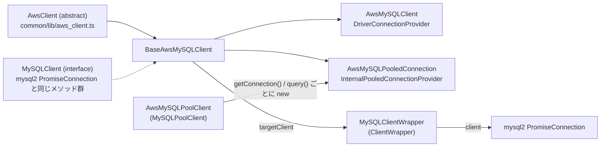

## この層の責務

`AwsMySQLClient` はアプリが触る唯一の面で、mysql2 の `PromiseConnection` と同じメソッド名を持つ。しかしその中身は、**mysql2 のメソッドを `pluginManager.execute()` で包み直しただけ**である。ロジックらしいロジックは 3 か所にしかない。

- `query` / `execute`: 実行前に SQL を読んでセッション状態を更新し、自前のタイムアウトを掛ける
- `setReadOnly` / `setAutoCommit` / `setCatalog` / `setTransactionIsolation`: SQL を組み立てて流し、セッション状態の「pristine 値」を記録する
- `end`: エラーリスナを外し、`targetClient` を捨てる

残りの 15 個ほどのメソッドは、全部同じ形の定型である。この定型を 1 回読めば、ファイルの大半は読み飛ばせる。

## 主要な型とその関係



| 型                         | 場所                                                                                                                                                                                | 役割                                                                                                          |
| -------------------------- | ----------------------------------------------------------------------------------------------------------------------------------------------------------------------------------- | ------------------------------------------------------------------------------------------------------------- |
| `BaseAwsMySQLClient`       | [`mysql/lib/client.ts#L51`](https://github.com/aws/aws-advanced-nodejs-wrapper/blob/6d0ba1bdae81a4e1fd274b3569c5dc50cf0a7095/mysql/lib/client.ts#L51)                               | 全メソッドの実装。`AwsMySQLClient` と `AwsMySQLPooledConnection` の差は `ConnectionProvider` だけ             |
| `AwsMySQLClient`           | [`#L583`](https://github.com/aws/aws-advanced-nodejs-wrapper/blob/6d0ba1bdae81a4e1fd274b3569c5dc50cf0a7095/mysql/lib/client.ts#L583)                                                | 公開クラス。コンストラクタは `super(config, new DriverConnectionProvider())` の 1 行                          |
| `AwsMySQLPooledConnection` | [`#L589`](https://github.com/aws/aws-advanced-nodejs-wrapper/blob/6d0ba1bdae81a4e1fd274b3569c5dc50cf0a7095/mysql/lib/client.ts#L589)                                                | 外部プール用。`release()` が追加されている。型だけ export                                                     |
| `AwsMySQLPoolClient`       | [`#L613`](https://github.com/aws/aws-advanced-nodejs-wrapper/blob/6d0ba1bdae81a4e1fd274b3569c5dc50cf0a7095/mysql/lib/client.ts#L613)                                                | 外部プール。`AwsClient` を継承しない。詳細は [AwsMySQLPoolClient](../aws-mysql-pool-client/)                  |
| `MySQLClientWrapper`       | [`common/lib/mysql_client_wrapper.ts#L26`](https://github.com/aws/aws-advanced-nodejs-wrapper/blob/6d0ba1bdae81a4e1fd274b3569c5dc50cf0a7095/common/lib/mysql_client_wrapper.ts#L26) | mysql2 接続の包み。`client` / `hostInfo` / `properties` / `id` を持ち、内部クエリ用の `query(sql)` を提供する |

`BaseAwsMySQLClient` のコンストラクタが親に渡すのは、MySQL 固有の部品 4 つである。

```ts title="mysql/lib/client.ts"
private static readonly knownDialectsByCode: Map<string, DatabaseDialect> = new Map([
  [DatabaseDialectCodes.MYSQL, new MySQLDatabaseDialect()],
  [DatabaseDialectCodes.RDS_MYSQL, new RdsMySQLDatabaseDialect()],
  [DatabaseDialectCodes.AURORA_MYSQL, new AuroraMySQLDatabaseDialect()],
  [DatabaseDialectCodes.GLOBAL_AURORA_MYSQL, new GlobalAuroraMySQLDatabaseDialect()],
  [DatabaseDialectCodes.RDS_MULTI_AZ_MYSQL, new RdsMultiAZClusterMySQLDatabaseDialect()]
]);

constructor(config: AwsMySQLClientConfig, connectionProvider?: ConnectionProvider) {
  super(
    config,
    DatabaseType.MYSQL,
    BaseAwsMySQLClient.knownDialectsByCode,
    new MySQLConnectionUrlParser(),
    new MySQL2DriverDialect(),
    connectionProvider ?? new DriverConnectionProvider()
  );
}
```

Dialect 5 種は**クラスの static Map** なので、プロセス内の全クライアントで同じインスタンスを共有する。Dialect は状態を持たない前提の設計である ([2 種類の Dialect](../two-dialects/))。`MySQLConnectionUrlParser` は `mysql://user@host1:3306,host2:3306/db` 形式と素のホスト名の両方を受け付ける ([`mysql_connection_url_parser.ts#L27`](https://github.com/aws/aws-advanced-nodejs-wrapper/blob/6d0ba1bdae81a4e1fd274b3569c5dc50cf0a7095/mysql/lib/mysql_connection_url_parser.ts#L27))。

## 処理の流れ

### 定型: 素通しメソッド

`changeUser` / `destroy` / `pause` / `resume` / `escape` / `escapeId` / `format` / `prepare` / `unprepare` / `serverHandshake` / `ping` / `writeOk` / `writeError` / `writeEof` / `writeTextResult` / `writePacket` は全部この形である。

```ts title="mysql/lib/client.ts"
async ping(): Promise<void> {
  return await this.pluginManager.execute(
    this.pluginService.getCurrentHostInfo(),
    this.properties,
    "ping",
    async () => {
      if (this.targetClient) {
        return await this.targetClient.client.ping();
      }
      return null;
    },
    null
  );
}
```

`targetClient` がなければ `null` を返す (例外にしない)。`query` / `execute` だけが `UndefinedClientError` を投げる。この非対称は、`query` が接続を自動で張る側なので「ない」状態が異常だから、と読める。

### `query` / `execute`: 状態追跡とタイムアウト

[`#L517`](https://github.com/aws/aws-advanced-nodejs-wrapper/blob/6d0ba1bdae81a4e1fd274b3569c5dc50cf0a7095/mysql/lib/client.ts#L517) と [`#L546`](https://github.com/aws/aws-advanced-nodejs-wrapper/blob/6d0ba1bdae81a4e1fd274b3569c5dc50cf0a7095/mysql/lib/client.ts#L546)。2 つの差は `client.query` を呼ぶか `client.execute` を呼ぶかだけで、周辺は同じ。

```ts title="mysql/lib/client.ts"
async () => {
  if (!this.targetClient) {
    throw new UndefinedClientError();
  }
  // Handle parameterized queries
  await this.updateState(this.targetClient.client, options, values);
  return await ClientUtils.queryWithTimeout(
    this.targetClient.client?.query(options, values),
    this.properties,
  );
};
```

`updateState` ([`#L572`](https://github.com/aws/aws-advanced-nodejs-wrapper/blob/6d0ba1bdae81a4e1fd274b3569c5dc50cf0a7095/mysql/lib/client.ts#L572)) は mysql2 の `client.format(sql, values)` で**プレースホルダを展開してから** `pluginService.updateState(sql)` に渡す。`SET autocommit = ?` のようにパラメータ化された `SET` 文も追跡できるようにするためである ([SQL を読んで状態を追う](../tracking-state-from-sql/))。

`ClientUtils.queryWithTimeout` ([`common/lib/utils/client_utils.ts#L25`](https://github.com/aws/aws-advanced-nodejs-wrapper/blob/6d0ba1bdae81a4e1fd274b3569c5dc50cf0a7095/common/lib/utils/client_utils.ts#L25)) は `Promise.race` で自前のタイマーを競わせる。

```ts title="common/lib/utils/client_utils.ts"
const timeoutTask = getTimeoutTask(timer, Messages.get("ClientUtils.queryTaskTimeout"), timeout);
return await Promise.race([timeoutTask, newPromise])
  .catch((error: any) => {
    if (error instanceof InternalQueryTimeoutError) {
      throw error;
    }
    throw new AwsWrapperError(error.message, error);
  })
  .finally(() => {
    clearTimeout(timer.timeoutId);
  });
```

2 つ、後のページで効いてくる性質がある。

- **mysql2 のエラーは `AwsWrapperError(error.message, error)` に包まれる。** メッセージは引き継がれるが、`code` / `errno` / `sqlState` は `cause` の側に残る。`MySQLErrorHandler` がメッセージ文字列で分類しているのは、この包み直しを越えて届くのがメッセージだけだからでもある ([MySQLErrorHandler](../mysql-error-handler/))
- **タイムアウトしても mysql2 のクエリは止まらない。** `Promise.race` は負けた側をキャンセルしない。ラッパは `InternalQueryTimeoutError` を投げて手を離すだけで、ソケットの上ではクエリが走り続ける。これを「ネットワークエラー」として扱い接続を捨てるのが failover の役目になる

`values` を渡す `query(sql, values)` は mysql2 の `?` 展開、`execute` はサーバ側プリペアドステートメントで、どちらも戻りは `[rows, fields]` のタプルである。3.0.0 で型が `[T, FieldPacket[]]` に固まった。

### `setReadOnly` などの set 系: SQL を組み立てる

[`#L118`](https://github.com/aws/aws-advanced-nodejs-wrapper/blob/6d0ba1bdae81a4e1fd274b3569c5dc50cf0a7095/mysql/lib/client.ts#L118) から [`#L195`](https://github.com/aws/aws-advanced-nodejs-wrapper/blob/6d0ba1bdae81a4e1fd274b3569c5dc50cf0a7095/mysql/lib/client.ts#L195)。

```ts title="mysql/lib/client.ts"
async setReadOnly(readOnly: boolean): Promise<Query | void> {
  this.pluginService.getSessionStateService().setupPristineReadOnly();
  const result = await this.queryWithoutUpdate({ sql: `SET SESSION TRANSACTION READ ${readOnly ? "ONLY" : "WRITE"}` });
  this.pluginService.getSessionStateService().updateReadOnly(readOnly);
  return result;
}
```

mysql2 には `setReadOnly` に相当する API がないので、ラッパが SQL 文字列を作って `query` として流す。ただし通常の `query` ではなく `queryWithoutUpdate` ([`#L101`](https://github.com/aws/aws-advanced-nodejs-wrapper/blob/6d0ba1bdae81a4e1fd274b3569c5dc50cf0a7095/mysql/lib/client.ts#L101)) を使い、**SQL 解析による状態更新を迂回**する。状態はメソッド自身が `updateReadOnly(readOnly)` で明示的に書くので、SQL を読み直す必要がない。

`setupPristine*` を先に呼ぶのは「変更前の値」を記録するためで、接続を閉じるときに元に戻す材料になる ([SessionState](../session-state/))。

メソッド名は `pluginManager.execute` に `"query"` として渡る。つまり `setReadOnly` を購読したいプラグインは `"query"` を購読し、`args` の SQL を読む。readWriteSplitting がまさにそうしている ([readWriteSplitting](../read-write-splitting/))。

`setSchema` / `getSchema` は MySQL に schema の概念がないので `UnsupportedMethodError` を投げる。`setCatalog` が `USE <db>` に対応する。

### トランザクション境界

```ts title="mysql/lib/client.ts"
async beginTransaction(): Promise<void> {
  await this.pluginManager.execute(
    this.pluginService.getCurrentHostInfo(),
    this.properties,
    "beginTransaction",
    async () => {
      if (this.targetClient) {
        this.pluginService.updateInTransaction("START TRANSACTION");
        return await this.targetClient.client.beginTransaction();
      }
      return null;
    },
    null
  );
}
```

mysql2 の `beginTransaction()` は内部で `START TRANSACTION` を送るが、ラッパの SQL 解析はそれを見ない (`query` を通らない)。だから `updateInTransaction("START TRANSACTION")` と**SQL 文字列を偽装して**状態機械に通す。`commit` / `rollback` も同じ形で `"COMMIT"` / `"rollback"` を渡す ([トランザクション境界の追跡](../transaction-boundary/))。

### `end`: 後始末

[`#L197`](https://github.com/aws/aws-advanced-nodejs-wrapper/blob/6d0ba1bdae81a4e1fd274b3569c5dc50cf0a7095/mysql/lib/client.ts#L197)。

```ts title="mysql/lib/client.ts"
async end() {
  if (!this.isConnected || !this.targetClient) {
    // No connections have been initialized.
    // This might happen if end is called in a finally block when an error occurred while initializing the first connection.
    return;
  }

  return await this.pluginManager.execute(
    this.pluginService.getCurrentHostInfo(),
    this.properties,
    "end",
    () => {
      if (!this.targetClient) {
        return Promise.resolve(undefined);
      }
      this.pluginService.removeErrorListener(this.targetClient);
      const res = ClientUtils.queryWithTimeout(this.targetClient.end(), this.properties);
      this.targetClient = undefined;
      this.isConnected = false;
      return res;
    },
    null
  );
}
```

- 未接続なら黙って返る。`try { connect } finally { end }` で connect が失敗したときに `end` が二次災害を起こさないためのガードで、コメントにその意図が書いてある
- `removeErrorListener` を**先に**呼ぶ。閉じる途中で mysql2 が `error` を emit しても追跡リスナに拾わせない
- `targetClient = undefined` を `end()` の完了を**待たずに**やる。以降の `query()` は `isConnected = false` を見て再接続する

`end` は failover2 の `canDirectExecute` で素通し対象になっている。閉じようとしている接続でフェイルオーバーを始めても意味がないからである ([全体像](../failover-overview/))。

## 守られている不変条件

- **`targetClient` の読み取りは常に呼び出し時。** どのメソッドも `this.targetClient` をクロージャの中で読む。フェイルオーバーで `pluginService.setCurrentClient()` が `targetClient` を差し替えると、その後の再実行は自然に新しい接続を使う
- **`isConnected` は `AwsMySQLClient` 自身が管理する。** `internalPostConnect()` で `true`、`end()` で `false`。`PluginService` はこのフラグを知らない。接続が「壊れている」ことと「ない」ことは別で、壊れていても `isConnected` は `true` のままである
- **メソッド名は mysql2 と同じ文字列で `execute` に渡る。** プラグインの購読名 (`"query"`, `"end"`, `"beginTransaction"` ...) はここで決まる。`SubscribedMethodHelper.NETWORK_BOUND_METHODS` ([`subscribed_method_helper.ts#L18`](https://github.com/aws/aws-advanced-nodejs-wrapper/blob/6d0ba1bdae81a4e1fd274b3569c5dc50cf0a7095/common/lib/utils/subscribed_method_helper.ts#L18)) の「MySQL-specific」と注記された `execute` / `beginTransaction` / `commit` / `changeUser` / `pause` / `resume` / `prepare` / `unprepare` は、この定型の一覧と一致する

## つまずきどころ

- **callback API はない。** `query(sql, cb)` は受け付けない。全メソッドが `Promise` を返す。mysql2 の `mysql2` (非 promise) からの移行では、`mysql2/promise` 相当だと思って読む
- **`query()` の戻りはタプル `[rows, fields]`。** `const [rows] = await client.query(...)` と受ける。3.0.0 までは `[T, any]` だったので、`fields` を `any` として触っていたコードは型エラーになる
- **`setReadOnly` は `SET SESSION TRANSACTION READ ONLY` を流すだけ**で、接続先を reader に切り替えはしない。切り替えるのは readWriteSplitting プラグインを入れたときだけ
- **`prepare` / `unprepare` は素通し**なので、フェイルオーバー後に古い接続で作ったプリペアドステートメントは使えない。`execute(sql, values)` のほうは呼ぶたびに mysql2 が prepare するので影響を受けない
- **`wrapperQueryTimeout` は mysql2 の `timeout` とは別物。** mysql2 の `timeout` は「パケットが来ない時間」の inactivity timeout で、ラッパの `wrapperQueryTimeout` は `Promise.race` の壁時計。長いクエリを流すなら両方を見る ([WrapperProperties](../wrapper-properties/))
- **`mysqlQueryTimeout` は 1.1.0 で非推奨**だが、設定すると今も優先され、初回だけ警告が出る ([`client_utils.ts#L25`](https://github.com/aws/aws-advanced-nodejs-wrapper/blob/6d0ba1bdae81a4e1fd274b3569c5dc50cf0a7095/common/lib/utils/client_utils.ts#L25))
