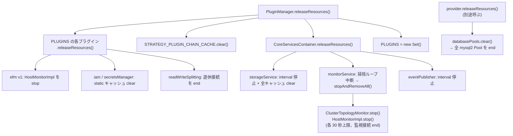

## 何を学んだか

ラッパは `AwsMySQLClient` の外に、プロセス全体で共有される状態を持つ。`CoreServicesContainer` の 3 サービス、そこに登録されたモニタ、`InternalPooledConnectionProvider` の static なプール表、そして `PluginManager.PLUGINS` という全プラグインの集合である。`client.end()` はこれらに触らない。

Node.js のプロセスは、イベントループに仕事が残っている限り終わらない。ラッパの背景タスクを「プロセスを止めるか」で分けると、こうなる。

| 背景タスク                            | タイマ             | `unref`  | プロセスを止めるか            |
| ------------------------------------- | ------------------ | -------- | ----------------------------- |
| `BatchingEventPublisher` の 30 秒送信 | `setInterval`      | あり     | 止めない                      |
| `StorageService` の 5 分掃除          | `setInterval`      | あり     | 止めない                      |
| `MonitorService` の 1 分掃除ループ    | `sleepWithAbort`   | あり     | 止めない                      |
| 内部プールの 10 分掃除ループ          | `sleepWithAbort`   | あり     | 止めない                      |
| `ClusterTopologyMonitor` の監視ループ | `sleep(50)` の連鎖 | なし     | **止める** (+ 監視用 DB 接続) |
| `HostMonitorImpl` (EFM) の監視ループ  | `setTimeout`       | なし     | **止める** (+ 監視用 DB 接続) |
| 内部プールの mysql2 `Pool`            | ソケット           | 該当なし | **止める**                    |

掃除ループは全部 `unref` されていて、モニタとプールは意図的にされていない。モニタは DB 接続を握っているので、タイマだけ `unref` しても意味がない。明示的に止める設計になっていて、その入口が `PluginManager.releaseResources()` である。

## ソースコードのどこか

### CoreServicesContainer — プロセスに 1 つ

[`utils/core_services_container.ts#L30`](https://github.com/aws/aws-advanced-nodejs-wrapper/blob/6d0ba1bdae81a4e1fd274b3569c5dc50cf0a7095/common/lib/utils/core_services_container.ts#L30)。

```ts title="common/lib/utils/core_services_container.ts"
export class CoreServicesContainer {
  private static readonly INSTANCE = new CoreServicesContainer();

  readonly monitorService: MonitorService;
  readonly storageService: StorageService;
  readonly eventPublisher: EventPublisher;

  private constructor() {
    this.eventPublisher = new BatchingEventPublisher();
    this.storageService = new StorageServiceImpl(this.eventPublisher);
    this.monitorService = new MonitorServiceImpl(this.eventPublisher);
  }

  static getInstance(): CoreServicesContainer {
    return CoreServicesContainer.INSTANCE;
  }

  static async releaseResources(): Promise<void> {
    await CoreServicesContainer.INSTANCE.storageService.releaseResources();
    await CoreServicesContainer.INSTANCE.monitorService.releaseResources();
    if (CoreServicesContainer.INSTANCE.eventPublisher instanceof BatchingEventPublisher) {
      CoreServicesContainer.INSTANCE.eventPublisher.releaseResources();
    }
  }
}
```

`INSTANCE` は static 初期化子で作られるので、**モジュールを import した時点で 3 つの掃除タイマが動き始める**。`AwsClient` のコンストラクタ ([`aws_client.ts#L110`](https://github.com/aws/aws-advanced-nodejs-wrapper/blob/6d0ba1bdae81a4e1fd274b3569c5dc50cf0a7095/common/lib/aws_client.ts#L110)) はこれを取って `FullServicesContainer` に詰め、クライアントごとの `PluginService` / `PluginManager` と同居させる ([CoreServicesContainer](../core-services-container/))。

3 つのタイマはいずれも `unref` されている。

- [`batching_event_publisher.ts#L39`](https://github.com/aws/aws-advanced-nodejs-wrapper/blob/6d0ba1bdae81a4e1fd274b3569c5dc50cf0a7095/common/lib/utils/events/batching_event_publisher.ts#L39): `this.publishingInterval.unref()`、30 秒間隔
- [`storage_service.ts#L156`](https://github.com/aws/aws-advanced-nodejs-wrapper/blob/6d0ba1bdae81a4e1fd274b3569c5dc50cf0a7095/common/lib/utils/storage/storage_service.ts#L156): `this.cleanupIntervalHandle.unref()`、5 分間隔
- [`monitor_service.ts#L147`](https://github.com/aws/aws-advanced-nodejs-wrapper/blob/6d0ba1bdae81a4e1fd274b3569c5dc50cf0a7095/common/lib/utils/monitoring/monitor_service.ts#L147): `runCleanupLoop` が `sleepWithAbort` で 1 分ずつ眠る

`sleepWithAbort` は [`utils.ts#L37`](https://github.com/aws/aws-advanced-nodejs-wrapper/blob/6d0ba1bdae81a4e1fd274b3569c5dc50cf0a7095/common/lib/utils/utils.ts#L37) にあり、隣の `sleep` ([L24](https://github.com/aws/aws-advanced-nodejs-wrapper/blob/6d0ba1bdae81a4e1fd274b3569c5dc50cf0a7095/common/lib/utils/utils.ts#L24)) との違いは `unref` と中断関数の有無だけである。

```ts title="common/lib/utils/utils.ts"
export function sleep(ms: number) {
  return new Promise((resolve) => setTimeout(resolve, ms));
}

export function sleepWithAbort(ms: number, message?: string) {
  let abortSleep;
  const promise = new Promise((resolve, reject) => {
    const timeout = setTimeout(resolve, ms);
    // Unref the timer to prevent this background task from blocking the application from gracefully exiting.
    timeout.unref();
    abortSleep = () => {
      clearTimeout(timeout);
      reject(new AwsWrapperError(message));
    };
  });
  return [promise, abortSleep];
}
```

掃除ループが `sleepWithAbort`、モニタ本体が `sleep` を使い分けているのが、上の表の「止める / 止めない」の境目である。

### モニタ — unref なしの sleep と DB 接続

`ClusterTopologyMonitorImpl.delay` ([`cluster_topology_monitor.ts#L822`](https://github.com/aws/aws-advanced-nodejs-wrapper/blob/6d0ba1bdae81a4e1fd274b3569c5dc50cf0a7095/common/lib/host_list_provider/monitoring/cluster_topology_monitor.ts#L822)) は、30 秒 (高速モードでは 100ms) の待ちを 50ms の `sleep` に刻んで、`requestToUpdateTopology` か `_stop` が立ったらすぐ抜ける。

```ts title="common/lib/host_list_provider/monitoring/cluster_topology_monitor.ts"
private async delay(useHighRefreshRate: boolean): Promise<void> {
  if (getTimeInNanos() < this.highRefreshRateEndTimeNs) {
    useHighRefreshRate = true;
  }
  const delayNs = useHighRefreshRate ? this.highRefreshRateNs : this.refreshRateNs;
  const endTime: bigint = getTimeInNanos() + BigInt(delayNs);
  await sleep(50);
  while (getTimeInNanos() < endTime && !this.requestToUpdateTopology && !this._stop) {
    await sleep(50);
  }
}
```

50ms ごとに新しい `setTimeout` が積まれるので、イベントループは空にならない。加えてモニタは監視用の mysql2 接続 (`monitoringClient`) を握っていて、ソケットが開いている限りプロセスは終わらない ([ClusterTopologyMonitor](../cluster-topology-monitor/))。

EFM の `HostMonitorImpl` も同じで、`delayTimeoutId` / `sleepTimeoutId` の `setTimeout` は `unref` されない。[`host_monitor.ts#L183`](https://github.com/aws/aws-advanced-nodejs-wrapper/blob/6d0ba1bdae81a4e1fd274b3569c5dc50cf0a7095/common/lib/plugins/efm/base/host_monitor.ts#L183) の `releaseResources` は、その 2 つを `clearTimeout` してから `stop()` する。

モニタの寿命は `MonitorService` が管理する。`ClusterTopologyMonitorImpl` の既定は [`monitor_service.ts#L32`](https://github.com/aws/aws-advanced-nodejs-wrapper/blob/6d0ba1bdae81a4e1fd274b3569c5dc50cf0a7095/common/lib/utils/monitoring/monitor_service.ts#L32) で 15 分期限 / 3 分無活動、`HostMonitorImpl` は `host_monitor_service.ts` で [10 分](https://github.com/aws/aws-advanced-nodejs-wrapper/blob/6d0ba1bdae81a4e1fd274b3569c5dc50cf0a7095/common/lib/plugins/efm/base/host_monitor_service.ts#L45) (docs の表は 60 秒と書いているが、コードは 600,000ms)。期限は `Topology` がキャッシュから読まれるたびに `DataAccessEvent` で延びる ([MonitorService](../monitor-service/))。**クエリを打ち続けている限りトポロジモニタは期限切れにならない**ので、放っておけば消えるという期待は成り立たない。

`AbstractMonitor.stop` ([`monitor.ts#L95`](https://github.com/aws/aws-advanced-nodejs-wrapper/blob/6d0ba1bdae81a4e1fd274b3569c5dc50cf0a7095/common/lib/utils/monitoring/monitor.ts#L95)) は `_stop = true` を立ててから `monitorPromise` を最大 30 秒 (`MONITOR_TERMINATION_TIMEOUT_SEC`) 待ち、`close()` で接続を閉じる。

### 内部プール — static なプール表

[`internal_pooled_connection_provider.ts#L47`](https://github.com/aws/aws-advanced-nodejs-wrapper/blob/6d0ba1bdae81a4e1fd274b3569c5dc50cf0a7095/common/lib/internal_pooled_connection_provider.ts#L47)。

```ts title="common/lib/internal_pooled_connection_provider.ts"
protected static databasePools: SlidingExpirationCacheWithCleanupTask<string, any> = new SlidingExpirationCacheWithCleanupTask(
  InternalPooledConnectionProvider.CACHE_CLEANUP_NANOS,        // 10 分
  (pool: any) => pool.getActiveCount() === 0,
  async (pool: any) => await pool.end(),
  "InternalPooledConnectionProvider.databasePools"
);
```

プール表は**クラスの static** で、`InternalPooledConnectionProvider` を何個作っても 1 つしかない ([内部コネクションプール](../internal-connection-pool/))。掃除ループは最初の `put` で始まり ([`sliding_expiration_cache_with_cleanup_task.ts#L84`](https://github.com/aws/aws-advanced-nodejs-wrapper/blob/6d0ba1bdae81a4e1fd274b3569c5dc50cf0a7095/common/lib/utils/sliding_expiration_cache_with_cleanup_task.ts#L84))、`sleepWithAbort` なので `unref` されている。プロセスを止めるのはループではなく、表の中の mysql2 `Pool` が持つソケットである。

[`releaseResources#L133`](https://github.com/aws/aws-advanced-nodejs-wrapper/blob/6d0ba1bdae81a4e1fd274b3569c5dc50cf0a7095/common/lib/internal_pooled_connection_provider.ts#L133) は `databasePools.clear()` を呼び、全プールを `end()` する。`AwsMySQLPoolClient.end()` ([`client.ts#L625`](https://github.com/aws/aws-advanced-nodejs-wrapper/blob/6d0ba1bdae81a4e1fd274b3569c5dc50cf0a7095/mysql/lib/client.ts#L625)) はこれを呼ぶだけなので、**`AwsMySQLPoolClient` を 2 つ作って片方を `end()` すると、もう片方のプールも閉じる**。

### PluginManager.releaseResources — 全部を束ねる static

[`plugin_manager.ts#L381`](https://github.com/aws/aws-advanced-nodejs-wrapper/blob/6d0ba1bdae81a4e1fd274b3569c5dc50cf0a7095/common/lib/plugin_manager.ts#L381)。

```ts title="common/lib/plugin_manager.ts"
private static PLUGINS: Set<ConnectionPlugin> = new Set();

static async releaseResources() {
  for (const plugin of PluginManager.PLUGINS) {
    if (PluginManager.implementsCanReleaseResources(plugin)) {
      try {
        await plugin.releaseResources();
      } catch (error) {
        // Do nothing
      }
    }
  }

  PluginManager.STRATEGY_PLUGIN_CHAIN_CACHE.clear();
  await CoreServicesContainer.releaseResources();

  PluginManager.PLUGINS = new Set();
}
```

`PLUGINS` には、`pluginManager.init()` ([L112](https://github.com/aws/aws-advanced-nodejs-wrapper/blob/6d0ba1bdae81a4e1fd274b3569c5dc50cf0a7095/common/lib/plugin_manager.ts#L112)) を通った全クライアントの全プラグインが積まれる。`client.end()` では**取り除かれない**。`AwsMySQLPoolClient.query()` はクエリごとに `AwsMySQLPooledConnection` (= `PluginManager` 一式) を作るので ([AwsMySQLPoolClient](../aws-mysql-pool-client/))、`releaseResources()` を呼ぶまで、この `Set` はクエリ数に比例して増え続ける。プラグインは `PluginService` を参照しているので、`Set` が持っている限り GC されない。

`CanReleaseResources` を実装しているプラグインは 7 つ (と `InternalPooledConnectionProvider`) で、中身はほとんどが static キャッシュのクリアである。

| プラグイン                                                              | `releaseResources` の中身                                           |
| ----------------------------------------------------------------------- | ------------------------------------------------------------------- |
| `HostMonitoringConnectionPlugin` (efm v1)                               | `monitorService.releaseResources()` → `HostMonitorImpl` を全部 stop |
| `AuroraConnectionTrackerPlugin`                                         | `tracker.pruneNullConnections()`                                    |
| `AbstractReadWriteSplittingPlugin`                                      | `closeIdleClients()`                                                |
| `CustomEndpointPlugin`                                                  | static な monitors を close                                         |
| `BlueGreenPlugin`                                                       | static な provider の `clearResources()`                            |
| `IamAuthenticationPlugin`                                               | static `tokenCache.clear()`                                         |
| `AwsSecretsManagerPlugin`                                               | static `secretsCache.clear()`                                       |
| `InternalPooledConnectionProvider` (プラグインではないが同じ interface) | 上述                                                                |

efm2 の `HostMonitoring2ConnectionPlugin` はこの interface を実装していない。efm2 のモニタを止めているのは、その後の `CoreServicesContainer.releaseResources()` → `monitorService.stopAndRemoveAll()` である。



`MonitorServiceImpl.releaseResources` ([L401](https://github.com/aws/aws-advanced-nodejs-wrapper/blob/6d0ba1bdae81a4e1fd274b3569c5dc50cf0a7095/common/lib/utils/monitoring/monitor_service.ts#L401)) は `isInitialized = false` にして掃除ループを中断し、`stopAndRemoveAll()` する。**掃除ループを再開する経路はない。** `runIfAbsent` はモニタを作るだけで、ループを起こし直さない。`StorageService` も同様で、`clearInterval` した後に `set` してもタイマは戻らない。つまり `releaseResources()` の後もクライアントは作れて動くが、期限切れの掃除は二度と走らない。

## なぜそうなっているか

### なぜプロセスに 1 つなのか

トポロジモニタは `clusterId` ごとに 1 つあればよい ([clusterId](../cluster-id/))。クライアントごとに持つと、100 接続のアプリが同じクラスタに 100 本の監視接続を張り、30 秒ごとに 100 回 `replica_host_status` を読む。外部プールに至ってはクエリごとにクライアントが作られるので、モニタがクライアントに紐づいていたら成立しない。

`CoreServicesContainer` の doc コメントは "so that only one instance of each service is instantiated" と言い切っている。共有が目的で、その帰結として寿命がクライアントから切り離された。

### なぜ掃除ループは unref で、モニタはそうでないのか

掃除ループは「何もしなくても困らない」タスクで、プロセスが終わるならそのまま消えてよい。`unref` のコメントが "to prevent this background task from blocking the application from gracefully exiting" と書いているとおりである。

モニタは違う。DB 接続を持っていて、ソケットが開いている限り `unref` しても終わらない。中途半端に `unref` すると「タイマは止まったが接続は残る」状態になるだけで、明示的に `stop()` を呼んで接続を閉じる以外に綺麗な終わり方がない。それなら `unref` しないほうが、「終わらない」という症状で気づける。

### なぜ static な releaseResources なのか

Node.js には JVM の shutdown hook のような、非同期処理を待ってくれる終了フックがない。`process.on("exit")` は同期処理しか走らせられない。アプリが明示的に `await` する API にするしかなく、それをどこに置くかで「全クライアントを知っている static」が選ばれた。プラグインが `CanReleaseResources` を実装し、`PluginManager` が集める形は、JDBC 版のラッパから持ち込まれた設計に見える。

`PLUGINS` から `end()` 時に取り除かない理由は、コードからは読めない。共有リソースはクライアントが消えても残るので「最後に全部」で十分、と割り切ったのだと思われるが、外部プールの使い方と噛み合っていない。

## どう活かすか

- **終了手順をコードで持つ。** クライアントを `end()` → `PluginManager.releaseResources()` → (内部プールなら) `provider.releaseResources()` の順。docs の `UsingTheReadWriteSplittingPlugin.md` が「provider が pool を閉じられるように、先に `PluginManager.releaseResources()`」と順序を指定している

```ts
process.on("SIGTERM", async () => {
  await client.end();
  await PluginManager.releaseResources();
  await provider?.releaseResources();
  process.exit(0);
});
```

- **`releaseResources()` はアプリの寿命で 1 回だけ。** リクエストの後始末に混ぜると、他のリクエストが使っているモニタとプールが全部止まり、掃除ループも二度と戻らない
- **`unref` の使い分けを設計に持ち込む。** 「止まっても困らない」タイマだけ `unref` し、外部リソースを握るタスクは明示的な `stop()` を用意する。ラッパの `sleep` / `sleepWithAbort` の 2 本立ては、その判断をコードに固定する方法として参考になる
- **テストでは `afterEach` で `PluginManager.releaseResources()`。** ラッパの統合テストは全部そうしている ([統合テストの作り方](../integration-tests/))。jest が「open handles」で終わらないときは、まずここを疑う
- **static な集合に「入れる」だけの設計は、いずれ漏れる。** `PLUGINS` は `add` しかない。長寿命プロセスで外部プールを使うなら、`PLUGINS` の増加をメトリクスで見ておくか、定期的に `releaseResources()` を呼べるタイミングを作る

### 実務で踏む失敗パターン

- **スクリプトが `client.end()` の後も終わらない。** トポロジモニタか EFM モニタが動いている。`PluginManager.releaseResources()` を呼ぶ。`initialConnection` と `failover2` は既定で入るので、`plugins` を指定していなくても発生する
- **`AwsMySQLPoolClient` を複数作り、片方を `end()` したらもう片方のクエリが失敗する。** `databasePools` が static。プールクライアントはプロセスに 1 つにするか、`end()` は最後に 1 回だけにする
- **Lambda で 2 回目以降の呼び出しが遅い、あるいは接続エラーが出る。** モニタは実行環境の凍結中も生きていて、解凍後に古い監視接続で `SELECT 1` を打つ。短命な実行環境では `plugins` からモニタ系 (`efm2`、`initialConnection` 以外のトポロジ監視を伴うもの) を外すか、呼び出しの最後に `releaseResources()` を呼ぶ。この場合、次の呼び出しでモニタは作り直されるが、掃除ループは戻らない
- **メモリが増え続ける。** 外部プールで `query()` を回しているなら `PLUGINS` を疑う。`releaseResources()` まで解放されない
