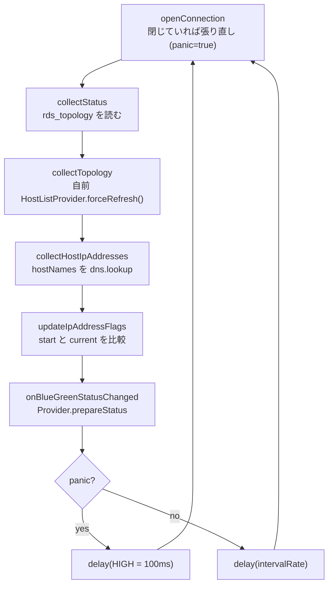

## 何を学んだか

`BlueGreenStatusMonitor` は **役割 (SOURCE = blue / TARGET = green) ごとに 1 本**の監視ループで、524 行のクラス 1 つに次の 4 つが詰まっている。

- 最初は両方とも同じ初期ホストに繋ぎ、ステータス表を読んで「自分の役割のエンドポイント」を知り、そこへ張り直す
- 1 周で `rds_topology` → トポロジ → DNS 解決の順に集め、Provider にコールバックする
- `CREATED` の間に集めた「開始時点」の値を、切り替え中は凍結して比較対象にする
- 間隔は BASELINE 60 秒 / INCREASED 1 秒 / HIGH 100ms で、接続を失ったら (panic) HIGH に張り付く

blue と green を**別々の接続で**見るのは、切り替えの後半で両者が切り離され、片方のステータス表からはもう片方の状態が見えなくなるからである。

## ソースコードのどこか

[`common/lib/plugins/bluegreen/blue_green_status_monitor.ts`](https://github.com/aws/aws-advanced-nodejs-wrapper/blob/6d0ba1bdae81a4e1fd274b3569c5dc50cf0a7095/common/lib/plugins/bluegreen/blue_green_status_monitor.ts)。Provider が 2 つ作る ([`blue_green_status_provider.ts#L110`](https://github.com/aws/aws-advanced-nodejs-wrapper/blob/6d0ba1bdae81a4e1fd274b3569c5dc50cf0a7095/common/lib/plugins/bluegreen/blue_green_status_provider.ts#L110))。

```ts title="common/lib/plugins/bluegreen/blue_green_status_provider.ts"
this.monitors[BlueGreenRole.SOURCE.value] = new BlueGreenStatusMonitor(
  BlueGreenRole.SOURCE,
  this.bgdId,
  this.pluginService.getCurrentHostInfo(),
  this.servicesContainer,
  this.getMonitoringProperties(),
  this.statusCheckIntervalMap,
  { onBlueGreenStatusChanged: (role, status) => this.prepareStatus(role, status) },
);
this.monitors[BlueGreenRole.TARGET.value] = new BlueGreenStatusMonitor(
  BlueGreenRole.TARGET,
  this.bgdId,
  this.pluginService.getCurrentHostInfo(),
  // ...
);
```

どちらも `initialHostInfo` は**アプリが繋いだホスト**である。green 用のモニタも最初は blue に繋ぐ。

### ループ 1 周

[`#L132`](https://github.com/aws/aws-advanced-nodejs-wrapper/blob/6d0ba1bdae81a4e1fd274b3569c5dc50cf0a7095/common/lib/plugins/bluegreen/blue_green_status_monitor.ts#L132)。コンストラクタの最後で `this.runMonitoringLoop()` を await せずに呼ぶ。

```ts title="common/lib/plugins/bluegreen/blue_green_status_monitor.ts"
while (!this.stop) {
  const oldPhase: BlueGreenPhase | null = this.currentPhase;
  await this.openConnection();
  await this.collectStatus();
  await this.collectTopology();
  await this.collectHostIpAddresses();
  this.updateIpAddressFlags();
  // ...
  this.onBlueGreenStatusChangeFunc.onBlueGreenStatusChanged(
    this.role,
    new BlueGreenInterimStatus(
      this.currentPhase,
      this.version,
      this.port,
      this.startTopology,
      this.currentTopology,
      this.startIpAddressesByHostMap,
      this.currentIpAddressesByHostMap,
      this.hostNames,
      this.allStartTopologyIpChanged,
      this.allStartTopologyEndpointsRemoved,
      this.allTopologyChanged,
    ),
  );
  const delayMs: number = Number(
    this.statusCheckIntervalMap.get(
      (this.panicMode ? BlueGreenIntervalRate.HIGH : this.intervalRate) ??
        BlueGreenStatusMonitor.DEFAULT_CHECK_INTERVAL_MS,
    ),
  );
  await this.delay(delayMs);
}
```



### 待ち方 — 50ms 刻みで条件を見張る

[`#L181`](https://github.com/aws/aws-advanced-nodejs-wrapper/blob/6d0ba1bdae81a4e1fd274b3569c5dc50cf0a7095/common/lib/plugins/bluegreen/blue_green_status_monitor.ts#L181)。

```ts title="common/lib/plugins/bluegreen/blue_green_status_monitor.ts"
protected async delay(delayMs: number): Promise<void> {
  const start: bigint = getTimeInNanos();
  const end: bigint = start + convertMsToNanos(delayMs);
  const currentBlueGreenIntervalRate: BlueGreenIntervalRate = this.intervalRate;
  const currentPanic: boolean = this.panicMode;
  const minDelay = Math.min(delayMs, 50);

  do {
    await sleep(minDelay);
  } while (this.intervalRate === currentBlueGreenIntervalRate && getTimeInNanos() < end && !this.stop && this.panicMode === currentPanic);
}
```

60 秒の待ちの途中で Provider が `setIntervalRate(HIGH)` を呼ぶと、50ms 以内に抜けて次の周に入る。`setTimeout(60000)` を 1 発置く実装だと、切り替えが始まっても最大 60 秒気づけない。

### collectStatus — 自分の役割の行だけ拾う

[`#L328`](https://github.com/aws/aws-advanced-nodejs-wrapper/blob/6d0ba1bdae81a4e1fd274b3569c5dc50cf0a7095/common/lib/plugins/bluegreen/blue_green_status_monitor.ts#L328)。要点を抜粋する。

```ts title="common/lib/plugins/bluegreen/blue_green_status_monitor.ts"
if (!(await this.blueGreenDialect.isBlueGreenStatusAvailable(client))) {
  if (await this.pluginService.isClientValid(client)) {
    this.currentPhase = BlueGreenPhase.NOT_CREATED;
  } else {
    this.clientWrapper = null;
    this.currentPhase = null;
    this.panicMode = true;
  }
  return;
}

const results: BlueGreenResult[] = await this.blueGreenDialect.getBlueGreenStatus(client);
for (const result of results) {
  let version = result.version;
  if (!BlueGreenStatusMonitor.knownVersions.has(version)) {
    version = BlueGreenStatusMonitor.latestKnownVersion; // "1.0"
    logger.warn(Messages.get("Bgd.unknownVersion", versionCopy));
  }
  const role: BlueGreenRole = BlueGreenRole.parseRole(result.role, version);
  const phase: BlueGreenPhase = BlueGreenPhase.parsePhase(result.status, version);
  if (this.role !== role) {
    continue;
  }
  statusEntries.push(new StatusInfo(version, result.endpoint, result.port, phase, role));
}

// Check if there's a cluster writer endpoint;
let statusInfo: StatusInfo | undefined = statusEntries.find(
  (x) => this.rdsUtils.isWriterClusterDns(x.endpoint) && this.rdsUtils.isNotOldInstance(x.endpoint),
);
if (statusInfo !== undefined) {
  // Add cluster reader endpoint as well.
  this.hostNames.add(statusInfo.endpoint.toLowerCase().replace(".cluster-", ".cluster-ro-"));
}
if (statusInfo === undefined) {
  // maybe it's an instance endpoint?
  statusInfo = statusEntries.find(
    (x) => this.rdsUtils.isRdsInstance(x.endpoint) && this.rdsUtils.isNotOldInstance(x.endpoint),
  );
}
```

表には blue と green 両方の行が並ぶが、モニタは**自分の役割の行だけ**を見る。フェーズを決める代表行は「`cluster-` エンドポイントで `-old1` でないもの」、なければインスタンスエンドポイントである。Aurora ならクラスタエンドポイント、RDS MySQL (単一インスタンス) ならインスタンスエンドポイントが代表になる。

行がなければ `currentPhase = null` にする。コメントにあるとおり、**切り替え完了後の旧 blue (old1) はステータス表が空になる**のが正常で、SOURCE 以外なら警告を出す。

### 自分の役割のクラスタへ張り直す

同じ関数の後半 ([`#L407`](https://github.com/aws/aws-advanced-nodejs-wrapper/blob/6d0ba1bdae81a4e1fd274b3569c5dc50cf0a7095/common/lib/plugins/bluegreen/blue_green_status_monitor.ts#L407))。

```ts title="common/lib/plugins/bluegreen/blue_green_status_monitor.ts"
if (!this.connectionHostInfoCorrect && statusInfo !== undefined) {
  // We connected to an initialHostInfo that might be not the desired Blue or Green cluster.
  // We need to reconnect to a correct one.
  const statusInfoHostIpAddress: string | null = await this.getIpAddress(statusInfo.endpoint);
  const connectedIpAddressCopy = this.connectedIpAddress;

  if (connectedIpAddressCopy !== null && connectedIpAddressCopy !== statusInfoHostIpAddress) {
    this.connectionHostInfo = this.hostInfoBuilder
      .withHost(statusInfo.endpoint)
      .withPort(statusInfo.port)
      .build();
    this.connectionHostInfoCorrect = true;
    await this.closeConnection();
    this.panicMode = true;
  } else {
    this.connectionHostInfoCorrect = true;
    this.panicMode = false;
  }
}

if (this.connectionHostInfoCorrect && this.hostListProvider == null) {
  this.initHostListProvider();
}
```

「正しいクラスタに繋がっているか」は、**繋いだときに解決した IP と、代表行のエンドポイントを今解決した IP が一致するか**で判定する。TARGET 用モニタは blue に繋いでいるので不一致になり、green のエンドポイントへ張り直す。一致していればそのまま使う。

張り直しは `closeConnection()` して `panicMode = true` にするだけで、次の周の `openConnection` に任せる。

### 監視用 HostListProvider は clusterId を分ける

[`#L500`](https://github.com/aws/aws-advanced-nodejs-wrapper/blob/6d0ba1bdae81a4e1fd274b3569c5dc50cf0a7095/common/lib/plugins/bluegreen/blue_green_status_monitor.ts#L500)。

```ts title="common/lib/plugins/bluegreen/blue_green_status_monitor.ts"
protected static readonly BG_CLUSTER_ID = "941d00a8-8238-4f7d-bf59-771bff783a8e";

// Need to instantiate a separate HostListProvider with
// a special unique clusterId to avoid interference with other HostListProviders opened for this cluster.
// Blue and Green clusters are expected to have different clusterId.
WrapperProperties.CLUSTER_ID.set(hostListProperties, `${this.bgdId}::${this.role.name}::${BlueGreenStatusMonitor.BG_CLUSTER_ID}`);
this.hostListProvider = this.pluginService.getDialect().getHostListProvider(hostListProperties, connectionHostInfoCopy.host, this.servicesContainer);
```

トポロジキャッシュとトポロジモニタは `clusterId` 単位で共有される ([clusterId](../cluster-id/))。アプリの `clusterId` をそのまま使うと、green のトポロジがアプリのキャッシュに混ざり、フェイルオーバーが green のインスタンスを候補にしてしまう。固定 UUID を混ぜた別名にすることで、blue 用・green 用のトポロジモニタがアプリのものと独立に立つ。

### IP を集めて「全部変わったか」を見る

[`#L223`](https://github.com/aws/aws-advanced-nodejs-wrapper/blob/6d0ba1bdae81a4e1fd274b3569c5dc50cf0a7095/common/lib/plugins/bluegreen/blue_green_status_monitor.ts#L223) と [`#L241`](https://github.com/aws/aws-advanced-nodejs-wrapper/blob/6d0ba1bdae81a4e1fd274b3569c5dc50cf0a7095/common/lib/plugins/bluegreen/blue_green_status_monitor.ts#L241)。

```ts title="common/lib/plugins/bluegreen/blue_green_status_monitor.ts"
protected async collectHostIpAddresses(): Promise<void> {
  this.currentIpAddressesByHostMap.clear();
  for (const host of this.hostNames) {
    this.currentIpAddressesByHostMap.set(host, await this.getIpAddress(host));
  }
  if (this.collectedIpAddresses) {
    this.startIpAddressesByHostMap = new Map([...this.currentIpAddressesByHostMap]);
  }
}

protected updateIpAddressFlags(): void {
  if (this.collectedIpAddresses) {
    this.allStartTopologyIpChanged = false;
    this.allStartTopologyEndpointsRemoved = false;
    this.allTopologyChanged = false;
    return;
  }
  this.allStartTopologyIpChanged =
    this.startTopology.length > 0 &&
    this.startTopology.every((x) => {
      const startIp = this.startIpAddressesByHostMap.get(x.host);
      const currentIp = this.currentIpAddressesByHostMap.get(x.host);
      return startIp !== undefined && currentIp !== undefined && startIp !== currentIp;
    });
  this.allStartTopologyEndpointsRemoved =
    this.startTopology.length > 0 &&
    this.startTopology.every((x) => {
      const startIp = this.startIpAddressesByHostMap.get(x.host);
      const currentIp = this.currentIpAddressesByHostMap.get(x.host);
      return startIp !== null && !currentIp;
    });
  // ...allTopologyChanged: currentTopology のどのホストも startTopology にない
}
```

`collectedIpAddresses` と `collectedTopology` は Provider が立てるスイッチで、`CREATED` の間は true (毎周 start を上書き)、`PREPARATION` 以降は false (start を凍結) になる ([BlueGreenStatusProvider](../blue-green-status-provider/) の `updateMonitors`)。凍結した start と毎周の current を比べて、

- **blue の全ホストの IP が変わった** → DNS が green を指すようになった (`Blue DNS updated`)
- **green の全ホストの DNS 名が解決できなくなった** → `-green-` 名が消えた (`Green DNS removed`)
- **green のトポロジに開始時のホストが 1 つもない** → green ホストが改名された (`Green topology changed`)

の 3 つを立てる。DNS 解決は Node の `dns.lookup` なので、OS のリゾルバとキャッシュを経由する。

### IP で繋ぐ

切り替え中は Provider が `setUseIpAddress(true)` にし、`openConnectionAsync` は控えておいた IP で `forceConnect` する ([`#L473`](https://github.com/aws/aws-advanced-nodejs-wrapper/blob/6d0ba1bdae81a4e1fd274b3569c5dc50cf0a7095/common/lib/plugins/bluegreen/blue_green_status_monitor.ts#L473))。

```ts title="common/lib/plugins/bluegreen/blue_green_status_monitor.ts"
if (this.useIpAddress && connectedIpAddressCopy !== null) {
  const connectionWithIpHostInfo: HostInfo = this.hostInfoBuilder
    .copyFrom(connectionHostInfoCopy)
    .withHost(connectedIpAddressCopy)
    .build();
  const connectWithIpProperties: Map<string, any> = new Map(this.props);
  WrapperProperties.IAM_HOST.set(connectWithIpProperties, this.connectionHostInfo.host);
  this.clientWrapper = await this.pluginService.forceConnect(
    connectionWithIpHostInfo,
    connectWithIpProperties,
  );
}
```

IAM トークンはホスト名で署名するので、IP で繋ぐときは `iamHost` に元のホスト名を入れて渡す ([IAM 認証プラグイン](../iam-plugin/))。

## なぜそうなっているか

### なぜ 2 本なのか

切り替えの `POST` 以降、旧 blue (old1) は green から切り離され、そのステータス表は空になる。1 本の監視接続で見ていると、切り替えの途中で「相手側」の情報が取れなくなる。blue から見た blue の状態と、green から見た green の状態を別々に取り、Provider が合成するほうが、片方が落ちても進行を追える。

### なぜ最初は同じホストに繋ぐのか

green のエンドポイントは、繋いでステータス表を読むまで分からない。アプリが設定に書いているのは blue のホストだけである。「まず blue に繋ぎ、表から自分の役割のエンドポイントを知り、IP を比べて違えば張り直す」という 2 段構えは、設定を増やさずに green を見つけるための手順になっている。

### なぜ panic で HIGH なのか

監視接続が切れる (`panicMode = true`) のは、切り替えでノードが再起動したか、張り直し中である。このときこそステータスを早く読み直したいので、設定の間隔を無視して 100ms にする。フェイルオーバー時のトポロジモニタが panic で 100ms に落ちるのと同じ設計である ([ClusterTopologyMonitor](../cluster-topology-monitor/))。

## どう活かすか

- **「開始時点の値を凍結して、現在と比べる」は変化検知の基本形。** 毎周上書きしていると「変わった」が判定できない。凍結のオン・オフを外から切り替えられるスイッチにしておくと、状態機械側 (Provider) が「いつから比較を始めるか」を決められる
- **長い sleep は小刻みに割って条件を見張る。** 50ms 刻みの `do-while` は、待機中の設定変更に追従するための最小の仕組みで、キャンセル用の Promise や AbortController を持ち出さずに済んでいる
- **共有キャッシュを汚さないための「別名」。** 監視用に `clusterId` を固定 UUID 付きで分けているのは、キャッシュの共有単位が名前で決まる設計の裏返しである。自分のコードで名前空間を共有するキャッシュを作るときは、内部用途の名前をアプリの名前と衝突しない形にしておく

### つまずきどころ

- **監視接続の設定は接頭辞で渡せない。** `BlueGreenStatusProvider.getMonitoringProperties` ([`#L132`](https://github.com/aws/aws-advanced-nodejs-wrapper/blob/6d0ba1bdae81a4e1fd274b3569c5dc50cf0a7095/common/lib/plugins/bluegreen/blue_green_status_provider.ts#L132)) は `blue_green_monitoring_` で始まるキーを削除するだけで、EFM の `monitoring_` のように接頭辞を剥がして入れ直す処理がない。効くのは未設定時の既定 `wrapperConnectTimeout` / `wrapperQueryTimeout` = 10,000ms だけである
- **`bgBaselineMs` は 15 分未満に。** docs の注意書きで、理由は書かれていない。監視接続が長く遊休だとサーバ側の `wait_timeout` などで切られ、次の周で panic → HIGH に落ちて 100ms 間隔のクエリが走る、というのが考えられる理由である
- **DNS 判定は OS のキャッシュを見ている。** `dns.lookup` は `getaddrinfo` 経由なので、コンテナやホストの DNS キャッシュが長いと `Blue DNS updated` の検知が遅れ、その分 `POST` 扱いが続く。`bgSwitchoverTimeoutMs` (3 分) を超えると強制的に `COMPLETED` になる
- **ループの例外は握りつぶして終了する。** `runMonitoringLoop` の `catch` は debug ログを出して `finally` で接続を閉じるだけで、再起動しない。プロセスの寿命中に監視が止まったら、そのクライアントからは二度と再開されない
