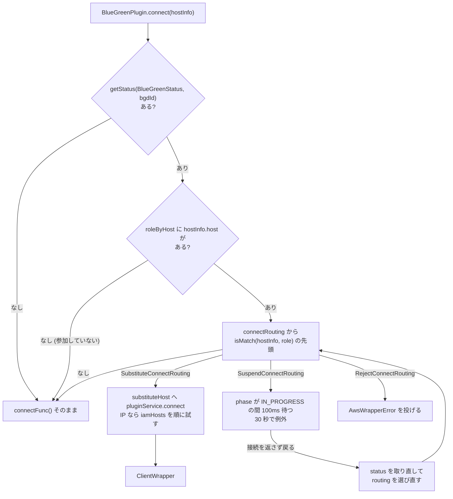

## 何を学んだか

`BlueGreenStatusProvider` は、[2 本のモニタ](../blue-green-status-monitor/)が周ごとに投げてくる `BlueGreenInterimStatus` を受け取り、**「今このフェーズで、どのホストへの connect / query をどう扱うか」**を `BlueGreenStatus` (routing の一覧) にまとめて PluginService の状態キャッシュへ置く。プラグインはそれを読むだけである。

routing は 4 種類しかない。

| routing      | 何をするか                                                                                  |
| ------------ | ------------------------------------------------------------------------------------------- |
| suspend      | フェーズが `IN_PROGRESS` でなくなるまで 100ms 刻みで待つ。上限 `bgConnectTimeoutMs` (30 秒) |
| substitute   | 別のホスト (通常は控えておいた IP) へ繋ぎ替える                                             |
| reject       | 例外を投げて拒否する                                                                        |
| pass-through | 何もしない                                                                                  |

フェーズが進むたびに routing 一覧を作り直し、blue と green の対応表と DNS の追いつき状況で内容が変わる。

## ソースコードのどこか

[`common/lib/plugins/bluegreen/blue_green_status_provider.ts`](https://github.com/aws/aws-advanced-nodejs-wrapper/blob/6d0ba1bdae81a4e1fd274b3569c5dc50cf0a7095/common/lib/plugins/bluegreen/blue_green_status_provider.ts)。

### prepareStatus — モニタからの 1 周ごとの処理

[`#L158`](https://github.com/aws/aws-advanced-nodejs-wrapper/blob/6d0ba1bdae81a4e1fd274b3569c5dc50cf0a7095/common/lib/plugins/bluegreen/blue_green_status_provider.ts#L158)。

```ts title="common/lib/plugins/bluegreen/blue_green_status_provider.ts"
protected async prepareStatus(role: BlueGreenRole, interimStatus: BlueGreenInterimStatus): Promise<void> {
  // ...
  this.updatePhase(role, interimStatus);

  this.interimStatuses[role.value] = interimStatus;
  this.interimStatusHashes[role.value] = statusHash;
  this.lastContextHash = contextHash;

  for (const [host, ip] of interimStatus.startIpAddressesByHostMap) {
    this.hostIpAddresses.set(host, ip);
  }
  interimStatus.hostNames.forEach((x) => this.roleByHost.set(x.toLowerCase(), role));

  this.updateCorrespondingHosts();
  this.updateSummaryStatus(role, interimStatus);
  await this.updateMonitors();
  this.updateStatusCache();
  this.logCurrentContext();
  this.logSwitchoverFinalSummary();
  this.resetContextWhenCompleted();
}
```

順に、フェーズ更新 → IP 表と役割表の更新 → blue/green 対応表 → routing 生成 → モニタの間隔・凍結スイッチ更新 → キャッシュへ書き出し → ログ → 完了なら文脈リセット、である。冒頭にハッシュ比較で「変化なし」を検出する条件があるが、`if` の中身が空で早期 return しないので、毎周ここを全部通る。

### updatePhase — 戻ったらロールバック

[`#L198`](https://github.com/aws/aws-advanced-nodejs-wrapper/blob/6d0ba1bdae81a4e1fd274b3569c5dc50cf0a7095/common/lib/plugins/bluegreen/blue_green_status_provider.ts#L198)。

```ts title="common/lib/plugins/bluegreen/blue_green_status_provider.ts"
if (
  latestInterimPhase &&
  interimStatus.blueGreenPhase &&
  interimStatus.blueGreenPhase.phase < latestInterimPhase.phase
) {
  this.rollback = true;
}
// Do not allow status moves backward (unless it's rollback).
// That could be caused by updating blue/green hosts delays.
if (!this.rollback) {
  if (interimStatus.blueGreenPhase.phase >= this.latestStatusPhase.phase) {
    this.latestStatusPhase = interimStatus.blueGreenPhase;
  }
} else {
  if (interimStatus.blueGreenPhase.phase < this.latestStatusPhase.phase) {
    this.latestStatusPhase = interimStatus.blueGreenPhase;
  }
}
```

blue と green のステータス表は同時に更新されないので、片方が `POST` でもう片方がまだ `IN_PROGRESS` ということが起きる。`latestStatusPhase` は**単調に進む**ようにして揺れを吸収し、同じモニタの中で番号が下がったときだけロールバックと見なして逆方向に動かす。

### updateCorrespondingHosts — blue と green の対応表

[`#L229`](https://github.com/aws/aws-advanced-nodejs-wrapper/blob/6d0ba1bdae81a4e1fd274b3569c5dc50cf0a7095/common/lib/plugins/bluegreen/blue_green_status_provider.ts#L229)。両方のモニタが `startTopology` を持っていれば、

- blue の writer ↔ green の writer
- blue の reader (ソート済み) ↔ green の reader をラウンドロビンで割り当て。green に reader がなければ全部 green の writer
- `cluster-` エンドポイント同士、`cluster-ro-` エンドポイント同士
- カスタムエンドポイントは `removeGreenInstancePrefix` で名前を合わせて対応付け

を `correspondingHosts: Map<blueHost, [blueHostInfo, greenHostInfo | null]>` に入れる。`POST` で「blue への新規接続を green に流す」ときの引き当て表になる。

### フェーズごとの routing

[`#L340`](https://github.com/aws/aws-advanced-nodejs-wrapper/blob/6d0ba1bdae81a4e1fd274b3569c5dc50cf0a7095/common/lib/plugins/bluegreen/blue_green_status_provider.ts#L340) の `updateSummaryStatus` が `latestStatusPhase` で分岐し、`getStatusOf*` を呼ぶ。各関数の先頭コメントがそのまま仕様になっている。

| フェーズ                  | 新規 connect (blue)                                                     | 新規 connect (green)            | IP 直指定の connect | 既存接続の query |
| ------------------------- | ----------------------------------------------------------------------- | ------------------------------- | ------------------- | ---------------- |
| `NOT_CREATED` / `CREATED` | 通す                                                                    | 通す                            | 通す                | 通す             |
| `PREPARATION`             | 控えた IP へ substitute                                                 | 控えた IP へ substitute         | 通す                | 通す             |
| `IN_PROGRESS`             | `bgSuspendNewBlueConnections` なら suspend、既定は IP へ substitute     | suspend                         | suspend             | **suspend**      |
| `POST`                    | 対応する green の IP へ substitute (対応未確定なら見つかるまで suspend) | `Green DNS removed` まで reject | 通す                | 通す             |
| `COMPLETED`               | 通す                                                                    | 通す                            | 通す                | 通す             |



`IN_PROGRESS` の生成部を見る ([`#L513`](https://github.com/aws/aws-advanced-nodejs-wrapper/blob/6d0ba1bdae81a4e1fd274b3569c5dc50cf0a7095/common/lib/plugins/bluegreen/blue_green_status_provider.ts#L513))。

```ts title="common/lib/plugins/bluegreen/blue_green_status_provider.ts"
let connectRouting: ConnectRouting[];
if (this.suspendNewBlueConnectionsWhenInProgress) {
  connectRouting = [];
  connectRouting.push(new SuspendConnectRouting(null, BlueGreenRole.SOURCE, this.bgdId));
} else {
  // If we're not suspending new connections then, at least, we need to use IP addresses.
  connectRouting = this.addSubstituteBlueWithIpAddressConnectRouting();
}
connectRouting.push(new SuspendConnectRouting(null, BlueGreenRole.TARGET, this.bgdId));
// ...IP 直指定の connect にも SuspendConnectRouting(ipAddress, null, ...) を足す

// All blue and green traffic should be on hold.
const executeRouting: ExecuteRouting[] = [];
executeRouting.push(new SuspendExecuteRouting(null, BlueGreenRole.SOURCE, this.bgdId));
executeRouting.push(new SuspendExecuteRouting(null, BlueGreenRole.TARGET, this.bgdId));
```

routing のコンストラクタの第 1 引数が `hostAndPort`、第 2 引数が役割で、`null` は「どれでも」を意味する。`SuspendExecuteRouting(null, SOURCE)` は「blue に繋がっている全接続の query を止める」である。

### COMPLETED を POST に偽装する

[`#L692`](https://github.com/aws/aws-advanced-nodejs-wrapper/blob/6d0ba1bdae81a4e1fd274b3569c5dc50cf0a7095/common/lib/plugins/bluegreen/blue_green_status_provider.ts#L692)。

```ts title="common/lib/plugins/bluegreen/blue_green_status_provider.ts"
// BGD reports that it's completed but DNS hasn't yet updated completely.
// Pretend that status isn't (yet) completed.
if (!this.blueDnsUpdateCompleted || !this.greenDnsRemoved) {
  return this.getStatusOfPost();
}
return new BlueGreenStatus(
  this.bgdId,
  BlueGreenPhase.COMPLETED,
  [],
  [],
  this.roleByHost,
  new Map(),
);
```

`blueDnsUpdateCompleted` は SOURCE モニタの `allStartTopologyIpChanged`、`greenDnsRemoved` は TARGET モニタの `allStartTopologyEndpointsRemoved` から立つ ([`#L425`](https://github.com/aws/aws-advanced-nodejs-wrapper/blob/6d0ba1bdae81a4e1fd274b3569c5dc50cf0a7095/common/lib/plugins/bluegreen/blue_green_status_provider.ts#L425))。RDS が完了を報告しても、DNS が追いつくまでは `POST` の routing (blue → green の substitute、green への reject) を続ける。

### 3 分の保険

[`#L854`](https://github.com/aws/aws-advanced-nodejs-wrapper/blob/6d0ba1bdae81a4e1fd274b3569c5dc50cf0a7095/common/lib/plugins/bluegreen/blue_green_status_provider.ts#L854)。`PREPARATION` に入った時点で `bgSwitchoverTimeoutMs` (180,000ms) のタイマを起動し、`PREPARATION` 以降の各 `getStatusOf*` の先頭で見る。

```ts title="common/lib/plugins/bluegreen/blue_green_status_provider.ts"
if (this.isSwitchoverTimerExpired()) {
  logger.debug(Messages.get("Bgd.switchoverTimeout"));
  if (this.rollback) {
    return this.getStatusOfCreated();
  }
  return this.getStatusOfCompleted();
}
```

切り替えが途中で止まっても、3 分経てば routing を全部外して通常運転に戻る。「止め続けるより通すほうがまし」という判断である。

### suspend の中身

[`routing/suspend_execute_routing.ts#L44`](https://github.com/aws/aws-advanced-nodejs-wrapper/blob/6d0ba1bdae81a4e1fd274b3569c5dc50cf0a7095/common/lib/plugins/bluegreen/routing/suspend_execute_routing.ts#L44)。

```ts title="common/lib/plugins/bluegreen/routing/suspend_execute_routing.ts"
let bgStatus: BlueGreenStatus = pluginService.getStatus<BlueGreenStatus>(BlueGreenStatus, this.bgdId);
const timeoutNanos: bigint = convertMsToNanos(WrapperProperties.BG_CONNECT_TIMEOUT_MS.get(properties));
const endTime: bigint = getTimeInNanos() + timeoutNanos;

while (getTimeInNanos() <= endTime && bgStatus != null && bgStatus.currentPhase === BlueGreenPhase.IN_PROGRESS) {
  await this.delay(SuspendExecuteRouting.SLEEP_TIME_MS, bgStatus, pluginService, this.bgdId);
  bgStatus = pluginService.getStatus<BlueGreenStatus>(BlueGreenStatus, this.bgdId);
}
if (bgStatus != null && bgStatus.currentPhase === BlueGreenPhase.IN_PROGRESS) {
  throw new AwsWrapperError(Messages.get("Bgd.stillInProgressTryMethodLater", ...));
}
return RoutingResultHolder.empty();
```

`RoutingResultHolder.empty()` は「結果を作らなかった」を表す番兵で、プラグイン側の `while` が status を取り直して次の routing を選ぶ ([Blue/Green 切り替えで何が起きるか](../blue-green-switchover/))。`BaseRouting.delay` はモニタと同じく 50ms 刻みで、**status オブジェクトの参照が入れ替わったら**即座に抜ける。Provider が新しい `BlueGreenStatus` を `setStatus` するたびに参照が変わるので、フェーズが進めば 50ms 以内に気づける。

### substitute と IAM ホスト

[`routing/substitute_connect_routing.ts#L53`](https://github.com/aws/aws-advanced-nodejs-wrapper/blob/6d0ba1bdae81a4e1fd274b3569c5dc50cf0a7095/common/lib/plugins/bluegreen/routing/substitute_connect_routing.ts#L53)。差し替え先が IP なら、IAM トークンの署名に使うホスト名 (`iamHosts`) を順に試す。`POST` では green ホストが改名済みかどうかが分からないので、green 名と blue 名の両方を渡し、ログインエラーなら次を試す。ログインエラー以外は即座に投げる。

## なぜそうなっているか

### なぜ「ステータスを作る側」と「適用する側」を分けるのか

routing 一覧は PluginService の状態キャッシュに置かれ、同じ `bgdId` の全クライアントが読む。Provider はプロセスに 1 つ、プラグインはクライアントごとに 1 つである。フェーズ判定・対応表・DNS フラグは全部 Provider に寄せ、プラグインは「一覧から自分に合うものを 1 つ選んで適用する」だけにしてある。切り替えの状態機械を 1 か所にまとめないと、クライアントごとに判断がずれる。

### なぜ IP に差し替えるのか

`PREPARATION` で blue のホスト名を blue の IP に差し替えるのは、一見無意味に見える。理由は `IN_PROGRESS` の直後にある。DNS が green を指し始めた瞬間から、「blue のホスト名で繋ぐ」つもりの接続が green に届く。切り替え前に IP へ固定しておけば、DNS の切り替わりに関係なく blue に届く。`POST` で今度は green の IP に差し替えるのも同じで、DNS がまだ blue (old1) を指していても green に届く。

### なぜ per-host の routing と役割だけの routing があるのか

`SubstituteConnectRouting` は差し替え先がホストごとに違うので `hostAndPort` を指定する。`SuspendConnectRouting(null, SOURCE)` のような役割だけの routing は「blue 全部」を 1 つで表す。ただし次に書くとおり、per-host のほうは現状マッチしない。

## どう活かすか

- **「完了」を外部システムの申告だけで決めない。** `COMPLETED` を `POST` に偽装する分岐は、RDS の状態と DNS の状態が別物だと知っているから書けている。自分のシステムでも、上流の「完了」通知と自分が観測できる事実 (DNS、ヘルスチェック) を分けて持つ
- **単調性を強制して揺れを吸収する。** 2 つの情報源が時間差で更新されるとき、`max` を取って一方向にしか進めないようにするだけで大半の揺れが消える。逆行を許すのは明示的な「ロールバック」の合図があるときだけにする
- **待たせるなら上限と番兵を決める。** suspend は 30 秒で諦めて例外を投げ、`empty()` で「再評価せよ」を返す。無限に待つ routing を書かないことで、3 分タイマと合わせて最悪ケースが計算できる

### つまずきどころ

- **per-host の routing はマッチしない。** [`routing/base_connect_routing.ts#L26`](https://github.com/aws/aws-advanced-nodejs-wrapper/blob/6d0ba1bdae81a4e1fd274b3569c5dc50cf0a7095/common/lib/plugins/bluegreen/routing/base_connect_routing.ts#L26) の `isMatch` は次の式である。

  ```ts title="common/lib/plugins/bluegreen/routing/base_connect_routing.ts"
  return (
    (this.hostAndPort === null ||
      this.hostAndPort === (hostInfo ?? hostInfo.hostAndPort.toLowerCase())) &&
    (this.role === null || this.role === hostRole)
  );
  ```

  `hostInfo ?? ...` は `hostInfo` が非 null なら `hostInfo` そのもの (オブジェクト) を返すので、文字列 `this.hostAndPort` との `===` は常に false になる。`BaseExecuteRouting.isMatch` も同じ式である。したがってコードを読む限り、**`hostAndPort` を指定した routing (`SubstituteConnectRouting`、`SuspendUntilCorrespondingHostFoundConnectRouting`、IP 直指定向けの suspend) は 1 つも選ばれず、`null` 指定の routing だけが効く**。結果として動くのは「`IN_PROGRESS` 中に blue / green の connect と query を止める」「`Green DNS removed` まで green への connect を拒否する」の 2 つで、`PREPARATION` / `POST` の IP 差し替えは起きない。`tests/unit` に routing のテストはない

- **`registerIamHost` は呼ばれない。** [`substitute_connect_routing.ts#L85`](https://github.com/aws/aws-advanced-nodejs-wrapper/blob/6d0ba1bdae81a4e1fd274b3569c5dc50cf0a7095/common/lib/plugins/bluegreen/routing/substitute_connect_routing.ts#L85) の `if (!this.iamSuccessfulConnectNotify)` は条件が逆で、通知関数があるときは呼ばれず、ないときは `null.notify` の例外を握りつぶす。`allGreenHostsChangedName` は立たず、サマリの `Green host certificates changed` 行は出ない
- **`bgConnectTimeoutMs` は connect にも query にも同じ値が使われる。** `SuspendExecuteRouting` も `BG_CONNECT_TIMEOUT_MS` を読む。名前に反して「切り替え中に query を待たせる上限」でもある
- **`bgSuspendNewBlueConnections` の既定は false。** 既定では `IN_PROGRESS` 中も blue への新規接続は (IP 差し替えで) 通す設計だが、上の理由で差し替えは起きず、DNS 次第でどちらに届くかが決まる。切り替え中に新規接続を止めたいなら true にする
