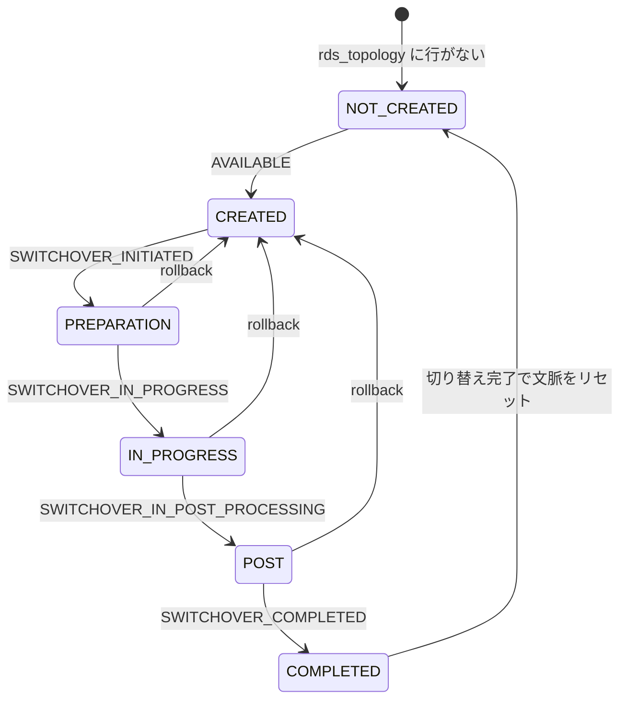

## 何を学んだか

RDS の Blue/Green Deployment は、稼働中の blue 環境の複製として green 環境を作り、**切り替え (switchover) でエンドポイント名を入れ替える**仕組みである。アプリから見ると、同じホスト名の向き先が別のクラスタに変わる。

切り替え中にクライアント側で起きることは、docs の [`UsingTheBlueGreenPlugin.md`](https://github.com/aws/aws-advanced-nodejs-wrapper/blob/6d0ba1bdae81a4e1fd274b3569c5dc50cf0a7095/docs/using-the-nodejs-wrapper/using-plugins/UsingTheBlueGreenPlugin.md) に 5 つ列挙されている。

- blue ホストへの接続が、ある時点で切られる
- 再構成やノード再起動で、一時的に接続できなくなる
- クラスタエンドポイントとインスタンスエンドポイントが別のホストを指すようになる
- 内部のホスト名が変わる (green には `-green-xxxxxx`、旧 blue には `-old1` が付く)
- ホスト名が変わるので、内部の証明書が作り直される

このうち mysql2 が知りうるのは「接続が切れた」ことだけである。`bg` プラグインは、**DB 自身が `mysql.rds_topology` に書き出す切り替えステータス**を読んで 6 つのフェーズに正規化し、フェーズごとに `connect` と `query` の扱い (通す・待たせる・IP に差し替える・拒否する) を切り替える。

## ソースコードのどこか

### 6 つのフェーズ

[`common/lib/plugins/bluegreen/blue_green_phase.ts#L20`](https://github.com/aws/aws-advanced-nodejs-wrapper/blob/6d0ba1bdae81a4e1fd274b3569c5dc50cf0a7095/common/lib/plugins/bluegreen/blue_green_phase.ts#L20)。

```ts title="common/lib/plugins/bluegreen/blue_green_phase.ts"
static readonly NOT_CREATED: BlueGreenPhase = new BlueGreenPhase("NOT_CREATED", 0, false);
static readonly CREATED: BlueGreenPhase = new BlueGreenPhase("CREATED", 1, false);
static readonly PREPARATION: BlueGreenPhase = new BlueGreenPhase("PREPARATION", 2, true);
static readonly IN_PROGRESS: BlueGreenPhase = new BlueGreenPhase("IN_PROGRESS", 3, true);
static readonly POST: BlueGreenPhase = new BlueGreenPhase("POST", 4, true);
static readonly COMPLETED: BlueGreenPhase = new BlueGreenPhase("COMPLETED", 5, true);

private static readonly blueGreenStatusMapping: { [key: string]: BlueGreenPhase } = {
  AVAILABLE: BlueGreenPhase.CREATED,
  SWITCHOVER_INITIATED: BlueGreenPhase.PREPARATION,
  SWITCHOVER_IN_PROGRESS: BlueGreenPhase.IN_PROGRESS,
  SWITCHOVER_IN_POST_PROCESSING: BlueGreenPhase.POST,
  SWITCHOVER_COMPLETED: BlueGreenPhase.COMPLETED
};
```

第 2 引数の番号は順序比較に使う (「フェーズが戻った」= ロールバック検知)。第 3 引数 `isActiveSwitchoverOrCompleted` は、切り替えサマリのログを出すかどうかの判定に使う。`NOT_CREATED` はテーブルに行がない状態で、`parsePhase(undefined)` がこれを返す。



役割は 2 つで、`BLUE_GREEN_DEPLOYMENT_SOURCE` が blue、`BLUE_GREEN_DEPLOYMENT_TARGET` が green である ([`blue_green_role.ts#L24`](https://github.com/aws/aws-advanced-nodejs-wrapper/blob/6d0ba1bdae81a4e1fd274b3569c5dc50cf0a7095/common/lib/plugins/bluegreen/blue_green_role.ts#L24))。テーブルの中身は [Blue/Green の MySQL 側メタデータ](../blue-green-mysql-metadata/) で読む。

### ホスト名に付く接尾辞

切り替えの前後で、RDS はホスト名に接尾辞を付ける。ラッパはそれを正規表現で判定する ([`utils/rds_utils.ts#L121`](https://github.com/aws/aws-advanced-nodejs-wrapper/blob/6d0ba1bdae81a4e1fd274b3569c5dc50cf0a7095/common/lib/utils/rds_utils.ts#L121))。

```ts title="common/lib/utils/rds_utils.ts"
private static readonly BG_GREEN_HOST_PATTERN = /.*(?<prefix>-green-[0-9a-z]{6})\..*/i;
private static readonly BG_OLD_HOST_PATTERN = /.*(?<prefix>-old1)\..*/i;
```

green 環境のホストは `my-db-green-abc123.cluster-xyz.us-east-1.rds.amazonaws.com` のように 6 文字のランダム接尾辞を持ち、切り替え後に接尾辞なしの名前 (元 blue の名前) に改名される。旧 blue は `my-db-old1` になる。`isNotOldInstance` はステータス表の行から `-old1` を除外するために、`removeGreenInstancePrefix` は blue のカスタムエンドポイントと green の対応を名前で引くために使われる。

### プラグインが差し込まれる場所

[`blue_green_plugin.ts#L37`](https://github.com/aws/aws-advanced-nodejs-wrapper/blob/6d0ba1bdae81a4e1fd274b3569c5dc50cf0a7095/common/lib/plugins/bluegreen/blue_green_plugin.ts#L37)。

```ts title="common/lib/plugins/bluegreen/blue_green_plugin.ts"
private static readonly SUBSCRIBED_METHODS: Set<string> = new Set([
  // We should NOT subscribe to "forceConnect" pipeline since it's used by
  // BG monitoring, and we don't want to intercept/block those monitoring connections.
  "connect",
  "query"
]);

private static readonly CLOSED_METHOD_NAMES: Set<string> = new Set(["end", "abort"]);
```

購読は `connect` と `query` の 2 つだけである。`forceConnect` を購読しないのは、監視用接続が自分自身に止められないためだ ([9 本のパイプライン](../pipelines/))。`end` と `abort` は購読外なので、`CLOSED_METHOD_NAMES` の分岐には実際には到達しない。

`connect` の本体は、PluginService の状態キャッシュから `BlueGreenStatus` を引き、その中の routing 一覧から自分に合うものを適用する ([`#L79`](https://github.com/aws/aws-advanced-nodejs-wrapper/blob/6d0ba1bdae81a4e1fd274b3569c5dc50cf0a7095/common/lib/plugins/bluegreen/blue_green_plugin.ts#L79))。

```ts title="common/lib/plugins/bluegreen/blue_green_plugin.ts"
this.bgStatus = this.pluginService.getStatus(BlueGreenStatus, this.bgdId);
if (!this.bgStatus) {
  return this.regularOpenConnection(connectFunc, isInitialConnection);
}
// ...
const hostRole: BlueGreenRole = this.bgStatus.getRole(hostInfo);
if (!hostRole) {
  // Connection to a host that isn't participating in BG switchover.
  return this.regularOpenConnection(connectFunc, isInitialConnection);
}

let routing: ConnectRouting | undefined = this.bgStatus.connectRouting.filter(
  (routing: ConnectRouting) => routing.isMatch(hostInfo, hostRole),
)[0];
if (!routing) {
  return this.regularOpenConnection(connectFunc, isInitialConnection);
}

this.startTimeNano = getTimeInNanos();
while (routing && !client) {
  client = await routing.apply(
    this,
    hostInfo,
    props,
    isInitialConnection,
    connectFunc,
    this.pluginService,
  );
  if (client) {
    break;
  }
  this.bgStatus = this.pluginService.getStatus<BlueGreenStatus>(BlueGreenStatus, this.bgdId);
  if (!this.bgStatus) {
    this.endTimeNano = getTimeInNanos();
    return this.regularOpenConnection(connectFunc, isInitialConnection);
  }
  routing = this.bgStatus.connectRouting.filter((routing: ConnectRouting) =>
    routing.isMatch(hostInfo, hostRole),
  )[0];
}
```

「ステータスがない」「このホストは切り替えに参加していない」「合う routing がない」の 3 つは全部素通しである。routing が接続を返さずに戻ってきたら (待機系の routing はそうする)、ステータスを取り直して routing を選び直す。この `while` が、待機中にフェーズが進んだときに次の扱いへ移る仕組みになっている。routing の中身は [BlueGreenStatusProvider — フェーズ遷移と routing](../blue-green-status-provider/) で読む。

### Provider はプロセスに 1 つ

[`#L218`](https://github.com/aws/aws-advanced-nodejs-wrapper/blob/6d0ba1bdae81a4e1fd274b3569c5dc50cf0a7095/common/lib/plugins/bluegreen/blue_green_plugin.ts#L218)。

```ts title="common/lib/plugins/bluegreen/blue_green_plugin.ts"
private static provider: Map<string, BlueGreenStatusProvider> = new Map();

private initProvider() {
  const provider = BlueGreenPlugin.provider.get(this.bgdId);
  if (!provider) {
    const provider = this.bgProviderSupplier.create(this.servicesContainer, this.properties, this.bgdId);
    BlueGreenPlugin.provider.set(this.bgdId, provider);
  }
}
```

`static` の Map なので、`bgdId` ごとにプロセスで 1 つの Provider (= 監視ループ 2 本) しか作られない。呼ばれるのは初回接続の**後**で、コメントにあるとおり Dialect が確定してからでないと `rds_topology` を読めるかどうかが分からないためである。ステータスは PluginService の状態キャッシュ (`setStatus` / `getStatus`、キーは `${bgdId}::BlueGreenStatus`) 経由で全クライアントに共有される。

### 設定値

[`wrapper_property.ts#L694`](https://github.com/aws/aws-advanced-nodejs-wrapper/blob/6d0ba1bdae81a4e1fd274b3569c5dc50cf0a7095/common/lib/wrapper_property.ts#L694) からの 7 つ。

| パラメータ                    | 既定    | 意味                                                                                                                                  |
| ----------------------------- | ------- | ------------------------------------------------------------------------------------------------------------------------------------- |
| `bgdId`                       | `"1"`   | Blue/Green Deployment の識別子。複数の BGD に繋ぐなら必須。`clusterId` と同じ「省略すると衝突する」設計 ([clusterId](../cluster-id/)) |
| `bgConnectTimeoutMs`          | 30,000  | 切り替え中に connect / query を待たせる上限                                                                                           |
| `bgBaselineMs`                | 60,000  | ステータス確認の基本間隔                                                                                                              |
| `bgIncreasedMs`               | 1,000   | BGD が作られた後の間隔                                                                                                                |
| `bgHighMs`                    | 100     | 切り替え中の間隔                                                                                                                      |
| `bgSwitchoverTimeoutMs`       | 180,000 | 切り替えが止まったと見なして通常運転に戻す上限                                                                                        |
| `bgSuspendNewBlueConnections` | `false` | `IN_PROGRESS` 中の blue への新規接続を待たせるか (既定は IP 差し替え)                                                                 |

### 切り替えサマリ

切り替えが完了 (またはロールバック) すると、Provider が各フェーズの開始時刻を表にして `info` ログに出す。docs の例をそのまま引く。

```
----------------------------------------------------------------------------
timestamp                         time offset (ms)                     event
----------------------------------------------------------------------------
2025-04-23T17:39:23.529507Z             -46468 ms               NOT_CREATED
2025-04-23T17:39:23.795213Z             -46202 ms                   CREATED
2025-04-23T17:40:07.411020Z              -2585 ms               PREPARATION
2025-04-23T17:40:09.996344Z                  0 ms               IN_PROGRESS
2025-04-23T17:40:17.429581Z               7434 ms                      POST
2025-04-23T17:40:35.853160Z              25857 ms    Green topology changed
2025-04-23T17:40:48.537135Z              38543 ms          Blue DNS updated
2025-04-23T17:42:23.163572Z             133174 ms         Green DNS removed
2025-04-23T17:42:26.536226Z             136547 ms                 COMPLETED
----------------------------------------------------------------------------
```

時刻ゼロが `IN_PROGRESS` の開始で、`POST` までは 7 秒だが、**DNS が blue の新しい IP を返し始めるまで 38 秒、green の DNS 名が消えるまで 133 秒**かかっている。RDS が「完了」と言ってから DNS が追いつくまでの差が、このプラグインが存在する理由そのものである。

## なぜそうなっているか

### 「切り替え完了」と DNS の更新がずれる

RDS 側の切り替えは数十秒で終わるが、クラスタエンドポイントの DNS が新しい IP を返し始めるのはその後で、しかもクライアントの DNS キャッシュが切れるまではさらに遅れる。フェイルオーバー時の StaleDns と同じ構造だが ([StaleDns](../stale-dns/))、Blue/Green では**blue と green のどちらもホスト名が変わる**ので、「クラスタエンドポイントが指す先をトポロジで検証する」だけでは足りない。

そのため Provider は、切り替え前の `CREATED` フェーズのうちに、blue と green の全エンドポイントと IP アドレスを控えておく。切り替え中は控えた IP で接続し、DNS が追いつくまで (`Blue DNS updated` / `Green DNS removed`) は `COMPLETED` を `POST` として扱い続ける。

### なぜ query まで止めるのか

`IN_PROGRESS` 中は新規接続だけでなく、**既存接続の `query` も待たせる**。docs には「blue ノードの負荷を下げ、green のトランザクション遅延を減らし、切り替え全体を速くするため」とある。切り替えは green が blue に追いついた時点で行われるので、blue に書き込みが流れ続けるほど完了が遅れる。クライアント側で書き込みを止めるのは、切り替えを短くする最も直接的な手段である。

### なぜ購読が connect と query だけなのか

`forceConnect` を購読すると、自分の監視接続まで待機させることになる。監視接続はステータスを読み進めるために切り替え中も繋ぎ続ける必要があるので、監視系は例外なく `forceConnect` を通る ([DefaultPlugin と ConnectionProvider](../default-plugin-and-connection-provider/))。

## どう活かすか

docs の手順は「先に `bg` を入れてデプロイし、数分待ってから切り替えを始め、終わったら `bg` を外す」である。監視は `CREATED` になってから IP とトポロジを集めるので、**切り替え直前に有効化しても間に合わない**。

- **`bgdId` を BGD ごとに分ける。** 既定は `"1"` で、2 つの BGD に繋ぐアプリで省略すると Provider と監視ループを共有してしまう
- **完了後は外す。** 有効なままでも害はないが、監視接続 2 本と 60 秒ごとのクエリが残る
- **IAM 認証なら `GRANT SELECT ON mysql.*` が要る。** ステータス表が `mysql` スキーマにある ([IAM 認証プラグイン](../iam-plugin/))

### 対応範囲

docs の Prerequisites と互換性表から。

| 対象                                      | 対応                                        |
| ----------------------------------------- | ------------------------------------------- |
| Aurora MySQL クラスタ                     | 3.07 以上                                   |
| RDS MySQL (Single-AZ / Multi-AZ instance) | 可                                          |
| RDS Multi-AZ DB Cluster                   | 不可                                        |
| Aurora Global Database                    | 不可                                        |
| CNAME で繋ぐ                              | 不可                                        |
| 内部の `rds_topology` がない版            | 従来の挙動にフォールバック (実質何もしない) |

### つまずきどころ

- **監視接続用の接頭辞は効かない。** docs は `blue-green-monitoring-` と書いているが、コードの `BG_MONITORING_PROPERTY_PREFIX` は `blue_green_monitoring_` である。しかもどちらで書いても、`BlueGreenStatusProvider.getMonitoringProperties` は接頭辞付きのキーを**削除するだけで、接頭辞を剥がした値を入れ直さない** ([BlueGreenStatusMonitor](../blue-green-status-monitor/))。監視接続に効くのは、`wrapperConnectTimeout` / `wrapperQueryTimeout` が未設定のときの既定 10 秒だけである
- **`execute()` (prepared statement) は止まらない。** 購読が `query` だけなので、`client.execute()` は切り替え中も素通りする。切り替え中に blue に到達すれば接続が切られてエラーになる
- **community MySQL に `bg` を付けると初回接続が失敗する。** Provider は Dialect が `BlueGreenDialect` を実装しているかを実質チェックせず (`isBlueGreenDialect` は引数をそのまま返す)、監視ループのコンストラクタが `Bgd.unsupportedDialect` を投げる。互換性表の「community ✗」はこの意味である
