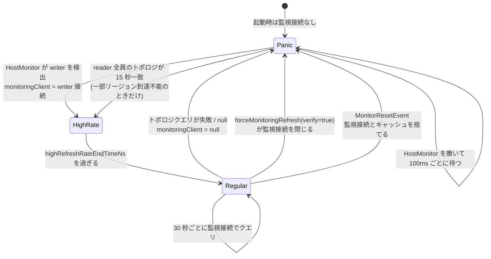

## 何を学んだか

`ClusterTopologyMonitorImpl` は [RdsHostListProvider](../host-list-providers/) の裏で走り続けるタスクで、`MonitorService` に `clusterId` をキーに 1 本だけ置かれる。やることは「トポロジキャッシュを最新に保つ」の 1 点で、そのために 3 つのモードを行き来する。

| モード      | 判定                          | 間隔                                       | 何をするか                                             |
| ----------- | ----------------------------- | ------------------------------------------ | ------------------------------------------------------ |
| 通常 (低速) | 監視接続がある                | `clusterTopologyRefreshRateMs` = 30 秒     | 監視接続でトポロジクエリを 1 本打つ                    |
| パニック    | 監視接続がない                | `clusterTopologyHighRefreshRateMs` = 100ms | 全ホストに `HostMonitor` を撒き、writer の名乗りを待つ |
| 高速        | `highRefreshRateEndTimeNs` 内 | 100ms                                      | 通常と同じ処理を高頻度で回す                           |

モードを表す変数はなく、**`monitoringClient` が `null` かどうか**がパニックの定義になっている。



## ソースコードのどこか

### 生成と共有

[`common/lib/host_list_provider/monitoring/cluster_topology_monitor.ts#L61`](https://github.com/aws/aws-advanced-nodejs-wrapper/blob/6d0ba1bdae81a4e1fd274b3569c5dc50cf0a7095/common/lib/host_list_provider/monitoring/cluster_topology_monitor.ts#L61)。

```ts title="common/lib/host_list_provider/monitoring/cluster_topology_monitor.ts"
export class ClusterTopologyMonitorImpl extends AbstractMonitor implements ClusterTopologyMonitor {
  private static readonly MONITOR_TERMINATION_TIMEOUT_SEC: number = 30;
  private static readonly STABLE_TOPOLOGIES_DURATION_NS: bigint = convertMsToNanos(15000); // 15 seconds.
  protected static readonly DEFAULT_CONNECTION_TIMEOUT_MS: number = 5000;
  protected static readonly DEFAULT_QUERY_TIMEOUT_MS: number = 5000;
```

コンストラクタは接続プロパティから `topology_monitoring_` 接頭辞のものを剥がして監視用プロパティを作り、`wrapperConnectTimeout` / `wrapperQueryTimeout` が指定されていなければ 5 秒を入れる ([`#L145`](https://github.com/aws/aws-advanced-nodejs-wrapper/blob/6d0ba1bdae81a4e1fd274b3569c5dc50cf0a7095/common/lib/host_list_provider/monitoring/cluster_topology_monitor.ts#L145))。

```ts title="common/lib/host_list_provider/monitoring/cluster_topology_monitor.ts"
this._monitoringProperties = new Map<string, any>(props);
for (const [key, val] of props) {
  if (key.startsWith(WrapperProperties.TOPOLOGY_MONITORING_PROPERTY_PREFIX)) {
    this._monitoringProperties.set(
      key.substring(WrapperProperties.TOPOLOGY_MONITORING_PROPERTY_PREFIX.length),
      val,
    );
    this._monitoringProperties.delete(key);
  }
}

const connectTimeout =
  this._monitoringProperties.get(WrapperProperties.WRAPPER_CONNECT_TIMEOUT.name) ??
  ClusterTopologyMonitorImpl.DEFAULT_CONNECTION_TIMEOUT_MS;
const queryTimeout =
  this._monitoringProperties.get(WrapperProperties.WRAPPER_QUERY_TIMEOUT.name) ??
  ClusterTopologyMonitorImpl.DEFAULT_QUERY_TIMEOUT_MS;
const driverDialect = this._pluginService.getDriverDialect();
driverDialect.setConnectTimeout(this._monitoringProperties, connectTimeout);
driverDialect.setQueryTimeout(this._monitoringProperties, undefined, queryTimeout);
```

監視接続はアプリの接続とは別のタイムアウトを持つ。アプリ側で `wrapperQueryTimeout` を長く取っていても、監視は 5 秒で見切る。

`MonitorService` 側の設定は `runIfAbsent` の既定で、有効期限 15 分 (呼ばれるたびに延長)、非活動 3 分、エラー時は作り直し ([`monitor_service.ts#L121`](https://github.com/aws/aws-advanced-nodejs-wrapper/blob/6d0ba1bdae81a4e1fd274b3569c5dc50cf0a7095/common/lib/utils/monitoring/monitor_service.ts#L121))。この仕組みは [MonitorService](../monitor-service/) で読む。

### メインループ

[`#L427`](https://github.com/aws/aws-advanced-nodejs-wrapper/blob/6d0ba1bdae81a4e1fd274b3569c5dc50cf0a7095/common/lib/host_list_provider/monitoring/cluster_topology_monitor.ts#L427) の `monitor()` を骨だけにするとこうなる。

```ts title="common/lib/host_list_provider/monitoring/cluster_topology_monitor.ts (骨子)"
while (!this._stop) {
  this.lastActivityTimestampNanos = getTimeInNanos();

  if (this.isInPanicMode()) {
    // monitoringClient === null
    if (this.submittedHosts.size === 0) {
      // HostMonitor をまだ撒いていない → トポロジを手に入れて全ホストに撒く
      let hosts = this.getStoredHosts() ?? (await this.openAnyClientAndUpdateTopology());
      if (hosts === null || this.monitoringClient !== null) {
        await this.delay(true);
        continue;
      }
      for (const hostInfo of this.filterHostsForHostMonitoring(hosts)) {
        /* new HostMonitor(...).run() を submittedHosts に登録 */
      }
    } else if (this.hostMonitorsWriterClient && this.hostMonitorsWriterInfo) {
      // HostMonitor が writer を見つけた → その接続を監視接続に昇格
      this.monitoringClient = writerClient; /* 経由: connectionHandler.acceptConnection */
      this.highRefreshRateEndTimeNs = getTimeInNanos() + BigInt(this.highRefreshRateNs);
      await this.closeHostMonitors();
      await this.delay(true);
      continue;
    } else {
      // HostMonitor は走っている → reader が報告した最新トポロジで撒き直し
    }
    await this.checkForStableReaderTopologies();
    await this.delay(true);
  } else {
    // 通常モード
    const hosts = await this.fetchTopologyAndUpdateCache(this.monitoringClient);
    if (hosts === null) {
      // 取れなかった → 監視接続を捨ててパニックへ
      await this.closeConnection(this.monitoringClient);
      this.monitoringClient = null;
      this.writerHostInfo = null;
      await this.delay(false);
      continue;
    }
    this.lastKnownWriterHostInfo =
      hosts.find((h) => h.role === HostRole.WRITER) ?? this.lastKnownWriterHostInfo;
    await this.getConnectionHandler().attemptConnectionUpgrade(
      this.filterHostsForHostMonitoring(hosts),
    );
    if (this.highRefreshRateEndTimeNs > 0 && getTimeInNanos() > this.highRefreshRateEndTimeNs) {
      this.highRefreshRateEndTimeNs = BigInt(0);
    }
    await this.delay(false);
  }
}
```

`isInPanicMode` の定義は 1 行である ([`#L814`](https://github.com/aws/aws-advanced-nodejs-wrapper/blob/6d0ba1bdae81a4e1fd274b3569c5dc50cf0a7095/common/lib/host_list_provider/monitoring/cluster_topology_monitor.ts#L814))。

```ts title="common/lib/host_list_provider/monitoring/cluster_topology_monitor.ts"
private isInPanicMode(): boolean {
  return !this.monitoringClient;
}
```

パニックモードで撒かれる `HostMonitor` の中身は [「自分は writer か」を全ホストに聞く](../am-i-a-writer/) で読む。

### 待ち時間の作り方

[`#L822`](https://github.com/aws/aws-advanced-nodejs-wrapper/blob/6d0ba1bdae81a4e1fd274b3569c5dc50cf0a7095/common/lib/host_list_provider/monitoring/cluster_topology_monitor.ts#L822)。

```ts title="common/lib/host_list_provider/monitoring/cluster_topology_monitor.ts"
private async delay(useHighRefreshRate: boolean): Promise<void> {
  if (getTimeInNanos() < this.highRefreshRateEndTimeNs) {
    useHighRefreshRate = true;
  }
  const delayNs = useHighRefreshRate ? this.highRefreshRateNs : this.refreshRateNs;
  const endTime: bigint = getTimeInNanos() + BigInt(delayNs);
  await sleep(50);
  while (getTimeInNanos() < endTime && !this.requestToUpdateTopology && !this._stop) {
    await sleep(50);
  }
}
```

30 秒を 1 回 `sleep` するのではなく 50ms 刻みで刻む。`requestToUpdateTopology` が立てば途中で抜ける。この旗を立てるのが `waitTillTopologyGetsUpdated` で、failover2 が「今すぐ取り直して」と頼む経路になる。

### 外から起こす — `forceMonitoringRefresh`

[`#L217`](https://github.com/aws/aws-advanced-nodejs-wrapper/blob/6d0ba1bdae81a4e1fd274b3569c5dc50cf0a7095/common/lib/host_list_provider/monitoring/cluster_topology_monitor.ts#L217)。

```ts title="common/lib/host_list_provider/monitoring/cluster_topology_monitor.ts"
async forceMonitoringRefresh(shouldVerifyWriter: boolean, timeoutMs: number): Promise<HostInfo[] | null> {
  if (shouldVerifyWriter) {
    const client = this.monitoringClient;
    this.monitoringClient = null;
    if (client) {
      await this.closeConnection(client);
    }
  }

  return await this.waitTillTopologyGetsUpdated(timeoutMs);
}

async waitTillTopologyGetsUpdated(timeoutMs: number): Promise<HostInfo[] | null> {
  // Notify the monitoring task, which may be sleeping, that topology should be refreshed immediately.
  this.requestToUpdateTopology = true;

  const currentHosts: HostInfo[] = this.getStoredHosts();

  if (timeoutMs === 0) {
    logger.info(logTopology(currentHosts, Messages.get("ClusterTopologyMonitoring.timeoutSetToZero")));
    return currentHosts;
  }

  const endTime = Date.now() + timeoutMs;
  let latestHosts: HostInfo[];

  while ((latestHosts = this.getStoredHosts()) === currentHosts && Date.now() < endTime) {
    await sleep(1000);
  }

  if (Date.now() >= endTime) {
    throw new AwsTimeoutError(Messages.get("ClusterTopologyMonitor.timeoutError", timeoutMs.toString()));
  }
  return latestHosts;
}
```

`shouldVerifyWriter = true` は**監視接続をわざと閉じる**。閉じればパニックモードに入り、全ホストへ「writer か」と聞く手順が走る。failover2 の writer フェイルオーバーは `forceMonitoringRefresh(true, failoverTimeoutMs)` を呼び ([`failover2_plugin.ts#L375`](https://github.com/aws/aws-advanced-nodejs-wrapper/blob/6d0ba1bdae81a4e1fd274b3569c5dc50cf0a7095/common/lib/plugins/failover2/failover2_plugin.ts#L375))、これで「検証済みの writer が見つかるまで待つ」を実現している ([failover2 の writer フェイルオーバー](../failover2-writer/))。

`waitTillTopologyGetsUpdated` の待ち方は「キャッシュの配列オブジェクトが差し替わるまで 1 秒ごとに見る」である。参照の同一性を見ているので、同じ内容でも `updateTopologyCache` が走れば新しい配列になって抜ける。`timeoutMs = 0` は待たずに今のキャッシュを返す。reader フェイルオーバーはこちらを使う ([`#L255`](https://github.com/aws/aws-advanced-nodejs-wrapper/blob/6d0ba1bdae81a4e1fd274b3569c5dc50cf0a7095/common/lib/plugins/failover2/failover2_plugin.ts#L255))。

### 最初の接続の取り方

起動直後は監視接続がないのでパニックから始まる。`getStoredHosts()` も空なので `openAnyClientAndUpdateTopology` が接続文字列の初期ホストに繋ぐ ([`#L280`](https://github.com/aws/aws-advanced-nodejs-wrapper/blob/6d0ba1bdae81a4e1fd274b3569c5dc50cf0a7095/common/lib/host_list_provider/monitoring/cluster_topology_monitor.ts#L280))。

```ts title="common/lib/host_list_provider/monitoring/cluster_topology_monitor.ts"
client = await this.servicesContainer.pluginService.forceConnect(
  this.initialHostInfo,
  this._monitoringProperties,
);
// ...
let isWriter = false;
try {
  isWriter = await this.topologyUtils.isWriterInstance(client);
} catch (error) {
  // Do nothing — assume not a writer.
}
if (isWriter) {
  if (this.rdsUtils.isRdsInstance(this.initialHostInfo.host)) {
    this.writerHostInfo = this.initialHostInfo;
  } else {
    const pair: [string, string] = await this.topologyUtils.getInstanceId(client);
    const instanceTemplate: HostInfo = await this.getInstanceTemplate(pair[1], client);
    this.writerHostInfo = this.topologyUtils.createHost(
      pair[0],
      pair[1],
      true,
      0,
      Date.now(),
      this.initialHostInfo,
      instanceTemplate,
    );
  }
  this.lastKnownWriterHostInfo = this.writerHostInfo;
}

// Offer the connection to the handler. If rejected, close it.
if (!this.getConnectionHandler().acceptConnection(client, isWriter, this.initialHostInfo)) {
  await this.closeConnection(client);
}
```

繋いだ接続を `MonitoringConnectionHandler` に差し出し、受け入れられれば `monitoringClient` になってパニックを抜ける。受け入れるかどうかは `monitoringConnectionPriority` で決まる ([`aurora_monitoring_connection_handler.ts#L30`](https://github.com/aws/aws-advanced-nodejs-wrapper/blob/6d0ba1bdae81a4e1fd274b3569c5dc50cf0a7095/common/lib/host_list_provider/monitoring/aurora_monitoring_connection_handler.ts#L30))。既定の `strict-writer` でも、監視接続が 1 本もなければ何でも受け入れる ([`monitoring_connection_handler.ts#L139`](https://github.com/aws/aws-advanced-nodejs-wrapper/blob/6d0ba1bdae81a4e1fd274b3569c5dc50cf0a7095/common/lib/host_list_provider/monitoring/monitoring_connection_handler.ts#L139))。reader に繋がったなら、通常モードの各周回で `attemptConnectionUpgrade` が writer への乗り換えを試す ([`#L184`](https://github.com/aws/aws-advanced-nodejs-wrapper/blob/6d0ba1bdae81a4e1fd274b3569c5dc50cf0a7095/common/lib/host_list_provider/monitoring/monitoring_connection_handler.ts#L184))。

### 高速モードの長さ

writer を検出したときに `highRefreshRateEndTimeNs` が設定される ([`#L496`](https://github.com/aws/aws-advanced-nodejs-wrapper/blob/6d0ba1bdae81a4e1fd274b3569c5dc50cf0a7095/common/lib/host_list_provider/monitoring/cluster_topology_monitor.ts#L496))。

```ts title="common/lib/host_list_provider/monitoring/cluster_topology_monitor.ts"
this.highRefreshRateEndTimeNs = getTimeInNanos() + BigInt(this.highRefreshRateNs);
```

`highRefreshRateNs` は `clusterTopologyHighRefreshRateMs` (既定 100ms) をナノ秒にしたもので、**周期と同じ値を期間にも使っている**。`UsingTheFailover2Plugin.md` は「新 writer 検出後 30 秒間は高頻度で更新し続け、全 reader がトポロジに現れるのを待つ」と書いているが、このコードでは高速モードは 100ms 後に終わり、次の周回から 30 秒間隔に戻る。docs とコードが食い違っている箇所で、高速期間を長くしたいなら `clusterTopologyHighRefreshRateMs` を伸ばすしかないが、それは周期も伸ばしてしまう。

### リセット

`MonitorResetEvent` を `EventPublisher` から受けると `reset()` が走る ([`#L741`](https://github.com/aws/aws-advanced-nodejs-wrapper/blob/6d0ba1bdae81a4e1fd274b3569c5dc50cf0a7095/common/lib/host_list_provider/monitoring/cluster_topology_monitor.ts#L741))。`clusterId` が一致するときだけで、HostMonitor を止め、監視接続を閉じ、`Topology` キャッシュを消し、`requestToUpdateTopology` を立ててループを起こす。全部を捨てて最初 (パニック) からやり直す操作である。

## なぜそうなっているか

### 監視接続の有無をモードにする

「今トポロジを信じてよいか」は「writer に繋がった接続でトポロジを取れているか」と同じ問いである。writer 接続が生きていれば、そこから取ったトポロジは一次情報 (`UsingTheFailover2Plugin.md`: "Using a connection to a writer host allows to get topology first hand without a risk of getting stale data")。切れたら、どの reader のトポロジも古い可能性があるので、全員に直接聞き直す。

モードを別変数で持つと、接続の状態と変数がずれる余地ができる。`monitoringClient` そのものを判定に使えば、ずれない。

### failover2 が「待つだけ」で済む

failover v1 は各接続が自分でトポロジを取り、自分で新 writer を探した (`UsingTheFailoverPlugin.md` Picture 1)。100 本の接続が同時に落ちれば 100 本が同時に探す。

failover2 は `forceMonitoringRefresh` でモニタに頼み、`waitTillTopologyGetsUpdated` でキャッシュが差し替わるのを待つだけになった。探すのはモニタ 1 本 + ホスト数分の `HostMonitor` で、接続数に比例しない。`ClusterTopologyMonitor` が「クラスタにつき 1 本」であることと、failover2 の軽さは同じことの両面である。

### 50ms 刻みの `sleep`

`sleep(30000)` を 1 回で待つと、途中で `requestToUpdateTopology` が立っても 30 秒は起きられない。フェイルオーバーは「今すぐ」が要る場面なので、粗い刻みで起きる余地を作っている。50ms 刻みでも 30 秒間に 600 回のタイマーで、Node.js には無視できる負荷である。

`waitTillTopologyGetsUpdated` 側の 1 秒刻みは、こちらが「キャッシュが変わったか」を見るだけなので粗くてよい。ただし `timeoutMs` が 1 秒未満だと、1 回 `sleep(1000)` してから必ず `AwsTimeoutError` になる。

## どう活かすか

- **状態機械の状態を、状態を表す「実体」そのもので判定する。** `monitoringClient === null` がパニックであり、別にフラグを持たない
- **待機ループは「起こされる」経路を先に設計する。** 長い `sleep` は起こせない。刻んで旗を見る、という形にすると外部から割り込める
- **共有リソースの設定は最初の利用者のものになる。** `topology_monitoring_` 系の設定は 1 つ目の接続で固定され、以後変えられない ([clusterId](../cluster-id/))

### 実務で踏む失敗パターン

- **監視用接続のタイムアウトが 5 秒固定と思い込む。** `wrapperConnectTimeout` / `wrapperQueryTimeout` を設定していれば、それが監視にも使われる。アプリ側で 60 秒にしていると、監視も 60 秒待つ。`topology_monitoring_wrapperQueryTimeout` で監視だけ別にできる
- **高速モードは 100ms しか続かない。** 新 writer 検出直後に全 reader が揃うまで高頻度で追う、という docs の記述はコードと一致しない。フェイルオーバー直後にトポロジの reader が欠けて見えたら、次の 30 秒周回まで待つ
- **監視接続が reader のまま固定される。** `monitoringConnectionPriority` の既定 `strict-writer` では、writer に繋げなかった間は reader を使い、各周回で writer への乗り換えを試す。writer にセキュリティグループで繋げない構成だと、毎周回で接続試行が失敗し続ける
- **プロセスが終わらない。** モニタは非活動 3 分で片付くが、それまではイベントループを生かす。`client.end()` だけでは止まらず、`PluginManager.releaseResources()` が要る ([バックグラウンドタスクと Node.js プロセス](../background-tasks-and-process/))
