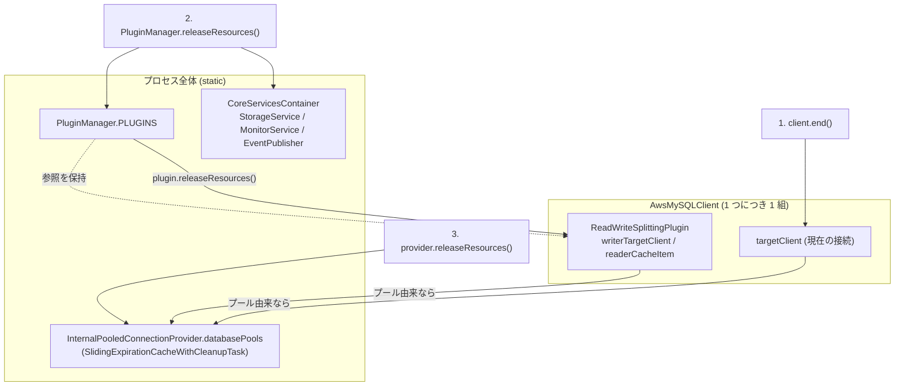

## 何を学んだか

`client.end()` を呼べば接続が閉じる、で済むのは mysql2 だけである。ラッパでは接続の持ち主が 3 層に分かれていて、それぞれ閉じ方が違う。

| 層         | 持ち主                                                         | 閉じる操作                    | 実体                                                                                                    |
| ---------- | -------------------------------------------------------------- | ----------------------------- | ------------------------------------------------------------------------------------------------------- |
| 現在の接続 | `AwsClient.targetClient`                                       | `end()` / `abort()`           | `MySQLClientWrapper` なら mysql2 の `end()` / `destroy()`、`PoolClientWrapper` ならどちらも `release()` |
| 予備の接続 | readWriteSplitting の `writerTargetClient` / `readerCacheItem` | `closeIdleClients()`          | `abort()` で捨てる。`PluginManager.releaseResources()` から呼ばれる                                     |
| プール     | `InternalPooledConnectionProvider.databasePools` (static)      | `provider.releaseResources()` | 30 分 sliding + 10 分ごとの掃除。アクティブ 0 なら `pool.end()`                                         |

- プールの寿命を司る `SlidingExpirationCache` は、**触るたびに期限が延びる** (`computeIfAbsent` が `updateExpiration` を呼ぶ)。掃除はアクセス時に間引きで走る
- `SlidingExpirationCacheWithCleanupTask` はそれを**バックグラウンドの `while` + `sleep` ループ**に置き換える。タイマーは `unref()` されているので、このループがプロセスの終了を妨げることはない
- 掃除は「期限切れ かつ `shouldDisposeFunc` が true (= アクティブ接続 0)」のときだけ。使用中のプールは期限が切れても残る
- 解放は **`PluginManager.releaseResources()` → `provider.releaseResources()` の順**。逆にすると、プラグインがまだ持っている接続をプールが先に閉じる



## ソースコードのどこか

### `SlidingExpirationCache` — 触ると延びる

[`common/lib/utils/sliding_expiration_cache.ts#L21`](https://github.com/aws/aws-advanced-nodejs-wrapper/blob/6d0ba1bdae81a4e1fd274b3569c5dc50cf0a7095/common/lib/utils/sliding_expiration_cache.ts#L21)。

```ts title="common/lib/utils/sliding_expiration_cache.ts"
export class SlidingExpirationCache<K, V> {
  protected _cleanupIntervalNanos: bigint = BigInt(10 * 60_000_000_000); // 10 minutes
  private readonly _shouldDisposeFunc?: (item: V) => boolean;
  private readonly _itemDisposalFunc?: (item: V) => void;
  map: Map<K, CacheItem<V>> = new Map<K, CacheItem<V>>();
  private _cleanupTimeNanos: bigint;

  computeIfAbsent(key: K, mappingFunc: (key: K) => V, itemExpirationNanos: bigint): V | null {
    this.cleanUp();
    const cacheItem = MapUtils.computeIfAbsent(
      this.map,
      key,
      (k) => new CacheItem(mappingFunc(k), getTimeInNanos() + itemExpirationNanos),
    );
    return cacheItem?.updateExpiration(itemExpirationNanos).get() ?? null;
  }

  shouldCleanupItem(cacheItem: CacheItem<V>): boolean {
    if (this._shouldDisposeFunc != null) {
      return cacheItem.isExpired() && this._shouldDisposeFunc(cacheItem.get(true));
    }
    return cacheItem.isExpired();
  }

  protected cleanUp() {
    const currentTime = getTimeInNanos();
    if (this._cleanupTimeNanos > currentTime) {
      return;
    }
    this._cleanupTimeNanos = currentTime + this._cleanupIntervalNanos;
    for (const k of this.map.keys()) {
      this.removeIfExpired(k);
    }
  }
}
```

`computeIfAbsent` は既存の項目にも `updateExpiration` を掛けるので、**使われ続ける限り期限が来ない** (sliding)。`cleanUp` はアクセスのたびに呼ばれるが、前回の掃除から `_cleanupIntervalNanos` 経つまでは即 return する。「アクセス駆動の間引き掃除」で、アクセスがなければ掃除も走らない。

`CacheItem` は `get(returnExpired=false)` で期限切れなら `null` を返す ([`cache_map.ts#L36`](https://github.com/aws/aws-advanced-nodejs-wrapper/blob/6d0ba1bdae81a4e1fd274b3569c5dc50cf0a7095/common/lib/utils/cache_map.ts#L36))。期限 0 以下は「期限なし」で、readWriteSplitting の reader キャッシュがこれを使う ([readWriteSplitting](../read-write-splitting/))。

### `SlidingExpirationCacheWithCleanupTask` — 掃除をループに出す

[`common/lib/utils/sliding_expiration_cache_with_cleanup_task.ts#L23`](https://github.com/aws/aws-advanced-nodejs-wrapper/blob/6d0ba1bdae81a4e1fd274b3569c5dc50cf0a7095/common/lib/utils/sliding_expiration_cache_with_cleanup_task.ts#L23)。

```ts title="common/lib/utils/sliding_expiration_cache_with_cleanup_task.ts"
export class SlidingExpirationCacheWithCleanupTask<K, V> extends SlidingExpirationCache<K, V> {
  private readonly _asyncItemDisposalFunc?: (item: V) => Promise<void>;
  private cleanupTask: Promise<void>;
  private interruptCleanupTask: () => void;
  private isInitialized: boolean = false;

  computeIfAbsent(key: K, mappingFunc: (key: K) => V, itemExpirationNanos: bigint): V | null {
    if (!this.isInitialized) {
      this.cleanupTask = this.initCleanupTask();
    }
    return super.computeIfAbsent(key, mappingFunc, itemExpirationNanos);
  }

  protected cleanUp(): void {
    // Intentionally does nothing, cleanup task performs this job.
  }

  async initCleanupTask(): Promise<void> {
    this.isInitialized = true;
    while (this.isInitialized) {
      const [sleepPromise, abortSleepFunc] = sleepWithAbort(
        convertNanosToMs(this._cleanupIntervalNanos),
        Messages.get("SlidingExpirationCacheWithCleanupTask.cleanUpTaskInterrupted", this.cacheId),
      );
      this.interruptCleanupTask = abortSleepFunc;
      try {
        await sleepPromise;
      } catch (error) {
        // Sleep has been interrupted, exit cleanup task.
        return;
      }

      const itemsToRemove = [];
      for (const [key, val] of this.map.entries()) {
        if (
          val !== undefined &&
          this._asyncItemDisposalFunc !== undefined &&
          this.shouldCleanupItem(val)
        ) {
          MapUtils.remove(this.map, key);
          itemsToRemove.push(this._asyncItemDisposalFunc(val.item));
        }
      }
      try {
        await Promise.all(itemsToRemove);
      } catch (error) {
        // Ignore.
      }
    }
  }

  async clear(): Promise<void> {
    if (this.isInitialized) {
      this.isInitialized = false;
      // If the cleanup task is currently sleeping this will interrupt it.
      this.interruptCleanupTask();
      await this.cleanupTask;
      for (const [_, val] of this.map.entries()) {
        if (val !== undefined && this._asyncItemDisposalFunc !== undefined) {
          await this._asyncItemDisposalFunc(val.item);
        }
      }
    }
    this.map.clear();
  }
}
```

3 つの設計判断が読める。

- **遅延起動。** ループは最初の `computeIfAbsent` / `put` / `putIfAbsent` で始まる。プールを一度も使わなければタイマーも動かない
- **`cleanUp()` を no-op に上書き。** 親クラスのアクセス駆動掃除を止め、ループに一本化する。`shouldCleanupItem` は親のものを使うので、判定基準は同じ
- **中断可能な sleep。** `sleepWithAbort` はタイマーを `unref()` し、abort 関数を返す ([`utils.ts#L37`](https://github.com/aws/aws-advanced-nodejs-wrapper/blob/6d0ba1bdae81a4e1fd274b3569c5dc50cf0a7095/common/lib/utils/utils.ts#L37))。`clear()` は `isInitialized` を落としてから sleep を蹴り、ループの終了を `await` してから全項目を捨てる

```ts title="common/lib/utils/utils.ts"
export function sleepWithAbort(ms: number, message?: string) {
  let abortSleep;
  const promise = new Promise((resolve, reject) => {
    const timeout = setTimeout(resolve, ms);
    // Unref the timer to prevent this background task from blocking the application from gracefully exiting.
    timeout.unref();
    abortSleep = () => {
      clearTimeout(timeout);
      reject(new AwsWrapperError(message));
    };
  });
  return [promise, abortSleep];
}
```

`unref()` のおかげで、内部プールを使ったプロセスでも `releaseResources()` を呼ばずに終了できる。ただしそれは Node.js のイベントループの話で、**mysql2 の Pool が抱える TCP ソケットは別**である。ソケットは `unref` されていないので、プールに接続が残っているとプロセスは終わらない ([バックグラウンドタスクと Node.js プロセス](../background-tasks-and-process/))。

親クラスの `remove(key)` / `removeIfExpired(key)` は**同期の `_itemDisposalFunc`** を呼ぶが、この子クラスは親のコンストラクタにそれを渡していない (`super(cleanupIntervalNanos, shouldDisposeFunc)` の 2 引数)。子クラスで `remove(key)` を呼ぶと Map からは消えるが `pool.end()` は走らない。現状 `remove` の呼び出し元はないので実害はないが、使うと接続が漏れる。

### 掃除の条件 — 使用中は残す

`InternalPooledConnectionProvider` は `shouldDisposeFunc = (pool) => pool.getActiveCount() === 0` を渡す ([`internal_pooled_connection_provider.ts#L49`](https://github.com/aws/aws-advanced-nodejs-wrapper/blob/6d0ba1bdae81a4e1fd274b3569c5dc50cf0a7095/common/lib/internal_pooled_connection_provider.ts#L49))。`shouldCleanupItem` は「期限切れ **かつ** アクティブ 0」なので、30 分触られていなくても誰かが借りっぱなしのプールは残る。借りっぱなしの接続 (返し忘れ) があると、そのプールは永久に閉じない。

`getActiveCount()` は mysql2 の `_allConnections.length - _freeConnections.length` である ([内部コネクションプール](../internal-connection-pool/))。mysql2 側にも独自の掃除がある。`BasePool` は 1 秒ごとに `_freeConnections` を見て、`maxIdle` 超過分と `idleTimeout` を過ぎた遊休接続を閉じる ([`lib/base/pool.js#L300`](https://github.com/sidorares/node-mysql2/blob/d8932925b237f07b6410263770379998df973502/lib/base/pool.js#L300))。ラッパの掃除は「プールごと捨てる」、mysql2 の掃除は「プール内の遊休接続を減らす」で、層が違う。

### `abort` と `end` — 2 つの閉じ方

[`common/lib/mysql_client_wrapper.ts#L59`](https://github.com/aws/aws-advanced-nodejs-wrapper/blob/6d0ba1bdae81a4e1fd274b3569c5dc50cf0a7095/common/lib/mysql_client_wrapper.ts#L59)。

```ts title="common/lib/mysql_client_wrapper.ts"
end(): Promise<void> {
  return this.client?.end();
}

async abort(): Promise<void> {
  try {
    this.client?.destroy();
  } catch (error: any) {
    // ignore
  }
}
```

mysql2 の `end()` は `COM_QUIT` を送ってから閉じる正常終了で、`destroy()` はソケットを即座に閉じる。ラッパは `end` をアプリの `client.end()` に、`abort` を「もう使わない接続を捨てる」場面 (差し替え後の古い接続、readWriteSplitting の予備接続、EFM が不健全と判定した接続) に使う。捨てる接続は死んでいることが多く、`COM_QUIT` の応答を待つと `wrapperQueryTimeout` まで固まるので、`destroy` が正しい。

`AwsMySQLClient.end()` ([`mysql/lib/client.ts#L196`](https://github.com/aws/aws-advanced-nodejs-wrapper/blob/6d0ba1bdae81a4e1fd274b3569c5dc50cf0a7095/mysql/lib/client.ts#L196)) は `targetClient.end()` を `queryWithTimeout` で包む。`COM_QUIT` の応答が `wrapperQueryTimeout` (既定 20 秒) 以内に来なければ例外になる。

`PoolClientWrapper` はどちらも `release()` で、閉じない ([`pool_client_wrapper.ts#L37`](https://github.com/aws/aws-advanced-nodejs-wrapper/blob/6d0ba1bdae81a4e1fd274b3569c5dc50cf0a7095/common/lib/pool_client_wrapper.ts#L37))。プール由来の接続の生死は mysql2 の `PoolConnection` が `error` / `end` イベントで自分をプールから外すことで管理される。

### 解放の順序

`PluginManager.releaseResources()` ([`plugin_manager.ts#L381`](https://github.com/aws/aws-advanced-nodejs-wrapper/blob/6d0ba1bdae81a4e1fd274b3569c5dc50cf0a7095/common/lib/plugin_manager.ts#L381)) は次の順で進む。

1. `PLUGINS` (static Set) の全プラグインで `releaseResources()` を持つものを呼ぶ。readWriteSplitting は `closeIdleClients()` で予備接続を `abort`、auroraConnectionTracker と efm はモニタを止める
2. `STRATEGY_PLUGIN_CHAIN_CACHE.clear()`
3. `CoreServicesContainer.releaseResources()` → `StorageService` の `clearInterval` と全消去、`MonitorService` の掃除ループ停止と全モニタ停止、`EventPublisher` の停止 ([CoreServicesContainer](../core-services-container/))
4. `PLUGINS = new Set()`

そのあとで `provider.releaseResources()` → `databasePools.clear()` → 全プールを `end()`。docs が順序を指定している理由は、1 で readWriteSplitting がプール由来の予備接続を `release()` してからでないと、`pool.end()` が貸出中の接続を `_realEnd` で閉じにいくからである ([`lib/base/pool.js#L209`](https://github.com/sidorares/node-mysql2/blob/d8932925b237f07b6410263770379998df973502/lib/base/pool.js#L209))。逆順でも壊れはしないが、プラグインが `abort()` を呼んだときには接続がすでに閉じていて、握りつぶされるエラーが増える。

なお、`PluginManager.releaseResources()` は static で、**プロセス内の全 client のプラグイン**を対象にする。1 つの client を閉じるためのものではない。個別の client は `end()` で閉じ、プロセスの終わりに 1 回だけ `releaseResources()` を呼ぶのが想定された使い方である。

## なぜそうなっているか

### なぜ sliding なのか

プールは「使われている限り残す」ものであり、「作ってから 30 分で捨てる」ものではない。絶対期限にすると、負荷が高い最中に 30 分が来てプールが捨てられ、その瞬間に全接続を張り直すことになる。sliding なら、アクセスが途切れて 30 分経ったプールだけが捨てられる。

### なぜアクセス駆動からループに変えたのか

親クラスの `cleanUp()` はアクセス時にしか走らない。プールのキャッシュでは「最後のアクセスから 30 分後」に捨てたいが、アクセスがないのだから掃除も走らない、という矛盾がある。ループなら 10 分ごとに必ず見に来る。親クラスは他の用途 (トポロジキャッシュなど、アクセスが続く前提のもの) で使われていて、プール用だけを子クラスで変えている。

### なぜ `unref()` するのか

`setTimeout` は既定でイベントループを引き止める。10 分間隔のループを `unref` しないと、内部プールを一度でも使ったプロセスは `releaseResources()` を呼ばない限り終了しない。テストや CLI ツールでそれは困る。`unref` すれば「他に何もなければ終わる」になる。コメントに "to prevent this background task from blocking the application from gracefully exiting" とあるとおりである。

ただし、`unref` するとプロセスが終了するときに掃除ループは走らず、`pool.end()` も呼ばれない。ソケットは OS が閉じるので接続は切れるが、サーバ側には `COM_QUIT` なしの切断として残る。正常終了させたいなら `releaseResources()` を呼ぶ。

### なぜ `shouldDisposeFunc` があるのか

期限切れだけで捨てると、30 分以上続く長いトランザクションを持つ接続がプールごと閉じられる。「アクティブ 0」を条件に足すことで、使用中のプールは触らない。代償が「返し忘れがあると永久に残る」で、これはプール一般の性質である。

## どう活かすか

- **キャッシュの期限は「最後に使ってから」で数える。** 作成時刻基準の期限は、忙しい最中に一斉失効を起こす。`updateExpiration` を `get` / `computeIfAbsent` に仕込む
- **バックグラウンドループは遅延起動し、タイマーは `unref` し、中断手段を返す。** この 3 点が揃うと、使わなければ動かず、使っても終了を妨げず、明示的に止められる。`sleepWithAbort` の 12 行がそのテンプレートになる
- **「捨ててよいか」の判定を期限とは別の述語に分ける。** `shouldDisposeFunc` があるおかげで、期限の計算と資源の状態が独立している。プール以外でも「期限切れだが参照されている」資源には同じ形が使える
- **解放順序を docs に書くだけでなく、コードで強制できないか考える。** 「`PluginManager.releaseResources()` を先に」は docs の IMPORTANT に頼っている。`provider.releaseResources()` が内部で `PluginManager.releaseResources()` を呼ぶ、あるいは逆に依存関係を持たせれば、順序ミスが起きない
- **同じ名前の操作が層によって別物になるなら、名前を変える。** `abort()` が `destroy()` にも `release()` にもなるのは、呼び手が「捨てた」つもりで「返した」ことになる原因である

### 実務で踏む失敗パターン

- **プロセスが終わらない。** タイマーは `unref` されているが、mysql2 の Pool が持つソケットは残る。`provider.releaseResources()` を呼ぶ。EFM やトポロジモニタの接続も同様で、`PluginManager.releaseResources()` が要る ([バックグラウンドタスクと Node.js プロセス](../background-tasks-and-process/))
- **プールが 30 分経っても消えない。** どこかが接続を借りたまま返していない。`getActiveCount()` が 0 にならない限り捨てられない
- **`client.end()` が 20 秒固まる。** 死んだ接続に `COM_QUIT` を送って `wrapperQueryTimeout` まで待っている。接続が死んでいると分かっているなら `destroy()` 相当が要るが、公開 API に `abort` はない。`end()` を `try/catch` で包んで諦める
- **`PluginManager.releaseResources()` を client ごとに呼んでいる。** static なので、他の client のモニタとプラグインも全部止まる。プロセスの終わりに 1 回
- **`releaseResources()` の順序を逆にした。** 動くが、プラグイン側の `abort()` で握りつぶされるエラーが出る。docs どおり `PluginManager` → `provider` の順
