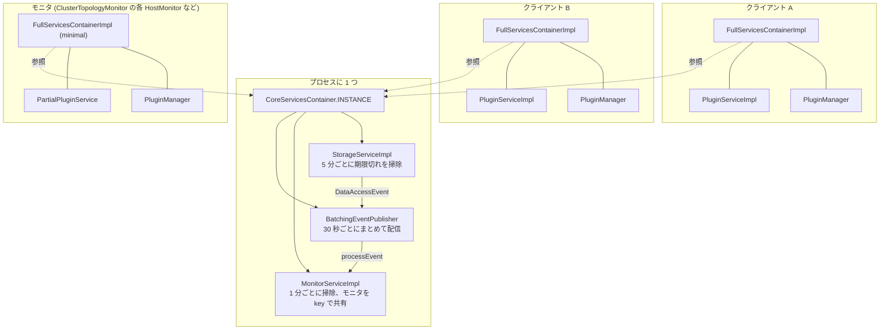
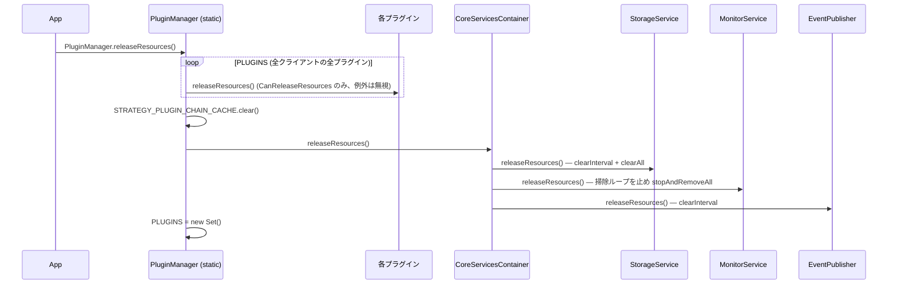

## この層の責務

`PluginManager` と `PluginService` はクライアントごとに作られる。しかし、同じ Aurora クラスタに 10 本の接続を張ったとき、トポロジクエリを 10 本のモニタが 30 秒ごとに投げるのは無駄で、しかも各接続が別々のトポロジを信じることになる。**クラスタにつき 1 つ**であるべきものは、クライアントの外に置く必要がある。

その置き場が `CoreServicesContainer` で、3 つのサービスを持つ。

| サービス         | 何を共有するか                                                                       | クラス                   |
| ---------------- | ------------------------------------------------------------------------------------ | ------------------------ |
| `StorageService` | トポロジ、ホストの可用性、Blue/Green 状態、Dialect 確定フラグなどのキャッシュ        | `StorageServiceImpl`     |
| `MonitorService` | トポロジモニタ、EFM モニタ、カスタムエンドポイントモニタなどのバックグラウンドタスク | `MonitorServiceImpl`     |
| `EventPublisher` | 上 2 つの間の通知 (「このキャッシュが読まれた」「このモニタが止まった」)             | `BatchingEventPublisher` |

## 主要な型とその関係



### `CoreServicesContainer`

[`common/lib/utils/core_services_container.ts#L29`](https://github.com/aws/aws-advanced-nodejs-wrapper/blob/6d0ba1bdae81a4e1fd274b3569c5dc50cf0a7095/common/lib/utils/core_services_container.ts#L29)。53 行しかない。

```ts title="common/lib/utils/core_services_container.ts"
export class CoreServicesContainer {
  private static readonly INSTANCE = new CoreServicesContainer();

  readonly monitorService: MonitorService;
  readonly storageService: StorageService;
  readonly eventPublisher: EventPublisher;

  private constructor() {
    this.eventPublisher = new BatchingEventPublisher();
    this.storageService = new StorageServiceImpl(this.eventPublisher);
    this.monitorService = new MonitorServiceImpl(this.eventPublisher);
  }

  static getInstance(): CoreServicesContainer {
    return CoreServicesContainer.INSTANCE;
  }

  static async releaseResources(): Promise<void> {
    await CoreServicesContainer.INSTANCE.storageService.releaseResources();
    await CoreServicesContainer.INSTANCE.monitorService.releaseResources();
    if (CoreServicesContainer.INSTANCE.eventPublisher instanceof BatchingEventPublisher) {
      CoreServicesContainer.INSTANCE.eventPublisher.releaseResources();
    }
  }
}
```

`INSTANCE` は**モジュールがロードされた瞬間**に作られる。`new AwsMySQLClient()` を 1 つも作らなくても、`aws-advanced-nodejs-wrapper` を `import` した時点で 3 つのサービスと、その中の `setInterval` が動き出す。

### `FullServicesContainer`: クライアントごとの束

[`common/lib/utils/full_services_container.ts#L31`](https://github.com/aws/aws-advanced-nodejs-wrapper/blob/6d0ba1bdae81a4e1fd274b3569c5dc50cf0a7095/common/lib/utils/full_services_container.ts#L31)。

```ts title="common/lib/utils/full_services_container.ts"
export interface FullServicesContainer {
  storageService: StorageService; // ← Core から
  monitorService: MonitorService; // ← Core から
  eventPublisher: EventPublisher; // ← Core から
  readonly defaultConnectionProvider: ConnectionProvider;
  telemetryFactory: TelemetryFactory;
  pluginManager: PluginManager; // クライアントごと
  hostListProviderService: HostListProviderService; // = pluginService
  pluginService: PluginService; // クライアントごと
  importantEventService: ImportantEventService;
  hostIdCacheService: HostIdCacheService;
}
```

先頭 3 つは `CoreServicesContainer` の参照をそのまま持つ。残りはクライアントごと。プラグインのファクトリは `getInstance(servicesContainer, props)` でこの束を受け取るので、**プラグインからはプロセス共有のサービスとクライアント固有のサービスが同じ場所に見える**。

### `ServiceUtils`: 2 種類の組み立て方

[`common/lib/utils/service_utils.ts#L36`](https://github.com/aws/aws-advanced-nodejs-wrapper/blob/6d0ba1bdae81a4e1fd274b3569c5dc50cf0a7095/common/lib/utils/service_utils.ts#L36)。

| メソッド                                                              | `pluginService` の実体                          | 誰が使うか                                                                      |
| --------------------------------------------------------------------- | ----------------------------------------------- | ------------------------------------------------------------------------------- |
| `createStandardServiceContainer`                                      | `PluginServiceImpl` (クライアントを知る)        | `AwsClient` のコンストラクタ                                                    |
| `createMinimalServiceContainer` / `createMinimalServiceContainerFrom` | `PartialPluginService` (クライアントを知らない) | `ClusterTopologyMonitor` の各ホスト監視、failover v1 の `WriterFailoverHandler` |

`createMinimalServiceContainerFrom(servicesContainer, props)` は、既存の束から `storageService` / `monitorService` / `eventPublisher` / `telemetryFactory` / `defaultConnectionProvider` と、`pluginService.getDialect()` / `getDriverDialect()` / `getConnectionUrlParser()` を**コピーして**新しい束を作る。つまりモニタが持つ束は、Core 側の 3 つはアプリと共有し、`PluginManager` と `PluginService` は自分専用である。

モニタが自分専用の `PluginManager` を持つのは、監視接続にもプラグインチェーン (特に認証プラグイン) を通す必要があるからだ。`cluster_topology_monitor.ts` の該当箇所 ([`#L464`](https://github.com/aws/aws-advanced-nodejs-wrapper/blob/6d0ba1bdae81a4e1fd274b3569c5dc50cf0a7095/common/lib/host_list_provider/monitoring/cluster_topology_monitor.ts#L464)) では、束を作った直後に `pluginManager.init()` を呼んでチェーンを組んでから `HostMonitor` を走らせている。

## 処理の流れ

### `StorageService`: クラスをキーにしたキャッシュの集合

[`common/lib/utils/storage/storage_service.ts#L124`](https://github.com/aws/aws-advanced-nodejs-wrapper/blob/6d0ba1bdae81a4e1fd274b3569c5dc50cf0a7095/common/lib/utils/storage/storage_service.ts#L124)。`set(key, item)` は `item.constructor` をクラスとして引き、そのクラス用の `ExpirationCache` に入れる。

```ts title="common/lib/utils/storage/storage_service.ts#L127"
suppliers.set(Topology, () => new ExpirationCache());
suppliers.set(AllowedAndBlockedHosts, () => new ExpirationCache());
suppliers.set(BlueGreenStatus, () => new ExpirationCache(false, SIXTY_MINUTES_NANOS, null, null));
suppliers.set(
  HostAvailabilityCacheItem,
  () =>
    new ExpirationCache(
      true,
      StorageServiceImpl.DEFAULT_HOST_AVAILABILITY_CACHE_EXPIRE_NANO,
      null,
      null,
    ),
);
suppliers.set(StatusCacheItem, () => new ExpirationCache(false, SIXTY_MINUTES_NANOS, null, null));
```

| クラス                      | TTL   | 更新で延長 | 書く側                                             |
| --------------------------- | ----- | ---------- | -------------------------------------------------- |
| `Topology`                  | なし  | –          | `ClusterTopologyMonitor` (キーは `clusterId`)      |
| `AllowedAndBlockedHosts`    | なし  | –          | customEndpoint                                     |
| `BlueGreenStatus`           | 60 分 | しない     | bg                                                 |
| `HostAvailabilityCacheItem` | 5 分  | する       | `PluginService.setAvailability` (キーはホスト URL) |
| `StatusCacheItem`           | 60 分 | しない     | `PluginService.setStatus`、Dialect 確定フラグ      |

`get(itemClass, key)` は取得のたびに `DataAccessEvent` を `EventPublisher` に流す。これが `MonitorService` に届くと「このデータを作っているモニタはまだ使われている」として、モニタの期限を延ばす ([`monitor_service.ts#L412`](https://github.com/aws/aws-advanced-nodejs-wrapper/blob/6d0ba1bdae81a4e1fd274b3569c5dc50cf0a7095/common/lib/utils/monitoring/monitor_service.ts#L412))。**誰も `Topology` を読まなくなったトポロジモニタは、自然に期限切れで止まる。**

`initCleanupTask` は 5 分ごとの `setInterval` を作り、`unref()` する ([`#L156`](https://github.com/aws/aws-advanced-nodejs-wrapper/blob/6d0ba1bdae81a4e1fd274b3569c5dc50cf0a7095/common/lib/utils/storage/storage_service.ts#L156))。`unref` されたタイマーは Node.js のイベントループを生かし続けないので、このタイマー単独ではプロセスは終わらないままにならない。

### `MonitorService`: 「なければ作る」でモニタを共有する

[`common/lib/utils/monitoring/monitor_service.ts#L250`](https://github.com/aws/aws-advanced-nodejs-wrapper/blob/6d0ba1bdae81a4e1fd274b3569c5dc50cf0a7095/common/lib/utils/monitoring/monitor_service.ts#L250) の `runIfAbsent(monitorClass, key, servicesContainer, props, initializer)` が中心である。`RdsHostListProvider.getOrCreateMonitor()` は `ClusterTopologyMonitorImpl` を `clusterId` をキーに `runIfAbsent` する。クライアント A と B が同じ `clusterId` なら、B は A が作ったモニタをそのまま得る。

これが **`clusterId` がキャッシュとモニタの共有単位**である理由で、3.0.0 で自動導出を捨てて既定 `"1"` にしたことの意味もここにある。別クラスタに繋ぐ 2 つのクライアントが両方 `"1"` なら、同じ `Topology` キャッシュと同じモニタを取り合う ([clusterId](../cluster-id/))。

モニタの種類ごとの寿命は `registerMonitorTypeIfAbsent` で登録され、`expirationTimeoutNanos` (誰も読まなくなってから消えるまで) と `inactiveTimeoutNanos` (ループが止まっているとみなすまで) を持つ。詳細は [MonitorService](../monitor-service/)。

### `BatchingEventPublisher`: 30 秒ごとの同報

[`common/lib/utils/events/batching_event_publisher.ts#L27`](https://github.com/aws/aws-advanced-nodejs-wrapper/blob/6d0ba1bdae81a4e1fd274b3569c5dc50cf0a7095/common/lib/utils/events/batching_event_publisher.ts#L27)。`publish(event)` は `isImmediateDelivery` なら即配信、そうでなければ `Set` に溜めて 30 秒ごとにまとめて配る。`DataAccessEvent` は溜められる側で、同じ `(クラス, key)` の読み取りが 30 秒に何百回あっても、`MonitorService` に届くのは 1 回である。`unref` されたタイマーで動く。

### 終了: `releaseResources` の連鎖



`AwsMySQLClient.end()` はこの連鎖を**起動しない**。接続を 1 本閉じただけでプロセス共有のモニタを止めるわけにはいかないからで、アプリが終了時に `PluginManager.releaseResources()` を明示的に呼ぶ設計になっている。`CoreServicesContainer.INSTANCE` 自体は作り直されないので、`releaseResources` 後にまた `new AwsMySQLClient()` すると、`StorageService` は空、`MonitorService` は掃除ループなし (`isInitialized = false`) の状態で動き始める。

## 守られている不変条件

- **同じ `clusterId` のトポロジモニタはプロセスに 1 つ。** `MonitorService.runIfAbsent` の `key` が保証する。10 クライアントでもトポロジクエリは 1 系統
- **モニタとアプリの接続は別の `PluginManager` を持つが、同じ `StorageService` を見る。** モニタが `Topology` を書き、アプリの `PluginService` がそれを読む。両者の接点はキャッシュだけで、直接の参照はない
- **Core の 3 タイマーは全部 `unref`。** `StorageService` の掃除、`BatchingEventPublisher` の配信、`MonitorService` の掃除。プロセスを生かし続けるのはこれらではなく、各モニタの `run()` ループ (監視接続を持つ) である ([バックグラウンドタスクと Node.js プロセス](../background-tasks-and-process/))
- **`FullServicesContainerImpl` の `pluginManager` / `pluginService` / `hostListProviderService` は `ServiceUtils` が組み立て終わるまで `undefined`。** `!` で非 null を主張しているフィールドで、コンストラクタ直後に触ると落ちる

## つまずきどころ

- **`import` した瞬間にタイマーが 3 つ動く。** テストで `aws-advanced-nodejs-wrapper` を読み込むと、`unref` 済みとはいえ `setInterval` が生きている。Jest の `--detectOpenHandles` が拾うことがある
- **`releaseResources` を呼ばないと監視接続が残る。** `unref` されているのは掃除タイマーだけで、EFM やトポロジモニタの監視接続はソケットを持つ。`process.exit()` しない限りプロセスが終わらない
- **複数クラスタに `clusterId` を付け忘れると、キャッシュもモニタも混ざる。** 症状は「別クラスタの writer にフェイルオーバーした」で、3.0.0 の CHANGELOG が Breaking Changes の筆頭に挙げている
- **`AwsClient` のコンストラクタが `storageService` を 2 回代入している** ([`aws_client.ts#L74`](https://github.com/aws/aws-advanced-nodejs-wrapper/blob/6d0ba1bdae81a4e1fd274b3569c5dc50cf0a7095/common/lib/aws_client.ts#L74) と [`#L110`](https://github.com/aws/aws-advanced-nodejs-wrapper/blob/6d0ba1bdae81a4e1fd274b3569c5dc50cf0a7095/common/lib/aws_client.ts#L110) 付近)。同じシングルトンなので実害はないが、`profileName` 処理の名残と読める
- **`PartialPluginService.clearCache()` は `CoreServicesContainer.getInstance().storageService` を直接触る** ([`partial_plugin_service.ts#L526`](https://github.com/aws/aws-advanced-nodejs-wrapper/blob/6d0ba1bdae81a4e1fd274b3569c5dc50cf0a7095/common/lib/partial_plugin_service.ts#L526))。束経由ではなくシングルトン直参照の static メソッドで、テストで `StorageService` を差し替えても効かない
