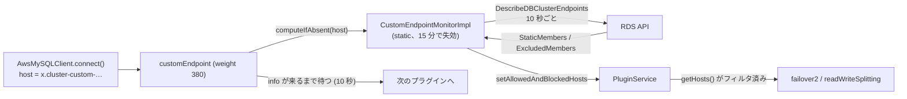

## 何を学んだか

Aurora の[カスタムエンドポイント](../aurora-mysql-cluster/)は、`<name>.cluster-custom-<xyz>.<region>.rds.amazonaws.com` という DNS 名で、クラスタ内の**指定したインスタンスだけ**にラウンドロビンで振り分ける。最初の接続は DNS で済むが、その後フェイルオーバーや readWriteSplitting でラッパが接続を張り替えるとき、**張り替え先がカスタムエンドポイントのメンバーかどうか**を DNS は教えてくれない。

`customEndpoint` プラグインがやるのは 3 つである。

- 接続先がカスタムエンドポイントの DNS なら、RDS API の `DescribeDBClusterEndpoints` でメンバー一覧を取る監視ループをプロセスに 1 つ立てる
- メンバー一覧を `AllowedAndBlockedHosts` にして PluginService に渡す。以降 `pluginService.getHosts()` はその集合でフィルタされる
- 一覧が届くまで (既定 10 秒まで) connect と各メソッドを待たせる

ホストの選択は他のプラグイン (failover2、readWriteSplitting) がやるので、このプラグインは**選択肢を狭めるだけ**で、自分では何も選ばない。

## ソースコードのどこか

[`common/lib/plugins/custom_endpoint/custom_endpoint_plugin.ts`](https://github.com/aws/aws-advanced-nodejs-wrapper/blob/6d0ba1bdae81a4e1fd274b3569c5dc50cf0a7095/common/lib/plugins/custom_endpoint/custom_endpoint_plugin.ts) (195 行) と [`custom_endpoint_monitor_impl.ts`](https://github.com/aws/aws-advanced-nodejs-wrapper/blob/6d0ba1bdae81a4e1fd274b3569c5dc50cf0a7095/common/lib/plugins/custom_endpoint/custom_endpoint_monitor_impl.ts) (184 行)。weight は 380 で、[並び順](../plugin-order/)の先頭に来る。

### connect — DNS 名で判定して監視を立てる

[`#L94`](https://github.com/aws/aws-advanced-nodejs-wrapper/blob/6d0ba1bdae81a4e1fd274b3569c5dc50cf0a7095/common/lib/plugins/custom_endpoint/custom_endpoint_plugin.ts#L94)。

```ts title="common/lib/plugins/custom_endpoint/custom_endpoint_plugin.ts"
async connect(hostInfo: HostInfo, props: Map<string, any>, isInitialConnection: boolean, connectFunc: () => Promise<ClientWrapper>): Promise<ClientWrapper> {
  if (!CustomEndpointPlugin.rdsUtils.isRdsCustomClusterDns(hostInfo.host)) {
    return await connectFunc();
  }

  this.customEndpointHostInfo = hostInfo;
  this.customEndpointId = CustomEndpointPlugin.rdsUtils.getRdsClusterId(hostInfo.host);
  if (!this.customEndpointId) {
    throw new AwsWrapperError(Messages.get("CustomEndpointPlugin.errorParsingEndpointIdentifier", this.customEndpointHostInfo.host));
  }

  this.region = await CustomEndpointPlugin.regionUtils.getRegion(WrapperProperties.CUSTOM_ENDPOINT_REGION.name, this.customEndpointHostInfo, props);
  if (!this.region) {
    throw new AwsWrapperError(Messages.get("CustomEndpointPlugin.unableToDetermineRegion", WrapperProperties.CUSTOM_ENDPOINT_REGION.name));
  }

  const monitor: CustomEndpointMonitor = this.createMonitorIfAbsent(props);
  if (this.shouldWaitForInfo) {
    await this.waitForCustomEndpointInfo(monitor);
  }
  return await connectFunc();
}
```

`isRdsCustomClusterDns` は DNS の `cluster-custom-` 部分を見る ([RdsUtils](../rds-utils/))。カスタムエンドポイント以外の接続先では何もしない。エンドポイント ID (`<name>` 部分) は `getRdsClusterId` で、リージョンは DNS の region 部分か `customEndpointRegion` から取る。

### 監視はプロセスに 1 つ、寿命は 15 分

[`#L44`](https://github.com/aws/aws-advanced-nodejs-wrapper/blob/6d0ba1bdae81a4e1fd274b3569c5dc50cf0a7095/common/lib/plugins/custom_endpoint/custom_endpoint_plugin.ts#L44)。

```ts title="common/lib/plugins/custom_endpoint/custom_endpoint_plugin.ts"
protected static readonly monitors: SlidingExpirationCache<string, CustomEndpointMonitor> = new SlidingExpirationCache(
  CustomEndpointPlugin.CACHE_CLEANUP_NANOS,                       // 60 秒ごとに掃除
  (monitor: CustomEndpointMonitor) => monitor.shouldDispose(),    // 常に true
  (monitor: CustomEndpointMonitor) => { monitor.close(); }
);

createMonitorIfAbsent(props: Map<string, any>): CustomEndpointMonitor {
  return CustomEndpointPlugin.monitors.computeIfAbsent(
    this.customEndpointHostInfo.host,
    (customEndpoint: string) => new CustomEndpointMonitorImpl(this.pluginService, this.customEndpointHostInfo, this.customEndpointId, this.region, WrapperProperties.CUSTOM_ENDPOINT_INFO_REFRESH_RATE.get(this.props), this.rdsClientFunc),
    BigInt(this.idleMonitorExpirationMs * 1000000)                // 既定 15 分
  );
}
```

`static` の [SlidingExpirationCache](../connection-lifetime/) にホスト名で入れる。`computeIfAbsent` を connect と各メソッドで呼ぶたびに有効期限が延び、15 分使われなければ掃除ループが `close()` する。

### 監視ループ — RDS API を 10 秒ごとに叩く

[`custom_endpoint_monitor_impl.ts#L77`](https://github.com/aws/aws-advanced-nodejs-wrapper/blob/6d0ba1bdae81a4e1fd274b3569c5dc50cf0a7095/common/lib/plugins/custom_endpoint/custom_endpoint_monitor_impl.ts#L77)。

```ts title="common/lib/plugins/custom_endpoint/custom_endpoint_monitor_impl.ts"
while (!this.stop) {
  try {
    const input = {
      DBClusterEndpointIdentifier: this.endpointIdentifier,
      Filters: [{ Name: "db-cluster-endpoint-type", Values: ["custom"] }],
    };
    const result = await this.rdsClient.send(new DescribeDBClusterEndpointsCommand(input));
    const endpoints = result.DBClusterEndpoints;

    if (endpoints.length === 0) {
      throw new AwsWrapperError(Messages.get("CustomEndpointMonitorImpl.noEndpoints"));
    }
    if (endpoints.length !== 1) {
      logger.warn(/* unexpectedNumberOfEndpoints */);
      await sleep(refreshRateMs);
      continue;
    }

    const endpointInfo = CustomEndpointInfo.fromDbClusterEndpoint(endpoints[0]);
    const cachedEndpointInfo = CustomEndpointMonitorImpl.customEndpointInfoCache.get(
      this.customEndpointHostInfo.host,
    );
    if (cachedEndpointInfo && cachedEndpointInfo.equals(endpointInfo)) {
      await sleep(refreshRateMs - elapsed);
      continue;
    }

    let allowedAndBlockedHosts: AllowedAndBlockedHosts;
    if (endpointInfo.getMemberListType() === MemberListType.STATIC_LIST) {
      allowedAndBlockedHosts = new AllowedAndBlockedHosts(endpointInfo.getStaticMembers(), null);
    } else {
      allowedAndBlockedHosts = new AllowedAndBlockedHosts(null, endpointInfo.getExcludedMembers());
    }
    this.pluginService.setAllowedAndBlockedHosts(allowedAndBlockedHosts);
    CustomEndpointMonitorImpl.customEndpointInfoCache.put(
      this.customEndpointHostInfo.host,
      endpointInfo,
      CUSTOM_ENDPOINT_INFO_EXPIRATION_NANO,
    );
    this.infoChangedCounter.inc();
    await sleep(refreshRateMs - elapsed);
  } catch (e: any) {
    logger.error(
      Messages.get("CustomEndpointMonitorImpl.error", this.customEndpointHostInfo.host, e.message),
    );
    throw e;
  }
}
```

RDS のカスタムエンドポイントには 2 種類のメンバー指定がある。`StaticMembers` は「この一覧だけ」、`ExcludedMembers` は「これ以外全部 (新インスタンスは自動で含む)」で、API のレスポンスはどちらか一方を持つ ([`custom_endpoint_info.ts#L54`](https://github.com/aws/aws-advanced-nodejs-wrapper/blob/6d0ba1bdae81a4e1fd274b3569c5dc50cf0a7095/common/lib/plugins/custom_endpoint/custom_endpoint_info.ts#L54))。ラッパはそれを `allowedHostIds` / `blockedHostIds` にそのまま写す。

### PluginService 側 — getHosts が絞られる

[`plugin_service.ts#L453`](https://github.com/aws/aws-advanced-nodejs-wrapper/blob/6d0ba1bdae81a4e1fd274b3569c5dc50cf0a7095/common/lib/plugin_service.ts#L453)。

```ts title="common/lib/plugin_service.ts"
getAllHosts(): HostInfo[] {
  return this.hosts;
}

getHosts(): HostInfo[] {
  const hostPermissions = this.allowedAndBlockedHosts;
  if (!hostPermissions) {
    return this.hosts;
  }
  let hosts = this.hosts;
  const allowedHostIds = hostPermissions.getAllowedHostIds();
  const blockedHostIds = hostPermissions.getBlockedHostIds();
  if (allowedHostIds && allowedHostIds.size > 0) {
    hosts = hosts.filter((host: HostInfo) => allowedHostIds.has(host.hostId));
  }
  if (blockedHostIds && blockedHostIds.size > 0) {
    hosts = hosts.filter((host: HostInfo) => !blockedHostIds.has(host.hostId));
  }
  return hosts;
}
```

照合キーは `hostId` (インスタンス ID) で、RDS API が返す `StaticMembers` もインスタンス ID なので直接比較できる。`getAllHosts()` は無条件、`getHosts()` はフィルタ済み、という 2 本立てになっていて、[failover2](../failover2-writer/) は候補の絞り込みに `getHosts()` を、「トポロジが取れているか」の確認には `getAllHosts()` を使い分けている ([`failover2_plugin.ts#L380`](https://github.com/aws/aws-advanced-nodejs-wrapper/blob/6d0ba1bdae81a4e1fd274b3569c5dc50cf0a7095/common/lib/plugins/failover2/failover2_plugin.ts#L380))。



### 情報が来るまで待つ

[`#L143`](https://github.com/aws/aws-advanced-nodejs-wrapper/blob/6d0ba1bdae81a4e1fd274b3569c5dc50cf0a7095/common/lib/plugins/custom_endpoint/custom_endpoint_plugin.ts#L143)。`waitForCustomEndpointInfo` は静的キャッシュに情報が入るまで 100ms ごとに見て、`waitForCustomEndpointInfoTimeoutMs` (10 秒) で例外を投げる。`execute` も同じ待ちを通る ([`#L172`](https://github.com/aws/aws-advanced-nodejs-wrapper/blob/6d0ba1bdae81a4e1fd274b3569c5dc50cf0a7095/common/lib/plugins/custom_endpoint/custom_endpoint_plugin.ts#L172))。購読は `NETWORK_BOUND_METHODS` (connect / forceConnect / query / execute / rollback / beginTransaction / commit など) で、ネットワークに出る呼び出しの前には必ず一覧が揃っている状態を作る。

### 設定値

| パラメータ                           | 既定     | 意味                             |
| ------------------------------------ | -------- | -------------------------------- |
| `customEndpointRegion`               | DNS から | RDS API を叩くリージョン         |
| `customEndpointInfoRefreshRateMs`    | 10,000   | API を叩く間隔                   |
| `customEndpointMonitorExpirationMs`  | 900,000  | 使われない監視を捨てるまでの時間 |
| `waitForCustomEndpointInfo`          | `true`   | 一覧が来るまで待つか             |
| `waitForCustomEndpointInfoTimeoutMs` | 10,000   | 待ちの上限                       |

`@aws-sdk/client-rds` の導入と、`rds:DescribeDBClusterEndpoints` の IAM 権限が要る。

## なぜそうなっているか

### なぜ DNS だけでは足りないのか

カスタムエンドポイントの DNS は「今このエンドポイントのメンバーのうち 1 つ」を返すだけである。ラッパが接続を張り替える場面は全部**トポロジ (`replica_host_status`) から選んだインスタンスエンドポイントに直接繋ぐ**ので、その時点でカスタムエンドポイントの DNS は経由しない ([トポロジクエリ (Aurora MySQL)](../topology-query-aurora/))。トポロジはクラスタの全インスタンスを返すから、メンバー一覧を別途持たないと、フェイルオーバーで「reader 専用のカスタムエンドポイント」から外れた reader に繋いでしまう。

### なぜ RDS API なのか

メンバー一覧は DB の中にない。`replica_host_status` はインスタンスの一覧であって、どのカスタムエンドポイントに属するかは RDS のコントロールプレーンだけが知っている。[Blue/Green のメタデータ](../blue-green-mysql-metadata/)のように DB 側に表を出してもらう手はなかったので、AWS SDK を optional な依存として持ち込んでいる。

### なぜ「絞るだけ」なのか

フェイルオーバーや読み書き分離の選択ロジックは、それぞれのプラグインに既にある。`customEndpoint` が独自に選択を始めると 2 つのロジックが競合する。`PluginService.getHosts()` を 1 か所で絞れば、選択側のコードを変えずに「メンバー内から選ぶ」が実現できる。[PluginService](../plugin-service/) が唯一の共有状態置き場であることの利点が出ている箇所である。

### なぜ待つのか

docs の説明は「最近開いたか使った接続がないときだけ待ちが必要で、無効にすると稀にメンバー外へ繋ぐ」である。監視は非同期に立つので、初回の connect 時点では一覧がまだない。待たずに進めると、初回のフェイルオーバーが一覧なしで動く可能性がある。10 秒という上限は、RDS API の 1 往復にしては十分長い。

## どう活かすか

- **「選択肢を絞る」と「選ぶ」を分ける。** 制約を共有状態に置いて、選択ロジックは触らない。制約が増えても選択側のコードは変わらない
- **外部 API のポーリングはプロセスで 1 本にして、寿命を使用実績で決める。** 静的キャッシュ + sliding expiration は、クライアントが何個あっても API 呼び出し量が変わらない構造になっている
- **`failoverMode` はエンドポイントの種類に合わせる。** docs の手順どおり、READER 型なら `strict-reader`、ANY 型なら `reader-or-writer` にする。メンバーが reader だけのエンドポイントで `strict-writer` にすると、フィルタ後の候補に writer がなく失敗する

### つまずきどころ

- **`equals` が常に false。** [`custom_endpoint_info.ts#L84`](https://github.com/aws/aws-advanced-nodejs-wrapper/blob/6d0ba1bdae81a4e1fd274b3569c5dc50cf0a7095/common/lib/plugins/custom_endpoint/custom_endpoint_info.ts#L84) は `this.members === info.members` で `Set` を参照比較しているので、API から作り直した情報とは常に不一致になる。10 秒ごとに「変化を検知」のログと `setAllowedAndBlockedHosts`、`customEndpoint.infoChanged.counter` の加算が走る。動作に害はないがログとメトリクスの意味がなくなる
- **監視ループの例外は未処理 rejection になる。** `run()` は `catch` でログを出したあと `throw e` し、コンストラクタは `this.run()` を await していない。資格情報がない、API がスロットルされた、といった最初の失敗で監視は止まり、Node.js の既定 (`--unhandled-rejections=throw`) ではプロセスが落ちる。落ちなくても一覧は二度と更新されず、次の connect は 10 秒待って `timedOutWaitingForCustomEndpointInfo` で失敗する
- **一覧が渡るのは監視を作ったクライアントだけ。** 監視はプロセスで 1 つで、コンストラクタで受け取った `pluginService` (最初に接続したクライアントのもの) にだけ `setAllowedAndBlockedHosts` する。PluginService はクライアントごとに別なので、同じカスタムエンドポイントに繋ぐ 2 つ目以降のクライアントは、静的キャッシュに情報があるので待ちは通過するが、自分の `getHosts()` は絞られない。コードを読む限り、複数クライアント構成ではフェイルオーバーがメンバー外に出うる
- **互換性表ではカスタムエンドポイント以外の URL で ✗。** 実装上は素通しになるだけだが、docs は非対応と明記している ([互換性表を読む](../compatibility-matrix/))
