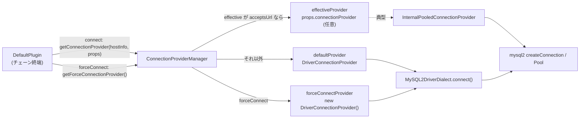

## この層の責務

プラグインは接続を張らない。張るのはチェーン終端の `DefaultPlugin` だけで、それも自分では張らず `ConnectionProvider` に委ねる。この 2 段の委譲があるから、

- `plugins: ""` でもラッパは mysql2 と同じように動く (`DefaultPlugin` が残る)
- 内部コネクションプールを `connectionProvider` に差し込める (provider の差し替え)
- 監視用接続だけプールを迂回できる (`forceConnect` は常に `DriverConnectionProvider`)

の 3 つが同時に成立している。

## 主要な型とその関係



| 型                                 | 場所                                                                                                                                                                                                              | 役割                                                                                                   |
| ---------------------------------- | ----------------------------------------------------------------------------------------------------------------------------------------------------------------------------------------------------------------- | ------------------------------------------------------------------------------------------------------ |
| `DefaultPlugin`                    | [`common/lib/plugins/default_plugin.ts#L35`](https://github.com/aws/aws-advanced-nodejs-wrapper/blob/6d0ba1bdae81a4e1fd274b3569c5dc50cf0a7095/common/lib/plugins/default_plugin.ts#L35)                           | 終端。`"*"` を購読                                                                                     |
| `ConnectionProvider`               | [`common/lib/connection_provider.ts`](https://github.com/aws/aws-advanced-nodejs-wrapper/blob/6d0ba1bdae81a4e1fd274b3569c5dc50cf0a7095/common/lib/connection_provider.ts)                                         | `connect` / `acceptsUrl` / `acceptsStrategy` / `getHostInfoByStrategy` の 4 メソッド                   |
| `ConnectionProviderManager`        | [`common/lib/connection_provider_manager.ts#L23`](https://github.com/aws/aws-advanced-nodejs-wrapper/blob/6d0ba1bdae81a4e1fd274b3569c5dc50cf0a7095/common/lib/connection_provider_manager.ts#L23)                 | 3 つの provider の使い分け                                                                             |
| `DriverConnectionProvider`         | [`common/lib/driver_connection_provider.ts#L35`](https://github.com/aws/aws-advanced-nodejs-wrapper/blob/6d0ba1bdae81a4e1fd274b3569c5dc50cf0a7095/common/lib/driver_connection_provider.ts#L35)                   | mysql2 の接続を 1 本張る                                                                               |
| `InternalPooledConnectionProvider` | [`common/lib/internal_pooled_connection_provider.ts#L44`](https://github.com/aws/aws-advanced-nodejs-wrapper/blob/6d0ba1bdae81a4e1fd274b3569c5dc50cf0a7095/common/lib/internal_pooled_connection_provider.ts#L44) | インスタンスごとの mysql2 Pool から取る。詳細は [内部コネクションプール](../internal-connection-pool/) |

`ConnectionProviderManager` は `ServiceUtils.createStandardServiceContainer` で 1 回だけ作られる。

```ts title="common/lib/utils/service_utils.ts#L43"
new ConnectionProviderManager(
  connectionProvider ?? new DriverConnectionProvider(),
  WrapperProperties.CONNECTION_PROVIDER.get(props),
);
```

第 1 引数が `defaultProvider`。`AwsMySQLClient` なら `DriverConnectionProvider`、`AwsMySQLPooledConnection` なら外部プールが渡した `InternalPooledConnectionProvider`。第 2 引数が `effectiveProvider` で、ユーザが `connectionProvider` プロパティで渡したもの。両方とも `InternalPooledConnectionProvider` になり得る点がややこしいが、経路が 2 つあるだけで意味は同じである。

## 処理の流れ

### `DefaultPlugin.connect` → `connectInternal`

[`#L70`](https://github.com/aws/aws-advanced-nodejs-wrapper/blob/6d0ba1bdae81a4e1fd274b3569c5dc50cf0a7095/common/lib/plugins/default_plugin.ts#L70)。

```ts title="common/lib/plugins/default_plugin.ts"
override async connect<Type>(hostInfo, props, isInitialConnection, connectFunc): Promise<ClientWrapper> {
  return await this.connectInternal(hostInfo, props, this.connectionProviderManager.getConnectionProvider(hostInfo, props));
}

override async forceConnect<Type>(hostInfo, props, isInitialConnection, forceConnectFunc): Promise<ClientWrapper> {
  return await this.connectInternal(hostInfo, props, this.connectionProviderManager.getForceConnectionProvider());
}

private async connectInternal(hostInfo: HostInfo, props: Map<string, any>, connProvider: ConnectionProvider): Promise<ClientWrapper> {
  const telemetryFactory = this.pluginService.getTelemetryFactory();
  const telemetryContext = telemetryFactory.openTelemetryContext(
    `${this.pluginService.getDriverDialect().getDialectName()} - connect`,
    TelemetryTraceLevel.NESTED
  );

  const result: ConnectionInfo = await telemetryContext.start(async () => await connProvider.connect(hostInfo, this.pluginService, props));
  this.pluginService.setAvailability(hostInfo, HostAvailability.AVAILABLE);
  this.pluginService.setIsPooledClient(result.isPooled);
  await this.pluginService.updateDialect(result.client);
  return result.client;
}
```

`connectFunc` / `forceConnectFunc` は受け取るだけで呼ばない。接続後の 3 行が「接続できた」という事実を `PluginService` に反映する。

1. **`setAvailability(AVAILABLE)`** で、そのホストを `NOT_AVAILABLE` にしていた記録を消す
2. **`setIsPooledClient(result.isPooled)`** で、この接続がプール由来かを覚える (`end` 時にプールへ返すか閉じるかの分岐に使う)
3. **`updateDialect(result.client)`** で、実際の接続に SQL を投げて Dialect を確定させる ([Dialect の自動判定](../dialect-resolution/))

3 は**接続のたびに**走る。ただし Dialect が確定済み (`canUpdate = false`) なら `DatabaseDialectManager.getDialectForUpdate` は即座に現在の Dialect を返すので、クエリは初回だけである。

### `ConnectionProviderManager.getConnectionProvider`

[`#L34`](https://github.com/aws/aws-advanced-nodejs-wrapper/blob/6d0ba1bdae81a4e1fd274b3569c5dc50cf0a7095/common/lib/connection_provider_manager.ts#L34)。

```ts title="common/lib/connection_provider_manager.ts"
getConnectionProvider(hostInfo: HostInfo | null, props: Map<string, any>): ConnectionProvider {
  if (hostInfo === null) {
    return this.defaultProvider;
  }
  if (this.effectiveProvider && this.effectiveProvider.acceptsUrl(hostInfo, props)) {
    return this.effectiveProvider;
  }
  return this.defaultProvider;
}
```

`acceptsUrl` で**ホストごとに** provider を選ぶ。`InternalPooledConnectionProvider.acceptsUrl` は `RdsUrlType.RDS_INSTANCE` のときだけ `true` ([`internal_pooled_connection_provider.ts#L78`](https://github.com/aws/aws-advanced-nodejs-wrapper/blob/6d0ba1bdae81a4e1fd274b3569c5dc50cf0a7095/common/lib/internal_pooled_connection_provider.ts#L78))。つまり内部プールを設定していても、**クラスタエンドポイントへの接続はプールを使わず**、トポロジで得たインスタンスエンドポイントへの接続だけがプールから取られる。プールのキーがインスタンス単位である以上、DNS が動くクラスタエンドポイントをキーにしても意味がないからである。

`getForceConnectionProvider()` は常に `new DriverConnectionProvider()` (コンストラクタで 1 個作って使い回す)。`acceptsUrl` を問わない。

### `DriverConnectionProvider.connect`

[`#L50`](https://github.com/aws/aws-advanced-nodejs-wrapper/blob/6d0ba1bdae81a4e1fd274b3569c5dc50cf0a7095/common/lib/driver_connection_provider.ts#L50)。ここが mysql2 に触る唯一の場所への入口である。

```ts title="common/lib/driver_connection_provider.ts"
async connect(hostInfo: HostInfo, pluginService: PluginService, props: Map<string, any>): Promise<ConnectionInfo> {
  let resultTargetClient;
  const resultProps = new Map(props);
  resultProps.set(WrapperProperties.HOST.name, hostInfo.host);
  if (hostInfo.isPortSpecified()) {
    resultProps.set(WrapperProperties.PORT.name, hostInfo.port);
  }
  const driverDialect: DriverDialect = pluginService.getDriverDialect();
  try {
    resultTargetClient = await driverDialect.connect(hostInfo, resultProps);
  } catch (e: any) {
    if (!WrapperProperties.ENABLE_GREEN_HOST_REPLACEMENT.get(props)) {
      throw e;
    }
    if (!e.message.includes("Error: getaddrinfo ENOTFOUND")) {
      throw e;
    }
    if (!this.rdsUtils.isRdsDns(hostInfo.host) || !this.rdsUtils.isGreenInstance(hostInfo.host)) {
      throw e;
    }
    // ... DNS を引き直して、green 接頭辞を外したホスト名で再接続 ...
    resultTargetClient = driverDialect.connect(hostInfo, resultProps);
  }
  pluginService.attachErrorListener(resultTargetClient);
  return new ConnectionInfo(resultTargetClient, false);
}
```

- **`props` をコピーして `host` / `port` を `HostInfo` のもので上書きする。** アプリが `host` にクラスタエンドポイントを書いていても、フェイルオーバーで張り直すときはインスタンスエンドポイントになる。元の `properties` は変えない
- **接続直後に追跡リスナを付ける。** 遊休中に mysql2 が emit する `error` を、次の `execute` で拾えるようにする
- **`ConnectionInfo(client, isPooled = false)`** を返す。`InternalPooledConnectionProvider` は `true` で返す

green ホスト置換の分岐は、Blue/Green 切り替え後に `-green-xxxx` 接頭辞付きのホスト名が DNS から消える問題への対処で、`enableGreenHostReplacement` (既定 `false`) を立てたときだけ動く ([Blue/Green 切り替えで何が起きるか](../blue-green-switchover/))。

### `DefaultPlugin.execute`

[`#L93`](https://github.com/aws/aws-advanced-nodejs-wrapper/blob/6d0ba1bdae81a4e1fd274b3569c5dc50cf0a7095/common/lib/plugins/default_plugin.ts#L93)。

```ts title="common/lib/plugins/default_plugin.ts"
override async execute<Type>(methodName: string, methodFunc: () => Promise<Type>): Promise<Type> {
  logger.debug(Messages.get("DefaultPlugin.executingMethod", methodName));
  const telemetryFactory = this.pluginService.getTelemetryFactory();
  const telemetryContext = telemetryFactory.openTelemetryContext(
    `${this.pluginService.getDriverDialect().getDialectName()} - ${methodName}`,
    TelemetryTraceLevel.NESTED
  );
  return await telemetryContext.start(async () => await methodFunc());
}
```

デバッグログとテレメトリのスパンを付けて `methodFunc` を呼ぶだけ。スパン名が `MySQL2DriverDialect - query` のような形になるのはここで決まる。

### 戦略の問い合わせ

`acceptsStrategy` / `getHostInfoByStrategy` ([`#L112`](https://github.com/aws/aws-advanced-nodejs-wrapper/blob/6d0ba1bdae81a4e1fd274b3569c5dc50cf0a7095/common/lib/plugins/default_plugin.ts#L112)) は `HostRole.UNKNOWN` を拒み、`hosts` が渡されなければ `pluginService.getHosts()` (許可フィルタ後) を使って `ConnectionProviderManager` に委ねる。`ConnectionProviderManager.getHostInfoByStrategy` は effective → default の順に試す。`DriverConnectionProvider` は `random` / `roundRobin`、`InternalPooledConnectionProvider` はそれに `leastConnections` を足す。

## 守られている不変条件

- **mysql2 の `createConnection` を呼ぶのは `MySQL2DriverDialect.connect` だけ。** `DriverConnectionProvider` も `InternalPooledConnectionProvider` も (プール生成は `preparePoolClientProperties` + `getAwsPoolClient` 経由で) `DriverDialect` を通る。ラッパの中に `mysql2` を直接 import する場所は `mysql/lib/` の下に閉じている
- **接続に成功したホストは必ず `AVAILABLE` になる。** `connectInternal` の 2 行目。`NOT_AVAILABLE` にする側 (failover / efm) が何をしていようと、接続できた事実が勝つ
- **`forceConnect` は effective provider を見ない。** `getForceConnectionProvider()` に `hostInfo` も `props` も渡らない
- **`DefaultPlugin` は `notifyConnectionChanged` に `NO_OPINION`、`initHostProvider` に何もしない。** 終端が「意見を持たない」ことで、他のプラグインの判断が常に優先される

## つまずきどころ

- **green 置換の再接続に `await` がない。** `resultTargetClient = driverDialect.connect(hostInfo, resultProps);` は Promise のまま `attachErrorListener` と `ConnectionInfo` に渡る。この分岐を通ると、返る `ClientWrapper` が実際には `Promise<ClientWrapper>` になる。`enableGreenHostReplacement` を使うときは、この経路が本当に踏まれるかを疑ってかかったほうがよい
- **`connectionProvider` に自前の provider を渡すと、`acceptsUrl` が `true` を返すホストだけがそれを使う。** 全接続を横取りしたければ `acceptsUrl` で無条件に `true` を返す
- **接続のたびに `updateDialect` が走る**ので、`dialect` を明示せずカスタムドメインで接続していると、`RdsUtils` が `OTHER` と判定して `mysql` Dialect から始まり、初回接続時に `SHOW VARIABLES` を 1〜3 回投げる。`dialect: "aurora-mysql"` を書けば省ける
- **`ConnectionProviderManager.releaseResources` はラッパ内の誰からも呼ばれていない。** `AwsMySQLPoolClient.end()` は `InternalPooledConnectionProvider.releaseResources()` を直接呼び、`PluginManager.releaseResources()` は provider を見ない。`connectionProvider` に自前の provider を渡して後始末が要るなら、アプリ側で明示的に呼ぶ
