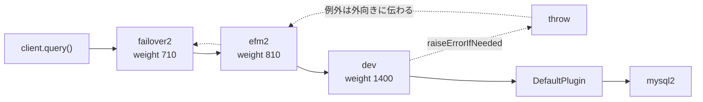

## 何を学んだか

`plugins: "failover2,efm2,dev"` と書くと、次の `query()` で任意の `Error` を投げさせられる。ネットワーク断を待たずに、`FailoverSuccessError` を受けたときのアプリの分岐をテストできる。

仕掛けは単純で、3 点に集約される。

- **plugin chain の最内側で投げる。** weight 1400 は全プラグイン中で最大なので、`DefaultPlugin` の直前に座る。投げた例外は efm2 → failover2 → … と外向きに伝わり、各プラグインの `catch` を本物のエラーと同じ経路で通る
- **次の 1 回だけ。** 投げた瞬間に予約を消す。同じ接続で 2 回目の `query()` は普通に通る。条件付きで繰り返したいときは callback を登録する
- **connect 用だけ static。** `ErrorSimulatorManager.raiseErrorOnNextConnect` はクラスの static フィールドに書く。`connect()` の前にはプラグインの実体が存在しないからで、その代償としてプロセス内のどの `connect` が先に来ても消費される

## ソースコードのどこか

### 登録と位置

[`connection_plugin_chain_builder.ts#L81`](https://github.com/aws/aws-advanced-nodejs-wrapper/blob/6d0ba1bdae81a4e1fd274b3569c5dc50cf0a7095/common/lib/connection_plugin_chain_builder.ts#L81) で `"dev"` に weight 1400 が割り当てられている。`iam` が 1000、`okta` が 1300 で、`dev` はそのさらに後ろである。

[`makeExecutePipeline#L225`](https://github.com/aws/aws-advanced-nodejs-wrapper/blob/6d0ba1bdae81a4e1fd274b3569c5dc50cf0a7095/common/lib/plugin_manager.ts#L225) は `_plugins` を**末尾から**走査して `addToHead` するので、weight が小さいプラグインが外側、大きいプラグインが内側になる ([PluginChain](../plugin-chain/))。`_plugins` の最後は常に `DefaultPlugin` なので、`dev` はその 1 つ外側、つまりユーザプラグインの中では最も内側に座る。



### 購読メソッドは `"*"`

[`developer_connection_plugin.ts#L28`](https://github.com/aws/aws-advanced-nodejs-wrapper/blob/6d0ba1bdae81a4e1fd274b3569c5dc50cf0a7095/common/lib/plugins/dev/developer_connection_plugin.ts#L28)。

```ts title="common/lib/plugins/dev/developer_connection_plugin.ts"
export class DeveloperConnectionPlugin extends AbstractConnectionPlugin implements ErrorSimulator {
  static ALL_METHODS = "*";
  static readonly subscribedMethods = new Set<string>(DeveloperConnectionPlugin.ALL_METHODS);
```

`new Set("*")` は文字列をイテレートして 1 文字ずつ要素にするので、結果は `Set {"*"}` になる。`ALL_METHODS` が 1 文字だから成立している書き方で、`PluginManager` 側は `getSubscribedMethods().has("*")` で全メソッドの chain に組み込む。

### execute — 実行前に投げる

[`#L67`](https://github.com/aws/aws-advanced-nodejs-wrapper/blob/6d0ba1bdae81a4e1fd274b3569c5dc50cf0a7095/common/lib/plugins/dev/developer_connection_plugin.ts#L67)。

```ts title="common/lib/plugins/dev/developer_connection_plugin.ts"
override async execute<T>(methodName: string, methodFunc: () => Promise<T>, methodArgs: any[]): Promise<T> {
  this.raiseErrorIfNeeded(methodName, methodArgs);
  return methodFunc();
}

raiseErrorIfNeeded<T>(methodName: string, methodArgs: any[]) {
  if (this.nextError !== null) {
    if (DeveloperConnectionPlugin.ALL_METHODS === this.nextMethodName || methodName === this.nextMethodName) {
      this.raiseError(this.nextError, methodName);
    }
  } else if (this.errorSimulatorMethodCallback !== null) {
    this.raiseError(this.errorSimulatorMethodCallback?.getErrorToRaise(methodName, methodArgs), methodName);
  }
}

raiseError(throwable: Error | null, methodName: string) {
  if (throwable === null) {
    return;
  }
  this.nextError = null;
  this.nextMethodName = null;
  logger.debug(`Raised an error: ${throwable.name} while executing ${methodName}.`);
  throw throwable;
}
```

`methodFunc()` を呼ぶ**前**に投げるので、mysql2 にはクエリが届かない。予約 (`nextError`) は callback より優先され、投げた瞬間に `null` に戻る。callback は消えないので、`getErrorToRaise` が `null` 以外を返す限り何度でも投げる。

`methodArgs` に何が入るかは呼び出し元次第で、`AwsMySQLClient.query()` は [`[options, values]`](https://github.com/aws/aws-advanced-nodejs-wrapper/blob/6d0ba1bdae81a4e1fd274b3569c5dc50cf0a7095/mysql/lib/client.ts#L523) の配列を渡す ([AwsMySQLClient](../aws-mysql-client/))。docs と `examples/aws_driver_example/aws_dev_mysql_example.ts` の callback は `methodArgs == "select 1"` と比較しているが、MySQL では `methodArgs[0]` が `{ sql: "select 1" }` か文字列なので、この比較は一致しない。`methodArgs[0]?.sql ?? methodArgs[0]` を見る必要がある。

### connect — static で予約する

[`#L95`](https://github.com/aws/aws-advanced-nodejs-wrapper/blob/6d0ba1bdae81a4e1fd274b3569c5dc50cf0a7095/common/lib/plugins/dev/developer_connection_plugin.ts#L95)。

```ts title="common/lib/plugins/dev/developer_connection_plugin.ts"
connect<T>(hostInfo: HostInfo, props: Map<string, any>, isInitialConnection: boolean, connectFunc: () => Promise<T>): Promise<T> {
  this.raiseErrorOnConnectIfNeeded(hostInfo, props, isInitialConnection);
  return connectFunc();
}

forceConnect<T>(hostInfo: HostInfo, props: Map<string, any>, isInitialConnection: boolean, forceConnectFunc: () => Promise<T>): Promise<T> {
  this.raiseErrorOnConnectIfNeeded(hostInfo, props, isInitialConnection);
  return forceConnectFunc();
}

raiseErrorOnConnectIfNeeded(hostInfo: HostInfo, props: Map<string, any>, isInitialConnection: boolean) {
  if (ErrorSimulatorManager.nextError !== null) {
    this.raiseErrorOnConnect(ErrorSimulatorManager.nextError);
  } else if (ErrorSimulatorManager.connectCallback !== null) {
    this.raiseErrorOnConnect(ErrorSimulatorManager.connectCallback.getErrorToRaise(hostInfo, props, isInitialConnection));
  }
}
```

予約先は [`error_simulator_manager.ts#L20`](https://github.com/aws/aws-advanced-nodejs-wrapper/blob/6d0ba1bdae81a4e1fd274b3569c5dc50cf0a7095/common/lib/plugins/dev/error_simulator_manager.ts#L20) の static フィールドで、インスタンスは持たない。

```ts title="common/lib/plugins/dev/error_simulator_manager.ts"
export class ErrorSimulatorManager {
  static nextError: Error | null = null;
  static connectCallback: ErrorSimulatorConnectCallback | null = null;

  static raiseErrorOnNextConnect(throwable: Error): void {
    ErrorSimulatorManager.nextError = throwable;
  }
  // ...
}
```

`connect` と `forceConnect` の両方に効く。`forceConnect` は EFM の監視接続の張り直しやトポロジモニタが使うパイプラインなので ([9 本のパイプライン](../pipelines/))、予約はアプリの `client.connect()` だけでなく、同じプロセスで `dev` を有効にしたどのクライアントの接続にも消費されうる。

### 実体の取り出し

開いた接続に対しては、`client.getPluginInstance(DeveloperConnectionPlugin)` で実体を取る。[`plugin_manager.ts#L413`](https://github.com/aws/aws-advanced-nodejs-wrapper/blob/6d0ba1bdae81a4e1fd274b3569c5dc50cf0a7095/common/lib/plugin_manager.ts#L413) は `_plugins` を `instanceof` で探し、見つからなければ `AwsWrapperError` を投げる。`_plugins` が埋まるのは `pluginManager.init()`、つまり `connect()` の中なので、**`connect()` の前に `getPluginInstance` を呼ぶと必ず失敗する**。connect 用の予約が static になっているのはこのためである。

### ファクトリは動的 import

[`developer_connection_plugin_factory.ts#L30`](https://github.com/aws/aws-advanced-nodejs-wrapper/blob/6d0ba1bdae81a4e1fd274b3569c5dc50cf0a7095/common/lib/plugins/dev/developer_connection_plugin_factory.ts#L30) は `await import("./developer_connection_plugin")` で本体を読み、失敗を `ConnectionPluginChainBuilder.errorImportingPlugin` に包む。このプラグインに外部依存はないので、他の optional なプラグイン (federatedAuth など) と形を揃えているだけだと読める。

### テスト

`tests/unit/dev_plugin.test.ts` は予約・メソッド名一致・`"*"`・不一致・callback の 5 ケースをモックで通す。統合テスト [`tests/integration/container/tests/dev_plugin.test.ts#L34`](https://github.com/aws/aws-advanced-nodejs-wrapper/blob/6d0ba1bdae81a4e1fd274b3569c5dc50cf0a7095/tests/integration/container/tests/dev_plugin.test.ts#L34) は、条件分岐の両側が `it.skip` になっている。

```ts title="tests/integration/container/tests/dev_plugin.test.ts"
const itIf =
  !features.includes(TestEnvironmentFeatures.PERFORMANCE) &&
  !features.includes(TestEnvironmentFeatures.RUN_AUTOSCALING_TESTS_ONLY) &&
  instanceCount >= 2
    ? it.skip // TODO: investigate tests failing on github actions at getPluginInstance(), passing locally
    : it.skip;
```

GitHub Actions で `getPluginInstance()` が失敗する、というコメントが残っている。実 DB を通した検証は現 ref では走っていない。

## なぜそうなっているか

### なぜプラグインとして作るのか

mysql2 をモックすれば同じことはできる。しかしそれでは、ラッパの plugin chain を通らない。このプラグインの価値は「本物のエラーと同じ位置から、同じ経路で」例外が伝わることにある。

たとえば `new Error("Connection lost: The server closed the connection.")` を `query` に予約すると、efm2 を素通りして failover2 の `catch` に届き、`MySQLErrorHandler.isNetworkError` が文字列一致で true を返し ([何をトリガとするか](../failover-triggers/))、writer フェイルオーバーが始まる。実 Aurora なら `forceMonitoringRefresh` で同じ writer に繋ぎ直し、`FailoverSuccessError` が投げられる ([FailoverSuccessError](../failover-success-error/))。**インスタンスを 1 台も落とさずに、フェイルオーバー成功時の契約をアプリ側で踏める。** docs が「network outages are a good example」と書いているのはこの用途である。

### なぜ最内側なのか

外側に置くと、内側のプラグインには例外が見えない。failover2 に「ドライバから例外が上がってきた」と思わせるには、failover2 より内側で投げる必要がある。weight 1400 という最大値は「誰よりも内側」を保証するためにある。`autoSortWrapperPluginOrder` が既定で true なので、`plugins: "dev,failover2"` と書いても並び替えられて内側に行く ([プラグインの並び順](../plugin-order/))。

### なぜ 1 回で消えるのか

テストの 1 ケースで「1 回失敗して、次は成功する」を書きたいからである。`failover` の統合テストが `queryInstanceId` で `FailoverSuccessError` を受けた直後に、もう一度 `queryInstanceId` を呼んで新 writer に繋がっていることを確かめる形と同じで ([統合テストの作り方](../integration-tests/))、予約が残ると 2 回目も落ちてしまう。連続で落としたいケースは callback で表現する、という役割分担になっている。

### なぜ connect 用は static なのか

`connect()` の前にはプラグインが存在しない。`raiseErrorOnNextCall` はインスタンスメソッドなので、初回接続の失敗は予約しようがない。static にすればクライアントを作る前から予約でき、初回接続の失敗をテストできる。プロセス全体で共有される副作用は承知のうえの選択で、docs が「NOT intended to be used in production」と最初に書いているのと整合している。

## どう活かすか

- **障害注入はミドルウェアの最内側に置く。** 外側で投げると、内側の回復ロジックが試験されない。「本物と同じ位置から投げる」が障害注入の第一条件になる
- **1 回で消える予約と、消えない callback を分ける。** 「次の 1 回」は状態を持ち、「条件を満たす限り」は関数で表す。同じインタフェースに両方を載せると、どちらの意味で投げたかがテストから読めなくなる
- **static な予約はプロセス全体に効くと明記する。** 並列テスト (`jest` のワーカ) や、背景タスクが同じパイプラインを使う構成では、予約を誰が消費したか分からなくなる。ラッパの統合テストは `--runInBand` で直列にしている
- **docs の例をそのまま信じない。** `methodArgs == "select 1"` は MySQL では一致しない。`methodArgs` の形はクライアント実装が決めるので、まず `console.log(methodArgs)` で確認する

### 実務で踏む失敗パターン

- **`getPluginInstance` が `PluginManager.unableToRetrievePlugin` で落ちる。** `connect()` の前に呼んでいる。`AwsMySQLClient.query()` は未接続なら自動で `connect()` するが、`getPluginInstance` は自動接続しない
- **`raiseErrorOnNextConnect` した例外が、テスト対象ではなく監視接続で消費される。** efm2 の再接続やトポロジモニタが `forceConnect` を通る。予約はテスト対象の `connect()` の直前に入れ、背景タスクが動く前に消費させる
- **予約した例外で failover2 が動かない。** `isNetworkError` は文字列一致なので、`new Error("boom")` ではフェイルオーバーは始まらず、そのまま例外がアプリに返る。トリガにしたいなら mysql2 の文言をそのまま使う ([MySQLErrorHandler](../mysql-error-handler/))
- **callback を登録したまま次のテストに進み、無関係なクエリが落ちる。** callback は自動では消えない。`setCallback` の解除メソッドはないので、`null` を返す callback で上書きするか、クライアントを作り直す
