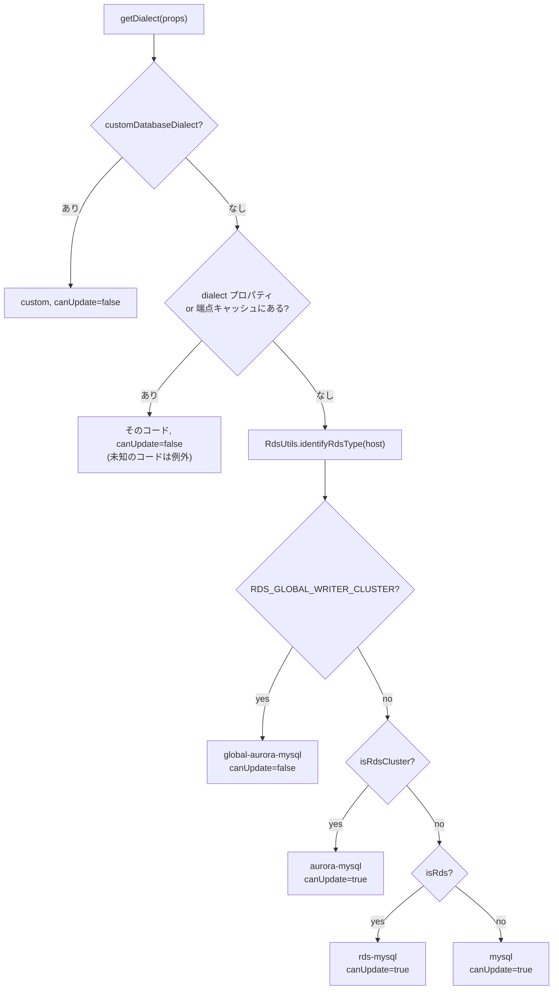

## この層の責務

`dialect` プロパティは任意である。書かなければラッパは 2 段階で決める。

1. **接続前**: ホスト名の形 (`.cluster-` / `.rds.amazonaws.com` / それ以外) から推測する
2. **接続後**: 推測した Dialect が持つ「昇格候補」に対して、実際の接続で SQL を投げて確かめる

`docs/using-the-nodejs-wrapper/DatabaseDialects.md` は「it will take time to resolve the dialect」と書いて明示を勧めるが、その「時間」が何回のクエリなのかは書いていない。このページで数える。

## 主要な型とその関係

判定の本体は `DatabaseDialectManager` ([`common/lib/database_dialect/database_dialect_manager.ts`](https://github.com/aws/aws-advanced-nodejs-wrapper/blob/6d0ba1bdae81a4e1fd274b3569c5dc50cf0a7095/common/lib/database_dialect/database_dialect_manager.ts)) で、`PluginServiceImpl` がコンストラクタで 1 つ作る。

```ts title="common/lib/database_dialect/database_dialect_manager.ts"
export class DatabaseDialectManager implements DatabaseDialectProvider {
  private static readonly ENDPOINT_CACHE_EXPIRATION_MS = 86_400_000_000_000; // 24 hours
  protected static readonly knownEndpointDialects: CacheMap<string, string> = new CacheMap();

  protected readonly knownDialectsByCode: Map<string, DatabaseDialect>;
  protected readonly customDialect: DatabaseDialect | null;
  protected readonly rdsHelper: RdsUtils = new RdsUtils();
  protected readonly dbType: DatabaseType;
  protected canUpdate: boolean = false;
  protected dialect: DatabaseDialect;
  protected dialectCode: string = "";
```

| フィールド                       | 意味                                                       |
| -------------------------------- | ---------------------------------------------------------- |
| `knownDialectsByCode`            | `BaseAwsMySQLClient` の static Map。コード → インスタンス  |
| `customDialect`                  | `customDatabaseDialect` で渡されたもの。あれば他を全部無視 |
| `canUpdate`                      | 接続後に昇格を試みるか。`false` なら確定済み               |
| `dialect` / `dialectCode`        | 現在の判定                                                 |
| `knownEndpointDialects` (static) | ホスト名 → コード のキャッシュ。プロセス共有               |

`ENDPOINT_CACHE_EXPIRATION_MS` は名前に反して**ナノ秒**で、`CacheMap.put` の第 3 引数がナノ秒だからである。86,400,000,000,000 ns = 86,400 s = 24 時間で、コメントは正しく、接尾辞だけが違う。

### 5 つの MySQL Dialect の昇格候補

`getDialectUpdateCandidates()` が返す配列は、**この Dialect から昇格し得る先**を試す順に並べたものである。

| 現在の Dialect        | 候補 (試す順)                                       |
| --------------------- | --------------------------------------------------- |
| `mysql`               | `rds-multi-az-mysql` → `aurora-mysql` → `rds-mysql` |
| `rds-mysql`           | `aurora-mysql` → `rds-multi-az-mysql`               |
| `aurora-mysql`        | `global-aurora-mysql` → `rds-multi-az-mysql`        |
| `rds-multi-az-mysql`  | (なし)                                              |
| `global-aurora-mysql` | (なし)                                              |

「より特殊なものを先に試す」のが原則で、`mysql` からは Multi-AZ を最初に試す。Multi-AZ の判定が 3 クエリと重いので、この順は後述の「回数」に効く。

### 各 Dialect の `isDialect`

| Dialect               | クエリ                                                                                                                                                 | 真になる条件                                                  | 場所                                                                                                                                                                                                            |
| --------------------- | ------------------------------------------------------------------------------------------------------------------------------------------------------ | ------------------------------------------------------------- | --------------------------------------------------------------------------------------------------------------------------------------------------------------------------------------------------------------- |
| `mysql`               | `SHOW VARIABLES LIKE 'version_comment'`                                                                                                                | 値を小文字化して `"mysql"` を含む                             | [`mysql_database_dialect.ts#L101`](https://github.com/aws/aws-advanced-nodejs-wrapper/blob/6d0ba1bdae81a4e1fd274b3569c5dc50cf0a7095/mysql/lib/dialect/mysql_database_dialect.ts#L101)                           |
| `rds-mysql`           | 同上 (2 回)                                                                                                                                            | `mysql` の判定が**偽**で、かつ `"source distribution"` を含む | [`rds_mysql_database_dialect.ts#L32`](https://github.com/aws/aws-advanced-nodejs-wrapper/blob/6d0ba1bdae81a4e1fd274b3569c5dc50cf0a7095/mysql/lib/dialect/rds_mysql_database_dialect.ts#L32)                     |
| `aurora-mysql`        | `SHOW VARIABLES LIKE 'aurora_version'`                                                                                                                 | 行があり `Value` が空でない                                   | [`aurora_mysql_database_dialect.ts#L116`](https://github.com/aws/aws-advanced-nodejs-wrapper/blob/6d0ba1bdae81a4e1fd274b3569c5dc50cf0a7095/mysql/lib/dialect/aurora_mysql_database_dialect.ts#L116)             |
| `rds-multi-az-mysql`  | `information_schema.tables` で `mysql.rds_topology` の存在 → `SELECT id, endpoint, port FROM mysql.rds_topology` → `SHOW VARIABLES LIKE 'report_host'` | 3 つ全部通り、`report_host` が空でない                        | [`rds_multi_az_mysql_database_dialect.ts#L44`](https://github.com/aws/aws-advanced-nodejs-wrapper/blob/6d0ba1bdae81a4e1fd274b3569c5dc50cf0a7095/mysql/lib/dialect/rds_multi_az_mysql_database_dialect.ts#L44)   |
| `global-aurora-mysql` | `aurora_global_db_status` の存在 → `aurora_global_db_instance_status` の存在 → `SELECT count(1) FROM information_schema.aurora_global_db_status`       | 2 表があり、地域数が **2 以上**                               | [`global_aurora_mysql_database_dialect.ts#L47`](https://github.com/aws/aws-advanced-nodejs-wrapper/blob/6d0ba1bdae81a4e1fd274b3569c5dc50cf0a7095/mysql/lib/dialect/global_aurora_mysql_database_dialect.ts#L47) |

`rds-mysql` の判定にはコードコメントで理由が書かれている。

```ts title="mysql/lib/dialect/rds_mysql_database_dialect.ts"
// The `SHOW VARIABLES LIKE 'version_comment'` either outputs
// | version_comment | MySQL Community Server (GPL) |
// for community Mysql, or
// | version_comment | Source distribution |
// for RDS MySQL. If super.isDialect returns true there is no need to check for RdsMysqlDialect.
```

community は `"MySQL Community Server (GPL)"` で `mysql` を含み、RDS は `"Source distribution"` で含まない。だから「`mysql` の判定が偽」が RDS の必要条件になる。

Multi-AZ の 3 番目の `report_host` は、Aurora も `mysql.rds_topology` を持つ (Blue/Green 用) ので、表の存在だけでは区別できないための追加条件である。Multi-AZ は各インスタンスがレプリケーション用に `report_host` を設定している。

Global の「地域数 > 1」は、Global Database に**なり得る**構成 (2 表がある) でも実際に副地域が無ければ通常の Aurora として扱う、という判断である。

## 処理の流れ

### 接続前: `getDialect(props)`

[`#L56`](https://github.com/aws/aws-advanced-nodejs-wrapper/blob/6d0ba1bdae81a4e1fd274b3569c5dc50cf0a7095/common/lib/database_dialect/database_dialect_manager.ts#L56) からコンストラクタで呼ばれる。



`RdsUrlType` ([`rds_url_type.ts`](https://github.com/aws/aws-advanced-nodejs-wrapper/blob/6d0ba1bdae81a4e1fd274b3569c5dc50cf0a7095/common/lib/utils/rds_url_type.ts)) の `isRds` / `isRdsCluster` フラグが分岐を決める。`.cluster-` / `.cluster-ro-` は `isRdsCluster`、インスタンスやプロキシのエンドポイントは `isRds` のみ、IP やカスタムドメインは両方 `false`。判定の正規表現は [RdsUtils](../rds-utils/) で読む。

ユーザ指定と端点キャッシュのヒットは `canUpdate = false` になる。つまり `dialect: "aurora-mysql"` と書くと**接続後の確認クエリが 1 本も走らない**。docs が明示を勧めるのはこのため。

### 接続後: `getDialectForUpdate`

[`#L173`](https://github.com/aws/aws-advanced-nodejs-wrapper/blob/6d0ba1bdae81a4e1fd274b3569c5dc50cf0a7095/common/lib/database_dialect/database_dialect_manager.ts#L173)。`DefaultPlugin.connectInternal` → `pluginService.updateDialect(client)` から、**接続のたびに**呼ばれる。

```ts title="common/lib/database_dialect/database_dialect_manager.ts"
async getDialectForUpdate(targetClient: ClientWrapper, originalHost: string, newHost: string): Promise<DatabaseDialect> {
  if (!this.canUpdate) {
    return this.dialect;
  }

  const dialectCandidates = this.dialect.getDialectUpdateCandidates();
  if (dialectCandidates.length > 0) {
    for (const dialectCandidateCode of dialectCandidates) {
      const dialectCandidate = this.knownDialectsByCode.get(dialectCandidateCode);
      if (!dialectCandidate) {
        throw new AwsWrapperError(Messages.get("DatabaseDialectManager.unknownDialectCode", dialectCandidateCode));
      }

      const isDialect = await dialectCandidate.isDialect(targetClient);
      if (isDialect) {
        this.canUpdate = false;
        this.dialectCode = dialectCandidateCode;
        this.dialect = dialectCandidate;

        DatabaseDialectManager.knownEndpointDialects.put(originalHost, dialectCandidateCode, DatabaseDialectManager.ENDPOINT_CACHE_EXPIRATION_MS);
        DatabaseDialectManager.knownEndpointDialects.put(newHost, dialectCandidateCode, DatabaseDialectManager.ENDPOINT_CACHE_EXPIRATION_MS);

        this.logCurrentDialect();
        return this.dialect;
      }
    }
  }

  DatabaseDialectManager.knownEndpointDialects.put(originalHost, this.dialectCode, DatabaseDialectManager.ENDPOINT_CACHE_EXPIRATION_MS);
  DatabaseDialectManager.knownEndpointDialects.put(newHost, this.dialectCode, DatabaseDialectManager.ENDPOINT_CACHE_EXPIRATION_MS);

  this.logCurrentDialect();
  return this.dialect;
}
```

- 候補を順に `isDialect` し、**最初に真になったもの**で確定する。候補を 1 段昇格しても、そこから更に候補があるかは**見ない**。`mysql` → `aurora-mysql` に昇格した接続で、更に `global-aurora-mysql` かどうかは次の接続まで確認されない (`canUpdate = false` になるので次の接続でも確認されない)
- **候補が全部偽なら現在の Dialect のまま**だが、`canUpdate` は `true` のまま残る。次の接続でまた候補を試す
- キャッシュには `originalHost` (アプリが書いたホスト) と `newHost` (今回接続したホスト) の両方を入れる。次に同じアプリが同じホストで `new AwsMySQLClient` すると、`getDialect` の段階で確定する

`PluginServiceImpl.updateDialect` ([`plugin_service.ts#L654`](https://github.com/aws/aws-advanced-nodejs-wrapper/blob/6d0ba1bdae81a4e1fd274b3569c5dc50cf0a7095/common/lib/plugin_service.ts#L654)) はこれを呼んだ後、**Dialect が変わっていれば `HostListProvider` を作り直す**。

```ts title="common/lib/plugin_service.ts"
async updateDialect(targetClient: ClientWrapper) {
  const originalDialect = this.dialect;
  this.dialect = await this.dbDialectProvider.getDialectForUpdate(targetClient, this.initialHost, this.props.get(WrapperProperties.HOST.name));

  this._isDialectConfirmed = true;
  this.storageService.set(this.getDialectConfirmedCacheKey(), new StatusCacheItem(true));

  if (originalDialect === this.dialect) {
    return;
  }

  this._hostListProvider = this.dialect.getHostListProvider(this.props, this.props.get(WrapperProperties.HOST.name), this.servicesContainer);
}
```

`mysql` (→ `ConnectionStringHostListProvider`) から `aurora-mysql` (→ `RdsHostListProvider`) に昇格すると、ここで `HostListProvider` が静的から動的に切り替わる。この直後に `AwsMySQLClient.connect()` の `internalPostConnect` が `refreshHostList()` を呼ぶので、初回接続の完了時点でトポロジが埋まる。

`_isDialectConfirmed` は `getDialectForUpdate` の結果に関わらず `true` になる。「確認を試みた」フラグであって「昇格した」フラグではない。`StatusCacheItem` にも書くので、同じ `clusterId` の別クライアントが `isDialectConfirmed()` を見ると `true` が返る。

### クエリ回数

`dialect` 未指定・端点キャッシュなしで、初回接続時に走る判定クエリの数。

| 実際の DB                                 | 初期推測       | 試す候補                                           | クエリ数 |
| ----------------------------------------- | -------------- | -------------------------------------------------- | -------- |
| Aurora MySQL (cluster エンドポイント)     | `aurora-mysql` | global (2 表 + count = 最大 3) → multi-az (最大 3) | 1〜6     |
| Aurora MySQL (インスタンスエンドポイント) | `rds-mysql`    | aurora (1)                                         | 1        |
| RDS MySQL (単体)                          | `rds-mysql`    | aurora (1) → multi-az (1、表がなく即偽)            | 2        |
| RDS Multi-AZ (cluster エンドポイント)     | `aurora-mysql` | global (1、表がなく即偽) → multi-az (3)            | 4        |
| 自前 MySQL / IP 指定                      | `mysql`        | multi-az (1) → aurora (1) → rds (2)                | 1〜4     |

Aurora の cluster エンドポイントで 1〜6 と幅があるのは、global の 1 番目の表がなければ即偽 (1 クエリ) で、あれば地域数まで数える (3 クエリ) ため。Global の表は Global Database でない Aurora にも存在することがあるので、その場合は 3 + multi-az の 1〜3 で最大 6 になる。

## 守られている不変条件

- **`canUpdate = false` になったら二度と変わらない。** 昇格に成功した、ユーザが指定した、キャッシュにあった、のいずれでも同じ。「一度確定したら以降の接続で SQL を投げない」を保証する
- **ユーザ指定は候補探索を完全にスキップする。** `dialect: "mysql"` と書いて Aurora に繋いでも、`aurora-mysql` には昇格しない。`ConnectionStringHostListProvider` のままなのでフェイルオーバーも動かない
- **昇格は 1 段だけ。** 候補配列は「次の 1 段」しか含まないので、`mysql` から `global-aurora-mysql` へは 1 回の接続では届かない
- **端点キャッシュは static。** 同じプロセスで別のクライアントを同じホストに作ると、接続前に確定する

## つまずきどころ

- **カスタムドメイン (CNAME) で Aurora に繋ぐと `mysql` から始まる。** 初回接続で最大 4 クエリ、かつ Multi-AZ 判定の `mysql.rds_topology` 参照が権限エラーになる環境では `.catch(() => false)` で握り潰される。`dialect: "aurora-mysql"` を明示するのが正解で、`clusterInstanceHostPattern` も併せて必要になる ([clusterInstanceHostPattern](../cluster-instance-host-pattern/))
- **昇格が 1 段なので、カスタムドメインで Global Database に繋ぐと `aurora-mysql` で止まる。** `mysql` → `aurora-mysql` で `canUpdate = false` になり、Global の表は見に行かない。Global を使うなら `dialect: "global-aurora-mysql"` を書く
- **`report_host` が空の Multi-AZ は判定できない。** Multi-AZ の `isDialect` の 3 番目の条件。通常は設定されているが、`SHOW VARIABLES LIKE 'report_host'` が空を返す環境では `aurora-mysql` のまま進み、トポロジクエリ (`replica_host_status`) が失敗する
- **`RdsUtils.identifyRdsType` は `.rds.amazonaws.com` を見る。** VPC エンドポイントや RDS Proxy 経由でホスト名が違うと `OTHER` になり、`mysql` から始まる
- **`isDialect` の失敗は全部 `false`。** ネットワークが不安定で判定クエリがタイムアウトすると、昇格できないまま `canUpdate = true` で進む。次の接続 (フェイルオーバー後など) で再試行されるが、それまでは `ConnectionStringHostListProvider` で動いているので、フェイルオーバー自体が起きない
