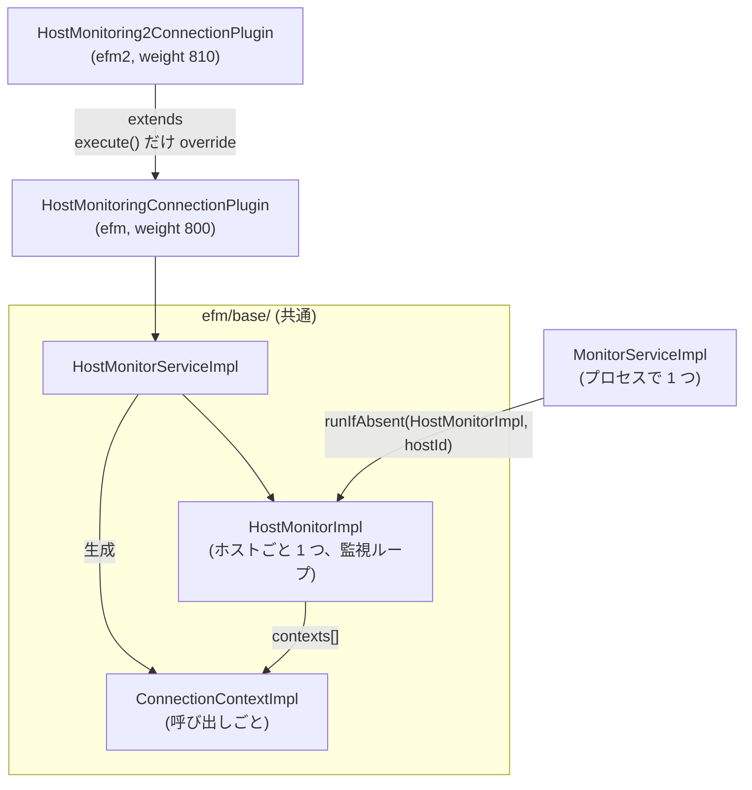

## 何を学んだか

`efm` (v1) と `efm2` (v2) の差は、この ref では**プラグインの `execute` の書き方だけ**である。監視ループも context も `HostMonitorServiceImpl` も、`efm/base/` 配下の同じクラスを使う。

| 観点                             | `efm` (v1)                                                            | `efm2` (v2)                                        |
| -------------------------------- | --------------------------------------------------------------------- | -------------------------------------------------- |
| plugin code / weight             | `efm` / 800                                                           | `efm2` / 810 (1.2.0 から既定)                      |
| クエリと監視の待ち方             | `Promise.race([waitForUnhealthy, methodPromise])`                     | `await methodFunc()` のみ                          |
| 不健全が確定したときの `execute` | 即座に `AwsWrapperError` → `finally` で `UnavailableHostError` に置換 | 何もしない。abort でクエリが落ちるのを待つ         |
| ホスト可用性の更新               | `setAvailability(NOT_AVAILABLE)` を自分で呼ぶ                         | 呼ばない (failover2 の `catch` に任せる)           |
| failover2 への通知の形           | `UnavailableHostError` (名指しで受け付けられる)                       | クエリ自身のエラー (`isNetworkError` で分類される) |
| 監視ループ / context / service   | 共通 (`efm/base/`)                                                    | 共通 (`efm/base/`)                                 |

docs の「2 つのタスクに分離」「アイドルな監視タスクの停止を再設計」は、1.2.0 時点の `efm2/monitor.ts` の説明で、3.0.0 の基盤共通化で消えた。今の差を docs から読むことはできない。

## ソースコードのどこか

### クラスの関係



`HostMonitoring2ConnectionPlugin` は `HostMonitoringConnectionPlugin` を継承して `execute` だけ上書きする ([`common/lib/plugins/efm/v2/host_monitoring2_connection_plugin.ts#L26`](https://github.com/aws/aws-advanced-nodejs-wrapper/blob/6d0ba1bdae81a4e1fd274b3569c5dc50cf0a7095/common/lib/plugins/efm/v2/host_monitoring2_connection_plugin.ts#L26))。`connect` (クラスタ URL のときに `identifyConnection` して routed host を確定する) や `getMonitoringHostInfo`、`notifyConnectionChanged`、`releaseResources` は v1 のものをそのまま使う。

### v1 の `execute` — 見張り役と競争させる

[`common/lib/plugins/efm/v1/host_monitoring_connection_plugin.ts#L80`](https://github.com/aws/aws-advanced-nodejs-wrapper/blob/6d0ba1bdae81a4e1fd274b3569c5dc50cf0a7095/common/lib/plugins/efm/v1/host_monitoring_connection_plugin.ts#L80)。

```ts title="common/lib/plugins/efm/v1/host_monitoring_connection_plugin.ts"
const methodPromise = methodFunc();
const raceResult = await Promise.race([this.waitForUnhealthy(context), methodPromise]);
if (raceResult === HostMonitoringConnectionPlugin.UNHEALTHY_STATE) {
  methodPromise.catch(() => {
    // Attach a no-op rejection handler to prevent it from throwing an unhandled promise rejection error when waitForUnhealthy times out first.
  });
  throw new AwsWrapperError("Host monitoring detected unhealthy host");
}
result = raceResult as T;
```

`waitForUnhealthy` は 100ms ごとに context のフラグを覗くだけの関数である ([`#L146`](https://github.com/aws/aws-advanced-nodejs-wrapper/blob/6d0ba1bdae81a4e1fd274b3569c5dc50cf0a7095/common/lib/plugins/efm/v1/host_monitoring_connection_plugin.ts#L146))。

```ts title="common/lib/plugins/efm/v1/host_monitoring_connection_plugin.ts"
private async waitForUnhealthy(context: ConnectionContext): Promise<symbol> {
  while (!context.isHostUnhealthy() && context.isActiveContext()) {
    await sleep(100);
  }
  return HostMonitoringConnectionPlugin.UNHEALTHY_STATE;
}
```

`Promise.race` で負けたほうの Promise は消えない。クエリの Promise が後から reject すると unhandled rejection になるので、空の `catch` を付けている。`isActiveContext()` も見ているのは、クエリが先に終わって `finally` で `setInactive()` されたときにこのループを抜けるためである。

`finally` はもう一段ある ([`#L116`](https://github.com/aws/aws-advanced-nodejs-wrapper/blob/6d0ba1bdae81a4e1fd274b3569c5dc50cf0a7095/common/lib/plugins/efm/v1/host_monitoring_connection_plugin.ts#L116))。

```ts title="common/lib/plugins/efm/v1/host_monitoring_connection_plugin.ts"
} finally {
  if (context != null) {
    this.monitorService.stopMonitoring(context);
    logger.debug(Messages.get("HostMonitoringConnectionPlugin.monitoringDeactivated", methodName));

    if (context.isHostUnhealthy()) {
      const monitoringHostInfo = await this.getMonitoringHostInfo();
      this.pluginService.setAvailability(monitoringHostInfo, HostAvailability.NOT_AVAILABLE);
      const targetClient = this.pluginService.getCurrentClient().targetClient;
      let isClientValid = false;
      if (targetClient) {
        isClientValid = await this.pluginService.isClientValid(targetClient);
      }

      if (!targetClient || !isClientValid) {
        if (targetClient) {
          await this.pluginService.abortTargetClient(targetClient);
        }
        // eslint-disable-next-line no-unsafe-finally
        throw new UnavailableHostError(
          Messages.get("HostMonitoringConnectionPlugin.unavailableHost", monitoringHostInfo?.host ?? "Unknown host")
        );
      }
    }
  }
}
```

不健全なら、ホストを `NOT_AVAILABLE` にし、アプリ側の接続で `isClientValid` (`SELECT 1`) を確認し、ダメなら abort して `UnavailableHostError` を投げる。`finally` の中の `throw` は `try` で投げた `AwsWrapperError` を**上書き**する (`no-unsafe-finally` を明示的に無効化している)。外に出るのは `UnavailableHostError` で、failover2 の `shouldErrorTriggerClientSwitch` はこの型を名指しで `true` にする ([なぜ EFM が要るか](../why-efm/))。

この `SELECT 1` は、monitor がすでに `destroy()` を掛けた接続に対して打たれる。mysql2 は `addCommand` を差し替え済みなので、`"Can't add new command when connection is in closed state"` で即座に落ち、`isClientValid` は待たずに `false` を返す。

### v2 の `execute` — 監視を付けて、外して、終わり

[`common/lib/plugins/efm/v2/host_monitoring2_connection_plugin.ts#L33`](https://github.com/aws/aws-advanced-nodejs-wrapper/blob/6d0ba1bdae81a4e1fd274b3569c5dc50cf0a7095/common/lib/plugins/efm/v2/host_monitoring2_connection_plugin.ts#L33)。

```ts title="common/lib/plugins/efm/v2/host_monitoring2_connection_plugin.ts"
try {
  logger.debug(Messages.get("HostMonitoringConnectionPlugin.activatedMonitoring", methodName));
  const monitoringHostInfo = await this.getMonitoringHostInfo();

  context = await this.monitorService.startMonitoring(
    this.pluginService.getCurrentClient().targetClient,
    monitoringHostInfo,
    this.properties,
    failureDetectionTimeMillis,
    failureDetectionIntervalMillis,
    failureDetectionCount,
  );

  result = await methodFunc();
} finally {
  if (context != null) {
    this.monitorService.stopMonitoring(context);
    logger.debug(Messages.get("HostMonitoringConnectionPlugin.monitoringDeactivated", methodName));
  }
}

return result;
```

`race` も `isHostUnhealthy` の確認もない。monitor が不健全を確定させると `context.abortConnection()` で mysql2 接続に `destroy()` を掛ける。v2 は「それでクエリが落ちる」ことを前提にしている。

### MySQL では abort で実行中クエリが落ちない

[HostMonitor](../host-monitor/) で読んだとおり、mysql2 の `destroy()` は `close()` の別名で、`_closing` を立てて `stream.end()` するだけである。socket の `close` イベントは `_closing` が立っていると無視され、実行中コマンドの callback は呼ばれない。ネットワークが黒穴の状況では FIN への応答も来ない。

したがって v2 で実行中クエリを落とすのは次のどちらかになる。

- ラッパの `ClientUtils.queryWithTimeout` (既定 `wrapperQueryTimeout` 20 秒)。エラーメッセージが `isNetworkError` の一致リストにあるので failover2 が拾う
- クエリに mysql2 の `timeout` を付けていれば `Query inactivity timeout`。これも一致リストにある

v1 なら不健全確定の 100ms 以内に `UnavailableHostError` が出る。v2 は不健全確定後も `wrapperQueryTimeout` まで待つ。既定値どうしなら、猶予 30 秒 + 閾値 15 秒で不健全になっても、クエリ自体は開始から 20 秒で先にタイムアウトしている。**既定設定の v2 では、EFM より `wrapperQueryTimeout` のほうが先に効く**。EFM を意味のあるものにするには `wrapperQueryTimeout` を伸ばすことになり、そうすると v2 では abort からクエリが落ちるまでの待ちがその値になる。

どちらの版でも監視は `execute` の中、つまり**メソッド実行中だけ**である。遊休中の接続に EFM は何もしない。

一方、abort の効果が**次のクエリ**に出る点は v1 と v2 で同じである。`addCommand` が差し替えられているので、次の `query()` は即座に `"Can't add new command when connection is in closed state"` になり、failover2 の `execute` がフェイルオーバーする。また failover2 は `execute` の冒頭で `hasNetworkError()` を確認するので、アイドル中に mysql2 が `error` を emit していればそれも拾う ([全体像](../failover-overview/))。

### 1.2.0 の efm2 は本当に 2 タスクだった

`git show 64227d1` (PR #371) の `common/lib/plugins/efm2/monitor.ts` を読むと、docs の説明どおりの構造がある。

```ts title="common/lib/plugins/efm2/monitor.ts (1.2.0 当時、現在は存在しない)"
static newContexts: Map<number, Array<WeakRef<MonitorConnectionContext>>> = new Map();
// ...
Promise.race([this.newContextRun(), this.run()]).finally(() => {
  this.stopped = true;
});
```

`startMonitoring` は context を「猶予明け時刻」をキーにした `newContexts` に入れるだけで、`newContextRun` タスクが時刻の来た context を `activeContexts` へ移し、`run` タスクがプローブを打つ。猶予中の context はプローブの対象外で、猶予が明けるまで監視ループに触れさせない設計だった。

3.0.0 の PR #685 (Global Database 対応) で `efm/monitor.ts` と `efm2/monitor.ts` の両方が削除され、`efm/base/host_monitor.ts` に一本化された。一本化後の `HostMonitorImpl` には `newContexts` がなく、猶予中の context もループの `contexts` に同居する。[HostMonitor](../host-monitor/) で読んだ「猶予中に 100ms 間隔でプローブが飛ぶ」挙動は、この一本化で生まれたものである。

### 監視ループ側の停止処理は共通

1.2.0 の `efm2/monitor.ts` にあった「停止時に 30 秒 sleep して監視タスクの終了を待つ」は、共通化後は `AbstractMonitor.stop()` の `terminationTimeoutMs` (30 秒) との `Promise.race` になった ([MonitorService](../monitor-service/))。docs の「アイドルな監視タスクの停止を再設計」はこの部分の話で、今は v1 も同じ経路を通る。

## なぜそうなっているか

### なぜ v2 は race をやめたのか

v1 の `waitForUnhealthy` は、**実行中のクエリ 1 本につき 100ms のタイマーを 1 つ**回す。同時に 200 本のクエリが走っていれば 200 個の `setTimeout` が 100ms ごとに発火する。Node.js のイベントループにとって重い量ではないが、監視ループ自体が 1 つで済んでいるのに、見張り役がクエリの数だけ増えるのは釣り合いが悪い。

v2 は「monitor が abort すればクエリは落ちる」という前提で見張り役を消した。この前提が成り立つかはドライバの `abort` の実装次第で、MySQL では mysql2 の `destroy()` がそれを満たさず、`wrapperQueryTimeout` が肩代わりしている。PG 側の `abort` がどうかはこの章では追わない。ラッパの `isNetworkError` に自分のタイムアウトメッセージを入れてあるのは、この経路を failover に繋ぐためでもある。

### なぜ v1 を残しているのか

`UsingTheHostMonitoringPlugin.md` は「efm2 は efm の drop-in replacement」「両方同時に使うのは推奨しない」と書き、v1 を削除していない。挙動差が上のとおり存在するので、v2 で検知が遅いと感じたときに v1 に戻す逃げ道として意味がある。v1 は `UnavailableHostError` を投げて `setAvailability` まで自分でやるので、failover2 との結合が強い代わりに反応が速い。

### `finally` で例外を上書きする設計

v1 の `finally` は意図的に `throw` する。`try` で投げた `"Host monitoring detected unhealthy host"` は内部用のシグナルで、外に見せたいのは `UnavailableHostError` である。`no-unsafe-finally` は「finally の throw は try の例外を握りつぶす」ことを警告する lint だが、ここでは握りつぶすことが目的なので無効化している。コメントなしで無効化されているので、lint の警告を消しただけに見えるが、上の流れを追えば設計だと分かる。

## どう活かすか

- **「ドライバの切断でクエリが落ちる」は前提にせず、ドライバごとに確かめる。** mysql2 と pg で `destroy` の意味が違う。ラッパのような多ドライバ対応層では、最も弱いドライバに合わせたフォールバック (ここでは自前タイムアウト) が要る
- **見張り役をリクエストごとに増やさない。** v1 の `waitForUnhealthy` は分かりやすいが、リクエスト数に比例するタイマーになる。監視は共有し、通知は例外や状態で受け取る形にする
- **drop-in replacement を名乗るなら、差分を docs に残す。** v1/v2 の docs は 1.2.0 の構造説明のままで、3.0.0 の一本化後の実態と合っていない。挙動差 (v2 の検知時間が `wrapperQueryTimeout` に依存する) は使う側が知るべき情報である
- **古い実装を残す判断には理由を書く。** v1 が残っている理由は docs にない。「反応が速い」「failover との結合が強い」という差が分かっていれば、選択の根拠になる

### 実務で踏む失敗パターン

- **既定の `efm2` で EFM の効果が見えない。** `wrapperQueryTimeout` 20 秒がクエリを先に落としている。EFM の検知を活かすなら `wrapperQueryTimeout` を長いクエリに合わせて伸ばし、`failureDetectionTime` を短くする。そのうえで v2 では不健全確定から `wrapperQueryTimeout` までの待ちが残ることを見込む
- **v2 で検知を早めたいのに `failureDetectionInterval` だけ縮めた。** 不健全は早く確定するが、実行中クエリが落ちるのは `wrapperQueryTimeout` か mysql2 の `timeout` である。クエリ側の `timeout` オプションを EFM の閾値に合わせるか、`efm` (v1) に切り替える
- **`efm,efm2` を両方入れた。** 動くが監視用接続が 2 本になり、context も 2 つ作られる。docs のとおり片方にする
