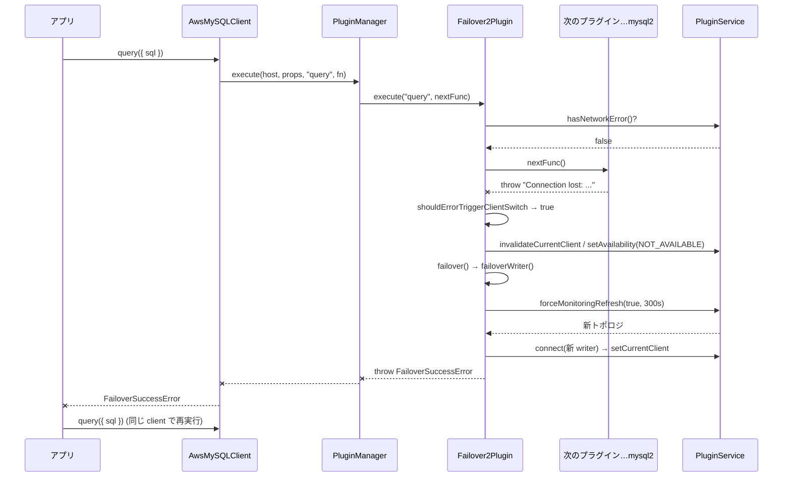

## 何を学んだか

failover2 プラグインは、**アプリの `query()` を try/catch で包んでいるだけ**である。例外を捕まえ、それが「接続を切り替えるべき例外」なら、トポロジモニタに新しい writer を聞き、そこへ張り直した接続を `PluginService` の現在接続に差し替え、そして**必ず例外を投げ直す**。成功しても `FailoverSuccessError` を投げる。

この構造から 3 つの契約が出てくる。

- **subscribed methods は `initHostProvider` / `connect` / `query` の 3 つだけ。** `execute` (prepared statement) も `beginTransaction` も `commit` も含まれない
- **遊休中に mysql2 が emit した `error` は、次の `query()` の冒頭で投げられる。** 誰も catch できないタイミングの例外を、アプリが catch できるタイミングまで持ち越す
- **`connect` 経路では成功例外を飲み込む。** `connect()` の戻り値は接続そのものなので、差し替え後の接続をそのまま返せる

## ソースコードのどこか

プラグイン本体は [`common/lib/plugins/failover2/failover2_plugin.ts`](https://github.com/aws/aws-advanced-nodejs-wrapper/blob/6d0ba1bdae81a4e1fd274b3569c5dc50cf0a7095/common/lib/plugins/failover2/failover2_plugin.ts) の 508 行。そのうち骨格は `execute` と `failover` の 40 行で、残りは writer / reader それぞれの張り直し手順 ([writer](../failover2-writer/)、[reader](../failover2-reader/)) と、`connect` 経路の分岐である。

### subscribed methods

[`failover2_plugin.ts#L49`](https://github.com/aws/aws-advanced-nodejs-wrapper/blob/6d0ba1bdae81a4e1fd274b3569c5dc50cf0a7095/common/lib/plugins/failover2/failover2_plugin.ts#L49)。

```ts title="common/lib/plugins/failover2/failover2_plugin.ts"
private static readonly SUBSCRIBED_METHODS: Set<string> = new Set(["initHostProvider", "connect", "query"]);
```

[PluginChain](../plugin-chain/) は、`pluginManager.execute(host, props, methodName, fn)` に渡された `methodName` をこの集合に含むプラグインだけをクロージャの入れ子に加える。`AwsMySQLClient.query()` は `"query"` を渡すので failover2 が挟まる。一方 `AwsMySQLClient.execute()` は `"execute"` を渡す ([`mysql/lib/client.ts#L557`](https://github.com/aws/aws-advanced-nodejs-wrapper/blob/6d0ba1bdae81a4e1fd274b3569c5dc50cf0a7095/mysql/lib/client.ts#L557)) ので、**prepared statement の失敗は failover2 を素通りする**。`beginTransaction` / `commit` / `rollback` / `end` も同様に素通りする。

なお `execute` の中には `canDirectExecute(methodName)` で `"end"` を素通しにする分岐がある ([`#L460`](https://github.com/aws/aws-advanced-nodejs-wrapper/blob/6d0ba1bdae81a4e1fd274b3569c5dc50cf0a7095/common/lib/plugins/failover2/failover2_plugin.ts#L460)) が、`"end"` は subscribed methods にないので、この分岐に `"end"` が来ることはない。実際にこのプラグインの `execute` が受け取る `methodName` は `"query"` だけである。

### execute — 30 行の骨格

[`failover2_plugin.ts#L192`](https://github.com/aws/aws-advanced-nodejs-wrapper/blob/6d0ba1bdae81a4e1fd274b3569c5dc50cf0a7095/common/lib/plugins/failover2/failover2_plugin.ts#L192)。

```ts title="common/lib/plugins/failover2/failover2_plugin.ts"
override async execute<T>(methodName: string, methodFunc: () => Promise<T>): Promise<T> {
  // Verify there weren't any unexpected errors emitted while the connection was idle.
  if (this.pluginService.hasNetworkError()) {
    // Throw the unexpected error directly to be handled.
    throw this.pluginService.getUnexpectedError();
  }

  if (!this.enableFailoverSetting || this.canDirectExecute(methodName)) {
    return await methodFunc();
  }

  let result: T = null;
  try {
    result = await methodFunc();
  } catch (error) {
    logger.debug(Messages.get("Failover.detectedError", error.message));
    if (this._lastError !== error && this.shouldErrorTriggerClientSwitch(error)) {
      await this.invalidateCurrentClient();
      const currentHostInfo: HostInfo = this.pluginService.getCurrentHostInfo();
      if (currentHostInfo !== null) {
        this.pluginService.setAvailability(currentHostInfo, HostAvailability.NOT_AVAILABLE);
      }
      await this.failover();
      this._lastError = error;
    }
    throw error;
  }
  return result;
}
```

流れは 4 段である。

1. **遊休中のエラーを先に投げる (設計上の分岐)。** `hasNetworkError()` は [`MySQLErrorHandler`](../mysql-error-handler/) が tracking リスナで記録した `error` を見る設計だが、MySQL では `getErrorHandler()` が毎回 `new` するうえリスナが unbound なので、常に `false` になる。この分岐は MySQL では動かない
2. **`methodFunc()` を実行する。** これが次のプラグイン、最終的には mysql2 の `query()` を呼ぶクロージャ
3. **例外を分類する。** [`shouldErrorTriggerClientSwitch`](../failover-triggers/) が true なら、現在接続を無効化し、ホストを `NOT_AVAILABLE` にして `failover()` へ
4. **`failover()` は必ず投げる。** そのため `this._lastError = error` には到達しない。到達するのは分類が false だった `throw error` だけで、これは元の例外をそのまま投げ直す

### failover — 役割で分岐して、必ず投げる

[`failover2_plugin.ts#L222`](https://github.com/aws/aws-advanced-nodejs-wrapper/blob/6d0ba1bdae81a4e1fd274b3569c5dc50cf0a7095/common/lib/plugins/failover2/failover2_plugin.ts#L222)。

```ts title="common/lib/plugins/failover2/failover2_plugin.ts"
async failover() {
  if (this.failoverMode === FailoverMode.STRICT_WRITER) {
    await this.failoverWriter();
  } else {
    await this.failoverReader();
  }

  this.throwFailoverSuccessException();
}
```

`failoverWriter` / `failoverReader` は失敗すると `FailoverFailedError` を投げ、成功すると正常に戻る。戻ってきたら `throwFailoverSuccessException` が [`FailoverSuccessError`](../failover-success-error/) か [`TransactionResolutionUnknownError`](../transaction-resolution-unknown/) を投げる。**この関数に例外を投げずに抜ける経路はない。**



### connect 経路 — 成功例外を飲み込む

[`failover2_plugin.ts#L120`](https://github.com/aws/aws-advanced-nodejs-wrapper/blob/6d0ba1bdae81a4e1fd274b3569c5dc50cf0a7095/common/lib/plugins/failover2/failover2_plugin.ts#L120)。

```ts title="common/lib/plugins/failover2/failover2_plugin.ts"
try {
  client = await this._staleDnsHelper.getVerifiedConnection(
    hostInfo.host,
    isInitialConnection,
    this.hostListProviderService!,
    props,
    connectFunc,
  );
} catch (error) {
  if (!this.shouldErrorTriggerClientSwitch(error)) {
    throw error;
  }

  this.pluginService.setAvailability(hostInfo, HostAvailability.NOT_AVAILABLE);

  try {
    // Unable to directly connect, attempt failover.
    await this.failover();
  } catch (error) {
    if (error instanceof FailoverSuccessError) {
      client = this.pluginService.getCurrentClient().targetClient;
    } else {
      throw error;
    }
  }
}
```

`connect` はまず [StaleDnsHelper](../stale-dns/) 越しに素直に接続を試みる。失敗が「切り替えるべき例外」なら `failover()` を呼ぶが、ここでは `FailoverSuccessError` を **catch して現在接続を取り出し、それを戻り値にする**。`query` 経路と違い、アプリには例外が届かない。

もう 1 つの分岐は、接続先ホストがトポロジ上で既に `NOT_AVAILABLE` になっている場合で、接続を試みずに `refreshHostList()` → `failover()` へ直行する。

### failover が無効な条件

[`failover2_plugin.ts#L110`](https://github.com/aws/aws-advanced-nodejs-wrapper/blob/6d0ba1bdae81a4e1fd274b3569c5dc50cf0a7095/common/lib/plugins/failover2/failover2_plugin.ts#L110)。

```ts title="common/lib/plugins/failover2/failover2_plugin.ts"
protected isFailoverEnabled(): boolean {
  return (
    this.enableFailoverSetting &&
    this.rdsUrlType !== RdsUrlType.RDS_PROXY &&
    this.rdsUrlType !== RdsUrlType.RDS_PROXY_ENDPOINT &&
    this.pluginService.getAllHosts() &&
    this.pluginService.getAllHosts().length > 0
  );
}
```

RDS Proxy 経由なら、Proxy 自身がフェイルオーバーを吸収するのでラッパは何もしない。ホスト一覧が空なら、張り直す先がないので何もしない。`enableClusterAwareFailover: false` は、プラグインを読み込んだまま機能だけ止めるスイッチである。

## なぜそうなっているか

### なぜ成功しても例外を投げるのか

接続が差し替わった、という事実をアプリに伝える手段が他にないからである。`query()` の戻り値は `[rows, fields]` で、そこに「実は途中で接続が変わった」を混ぜる場所はない。元のクエリを黙って再実行することもできない。`INSERT` が旧 writer に届いてからコミットされる前に切れたのか、届く前に切れたのかをラッパは知らない。**再実行してよいかを判断できるのはアプリだけ**なので、例外で制御を返す。

もう 1 つ、`SET time_zone` のようなセッション状態は、[転送される分](../transfer-and-reset/)以外は新しい接続で失われている。アプリが自分で設定し直す機会を作る、という意味でも例外が要る。この契約の細部は [FailoverSuccessError のページ](../failover-success-error/) で扱う。

### なぜ遊休中のエラーを次の query で投げるのか

mysql2 は、コマンドを実行していないときにサーバから接続を切られると、`Connection` オブジェクトに `error` イベントを emit する ([`lib/base/connection.js#L253`](https://github.com/sidorares/node-mysql2/blob/d8932925b237f07b6410263770379998df973502/lib/base/connection.js#L253) の `_notifyError`)。Node.js の `EventEmitter` は、`error` にリスナがいないとプロセスを落とす。そこでラッパは常にリスナを付けておくのだが、そのリスナの中でアプリに例外を届ける方法はない。

だから `PluginManager.execute` は、コマンド実行中は noOp リスナ、それ以外は tracking リスナに付け替え ([`plugin_manager.ts#L123`](https://github.com/aws/aws-advanced-nodejs-wrapper/blob/6d0ba1bdae81a4e1fd274b3569c5dc50cf0a7095/common/lib/plugin_manager.ts#L123))、tracking リスナが溜めておいたエラーを **次の `execute` の冒頭で** failover2 が投げる。この時点では try ブロックの外なので `failover()` は呼ばれない。投げるだけである。投げられた例外はアプリの catch に届き、アプリが再度 `query()` を呼べば、今度はその `query()` が失敗して通常の経路でフェイルオーバーが始まる。

### なぜ connect 経路では飲み込むのか

`connect` パイプラインの戻り値は `ClientWrapper` そのものである。フェイルオーバーで得た接続をそのまま返せるので、アプリに「差し替わった」を知らせる必要がない。初回接続なら、失われるセッション状態もまだない。

### `_lastError` は何のためにあるのか

`this._lastError !== error` は「同じ Error オブジェクトで 2 度フェイルオーバーしない」ためのガードに見えるが、上で見たとおり failover2 では代入行に到達しない。これは v1 の [`failover_plugin.ts#L272`](https://github.com/aws/aws-advanced-nodejs-wrapper/blob/6d0ba1bdae81a4e1fd274b3569c5dc50cf0a7095/common/lib/plugins/failover/failover_plugin.ts#L272) から持ち込まれた形で、v1 でも `failover()` は必ず投げるので、事情は同じである。害はないが、ガードとしては働いていない。

## どう活かすか

- **横取りする層は「例外を捕まえて、後始末して、投げ直す」だけにする。** failover2 が 508 行で済んでいるのは、再実行の判断をアプリに返しているからである。ラッパが賢く再実行しようとすると、冪等性の判断をラッパが背負うことになる
- **subscribed methods の集合を疑って読む。** `query` だけを包むプラグインは、`execute` (prepared statement) を包まない。mysql2 の `execute()` を多用しているコードは、failover2 の恩恵を受けていない。回避策は `query()` に寄せるか、`execute()` の失敗を自前で `isNetworkError` 相当の分類にかけて `end()` → 新規接続にすることである
- **イベントで届く失敗は、同期的な呼び出しの境界まで持ち越す。** `error` イベントを溜めて次の呼び出しで投げる、という形は、コネクションプールやソケットを持つライブラリ全般で使える

### 実務で踏む失敗パターン

- **`FailoverSuccessError` を「エラー」として扱い、client を捨てる。** 差し替え済みの接続を捨てることになる。[FailoverSuccessError のページ](../failover-success-error/) を参照
- **`client.execute()` でフェイルオーバーしない。** 上記のとおり subscribed ではない。ログに `[Failover] Detected an error` が出ないなら、まずどのメソッドで失敗したかを見る
- **遊休中に切れた接続は、次の `query()` で mysql2 が `Can't add new command when connection is in closed state` を投げ、それが [トリガ判定](../failover-triggers/) に一致してフェイルオーバーする。** `hasNetworkError()` の先読みは MySQL では常に `false` なので ([MySQLErrorHandler](../mysql-error-handler/))、遊休中の `error` イベントが「先に投げられる」ことはない。遊休中の切断に気づくのは、あくまで次のクエリの失敗による
