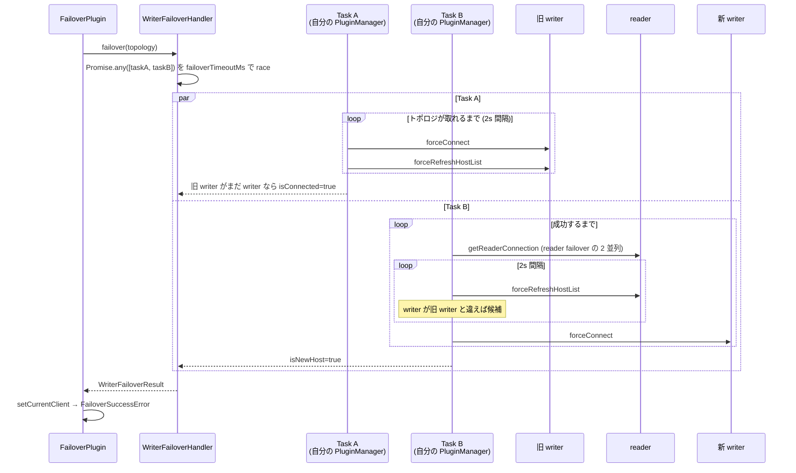

## 何を学んだか

`failover` (v1) は、**接続 1 本ごとに完結したフェイルオーバー**を行う。他の接続とも、トポロジモニタとも協調しない。

- **writer フェイルオーバーは 2 本のタスクの競争。** Task A は旧 writer に `forceConnect` を繰り返し、「まだ writer か」を確認する。Task B は reader に繋いでトポロジを読み、旧 writer と違う writer が現れたらそこへ繋ぐ。先に勝ったほうの接続が採用される
- **reader フェイルオーバーは 2 ホストずつのバッチ。** シャッフルした候補を 2 つずつ `Promise.any` で試し、バッチの間に 1 秒 `sleep` する
- **タスクごとに `PluginManager` を丸ごと作る。** Task A と Task B はそれぞれ `createMinimalServiceContainerFrom` で自分専用の plugin chain を持ち、本体の接続とは別の経路で DB に繋ぐ

[failover2](../failover2-writer/) はこの Task A/B を捨て、「新 writer の検出」を `ClusterTopologyMonitor` に委ねた。v1 を読むと、そこで何が中央化されたのかが見える。

## ソースコードのどこか

### プラグイン本体と購読メソッド

[`common/lib/plugins/failover/failover_plugin.ts#L53`](https://github.com/aws/aws-advanced-nodejs-wrapper/blob/6d0ba1bdae81a4e1fd274b3569c5dc50cf0a7095/common/lib/plugins/failover/failover_plugin.ts#L53)。

```ts title="common/lib/plugins/failover/failover_plugin.ts"
private static readonly subscribedMethods: Set<string> = new Set([
  "initHostProvider",
  "connect",
  "query",
  "notifyConnectionChanged",
  "notifyHostListChanged"
]);
```

failover2 の 3 つ (`initHostProvider` / `connect` / `query`) に `notifyConnectionChanged` と `notifyHostListChanged` が足されているが、前者は `NO_OPINION` を返すだけ、後者はログを出すだけで、どちらも挙動を変えない ([L158-190](https://github.com/aws/aws-advanced-nodejs-wrapper/blob/6d0ba1bdae81a4e1fd274b3569c5dc50cf0a7095/common/lib/plugins/failover/failover_plugin.ts#L158))。

`execute` の骨格は failover2 と同じで、[全体像](../failover-overview/) で読んだ「例外を捕まえ、接続を差し替え、例外を投げ直す」がそのまま並んでいる ([L252-285](https://github.com/aws/aws-advanced-nodejs-wrapper/blob/6d0ba1bdae81a4e1fd274b3569c5dc50cf0a7095/common/lib/plugins/failover/failover_plugin.ts#L252))。

```ts title="common/lib/plugins/failover/failover_plugin.ts"
} catch (e: any) {
  logger.debug(Messages.get("Failover.detectedError", e.message));
  if (this._lastError !== e && this.shouldErrorTriggerClientSwitch(e)) {
    await this.invalidateCurrentClient();
    const currentHostInfo = this.pluginService.getCurrentHostInfo();
    if (currentHostInfo !== null) {
      this.pluginService.setAvailability(currentHostInfo, HostAvailability.NOT_AVAILABLE);
    }

    this._lastError = e;
    await this.pickNewConnection();
  }

  throw e;
}
```

`pickNewConnection` ([L445](https://github.com/aws/aws-advanced-nodejs-wrapper/blob/6d0ba1bdae81a4e1fd274b3569c5dc50cf0a7095/common/lib/plugins/failover/failover_plugin.ts#L445)) は、writer が分かっていて reader を試す理由がなければまず `connectTo(currentWriter)` を試し、失敗したら `failover()` に入る。`failover()` は `failoverMode` が `strict-writer` なら `failoverWriter()`、それ以外は `failoverReader()` を呼び、最後に `throwFailoverSuccessError()` で [FailoverSuccessError](../failover-success-error/) を投げる ([L287-296](https://github.com/aws/aws-advanced-nodejs-wrapper/blob/6d0ba1bdae81a4e1fd274b3569c5dc50cf0a7095/common/lib/plugins/failover/failover_plugin.ts#L287))。

### writer フェイルオーバー — Task A と Task B

`failoverWriter()` は `ClusterAwareWriterFailoverHandler.failover(getAllHosts())` を呼ぶ ([L368](https://github.com/aws/aws-advanced-nodejs-wrapper/blob/6d0ba1bdae81a4e1fd274b3569c5dc50cf0a7095/common/lib/plugins/failover/failover_plugin.ts#L368))。本体は [`writer_failover_handler.ts#L90`](https://github.com/aws/aws-advanced-nodejs-wrapper/blob/6d0ba1bdae81a4e1fd274b3569c5dc50cf0a7095/common/lib/plugins/failover/writer_failover_handler.ts#L90) にある。

```ts title="common/lib/plugins/failover/writer_failover_handler.ts"
const taskAContainer = await this.newServicesContainer();
const taskBContainer = await this.newServicesContainer();

const reconnectToWriterHandlerTask = new ReconnectToWriterHandlerTask(
  currentTopology,
  getWriter(currentTopology),
  taskAContainer.pluginService,
  this.initialConnectionProps,
  this.reconnectionWriterIntervalMs,
  Date.now() + this.maxFailoverTimeoutMs,
);

const waitForNewWriterHandlerTask = new WaitForNewWriterHandlerTask(
  currentTopology,
  getWriter(currentTopology),
  this.readerFailoverHandler,
  taskBContainer.pluginService,
  this.initialConnectionProps,
  this.readTopologyIntervalMs,
  Date.now() + this.maxFailoverTimeoutMs,
);
```

`newServicesContainer()` ([L80](https://github.com/aws/aws-advanced-nodejs-wrapper/blob/6d0ba1bdae81a4e1fd274b3569c5dc50cf0a7095/common/lib/plugins/failover/writer_failover_handler.ts#L80)) は `ServiceUtils.createMinimalServiceContainerFrom` で `PartialPluginService` + 新しい `PluginManager` を作り、`pluginManager.init()` で plugin chain を組み立てる。つまり **Task A と Task B はそれぞれ独立した plugin chain を持ち**、`forceConnect` はそのチェーンを通って DB に届く。`StorageService` / `MonitorService` / `EventPublisher` だけは親から引き継ぐ ([`service_utils.ts#L114`](https://github.com/aws/aws-advanced-nodejs-wrapper/blob/6d0ba1bdae81a4e1fd274b3569c5dc50cf0a7095/common/lib/utils/service_utils.ts#L114))。

2 本のタスクは `Promise.any` で競わせ、全体を `failoverTimeoutMs` の `Promise.race` で包む ([L118-176](https://github.com/aws/aws-advanced-nodejs-wrapper/blob/6d0ba1bdae81a4e1fd274b3569c5dc50cf0a7095/common/lib/plugins/failover/writer_failover_handler.ts#L118))。

```ts title="common/lib/plugins/failover/writer_failover_handler.ts"
const singleTask: boolean = this.pluginService
  .getDialect()
  .getFailoverRestrictions()
  .includes(FailoverRestriction.DISABLE_TASK_A);
const failoverTaskPromise = singleTask ? taskB : Promise.any([taskA, taskB]);

const failoverTask = failoverTaskPromise.then((result) => {
  selectedTask = result.taskName;
  // If the first resolved promise is connected or has an error, return it.
  if (result.isConnected || result.error || singleTask) {
    return result;
  }

  // Return the other task result.
  if (selectedTask === ClusterAwareWriterFailoverHandler.RECONNECT_WRITER_TASK) {
    selectedTask = ClusterAwareWriterFailoverHandler.WAIT_NEW_WRITER_TASK;
    return taskB;
  } else if (selectedTask === ClusterAwareWriterFailoverHandler.WAIT_NEW_WRITER_TASK) {
    selectedTask = ClusterAwareWriterFailoverHandler.RECONNECT_WRITER_TASK;
    return taskA;
  }
  return ClusterAwareWriterFailoverHandler.DEFAULT_RESULT;
});
```

`Promise.any` は「先に **resolve** したもの」を返すが、タスクは失敗しても reject せず `isConnected: false` の結果を resolve する。そのため「先に終わったが繋がっていない」場合はもう一方を待つ、という分岐が要る。`DISABLE_TASK_A` の分岐は [Multi-AZ 向け FailoverRestriction](../failover-restriction-multi-az/) で読む。



#### Task A — 旧 writer に張り直す

[`ReconnectToWriterHandlerTask.call`](https://github.com/aws/aws-advanced-nodejs-wrapper/blob/6d0ba1bdae81a4e1fd274b3569c5dc50cf0a7095/common/lib/plugins/failover/writer_failover_handler.ts#L229)。

```ts title="common/lib/plugins/failover/writer_failover_handler.ts"
while (latestTopology.length === 0 && Date.now() < this.endTime && !this.failoverCompleted) {
  await this.pluginService.abortTargetClient(this.currentClient);

  try {
    const props = new Map(this.initialConnectionProps);
    props.set(WrapperProperties.HOST.name, this.originalWriterHost.host);
    this.currentClient = await this.pluginService.forceConnect(this.originalWriterHost, props);
    await this.pluginService.forceRefreshHostList();
    latestTopology = this.pluginService.getAllHosts();
  } catch (error) {
    // Propagate errors that are not caused by network errors.
    if (error instanceof AwsWrapperError && !this.pluginService.isNetworkError(error)) {
      logger.info(
        Messages.get("ClusterAwareWriterFailoverHandler.taskAEncounteredError", error.message),
      );
      return new WriterFailoverResult(
        false,
        false,
        [],
        ClusterAwareWriterFailoverHandler.RECONNECT_WRITER_TASK,
        null,
        error,
      );
    }
  }

  if (!latestTopology || latestTopology.length === 0) {
    await new Promise((resolve) => {
      this.timeoutId = setTimeout(resolve, this.reconnectionWriterIntervalMs);
    });
  }
}
success = isCurrentHostWriter(latestTopology, this.originalWriterHost);
```

ループを抜ける条件は「トポロジが取れた」であって「writer に戻った」ではない。トポロジが取れた時点で `isCurrentHostWriter` ([L38](https://github.com/aws/aws-advanced-nodejs-wrapper/blob/6d0ba1bdae81a4e1fd274b3569c5dc50cf0a7095/common/lib/plugins/failover/writer_failover_handler.ts#L38)) が `hostId` または `hostAndPort` で旧 writer と最新 writer を比べ、一致すれば成功、不一致なら `isConnected: false` で終わる。旧 writer が reader に降格して帰ってきた場合、Task A は 1 回のトポロジ取得で「負け」を確定させ、あとは Task B に任せる。

ネットワークエラー以外 (認証エラーなど) は即座に `error` 付きで返し、それが `Promise.any` の結果に載って `result.error` として本体まで伝わる。

#### Task B — reader から新 writer を待つ

[`WaitForNewWriterHandlerTask.call`](https://github.com/aws/aws-advanced-nodejs-wrapper/blob/6d0ba1bdae81a4e1fd274b3569c5dc50cf0a7095/common/lib/plugins/failover/writer_failover_handler.ts#L342) は `connectToReader()` と `refreshTopologyAndConnectToNewWriter()` を成功するまで繰り返す。

`connectToReader` ([L378](https://github.com/aws/aws-advanced-nodejs-wrapper/blob/6d0ba1bdae81a4e1fd274b3569c5dc50cf0a7095/common/lib/plugins/failover/writer_failover_handler.ts#L378)) は reader フェイルオーバーと同じ `getReaderConnection` で reader を 1 本確保する。失敗したら 1 秒待って繰り返す。

`refreshTopologyAndConnectToNewWriter` ([L400](https://github.com/aws/aws-advanced-nodejs-wrapper/blob/6d0ba1bdae81a4e1fd274b3569c5dc50cf0a7095/common/lib/plugins/failover/writer_failover_handler.ts#L400)) がこのタスクの核心である。

```ts title="common/lib/plugins/failover/writer_failover_handler.ts"
if (topology && topology.length > 0) {
  if (topology.length === 1) {
    // The currently connected reader is in a middle of failover. It's not yet connected
    // to a new writer and works in as "standalone" host. The handler needs to
    // wait till the reader gets connected to entire cluster and fetch a proper
    // cluster topology.

    // do nothing
    logger.info(
      Messages.get(
        "ClusterAwareWriterFailoverHandler.standaloneHost",
        this.currentReaderHost == null ? "" : this.currentReaderHost.url,
      ),
    );
  } else {
    this.currentTopology = topology;
    const writerCandidate = getWriter(this.currentTopology);
    if (
      writerCandidate &&
      (allowOldWriter || !this.isSame(writerCandidate, this.originalWriterHost))
    ) {
      // new writer is available, and it's different from the previous writer
      logger.debug(logTopology(this.currentTopology, "[Task B] "));
      if (await this.connectToWriter(writerCandidate)) {
        return true;
      }
    }
  }
}
```

reader から読んだトポロジが **1 行しかない**場合は「その reader はまだクラスタに再接続していない」とみなして待つ。Aurora のフェイルオーバー中、reader は一時的に自分しか知らない状態になる ([フェイルオーバーで何が起きるか](../what-happens-on-failover/))。writer 候補が旧 writer と同じなら、それは古いトポロジなので無視する。ただし `ENABLE_WRITER_IN_TASK_B` が立っていれば旧 writer も候補になる。

`connectToWriter` ([L445](https://github.com/aws/aws-advanced-nodejs-wrapper/blob/6d0ba1bdae81a4e1fd274b3569c5dc50cf0a7095/common/lib/plugins/failover/writer_failover_handler.ts#L445)) には「今繋いでいる reader が実は新 writer だった」という分岐があり、その場合は reader 接続をそのまま writer 接続として採用する。

#### 勝ったあと

本体の `failoverWriter()` に戻ると、結果のトポロジから writer を取り、`refreshHostList()` で許可ホスト一覧を更新し、新 writer が許可されているかを確認してから `setCurrentClient` する ([L383-404](https://github.com/aws/aws-advanced-nodejs-wrapper/blob/6d0ba1bdae81a4e1fd274b3569c5dc50cf0a7095/common/lib/plugins/failover/failover_plugin.ts#L383))。負けたタスクの接続は `finally` の `cancel()` で閉じられる ([L172-176](https://github.com/aws/aws-advanced-nodejs-wrapper/blob/6d0ba1bdae81a4e1fd274b3569c5dc50cf0a7095/common/lib/plugins/failover/writer_failover_handler.ts#L172))。

### reader フェイルオーバー — 2 ホストずつ

[`reader_failover_handler.ts`](https://github.com/aws/aws-advanced-nodejs-wrapper/blob/6d0ba1bdae81a4e1fd274b3569c5dc50cf0a7095/common/lib/plugins/failover/reader_failover_handler.ts)。`failover()` → `failoverTask()` が `failoverTimeoutMs` の `Promise.race` を掛け、`internalFailoverTask()` ([L111](https://github.com/aws/aws-advanced-nodejs-wrapper/blob/6d0ba1bdae81a4e1fd274b3569c5dc50cf0a7095/common/lib/plugins/failover/reader_failover_handler.ts#L111)) が期限まで `failoverInternal()` を繰り返す。

候補の並びは `getHostsByPriority` ([L268](https://github.com/aws/aws-advanced-nodejs-wrapper/blob/6d0ba1bdae81a4e1fd274b3569c5dc50cf0a7095/common/lib/plugins/failover/reader_failover_handler.ts#L268)) が決める。

```ts title="common/lib/plugins/failover/reader_failover_handler.ts"
shuffleList(activeReaders);
shuffleList(downHostList);

const hostsByPriority: HostInfo[] = [...activeReaders];
const numReaders: number = activeReaders.length + downHostList.length;
// Since the writer instance may change during failover, the original writer is likely now a reader. We will include
// it and then verify the role once connected if using "strict-reader".
if (writerHost || numReaders === 0) {
  hostsByPriority.push(writerHost);
}
hostsByPriority.push(...downHostList);
```

`AVAILABLE` な reader をシャッフル → writer → `NOT_AVAILABLE` な reader をシャッフル、の順である。writer が候補に入るのは「旧 writer は今ごろ reader になっているだろう」という読みで、`strict-reader` のときは繋いだあとに役割を確認する ([L115-134](https://github.com/aws/aws-advanced-nodejs-wrapper/blob/6d0ba1bdae81a4e1fd274b3569c5dc50cf0a7095/common/lib/plugins/failover/reader_failover_handler.ts#L115))。

この並びを 2 つずつ試すのが `getConnectionFromHostGroup` ([L150](https://github.com/aws/aws-advanced-nodejs-wrapper/blob/6d0ba1bdae81a4e1fd274b3569c5dc50cf0a7095/common/lib/plugins/failover/reader_failover_handler.ts#L150))。

```ts title="common/lib/plugins/failover/reader_failover_handler.ts"
for (let i = 0; i < hosts.length; i += 2) {
  // submit connection attempt tasks in batches of 2
  try {
    const result = await this.getResultFromNextTaskBatch(hosts, i, failoverTaskId);
    if (result && (result.isConnected || result.error)) {
      return result;
    }
  } catch (error) {
    // Failover has failed.
    this.taskHandler.setSelectedConnectionAttemptTask(
      failoverTaskId,
      ClusterAwareReaderFailoverHandler.FAILOVER_FAILED,
    );
    throw error;
  }

  await sleep(1000);
}
```

各バッチは `getResultFromNextTaskBatch` ([L174](https://github.com/aws/aws-advanced-nodejs-wrapper/blob/6d0ba1bdae81a4e1fd274b3569c5dc50cf0a7095/common/lib/plugins/failover/reader_failover_handler.ts#L174)) で `failoverReaderConnectTimeoutMs` (既定 30 秒) の `race` を掛け、中の `getResultTask` が 1〜2 個の `ConnectionAttemptTask` を `Promise.any` で走らせる。バッチがタイムアウトした場合は `InternalQueryTimeoutError` を握りつぶして次のバッチへ進む。

`ConnectionAttemptTask.call` ([L326](https://github.com/aws/aws-advanced-nodejs-wrapper/blob/6d0ba1bdae81a4e1fd274b3569c5dc50cf0a7095/common/lib/plugins/failover/reader_failover_handler.ts#L326)) は `forceConnect` して、`ReaderTaskSelectorHandler` で「このフェイルオーバーで最初に成功したタスクか」を確認する。2 番手だった場合は例外を投げて `performFinalCleanup` で自分の接続を閉じる。`Promise.any` は先勝ちの結果しか返さないが、**負けたほうの接続試行は止められない**ので、遅れて成功した接続を誰かが閉じる必要がある。`reader_task_selector.ts` のクラスコメントがその事情をそのまま書いている ([`reader_task_selector.ts#L17`](https://github.com/aws/aws-advanced-nodejs-wrapper/blob/6d0ba1bdae81a4e1fd274b3569c5dc50cf0a7095/common/lib/plugins/failover/reader_task_selector.ts#L17))。

## なぜそうなっているか

### なぜ Task A が要るのか

「writer が落ちた」と判定するトリガは、ネットワークエラーである ([何をトリガとするか](../failover-triggers/))。だがネットワークエラーは、writer のプロセスが死んだときも、途中のネットワークが一瞬切れただけのときも、同じ顔をしている。後者なら writer は交代しておらず、同じホストに張り直せば済む。Task A はそのケースを最短で拾う。

Task B しかなければ、一時的な断のたびに reader へ繋いでトポロジを読み、「writer は変わっていない」と分かるまで待つことになる。Task A は「変わっていないなら 1 回の `forceConnect` で終わり」を提供する。

### なぜ Task B は reader を経由するのか

新 writer の名前を知るにはトポロジを読む必要があり、トポロジは DB に SQL で聞くしかない ([トポロジクエリ](../topology-query-aurora/))。旧 writer は落ちているので、聞ける相手は reader だけである。だから「まず reader に繋ぐ」が必須の前段になる。

ただし reader のトポロジは古いことがある。フェイルオーバー直後の reader は新 writer に再接続するまで自分 1 台しか知らないし、`replica_host_status` は各インスタンスが自己申告した情報の集合なので、更新が遅れる。Task B の「1 行なら待つ」「旧 writer と同じなら無視」という 2 つのガードは、その古さへの対処である。

failover2 はこの弱点を、**全ホストに「自分は writer か」と直接聞く**ことで潰した ([「自分は writer か」を全ホストに聞く](../am-i-a-writer/))。`UsingTheFailover2Plugin.md` の差分一覧に "Topology may be fetched from a reader host and it may be stale" が v1 側の特徴として挙げられているのは、この話である。

### なぜ接続ごとに plugin chain を作るのか

Task A/B の `forceConnect` は、IAM トークンの生成や Secrets Manager の参照といった**認証プラグインの処理を通す必要がある**。本体の `PluginService` は現在の接続 1 本を管理する前提で作られていて、並行して 2 本の候補接続を扱えない。そこで各タスクに `PartialPluginService` + `PluginManager` を持たせ、本体と同じチェーンを別インスタンスで走らせる。

これが `UsingTheFailover2Plugin.md` の言う "additional resources like extra asynchronous tasks" の正体で、接続数が多いときにフェイルオーバーが同時多発すると、その数だけ plugin chain とタスクが生まれる。failover2 は検出を 1 つのモニタに集約することでこれをなくした。

### なぜ 2 並列なのか

reader の候補は全部試したいが、全ホストに同時に `forceConnect` を投げると、フェイルオーバー中で不安定なクラスタに接続の嵐を浴びせることになる。1 本ずつだと、応答しないホストに当たったとき `failoverReaderConnectTimeoutMs` (30 秒) を丸ごと待つ。2 本ずつは「片方が固まってももう片方が通れば進める」最小の並列度で、バッチ間の 1 秒はクラスタへの遠慮である。

### Multi-AZ で v1 だけが動作確認済みである理由

`SupportForRDSMultiAzDBCluster.md` は動作確認済みプラグインとして `failover` (v1) を挙げ、`failover2` を挙げていない。v1 には Dialect が返す `FailoverRestriction` で Task A を止め、Task B の候補に旧 writer を含める仕掛けがあり、Multi-AZ の切り替え特性に合わせられる。次のページで読む。

## どう活かすか

- **「同じ相手に張り直す」と「別の相手を探す」を競わせる。** 一時的な断と本当の障害は最初は区別がつかない。両方を同時に走らせて先勝ちにすれば、どちらのケースでも最短で復帰できる。`Promise.any` はこの用途に向くが、負けたほうの後始末は自分で書く必要がある
- **失敗を reject ではなく値で返すと、`Promise.any` の意味が変わる。** ここでは全タスクが resolve するので「先に終わった = 成功」ではない。競争させるなら、失敗を reject にするか、結果を見て残りを待つ分岐を置くか、どちらかを最初に決める
- **止められない非同期処理には「勝者の記録」を置く。** `ReaderTaskSelectorHandler` は 20 行の Map だが、これがないと遅れて成功した接続がリークする。キャンセルできない API を並列に呼ぶときは、完了時に「まだ自分が必要か」を確認する場所を用意する
- **並列度は相手の状況で決める。** フェイルオーバー中のクラスタは平常時より脆い。最大並列ではなく「固まっても進める最小の並列」を選ぶ発想は、DB 以外の障害復旧でも使える

### つまずきどころ

- **成功時にも失敗カウンタが増える。** `failoverWriter()` の `catch` は `FailoverSuccessError` なら成功カウンタを増やしたあと、無条件に失敗カウンタも増やす ([L405-410](https://github.com/aws/aws-advanced-nodejs-wrapper/blob/6d0ba1bdae81a4e1fd274b3569c5dc50cf0a7095/common/lib/plugins/failover/failover_plugin.ts#L405))。`writerFailover.completed.failed.count` を監視に使うなら、v1 では成功分も混ざる
- **`failoverClusterTopologyRefreshRateMs` と `failoverWriterReconnectIntervalMs` は v1 専用。** failover2 では読まれない。逆に `clusterTopologyHighRefreshRateMs` は v1 では効かない ([時間設計](../failover-timing/))
- **Task B の `refreshTopologyTimeoutId` は使われていない。** トポロジ再読込の待ちも `connectToReaderTimeoutId` に代入される ([L438-440](https://github.com/aws/aws-advanced-nodejs-wrapper/blob/6d0ba1bdae81a4e1fd274b3569c5dc50cf0a7095/common/lib/plugins/failover/writer_failover_handler.ts#L438))。`cancel()` は両方を `clearTimeout` するので実害はないが、フィールド名を頼りに読むと迷う
- **`failover` と `failover2` を同時に有効にしない。** どちらも `query` を購読し、同じエラーで別々にフェイルオーバーを始める。`UsingTheFailover2Plugin.md` の Warning はこれである
