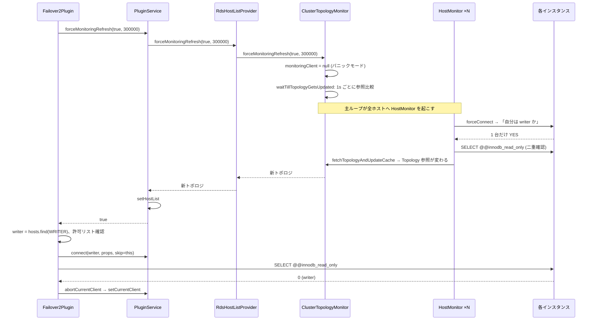

## 何を学んだか

failover2 の writer フェイルオーバーは、**自分では新しい writer を探さない**。やることは 4 つで、探索は全部 [ClusterTopologyMonitor](../cluster-topology-monitor/) に委ねている。

1. `forceMonitoringRefresh(true, failoverTimeoutMs)` でモニタを**パニックモード**に落とし、トポロジが更新されるまで待つ
2. 返ってきたトポロジから `role === WRITER` のホストを取り、許可リストにあるか確認する
3. そのホストへ plugin chain 経由で接続し、`SELECT @@innodb_read_only` で**本当に writer か**を検証する
4. 旧接続を `destroy()` し、`setCurrentClient` で新接続を現在接続にする

「待つ」の実体は、ストレージにある `Topology` オブジェクトの**参照が変わる**まで 1 秒ごとに見る、というポーリングである。

## ソースコードのどこか

### failoverWriter

[`failover2_plugin.ts#L367`](https://github.com/aws/aws-advanced-nodejs-wrapper/blob/6d0ba1bdae81a4e1fd274b3569c5dc50cf0a7095/common/lib/plugins/failover2/failover2_plugin.ts#L367)。telemetry を剥がすと骨格はこれだけである。

```ts title="common/lib/plugins/failover2/failover2_plugin.ts"
if (!(await this.pluginService.forceMonitoringRefresh(true, this.failoverTimeoutSettingMs))) {
  // Unable to establish SQL connection to writer node.
  this.logAndThrowError(Messages.get("Failover2.unableToFetchTopology"));
}

const hosts: HostInfo[] = this.pluginService.getAllHosts();

let writerCandidateClient: ClientWrapper = null;
const writerCandidateHostInfo: HostInfo = hosts.find((x) => x.role === HostRole.WRITER);

const allowedHosts = this.pluginService.getHosts();
if (!allowedHosts.some((hostInfo: HostInfo) => hostInfo.host === writerCandidateHostInfo?.host)) {
  // ... Failover.newWriterNotAllowed
  throw new FailoverFailedError(failoverErrorMessage);
}

if (writerCandidateHostInfo) {
  try {
    writerCandidateClient = await this.createConnectionForHost(writerCandidateHostInfo);
  } catch (err) {
    this.logAndThrowError(
      Messages.get(
        "Failover.unableToConnectToWriterDueToError",
        writerCandidateHostInfo.host,
        err.message,
      ),
    );
  }
}

if (!writerCandidateClient) {
  this.logAndThrowError(Messages.get("Failover.unableToConnectToWriter"));
}

if ((await this.pluginService.getHostRole(writerCandidateClient)) !== HostRole.WRITER) {
  try {
    await writerCandidateClient?.end();
  } catch (error) {
    // Do nothing.
  }
  this.logAndThrowError(
    Messages.get("Failover2.failoverWriterConnectedToReader", writerCandidateHostInfo.host),
  );
}

await this.pluginService.abortCurrentClient();
await this.pluginService.setCurrentClient(writerCandidateClient, writerCandidateHostInfo);
```

`getAllHosts()` と `getHosts()` の違いに注意する。前者はトポロジ全体、後者は [customEndpoint](../custom-endpoint/) や Blue/Green が絞った「今この client が繋いでよいホスト」である。writer がその外にいたら、繋げるのに繋がない。

`createConnectionForHost` は `pluginService.connect(hostInfo, copyProps, this)` を呼ぶ ([`#L429`](https://github.com/aws/aws-advanced-nodejs-wrapper/blob/6d0ba1bdae81a4e1fd274b3569c5dc50cf0a7095/common/lib/plugins/failover2/failover2_plugin.ts#L429))。第 3 引数の `this` は「自分自身をスキップする」指示で、[connect パイプライン](../pipelines/) は failover2 を飛ばして残り (IAM 認証など) を通す。フェイルオーバー中の接続がまた failover2 の `connect` に入って再帰するのを防いでいる。

### forceMonitoringRefresh — 3 層を降りる

`PluginService.forceMonitoringRefresh` ([`plugin_service.ts#L342`](https://github.com/aws/aws-advanced-nodejs-wrapper/blob/6d0ba1bdae81a4e1fd274b3569c5dc50cf0a7095/common/lib/plugin_service.ts#L342)) は、HostListProvider が動的 (`forceMonitoringRefresh` を持つ) であることを確認して委譲し、戻り値を `boolean` に潰す。タイムアウト (`AwsTimeoutError`) は握りつぶして `false` にする。

```ts title="common/lib/plugin_service.ts"
try {
  const updatedHostList: HostInfo[] = await (
    hostListProvider as DynamicHostListProvider
  ).forceMonitoringRefresh(shouldVerifyWriter, timeoutMs);
  if (updatedHostList) {
    this.updateHostAvailability(updatedHostList);
    await this.setHostList(this.hosts, updatedHostList);
    return true;
  }
} catch (err) {
  if (err instanceof AwsTimeoutError) {
    // Do nothing.
    logger.info(Messages.get("PluginService.forceMonitoringRefreshTimeout", timeoutMs.toString()));
  }
}

return false;
```

`RdsHostListProvider.forceMonitoringRefresh` ([`rds_host_list_provider.ts#L142`](https://github.com/aws/aws-advanced-nodejs-wrapper/blob/6d0ba1bdae81a4e1fd274b3569c5dc50cf0a7095/common/lib/host_list_provider/rds_host_list_provider.ts#L142)) は、[Dialect が確定](../dialect-resolution/)する前なら接続文字列から作った初期リストを返して終わる。確定済みなら `getOrCreateMonitor()` でクラスタ ID に対応するモニタを取り、そこへ委譲する。

`ClusterTopologyMonitorImpl.forceMonitoringRefresh` ([`cluster_topology_monitor.ts#L217`](https://github.com/aws/aws-advanced-nodejs-wrapper/blob/6d0ba1bdae81a4e1fd274b3569c5dc50cf0a7095/common/lib/host_list_provider/monitoring/cluster_topology_monitor.ts#L217))。

```ts title="common/lib/host_list_provider/monitoring/cluster_topology_monitor.ts"
async forceMonitoringRefresh(shouldVerifyWriter: boolean, timeoutMs: number): Promise<HostInfo[] | null> {
  if (shouldVerifyWriter) {
    const client = this.monitoringClient;
    this.monitoringClient = null;
    if (client) {
      await this.closeConnection(client);
    }
  }

  return await this.waitTillTopologyGetsUpdated(timeoutMs);
}
```

`shouldVerifyWriter = true` の効果は **監視接続を閉じて `null` にする**、それだけである。モニタの主ループは `isInPanicMode()` を `!this.monitoringClient` で判定している ([`#L814`](https://github.com/aws/aws-advanced-nodejs-wrapper/blob/6d0ba1bdae81a4e1fd274b3569c5dc50cf0a7095/common/lib/host_list_provider/monitoring/cluster_topology_monitor.ts#L814)) ので、これでパニックモードに入る。「writer を検証しろ」という指示を、「今の監視接続を信用するな」という状態変化で伝えている。

### waitTillTopologyGetsUpdated — 参照が変わるまで 1 秒ごと

[`cluster_topology_monitor.ts#L239`](https://github.com/aws/aws-advanced-nodejs-wrapper/blob/6d0ba1bdae81a4e1fd274b3569c5dc50cf0a7095/common/lib/host_list_provider/monitoring/cluster_topology_monitor.ts#L239)。

```ts title="common/lib/host_list_provider/monitoring/cluster_topology_monitor.ts"
async waitTillTopologyGetsUpdated(timeoutMs: number): Promise<HostInfo[] | null> {
  // Notify the monitoring task, which may be sleeping, that topology should be refreshed immediately.
  this.requestToUpdateTopology = true;

  const currentHosts: HostInfo[] = this.getStoredHosts();

  if (timeoutMs === 0) {
    logger.info(logTopology(currentHosts, Messages.get("ClusterTopologyMonitoring.timeoutSetToZero")));
    return currentHosts;
  }

  const endTime = Date.now() + timeoutMs;
  let latestHosts: HostInfo[];

  while ((latestHosts = this.getStoredHosts()) === currentHosts && Date.now() < endTime) {
    await sleep(1000);
  }

  if (Date.now() >= endTime) {
    throw new AwsTimeoutError(Messages.get("ClusterTopologyMonitor.timeoutError", timeoutMs.toString()));
  }
  return latestHosts;
}
```

比較は `===`、つまり **`StorageService` に入っている `Topology` オブジェクトの参照**である。モニタが `updateTopologyCache(hosts)` で `new Topology(hosts)` を `set` するたびに参照が変わる。内容が同じでも新しいオブジェクトなら「更新された」と見なす。`requestToUpdateTopology = true` は、モニタ側の `delay()` が 50ms ごとに見ているフラグで、通常モードの 30 秒スリープを打ち切る。

### モニタ側で起きること

`monitor()` の主ループ ([`#L427`](https://github.com/aws/aws-advanced-nodejs-wrapper/blob/6d0ba1bdae81a4e1fd274b3569c5dc50cf0a7095/common/lib/host_list_provider/monitoring/cluster_topology_monitor.ts#L427)) はパニックモードに入ると、ストレージのトポロジにある全ホストへ `HostMonitor` を 1 つずつ起こす。各 `HostMonitor.run()` ([`#L862`](https://github.com/aws/aws-advanced-nodejs-wrapper/blob/6d0ba1bdae81a4e1fd274b3569c5dc50cf0a7095/common/lib/host_list_provider/monitoring/cluster_topology_monitor.ts#L862)) は自分のホストに繋ぎ、「[自分は writer か](../am-i-a-writer/)」を聞き続ける。

```ts title="common/lib/host_list_provider/monitoring/cluster_topology_monitor.ts (HostMonitor.run 抜粋)"
if (isWriter) {
  try {
    // First connection after failover may be stale.
    const hostRole = await this.monitor.pluginService.getHostRole(this.client);
    if (hostRole !== HostRole.WRITER) {
      isWriter = false;
    }
  } catch (error: any) {
    // ...
  }
}

if (isWriter) {
  if (this.monitor.hostMonitorsWriterClient) {
    await this.monitor.closeConnection(this.client);
  } else {
    await this.monitor.fetchTopologyAndUpdateCache(this.client);
    this.hostInfo.setAvailability(HostAvailability.AVAILABLE);
    this.monitor.hostMonitorsWriterClient = this.client;
    this.monitor.hostMonitorsWriterInfo = this.hostInfo;
    this.client = null;
    this.monitor.hostMonitorsStop = true;
  }
  return;
}
```

writer と分かった `HostMonitor` は、その接続で `fetchTopologyAndUpdateCache` を呼ぶ。これがストレージの `Topology` を差し替え、`waitTillTopologyGetsUpdated` のループが抜ける。同時に接続を主ループに渡して監視接続に昇格させ (`hostMonitorsWriterClient`)、他の `HostMonitor` を止める。



### 失敗の出口

`logAndThrowError` ([`#L503`](https://github.com/aws/aws-advanced-nodejs-wrapper/blob/6d0ba1bdae81a4e1fd274b3569c5dc50cf0a7095/common/lib/plugins/failover2/failover2_plugin.ts#L503)) は telemetry の失敗カウンタを増やして `FailoverFailedError` を投げる。出口は 5 つある。

| 出口                                                 | メッセージ                                   |
| ---------------------------------------------------- | -------------------------------------------- |
| `forceMonitoringRefresh` が false (タイムアウト含む) | `Failover2.unableToFetchTopology`            |
| 新 writer が許可リスト外                             | `Failover.newWriterNotAllowed`               |
| 新 writer への接続が失敗                             | `Failover.unableToConnectToWriterDueToError` |
| トポロジに writer がいない                           | `Failover.unableToConnectToWriter`           |
| 繋いだら reader だった                               | `Failover2.failoverWriterConnectedToReader`  |

最後の 1 つは、モニタが writer と判定してから failover2 が繋ぐまでの間に再度役割が変わった場合である。二重確認を捨てていない。

## なぜそうなっているか

### なぜ探索をモニタに集約するのか

docs の `UsingTheFailover2Plugin.md` が Picture 1 / 2 で説明している。v1 は接続ごとにフェイルオーバー処理を走らせ、それぞれが `RdsHostListProvider` にトポロジを問い合わせる。100 本の接続が同時に切れれば 100 個の探索タスクが立ち、各々がクラスタに接続を張って `replica_host_status` を読む。クラスタが一番弱っているときに、クライアント側が一番負荷をかける。

v2 では、探索は **クラスタ ID につき 1 本**のモニタがやり、切れた接続はストレージの参照が変わるのを待つだけである。100 本待っていても、クラスタへの接続はホスト数分しか増えない。

### なぜ「自分は writer か」を全ホストに聞くのか

reader が持つトポロジ (`replica_host_status`) は、フェイルオーバー直後は古い。docs の Picture 3 では `Instance-3` が降格済みなのにまだ writer として載っている。reader 経由で得たトポロジの writer に繋ぐと、降格した旧 writer に当たる。**新 writer だけが「自分が writer だ」と正しく答えられる**ので、全ホストに直接聞いて、YES と言ったホストからトポロジを取る。この仕組みは [「自分は writer か」を全ホストに聞く](../am-i-a-writer/) で掘る。

### なぜ 1 秒ポーリングなのか

`waitTillTopologyGetsUpdated` には Promise ベースの通知がなく、1 秒スリープの単純なループである。フェイルオーバー中の待ち時間は Aurora 側の昇格 (通常 30 秒前後) が支配的で、1 秒の粒度が全体に効くことはない。イベント通知を組むと、待つ側とモニタ側の両方に購読・解除の状態管理が入る。参照比較なら状態を持たなくて済む。

### なぜタイムアウトが 300 秒なのか

`failoverTimeoutMs` の既定 300,000ms は、Aurora のフェイルオーバーが最悪ケースで数分かかることを前提にしている。[FailoverConfigurationGuide](../failover-timing/) の "Host Availability" 節にあるとおり、フェイルオーバー中は一時的に**全ホスト**が接続を受け付けなくなる瞬間がある。短くしすぎると、その瞬間に当たって `FailoverFailedError` になる。

## どう活かすか

- **同時に同じ探索をする主体が複数いるなら、探索を 1 本にして残りは結果を待つ。** 接続ごとの探索は独立していて分かりやすいが、負荷が接続数に比例する。「誰が探すか」と「誰が待つか」を分ける
- **待つ側の条件は「値が変わった」より「オブジェクトが差し替わった」のほうが単純。** 内容比較は等価性の定義が要るが、参照比較は不要。更新側が必ず新しいオブジェクトを置く、という規約だけで成立する
- **状態変化で指示を伝える。** `shouldVerifyWriter` は「監視接続を捨てる」に翻訳される。フラグを増やす代わりに、既存の状態 (`monitoringClient === null` = パニック) に乗せている
- **他人が確認済みでも、自分が使う直前にもう一度確認する。** モニタが writer と言った後に failover2 が `@@innodb_read_only` を再度見る。二重確認のコストはクエリ 1 回で、外すと降格済みホストに書き込む

### 実務で踏む失敗パターン

- **Dialect が確定する前のフェイルオーバーは、初期ホストリストしか返らない。** 最初の `connect` が失敗して即フェイルオーバーに入ると、`RdsHostListProvider.forceMonitoringRefresh` はモニタを作らず接続文字列のホストを返す。writer が見つからず `unableToConnectToWriter` になる。[initialConnection プラグイン](../initial-connection-strategy/) はこの初回を別経路で扱う
- **カスタムエンドポイントの外に writer が昇格した。** `newWriterNotAllowed` で失敗する。writer を含めたいなら、カスタムエンドポイントの静的メンバに全インスタンスを入れる
- **監視接続 (`topology_monitoring_` 接頭辞) の資格情報が違う。** `HostMonitor` は `monitoringProperties` で接続する。ログインエラーは `HostMonitor.loginErrorDuringMonitoring` で投げられ、writer が見つからないまま 300 秒待つ
- **`failoverTimeoutMs` を 10 秒にした。** Aurora の昇格が終わる前に `AwsTimeoutError` → `unableToFetchTopology`。時間設計は [時間設計のページ](../failover-timing/) を参照
