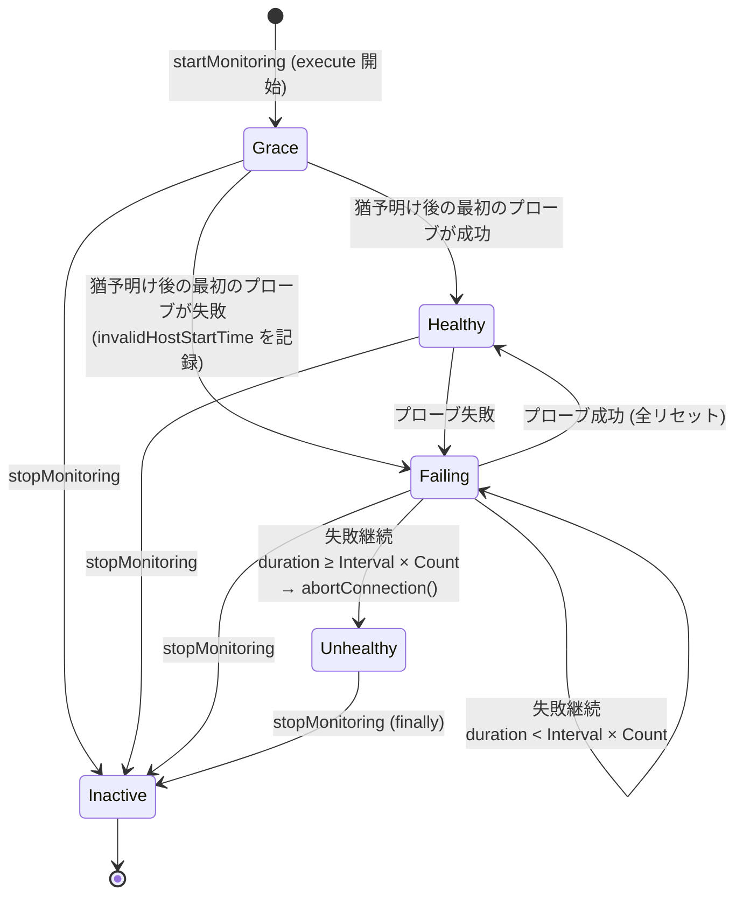

## 何を学んだか

EFM の 3 つのパラメータは、`ConnectionContextImpl` という **1 回のメソッド呼び出しごとに作られる状態機械**を動かす。

- `failureDetectionTime` (既定 30,000 ms) は**猶予時間**。クエリ開始からこの時間が経つまでは、プローブ結果を捨てる
- `failureDetectionInterval` (既定 5,000 ms) は**プローブ間隔**。猶予が明けた後、監視ループが次のプローブまで待つ時間
- `failureDetectionCount` (既定 3) は**回数ではなく乗数**。「応答なしが `Interval × Count` = 15 秒続いたら不健全」という時間の閾値を作る。失敗回数のカウンタは存在するが、判定には使われていない

docs は「カウンタが Count に達したら不健全」と説明しているが、コードは時間で判定している。プローブ 1 回にかかる時間が Interval より長いとき、この差が効いてくる。

## ソースコードのどこか

### ConnectionContext は 1 呼び出しにつき 1 つ

`efm2` プラグインの `execute` は、対象メソッドのたびに `startMonitoring` で context を作り、`finally` で `stopMonitoring` する ([`common/lib/plugins/efm/v2/host_monitoring2_connection_plugin.ts#L47`](https://github.com/aws/aws-advanced-nodejs-wrapper/blob/6d0ba1bdae81a4e1fd274b3569c5dc50cf0a7095/common/lib/plugins/efm/v2/host_monitoring2_connection_plugin.ts#L47))。

```ts title="common/lib/plugins/efm/v2/host_monitoring2_connection_plugin.ts"
try {
  logger.debug(Messages.get("HostMonitoringConnectionPlugin.activatedMonitoring", methodName));
  const monitoringHostInfo = await this.getMonitoringHostInfo();

  context = await this.monitorService.startMonitoring(
    this.pluginService.getCurrentClient().targetClient,
    monitoringHostInfo,
    this.properties,
    failureDetectionTimeMillis,
    failureDetectionIntervalMillis,
    failureDetectionCount,
  );

  result = await methodFunc();
} finally {
  if (context != null) {
    this.monitorService.stopMonitoring(context);
    logger.debug(Messages.get("HostMonitoringConnectionPlugin.monitoringDeactivated", methodName));
  }
}
```

対象になるのは `SubscribedMethodHelper.NETWORK_BOUND_METHODS` にあるメソッドだけである ([`common/lib/utils/subscribed_method_helper.ts#L18`](https://github.com/aws/aws-advanced-nodejs-wrapper/blob/6d0ba1bdae81a4e1fd274b3569c5dc50cf0a7095/common/lib/utils/subscribed_method_helper.ts#L18))。`query` / `execute` / `beginTransaction` / `commit` / `rollback` / `prepare` などで、`end` は含まれない。`failureDetectionEnabled: false` なら何もせず素通しになる。

### 状態を持つのは ConnectionContextImpl

[`common/lib/plugins/efm/base/connection_context.ts#L40`](https://github.com/aws/aws-advanced-nodejs-wrapper/blob/6d0ba1bdae81a4e1fd274b3569c5dc50cf0a7095/common/lib/plugins/efm/base/connection_context.ts#L40)。コンストラクタで猶予の終了時刻を確定させる。

```ts title="common/lib/plugins/efm/base/connection_context.ts"
this.connectionToAbortRef = new WeakRef(connectionToAbort);
this.failureDetectionTimeMillis = failureDetectionTimeMillis;
this.failureDetectionIntervalMillis = failureDetectionIntervalMillis;
this.failureDetectionCount = failureDetectionCount;
this.abortedConnectionsCounter = abortedConnectionsCounter;
this.startMonitorTimeNano = getCurrentTimeNano();
this.expectedActiveMonitoringStartTimeNano =
  this.startMonitorTimeNano + this.failureDetectionTimeMillis * 1_000_000;
```

`startMonitorTimeNano` は context 生成時刻、つまり `execute` に入った時刻である。猶予はクエリ開始から数える。監視ループが最初のプローブを打った時刻ではない。

### 猶予時間の間はプローブ結果を捨てる

監視ループはプローブのたびに `updateConnectionStatus` を呼ぶが、猶予の中なら何もしない ([`#L102`](https://github.com/aws/aws-advanced-nodejs-wrapper/blob/6d0ba1bdae81a4e1fd274b3569c5dc50cf0a7095/common/lib/plugins/efm/base/connection_context.ts#L102))。

```ts title="common/lib/plugins/efm/base/connection_context.ts"
async updateConnectionStatus(hostName: string, statusCheckStartTimeNano: number, statusCheckEndTimeNano: number, isValid: boolean): Promise<void> {
  if (!this._activeContext) {
    return;
  }

  const totalElapsedTimeNano = statusCheckEndTimeNano - this.startMonitorTimeNano;

  if (totalElapsedTimeNano > this.failureDetectionTimeMillis * 1_000_000) {
    await this.setConnectionValid(hostName, isValid, statusCheckStartTimeNano, statusCheckEndTimeNano);
  }
}
```

「捨てる」のであって「打たない」のではない。プローブそのものは monitor 側で発行済みで、結果を context が無視しているだけである。この区別は [HostMonitor](../host-monitor/) で効いてくる。

### 判定は時間で行う

[`#L114`](https://github.com/aws/aws-advanced-nodejs-wrapper/blob/6d0ba1bdae81a4e1fd274b3569c5dc50cf0a7095/common/lib/plugins/efm/base/connection_context.ts#L114)。

```ts title="common/lib/plugins/efm/base/connection_context.ts"
private async setConnectionValid(hostName, connectionValid, statusCheckStartNano, statusCheckEndNano): Promise<void> {
  if (!connectionValid) {
    this.failureCount++;

    if (this.invalidHostStartTimeNano === 0) {
      this.invalidHostStartTimeNano = statusCheckStartNano;
    }

    const invalidHostDurationNano = statusCheckEndNano - this.invalidHostStartTimeNano;
    const maxInvalidHostDurationNano = this.failureDetectionIntervalMillis * Math.max(0, this.failureDetectionCount) * 1_000_000;

    if (invalidHostDurationNano >= maxInvalidHostDurationNano) {
      logger.debug(Messages.get("MonitorConnectionContext.hostDead", hostName));
      this._hostUnhealthy = true;
      await this.abortConnection();
      return;
    }

    logger.debug(Messages.get("MonitorConnectionContext.hostNotResponding", hostName));
    return;
  }

  this.failureCount = 0;
  this.invalidHostStartTimeNano = 0;
  this._hostUnhealthy = false;

  logger.debug(Messages.get("MonitorConnectionContext.hostAlive", hostName));
}
```

`failureCount` はインクリメントとリセットしかされない。判定に使われるのは `invalidHostDurationNano >= Interval × Count` である。最初に失敗したプローブの**開始時刻**から、今回のプローブの**終了時刻**までが閾値を超えたら不健全になる。1 回でも成功すれば全部リセットされる。

`Math.max(0, count)` があるので、`failureDetectionCount: 0` にすると閾値が 0 になり、猶予明けの最初の失敗で即座に不健全になる。

### 状態遷移



`Grace` の間もプローブは打たれているが、結果は `updateConnectionStatus` の入口で捨てられる。`Inactive` は `setInactive()` で立ち、`updateConnectionStatus` も `abortConnection` も以後は何もしなくなる ([`#L83`](https://github.com/aws/aws-advanced-nodejs-wrapper/blob/6d0ba1bdae81a4e1fd274b3569c5dc50cf0a7095/common/lib/plugins/efm/base/connection_context.ts#L83))。

```ts title="common/lib/plugins/efm/base/connection_context.ts"
async abortConnection(): Promise<void> {
  const connectionToAbort = this.connectionToAbortRef.deref();
  if (connectionToAbort == null || !this._activeContext) {
    return;
  }

  try {
    await connectionToAbort.abort();
    this.abortedConnectionsCounter.inc();
  } catch (error: any) {
    // ignore
    logger.debug(Messages.get("MonitorConnectionContext.errorAbortingConnection", error.message));
  }
}
```

`abort` の先は `MySQLClientWrapper.abort()` → mysql2 の `destroy()` で、それが何をするかは [HostMonitor](../host-monitor/) に書く。

### パラメータ定義

[`common/lib/wrapper_property.ts#L533`](https://github.com/aws/aws-advanced-nodejs-wrapper/blob/6d0ba1bdae81a4e1fd274b3569c5dc50cf0a7095/common/lib/wrapper_property.ts#L533)。

| プロパティ                 | 既定       | 役割                                                               |
| -------------------------- | ---------- | ------------------------------------------------------------------ |
| `failureDetectionEnabled`  | `true`     | `false` なら `execute` は素通し                                    |
| `failureDetectionTime`     | 30,000 ms  | 猶予。クエリ開始からこの時間はプローブ結果を捨てる                 |
| `failureDetectionInterval` | 5,000 ms   | 猶予明け後のプローブ間隔 (monitor 側で使う)                        |
| `failureDetectionCount`    | 3          | `Interval × Count` の乗数                                          |
| `monitorDisposalTime`      | 600,000 ms | context がない状態がこの時間続いたら monitor を捨てる (monitor 側) |

`monitorDisposalTime` は docs の表では `60000` と書かれているが、コードの既定は `600000` (10 分) である ([`#L557`](https://github.com/aws/aws-advanced-nodejs-wrapper/blob/6d0ba1bdae81a4e1fd274b3569c5dc50cf0a7095/common/lib/wrapper_property.ts#L557))。docs のほうが古い。

## なぜそうなっているか

### 猶予時間が要る理由

プローブは `SELECT 1` 1 本とはいえ、ホストごとに 1 本の監視用接続を張り、そこに負荷を掛ける。**短いクエリを監視する意味は薄い**。1 秒で返るクエリのために 5 秒間隔のプローブを打っても、判定が出る前にクエリが終わる。

猶予時間は「この時間を超えて返ってこないクエリだけ本気で見る」という足切りで、既定の 30 秒は「大半のクエリはこれより短い」という想定から来ている。逆に、長いクエリを常時流すアプリで検知を早めたければ、猶予を短くする。性能テストの表 ([なぜ EFM が要るか](../why-efm/)) にある `6000 / 1000 / 1` はそういう設定の例で、docs は「攻めすぎると偽陽性が増える」と釘を刺している。

### 回数ではなく時間で判定する理由

プローブ 1 回の所要時間は一定ではない。ホストが死んでいるとき、プローブは `SELECT 1` のタイムアウト待ちと再接続のタイムアウト待ちを両方こなしてから「失敗」を返すので、監視用のタイムアウト設定次第で 1 回に数秒かかる ([HostMonitor](../host-monitor/))。

回数で数えると、「3 回失敗」に要する実時間が設定によって大きく変わる。時間で切れば、「応答なしが 15 秒続いた」という意味が設定によらず保たれる。監視ループの側も「プローブにかかった時間を次の待ち時間から引く」ことで同じ考えを貫いている。

このコードの以前の版 (efm2 の初期実装、PR #415 の修正) では `failureCount >= failureDetectionCount || duration >= max` と両方を見ていた。3.0.0 でモニタ基盤が書き直された際に時間だけになり、`failureCount` は残骸として残っている。docs の「counter reaches the failureDetectionCount」という説明はその頃のままである。

### WeakRef で接続を持つ理由

`connectionToAbortRef` は `WeakRef<ClientWrapper>` である。context は monitor の `contexts` 配列に入り、非アクティブになった後も次のループまで残る。強参照にすると、アプリが `end()` して捨てたはずの mysql2 接続オブジェクトが monitor 側から掴まれたままになる。GC 済みなら `deref()` が `undefined` を返し、abort は静かに何もしない。「もう誰も使っていない接続を切る」ことに意味はないので、これで正しい。

## どう活かすか

- **「猶予時間 + 閾値」の 2 段構えは、コストのある監視に共通の形。** 短命な処理まで監視すると監視自体が負荷になる。まず足切りし、その後だけ本気で見る
- **失敗判定は回数より継続時間で書く。** 1 回の試行時間が可変なら、回数は実時間の意味を持たない。タイムアウト付きのリトライを数えるときは特にそうなる
- **設定値の単位を docs で確認せず、コードの既定を読む。** `monitorDisposalTime` のように docs と 10 倍ずれていることがある。既定値は `WrapperProperties` の定義が正
- **監視対象への参照は弱く持つ。** 監視側のデータ構造が対象の寿命を伸ばしてはいけない

### 実務で踏む失敗パターン

- **`failureDetectionTime` を 30 秒のままにして「検知が遅い」と感じる。** 猶予はクエリ開始から数える。クエリ開始 5 秒後に障害が起きれば、検知は 25 秒 + 15 秒後になる。常時長いクエリを流すなら猶予を縮める
- **`failureDetectionCount` を増やして「3 回連続失敗」の意味で使う。** 実際は `Interval × Count` 秒の継続時間である。監視用タイムアウトが長いと、その時間内のプローブは 1〜2 回しか打たれない
- **`failureDetectionCount: 0` で最初の失敗で切れる。** 閾値が 0 になる。ネットワークの瞬断で即座に切られるので、意図して使うなら Interval も短くして偽陽性を見込む
