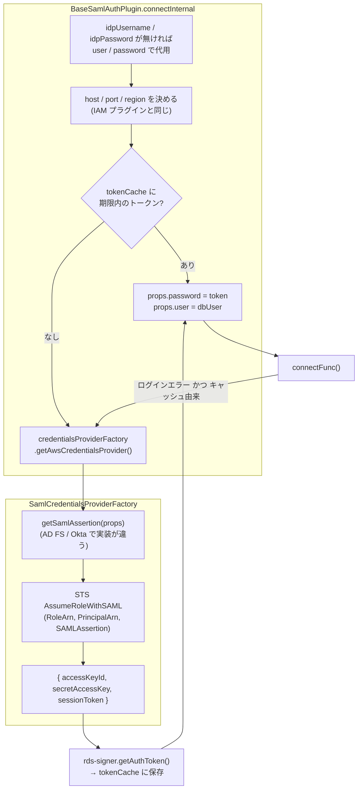

## 何を学んだか

`federatedAuth` (AD FS) と `okta` は、[IAM 認証プラグイン](../iam-plugin/) の**前段を 2 つ足したもの**である。

1. IdP のサインイン画面を HTTP で叩き、HTML から SAML assertion を抜く
2. その assertion で STS の `AssumeRoleWithSAML` を呼び、一時的な AWS クレデンシャルを得る
3. そのクレデンシャルで `@aws-sdk/rds-signer` を動かし、IAM トークンを作る

3 段目以降は IAM プラグインと同じで、トークンキャッシュも、ログイン失敗時の 1 回だけの作り直しも同じ形で書かれている。2 プラグインの本体はどちらも 26 行で、`BaseSamlAuthPlugin` に `CredentialsProviderFactory` を渡すだけ。違いは 1・2 段目を担う `AdfsCredentialsProviderFactory` (270 行) と `OktaCredentialsProviderFactory` (130 行) にある。

つまり、この 2 プラグインで読むべきは「IdP からどうやって SAML assertion を取るか」だけである。それは API ではなく、**ブラウザの代わりに HTML フォームを POST するスクレイピング**で実現されている。

## ソースコードのどこか



### `BaseSamlAuthPlugin` — IAM プラグインとの差分だけ読む

[`saml_auth_plugin.ts#L83`](https://github.com/aws/aws-advanced-nodejs-wrapper/blob/6d0ba1bdae81a4e1fd274b3569c5dc50cf0a7095/common/lib/plugins/federated_auth/saml_auth_plugin.ts#L83)。

```ts title="common/lib/plugins/federated_auth/saml_auth_plugin.ts"
async connectInternal(hostInfo: HostInfo, props: Map<string, any>, connectFunc: () => Promise<ClientWrapper>): Promise<ClientWrapper> {
  SamlUtils.checkIdpCredentialsWithFallback(props);

  const host = this.iamAuthUtils.getIamHost(props, hostInfo);
  const port = this.iamAuthUtils.getIamPort(props, hostInfo, this.pluginService.getDialect().getDefaultPort());

  const type: RdsUrlType = this.rdsUtils.identifyRdsType(host.host);

  let credentialsProvider: AwsCredentialIdentity | AwsCredentialIdentityProvider | undefined = undefined;
  if (type === RdsUrlType.RDS_GLOBAL_WRITER_CLUSTER) {
    credentialsProvider = await this.credentialsProviderFactory.getAwsCredentialsProvider(hostInfo.host, null, props);
  }

  this.regionUtils = type == RdsUrlType.RDS_GLOBAL_WRITER_CLUSTER ? new GlobalDbRegionUtils(credentialsProvider) : new RegionUtils();
  const region: string | null = await this.regionUtils.getRegion(WrapperProperties.IAM_REGION.name, host, props);
  // ...
  const cacheKey = this.iamAuthUtils.getCacheKey(port, WrapperProperties.DB_USER.get(props), host.host, region);
  const tokenInfo = this.tokenCacheInstance.get(cacheKey);
  const isCachedToken: boolean = tokenInfo !== undefined && !tokenInfo.isExpired();

  if (isCachedToken && tokenInfo) {
    WrapperProperties.PASSWORD.set(props, tokenInfo.token);
  } else {
    await this.updateAuthenticationToken(hostInfo, props, region, cacheKey, host.host, credentialsProvider);
  }
  WrapperProperties.USER.set(props, WrapperProperties.DB_USER.get(props));
  this.pluginService.updateConfigWithProperties(props);

  try {
    return await connectFunc();
  } catch (e: any) {
    if (!this.pluginService.isLoginError(e as Error) || !isCachedToken) {
      throw e;
    }
    try {
      await this.updateAuthenticationToken(hostInfo, props, region, cacheKey, host.host, credentialsProvider);
      return await connectFunc();
    } catch (e: any) {
      throw new AwsWrapperError(Messages.get("SamlAuthPlugin.unhandledError", e.message));
    }
  }
}
```

IAM プラグインと違う行は 4 つある。

- **`checkIdpCredentialsWithFallback`** ([`saml_utils.ts#L24`](https://github.com/aws/aws-advanced-nodejs-wrapper/blob/6d0ba1bdae81a4e1fd274b3569c5dc50cf0a7095/common/lib/utils/saml_utils.ts#L24))。`idpUsername` / `idpPassword` が無ければ `user` / `password` を IdP の資格情報として使う。**ここでの `user` は DB ユーザではなく IdP のユーザ**である
- **トークンのユーザは `dbUser`。** キャッシュキーも署名も `DB_USER` で作り、最後に `props.user` を `dbUser` で上書きする。`user` (IdP) と `dbUser` (DB) が別のプロパティなのはこのため
- **port の既定は `getDialect().getDefaultPort()`。** IAM プラグインの `getCurrentClient().defaultPort` (常に -1) と違い、こちらは Dialect の 3306 を返す
- **再試行の失敗は `SamlAuthPlugin.unhandledError` に包む。** IAM プラグインはそのまま投げる

Global Database のときは region を決める前に `getAwsCredentialsProvider` を呼んでいる。`GlobalDbRegionUtils` が `DescribeGlobalClusters` を叩くのに AWS クレデンシャルが要り、それが SAML 経由でしか得られないからである。

### `updateAuthenticationToken` — 毎回 SAML からやり直す

[`#L132`](https://github.com/aws/aws-advanced-nodejs-wrapper/blob/6d0ba1bdae81a4e1fd274b3569c5dc50cf0a7095/common/lib/plugins/federated_auth/saml_auth_plugin.ts#L132)。

```ts title="common/lib/plugins/federated_auth/saml_auth_plugin.ts"
const token = await this.iamAuthUtils.generateAuthenticationToken(
  iamHost,
  port,
  region,
  WrapperProperties.DB_USER.get(props),
  credentials ??
    (await this.credentialsProviderFactory.getAwsCredentialsProvider(hostInfo.host, region, props)),
  this.pluginService,
);
```

`credentials` が渡されるのは Global Database の経路だけで、通常は `getAwsCredentialsProvider` をここで呼ぶ。つまり**トークンを作り直すたびに、IdP へのサインインと STS の呼び出しが走る**。STS の一時クレデンシャル (既定 1 時間有効) はどこにもキャッシュされない。トークンキャッシュが 15 分なので、15 分ごとに IdP へログインすることになる。

### `SamlCredentialsProviderFactory` — STS の共通部分

[`saml_credentials_provider_factory.ts#L25`](https://github.com/aws/aws-advanced-nodejs-wrapper/blob/6d0ba1bdae81a4e1fd274b3569c5dc50cf0a7095/common/lib/plugins/federated_auth/saml_credentials_provider_factory.ts#L25)。

```ts title="common/lib/plugins/federated_auth/saml_credentials_provider_factory.ts"
async getAwsCredentialsProvider(host: string, region: string | null, props: Map<string, any>) {
  const samlAssertion = await this.getSamlAssertion(props);
  const assumeRoleWithSamlRequest = new AssumeRoleWithSAMLCommand({
    SAMLAssertion: decode(samlAssertion),
    RoleArn: WrapperProperties.IAM_ROLE_ARN.get(props),
    PrincipalArn: WrapperProperties.IAM_IDP_ARN.get(props)
  });

  const stsClient = region !== null ? new STSClient({ region }) : new STSClient();

  const results = await stsClient.send(assumeRoleWithSamlRequest);
  const credentials = results["Credentials"];

  if (credentials && credentials.AccessKeyId && credentials.SecretAccessKey && credentials.SessionToken) {
    return { accessKeyId: credentials.AccessKeyId, secretAccessKey: credentials.SecretAccessKey, sessionToken: credentials.SessionToken };
  }
  throw new AwsWrapperError("Credentials from SAML request not found");
}

abstract getSamlAssertion(props: Map<string, any>): Promise<string>;
```

`decode` は `entities` パッケージで、HTML から抜いた assertion の `&#43;` などを元に戻す。`AssumeRoleWithSAML` は署名不要の API なので `STSClient` にクレデンシャルは渡していない。返るのは provider 関数ではなく**静的なクレデンシャルの値**で、期限が来ても自動更新されない。次のトークン生成時にまた `getSamlAssertion` からやり直すので、それで困らない。

### AD FS — IdP-initiated sign-on のフォームを埋める

[`adfs_credentials_provider_factory.ts#L46`](https://github.com/aws/aws-advanced-nodejs-wrapper/blob/6d0ba1bdae81a4e1fd274b3569c5dc50cf0a7095/common/lib/plugins/federated_auth/adfs_credentials_provider_factory.ts#L46)。

```ts title="common/lib/plugins/federated_auth/adfs_credentials_provider_factory.ts"
async getSamlAssertion(props: Map<string, any>): Promise<string> {
  // ...
  let uri = this.getSignInPageUrl(props);
  const signInPageBody: string = await this.getSignInPageBody(uri, props);
  const action = this.getFormActionHtmlBody(signInPageBody);
  if (action && action.startsWith("/")) {
    uri = this.getFormActionUrl(props, action);
  }
  const params = this.getParametersFromHtmlBody(signInPageBody, props);
  const content = await this.getFormActionBody(uri, params, props);

  const match = content.match(AdfsCredentialsProviderFactory.SAML_RESPONSE_PATTERN);
  if (!match) {
    throw new AwsWrapperError(Messages.get("AdfsCredentialsProviderFactory.failedLogin", content));
  }
  return match[1];
}
```

4 ステップである。

1. **サインイン画面を GET。** URL は [`#L80`](https://github.com/aws/aws-advanced-nodejs-wrapper/blob/6d0ba1bdae81a4e1fd274b3569c5dc50cf0a7095/common/lib/plugins/federated_auth/adfs_credentials_provider_factory.ts#L80) の `https://<idpEndpoint>:<idpPort>/adfs/ls/IdpInitiatedSignOn.aspx?loginToRp=<rpIdentifier>`。`rpIdentifier` の既定 `urn:amazon:webservices` は AWS が SAML の relying party として登録する識別子
2. **HTML の `<input>` を全部拾ってフォームパラメータにする。** [`#L190`](https://github.com/aws/aws-advanced-nodejs-wrapper/blob/6d0ba1bdae81a4e1fd274b3569c5dc50cf0a7095/common/lib/plugins/federated_auth/adfs_credentials_provider_factory.ts#L190) で、`name` に `username` を含む input には `idpUsername`、`password` を含む input には `idpPassword`、それ以外は HTML にあった `value` をそのまま入れる。hidden フィールド (ViewState 等) をそのまま送り返すための処理である
3. **フォームを POST し、3xx リダイレクトを追う。** [`#L108`](https://github.com/aws/aws-advanced-nodejs-wrapper/blob/6d0ba1bdae81a4e1fd274b3569c5dc50cf0a7095/common/lib/plugins/federated_auth/adfs_credentials_provider_factory.ts#L108)。`maxRedirects: 0` で POST し、axios が 3xx を例外として返すのを捕まえて `location` を GET する。Cookie は `tough-cookie` の `CookieJar` と `http-cookie-agent` で持ち回る。AD FS はログイン成功をセッション Cookie + リダイレクトで表すので、これが要る
4. **レスポンスの HTML から `SAMLResponse` を正規表現で抜く。** `SAMLResponse\W+value="(?<saml>[^"]+)"`

`SamlUtils.validateUrl` ([`saml_utils.ts#L33`](https://github.com/aws/aws-advanced-nodejs-wrapper/blob/6d0ba1bdae81a4e1fd274b3569c5dc50cf0a7095/common/lib/utils/saml_utils.ts#L33)) が各 URL を `https://` 始まりに限定する。`idpEndpoint` にスキームが無ければ `formatIdpEndpoint` が `https://` を足す。`http://` を書いても `https://http://...` になって弾かれるので、平文 HTTP で IdP に資格情報を送る経路は無い。

### Okta — 2 リクエストの API

[`okta_credentials_provider_factory.ts#L89`](https://github.com/aws/aws-advanced-nodejs-wrapper/blob/6d0ba1bdae81a4e1fd274b3569c5dc50cf0a7095/common/lib/plugins/federated_auth/okta_credentials_provider_factory.ts#L89)。

```ts title="common/lib/plugins/federated_auth/okta_credentials_provider_factory.ts"
async getSamlAssertion(props: Map<string, any>): Promise<string> {
  // ...
  const oneTimeToken = await this.getSessionToken(props);
  const uri = this.getSamlUrl(props);
  // GET uri?onetimetoken=<oneTimeToken>
  const data: string = resp.data;
  const match = data.match(OktaCredentialsProviderFactory.SAML_RESPONSE_PATTERN);
  if (!match) {
    throw new AwsWrapperError(Messages.get("OktaCredentialsProviderFactory.invalidSamlResponse"));
  }
  return match[1];
}
```

Okta には認証 API があるので、AD FS よりずっと短い。

1. `POST https://<idpEndpoint>/api/v1/authn` に `{ username, password }` を JSON で送り、`sessionToken` を受け取る ([`#L51`](https://github.com/aws/aws-advanced-nodejs-wrapper/blob/6d0ba1bdae81a4e1fd274b3569c5dc50cf0a7095/common/lib/plugins/federated_auth/okta_credentials_provider_factory.ts#L51))
2. `GET https://<idpEndpoint>/app/amazon_aws/<appId>/sso/saml?onetimetoken=<sessionToken>` で SAML の HTML を受け取り、`SAMLResponse` を正規表現で抜く ([`#L43`](https://github.com/aws/aws-advanced-nodejs-wrapper/blob/6d0ba1bdae81a4e1fd274b3569c5dc50cf0a7095/common/lib/plugins/federated_auth/okta_credentials_provider_factory.ts#L43))

`amazon_aws` は Okta の AWS Account Federation アプリの固定名で、`appId` は Okta 側で払い出される ID。Cookie は要らないので `tough-cookie` 系の依存も無く、docs の Prerequisites が AD FS より短いのはこのためである。

### 依存関係は全部 optional peerDependency

[`federated_auth_plugin_factory.ts#L30`](https://github.com/aws/aws-advanced-nodejs-wrapper/blob/6d0ba1bdae81a4e1fd274b3569c5dc50cf0a7095/common/lib/plugins/federated_auth/federated_auth_plugin_factory.ts#L30) はプラグイン本体と `AdfsCredentialsProviderFactory` を別々に `await import()` する。`axios` / `axios-cookiejar-support` / `http-cookie-agent` / `tough-cookie` / `entities` / `@aws-sdk/client-sts` はどれも `peerDependenciesMeta` で `optional: true` になっていて、CHANGELOG 3.0.0 の Breaking Changes で「`http-cookie-agent` と `tough-cookie` は `dependencies` から外した、使うアプリが自分で入れる」と宣言された。

`httpsAgentOptions` はそのまま `https.Agent` (Okta) / `HttpsCookieAgent` (AD FS) のオプションに渡る。サンプルにコメントアウトされている `rejectUnauthorized: false` は、社内 IdP の自己署名証明書を通すためのもので、本番では使わないと注記されている。

## なぜそうなっているか

### なぜ HTML スクレイピングなのか

AD FS には「ユーザ名とパスワードを渡して SAML assertion を返す」API が無い。あるのはブラウザ向けのサインイン画面だけである。だからブラウザがやることを再現する。GET で画面を取り、hidden を含む全 input を送り返し、Cookie を持ち回ってリダイレクトを追う。

JDBC ラッパ (aws-advanced-jdbc-wrapper) にも同名の `AdfsCredentialsProviderFactory` があり、この Node.js 版はその設計を引き継いでいる。AD FS の画面構造が変わればどちらも壊れる、という脆さを共有している。

### なぜ STS のクレデンシャルをキャッシュしないのか

キャッシュするならトークンとは別のキーと期限が要り、IdP への往復を減らせる代わりに状態が 1 つ増える。トークンキャッシュが 15 分で、IdP へのログインが 15 分に 1 回なら、多くの環境では許容できる。「一番単純な形で動くもの」を選んだ結果に見える。IdP のログイン回数を減らしたければ `iamTokenExpiration` を伸ばすしかないが、トークン自体は 15 分で切れるので、伸ばしても意味が無い ([IAM 認証プラグイン](../iam-plugin/))。

### なぜ `user` を IdP 資格情報の代用にするのか

`idpUsername` を必須にせず `user` で代用できるのは、既存の `user` / `password` 設定をそのまま IdP 向けに流用できるようにするためである。その代償として、このプラグインでは **`user` が DB ユーザではなくなる**。DB ユーザは `dbUser` で別に指定し、プラグインが最後に `props.user` を `dbUser` で上書きする。設定を読む側がこれを知らないと「`user` に DB ユーザを書いたのに IdP に送られた」という事故になる。

## どう活かすか

- **共通部分を基底クラスに、差分を差し込み可能な 1 インタフェースに分ける。** `BaseSamlAuthPlugin` + `CredentialsProviderFactory` で、IdP を増やすときは `getSamlAssertion` を 1 つ書けば済む。2 つのプラグイン本体が 26 行ずつなのがその証拠
- **API の無い相手をスクレイピングするときは、hidden フィールドを全部送り返す。** 自分が知っているフィールドだけ送ると、サーバ側の状態トークン (ViewState 等) が欠けて弾かれる
- **平文 HTTP の経路を最初から作らない。** `validateUrl` で `https://` 以外を弾き、`formatIdpEndpoint` でスキームを補う。オプションで許可する余地を残さないほうが、設定ミスで資格情報が漏れる経路が無くなる
- **重い依存は optional peerDependency + 遅延 import にする。** `axios` や `tough-cookie` を使わないアプリにインストールさせない

### 実務で踏む失敗パターン

- **`user` に DB ユーザを書く。** IdP に送られてログインに失敗する。DB ユーザは `dbUser`、IdP は `idpUsername` / `idpPassword`
- **MFA が有効な IdP。** AD FS のフォーム埋めは username / password しか入れない。Okta の `/api/v1/authn` は MFA 要求時に `sessionToken` を返さず、`invalidSessionToken` で落ちる。サービスアカウントで MFA を外すか、別の認証方式にする
- **AD FS の画面カスタマイズ。** input の `name` に `username` / `password` を含まないテーマだと、資格情報がフォームに入らない。`failedLogin` のエラーに HTML 本文が丸ごと入るので、そこで確認する
- **15 分ごとに IdP のログイン監査ログが増える。** トークン再生成のたびに IdP へログインする。IdP 側のレート制限やアラートに引っかかることがある
- **MySQL で `ssl` を付けない。** `federatedAuth` / `okta` も `TOKEN_AUTH_PLUGIN_CODES` に入っているので、IAM と同じ cleartext の制約を受ける ([MySQL で IAM を使うと cleartext になる](../iam-cleartext-on-mysql/))
- **3.0.0 に上げたら `Cannot find module 'tough-cookie'`。** 依存が optional になった。アプリの `package.json` に足す
