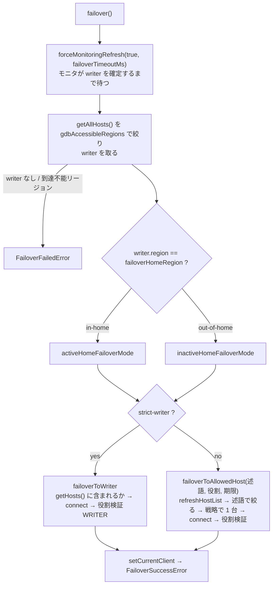

## 何を学んだか

`gdbFailover` は [failover2](../failover2-writer/) の `failover()` を丸ごと差し替えたプラグインで、追加したのは **home region** という概念だけである。

- アプリが動くリージョンを `failoverHomeRegion` として持つ
- フェイルオーバー時、新しい writer のリージョンが home と同じなら **in-home**、違えば **out-of-home**
- それぞれに別の failover mode (`activeHomeFailoverMode` / `inactiveHomeFailoverMode`) を設定できる

典型的な使い方は docs の例 3 で、「in-home なら writer に追従、out-of-home なら reader に落ちてこのリージョンのアプリは書き込みをやめる」である。writer が別リージョンに移ったとき、リージョン間の遅延を抱えて書き込みを続けるか、そのリージョンのアプリに譲るかを、ドライバの設定で選べる。

モードは 7 つあるが、実体は「候補ホストを絞る述語」と「役割を検証するか」の組み合わせで、writer 以外は 1 本の再試行ループを共有する。

## ソースコードのどこか

[`common/lib/plugins/global_db_failover/global_db_failover_plugin.ts`](https://github.com/aws/aws-advanced-nodejs-wrapper/blob/6d0ba1bdae81a4e1fd274b3569c5dc50cf0a7095/common/lib/plugins/global_db_failover/global_db_failover_plugin.ts) (410 行)。weight は 720 で、`failover` (700) / `failover2` (710) と排他 ([互換性表](../compatibility-matrix/))。

### 7 つのモード

[`global_db_failover_mode.ts#L17`](https://github.com/aws/aws-advanced-nodejs-wrapper/blob/6d0ba1bdae81a4e1fd274b3569c5dc50cf0a7095/common/lib/plugins/global_db_failover/global_db_failover_mode.ts#L17)。

| モード                         | 候補                           | 役割検証 |
| ------------------------------ | ------------------------------ | -------- |
| `strict-writer`                | トポロジの writer 1 台         | WRITER   |
| `strict-home-reader`           | home region の reader          | READER   |
| `strict-out-of-home-reader`    | home 以外の reader             | READER   |
| `strict-any-reader`            | 全 reader                      | READER   |
| `home-reader-or-writer`        | writer + home region の reader | なし     |
| `out-of-home-reader-or-writer` | writer + home 以外の reader    | なし     |
| `any-reader-or-writer`         | 全ホスト                       | なし     |

`failoverMode` ([failoverMode と URL からの既定値](../failover-mode/)) の 3 値に「home / out-of-home / any」の軸を掛けた形になっている。

### initFailoverMode — home region と既定値

[`#L47`](https://github.com/aws/aws-advanced-nodejs-wrapper/blob/6d0ba1bdae81a4e1fd274b3569c5dc50cf0a7095/common/lib/plugins/global_db_failover/global_db_failover_plugin.ts#L47)。

```ts title="common/lib/plugins/global_db_failover/global_db_failover_plugin.ts"
this.rdsUrlType = this.rdsHelper.identifyRdsType(initialHostInfo.host);

this.homeRegion = WrapperProperties.FAILOVER_HOME_REGION.get(this.properties) ?? null;
if (!this.homeRegion) {
  if (!this.rdsUrlType.hasRegion) {
    throw new AwsWrapperError(Messages.get("GlobalDbFailoverPlugin.missingHomeRegion"));
  }
  this.homeRegion = this.rdsHelper.getRdsRegion(initialHostInfo.host);
  // ...
}

if (this.activeHomeFailoverMode === GlobalDbFailoverMode.UNKNOWN) {
  switch (this.rdsUrlType) {
    case RdsUrlType.RDS_WRITER_CLUSTER:
    case RdsUrlType.RDS_GLOBAL_WRITER_CLUSTER:
      this.activeHomeFailoverMode = GlobalDbFailoverMode.STRICT_WRITER;
      break;
    default:
      this.activeHomeFailoverMode = GlobalDbFailoverMode.HOME_READER_OR_WRITER;
  }
}
// inactiveHomeFailoverMode も同じ既定

this.accessibleRegions = AccessibleRegions.parse(this.properties);
if (this.accessibleRegions) {
  // The home region must be reachable. If it is excluded from the accessible regions, failover
  // candidate filtering would always drop it, so fail loudly at configuration time.
  if (this.homeRegion && !this.accessibleRegions.includes(this.homeRegion.toLowerCase())) {
    throw new AwsWrapperError(
      Messages.get(
        "GlobalDb.homeRegionNotAccessible",
        this.homeRegion,
        this.accessibleRegions.join(","),
      ),
    );
  }
}
```

home region の既定は初期ホストの DNS のリージョンである。[global エンドポイント](../global-database/)は `hasRegion: false` なので、そこに繋ぐなら `failoverHomeRegion` が必須になる。モードの既定は writer 系エンドポイントなら両方 `strict-writer`、それ以外は両方 `home-reader-or-writer` で、in-home と out-of-home で違う既定にはならない。

### failover — writer のリージョンでモードを選ぶ

[`#L115`](https://github.com/aws/aws-advanced-nodejs-wrapper/blob/6d0ba1bdae81a4e1fd274b3569c5dc50cf0a7095/common/lib/plugins/global_db_failover/global_db_failover_plugin.ts#L115)。

```ts title="common/lib/plugins/global_db_failover/global_db_failover_plugin.ts"
const refreshResult = await this.pluginService.forceMonitoringRefresh(
  true,
  this.failoverTimeoutSettingMs,
);
if (!refreshResult) {
  throw new FailoverFailedError(Messages.get("Failover.unableToRefreshHostList"));
}

const allHosts = this.pluginService.getAllHosts();
const updatedHosts = await this.filterByAccessibleRegions(allHosts);
const writerCandidate = getWriter(updatedHosts);
if (!writerCandidate) {
  throw new FailoverFailedError(message);
}
if (
  this.accessibleRegions &&
  !AccessibleRegions.isHostAccessible(writerCandidate, this.accessibleRegions)
) {
  throw new FailoverFailedError(
    Messages.get(
      "GlobalDbFailoverPlugin.writerInInaccessibleRegion",
      writerCandidate.host,
      writerRegion,
    ),
  );
}

const writerRegion = this.rdsHelper.getRdsRegion(writerCandidate.host);
const isHomeRegion = equalsIgnoreCase(this.homeRegion, writerRegion);
const currentFailoverMode = isHomeRegion
  ? this.activeHomeFailoverMode
  : this.inactiveHomeFailoverMode;

switch (currentFailoverMode) {
  case GlobalDbFailoverMode.STRICT_WRITER:
    await this.failoverToWriter(writerCandidate);
    break;
  case GlobalDbFailoverMode.STRICT_HOME_READER:
    await this.failoverToAllowedHost(
      () =>
        AccessibleRegions.filterHosts(this.pluginService.getHosts(), this.accessibleRegions).filter(
          (x) => x.role === HostRole.READER && this.isHostInHomeRegion(x),
        ),
      HostRole.READER,
      failoverEndTimeNs,
    );
    break;
  // ...残り 5 モードも「述語 + 検証役割」を渡すだけ
}
this.throwFailoverSuccessException();
```



writer の探索自体は failover2 と同じで、`forceMonitoringRefresh(true, ...)` で[トポロジモニタ](../am-i-a-writer/)に「writer が確定するまで」待たせる。違いは、確定した writer のリージョンで**その後の振る舞いを分岐する**点だけである。

### failoverToWriter — 候補が許可ホストに含まれるか

[`#L252`](https://github.com/aws/aws-advanced-nodejs-wrapper/blob/6d0ba1bdae81a4e1fd274b3569c5dc50cf0a7095/common/lib/plugins/global_db_failover/global_db_failover_plugin.ts#L252)。

```ts title="common/lib/plugins/global_db_failover/global_db_failover_plugin.ts"
const allowedHosts = this.pluginService.getHosts();
if (!containsHostAndPort(allowedHosts, writerCandidate.hostAndPort)) {
  throw new FailoverFailedError(
    Messages.get("Failover.newWriterNotAllowed", writerCandidate.url, topologyString),
  );
}
writerCandidateConn = await this.pluginService.connect(writerCandidate, this.properties, this);
const role = await this.pluginService.getHostRole(writerCandidateConn);
if (role !== HostRole.WRITER) {
  await writerCandidateConn?.abort();
  throw new FailoverFailedError(
    Messages.get("Failover.unexpectedReaderRole", writerCandidate.host, role),
  );
}
await this.pluginService.setCurrentClient(writerCandidateConn, writerCandidate);
```

writer は `getAllHosts()` から探すが、繋ぐ前に `getHosts()` (許可・拒否フィルタ済み) に含まれるかを確認する。[customEndpoint](../custom-endpoint/) で writer がメンバー外なら、ここで `newWriterNotAllowed` になる。接続後に `@@innodb_read_only` で役割を検証するのは failover2 と同じである。

### failoverToAllowedHost — 期限まで回す共通ループ

[`#L333`](https://github.com/aws/aws-advanced-nodejs-wrapper/blob/6d0ba1bdae81a4e1fd274b3569c5dc50cf0a7095/common/lib/plugins/global_db_failover/global_db_failover_plugin.ts#L333)。

```ts title="common/lib/plugins/global_db_failover/global_db_failover_plugin.ts"
do {
  await this.pluginService.refreshHostList();
  let updatedAllowedHosts = getAllowedHosts();
  updatedAllowedHosts = updatedAllowedHosts.map((x) => /* availability を AVAILABLE に */);
  const remainingAllowedHosts = [...updatedAllowedHosts];
  if (remainingAllowedHosts.length === 0) {
    await sleep(100);
    continue;
  }

  while (remainingAllowedHosts.length > 0 && getTimeInNanos() < failoverEndTimeNs) {
    let candidateHost: HostInfo | undefined;
    try {
      candidateHost = this.pluginService.getHostInfoByStrategy(verifyRole, this.failoverReaderHostSelectorStrategy, remainingAllowedHosts);
    } catch { /* 戦略が候補を返せない */ }
    if (!candidateHost) {
      await sleep(100);
      break;
    }
    try {
      candidateConn = await this.pluginService.connect(candidateHost, this.properties, this);
      const role = verifyRole === null ? null : await this.pluginService.getHostRole(candidateConn);
      if (verifyRole === null || verifyRole === role) {
        return new ReaderFailoverResult(candidateConn, updatedHostSpec, true);
      }
      // 役割が違う: 候補から外して次へ
      remainingAllowedHosts.splice(index, 1);
      await candidateConn.abort();
    } catch {
      remainingAllowedHosts.splice(index, 1);
      if (candidateConn) await candidateConn.abort();
    }
  }
} while (getTimeInNanos() < failoverEndTimeNs);

throw new AwsTimeoutError(Messages.get("Failover.failoverReaderTimeout"));
```

外側の `do-while` が期限 (`failoverTimeoutMs`) まで回り、内側で候補を 1 台ずつ試す。**外側の周回ごとに `refreshHostList()` して候補を作り直す**ので、[failover2 の reader 探索](../failover2-reader/)にあった「2 周目以降は候補が減ったまま」という問題がここにはない。役割検証は `verifyRole` が `null` (`*-reader-or-writer` 系) ならスキップする。

## なぜそうなっているか

### なぜ「writer のリージョン」で分岐するのか

Global Database の切り替えは、primary リージョンが別のリージョンに移ることである。アプリのリージョンは固定なので、「writer が自分のリージョンにあるか」がリージョン間遅延の有無を決める。**遅延を許容して書き込みを続けるか、書き込みをやめて別リージョンのアプリに譲るか**はアプリの要件次第で、ドライバが決められない。だから 2 つのモードを外から与える形にしてある。

failover2 の `failoverMode` は「接続先の役割」しか表せない。in-home / out-of-home の軸がないと、「普段は writer、切り替わったら reader」が書けない。

### なぜ home region を global エンドポイントで省略できないのか

home region の既定は初期ホストの DNS のリージョンである。global エンドポイントには DNS にリージョンがなく、繋いだ先の writer のリージョンは切り替えで変わる。「最初に繋いだ writer のリージョン」を home にすると、アプリのリージョンではなく DB の都合で home が決まってしまう。設定を強制することで、home を「アプリがどこにいるか」の宣言にしている。

### なぜ accessibleRegions と home の衝突を初期化で弾くのか

コードのコメントに理由が書いてある。home が到達不能リージョンに入っていると、`filterHosts` が home のホストを常に落とすので、`strict-home-reader` は永遠に候補ゼロになる。フェイルオーバー時に 5 分待って失敗するより、初期化時に設定ミスとして落とすほうがよい。

## どう活かすか

- **切り替え後の振る舞いを「場所」で分ける。** in-home / out-of-home は、マルチリージョンのアプリが「自分が主か従か」を判断する最小の軸である。同じ構造は、DB に限らずリージョン間でフェイルオーバーする資源 (キャッシュ、キュー) にも当てはまる
- **モードは述語で表す。** 7 モードが `switch` の 7 分岐ではなく「候補を絞る関数 + 検証する役割」に還元されているので、モードを足しても共通ループは変わらない
- **設定間の矛盾は起動時に検出する。** home ∉ accessible のような「常に失敗する組み合わせ」は、実行時に待たせるより初期化で落とす

### つまずきどころ

- **`failover` / `failover2` と同時に使わない。** docs の警告どおりで、両方が `query` を購読してフェイルオーバーを二重に走らせる
- **既定モードは in-home と out-of-home で同じ。** 「切り替わったら reader に落ちる」は自動では起きない。`inactiveHomeFailoverMode` を明示する
- **reader エンドポイントで繋ぐと既定が `home-reader-or-writer`。** writer も候補に入り、役割検証もしないので、reader のつもりで writer に繋がることがある。reader 専用なら `strict-home-reader` を明示する
- **未知のモード文字列は `UNKNOWN` → 既定に置き換わる。** typo は例外にならず、既定モードで動く
- **failover2 から引き継ぐ問題は残る。** `_isInTransaction` が false に戻らない点 ([TransactionResolutionUnknownError](../transaction-resolution-unknown/)) や、`query` しか購読しないので `execute()` の失敗ではフェイルオーバーしない点 ([何をトリガとするか](../failover-triggers/)) は同じ
- **`globalClusterInstanceHostPatterns` は必須。** プラグインではなく [HostListProvider](../global-database/) が要求するので、`gdbFailover` を外しても必要である
