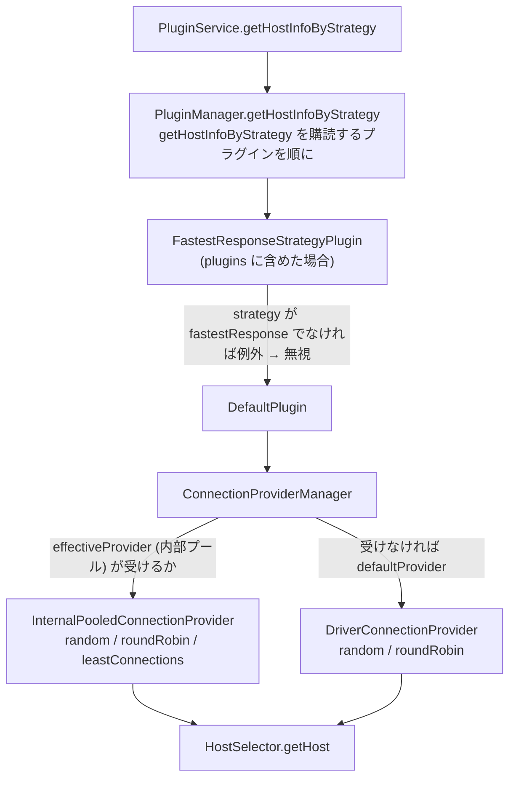

## 何を学んだか

トポロジが手に入った後、ラッパは 2 つの判断を繰り返す。「このホストは今使ってよいか」と「使ってよいホストのうちどれを選ぶか」である。前者が `HostAvailabilityStrategy`、後者が `HostSelector` で、どちらも差し替え可能になっている。

- **可用性戦略は 2 つ。** 既定の `simple` は生の値をそのまま返す。`exponentialBackoff` は `NOT_AVAILABLE` でも 30 秒・60 秒・120 秒...と待った後に `AVAILABLE` を返して再試行を促す
- **選択戦略は 4 つ。** `random` (既定)、`roundRobin` (重み付き)、`leastConnections` (内部プール限定)、`fastestResponse` (専用プラグインが要る)
- **選択戦略の解決は「聞いて回る」。** `PluginManager` が `getHostInfoByStrategy` を購読するプラグインに順に聞き、最後の `DefaultPlugin` が `ConnectionProvider` の持つ `HostSelector` 表を引く

mysql2 の `PoolCluster` にも `RR` / `RANDOM` / `ORDER` の 3 つの selector があるが、それは「登録済みノード ID の配列から 1 つ選ぶ」だけで、役割も可用性も見ない。

## ソースコードのどこか

### 可用性戦略

インタフェースは 2 メソッドである ([`common/lib/host_availability/host_availability_strategy.ts#L19`](https://github.com/aws/aws-advanced-nodejs-wrapper/blob/6d0ba1bdae81a4e1fd274b3569c5dc50cf0a7095/common/lib/host_availability/host_availability_strategy.ts#L19))。

```ts title="common/lib/host_availability/host_availability_strategy.ts"
export interface HostAvailabilityStrategy {
  setHostAvailability(hostAvailability: HostAvailability): void;
  getHostAvailability(rawHostAvailability: HostAvailability): HostAvailability;
}
```

`ExponentialBackoffHostAvailabilityStrategy` ([`exponential_backoff_host_availability_strategy.ts#L23`](https://github.com/aws/aws-advanced-nodejs-wrapper/blob/6d0ba1bdae81a4e1fd274b3569c5dc50cf0a7095/common/lib/host_availability/exponential_backoff_host_availability_strategy.ts#L23))。

```ts title="common/lib/host_availability/exponential_backoff_host_availability_strategy.ts"
export class ExponentialBackoffHostAvailabilityStrategy implements HostAvailabilityStrategy {
  public static NAME = "exponentialBackoff";
  private readonly maxRetries: number = 5;
  private readonly initialBackoffTimeSec: number = 30;
  private notAvailableCount: number = 0;
  private lastChanged: number;

  setHostAvailability(hostAvailability: HostAvailability): void {
    this.lastChanged = Date.now();
    if (hostAvailability === HostAvailability.AVAILABLE) {
      this.notAvailableCount = 0;
    } else {
      this.notAvailableCount++;
    }
  }

  getHostAvailability(rawHostAvailability: HostAvailability): HostAvailability {
    if (rawHostAvailability === HostAvailability.AVAILABLE) {
      return HostAvailability.AVAILABLE;
    }

    if (this.notAvailableCount >= this.maxRetries) {
      return HostAvailability.NOT_AVAILABLE;
    }

    const retryDelayMillis =
      Math.pow(2, this.notAvailableCount) * this.initialBackoffTimeSec * 1000;
    const earliestRetryMillis = this.lastChanged + retryDelayMillis;
    const nowMillis = Date.now();
    if (earliestRetryMillis < nowMillis) {
      return HostAvailability.AVAILABLE;
    }

    return rawHostAvailability;
  }
}
```

戦略は自分でヘルスチェックをしない。`NOT_AVAILABLE` が設定されるたびにカウンタを増やし、`2^count × 30 秒` 経ったら「試してよい」として `AVAILABLE` を返す。試して失敗すればまた `NOT_AVAILABLE` が設定されてカウンタが増え、5 回で永久に `NOT_AVAILABLE` になる。成功すれば `AVAILABLE` が設定されてカウンタが 0 に戻る。`docs/using-the-nodejs-wrapper/HostAvailabilityStrategy.md` はこれを「host availability consumers に health check をさせる」と説明している。

選択は `HostAvailabilityStrategyFactory` ([`host_availability_strategy_factory.ts#L22`](https://github.com/aws/aws-advanced-nodejs-wrapper/blob/6d0ba1bdae81a4e1fd274b3569c5dc50cf0a7095/common/lib/host_availability/host_availability_strategy_factory.ts#L22)) で、`defaultHostAvailabilityStrategy` が `exponentialBackoff` (大文字小文字不問) のときだけ切り替わる。設定は `hostAvailabilityStrategyMaxRetries` (5) と `hostAvailabilityStrategyInitialBackoffTimeSec` (30)。

### 戦略オブジェクトは誰のものか

`PluginService.getHostInfoBuilder` は呼ばれるたびに新しい戦略を作って builder に渡す ([`plugin_service.ts#L325`](https://github.com/aws/aws-advanced-nodejs-wrapper/blob/6d0ba1bdae81a4e1fd274b3569c5dc50cf0a7095/common/lib/plugin_service.ts#L325))。しかし `AuroraTopologyUtils` は Dialect が provider を作る時に builder を **1 回だけ**受け取り ([`aurora_mysql_database_dialect.ts#L50`](https://github.com/aws/aws-advanced-nodejs-wrapper/blob/6d0ba1bdae81a4e1fd274b3569c5dc50cf0a7095/mysql/lib/dialect/aurora_mysql_database_dialect.ts#L50))、`createHost` はその builder を使い回す ([`topology_utils.ts#L124`](https://github.com/aws/aws-advanced-nodejs-wrapper/blob/6d0ba1bdae81a4e1fd274b3569c5dc50cf0a7095/common/lib/host_list_provider/topology_utils.ts#L124))。builder の `build()` は自分の `hostAvailabilityStrategy` をそのまま `HostInfo` に渡すので、**1 つの provider が作る全 HostInfo が同じ戦略オブジェクトを共有する**。`notAvailableCount` はホストごとではなく provider ごとのカウンタになる。

さらに、[HostInfo と HostRole と可用性](../host-info/) で読んだとおり `PluginService.setAvailability` は `HostInfo.setAvailability` を呼ばず、`refreshHostList` もフィールドに直接代入する。戦略の `setHostAvailability` が呼ばれるのは `ClusterTopologyMonitor.updateHostsAvailability` と `HostMonitor` の writer 検出時だけである。failover や efm が `pluginService.setAvailability(host, NOT_AVAILABLE)` を呼んでもカウンタは動かず、`lastChanged` は戦略オブジェクトが作られた時刻のまま残る。`exponentialBackoff` を設定したときの実際の挙動は、docs が描く「ホストごとの指数バックオフ」とはずれている。

### 選択戦略 — 3 つの `HostSelector`

インタフェースは 1 メソッド ([`host_selector.ts#L20`](https://github.com/aws/aws-advanced-nodejs-wrapper/blob/6d0ba1bdae81a4e1fd274b3569c5dc50cf0a7095/common/lib/host_selector.ts#L20))。

```ts title="common/lib/host_selector.ts"
export interface HostSelector {
  getHost(hosts: HostInfo[], role: HostRole | null, props?: Map<string, any>): HostInfo;
}
```

`RandomHostSelector` ([`random_host_selector.ts#L24`](https://github.com/aws/aws-advanced-nodejs-wrapper/blob/6d0ba1bdae81a4e1fd274b3569c5dc50cf0a7095/common/lib/random_host_selector.ts#L24))。

```ts title="common/lib/random_host_selector.ts"
getHost(hosts: HostInfo[], role: HostRole, props?: Map<string, any>): HostInfo {
  const eligibleHosts = hosts.filter(
    (hostInfo: HostInfo) => (role === null || hostInfo.role === role) && hostInfo.getAvailability() === HostAvailability.AVAILABLE
  );
  if (eligibleHosts.length === 0) {
    throw new AwsWrapperError(Messages.get("HostSelector.noHostsMatchingRole", role));
  }

  const randomIndex = Math.floor(Math.random() * eligibleHosts.length);
  return eligibleHosts[randomIndex];
}
```

役割と可用性でふるいにかけて乱数で 1 つ。可用性は `getAvailability()` なので戦略を通る。

`RoundRobinHostSelector` ([`round_robin_host_selector.ts#L32`](https://github.com/aws/aws-advanced-nodejs-wrapper/blob/6d0ba1bdae81a4e1fd274b3569c5dc50cf0a7095/common/lib/round_robin_host_selector.ts#L32)) は 210 行ある。

```ts title="common/lib/round_robin_host_selector.ts"
getHost(hosts: HostInfo[], role: HostRole, props?: Map<string, any>): HostInfo {
  const eligibleHosts: HostInfo[] = hosts
    .filter((host: HostInfo) => (role === null || host.role === role) && host.availability === HostAvailability.AVAILABLE)
    .sort((hostA: HostInfo, hostB: HostInfo) => { /* ホスト名で昇順 */ });

  if (eligibleHosts.length === 0) {
    throw new AwsWrapperError(Messages.get("HostSelector.noHostsMatchingRole", role));
  }

  // Create new cache entries for provided hosts if necessary. All hosts point to the same cluster info.
  this.createCacheEntryForHosts(eligibleHosts, props);
  const currentClusterInfoKey = eligibleHosts[0].host;
  const clusterInfo = RoundRobinHostSelector.roundRobinCache.get(currentClusterInfoKey);

  const lastHost = clusterInfo.lastHost;
  let lastHostIndex = -1;
  if (lastHost) {
    lastHostIndex = eligibleHosts.findIndex((host: HostInfo) => host.host === lastHost.host);
  }

  let targetHostIndex: number;
  // If the host is weighted and the lastHost is in the eligibleHosts list.
  if (clusterInfo.weightCounter > 0 && lastHostIndex !== -1) {
    targetHostIndex = lastHostIndex;
  } else {
    if (lastHostIndex !== eligibleHosts.length - 1) {
      targetHostIndex = lastHostIndex + 1;
    } else {
      targetHostIndex = 0;
    }

    const weight = clusterInfo.clusterWeightsMap.get(eligibleHosts[targetHostIndex].hostId);
    clusterInfo.weightCounter = weight ?? clusterInfo.defaultWeight;
  }

  clusterInfo.weightCounter--;
  clusterInfo.lastHost = eligibleHosts[targetHostIndex];

  return eligibleHosts[targetHostIndex];
}
```

3 つの特徴がある。

1. **ホスト名でソートしてから巡回する。** トポロジの並び順に依存しない
2. **「前回どこまで回したか」は `static` な `CacheMap` に、全ホスト名をキーにして同じ `RoundRobinClusterInfo` を入れる。** クライアントをまたいで巡回位置を共有し、10 分で消える
3. **重みは `roundRobinHostWeightPairs` (`instance-1:1,instance-2:4`) と `roundRobinDefaultWeight` から。** `weightCounter` が残っている間は同じホストを返し続ける

可用性は生の `host.availability` を見ている。`random` と違って戦略を通らない。

`LeastConnectionsHostSelector` ([`least_connections_host_selector.ts#L33`](https://github.com/aws/aws-advanced-nodejs-wrapper/blob/6d0ba1bdae81a4e1fd274b3569c5dc50cf0a7095/common/lib/least_connections_host_selector.ts#L33)) は内部プールの `getActiveCount()` を `url` の部分一致で集計し、最小のホストを返す。プールがなければ数えるものがないので、`InternalPooledConnectionProvider` だけがこの selector を持つ ([内部コネクションプール](../internal-connection-pool/))。こちらも生の `availability` を見る。

### 4 つ目 — `fastestResponse` はプラグイン

`FastestResponseStrategyPlugin` ([`plugins/strategy/fastest_response/fastest_response_strategy_plugin.ts#L31`](https://github.com/aws/aws-advanced-nodejs-wrapper/blob/6d0ba1bdae81a4e1fd274b3569c5dc50cf0a7095/common/lib/plugins/strategy/fastest_response/fastest_response_strategy_plugin.ts#L31)) は `acceptsStrategy` と `getHostInfoByStrategy` を購読し、自分の名前の戦略だけ受ける。

```ts title="common/lib/plugins/strategy/fastest_response/fastest_response_strategy_plugin.ts"
getHostInfoByStrategy(role: HostRole, strategy: string, hosts?: HostInfo[]): HostInfo | undefined {
  if (!this.acceptsStrategy(role, strategy)) {
    logAndThrowError(Messages.get("FastestResponseStrategyPlugin.unsupportedHostSelectorStrategy", strategy));
  }
  const fastestResponseHost: HostInfo = FastestResponseStrategyPlugin.cachedFastestResponseHostByRole.get(role);
  if (fastestResponseHost) {
    const foundHost = this.pluginService.getHosts().find((host) => host === fastestResponseHost);
    if (foundHost) {
      return foundHost;
    }
  }
  const calculatedFastestResponseHost: ResponseTimeTuple[] = this.pluginService
    .getHosts()
    .filter((host) => role === host.role)
    .map((host) => new ResponseTimeTuple(host, this.hostResponseTimeService.getResponseTime(host)))
    .sort((a, b) => a.responseTime - b.responseTime);
  const calculatedHost = calculatedFastestResponseHost.length === 0 ? null : calculatedFastestResponseHost[0];

  if (!calculatedHost) {
    return this.randomHostSelector.getHost(hosts, role, this.properties);
  }
  FastestResponseStrategyPlugin.cachedFastestResponseHostByRole.put(role, calculatedHost.hostInfo, Number(this.cacheExpirationNanos));
  return calculatedHost.hostInfo;
}
```

応答時間は `HostResponseTimeMonitor` ([`host_response_time_monitor.ts#L103`](https://github.com/aws/aws-advanced-nodejs-wrapper/blob/6d0ba1bdae81a4e1fd274b3569c5dc50cf0a7095/common/lib/plugins/strategy/fastest_response/host_response_time_monitor.ts#L103)) がホストごとに測る。`isClientValid` (MySQL は `SELECT 1`) を 5 回打って平均し、`responseMeasurementIntervalMs` (30 秒) 待つ。結果は `role` をキーに 30 秒キャッシュされる。このフィルタは可用性を見ない。`role` だけで絞り、応答時間が `MAX_SAFE_INTEGER` (未計測) のホストも候補に残る。

キャッシュは `static` で `role` だけがキーである。プロセス内に 2 クラスタあれば `"reader"` のエントリを取り合う。`find((host) => host === fastestResponseHost)` の参照比較で自クラスタのトポロジにいなければ再計算されるので壊れはしないが、キャッシュは効かない。

### 解決の経路

`pluginService.getHostInfoByStrategy(role, strategy, hosts)` から選ばれるまでの道筋。



`PluginManager.getHostInfoByStrategy` ([`plugin_manager.ts#L340`](https://github.com/aws/aws-advanced-nodejs-wrapper/blob/6d0ba1bdae81a4e1fd274b3569c5dc50cf0a7095/common/lib/plugin_manager.ts#L340)) は購読プラグインを順に呼び、例外は「このプラグインは知らない」として握りつぶし、最初に非 null を返したものを採用する。誰も答えなければ `The driver does not support the requested host selection strategy` で落ちる。

`DefaultPlugin` ([`default_plugin.ts#L120`](https://github.com/aws/aws-advanced-nodejs-wrapper/blob/6d0ba1bdae81a4e1fd274b3569c5dc50cf0a7095/common/lib/plugins/default_plugin.ts#L120)) は `role` が `UNKNOWN` なら例外、`hosts` 未指定なら `pluginService.getHosts()` (allowed / blocked を通した後のリスト) を使い、`ConnectionProviderManager` に渡す。`ConnectionProviderManager.getHostInfoByStrategy` ([`connection_provider_manager.ts#L50`](https://github.com/aws/aws-advanced-nodejs-wrapper/blob/6d0ba1bdae81a4e1fd274b3569c5dc50cf0a7095/common/lib/connection_provider_manager.ts#L50)) は effective provider が受けるならそれ、失敗したら default provider に落とす。

戦略名を指定する場所は 2 つで、どちらも文字列である。

| プロパティ                           | 既定     | 使う場所                                                                                                                                                                                                                                                                                                                                                                                                                                                                                                                                         |
| ------------------------------------ | -------- | ------------------------------------------------------------------------------------------------------------------------------------------------------------------------------------------------------------------------------------------------------------------------------------------------------------------------------------------------------------------------------------------------------------------------------------------------------------------------------------------------------------------------------------------------ |
| `failoverReaderHostSelectorStrategy` | `random` | failover / failover2 の reader フェイルオーバー ([`failover2_plugin.ts#L294`](https://github.com/aws/aws-advanced-nodejs-wrapper/blob/6d0ba1bdae81a4e1fd274b3569c5dc50cf0a7095/common/lib/plugins/failover2/failover2_plugin.ts#L294))                                                                                                                                                                                                                                                                                                           |
| `readerHostSelectorStrategy`         | `random` | readWriteSplitting の reader 切り替え ([`abstract_read_write_splitting_plugin.ts#L55`](https://github.com/aws/aws-advanced-nodejs-wrapper/blob/6d0ba1bdae81a4e1fd274b3569c5dc50cf0a7095/common/lib/plugins/read_write_splitting/abstract_read_write_splitting_plugin.ts#L55)) と initialConnection の reader 選択 ([`aurora_initial_connection_strategy_plugin.ts#L239`](https://github.com/aws/aws-advanced-nodejs-wrapper/blob/6d0ba1bdae81a4e1fd274b3569c5dc50cf0a7095/common/lib/plugins/aurora_initial_connection_strategy_plugin.ts#L239)) |

### PoolCluster との対比

mysql2 の selector は 10 行である ([`lib/pool_cluster.js#L13`](https://github.com/sidorares/node-mysql2/blob/d8932925b237f07b6410263770379998df973502/lib/pool_cluster.js#L13))。

```js title="lib/pool_cluster.js"
const makeSelector = {
  RR() {
    let index = 0;
    return (clusterIds) => clusterIds[index++ % clusterIds.length];
  },
  RANDOM() {
    return (clusterIds) => clusterIds[Math.floor(Math.random() * clusterIds.length)];
  },
  ORDER() {
    return (clusterIds) => clusterIds[0];
  },
};
```

入力は `_findNodeIds(pattern)` が返すノード ID の配列で、そこから `_offlineUntil` を過ぎたノードだけが除かれる ([`#L273`](https://github.com/sidorares/node-mysql2/blob/d8932925b237f07b6410263770379998df973502/lib/pool_cluster.js#L273))。役割は ID のパターン (`SLAVE*`) でしか表現できず、重みはなく、`RR` の `index` は namespace (パターン + selector の組) ごとに閉じている。ラッパの `roundRobin` は役割と可用性でふるいにかけ、重み付きで、巡回位置をクライアント横断で共有する。ラッパの `random` はほぼ `RANDOM` と同じだが、入力が「役割と可用性で絞った HostInfo」である点が違う。「選ぶ」部分の差は小さく、「何から選ぶか」の差が大きい。

## なぜそうなっているか

### 可用性戦略が自分でヘルスチェックをしない

「落ちたホストをいつ試すか」と「試した結果どうだったか」を分けると、戦略は時計とカウンタだけで済む。実際に試すのは接続を張る側 (failover、initialConnection) で、その結果を `setAvailability` で戻す。戦略にヘルスチェックを持たせると、監視接続がもう 1 系統増える。EFM とも役割が被る。

ただし、前述のとおり `PluginService.setAvailability` は戦略に結果を戻していない。設計としては分離されているが、配線が繋がっていない。

### 選択戦略を plugin chain で解決する

`fastestResponse` は応答時間の監視タスクを持つので、`HostSelector` の 1 メソッドでは収まらない。監視の開始・停止・ホスト変更への追従が要る。それらはプラグインのライフサイクル (`connect` / `notifyHostListChanged`) に乗せるのが自然で、だから戦略がプラグインになっている。

そうすると「戦略名からどのプラグインが答えるか」を決める仕組みが要る。`acceptsStrategy` / `getHostInfoByStrategy` の 2 パイプラインはそのためで、プラグインが「知らない」ときは例外を投げ、`PluginManager` が次へ回す。`DefaultPlugin` が最後にいるので、基本 3 戦略はそこで必ず答えが出る。

### `roundRobin` が `static` で位置を共有する

readWriteSplitting は接続ごとに reader を選ぶ。接続ごとに巡回位置を持つと、100 本の接続が全部 `instance-1` から始めて、負荷が偏る。全接続で 1 つの位置を共有すれば、全体として均等に回る。キーを「ホスト名」にして全ホストから同じ `RoundRobinClusterInfo` を指すのは、`clusterId` を selector に渡す経路がないからで、eligibleHosts の先頭ホスト名をクラスタの代表にしている。

## どう活かすか

- **「いつ再試行するか」と「再試行の結果」は分ける。** 戦略は時計とカウンタだけを持つ。ただし結果を戻す配線を忘れると、戦略は動いているように見えて何もしない
- **戦略の状態がどのオブジェクトに属するかを最初に確認する。** ここでは builder の共有で provider 単位になっている。「ホストごと」を意図した設計は、オブジェクトの共有で簡単に崩れる
- **差し替え可能な戦略が「知らない」と言える経路を用意する。** 例外を「知らない」の合図にし、次に回す。全戦略を 1 つの `switch` で持つより、追加が局所的になる

### 実務で踏む失敗パターン

- **`leastConnections` を内部プールなしで指定する。** `DriverConnectionProvider` は知らないので `UnsupportedStrategyError` になり、最終的に「driver does not support the requested host selection strategy」で落ちる。docs にもエラーになると明記されている
- **`fastestResponse` を `plugins` に入れ忘れる。** 戦略名だけ指定しても、答えるプラグインがいないので同じエラーになる
- **`exponentialBackoff` を設定しても、failover でマークしたホストの再試行間隔は変わらない。** `PluginService.setAvailability` はカウンタを動かさない。実際に「落ちたホストが戻ってくる」のは `HostAvailabilityCacheItem` の 5 分期限か、`ClusterTopologyMonitor` の合意判定による更新である
- **`roundRobin` の重みは `hostId` (インスタンス名) で引く。** `roundRobinHostWeightPairs` に完全なエンドポイントを書くと一致せず、`defaultWeight` が使われる
- **`random` 以外は戦略を通した可用性を見ない。** `exponentialBackoff` の「時間が経ったら AVAILABLE」は `random` にしか効かない
