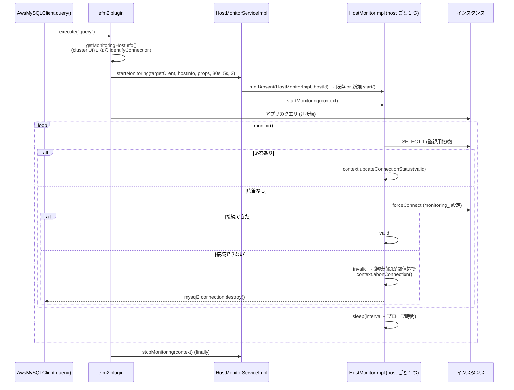

## 何を学んだか

`HostMonitorImpl` は**ホストにつき 1 つ**で、プロセス内の全 `AwsMySQLClient` が共有する。1 本の監視用接続を持ち、ループの中で 1 回のプローブを打ち、結果を登録された全 context に配る。

プローブの判定は 3 段である。

1. 監視用接続があれば `SELECT 1` を打つ。通れば生きている
2. 通らなければ監視用接続を捨て、`forceConnect` で張り直す。**張り直せれば生きている**
3. 張り直しも失敗したら、この 1 回は失敗

「接続が切れた」と「ホストが死んだ」を区別しているのがポイントで、`wait_timeout` で監視用接続が落とされただけなら再接続が通り、ホストは健全のままになる。

不健全と判定されると、context が保持している**アプリ側の mysql2 接続**に `destroy()` を掛ける。mysql2 の `destroy()` は `close()` の別名で、socket に FIN を送って以後のコマンドを拒否するだけである。実行中のクエリは mysql2 からは reject されない。

## ソースコードのどこか

### 監視用接続を誰が要求するか



### HostMonitorServiceImpl — ホストをキーに monitor を引く

[`common/lib/plugins/efm/base/host_monitor_service.ts#L67`](https://github.com/aws/aws-advanced-nodejs-wrapper/blob/6d0ba1bdae81a4e1fd274b3569c5dc50cf0a7095/common/lib/plugins/efm/base/host_monitor_service.ts#L67)。

```ts title="common/lib/plugins/efm/base/host_monitor_service.ts"
async startMonitoring(connectionToAbort, hostInfo, properties, failureDetectionTimeMillis, failureDetectionIntervalMillis, failureDetectionCount): Promise<ConnectionContext> {
  const monitorKey = hostInfo.hostId || hostInfo.host;

  const monitor = await this.getMonitor(monitorKey, hostInfo, properties);
  // ...
  const context = new ConnectionContextImpl(
    connectionToAbort,
    failureDetectionTimeMillis,
    failureDetectionIntervalMillis,
    failureDetectionCount,
    this.abortedConnectionsCounter
  );

  monitor.startMonitoring(context);
  return context;
}
```

キーは `hostId` (Aurora なら `@@aurora_server_id` の値)、なければホスト名である。`getMonitor` は `MonitorService.runIfAbsent` に `HostMonitorImpl` を作るクロージャを渡し、既存があればそれを返す ([`#L99`](https://github.com/aws/aws-advanced-nodejs-wrapper/blob/6d0ba1bdae81a4e1fd274b3569c5dc50cf0a7095/common/lib/plugins/efm/base/host_monitor_service.ts#L99))。`MonitorService` はプロセスで 1 つのシングルトンなので ([MonitorService](../monitor-service/))、同じインスタンスに繋ぐ全クライアントの全クエリが**同じ monitor と同じ監視用接続**を共有する。

### 監視対象をインスタンスに確定させる

`getMonitoringHostInfo` は、接続先 URL がインスタンスエンドポイントでないとき (クラスタエンドポイントや IP)、`identifyConnection` で実際のインスタンスを特定する ([`common/lib/plugins/efm/v1/host_monitoring_connection_plugin.ts#L164`](https://github.com/aws/aws-advanced-nodejs-wrapper/blob/6d0ba1bdae81a4e1fd274b3569c5dc50cf0a7095/common/lib/plugins/efm/v1/host_monitoring_connection_plugin.ts#L164))。

```ts title="common/lib/plugins/efm/v1/host_monitoring_connection_plugin.ts"
const rdsUrlType: RdsUrlType = this.rdsUtils.identifyRdsType(this.monitoringHostInfo.host);

try {
  if (rdsUrlType !== RdsUrlType.RDS_INSTANCE) {
    logger.debug(Messages.get("HostMonitoringConnectionPlugin.identifyClusterConnection"));
    this.monitoringHostInfo = await this.pluginService.identifyConnection(
      this.pluginService.getCurrentClient().targetClient!,
      this.pluginService.getCurrentHostInfo()
    );
    if (this.monitoringHostInfo == null) {
      const host: HostInfo | null = this.pluginService.getCurrentHostInfo();
      this.throwUnableToIdentifyConnection(host);
    }

    // Update identified HostInfo for the current connection
    await this.pluginService.setCurrentClient(this.pluginService.getCurrentClient().targetClient!, this.monitoringHostInfo);
  }
```

クラスタエンドポイントの DNS はフェイルオーバーで別インスタンスを指すようになる。監視用接続を「クラスタエンドポイント」に張ると、アプリの接続とは別のインスタンスに繋がる可能性がある。`@@aurora_server_id` で確定させたインスタンスエンドポイントに張るのはそのためで、`identifyConnection` の中身は [identifyConnection](../identify-connection/) にある。結果は `monitoringHostInfo` にキャッシュされ、`notifyConnectionChanged` で `HOSTNAME` / `HOST_CHANGED` が来たとき (フェイルオーバー後) だけ捨てる ([`#L198`](https://github.com/aws/aws-advanced-nodejs-wrapper/blob/6d0ba1bdae81a4e1fd274b3569c5dc50cf0a7095/common/lib/plugins/efm/v1/host_monitoring_connection_plugin.ts#L198))。

### 監視ループ

[`common/lib/plugins/efm/base/host_monitor.ts#L109`](https://github.com/aws/aws-advanced-nodejs-wrapper/blob/6d0ba1bdae81a4e1fd274b3569c5dc50cf0a7095/common/lib/plugins/efm/base/host_monitor.ts#L109)。

```ts title="common/lib/plugins/efm/base/host_monitor.ts"
while (!this._stop) {
  try {
    this.lastActivityTimestampNanos = getTimeInNanos();

    const activeContexts = this.contexts.filter((ctx) => ctx.isActiveContext());

    if (activeContexts.length > 0) {
      this.contextLastUsedTimestampNano = getCurrentTimeNano();

      const statusCheckStartTimeNano = getCurrentTimeNano();
      const [isValid, elapsedTimeNano] = await this.checkConnectionStatus();

      let delayMillis = -1;

      for (const context of activeContexts) {
        if (!context.isActiveContext()) {
          continue;
        }

        await context.updateConnectionStatus(this.hostInfo.url, statusCheckStartTimeNano, statusCheckStartTimeNano + elapsedTimeNano, isValid);

        if (
          context.isActiveContext() &&
          !context.isHostUnhealthy() &&
          statusCheckStartTimeNano >= context.expectedActiveMonitoringStartTimeNano
        ) {
          if (delayMillis === -1 || delayMillis > context.failureDetectionIntervalMillis) {
            delayMillis = context.failureDetectionIntervalMillis;
          }
        }
      }

      this.contexts = this.contexts.filter((ctx) => ctx.isActiveContext() && !ctx.isHostUnhealthy());

      if (delayMillis === -1) {
        delayMillis = HostMonitorImpl.SLEEP_WHEN_INACTIVE_MILLIS;
      } else {
        delayMillis -= Math.round(elapsedTimeNano / 1_000_000);
        if (delayMillis <= 0) {
          delayMillis = HostMonitorImpl.MIN_CONNECTION_CHECK_TIMEOUT_MILLIS;
        }
      }

      await new Promise<void>((resolve) => {
        this.delayTimeoutId = setTimeout(resolve, delayMillis);
      });
    } else {
      if (getCurrentTimeNano() - this.contextLastUsedTimestampNano >= this.monitorDisposalTimeMillis * 1_000_000) {
        break;
      }
      await new Promise<void>((resolve) => {
        this.sleepTimeoutId = setTimeout(resolve, HostMonitorImpl.SLEEP_WHEN_INACTIVE_MILLIS);
      });
    }
```

読み取れることを順に並べる。

- **プローブは 1 ループ 1 回**で、結果を全 context に配る。context ごとに打つのではない
- **次の待ち時間は、猶予が明けている context の `Interval` の最小値**。猶予が明けた context が 1 つもなければ `SLEEP_WHEN_INACTIVE_MILLIS` = 100ms
- プローブにかかった時間を待ち時間から引く。引いた結果が 0 以下なら `MIN_CONNECTION_CHECK_TIMEOUT_MILLIS` = 3 秒
- 不健全と判定された context と非アクティブな context は、この分岐の最後で配列から落とす
- アクティブな context がない状態が `monitorDisposalTime` (10 分) 続いたらループを抜ける

2 つ目が見落としやすい。アクティブな context があって、それが全部猶予時間の中にあるとき、`delayMillis` は `-1` のまま `100ms` になる。つまり**猶予時間の 30 秒間、監視用接続に 100ms 間隔で `SELECT 1` が飛ぶ**。結果は context 側で捨てられる ([failureDetectionTime / Interval / Count](../failure-detection-params/))。猶予が明けると 5 秒間隔に落ち着く。

### プローブの 3 段判定

[`#L189`](https://github.com/aws/aws-advanced-nodejs-wrapper/blob/6d0ba1bdae81a4e1fd274b3569c5dc50cf0a7095/common/lib/plugins/efm/base/host_monitor.ts#L189)。

```ts title="common/lib/plugins/efm/base/host_monitor.ts"
protected async checkConnectionStatus(): Promise<ConnectionStatus> {
  const connectContext = this.telemetryFactory.openTelemetryContext("Connection status check", TelemetryTraceLevel.FORCE_TOP_LEVEL);
  connectContext.setAttribute("url", this.hostInfo.host);
  return await connectContext.start(async () => {
    const startNanos = getCurrentTimeNano();
    try {
      if (this.monitoringClient != null && (await this.pluginService.isClientValid(this.monitoringClient))) {
        return [true, getCurrentTimeNano() - startNanos];
      }

      await this.closeMonitoringClient();

      const monitoringConnProperties = new Map(this.properties);
      for (const key of monitoringConnProperties.keys()) {
        if (!key.startsWith(WrapperProperties.MONITORING_PROPERTY_PREFIX)) {
          continue;
        }
        monitoringConnProperties.set(key.substring(WrapperProperties.MONITORING_PROPERTY_PREFIX.length), this.properties.get(key));
        monitoringConnProperties.delete(key);
      }

      this.monitoringClient = await this.pluginService.forceConnect(this.hostInfo, monitoringConnProperties);
      return [true, getCurrentTimeNano() - startNanos];
    } catch (error: any) {
      this.hostInvalidCounter.inc();
      await this.closeMonitoringClient();
      return [false, getCurrentTimeNano() - startNanos];
    }
  });
}
```

`isClientValid` は MySQL Dialect では `SELECT 1` を `ClientUtils.queryWithTimeout` で包んだもので、失敗しても例外を投げず `false` を返す ([`mysql/lib/dialect/mysql_database_dialect.ts#L120`](https://github.com/aws/aws-advanced-nodejs-wrapper/blob/6d0ba1bdae81a4e1fd274b3569c5dc50cf0a7095/mysql/lib/dialect/mysql_database_dialect.ts#L120))。

```ts title="mysql/lib/dialect/mysql_database_dialect.ts"
async isClientValid(targetClient: ClientWrapper): Promise<boolean> {
  try {
    return await ClientUtils.queryWithTimeout(
      targetClient
        .query("SELECT 1")
        .then(() => {
          return true;
        })
        .catch(() => {
          return false;
        }),
      targetClient.properties
    );
  } catch (error) {
    return false;
  }
}
```

`false` が返ると `forceConnect` に進む。`forceConnect` は `connect` とは別のパイプラインで、`forceConnect` を購読しているプラグインしか通らない ([9 本のパイプライン](../pipelines/))。failover2 は `connect` は購読するが `forceConnect` は購読しないので、監視用接続の張り直しでフェイルオーバーが走ることはない。最終的に `DefaultPlugin` → `DriverConnectionProvider` → `MySQL2DriverDialect.connect` → mysql2 `createConnection` になる ([DefaultPlugin と ConnectionProvider](../default-plugin-and-connection-provider/))。

`forceConnect` が**成功したらこのプローブは有効**である。監視用接続が落ちていただけならここで復旧し、ホストは健全のまま続く。失敗するのは、`SELECT 1` も再接続も両方ダメだったときだけである。

### `monitoring_` 接頭辞

上のループが、`monitoring_` で始まるキーを接頭辞なしのキーに**上書き**してから `forceConnect` に渡している。`monitoring_wrapperQueryTimeout: 1000` は監視用接続の `wrapperQueryTimeout: 1000` になる。この Map は `MySQLClientWrapper.properties` として監視用接続に紐づき、次のプローブの `SELECT 1` の `queryWithTimeout` は `targetClient.properties` を読むので、**監視用のタイムアウトがプローブに効く**。

残った接頭辞付きキーは `MySQL2DriverDialect.connect` の `removeWrapperProperties` で落ちる ([`common/lib/wrapper_property.ts#L820`](https://github.com/aws/aws-advanced-nodejs-wrapper/blob/6d0ba1bdae81a4e1fd274b3569c5dc50cf0a7095/common/lib/wrapper_property.ts#L820))。`monitoring_` / `topology_monitoring_` / `blue_green_monitoring_` の 3 つが対象で、これは [WrapperProperties](../wrapper-properties/) で読む。

docs は「必ず監視用接続に 0 でないタイムアウトを与えよ」と警告している。MySQL では `wrapperQueryTimeout` の既定 20 秒と mysql2 の `connectTimeout` 既定 10 秒が効くので「永久に待つ」ことはないが、失敗プローブ 1 回に最大 30 秒かかる。統合テストは `monitoring_wrapperQueryTimeout: 3000` と `monitoring_wrapperConnectTimeout: 3000` を入れている ([`tests/integration/container/tests/utils/driver_helper.ts#L166`](https://github.com/aws/aws-advanced-nodejs-wrapper/blob/6d0ba1bdae81a4e1fd274b3569c5dc50cf0a7095/tests/integration/container/tests/utils/driver_helper.ts#L166))。

### abort の正体 — mysql2 の `destroy()` は `close()` の別名

context が不健全を確定させると `ClientWrapper.abort()` を呼ぶ。MySQL 側は [`common/lib/mysql_client_wrapper.ts#L67`](https://github.com/aws/aws-advanced-nodejs-wrapper/blob/6d0ba1bdae81a4e1fd274b3569c5dc50cf0a7095/common/lib/mysql_client_wrapper.ts#L67)。

```ts title="common/lib/mysql_client_wrapper.ts"
async abort(): Promise<void> {
  try {
    this.client?.destroy();
  } catch (error: any) {
    // ignore
  }
}
```

mysql2 の `destroy()` は [`lib/base/connection.js#L944`](https://github.com/sidorares/node-mysql2/blob/d8932925b237f07b6410263770379998df973502/lib/base/connection.js#L944) にある。

```js title="lib/base/connection.js (mysql2)"
// currently just alias to close
destroy() {
  this.close();
}

close() {
  if (this.connectTimeout) {
    Timers.clearTimeout(this.connectTimeout);
    this.connectTimeout = null;
  }
  this._closing = true;
  this.stream.end();
  this.addCommand = this._addCommandClosedState;
}
```

やっているのは `_closing` フラグ、socket の `end()` (FIN 送信)、以後の `addCommand` の差し替えの 3 つである。`_addCommandClosedState` は `"Can't add new command when connection is in closed state"` を返し ([`#L202`](https://github.com/sidorares/node-mysql2/blob/d8932925b237f07b6410263770379998df973502/lib/base/connection.js#L202))、この文字列は `MySQLErrorHandler.isNetworkError` の一致リストにある ([MySQLErrorHandler](../mysql-error-handler/))。**次のクエリ**は即座に落ち、failover2 がそれを拾う。

しかし**実行中のクエリ**は別である。socket の `close` イベントハンドラは `_closing` が立っていると何もしない ([`#L115`](https://github.com/sidorares/node-mysql2/blob/d8932925b237f07b6410263770379998df973502/lib/base/connection.js#L115))。

```js title="lib/base/connection.js (mysql2)"
this.stream.on('close', () => {
  // we need to set this flag everywhere where we want connection to close
  if (this._closing) {
    return;
  }
  if (!this._protocolError) {
    // no particular error message before disconnect
    this._protocolError = new Error(
      'Connection lost: The server closed the connection.'
    );
```

実行中コマンドの callback を呼ぶ `_notifyError` は、この `close` ハンドラか、socket の `error` か、ハンドシェイクのエラーからしか呼ばれない。ネットワークが黒穴で socket がエラーも FIN も返さない状況では、`destroy()` した後も実行中クエリの Promise は mysql2 からは settle しない。それを落とすのは、ラッパの `wrapperQueryTimeout` による `Promise.race` か、クエリに付けた mysql2 の `timeout` である。この差が `efm` と `efm2` の挙動差に直結する ([efm と efm2 の違い](../efm-v1-vs-v2/))。

## なぜそうなっているか

### ホストにつき 1 つにする理由

監視は「ホストが応答するか」を見るだけなので、接続ごとに持つ意味がない。プロセス内に同じインスタンスへの接続が 50 本あっても、監視用接続は 1 本でよい。接続ごとに監視用接続を張ると、監視のために接続数が倍になる。

共有の単位が「ホスト」なので、キーには `hostId` を優先する。同じインスタンスにインスタンスエンドポイントと IP アドレスの両方で繋いでいても、`@@aurora_server_id` が同じなら同じ monitor になる。

### 再接続できれば健全、とする理由

`SELECT 1` の失敗だけで不健全にすると、監視用接続が `wait_timeout` や `max_connections` の掃除で切られただけの状況で偽陽性になる。監視用接続はアプリのクエリが走っている間しか使われないので、アイドルで切られることは普通に起きる。

「張り直せるか」まで見れば、切られたのは接続であってホストではないと判定できる。ホストが本当に死んでいれば再接続も失敗する。判定の意味を「接続の状態」から「ホストの状態」に引き上げるための 2 段目である。

### 猶予中に 100ms 間隔で打つのは意図か

コードから意図は読み取れない。`SLEEP_WHEN_INACTIVE_MILLIS` は「アクティブな context がないときの寝る時間」として定義されているが、「猶予中の context しかない」場合にも同じ値が使われる。結果として猶予中の 30 秒間に約 300 回の `SELECT 1` が監視用接続に流れる。ホスト 1 つにつき 1 本なので負荷としては小さいが、ログを `debug` にすると `Host ... is *alive*` ではなく無言のプローブが大量に見えるはずで、監視用接続の CPU を気にする環境では知っておく必要がある。次の待ち時間を「最も近い猶予明けまで」にすれば直る話で、上流に報告する価値がある。

### プローブ時間を待ち時間から引く理由

`Interval` は「プローブ開始から次のプローブ開始まで」の意味で守られている。プローブに 3 秒かかったのに 5 秒寝ると、実質 8 秒間隔になり、`Interval × Count` の閾値の意味がずれる。引き算で補正し、プローブが `Interval` より長引いたときは 3 秒を下限にして、失敗中のホストを連打しないようにしている。

## どう活かすか

- **共有できる監視は、監視対象をキーにして 1 つにまとめる。** 「誰が要求したか」ではなく「何を監視するか」で監視タスクを持つと、要求元が増えてもコストが増えない
- **「疎通できない」と「対象が死んだ」を分ける段を入れる。** 再接続を試みてから判定すると、接続レベルの事故を対象の障害と混同しなくなる
- **監視用の通信には本線と別のタイムアウトを持たせる。** `monitoring_` 接頭辞は、同じ設定 Map から派生設定を作る最小の仕組みで、設定クラスを増やさずに済んでいる
- **ライブラリの `destroy()` が何をするかは読んで確かめる。** mysql2 の `destroy()` は socket を即座に壊さない。「強制切断」と思って呼んでも、実行中の処理は落ちないことがある

### 実務で踏む失敗パターン

- **`monitoring_wrapperQueryTimeout` を入れずに使う。** 失敗プローブ 1 回が最大 30 秒 (20 秒 + 10 秒) かかり、`Interval × Count` = 15 秒の閾値は 1 回目の失敗で超える。検知は「猶予 + 30 秒」になる。3 秒程度に短くしておく
- **`SELECT 1` が通らない権限で監視する。** 通常ありえないが、`monitoring_user` で別ユーザにした場合は要注意。`isClientValid` が常に `false` → 毎回 `forceConnect` → 監視用接続が毎プローブ張り直される
- **監視用接続が接続数上限を食う。** ホストごと 1 本だが、プロセスが多ければその数だけ増える。`max_connections` の計算に入れておく
- **クラスタエンドポイントに IP で繋いでいて `identifyConnection` に失敗する。** `clusterInstanceHostPattern` がないとインスタンスエンドポイントを組み立てられず、`HostMonitoringConnectionPlugin.unableToIdentifyConnection` で落ちる ([clusterInstanceHostPattern](../cluster-instance-host-pattern/))
