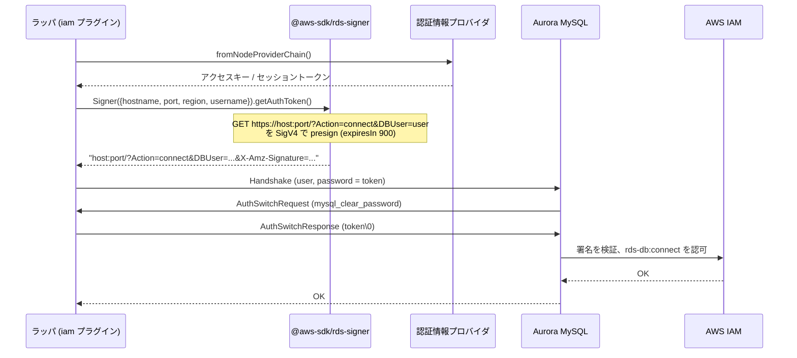

## 何を学んだか

IAM DB 認証は、**パスワードの代わりに署名付きの文字列を送る**仕組みである。DB 側のユーザは固定パスワードを持たず、送られてきたトークンを AWS の IAM に問い合わせて検証する。クライアント側でやることは 3 つ。

1. AWS 認証情報 (アクセスキー、あるいは IAM ロール) で、`rds-db:connect` アクションの HTTP リクエストに SigV4 署名する
2. 署名済み URL から `https://` を取った文字列をパスワード欄に入れる
3. サーバが要求する `mysql_clear_password` でそれを平文送信する (だから TLS が必須)

トークンの性質として押さえておくことは次の 3 つで、ラッパの IAM プラグインの設計はここから決まる。

- **有効期限は 15 分固定。** `@aws-sdk/rds-signer` が `expiresIn: 900` を決め打ちしている
- **署名にホスト名・ポート・ユーザ名が入る。** 別のホスト名で作ったトークンは通らない。カスタムドメインで繋ぐときに `iamHost` が要るのはこのため
- **生成はローカルで完結する。** 署名は手元の認証情報だけで作れ、AWS の API を呼ばない。だからキャッシュしても再生成しても安い



## ソースコードのどこか

### トークンの正体: `@aws-sdk/rds-signer`

ラッパは `@aws-sdk/rds-signer` (peerDependency、`^3.1053.0`) の `Signer` に丸投げしている。その中身は `node_modules/@aws-sdk/rds-signer/dist-cjs/index.js` で 50 行ほどしかない。

```js title="node_modules/@aws-sdk/rds-signer/dist-cjs/index.js (3.1053.0)"
class Signer {
  protocol = "https:";
  service = "rds-db";
  // ...
  async getAuthToken() {
    const signer = new signatureV4.SignatureV4({
      service: this.service,
      region: this.region,
      credentials: this.credentials,
      sha256: this.sha256,
    });
    const request = new protocols.HttpRequest({
      method: "GET",
      protocol: this.protocol,
      hostname: this.hostname,
      port: this.port,
      query: {
        Action: "connect",
        DBUser: this.username,
      },
      headers: {
        host: `${this.hostname}:${this.port}`,
      },
    });
    const presigned = await signer.presign(request, {
      expiresIn: 900,
    });
    return util.formatUrl(presigned).replace(`${this.protocol}//`, "");
  }
}
```

`GET https://<host>:<port>/?Action=connect&DBUser=<user>` という架空の HTTP リクエストを、サービス名 `rds-db` で SigV4 presign する。返るのは `X-Amz-Algorithm`、`X-Amz-Credential`、`X-Amz-Date`、`X-Amz-Expires=900`、`X-Amz-SignedHeaders=host`、`X-Amz-Signature` などのクエリが付いた URL から `https://` を落とした文字列で、これがそのまま「パスワード」になる。**`expiresIn: 900` はライブラリの定数**で、呼び出し側からは変えられない。

`host` ヘッダが署名対象 (`SignedHeaders=host`) に入っているので、ホスト名とポートが違えば署名は合わない。

### ラッパ側: 生成とキャッシュ

`IamAuthUtils.generateAuthenticationToken` ([`common/lib/utils/iam_auth_utils.ts#L59`](https://github.com/aws/aws-advanced-nodejs-wrapper/blob/6d0ba1bdae81a4e1fd274b3569c5dc50cf0a7095/common/lib/utils/iam_auth_utils.ts#L59)) は `Signer` を作って `getAuthToken()` を呼ぶだけで、telemetry のスパン (`fetch IAM token`) を巻いている。呼び出し元の `IamAuthenticationPlugin.connectInternal` ([`iam_authentication_plugin.ts#L73`](https://github.com/aws/aws-advanced-nodejs-wrapper/blob/6d0ba1bdae81a4e1fd274b3569c5dc50cf0a7095/common/lib/authentication/iam_authentication_plugin.ts#L73)) が本体である。

```ts title="common/lib/authentication/iam_authentication_plugin.ts"
const host = this.iamAuthUtils.getIamHost(props, hostInfo);
const port = this.iamAuthUtils.getIamPort(
  props,
  hostInfo,
  this.pluginService.getCurrentClient().defaultPort,
);

const type: RdsUrlType = this.rdsUtils.identifyRdsType(host.host);
this.regionUtils =
  type == RdsUrlType.RDS_GLOBAL_WRITER_CLUSTER ? new GlobalDbRegionUtils() : new RegionUtils();
const region: string | null = await this.regionUtils.getRegion(
  WrapperProperties.IAM_REGION.name,
  host,
  props,
);

if (!region) {
  throw new AwsWrapperError(
    Messages.get("SamlAuthPlugin.unableToDetermineRegion", WrapperProperties.IAM_REGION.name),
  );
}

const tokenExpirationSec = WrapperProperties.IAM_TOKEN_EXPIRATION.get(props);
// ...
const cacheKey: string = this.iamAuthUtils.getCacheKey(port, user, host.host, region);

const tokenInfo = IamAuthenticationPlugin.tokenCache.get(cacheKey);
const isCachedToken: boolean = tokenInfo !== undefined && !tokenInfo.isExpired();

if (isCachedToken && tokenInfo) {
  logger.debug(Messages.get("AuthenticationToken.useCachedToken", tokenInfo.token));
  WrapperProperties.PASSWORD.set(props, tokenInfo.token);
} else {
  const tokenExpiry: number = Date.now() + tokenExpirationSec * 1000;
  const token = await this.iamAuthUtils.generateAuthenticationToken(
    host.host,
    port,
    region,
    user,
    AwsCredentialsManager.getProvider(hostInfo, props),
    this.pluginService,
  );
  this.fetchTokenCounter.inc();
  WrapperProperties.PASSWORD.set(props, token);
  IamAuthenticationPlugin.tokenCache.set(cacheKey, new TokenInfo(token, tokenExpiry));
}
this.pluginService.updateConfigWithProperties(props);
```

署名に入る 4 要素 (host / port / region / user) がそのままキャッシュキー `region:hostname:port:user` になる ([`iam_auth_utils.ts#L55`](https://github.com/aws/aws-advanced-nodejs-wrapper/blob/6d0ba1bdae81a4e1fd274b3569c5dc50cf0a7095/common/lib/utils/iam_auth_utils.ts#L55))。キャッシュは `static` の `Map` で、プロセス内の全クライアントが共有する。有効期限はラッパ側の `iamTokenExpiration` (既定 `15 * 60` 秒、[`wrapper_property.ts#L270`](https://github.com/aws/aws-advanced-nodejs-wrapper/blob/6d0ba1bdae81a4e1fd274b3569c5dc50cf0a7095/common/lib/wrapper_property.ts#L270)) で、トークン自体の 900 秒とは**別に数えている**。

そして `WrapperProperties.PASSWORD.set(props, token)`。トークンは `password` プロパティに書き込まれ、そのまま mysql2 の `createConnection({ password })` に渡る。mysql2 は何も知らずに「パスワード」として `mysql_clear_password` で送る ([mysql2 の認証プラグイン交渉](../mysql2-auth-plugin-negotiation/))。

### 期限切れトークンでの再試行

同じ関数の後半。

```ts title="common/lib/authentication/iam_authentication_plugin.ts"
try {
  return await connectFunc();
} catch (e) {
  logger.debug(Messages.get("Authentication.connectError", (e as Error).message));
  if (!this.pluginService.isLoginError(e as Error) || !isCachedToken) {
    throw e;
  }

  // Login unsuccessful with cached token
  // Try to generate a new token and try to connect again

  const tokenExpiry: number = Date.now() + tokenExpirationSec * 1000;
  const token = await this.iamAuthUtils.generateAuthenticationToken(/* ... */);
  this.fetchTokenCounter.inc();
  WrapperProperties.PASSWORD.set(props, token);
  IamAuthenticationPlugin.tokenCache.set(cacheKey, new TokenInfo(token, tokenExpiry));
  return connectFunc();
}
```

再試行するのは「**ログインエラー、かつキャッシュ済みトークンを使った**」ときだけ。`isLoginError` は MySQL では `sqlState === "28000"` か `"Access denied"` を含むメッセージ ([`mysql_error_handler.ts#L41`](https://github.com/aws/aws-advanced-nodejs-wrapper/blob/6d0ba1bdae81a4e1fd274b3569c5dc50cf0a7095/mysql/lib/mysql_error_handler.ts#L41))。新規生成したトークンで失敗したなら、作り直しても同じなのでそのまま投げる。ラッパ側の期限 (`iamTokenExpiration`) を 900 秒より長く設定してしまった場合や、キャッシュ直後に時計がずれた場合の保険として、この 1 回のリトライがある。

### host / port / region の決め方

`getIamHost` ([`iam_auth_utils.ts#L30`](https://github.com/aws/aws-advanced-nodejs-wrapper/blob/6d0ba1bdae81a4e1fd274b3569c5dc50cf0a7095/common/lib/utils/iam_auth_utils.ts#L30)) は `iamHost` が指定されていれば `HostInfo` のホストだけ差し替える。`getIamPort` ([`#L38`](https://github.com/aws/aws-advanced-nodejs-wrapper/blob/6d0ba1bdae81a4e1fd274b3569c5dc50cf0a7095/common/lib/utils/iam_auth_utils.ts#L38)) は `iamDefaultPort` → 接続先のポート → Dialect の既定ポート (3306) の順。region は `RegionUtils.getRegion` ([`region_utils.ts#L71`](https://github.com/aws/aws-advanced-nodejs-wrapper/blob/6d0ba1bdae81a4e1fd274b3569c5dc50cf0a7095/common/lib/utils/region_utils.ts#L71)) で、`iamRegion` が無ければホスト名から `RdsUtils.getRdsRegion` で切り出す。`db.cluster-abc.us-east-1.rds.amazonaws.com` なら `us-east-1` が取れるが、IP やカスタムドメインでは取れないので `iamRegion` が必須になる。

`RegionUtils.REGIONS` は既知のリージョン名のハードコードされた配列で、`iamRegion` に未知の文字列を渡すと `AwsSdk.unsupportedRegion` で落ちる。新リージョンが増えたらこの配列を更新するリリースが要る。

### 認証情報の出所

`AwsCredentialsManager.getProvider` ([`aws_credentials_manager.ts#L29`](https://github.com/aws/aws-advanced-nodejs-wrapper/blob/6d0ba1bdae81a4e1fd274b3569c5dc50cf0a7095/common/lib/authentication/aws_credentials_manager.ts#L29)) は、`customAwsCredentialProviderHandler` があればそれを、無ければ `@aws-sdk/credential-providers` の `fromNodeProviderChain()` (`awsProfile` があればそのプロファイル) を返す。環境変数 → 共有設定ファイル → ECS / EC2 のメタデータ、という SDK 標準の探索順である。

### DB 側の準備

[`UsingTheIamAuthenticationPlugin.md`](https://github.com/aws/aws-advanced-nodejs-wrapper/blob/6d0ba1bdae81a4e1fd274b3569c5dc50cf0a7095/docs/using-the-nodejs-wrapper/using-plugins/UsingTheIamAuthenticationPlugin.md) の手順。MySQL では

```sql
CREATE USER example_user_name IDENTIFIED WITH AWSAuthenticationPlugin AS 'RDS';
```

でユーザを作る。`AWSAuthenticationPlugin` が「このユーザのパスワードは IAM に聞け」という意味で、このユーザに対してサーバは `mysql_clear_password` を要求する。IAM 側には `rds-db:connect` を `arn:aws:rds-db:<region>:<account>:dbuser:<resource-id>/<user>` に許可するポリシーが要る。Multi-AZ や Blue/Green で使うなら `GRANT SELECT ON mysql.*` も足す ([`mysql.rds_topology`](../rds-topology-table/))。

## なぜそうなっているか

### なぜ presigned URL なのか

IAM の署名検証は「このリクエストはこの認証情報の持ち主が作ったか」を確かめる仕組みで、S3 の presigned URL と同じである。RDS はそれを「`rds-db:connect` という架空の API への GET」に当てはめた。こうすると、**新しい署名方式を発明せずに IAM の既存の検証基盤とポリシー言語をそのまま使える**。ポリシーの `Resource` にユーザ名まで書けるのも、リクエストの `DBUser` パラメータが署名に含まれるからである。

代償は、トークンが 200 文字を超える長い文字列になることと、ハッシュ化できないので平文で送るしかないことだ。

### なぜ 15 分なのか

presigned URL の有効期限を短くするのは、漏れたときの被害を限定するためである。DB 接続は一度張れば長く使えるので、認証は接続時の一瞬だけでよく、15 分あれば足りる。逆に、**接続を張り直すたびに新しいトークンが要る**ので、プールが接続を作り直す頻度が高いと署名の計算が増える。ラッパがキャッシュするのはこのためで、署名はローカル計算なので本来は安いが、15 分に 1 回で済むならそのほうがよい。

### なぜホスト名を署名に含めるのか

トークンを盗まれても、別の DB には使えないようにするためである。副作用として、DNS 名が違えば同じインスタンスでも別トークンが要る。カスタムドメインで繋ぐアプリは、署名用に本物の RDS エンドポイント (`iamHost`) を別に渡す必要がある。ラッパの `getIamHost` が接続先とは別の `HostInfo` を作るのは、「繋ぐ先」と「署名する名前」が一致しない場合があるからだ。

フェイルオーバーで別のインスタンスに繋ぎ直すときも同じで、インスタンスエンドポイントごとに別のトークンになる。キャッシュキーにホスト名が入っているので、これは自動的に分かれる。

## どう活かすか

- **署名済みリクエストを「パスワード」として既存のプロトコルに流し込む**、という設計は他でも使える。認証基盤を変えずに、クライアントの送る文字列だけ差し替える。ただし平文で送る前提になるので、TLS が必須になる
- **有効期限の短い資格情報はキャッシュ + 期限切れ時の 1 回リトライで扱う。** ラッパのパターンは「期限内ならキャッシュ、ログインエラーかつキャッシュ由来なら作り直して 1 回だけ再試行」で、無限リトライにも毎回生成にもならない
- **署名に含まれる要素をそのままキャッシュキーにする。** host / port / region / user が変われば別トークンが要る。キーの設計を署名の定義から導く
- **リージョン名のハードコードは更新の負債になる。** `RegionUtils.REGIONS` は新リージョンごとにリリースが要る。自分で書くなら、SDK のエンドポイント解決に委ねるか、既知リストに無くても警告にとどめる

### 実務で踏む失敗パターン

- **`ssl` を付け忘れて `MYSQL_CLEAR_PASSWORD_NOT_ENABLED`。** ラッパは平文 TCP では `enableCleartextPlugin` を立てない。RDS の CA 証明書を `ssl: { ca }` で渡す ([MySQL で IAM を使うと cleartext になる](../iam-cleartext-on-mysql/))
- **カスタムドメインで `iamHost` を渡さず Access denied。** 署名のホスト名が RDS のエンドポイントと一致しない。`iamHost` と `iamRegion` を両方渡す
- **アプリの時計が数分ずれていて署名が無効。** SigV4 は `X-Amz-Date` を検証する。コンテナの時刻同期を確認する
- **IAM ロールに `rds-db:connect` はあるが `Resource` の resource-id が違う。** ARN はクラスタ ID ではなく DB リソース ID (`cluster-ABCDEF...`) で書く。Global Database では `rds:DescribeGlobalClusters` も要る
- **`iamTokenExpiration` を 900 より大きくする。** キャッシュは期限内でもトークン自体は 15 分で切れる。ログインエラーで 1 回作り直されるので動くが、無駄な失敗が 1 回入る
