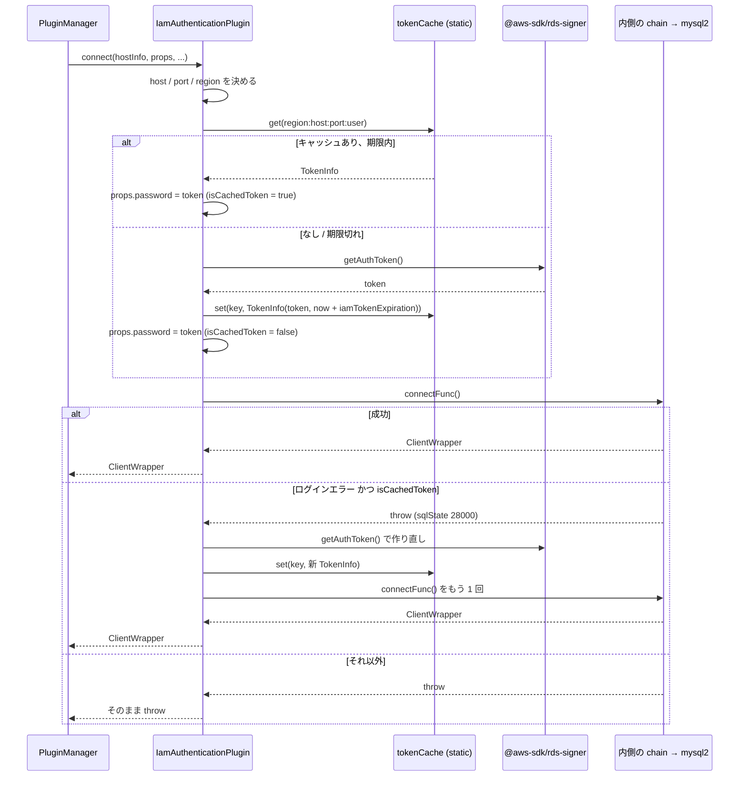

## 何を学んだか

`iam` プラグインは 156 行で、やることは 1 つしかない。**mysql2 の `createConnection` が呼ばれる直前に、`props` の `password` を IAM トークンで上書きする。** トークンの正体 (presigned URL) と 15 分の有効期限は [IAM DB 認証の仕組み](../iam-db-auth/) で説明したので、このページはプラグインとしての振る舞いに絞る。

3 つの性質がある。

- **`connect` と `forceConnect` しか購読しない。** `query` には出てこない。トークンは接続確立のときにしか要らないからで、その代わり接続を張る経路は全部通る。初回接続も、フェイルオーバーの張り直しも、EFM の監視接続も、`forceConnect` パイプラインを含めて例外なくトークンが差し込まれる
- **トークンキャッシュは `static` の `Map`。** クライアントごとではなく、プロセス全体で `region:host:port:user` をキーに共有される。同じユーザで 100 本の接続を張っても署名は 1 回で済む
- **作り直すのは「キャッシュ済みトークンでログインに失敗した」ときだけ。** 生成したばかりのトークンで失敗したら、そのまま投げる。権限やユーザ設定の問題を再試行で隠さない

## ソースコードのどこか

### chain 上の位置

[`connection_plugin_chain_builder.ts#L77`](https://github.com/aws/aws-advanced-nodejs-wrapper/blob/6d0ba1bdae81a4e1fd274b3569c5dc50cf0a7095/common/lib/connection_plugin_chain_builder.ts#L77)。認証系 4 プラグインは weight 1000 番台で、`failover2` (710) や `efm2` (810) より後ろに並ぶ。

| コード           | weight | 役割                                 |
| ---------------- | ------ | ------------------------------------ |
| `iam`            | 1000   | IAM トークンを `password` に差し込む |
| `secretsManager` | 1100   | Secrets Manager から user/password   |
| `federatedAuth`  | 1200   | AD FS → SAML → STS → IAM トークン    |
| `okta`           | 1300   | Okta → SAML → STS → IAM トークン     |

後ろにいる、というのは「`connect` の呼び出しが外側のプラグインを全部通過してから届く」ということである。`failover2` が新 writer に張り直すときも、`efm2` が監視用接続を `forceConnect` で開くときも、その呼び出しは chain を内側へ進んで `iam` を通り、`DefaultPlugin` から mysql2 へ落ちる ([プラグインの並び順](../plugin-order/)、[9 本のパイプライン](../pipelines/))。

購読メソッドは [`iam_authentication_plugin.ts#L34`](https://github.com/aws/aws-advanced-nodejs-wrapper/blob/6d0ba1bdae81a4e1fd274b3569c5dc50cf0a7095/common/lib/authentication/iam_authentication_plugin.ts#L34) で 2 つだけ。

```ts title="common/lib/authentication/iam_authentication_plugin.ts"
export class IamAuthenticationPlugin extends AbstractConnectionPlugin implements CanReleaseResources {
  private static readonly SUBSCRIBED_METHODS = new Set<string>(["connect", "forceConnect"]);
  protected static readonly tokenCache = new Map<string, TokenInfo>();
```

`connect` も `forceConnect` も同じ `connectInternal` に流す。

### `connectInternal` の流れ

[`iam_authentication_plugin.ts#L73`](https://github.com/aws/aws-advanced-nodejs-wrapper/blob/6d0ba1bdae81a4e1fd274b3569c5dc50cf0a7095/common/lib/authentication/iam_authentication_plugin.ts#L73)。



コードは 3 段に読める。まず入力の確定。

```ts title="common/lib/authentication/iam_authentication_plugin.ts"
const user = WrapperProperties.USER.get(props);
if (!user) {
  throw new AwsWrapperError(`${WrapperProperties.USER.name} is null or empty`);
}

const host = this.iamAuthUtils.getIamHost(props, hostInfo);
const port = this.iamAuthUtils.getIamPort(
  props,
  hostInfo,
  this.pluginService.getCurrentClient().defaultPort,
);

const type: RdsUrlType = this.rdsUtils.identifyRdsType(host.host);
this.regionUtils =
  type == RdsUrlType.RDS_GLOBAL_WRITER_CLUSTER ? new GlobalDbRegionUtils() : new RegionUtils();
const region: string | null = await this.regionUtils.getRegion(
  WrapperProperties.IAM_REGION.name,
  host,
  props,
);
```

次にキャッシュの参照と生成 ([`#L99`](https://github.com/aws/aws-advanced-nodejs-wrapper/blob/6d0ba1bdae81a4e1fd274b3569c5dc50cf0a7095/common/lib/authentication/iam_authentication_plugin.ts#L99))。

```ts title="common/lib/authentication/iam_authentication_plugin.ts"
const cacheKey: string = this.iamAuthUtils.getCacheKey(port, user, host.host, region);

const tokenInfo = IamAuthenticationPlugin.tokenCache.get(cacheKey);
const isCachedToken: boolean = tokenInfo !== undefined && !tokenInfo.isExpired();

if (isCachedToken && tokenInfo) {
  WrapperProperties.PASSWORD.set(props, tokenInfo.token);
} else {
  const tokenExpiry: number = Date.now() + tokenExpirationSec * 1000;
  const token = await this.iamAuthUtils.generateAuthenticationToken(
    host.host,
    port,
    region,
    user,
    AwsCredentialsManager.getProvider(hostInfo, props),
    this.pluginService,
  );
  this.fetchTokenCounter.inc();
  WrapperProperties.PASSWORD.set(props, token);
  IamAuthenticationPlugin.tokenCache.set(cacheKey, new TokenInfo(token, tokenExpiry));
}
this.pluginService.updateConfigWithProperties(props);
```

最後に接続と、失敗したときの 1 回だけの作り直し ([`#L124`](https://github.com/aws/aws-advanced-nodejs-wrapper/blob/6d0ba1bdae81a4e1fd274b3569c5dc50cf0a7095/common/lib/authentication/iam_authentication_plugin.ts#L124))。

```ts title="common/lib/authentication/iam_authentication_plugin.ts"
try {
  return await connectFunc();
} catch (e) {
  logger.debug(Messages.get("Authentication.connectError", (e as Error).message));
  if (!this.pluginService.isLoginError(e as Error) || !isCachedToken) {
    throw e;
  }

  // Login unsuccessful with cached token
  // Try to generate a new token and try to connect again
  const tokenExpiry: number = Date.now() + tokenExpirationSec * 1000;
  const token = await this.iamAuthUtils.generateAuthenticationToken(/* 同じ引数 */);
  WrapperProperties.PASSWORD.set(props, token);
  IamAuthenticationPlugin.tokenCache.set(cacheKey, new TokenInfo(token, tokenExpiry));
  return connectFunc();
}
```

`isLoginError` は [`plugin_service.ts#L713`](https://github.com/aws/aws-advanced-nodejs-wrapper/blob/6d0ba1bdae81a4e1fd274b3569c5dc50cf0a7095/common/lib/plugin_service.ts#L713) が Dialect の `ErrorHandler` に委譲し、MySQL では `sqlState === "28000"` か `"Access denied"` を含むメッセージである ([MySQLErrorHandler](../mysql-error-handler/))。

`isCachedToken` は接続を試す**前**に確定している。2 回目の `connectFunc()` は `try` の外なので、作り直したトークンでも失敗すればそのまま投げる。再試行は最大 1 回である。

### host / port / region はどこから来るか

[`iam_auth_utils.ts#L30`](https://github.com/aws/aws-advanced-nodejs-wrapper/blob/6d0ba1bdae81a4e1fd274b3569c5dc50cf0a7095/common/lib/utils/iam_auth_utils.ts#L30)。

```ts title="common/lib/utils/iam_auth_utils.ts"
public getIamHost(props: Map<string, any>, hostInfo: HostInfo): HostInfo {
  const iamHost: string | null = WrapperProperties.IAM_HOST.get(props);
  return iamHost
    ? new HostInfoBuilder({ hostAvailabilityStrategy: hostInfo.hostAvailabilityStrategy }).copyFrom(hostInfo).withHost(iamHost).build()
    : hostInfo;
}

public getIamPort(props: Map<string, any>, hostInfo: HostInfo, defaultPort: number): number {
  const port = WrapperProperties.IAM_DEFAULT_PORT.get(props);
  if (port) {
    if (isNaN(port) || port <= 0) {
      logger.debug(Messages.get("Authentication.invalidPort", isNaN(port) ? "-1" : String(port)));
    } else {
      return port;
    }
  }
  if (hostInfo.isPortSpecified()) {
    return hostInfo.port;
  } else {
    return defaultPort;
  }
}
```

優先順位は `iamHost` > `hostInfo.host`、`iamDefaultPort` > `hostInfo.port` > `defaultPort`。ここで渡している `hostInfo` は**プラグインが受け取ったもの**、つまりフェイルオーバー中なら新 writer のインスタンスエンドポイントである。署名にはホスト名が入るので ([IAM DB 認証の仕組み](../iam-db-auth/))、接続先が変わればキャッシュキーも変わり、新しいトークンが作られる。

region は 2 段階 ([`region_utils.ts#L71`](https://github.com/aws/aws-advanced-nodejs-wrapper/blob/6d0ba1bdae81a4e1fd274b3569c5dc50cf0a7095/common/lib/utils/region_utils.ts#L71))。`iamRegion` があればそれ、なければ `RdsUtils.getRdsRegion` でホスト名の正規表現から抜く ([RdsUtils](../rds-utils/))。どちらの経路でも最後に [`REGIONS`](https://github.com/aws/aws-advanced-nodejs-wrapper/blob/6d0ba1bdae81a4e1fd274b3569c5dc50cf0a7095/common/lib/utils/region_utils.ts#L23) という**決め打ちの配列**に含まれるかを検査し、なければ `AwsSdk.unsupportedRegion` で落ちる。

```ts title="common/lib/utils/region_utils.ts"
getRegionFromRegionString(regionString: string): string | null {
  if (!regionString) {
    return null;
  }
  const region = regionString.toLowerCase().trim();
  if (!RegionUtils.REGIONS.includes(region)) {
    throw new AwsWrapperError(Messages.get("AwsSdk.unsupportedRegion", region));
  }
  return region;
}
```

### Global Database のときだけ RDS API を叩く

`identifyRdsType` が `RDS_GLOBAL_WRITER_CLUSTER` (`xxx.global-yyy.global.rds.amazonaws.com`) を返したときは `GlobalDbRegionUtils` に切り替わる。Global writer endpoint には region が含まれないので、ホスト名からは決められない。

[`global_db_region_utils.ts#L36`](https://github.com/aws/aws-advanced-nodejs-wrapper/blob/6d0ba1bdae81a4e1fd274b3569c5dc50cf0a7095/common/lib/utils/global_db_region_utils.ts#L36)。

```ts title="common/lib/utils/global_db_region_utils.ts"
async getRegion(regionKey: string, hostInfo?: HostInfo, props?: Map<string, any>): Promise<string | null> {
  if (props.get(regionKey)) {
    return this.getRegionFromRegionString(props.get(regionKey));
  }
  const clusterId = GlobalDbRegionUtils.rdsUtils.getRdsClusterId(hostInfo.host);
  const writerClusterArn = await this.findWriterClusterArn(hostInfo, props, clusterId);
  return writerClusterArn ? this.getRegionFromClusterArn(writerClusterArn) : null;
}

private async findWriterClusterArn(hostInfo: HostInfo, props: Map<string, any>, globalClusterIdentifier: string): Promise<string | null> {
  const { RDSClient, DescribeGlobalClustersCommand } = await import("@aws-sdk/client-rds");
  const rdsClient = new RDSClient({ credentials: this.credentialsProvider });
  try {
    const response = await rdsClient.send(new DescribeGlobalClustersCommand({ GlobalClusterIdentifier: globalClusterIdentifier }));
    return this.extractWriterClusterArn(response.GlobalClusters);
  } finally {
    rdsClient.destroy();
  }
}
```

`DescribeGlobalClusters` を呼び、`IsWriter` なメンバの ARN から `arn:aws:rds:<region>:...` の region を切り出す。だから docs の Global Database 節には `rds:DescribeGlobalClusters` の許可が要ると書いてある。`iamRegion` を明示すればこの API 呼び出しは起きない ([Aurora Global Database](../global-database/))。

### AWS 認証情報の出所

[`aws_credentials_manager.ts#L29`](https://github.com/aws/aws-advanced-nodejs-wrapper/blob/6d0ba1bdae81a4e1fd274b3569c5dc50cf0a7095/common/lib/authentication/aws_credentials_manager.ts#L29)。

```ts title="common/lib/authentication/aws_credentials_manager.ts"
static getProvider(hostInfo: HostInfo, props: Map<string, any>): AwsCredentialIdentityProvider {
  const awsCredentialProviderHandler = WrapperProperties.CUSTOM_AWS_CREDENTIAL_PROVIDER_HANDLER.get(props);
  if (awsCredentialProviderHandler && !AwsCredentialsManager.isAwsCredentialsProviderHandler(awsCredentialProviderHandler)) {
    throw new AwsWrapperError(Messages.get("AwsCredentialsManager.wrongHandler"));
  }
  return !awsCredentialProviderHandler
    ? AwsCredentialsManager.getDefaultProvider(WrapperProperties.AWS_PROFILE.get(props))
    : awsCredentialProviderHandler.getAwsCredentialsProvider(hostInfo, props);
}

private static getDefaultProvider(profileName: string | null) {
  if (profileName) {
    return fromNodeProviderChain({ profile: profileName });
  }
  return fromNodeProviderChain();
}
```

`customAwsCredentialProviderHandler` があればそれ、なければ SDK の既定チェーン (`fromNodeProviderChain`) に `awsProfile` を渡すだけ。`getProvider` はトークン生成のたびに呼ばれるので、ハンドラ側で重い初期化をすると毎回走る。

### `updateConfigWithProperties`

トークンを `props` に入れた後、[`plugin_service.ts#L507`](https://github.com/aws/aws-advanced-nodejs-wrapper/blob/6d0ba1bdae81a4e1fd274b3569c5dc50cf0a7095/common/lib/plugin_service.ts#L507) を呼ぶ。

```ts title="common/lib/plugin_service.ts"
updateConfigWithProperties(props: Map<string, any>) {
  this._currentClient.config = Object.fromEntries(props.entries());
}
```

`props` は chain を流れる `Map` で、`DefaultPlugin` から `MySQL2DriverDialect.connect(hostInfo, props)` に渡るのはこの `Map` である。一方 `AwsMySQLClient.config` はアプリが渡したオブジェクトのままなので、そちらにもトークンを書き戻して、後から `config` を読む経路 (内部プールの設定など) と食い違わないようにしている。

### 遅延 import と `releaseResources`

[`iam_authentication_plugin_factory.ts#L29`](https://github.com/aws/aws-advanced-nodejs-wrapper/blob/6d0ba1bdae81a4e1fd274b3569c5dc50cf0a7095/common/lib/authentication/iam_authentication_plugin_factory.ts#L29) はプラグイン本体を `await import()` で読む。`@aws-sdk/rds-signer` と `@aws-sdk/credential-providers` は optional peerDependency なので、`iam` を使わないアプリではモジュール解決すら起きない。

[`#L152`](https://github.com/aws/aws-advanced-nodejs-wrapper/blob/6d0ba1bdae81a4e1fd274b3569c5dc50cf0a7095/common/lib/authentication/iam_authentication_plugin.ts#L152) の `releaseResources` は `tokenCache.clear()` だけ。`PluginManager.releaseResources()` からプロセス終了時に呼ばれる ([バックグラウンドタスクと Node.js プロセス](../background-tasks-and-process/))。

## なぜそうなっているか

### なぜ `connect` だけを購読するのか

MySQL の認証は接続確立のハンドシェイクで 1 回だけ起きる。その後のクエリにパスワードは出てこない。だから `query` を購読しても仕事がない。

逆に、接続を張る経路は 1 つも漏らせない。`efm2` の監視接続や `failover2` の張り直しがトークンなしで mysql2 に落ちれば、そこだけ `Access denied` になる。全部の経路が `connect` / `forceConnect` パイプラインを通るという骨格の約束 ([PluginChain](../plugin-chain/)) があるから、2 メソッドの購読で足りる。

### なぜキャッシュが `static` なのか

トークンは `region:host:port:user` の 4 要素で決まり、クライアントの状態には依存しない。同じユーザで 10 個の `AwsMySQLClient` を作ったとき、クライアントごとにキャッシュを持つと 10 回署名する。署名自体は軽いが、その前の `fromNodeProviderChain()` の解決 (IMDS や SSO の呼び出しを含みうる) は軽くない。

`static` にする代償は「別クラスタ・別ユーザでも同じ `Map` を見る」ことだが、キーに host が入っているので衝突しない。`clusterId` の既定 `"1"` のような衝突 ([clusterId](../cluster-id/)) はここでは起きない。

### なぜ再生成は 1 回、しかもキャッシュ済みのときだけなのか

トークンが `Access denied` で拒まれる理由は 2 つある。トークンが古い (15 分を過ぎた) か、そもそも権限がない (IAM ポリシー、DB ユーザの `AWSAuthenticationPlugin` 設定) か。

前者はキャッシュ済みトークンでしか起きない。`iamTokenExpiration` を 900 より大きくした場合や、`tokenCache` に入れた時刻と署名時刻のずれで、ラッパの期限内でも AWS 側では切れていることがある。作り直せば通る。

後者は作り直しても通らない。生成直後のトークンで失敗したら、再試行は無駄なだけでなく、ログを 2 倍にして原因を見えにくくする。`isCachedToken` で分岐しているのはこの切り分けである。

### なぜ region を決め打ちリストで検証するのか

`Signer` に渡した region はそのまま署名の `X-Amz-Credential` に入る。typo した region で署名すると、エラーは AWS 側の `Access denied` として返り、region が原因だと分からない。事前に既知の一覧と突き合わせれば、接続する前に `Unsupported AWS region 'us-esat-1'` で止まる。

代償は、**新しい region が増えるたびにラッパのリリースが要る**ことである。テストに `testAwsSupportedRegionsUrlExists` があり、docs の region 一覧 URL が生きているかを確認しているのは、この手作業のリストを保守する自覚の表れである。

## どう活かすか

- **認証は「接続を張る経路」を全部押さえた 1 点で差し込む。** chain の末尾側に置き、`connect` 系だけ購読する。クエリ経路に混ぜないことで、再接続のたびに認証が正しく再実行される
- **短命な資格情報のキャッシュは、資格情報を決める全要素をキーにする。** host が変わればトークンも変わる。キーから 1 つ落とすと、フェイルオーバー後に古いホスト向けのトークンを使い回す
- **再試行は「再試行で直る失敗」に限定する。** 期限切れは直る、権限不足は直らない。両方を同じ `catch` で扱うなら、直る条件を先に判定してから再試行する
- **外部依存は遅延 import にして optional peerDependency に置く。** 使わない機能のためにアプリに SDK を入れさせない。3.0.0 で telemetry や federated auth の依存を同じ形に揃えた

### 実務で踏む失敗パターン

- **`iamTokenExpiration` を 900 より大きくする。** キャッシュは期限内でも AWS 側では 15 分で切れる。ログインエラーで 1 回作り直されるので接続はできるが、15 分ごとに無駄な失敗が 1 回ログに残る
- **カスタムドメインや IP で繋いで `iamHost` を忘れる。** 署名には RDS のホスト名が要る。`iamHost` に本物のエンドポイントを、`clusterInstanceHostPattern` にインスタンスのパターンを、両方指定する ([clusterInstanceHostPattern](../cluster-instance-host-pattern/))
- **新 region で `Unsupported AWS region`。** `REGIONS` に無い region はラッパの更新待ちになる。`iamRegion` を明示しても同じ検査を通るので回避できない
- **内部プールと `iam` を組み合わせる。** `InternalPooledConnectionProvider` はプールを `url + user` で 1 度だけ作り、そのときの `props` (トークン入り) を mysql2 の `createPool` に固定する ([内部コネクションプール](../internal-connection-pool/))。プールが物理接続を増やすときはその古いトークンを使うので、15 分を過ぎた後の新規接続は `Access denied` になる。`iam` プラグインは次の `connect` で新トークンを `props` に入れるが、プールは既存のものが返る。さらに [`preparePoolClientProperties`](https://github.com/aws/aws-advanced-nodejs-wrapper/blob/6d0ba1bdae81a4e1fd274b3569c5dc50cf0a7095/mysql/lib/dialect/mysql2_driver_dialect.ts#L53) は `setCleartextPluginForTokenAuth` を呼ばないので、プール経由では `enableCleartextPlugin` を自分で立てる必要がある ([MySQL で IAM を使うと cleartext になる](../iam-cleartext-on-mysql/))。内部プールで IAM を使うなら、`provider.releaseResources()` でプールを 15 分以内に作り直すか、プールには固定パスワードか Secrets Manager を使う
- **`getCurrentClient().defaultPort` は常に -1。** `AwsClient._defaultPort` はどこでも代入されない。`getIamPort` の最後のフォールバックは死んでいるが、`ConnectionStringHostListProvider` が Dialect の既定 3306 を `HostInfo` に埋めるので実害は出ない。同じ処理を `BaseSamlAuthPlugin` は `getDialect().getDefaultPort()` で書いていて、こちらが正しい ([federatedAuth / okta](../federated-and-okta/))
- **監視接続にも IAM が要る。** EFM の `forceConnect` も `iam` を通るので、`monitoring_` 接頭辞で別ユーザを指定するならそのユーザも `AWSAuthenticationPlugin` で作っておく ([HostMonitor](../host-monitor/))
