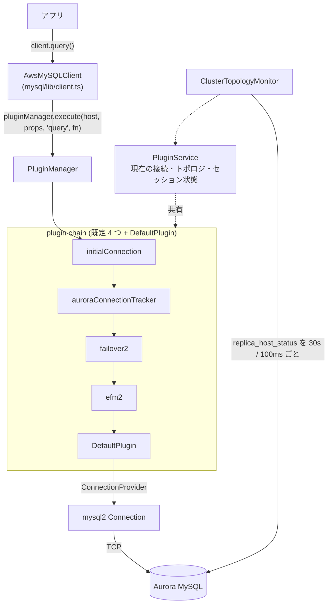

`mysql2/promise` の `createConnection` を `AwsMySQLClient` に置き換える。それだけで、Aurora MySQL のフェイルオーバーを「乗り切る」接続になる。

```ts
import { AwsMySQLClient } from "aws-advanced-nodejs-wrapper";

const client = new AwsMySQLClient({
  host: "my-cluster.cluster-xyz.us-east-1.rds.amazonaws.com",
  user: "app",
  password: "...",
  database: "app",
});
await client.connect();
const [rows] = await client.query({ sql: "SELECT @@aurora_server_id" });
```

mysql2 のままだと、フェイルオーバーで何が起きるか。writer が落ちると接続は `Connection lost: The server closed the connection.` で死ぬ。クラスタエンドポイントに張り直すと、DNS の TTL が切れるまで**古い writer** に繋がる。古い writer はすでに reader に降格しているので、次の `INSERT` は `errno 1290: The MySQL server is running with the --read-only option` で落ちる。mysql2 はこのどれも知らない。mysql2 は **1 本の TCP 接続の上で MySQL プロトコルを話す**だけで、クラスタも writer/reader の役割も、DNS が嘘をつくことも、その責務の外にある。

mysql2 自身が持つ唯一の「クラスタ対応」は `PoolCluster` で、それはアプリが列挙した静的なノード一覧と、接続取得に失敗した回数だけで動く。

ラッパが足しているのは、次の 5 つの「知識」である。この章の群もそれに沿って切ってある。

1. **トポロジを知る。** DNS を待たず、`information_schema.replica_host_status` を SQL で読む
2. **障害を早く知る。** TCP タイムアウトを待たず、監視用接続で `SELECT 1` を打ち続ける
3. **接続を差し替えても壊れないようにする。** `SET autocommit` や `USE` を追跡し、新しい接続に転送する
4. **AWS の認証を知る。** IAM トークンを生成してパスワードの代わりに送る、Secrets Manager から取る
5. **運用イベントを知る。** Blue/Green 切り替え、カスタムエンドポイント、Global Database

これらを差し込む骨格が、全メソッド呼び出しが通る **1 本の plugin chain** だ。



## この OSS について

- Apache 2.0。TypeScript で、`common/lib` + `mysql/lib` が約 28,000 行 (`pg/` を除く)。`mysql2 ^3.22.3` と `pg ^8.21.0` は optional peerDependencies で、どちらか一方だけ入れればよい。バージョン 3.0.0 (2026-08-20) の直後の `main` を読む。
- **接続を自分では張らない。** `DriverConnectionProvider` が mysql2 の `createConnection` を呼ぶだけで、ラッパがやるのは「呼び出しの前後に割り込む」ことである。
- **全メソッドが plugin chain を通る。** `AwsMySQLClient.query()` は `pluginManager.execute(host, props, "query", fn)` に包まれる。各プラグインは `subscribedMethods` で自分が興味のあるメソッドだけ受け取り、それ以外は素通しになる。
- **既定プラグインは 4 つ。** `initialConnection,auroraConnectionTracker,failover2,efm2`。`plugins` に列挙した順ではなく、`customEndpoint` = 380 から `dev` = 1400 までの weight で自動整列される。
- **トポロジは DNS ではなく SQL で聞く。** Aurora なら `information_schema.replica_host_status`、Multi-AZ なら `mysql.rds_topology`。通常は 30 秒ごと、フェイルオーバーを疑ったら 100ms ごとに全ホストへ「自分は writer か」を聞く。
- **エラー分類が文字列一致。** `MySQLErrorHandler.isNetworkError` は `"Connection lost: The server closed the connection."` など 6 つの文字列を `includes` で見る。mysql2 側の文言が変わると壊れる。
- **クエリタイムアウトは自前。** `ClientUtils.queryWithTimeout` が `Promise.race` で既定 20 秒 (`wrapperQueryTimeout`) を掛け、mysql2 のエラーを `AwsWrapperError` に包む。
- **フェイルオーバーの成功を例外で知らせる。** 接続の差し替えに成功しても `FailoverSuccessError` を投げる。アプリはそれを捕まえてセッション設定をやり直し、クエリを再実行する。この契約を知らないと、成功した接続をアプリ側で捨ててしまう。
- **IAM 認証は MySQL では cleartext。** Aurora は トークン認証ユーザに `mysql_clear_password` プラグインを要求し、mysql2 は `enableCleartextPlugin` なしでは拒む。3.0.0 で `ssl` 設定時だけ自動で立てるようになった。
- **`clusterId` の既定が `"1"`。** 3.0.0 で URL からの自動導出を捨てた。複数クラスタに繋ぐアプリが設定を忘れると、トポロジキャッシュとモニタを共有してしまい、別クラスタへフェイルオーバーする。
- **外部プールは毎クエリ plugin chain を作る。** `AwsMySQLPoolClient.query()` は呼ぶたびに `PluginManager` + `PluginService` 一式を持つ `AwsMySQLPooledConnection` を生成して捨てる。

## 読む順番

**群 2 (骨格) は必ず読んでほしい。** 以降の全ページが `pluginManager.execute`・`PluginService`・2 種類の Dialect を前提に書かれている。群 1 は前提で、Aurora の運用経験があるなら 4・5 ページ目 (Aurora の自己申告メタデータ、`rds_topology`) と 7〜9 ページ目 (PoolCluster、認証プラグイン交渉、IAM DB 認証) だけ拾えば先へ進める。

群 3〜6 がラッパの中核で、「知る → 切り替える → 早く気づく → 壊さない」の順に並べてある。群 7・8 は AWS 固有の機能で、使わないなら飛ばしてよい。群 9 の最後の 1 ページが章の総括で、mysql2 の `PoolCluster` と何が違うのかを比較表で答える。

前提 — Aurora MySQL と mysql2:

- [Aurora MySQL クラスタの構造 — writer/reader と 4 種のエンドポイント](./aurora-mysql-cluster/)
- [フェイルオーバーで何が起きるか](./what-happens-on-failover/)
- [RDS Multi-AZ DB Cluster — Aurora と何が違うか](./rds-multi-az-cluster/)
- [Aurora MySQL の自己申告メタデータ](./aurora-metadata/)
- [`mysql.rds_topology` — Multi-AZ と Blue/Green が共有する表](./rds-topology-table/)
- [mysql2 の接続とクエリ](./mysql2-connection-and-query/)
- [mysql2 の PoolCluster — ドライバ側「クラスタ対応」の上限](./mysql2-pool-cluster/)
- [mysql2 の認証プラグイン交渉](./mysql2-auth-plugin-negotiation/)
- [IAM DB 認証の仕組み](./iam-db-auth/)

骨格 — 呼び出しを横取りする仕掛け:

- [アーキテクチャを一枚で読む](./architecture/)
- [AwsMySQLClient — 全メソッドが `pluginManager.execute` を通る](./aws-mysql-client/)
- [PluginChain — subscribed methods とクロージャの入れ子](./plugin-chain/)
- [プラグインの並び順 — weight による自動ソートと既定 4 プラグイン](./plugin-order/)
- [9 本のパイプライン](./pipelines/)
- [PluginService — プラグインが共有する唯一の状態置き場](./plugin-service/)
- [DefaultPlugin と ConnectionProvider](./default-plugin-and-connection-provider/)
- [2 種類の Dialect — DriverDialect と DatabaseDialect](./two-dialects/)
- [Dialect の自動判定](./dialect-resolution/)
- [MySQLErrorHandler — 文字列一致で分類する](./mysql-error-handler/)
- [WrapperProperties — mysql2 に渡す前に剥がす](./wrapper-properties/)
- [CoreServicesContainer — プロセス全体で共有される 3 サービス](./core-services-container/)

トポロジを知る:

- [HostInfo と HostRole と可用性](./host-info/)
- [RdsUtils — エンドポイント文字列を正規表現で分類する](./rds-utils/)
- [clusterInstanceHostPattern — `?` テンプレート](./cluster-instance-host-pattern/)
- [HostListProvider 2 種 — 接続文字列 vs RDS トポロジ](./host-list-providers/)
- [トポロジクエリ (Aurora MySQL)](./topology-query-aurora/)
- [トポロジクエリ (Multi-AZ MySQL)](./topology-query-multi-az/)
- [identifyConnection — この接続はどのインスタンスか](./identify-connection/)
- [ClusterTopologyMonitor — 低速・パニック・高速の 3 モード](./cluster-topology-monitor/)
- [「自分は writer か」を全ホストに聞く](./am-i-a-writer/)
- [clusterId — キャッシュとモニタの共有単位](./cluster-id/)
- [ホスト可用性戦略と選択戦略](./host-availability-and-selection/)

フェイルオーバー:

- [全体像 — 例外を捕まえ、接続を差し替え、例外を投げ直す](./failover-overview/)
- [何をトリガとするか](./failover-triggers/)
- [failoverMode と URL からの既定値](./failover-mode/)
- [failover2 の writer フェイルオーバー — モニタに任せて待つ](./failover2-writer/)
- [failover2 の reader フェイルオーバー](./failover2-reader/)
- [FailoverSuccessError — 成功なのに例外を投げる契約](./failover-success-error/)
- [TransactionResolutionUnknownError](./transaction-resolution-unknown/)
- [failover (v1) — Task A / Task B と 2 並列 reader 接続試行](./failover-v1/)
- [Multi-AZ 向け FailoverRestriction](./failover-restriction-multi-az/)
- [StaleDns — クラスタエンドポイントが古い writer を指すとき](./stale-dns/)
- [initialConnection プラグイン](./initial-connection-strategy/)
- [auroraConnectionTracker — 遊休接続を writer 交代時に切る](./connection-tracker/)
- [時間設計 — タイムアウト群と normal/aggressive プロファイル](./failover-timing/)

障害を早く知る — EFM:

- [なぜ EFM が要るか](./why-efm/)
- [failureDetectionTime / Interval / Count — 監視の状態機械](./failure-detection-params/)
- [HostMonitor — `SELECT 1` と forceConnect で生死判定](./host-monitor/)
- [efm と efm2 の違い — 2 タスク分離](./efm-v1-vs-v2/)
- [MonitorService — 監視タスクの生成・共有・破棄](./monitor-service/)

接続を差し替えても壊れないようにする:

- [SessionState — 5 つの設定と pristine 値](./session-state/)
- [SQL を読んで状態を追う](./tracking-state-from-sql/)
- [トランザクション境界の追跡](./transaction-boundary/)
- [差し替え時の転送と close 時のリセット](./transfer-and-reset/)
- [readWriteSplitting — setReadOnly の SQL を横取りする](./read-write-splitting/)
- [内部コネクションプール — インスタンスごとの mysql2 Pool](./internal-connection-pool/)
- [AwsMySQLPoolClient — 外部プールの正体](./aws-mysql-pool-client/)
- [接続の寿命管理](./connection-lifetime/)

AWS の認証:

- [IAM 認証プラグイン](./iam-plugin/)
- [MySQL で IAM を使うと cleartext になる](./iam-cleartext-on-mysql/)
- [Secrets Manager プラグイン](./secrets-manager-plugin/)
- [federatedAuth / okta — SAML から IAM トークンまで](./federated-and-okta/)

運用イベントを知る:

- [Blue/Green 切り替えで何が起きるか](./blue-green-switchover/)
- [BlueGreenStatusMonitor — blue と green を別接続で監視する](./blue-green-status-monitor/)
- [BlueGreenStatusProvider — フェーズ遷移と routing](./blue-green-status-provider/)
- [Blue/Green の MySQL 側メタデータ](./blue-green-mysql-metadata/)
- [customEndpoint プラグイン](./custom-endpoint/)
- [Aurora Global Database — 地域をまたぐトポロジ](./global-database/)
- [gdbFailover — home region と in-home / out-of-home](./gdb-failover/)
- [互換性表を読む](./compatibility-matrix/)

横断:

- [Telemetry — OpenTelemetry / X-Ray](./telemetry/)
- [Developer プラグイン — エラー注入](./developer-plugin/)
- [バックグラウンドタスクと Node.js プロセス](./background-tasks-and-process/)
- [統合テストの作り方](./integration-tests/)
- [PoolCluster と何が違うのか — 比較表で答える](./vs-pool-cluster/)

## 対象外

- **Limitless** と **`rds_tools`**。PostgreSQL 専用で、MySQL のコードパスには出てこない
- **Configuration Profiles / Presets**。MySQL で使うと例外を投げる。`profileName` を設定しても動かない
- **`pg/` 配下と PG 用 Dialect**。PG と共通のコアは MySQL のコードパスだけで説明する
- **mysql2 の内部** (パケットパーサ、プロトコル実装)。群 1 で接続・プール・認証交渉の外形だけ押さえる
