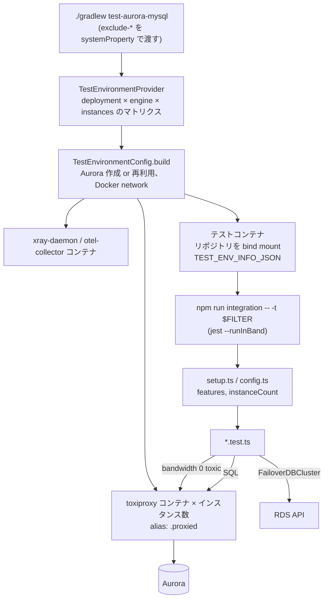

## 何を学んだか

`tests/integration/` は 2 層に分かれている。

- **host 層** (`tests/integration/host/`、Java + Gradle + testcontainers): Aurora クラスタの作成か再利用、Docker ネットワーク、インスタンスごとの toxiproxy コンテナ、テレメトリ用コンテナ、そしてテストを走らせるコンテナを組み立てる
- **container 層** (`tests/integration/container/tests/`、jest): 組み立てられた環境の情報を `TEST_ENV_INFO_JSON` 環境変数で受け取り、ラッパの契約を検証する

障害の作り方は 2 通りで、それぞれ検証したい契約が違う。**toxiproxy の帯域 0** は「パケットが消える」黒穴で、EFM が検知すべき障害を再現する。**RDS API の `FailoverDBCluster`** は本物の昇格を起こし、役割の入れ替わりと DNS の古さを含めたフェイルオーバーの契約を検証する。

ただし現 ref には落とし穴がある。`jest.integration.config.json` の `testMatch` は `tests/integration/container/tests/*.(spec|test).ts` で、`*` はディレクトリ境界を越えない。3.0.0 でフェイルオーバーのテストが `failover/` 配下に移されたので、**`npm run integration` はフェイルオーバーの統合テストを 1 つも実行しない**。

## ソースコードのどこか

### 全体の流れ



### host 層 — マトリクスと exclude

[`tests/integration/host/build.gradle.kts#L114`](https://github.com/aws/aws-advanced-nodejs-wrapper/blob/6d0ba1bdae81a4e1fd274b3569c5dc50cf0a7095/tests/integration/host/build.gradle.kts#L114) の `test-aurora-mysql` は、`exclude-docker` / `exclude-performance` / `exclude-pg-driver` / `exclude-pg-engine` / `exclude-multi-az-cluster` / `exclude-multi-az-instance` / `exclude-bg` を `systemProperty` で立てる。タスクごとに違うのは、この除外の組み合わせだけである。

`TestEnvironmentProvider` ([L34](https://github.com/aws/aws-advanced-nodejs-wrapper/blob/6d0ba1bdae81a4e1fd274b3569c5dc50cf0a7095/tests/integration/host/src/test/java/integration/host/TestEnvironmentProvider.java#L34)) は deployment (Docker / Aurora / Multi-AZ instance / Multi-AZ cluster) × engine (MySQL / PG) × インスタンス数 (1, 2, 3, 5) を総当たりし、除外に当たる組を落とす。Aurora は 3 台構成をスキップし、Multi-AZ cluster は 3 台だけ通す。`NUM_INSTANCES` 環境変数で 1 つに絞れる。各組が `TestEnvironmentFeatures` の集合を持ち、`FAILOVER_SUPPORTED` / `NETWORK_OUTAGES_ENABLED` / `IAM` / `RDS_MULTI_AZ_SUPPORTED` などが jest 側の `itIf` の材料になる。

`ContainerHelper.runTest` ([L98](https://github.com/aws/aws-advanced-nodejs-wrapper/blob/6d0ba1bdae81a4e1fd274b3569c5dc50cf0a7095/tests/integration/host/src/test/java/integration/host/util/ContainerHelper.java#L98)) がテストコンテナの中で `npm install --no-save` してから jest を起動する。

```java title="tests/integration/host/src/test/java/integration/host/util/ContainerHelper.java"
final String filter = System.getenv("FILTER");

Long exitCode;
if (filter != null) {
    exitCode = execInContainer(container, consumer, "npm", "run", "integration", "--", "-t", filter);
} else {
    exitCode = execInContainer(container, consumer, "npm", "run", "integration", "--abort-on-uncaught-exception");
}
```

`FILTER` はそのまま jest の `-t` (テスト名の正規表現) になる。toxiproxy は [`ghcr.io/shopify/toxiproxy:2.9.0`](https://github.com/aws/aws-advanced-nodejs-wrapper/blob/6d0ba1bdae81a4e1fd274b3569c5dc50cf0a7095/tests/integration/host/src/test/java/integration/host/util/ContainerHelper.java#L56) をインスタンスごとに 1 コンテナ立て、`<instance host>.proxied` のようなネットワークエイリアスを付ける。jest 側は `clusterInstanceHostPattern: "?." + proxyDatabaseInfo.instanceEndpointSuffix` でその接尾辞を教える ([clusterInstanceHostPattern](../cluster-instance-host-pattern/))。

### container 層 — jest の設定

`package.json` の `integration` スクリプトは `jest --config=jest.integration.config.json --runInBand --verbose`。`--runInBand` で直列にしているのは、toxiproxy の toxic や static な状態 ([Developer プラグイン](../developer-plugin/)) がテスト間で干渉するからである。

[`jest.integration.config.json#L4`](https://github.com/aws/aws-advanced-nodejs-wrapper/blob/6d0ba1bdae81a4e1fd274b3569c5dc50cf0a7095/jest.integration.config.json#L4)。

```json title="jest.integration.config.json"
{
  "testTimeout": 3600000,
  "testMatch": ["<rootDir>/tests/integration/container/tests/*.(spec|test).ts|tsx"],
  "globalSetup": "<rootDir>/tests/integration/container/tests/setup.ts",
  "setupFilesAfterEnv": ["<rootDir>/tests/integration/container/tests/config.ts"]
}
```

`testMatch` の `*` は micromatch のグロブで、`/` を跨がない。`tests/failover/aurora_failover.test.ts` は一致しない。PR #685 (3.0.0 の Global Database 対応) が `aurora_failover.test.ts` と `aurora_failover2.test.ts` をトップレベルから `failover/` に移し、共通部分を `failover_tests.ts` にくくり出した。その際に `testMatch` は更新されていない。`git log` でこのファイルの最終変更は 2.0.0 のままである。

`config.ts` ([L39](https://github.com/aws/aws-advanced-nodejs-wrapper/blob/6d0ba1bdae81a4e1fd274b3569c5dc50cf0a7095/tests/integration/container/tests/config.ts#L39)) は `TEST_ENV_INFO_JSON` から `features` と `instanceCount` を export し、`afterAll` で OTel SDK を落とす。`setup.ts` は HTML レポートの出力先を環境名で決めるだけである。

### toxiproxy — 帯域 0 の toxic

[`utils/proxy_helper.ts#L47`](https://github.com/aws/aws-advanced-nodejs-wrapper/blob/6d0ba1bdae81a4e1fd274b3569c5dc50cf0a7095/tests/integration/container/tests/utils/proxy_helper.ts#L47)。

```ts title="tests/integration/container/tests/utils/proxy_helper.ts"
private static async disableProxyConnectivity(proxyInfo: ProxyInfo) {
  const proxy = proxyInfo.proxy;

  if (proxy !== undefined) {
    await proxy.addToxic(<ICreateToxicBody<Bandwidth>>{
      attributes: <Bandwidth>{ rate: 0 },
      type: "bandwidth",
      name: "DOWN-STREAM",
      stream: "downstream",
      toxicity: 1
    });

    await proxy.addToxic(<ICreateToxicBody<Bandwidth>>{
      attributes: <Bandwidth>{ rate: 0 },
      type: "bandwidth",
      name: "UP-STREAM",
      stream: "upstream",
      toxicity: 1
    });
  }
}
```

TCP 接続は切らない。上りも下りも帯域 0 にして、パケットを届かなくする。クライアントから見ると `RST` も `FIN` も来ないので、`Connection lost` にはならず、返事を待ち続ける。これは EFM が検知したい「固まる」障害そのもので ([なぜ EFM が要るか](../why-efm/))、`wrapperQueryTimeout` か EFM のプローブしか気づく手段がない。`enableProxyConnectivity` は 2 つの toxic を名前で消す。

インスタンス単位 (`disableConnectivity(engine, instanceId)`) と全部 (`disableAllConnectivity`) がある。Multi-AZ ではクラスタエンドポイントにも proxy があるので、`simulateTemporaryFailure` はそれも一緒に落とす。

### 本物のフェイルオーバー

[`utils/aurora_test_utility.ts#L232`](https://github.com/aws/aws-advanced-nodejs-wrapper/blob/6d0ba1bdae81a4e1fd274b3569c5dc50cf0a7095/tests/integration/container/tests/utils/aurora_test_utility.ts#L232)。

```ts title="tests/integration/container/tests/utils/aurora_test_utility.ts"
async failoverClusterAndWaitUntilWriterChanged(initialWriter?: string, clusterId?: string, targetWriterId?: string) {
  // ...
  const initialClusterAddress = await dns.promises.lookup(clusterEndpoint);

  await this.failoverClusterToTarget(clusterId, targetWriterId);

  let remainingAttempts: number = 5;
  while (!(await this.writerChanged(initialWriter, clusterId, 300))) {
    remainingAttempts -= 1;
    if (remainingAttempts === 0) {
      throw new Error("failover request unsuccessful");
    }
    await this.failoverClusterToTarget(clusterId, targetWriterId);
  }

  let clusterAddress: dns.LookupAddress = await dns.promises.lookup(clusterEndpoint);
  while (clusterAddress === initialClusterAddress) {
    await sleep(1000);
    clusterAddress = await dns.promises.lookup(clusterEndpoint);
  }
}
```

`failoverClusterToTarget` が `FailoverDBClusterCommand` を最大 10 回投げ、`writerChanged` が `DescribeDBClusters` を 3 秒ごとに読んで writer が変わるのを待つ。最後の `while` は「クラスタエンドポイントの DNS が新 writer を指すまで待つ」つもりのコードだが、`dns.promises.lookup` は呼ぶたびに新しいオブジェクトを返すので `===` は常に false になり、**ループは 1 度も回らない**。DNS の伝播は待てていない。テストが通っているなら、それは `writerChanged` のポーリングと、ラッパ側のトポロジ監視が DNS に頼らないからである ([StaleDns](../stale-dns/))。

### テスト本体 — createFailoverTests

[`failover/failover_tests.ts#L34`](https://github.com/aws/aws-advanced-nodejs-wrapper/blob/6d0ba1bdae81a4e1fd274b3569c5dc50cf0a7095/tests/integration/container/tests/failover/failover_tests.ts#L34) は `{ plugins }` を受け取ってテスト群を返す関数で、`aurora_failover.test.ts` が `"failover"`、`aurora_failover2.test.ts` が `"failover2"` で呼ぶ。v1 と v2 が同じ契約を満たすことを、同じテストで確かめる形になっている。

4 つのテストが、章で説明してきた契約に 1 対 1 で対応する。

| テスト名                                                 | 検証している契約                                                                                                                                               | 障害の作り方 |
| -------------------------------------------------------- | -------------------------------------------------------------------------------------------------------------------------------------------------------------- | ------------ |
| fails from writer to new writer on connection invocation | 次のクエリが `FailoverSuccessError` を投げ、その次のクエリが新 writer に届く ([FailoverSuccessError](../failover-success-error/))                              | RDS API      |
| writer fails within transaction                          | `START TRANSACTION` 後の失敗は `TransactionResolutionUnknownError`、`INSERT` は 0 行 ([TransactionResolutionUnknownError](../transaction-resolution-unknown/)) | RDS API      |
| fails from writer and transfers session state            | `setReadOnly` / `setTransactionIsolation` / `setAutoCommit` / `setCatalog` が新接続でも読める ([差し替え時の転送](../transfer-and-reset/))                     | RDS API      |
| fails from reader to writer (2 台構成のみ)               | reader を黒穴にすると `FailoverSuccessError` の後に writer へ繋がる ([failover2 の reader フェイルオーバー](../failover2-reader/))                             | toxiproxy    |

`afterEach` ([L102](https://github.com/aws/aws-advanced-nodejs-wrapper/blob/6d0ba1bdae81a4e1fd274b3569c5dc50cf0a7095/tests/integration/container/tests/failover/failover_tests.ts#L102)) は toxic を全部外し、クライアントを `end()` して、`PluginManager.releaseResources()` を呼ぶ。これがないとモニタが次のテストに持ち越される ([バックグラウンドタスクと Node.js プロセス](../background-tasks-and-process/))。

`aurora_failover.test.ts` にはもう 1 つ `describe("aurora failover - efm specific")` があり、`plugins: "failover,efm2"` に `failureDetectionTime: 2000` / `failureDetectionInterval: 1000` / `failureDetectionCount: 2` / `monitoring_wrapperQueryTimeout: 3000` という攻めた値を入れて、`simulateTemporaryFailure` (toxic を非同期に入れて 5 秒後に外す) で EFM の検知を確かめる ([failureDetectionTime / Interval / Count](../failure-detection-params/))。

### テレメトリも一緒に通す

`initDefaultConfig` は全部 `enableTelemetry: true` と `telemetryTracesBackend: "OTLP"` を入れる。`test_environment.ts` ([L284](https://github.com/aws/aws-advanced-nodejs-wrapper/blob/6d0ba1bdae81a4e1fd274b3569c5dc50cf0a7095/tests/integration/container/tests/utils/test_environment.ts#L284)) が jest プロセスの中で `NodeSDK` を起動し、host 層が立てた collector コンテナに OTLP で送る。統合テストは同時にテレメトリのコードパスの回帰テストでもある。X-Ray バックエンドはここでも使われないので、`new` 抜けが見つからない ([Telemetry](../telemetry/))。

## なぜそうなっているか

### なぜ host 層が Java なのか

Aurora クラスタの作成・削除、セキュリティグループへの IP 追加、Docker ネットワークと複数コンテナの組み立て、と環境構築の大半が AWS と Docker の操作である。testcontainers の Java 実装は `ToxiproxyContainer` を標準で持ち、JUnit の `TestTemplate` でマトリクスを展開できる。jest からこれを全部やるより、既存の道具に乗ったほうが短い。JDBC 版のラッパが同じ構造を先に持っていて、それを流用したと読める。

テストを Docker の中で走らせるのは、`<instance>.proxied` というホスト名が Docker ネットワークの中でしか解決できないからである。ホスト側で jest を動かすと、`clusterInstanceHostPattern` で教えた接尾辞が DNS で引けない。

### なぜ帯域 0 なのか

インスタンスを止めれば `Connection lost` になり、それは mysql2 だけで検知できる。ラッパが足している価値は「返事が来ない」ケースの検知であり、それを作るには接続を生かしたままパケットを捨てる必要がある。toxiproxy の `bandwidth` toxic を `rate: 0` にするのがその最短手で、`timeout` toxic (一定時間後に切る) では黒穴にならない。

### なぜフェイルオーバーは本物なのか

toxiproxy で writer を落としても、Aurora は昇格しない。役割の入れ替わり、`replica_host_status` の更新、クラスタエンドポイントの DNS の遅れは、本物のクラスタでしか起きない。テストの費用 (`Both approaches will incur costs.` と docs にある) を払ってでも API で起こすのは、ラッパの中核がまさにその挙動への追従だからである。

2 台・5 台の構成を分けて回すのも同じ理由で、2 台では writer と reader が入れ替わるだけ、5 台では reader のどれが昇格するか分からない ([フェイルオーバーで何が起きるか](../what-happens-on-failover/))。`itIfTwoInstance` の reader → writer テストは、reader を落とせば残りが writer しかない 2 台構成でだけ意味がある。

### なぜ 1 本のテストを 2 つのプラグインで共有するのか

`failover` と `failover2` は実装が違うが、アプリから見た契約は同じでなければならない。`createFailoverTests` が契約の仕様書で、2 つの `describe` はその実装が 2 つあるという事実の反映である。テストが仕様を兼ねる形は、[failover (v1)](../failover-v1/) と [failover2](../failover2-writer/) の違いを読むときに、何が変わってはいけないのかの答えになる。

## どう活かすか

- **黒穴の再現は帯域 0。** 接続を切る障害と、返事が来ない障害は別物で、後者を作るのに toxiproxy の `bandwidth rate 0` は最短の道具になる。`latency` toxic で「遅い」も作れる
- **テストファイルを移動したら `testMatch` を見る。** `*` は `/` を跨がない。`**/*.test.ts` にしておけば移動で消えない。ラッパのフェイルオーバーテストは現 ref で消えている
- **契約を 1 本のテストにして、実装を差し替える。** v1 / v2 のような並存では、テスト関数にプラグイン名を渡す形が、契約の共通部分を明示する最も安い方法になる
- **オブジェクトの `===` で「変わった」を判定しない。** `dns.lookup` の結果比較は毎回 false になる。`address` フィールドを比べる
- **`afterEach` で背景タスクを止める。** モニタや static キャッシュを持つライブラリのテストでは、テスト間の持ち越しを潰す後始末が、テスト自体より先に要る

### 実務で踏む失敗パターン

- **`./gradlew test-aurora-mysql` を回してフェイルオーバーのテストが 1 つも出てこない。** `testMatch` の問題。`FILTER` を指定しても、そもそも収集されていないので当たらない
- **`FILTER` にテスト名を入れたのに全部走る。** `FILTER` は環境変数で、Gradle の引数ではない。`FILTER="fails from writer" ./gradlew ...` の形で渡す
- **`REUSE_RDS_DB=true` なのにクラスタが作られる。** `RDS_DB_NAME` と `RDS_DB_DOMAIN` の両方が要る。片方が空だと新規作成に倒れる
- **ローカルで通るテストが CI で `getPluginInstance()` に落ちる。** `dev_plugin.test.ts` がまさにそれで、原因未解明のまま `it.skip` になっている。static 状態と並列実行の組み合わせを疑う
- **テスト後にリソースが残る。** docs の TIP にあるとおり、失敗するとクラスタが消えないことがある。`RDS_DB_NAME` に一意な名前を付け、失敗後は手で消す
