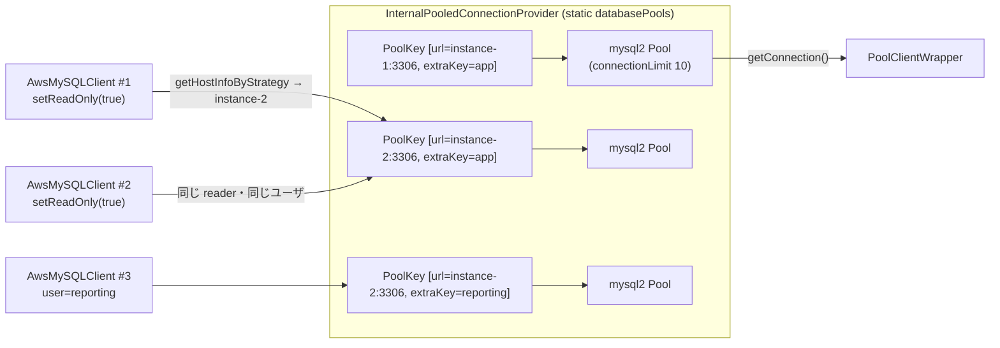

## 何を学んだか

`InternalPooledConnectionProvider` は、`connectionProvider` プロパティに渡すと**インスタンスごとに mysql2 の Pool を自動生成する** `ConnectionProvider` である。readWriteSplitting が `setReadOnly` のたびに reader 接続を張る代わりに、プールから借りる。

- プールの単位は **`PoolKey(インスタンス URL, extraKey)`** で、`extraKey` の既定はユーザ名。`InternalPoolMapping` を渡せばキーの作り方を変えられる
- プールの集合は **クラスの static フィールド**で、プロセス内の全 provider・全 client が共有する。同じインスタンスに同じユーザで繋ぐ限り、client がいくつあってもプールは 1 つ
- **クラスタエンドポイントはプールしない。** `acceptsUrl` が `RDS_INSTANCE` のときだけ true を返すので、`cluster-xxx.rds.amazonaws.com` への初回接続は `DriverConnectionProvider` に流れる
- プールの寿命は 30 分の sliding expiration + 10 分ごとの掃除で、**アクティブ接続が 0 のプールだけ** `end()` される
- `leastConnections` 戦略は mysql2 Pool の `_freeConnections` / `_allConnections` という**private な Queue の長さ**を直接読む



## ソースコードのどこか

### 静的なプール集合

[`common/lib/internal_pooled_connection_provider.ts#L44`](https://github.com/aws/aws-advanced-nodejs-wrapper/blob/6d0ba1bdae81a4e1fd274b3569c5dc50cf0a7095/common/lib/internal_pooled_connection_provider.ts#L44)。

```ts title="common/lib/internal_pooled_connection_provider.ts"
export class InternalPooledConnectionProvider implements PooledConnectionProvider, CanReleaseResources {
  static readonly CACHE_CLEANUP_NANOS: bigint = BigInt(10 * 60_000_000_000); // 10 minutes
  static readonly POOL_EXPIRATION_NANOS: bigint = BigInt(30 * 60_000_000_000); // 30 minutes
  protected static databasePools: SlidingExpirationCacheWithCleanupTask<string, any> = new SlidingExpirationCacheWithCleanupTask(
    InternalPooledConnectionProvider.CACHE_CLEANUP_NANOS,
    (pool: any) => pool.getActiveCount() === 0,
    async (pool: any) => await pool.end(),
    "InternalPooledConnectionProvider.databasePools"
  );

  private static readonly acceptedStrategies: Map<string, HostSelector> = new Map([
    [RandomHostSelector.STRATEGY_NAME, new RandomHostSelector()],
    [RoundRobinHostSelector.STRATEGY_NAME, new RoundRobinHostSelector()],
    [LeastConnectionsHostSelector.STRATEGY_NAME, new LeastConnectionsHostSelector(InternalPooledConnectionProvider.databasePools)]
  ]);

  constructor(poolConfig?: AwsPoolConfig, mapping?: InternalPoolMapping, poolExpirationNanos?: bigint, poolCleanupNanos?: bigint) {
    this._poolMapping = mapping;
    InternalPooledConnectionProvider.poolExpirationCheckNanos = poolExpirationNanos ?? InternalPooledConnectionProvider.POOL_EXPIRATION_NANOS;
    InternalPooledConnectionProvider.databasePools.cleanupIntervalNs = poolCleanupNanos ?? InternalPooledConnectionProvider.CACHE_CLEANUP_NANOS;
    this._poolConfig = poolConfig ?? new AwsPoolConfig({});
  }

  acceptsUrl(hostInfo: HostInfo, props: Map<string, any>): boolean {
    const urlType: RdsUrlType = this.rdsUtil.identifyRdsType(hostInfo.host);
    return RdsUrlType.RDS_INSTANCE === urlType;
  }
```

`databasePools` は `SlidingExpirationCacheWithCleanupTask` で、`shouldDisposeFunc` = `getActiveCount() === 0`、`disposalFunc` = `pool.end()` である ([接続の寿命管理](../connection-lifetime/))。static なので、provider を 2 つ作っても中身は同じ Map で、コンストラクタで渡した `poolExpirationNanos` / `poolCleanupNanos` は**最後に作った provider の値でプロセス全体が上書きされる**。

### `connect` — キーを組み立ててプールを引く

[L83](https://github.com/aws/aws-advanced-nodejs-wrapper/blob/6d0ba1bdae81a4e1fd274b3569c5dc50cf0a7095/common/lib/internal_pooled_connection_provider.ts#L83)。

```ts title="common/lib/internal_pooled_connection_provider.ts"
async connect(hostInfo: HostInfo, pluginService: PluginService, props: Map<string, any>): Promise<ConnectionInfo> {
  const resultProps = new Map(props);
  resultProps.set(WrapperProperties.HOST.name, hostInfo.host);
  if (hostInfo.isPortSpecified()) {
    resultProps.set(WrapperProperties.PORT.name, hostInfo.port);
  }

  let connectionHostInfo: HostInfo = hostInfo;
  // (Blue/Green の green ホスト名置換。省略)

  const dialect = pluginService.getDriverDialect();
  const preparedConfig = dialect.preparePoolClientProperties(resultProps, this._poolConfig);
  this.internalPool = InternalPooledConnectionProvider.databasePools.computeIfAbsent(
    new PoolKey(connectionHostInfo.url, this.getPoolKey(connectionHostInfo, resultProps)).getPoolKeyString(),
    () => dialect.getAwsPoolClient(preparedConfig),
    InternalPooledConnectionProvider.poolExpirationCheckNanos
  );

  const poolClient = await this.getPoolConnection(connectionHostInfo, props);
  pluginService.attachErrorListener(poolClient);
  return new ConnectionInfo(poolClient, true);
}

async getPoolConnection(hostInfo: HostInfo, props: Map<string, string>) {
  return new PoolClientWrapper(await this.internalPool!.connect(), hostInfo, props);
}

getPoolKey(hostInfo: HostInfo, props: Map<string, any>) {
  return this._poolMapping?.getPoolKey(hostInfo, props) ?? WrapperProperties.USER.get(props);
}
```

キーは `PoolKey [url=instance-1.xxx.rds.amazonaws.com:3306, extraKey=app]` のような文字列になる ([`pool_key.ts#L34`](https://github.com/aws/aws-advanced-nodejs-wrapper/blob/6d0ba1bdae81a4e1fd274b3569c5dc50cf0a7095/common/lib/utils/pool_key.ts#L34))。`computeIfAbsent` は既存があればそれを返し、なければ `getAwsPoolClient` で新規に作る。**プール設定 (`AwsPoolConfig`) はキーに含まれない**ので、同じ URL + ユーザで別の `maxConnections` を持つ provider を 2 つ作っても、最初に作られたプールが使い回される。

`ConnectionInfo(poolClient, true)` の `true` が `isPooled` で、`DefaultPlugin` がこれを `pluginService.setIsPooledClient(true)` に写す ([`default_plugin.ts#L88`](https://github.com/aws/aws-advanced-nodejs-wrapper/blob/6d0ba1bdae81a4e1fd274b3569c5dc50cf0a7095/common/lib/plugins/default_plugin.ts#L88))。readWriteSplitting はこのフラグで「この reader はプール由来か」を判断し、寿命を変える ([readWriteSplitting](../read-write-splitting/))。

### `PoolClientWrapper` — abort が release になる

[`common/lib/pool_client_wrapper.ts#L23`](https://github.com/aws/aws-advanced-nodejs-wrapper/blob/6d0ba1bdae81a4e1fd274b3569c5dc50cf0a7095/common/lib/pool_client_wrapper.ts#L23)。

```ts title="common/lib/pool_client_wrapper.ts"
export class PoolClientWrapper implements ClientWrapper {
  abort(): Promise<void> {
    return this.end();
  }

  async end(): Promise<void> {
    try {
      return this.client?.release();
    } catch (error: any) {
      // Ignore
    }
  }
}
```

通常接続の `MySQLClientWrapper.abort()` は mysql2 の `destroy()` (ソケットを即座に閉じる) だが ([`mysql_client_wrapper.ts#L67`](https://github.com/aws/aws-advanced-nodejs-wrapper/blob/6d0ba1bdae81a4e1fd274b3569c5dc50cf0a7095/common/lib/mysql_client_wrapper.ts#L67))、プール版は `end()` も `abort()` も **`release()`** で、接続はプールに戻る。ラッパが「捨てる」つもりで呼んだ `abort` でも、プールの中では生き続ける。

壊れた接続がプールに戻る心配は mysql2 側が受け持つ。`PoolConnection` は自分の `error` / `end` イベントで `_removeFromPool` する ([`lib/pool_connection.js#L11`](https://github.com/sidorares/node-mysql2/blob/d8932925b237f07b6410263770379998df973502/lib/pool_connection.js#L11))。`release()` 時にプールが閉じていれば何もしない ([L23](https://github.com/sidorares/node-mysql2/blob/d8932925b237f07b6410263770379998df973502/lib/pool_connection.js#L23))。

### mysql2 への設定の写し方

[`mysql/lib/dialect/mysql2_driver_dialect.ts#L53`](https://github.com/aws/aws-advanced-nodejs-wrapper/blob/6d0ba1bdae81a4e1fd274b3569c5dc50cf0a7095/mysql/lib/dialect/mysql2_driver_dialect.ts#L53)。

```ts title="mysql/lib/dialect/mysql2_driver_dialect.ts"
preparePoolClientProperties(props: Map<string, any>, poolConfig: AwsPoolConfig | undefined): any {
  const finalPoolConfig: PoolOptions = {};
  const finalClientProps = WrapperProperties.removeWrapperProperties(props);
  this.setKeepAliveProperties(finalClientProps, props.get(WrapperProperties.KEEPALIVE_PROPERTIES.name));
  this.setConnectTimeout(finalClientProps, props.get(WrapperProperties.WRAPPER_CONNECT_TIMEOUT.name));

  Object.assign(finalPoolConfig, Object.fromEntries(finalClientProps.entries()));
  finalPoolConfig.connectionLimit = poolConfig?.maxConnections;
  finalPoolConfig.idleTimeout = poolConfig?.idleTimeoutMillis;
  finalPoolConfig.maxIdle = poolConfig?.maxIdleConnections;
  finalPoolConfig.waitForConnections = poolConfig?.waitForConnections;
  finalPoolConfig.queueLimit = poolConfig?.queueLimit;
  return finalPoolConfig;
}

getAwsPoolClient(props: PoolOptions): AwsInternalPoolClient {
  return new AwsMysqlInternalPoolClient(props);
}
```

`AwsPoolConfig` の既定は `maxConnections=10` / `idleTimeoutMillis=60000` / `maxIdleConnections=maxConnections` / `waitForConnections=true` / `queueLimit=0` ([`aws_pool_config.ts#L35`](https://github.com/aws/aws-advanced-nodejs-wrapper/blob/6d0ba1bdae81a4e1fd274b3569c5dc50cf0a7095/common/lib/aws_pool_config.ts#L35)) で、mysql2 の `PoolConfig` の既定と同じ値になる ([`lib/pool_config.js#L15`](https://github.com/sidorares/node-mysql2/blob/d8932925b237f07b6410263770379998df973502/lib/pool_config.js#L15))。IAM 認証と組み合わせると、この写し方が 2 つの問題を生む。1 つ目は**トークンがプールに固定される**ことである。`IamAuthenticationPlugin` は生成したトークンを `props` の `password` に書き込んで次段へ渡す ([`iam_authentication_plugin.ts#L119`](https://github.com/aws/aws-advanced-nodejs-wrapper/blob/6d0ba1bdae81a4e1fd274b3569c5dc50cf0a7095/common/lib/authentication/iam_authentication_plugin.ts#L119))。`preparePoolClientProperties` はその `password` を `createPool` の設定に写し、mysql2 の `Pool` は物理接続を増やすたびに**プール生成時の設定**で `PoolConnection` を作る ([`lib/base/pool.js#L74`](https://github.com/sidorares/node-mysql2/blob/d8932925b237f07b6410263770379998df973502/lib/base/pool.js#L74))。ところがキーは `url + user` だけで `password` を含まないので、トークンを再生成した 2 回目以降の `connect` でも `computeIfAbsent` は最初のプールを返し、新しい `preparedConfig` は捨てられる。トークンの有効期限 (15 分) を過ぎてからプールが足す物理接続は、期限切れトークンで `Access denied` になる ([IAM 認証プラグイン](../iam-plugin/))。2 つ目は、通常接続の `connect` にはある `setCleartextPluginForTokenAuth` の呼び出しが**ここにはない**ことで、3.0.0 で入った `enableCleartextPlugin` の自動設定が内部プール経路では効かない。IAM と内部プールを組み合わせるなら、`enableCleartextPlugin: true` を接続プロパティに明示し、プールの寿命 (30 分の sliding expiration) がトークンより長いことを前提に運用を組む必要がある ([MySQL で IAM を使うと cleartext になる](../iam-cleartext-on-mysql/))。

### `AwsMysqlInternalPoolClient` — private フィールドを読む

[`mysql/lib/icp/mysql_internal_pool_client.ts#L22`](https://github.com/aws/aws-advanced-nodejs-wrapper/blob/6d0ba1bdae81a4e1fd274b3569c5dc50cf0a7095/mysql/lib/icp/mysql_internal_pool_client.ts#L22)。

```ts title="mysql/lib/icp/mysql_internal_pool_client.ts"
export class AwsMysqlInternalPoolClient implements AwsInternalPoolClient {
  targetPool: any;

  constructor(props: PoolOptions) {
    this.targetPool = createPool(props);
  }

  async connect(): Promise<any> {
    try {
      return await this.targetPool.getConnection();
    } catch (error: any) {
      throw new AwsWrapperError(
        Messages.get("InternalPooledConnectionProvider.pooledConnectionFailed", error.message),
      );
    }
  }

  getIdleCount(): number {
    return this.targetPool.pool._freeConnections.length;
  }

  getTotalCount(): number {
    return this.targetPool.pool._allConnections.length;
  }

  getActiveCount(): number {
    return this.getTotalCount() - this.getIdleCount();
  }
}
```

`createPool` は `mysql2/promise` の `PromisePool` を返し、その `.pool` が callback 版の `BasePool` である。`_allConnections` と `_freeConnections` は `BasePool` のコンストラクタで作られる `denque` の `Queue` で ([`lib/base/pool.js#L46`](https://github.com/sidorares/node-mysql2/blob/d8932925b237f07b6410263770379998df973502/lib/base/pool.js#L46))、公開 API ではない。mysql2 側が名前を変えれば `getActiveCount()` は `undefined - undefined = NaN` になり、`NaN === 0` は false なので**プールが永久に掃除されなくなる**。

`getActiveCount()` は 2 箇所で使われる。掃除の条件 (`shouldDisposeFunc`) と、`LeastConnectionsHostSelector` の並べ替えである ([`least_connections_host_selector.ts#L48`](https://github.com/aws/aws-advanced-nodejs-wrapper/blob/6d0ba1bdae81a4e1fd274b3569c5dc50cf0a7095/common/lib/least_connections_host_selector.ts#L48))。

```ts title="common/lib/least_connections_host_selector.ts"
getNumConnections(hostInfo: HostInfo, databasePools: SlidingExpirationCache<string, any>): number {
  let numConnections: number = 0;
  const url: string = hostInfo.url;
  for (const [key, val] of databasePools.map.entries()) {
    if (!key.includes(url)) {
      continue;
    }
    numConnections += val.item.getActiveCount();
  }
  return numConnections;
}
```

キー文字列に `url` が含まれるプールを全部足す。ユーザが違っても同じインスタンスなら合算される。文字列の部分一致なので、`instance-1` と `instance-10` のように URL が前方一致する場合は誤って合算される。

### provider の選ばれ方

`connectionProvider` プロパティで渡した provider は `ConnectionProviderManager` の **effectiveProvider** になり、既定の `DriverConnectionProvider` と組になる ([`service_utils.ts#L67`](https://github.com/aws/aws-advanced-nodejs-wrapper/blob/6d0ba1bdae81a4e1fd274b3569c5dc50cf0a7095/common/lib/utils/service_utils.ts#L67))。

```ts title="common/lib/connection_provider_manager.ts"
getConnectionProvider(hostInfo: HostInfo | null, props: Map<string, any>): ConnectionProvider {
  if (hostInfo === null) {
    return this.defaultProvider;
  }
  if (this.effectiveProvider && this.effectiveProvider.acceptsUrl(hostInfo, props)) {
    return this.effectiveProvider;
  }
  return this.defaultProvider;
}
```

`acceptsUrl` が `RDS_INSTANCE` のみ true なので、**クラスタエンドポイント経由の初回接続は素の `createConnection`** になり、readWriteSplitting が `getHostInfoByStrategy` で選んだインスタンス (URL はインスタンスエンドポイント) への接続だけがプールを通る。docs の "Initial connections to a cluster URL will not be pooled" はこの 1 行の帰結である。

### 解放

[L133](https://github.com/aws/aws-advanced-nodejs-wrapper/blob/6d0ba1bdae81a4e1fd274b3569c5dc50cf0a7095/common/lib/internal_pooled_connection_provider.ts#L133)。

```ts title="common/lib/internal_pooled_connection_provider.ts"
async releaseResources() {
  if (this.internalPool) {
    try {
      await this.internalPool.releaseResources();
    } catch (error) {
      // ignore
    }
  }
  await InternalPooledConnectionProvider.databasePools.clear();
}
```

`databasePools.clear()` は static な集合を丸ごと `end()` する。provider が 1 つでもこれを呼べば、**他の provider (と `AwsMySQLPoolClient`) が使っているプールも全部閉じる** ([AwsMySQLPoolClient](../aws-mysql-pool-client/))。docs が「`PluginManager.releaseResources()` を先に、`provider.releaseResources()` を後に」と順序を指定しているのは、プラグインが借りている接続を先に返させて `getActiveCount()` を 0 にしないと、`pool.end()` が使用中の接続を巻き込むからである ([接続の寿命管理](../connection-lifetime/))。

## なぜそうなっているか

### なぜ「発見したインスタンスごと」なのか — PoolCluster との違い

mysql2 の `PoolCluster` も「複数の Pool の集合」だが、集合の要素は**アプリが `add(id, config)` で登録したもの**で、`id` は `MASTER` / `SLAVE1` のようなただの名前である ([`lib/pool_cluster.js#L188`](https://github.com/sidorares/node-mysql2/blob/d8932925b237f07b6410263770379998df973502/lib/pool_cluster.js#L188))。フェイルオーバーで `SLAVE1` が writer に昇格しても、`PoolCluster` は知らない。

`InternalPooledConnectionProvider` の集合は、**トポロジクエリで発見したインスタンスの URL** をキーにして、初めて接続が要求された時点で `computeIfAbsent` で作られる。アプリはインスタンス名を列挙しないし、役割の変化はトポロジ側 (`getHostInfoByStrategy(HostRole.READER, ...)`) が吸収する。プールは「役割」ではなく「インスタンス」に紐づき、役割の判断はプールの外にある。これが「アプリ宣言のプール集合」と「発見したインスタンスごとのプール集合」の違いである ([mysql2 の PoolCluster](../mysql2-pool-cluster/)、[PoolCluster と何が違うのか](../vs-pool-cluster/))。

### なぜ static なのか

readWriteSplitting は client ごとにインスタンスがあり、client は短命なことが多い (リクエストごとに作って捨てる)。プールを client や provider のインスタンスに紐づけると、client を捨てるたびにプールも捨てることになって、プールの意味がない。プロセス全体で 1 つの集合にして、client の寿命から切り離している。

代償が上で触れた 3 点で、設定がキーに入らないこと、期限がプロセス全体で上書きされること、`releaseResources()` が全部を閉じることである。static にした時点で「誰の設定を採用するか」の問題が生まれるが、そこは「最初に作った者勝ち」「最後に設定した者勝ち」で済ませている。

### なぜクラスタエンドポイントをプールしないのか

クラスタエンドポイントは DNS が指す先が変わる。フェイルオーバー前に張った接続は旧 writer に繋がっていて、プールに残っていると次の借り手が reader (降格した旧 writer) を掴む。インスタンスエンドポイントなら宛先は固定なので、プールに入れても「誰に繋がっているか」が変わらない。プールしてよいのは宛先が動かない URL だけ、という判断である ([StaleDns](../stale-dns/))。

### なぜ private フィールドを読むのか

mysql2 の `Pool` は接続数を返す公開 API を持たない。`leastConnections` を実装するには `_allConnections` / `_freeConnections` を読むしかない。`pg` の `Pool` は `totalCount` / `idleCount` を公開しているので、PG 版はそれを使う。MySQL 版だけがドライバの内部に依存している。

## どう活かすか

- **プールの単位は「宛先が動かないもの」にする。** 名前解決で宛先が変わる URL をキーにすると、プールが古い宛先を抱え込む。インスタンスエンドポイントのような固定の宛先だけをプールする
- **static な共有資源には「誰の設定か」の規則を書く。** 最初の設定が勝つのか、最後が勝つのかを、docs とコードコメントで明示する。ここでは `computeIfAbsent` (最初) と static 代入 (最後) が混在している
- **ドライバの private に触るなら、壊れたときの挙動を決めておく。** `NaN` で掃除が止まる、という静かな壊れ方は最悪で、`typeof === "number"` の 1 行で例外に変えられる
- **`releaseResources()` のスコープを名前で示す。** インスタンスメソッドが static な全体を閉じるのは、読み手を裏切る。`static releaseAll()` のように分けると誤用が減る

### 実務で踏む失敗パターン

- **client を捨てても接続が減らない。** プールは static で、30 分 + アクティブ 0 になるまで残る。プロセス終了時は `provider.releaseResources()` を呼ぶ
- **`maxConnections` を変えたのに効かない。** 同じ URL + ユーザのプールが既にあると `computeIfAbsent` で古い設定のまま。プロセスを再起動するか、`releaseResources()` で一度クリアする
- **IAM 認証 + 内部プールで `mysql_clear_password` エラー。** プール経路では `enableCleartextPlugin` が自動で立たない。接続プロパティに明示する
- **IAM 認証 + 内部プールで、15 分過ぎてから `Access denied` が出始める。** プール生成時のトークンが `createPool` の設定に固定され、以後の物理接続はそれを使い続ける。プールを短命にする (`poolExpirationNanos` をトークン期限より短く) か、IAM を使う経路では内部プールを諦める
- **`getConnection` が永久に待つ。** `waitForConnections=true` (既定) かつ `queueLimit=0` (既定) で、プールが満杯だと mysql2 が無期限に待つ。`queueLimit` を設定してエラーにするか、`waitForConnections=false` にする
- **パスワードを変えたのに古いパスワードで繋がる。** プールに残った接続は再認証しない。docs の警告どおりで、`releaseResources()` で全接続を捨てる
- **`InternalPoolMapping` でユーザ名をキーから外した。** 権限の異なるユーザ間で接続が共有される。docs の警告どおり、ユーザ名は必ずキーに含める
