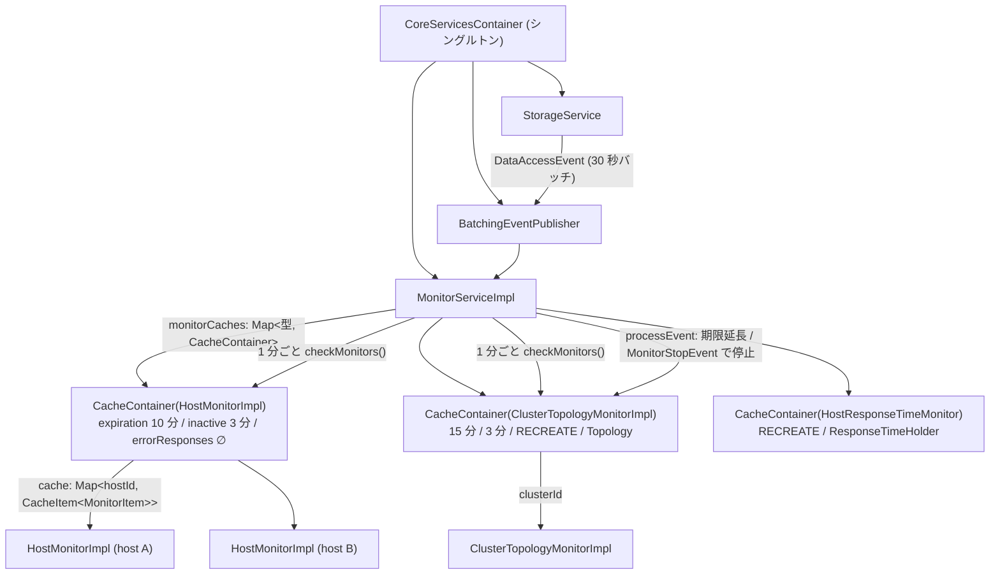

## 何を学んだか

`MonitorServiceImpl` は、バックグラウンドで回り続ける非同期ループ (monitor) を**種類ごと・キーごとに 1 つだけ**持つためのレジストリである。EFM 専用ではなく、`ClusterTopologyMonitorImpl` (クラスタごと) や `HostResponseTimeMonitor` (ホストごと) も同じ仕組みに乗る。

- 生成は `runIfAbsent(型, キー, ..., initializer)`。なければ `initializer.createMonitor()` で作って `start()`、あれば期限を延ばして返す
- 同じキーの生成が並行して走ったときは `pendingMonitors` の Promise を共有して 1 つにする
- 破棄は 1 分ごとの cleanup ループが行う。`STOPPED` / `ERROR` / スタック (3 分無活動) / 期限切れ (10〜15 分) の 4 条件で、種類ごとの設定に従って停止か再生成をする
- 明示的な停止は `PluginManager.releaseResources()` → `CoreServicesContainer.releaseResources()` の連鎖で、monitor の `stop()` は最大 30 秒ループの終了を待つ

## ソースコードのどこか

### 全体の構造



### 型の登録 — 種類ごとの掃除ルール

`HostMonitorServiceImpl` はコンストラクタで `HostMonitorImpl` を登録する ([`common/lib/plugins/efm/base/host_monitor_service.ts#L58`](https://github.com/aws/aws-advanced-nodejs-wrapper/blob/6d0ba1bdae81a4e1fd274b3569c5dc50cf0a7095/common/lib/plugins/efm/base/host_monitor_service.ts#L58))。

```ts title="common/lib/plugins/efm/base/host_monitor_service.ts"
private static readonly MONITOR_DISPOSAL_TIME_NS = BigInt(10 * 60 * 1_000_000_000); // 10 minutes
private static readonly INACTIVE_TIMEOUT_NS = BigInt(3 * 60 * 1_000_000_000); // 3 minutes
// ...
this.coreMonitorService.registerMonitorTypeIfAbsent(
  HostMonitorImpl,
  HostMonitorServiceImpl.MONITOR_DISPOSAL_TIME_NS,
  HostMonitorServiceImpl.INACTIVE_TIMEOUT_NS,
  new Set(),
  undefined
);
```

引数は「期限」「無活動とみなす時間」「エラー時の対応」「この monitor が生成するデータの型」の 4 つで、`MonitorSettings` にまとまる ([`common/lib/utils/monitoring/monitor.ts#L32`](https://github.com/aws/aws-advanced-nodejs-wrapper/blob/6d0ba1bdae81a4e1fd274b3569c5dc50cf0a7095/common/lib/utils/monitoring/monitor.ts#L32))。EFM は `errorResponses` が空 (エラーでも再生成しない) で、生成データの型もない。

`ClusterTopologyMonitorImpl` だけは登録なしで使える。`MonitorServiceImpl.getDefaultSuppliers` に既定の設定 (15 分 / 3 分 / `RECREATE` / `Topology`) が埋め込まれている ([`common/lib/utils/monitoring/monitor_service.ts#L118`](https://github.com/aws/aws-advanced-nodejs-wrapper/blob/6d0ba1bdae81a4e1fd274b3569c5dc50cf0a7095/common/lib/utils/monitoring/monitor_service.ts#L118))。コメントに "Lazy initialization ... to avoid circular dependencies" とあり、`monitor_service.ts` が `cluster_topology_monitor.ts` を import する循環を、静的初期化から外して回避している。

| monitor                      | キー               | 期限  | 無活動 | エラー時 | 生成データ           |
| ---------------------------- | ------------------ | ----- | ------ | -------- | -------------------- |
| `HostMonitorImpl` (EFM)      | `hostId \|\| host` | 10 分 | 3 分   | 停止のみ | なし                 |
| `ClusterTopologyMonitorImpl` | `clusterId`        | 15 分 | 3 分   | 再生成   | `Topology`           |
| `HostResponseTimeMonitor`    | `hostInfo.url`     | 独自  | 独自   | 再生成   | `ResponseTimeHolder` |

### `runIfAbsent` — 二重生成を Promise で防ぐ

[`#L250`](https://github.com/aws/aws-advanced-nodejs-wrapper/blob/6d0ba1bdae81a4e1fd274b3569c5dc50cf0a7095/common/lib/utils/monitoring/monitor_service.ts#L250)。

```ts title="common/lib/utils/monitoring/monitor_service.ts"
const cache = cacheContainer.getCache();
const existingCacheItem = cache.get(key);
if (existingCacheItem) {
  const existingMonitorItem = existingCacheItem.get(true);
  if (existingMonitorItem) {
    existingCacheItem.updateExpiration(cacheContainer.getSettings().expirationTimeoutNanos);
    return existingMonitorItem.getMonitor() as T;
  }
}

const pendingKey = `${monitorClass.name}:${JSON.stringify(key)}`;

// Check if the monitor is already being created by another async task.
const pendingPromise = this.pendingMonitors.get(pendingKey);
if (pendingPromise) {
  return (await pendingPromise) as T;
}

// Use the pending promise pattern to create monitors. This prevents race condition.
const createPromise = (async (): Promise<Monitor> => {
  try {
    const recheckCacheItem = cache.get(key);
    // ...
    const monitorItem = new MonitorItem(() => initializer.createMonitor(servicesContainer));
    const expirationNs = cacheContainer.getSettings().expirationTimeoutNanos;
    cache.set(key, new CacheItem(monitorItem, getTimeInNanos() + expirationNs));
    await monitorItem.getMonitor().start();

    return monitorItem.getMonitor();
  } finally {
    // Delete the key once monitor has been successfully created.
    this.pendingMonitors.delete(pendingKey);
  }
})();

this.pendingMonitors.set(pendingKey, createPromise);
return (await createPromise) as T;
```

3 つ読み取れる。

- `cache.get(key)` の後の `get(true)` は**期限切れでも返す**。期限は「掃除の候補になる時刻」であって「使えなくなる時刻」ではない。参照されたら `updateExpiration` で延びる (sliding expiration)
- `pendingMonitors` は `型名:JSON(キー)` の文字列をキーにした `Promise` の Map。JavaScript はシングルスレッドだが、`await` の間に別の `runIfAbsent` が割り込めるので、「なければ作る」は素朴に書くと二重に作る。作成中の Promise を共有して 2 番目以降を待たせる
- `MonitorItem` は monitor 本体と**作り直すための supplier** を一緒に持つ ([`#L69`](https://github.com/aws/aws-advanced-nodejs-wrapper/blob/6d0ba1bdae81a4e1fd274b3569c5dc50cf0a7095/common/lib/utils/monitoring/monitor_service.ts#L69))。`RECREATE` はこの supplier をもう一度呼ぶ

`start()` は `AbstractMonitor` で `this.monitorPromise = this.run()` するだけである ([`common/lib/utils/monitoring/monitor.ts#L77`](https://github.com/aws/aws-advanced-nodejs-wrapper/blob/6d0ba1bdae81a4e1fd274b3569c5dc50cf0a7095/common/lib/utils/monitoring/monitor.ts#L77))。`await` しないので、ループは fire-and-forget で走り出す。

### cleanup ループ — 4 つの掃除条件

[`#L165`](https://github.com/aws/aws-advanced-nodejs-wrapper/blob/6d0ba1bdae81a4e1fd274b3569c5dc50cf0a7095/common/lib/utils/monitoring/monitor_service.ts#L165)。1 分ごとに全 CacheContainer を走査する。

```ts title="common/lib/utils/monitoring/monitor_service.ts"
// Check for stopped monitors
if (monitor.getState() === MonitorState.STOPPED) {
  cache.delete(key);
  await monitor.stop();
  continue;
}

// Check for error state monitors
if (monitor.getState() === MonitorState.ERROR) {
  cache.delete(key);
  logger.debug(Messages.get("MonitorService.removedErrorMonitor", JSON.stringify(monitor)));
  await this.handleMonitorError(container, key, monitorItem);
  continue;
}

// Check for inactive/stuck monitors
const inactiveTimeoutNs = monitorSettings.inactiveTimeoutNanos;
if (getTimeInNanos() - monitor.getLastActivityTimestampNanos() > inactiveTimeoutNs) {
  cache.delete(key);
  logger.info(
    Messages.get(
      "MonitorService.monitorStuck",
      JSON.stringify(monitor),
      convertNanosToMs(inactiveTimeoutNs).toString(),
    ),
  );
  await this.handleMonitorError(container, key, monitorItem);
  continue;
}

// Check for expired monitors that can be disposed
if (cacheItem.isExpired() && monitor.canDispose()) {
  cache.delete(key);
  logger.info(Messages.get("MonitorService.removedExpiredMonitor", JSON.stringify(monitor)));
  await monitor.stop();
}
```

| 条件      | 判定材料                                             | EFM (`HostMonitorImpl`) での意味                                      |
| --------- | ---------------------------------------------------- | --------------------------------------------------------------------- |
| `STOPPED` | `state`                                              | `stop()` 済み。キャッシュから外す                                     |
| `ERROR`   | `run()` が例外で抜けた                               | `monitor()` が内部で全部 catch するので実質起きない                   |
| スタック  | `lastActivityTimestampNanos` から 3 分               | ループが 1 周ごとに更新する値。プローブ 1 回が 3 分超えると止められる |
| 期限切れ  | `CacheItem` の期限 (最後の `runIfAbsent` から 10 分) | `canDispose()` = `contexts.length === 0` のときだけ止める             |

`handleMonitorError` は monitor を `stop()` し、`RECREATE` が設定されていれば supplier で作り直して `start()` する ([`#L218`](https://github.com/aws/aws-advanced-nodejs-wrapper/blob/6d0ba1bdae81a4e1fd274b3569c5dc50cf0a7095/common/lib/utils/monitoring/monitor_service.ts#L218))。EFM は `RECREATE` なしなので、スタックした `HostMonitorImpl` は止まったまま消え、次の `startMonitoring` で `runIfAbsent` が新しく作る。

cleanup ループの sleep は `sleepWithAbort` で作られ、タイマーは `unref()` されている ([`common/lib/utils/utils.ts#L37`](https://github.com/aws/aws-advanced-nodejs-wrapper/blob/6d0ba1bdae81a4e1fd274b3569c5dc50cf0a7095/common/lib/utils/utils.ts#L37))。cleanup ループ自体はプロセスの終了を妨げない。一方 `HostMonitorImpl` のループ内の `setTimeout` は `unref()` されていないので、monitor が生きている間はプロセスが終わらない ([バックグラウンドタスクと Node.js プロセス](../background-tasks-and-process/))。

### monitor 側の自主的な終了と、その隙間

`HostMonitorImpl.monitor()` は、アクティブな context が `monitorDisposalTime` (10 分) ない状態が続くと `break` でループを抜ける ([`common/lib/plugins/efm/base/host_monitor.ts#L160`](https://github.com/aws/aws-advanced-nodejs-wrapper/blob/6d0ba1bdae81a4e1fd274b3569c5dc50cf0a7095/common/lib/plugins/efm/base/host_monitor.ts#L160))。抜けた後は `AbstractMonitor.run()` の `finally` で `close()` が呼ばれ、`contexts` が空になり監視用接続が閉じられる。

ここで `state` を見ると、`run()` は正常終了時に `STOPPED` を**セットしない** ([`common/lib/utils/monitoring/monitor.ts#L81`](https://github.com/aws/aws-advanced-nodejs-wrapper/blob/6d0ba1bdae81a4e1fd274b3569c5dc50cf0a7095/common/lib/utils/monitoring/monitor.ts#L81))。

```ts title="common/lib/utils/monitoring/monitor.ts"
async run(): Promise<void> {
  try {
    this.state = MonitorState.RUNNING;
    this.lastActivityTimestampNanos = BigInt(Date.now() * 1_000_000);
    await this.monitor();
  } catch (error) {
    this.state = MonitorState.ERROR;
  } finally {
    await this.close();
  }
}
```

ループを抜けた monitor は `RUNNING` のままキャッシュに残る。掃除されるのは「期限切れ かつ `canDispose()`」を cleanup ループが見つけたときで、最後の `runIfAbsent` から 10 分後以降、最大 1 分の遅れがある。ループの自主終了 (最後の context 操作から 10 分) と期限切れ (最後の `runIfAbsent` から 10 分) はほぼ同時刻なので、**ループは死んでいるがキャッシュには残っている**時間が最大 1 分ほど生じる。

この間に同じホストへ `startMonitoring` が来ると、`runIfAbsent` は死んだ monitor を返して期限を延ばし、`startMonitoring` は `_stop` が立っていないので警告も出さず context を `contexts` に積む ([`#L76`](https://github.com/aws/aws-advanced-nodejs-wrapper/blob/6d0ba1bdae81a4e1fd274b3569c5dc50cf0a7095/common/lib/plugins/efm/base/host_monitor.ts#L76))。プローブは誰も打たず、`contexts` は次の呼び出しごとに 1 つずつ増え、`canDispose()` が `false` になるので期限切れでも掃除されない。コードを読む限り、この状態に入ったホストは以後 EFM が効かなくなる。再現はしていないが、`run()` の `finally` で `STOPPED` にするか、`startMonitoring` で `state` も見るのが素直な直し方で、上流に報告する価値がある。

### 停止 — `stop()` は最大 30 秒待つ

[`common/lib/utils/monitoring/monitor.ts#L95`](https://github.com/aws/aws-advanced-nodejs-wrapper/blob/6d0ba1bdae81a4e1fd274b3569c5dc50cf0a7095/common/lib/utils/monitoring/monitor.ts#L95)。

```ts title="common/lib/utils/monitoring/monitor.ts"
async stop(): Promise<void> {
  this._stop = true;

  if (this.monitorPromise) {
    let timeoutId: ReturnType<typeof setTimeout> | undefined;
    const timeout = new Promise<void>((resolve) => {
      timeoutId = setTimeout(resolve, this.terminationTimeoutMs);
    });
    await Promise.race([this.monitorPromise, timeout]);
    if (timeoutId !== undefined) {
      clearTimeout(timeoutId);
    }
  }

  await this.close();
  this.state = MonitorState.STOPPED;
}
```

`_stop` を立てて、ループが自分で抜けるのを `terminationTimeoutMs` (EFM もトポロジ監視も 30 秒) まで待つ。EFM のループは次の sleep 明け (最長 `Interval`、通常 100ms〜5 秒) で `_stop` を見て抜けるので、普通は数秒以内に終わる。プローブの途中なら、そのプローブのタイムアウトぶん待つ。

`HostMonitorImpl.releaseResources()` は `stop()` の前に `clearTimeout` を呼ぶ ([`#L183`](https://github.com/aws/aws-advanced-nodejs-wrapper/blob/6d0ba1bdae81a4e1fd274b3569c5dc50cf0a7095/common/lib/plugins/efm/base/host_monitor.ts#L183))。sleep 中のタイマーを消すと、その `Promise` の `resolve` は永久に呼ばれず、ループは抜けられない。結果 `stop()` は 30 秒待って諦める。ただしこの `releaseResources()` を呼ぶのは単体テストの `afterEach` だけで、本線の停止経路は `MonitorService.stopAndRemoveMonitors` → `monitor.stop()` であり、そちらはタイマーを消さない。

### 停止の連鎖

アプリが終了時に呼ぶのは `PluginManager.releaseResources()` (static) である ([`common/lib/plugin_manager.ts#L381`](https://github.com/aws/aws-advanced-nodejs-wrapper/blob/6d0ba1bdae81a4e1fd274b3569c5dc50cf0a7095/common/lib/plugin_manager.ts#L381))。

```ts title="common/lib/plugin_manager.ts"
static async releaseResources() {
  for (const plugin of PluginManager.PLUGINS) {
    if (PluginManager.implementsCanReleaseResources(plugin)) {
      try {
        await plugin.releaseResources();
      } catch (error) {
        // Do nothing
      }
    }
  }

  PluginManager.STRATEGY_PLUGIN_CHAIN_CACHE.clear();
  await CoreServicesContainer.releaseResources();

  PluginManager.PLUGINS = new Set();
}
```

`PluginManager.PLUGINS` はプロセス内で生成された全プラグインの static な集合で、`init()` のたびに追加される ([`#L112`](https://github.com/aws/aws-advanced-nodejs-wrapper/blob/6d0ba1bdae81a4e1fd274b3569c5dc50cf0a7095/common/lib/plugin_manager.ts#L112))。EFM プラグインの `releaseResources` は `HostMonitorServiceImpl.releaseResources` → `stopAndRemoveMonitors(HostMonitorImpl)` で、EFM の monitor だけを全部止める。その後 `CoreServicesContainer.releaseResources()` が `monitorService.releaseResources()` を呼び、cleanup ループを中断してから `stopAndRemoveAll()` で残りの全種類を止める ([`common/lib/utils/core_services_container.ts#L46`](https://github.com/aws/aws-advanced-nodejs-wrapper/blob/6d0ba1bdae81a4e1fd274b3569c5dc50cf0a7095/common/lib/utils/core_services_container.ts#L46))。

`stop()` は monitor ごとに逐次 `await` されるので、N 個の monitor がそれぞれプローブ中なら、最悪 N × 30 秒かかる。

### イベントで期限を延ばす

`MonitorServiceImpl` は `DataAccessEvent` と `MonitorStopEvent` を購読する ([`#L136`](https://github.com/aws/aws-advanced-nodejs-wrapper/blob/6d0ba1bdae81a4e1fd274b3569c5dc50cf0a7095/common/lib/utils/monitoring/monitor_service.ts#L136))。`StorageService` は誰かがキャッシュを読むと `DataAccessEvent(型, キー)` を publish し ([`common/lib/utils/storage/storage_service.ts#L216`](https://github.com/aws/aws-advanced-nodejs-wrapper/blob/6d0ba1bdae81a4e1fd274b3569c5dc50cf0a7095/common/lib/utils/storage/storage_service.ts#L216))、`MonitorServiceImpl.processEvent` は「その型のデータを生成する monitor」の期限を延ばす。

これが `producedDataClass` の使い道である。トポロジキャッシュが読まれている限り `ClusterTopologyMonitorImpl` は生き続け、誰も読まなくなって 15 分で消える。EFM は生成データを持たないので、この経路では延びない。`startMonitoring` のたびに `runIfAbsent` が呼ばれ、そこで延びる。

`BatchingEventPublisher` は `isImmediateDelivery` が `false` のイベントを 30 秒ごとにまとめて配る ([`common/lib/utils/events/batching_event_publisher.ts#L21`](https://github.com/aws/aws-advanced-nodejs-wrapper/blob/6d0ba1bdae81a4e1fd274b3569c5dc50cf0a7095/common/lib/utils/events/batching_event_publisher.ts#L21))。`DataAccessEvent` は 30 秒に 1 回まとまって届き、`Set` なので同じイベントインスタンスの重複はない。`MonitorStopEvent` は `isImmediateDelivery = true` で即時である。この 3 サービスの共有の意味は [CoreServicesContainer](../core-services-container/) で読む。

## なぜそうなっているか

### なぜ monitor をプロセスで共有するのか

monitor は「DB に対して定期的に問い合わせる仕事」で、要求元 (クライアント) の数に比例して増やしたくない。100 個の `AwsMySQLClient` が同じインスタンスに繋がっていても、EFM の監視用接続は 1 本、トポロジクエリは 1 系統でよい。`CoreServicesContainer` がシングルトンなのはこのためで、クライアントごとに作る `PluginService` / `PluginManager` と、プロセスで 1 つの `MonitorService` / `StorageService` / `EventPublisher` を `FullServicesContainer` が束ねている ([CoreServicesContainer](../core-services-container/))。

### なぜ「型 × キー」の 2 段なのか

種類ごとに掃除の方針が違う。トポロジ監視は止まると全クライアントがトポロジを見失うので `RECREATE` で復活させる。EFM の monitor は次の `startMonitoring` で作り直せるので `RECREATE` は不要で、むしろ誰も使っていないのに復活させると監視用接続が無駄になる。`CacheContainer` が型ごとの `MonitorSettings` を持ち、その中でキーごとの monitor を持つ 2 段構造は、この方針の差を型に紐づけるためである。

### スタック検出が要る理由

monitor のループは `await` で待つ場所が複数あり、DB 側が応答しない・タイムアウトが未設定といった条件で 1 周が異常に長くなりうる。`lastActivityTimestampNanos` は 1 周ごとに更新され、3 分更新がなければ「固まった」とみなして止める。docs が「監視用接続に必ずタイムアウトを」と言うのは、この 3 分に達すると monitor ごと止められるからでもある。

### 期限の延長を「参照」に紐づける理由

monitor を止めるべきかは「その結果を誰かが使っているか」で決まる。トポロジは `StorageService` 経由で読まれるので、読んだ事実をイベントにして monitor 側に伝える。monitor が「最後に自分が動いた時刻」を見ても使われているかは分からない。使う側の行動を期限に反映するために、`DataAccessEvent` と `producedDataClass` の対応が要る。

## どう活かすか

- **バックグラウンドループはレジストリで一元管理する。** 「型 × キー」で 1 つに絞り、生成・共有・掃除を 1 か所に集める。ループを作った側が止め忘れる事故を、レジストリの cleanup が拾う
- **`await` をまたぐ「なければ作る」は pending Promise で守る。** シングルスレッドでも競合する。作成中の Promise を Map に置き、2 番目以降はそれを待つ
- **停止は「フラグを立てて待つ」+「上限時間」の組にする。** 即時にキャンセルできない処理を止めるときの基本形。上限 (30 秒) を超えたら諦めて先に進む
- **終了状態は終了した側が必ず記録する。** `run()` の正常終了で `STOPPED` にならないのが隙間の原因になっている。ループの終わり方が複数あるなら、`finally` で状態を確定させる
- **期限延長のトリガは「使う側の行動」にする。** 生成側の活動時刻では「使われているか」が分からない

### 実務で踏む失敗パターン

- **プロセスが終了しない。** monitor のループのタイマーは `unref()` されていない。終了前に `PluginManager.releaseResources()` を呼ぶ。呼ばないと EFM の monitor が 10 分、トポロジ監視が 15 分、プロセスを引き止める
- **`releaseResources()` が数十秒かかる。** monitor ごとに逐次 `stop()` し、それぞれ最大 30 秒待つ。監視用タイムアウトを短くしておくと、プローブ途中の monitor も早く抜ける
- **10 分アイドルの後の最初のクエリで EFM が効かない。** 上で読んだ隙間。EFM が沈黙していても failover2 は `wrapperQueryTimeout` 経由で動くので致命傷ではないが、EFM の検知時間を当てにしている構成では見込みが外れる
- **単体テストで `HostMonitorImpl.releaseResources()` を呼ぶと 30 秒待つ。** `clearTimeout` でループの sleep が永久に解けなくなる。テストの `afterEach` が遅い原因になる
