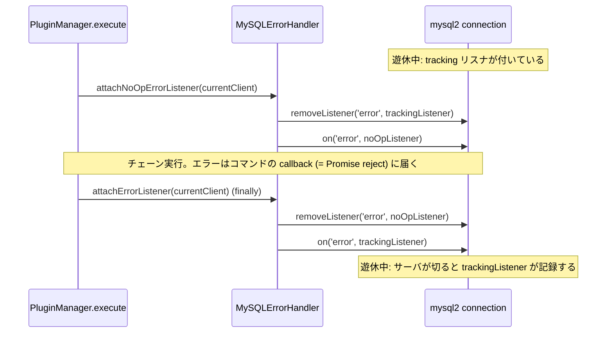

## この層の責務

フェイルオーバーを始めるかどうかは「このエラーはネットワーク起因か」で決まる。その判定を DB ごとに持つのが `ErrorHandler` ([`common/lib/error_handler.ts#L19`](https://github.com/aws/aws-advanced-nodejs-wrapper/blob/6d0ba1bdae81a4e1fd274b3569c5dc50cf0a7095/common/lib/error_handler.ts#L19)) で、MySQL 実装が `MySQLErrorHandler` ([`mysql/lib/mysql_error_handler.ts#L22`](https://github.com/aws/aws-advanced-nodejs-wrapper/blob/6d0ba1bdae81a4e1fd274b3569c5dc50cf0a7095/mysql/lib/mysql_error_handler.ts#L22)) である。

もう 1 つの責務は、**遊休中に mysql2 が emit する `error` を受け止める**ことだ。Node.js の `EventEmitter` は `error` イベントにリスナがないと例外を投げてプロセスを落とす。mysql2 の接続はクエリを流していない間にもサーバ側から切られ得るので、ラッパは常に何かのリスナを付けておく必要がある。

## 主要な型とその関係

```ts title="mysql/lib/mysql_error_handler.ts"
export class MySQLErrorHandler implements ErrorHandler {
  private static readonly SQLSTATE_ACCESS_ERROR = "28000";
  private unexpectedError: Error | null = null;
  protected static readonly SYNTAX_ERROR_CODES = ["42000", "42S02"];
  protected static readonly SYNTAX_ERROR_MESSAGE = "You have an error in your SQL syntax";
  protected static readonly READ_ONLY_ERROR_CODES = [1290, 1836];
  protected isNoOpListenerAttached = false;
  protected isTrackingListenerAttached = false;
```

| メソッド                    | 判定材料                                  | 判定                                                                  |
| --------------------------- | ----------------------------------------- | --------------------------------------------------------------------- |
| `isLoginError`              | `sqlState` があればそれ、なければ message | `"28000"` または `"Access denied"` を含む                             |
| `isNetworkError`            | message のみ                              | 下の 6 文字列のいずれかを含む                                         |
| `isSyntaxError`             | `code` があればそれ、なければ message     | `"42000"` / `"42S02"` または `"You have an error in your SQL syntax"` |
| `isReadOnlyConnectionError` | `errno` のみ                              | `1290` または `1836`                                                  |

`isNetworkError` の 6 文字列は、[`#L49`](https://github.com/aws/aws-advanced-nodejs-wrapper/blob/6d0ba1bdae81a4e1fd274b3569c5dc50cf0a7095/mysql/lib/mysql_error_handler.ts#L49) にそのまま書かれている。

```ts title="mysql/lib/mysql_error_handler.ts"
isNetworkError(e: Error): boolean {
  return (
    e.message.includes("Connection lost: The server closed the connection.") ||
    e.message.includes("Query inactivity timeout") ||
    e.message.includes("Can't add new command when connection is in closed state") ||
    e.message.includes(Messages.get("ClientUtils.queryTaskTimeout")) ||
    // Pooled connection network errors
    e.message.includes("connect ETIMEDOUT") ||
    e.message.includes("connect ECONNREFUSED")
  );
}
```

### 6 つの文字列の出所

| 文字列                                                     | 生まれる場所                                                                                                                                               | いつ                                                                                  |
| ---------------------------------------------------------- | ---------------------------------------------------------------------------------------------------------------------------------------------------------- | ------------------------------------------------------------------------------------- |
| `Connection lost: The server closed the connection.`       | mysql2 [`lib/base/connection.js#L123`](https://github.com/sidorares/node-mysql2/blob/d8932925b237f07b6410263770379998df973502/lib/base/connection.js#L123) | ソケットの `close` を受けたとき。`PROTOCOL_CONNECTION_LOST`                           |
| `Query inactivity timeout`                                 | mysql2 [`lib/commands/query.js#L344`](https://github.com/sidorares/node-mysql2/blob/d8932925b237f07b6410263770379998df973502/lib/commands/query.js#L344)   | クエリの `timeout` (ラッパ内部クエリに付く) が切れたとき。`PROTOCOL_SEQUENCE_TIMEOUT` |
| `Can't add new command when connection is in closed state` | mysql2 [`lib/base/connection.js#L202`](https://github.com/sidorares/node-mysql2/blob/d8932925b237f07b6410263770379998df973502/lib/base/connection.js#L202) | 致命的エラーの後、その接続にコマンドを積もうとしたとき                                |
| `Client query task timed out, ...`                         | ラッパ `Messages.get("ClientUtils.queryTaskTimeout")`                                                                                                      | `wrapperQueryTimeout` の `Promise.race` が負けたとき                                  |
| `connect ETIMEDOUT`                                        | mysql2 [`lib/base/connection.js#L238`](https://github.com/sidorares/node-mysql2/blob/d8932925b237f07b6410263770379998df973502/lib/base/connection.js#L238) | `connectTimeout` が切れたとき                                                         |
| `connect ECONNREFUSED`                                     | Node.js の `net`                                                                                                                                           | 接続先が RST を返したとき                                                             |

3 番目が重要で、mysql2 は致命的エラー (`_handleFatalError`) の後、`addCommand` を**差し替えて**以降の全コマンドをこのメッセージで拒否する ([`#L214`](https://github.com/sidorares/node-mysql2/blob/d8932925b237f07b6410263770379998df973502/lib/base/connection.js#L214))。

```js title="mysql2 lib/base/connection.js"
_handleFatalError(err) {
  err.fatal = true;
  // stop receiving packets
  this.stream.removeAllListeners('data');
  this.addCommand = this._addCommandClosedState;
  this.write = () => {
    this.emit('error', new Error("Can't write in closed state"));
  };
  this._notifyError(err);
  this._fatalError = err;
}
```

つまり「遊休中に切られた接続で次のクエリを流す」と、ソケットには何も送らずにこのメッセージが返る。ラッパはそれを見て「ネットワークエラー」と分類し、フェイルオーバーを始める。**mysql2 の `reconnect` オプションが要らない**のは、この分類が代わりをするからである。

### なぜ `code` ではなく `message` か

mysql2 のエラーには `code` (`PROTOCOL_CONNECTION_LOST` など) が付いているのに、ラッパは message を見る。理由は `ClientUtils.queryWithTimeout` にある。

```ts title="common/lib/utils/client_utils.ts#L41"
return await Promise.race([timeoutTask, newPromise]).catch((error: any) => {
  if (error instanceof InternalQueryTimeoutError) {
    throw error;
  }
  throw new AwsWrapperError(error.message, error);
});
```

アプリの `query()` を通ったエラーは `AwsWrapperError` に包まれ、`code` / `errno` / `sqlState` は `cause` に沈む。プラグインの `catch` に届く時点で確実に残っているのは `message` だけなので、`isNetworkError` は message で判定する。逆に `isSyntaxError` / `isReadOnlyConnectionError` は `code` / `errno` を先に見るので、包まれたエラーでは判定が効かない (後述)。

## 処理の流れ

### リスナの付け替え

`PluginManager.execute` ([`plugin_manager.ts#L123`](https://github.com/aws/aws-advanced-nodejs-wrapper/blob/6d0ba1bdae81a4e1fd274b3569c5dc50cf0a7095/common/lib/plugin_manager.ts#L123)) が実行の前後で呼ぶ。



理由は mysql2 の `_notifyError` ([`lib/base/connection.js#L253`](https://github.com/sidorares/node-mysql2/blob/d8932925b237f07b6410263770379998df973502/lib/base/connection.js#L253)) にある。

```js title="mysql2 lib/base/connection.js"
_notifyError(err) {
  // ...
  let bubbleErrorToConnection = !this._command;
  if (this._command && this._command.onResult) {
    this._command.onResult(err);
    this._command = null;
  } else if (...) {
    bubbleErrorToConnection = true;
  }
  while ((command = this._commands.shift())) {
    if (command.onResult) {
      command.onResult(err);
    } else {
      bubbleErrorToConnection = true;
    }
  }
  // notify connection if some comands in the queue did not have callbacks
  // or if this is pool connection ( so it can be removed from pool )
  if (bubbleErrorToConnection || this._pool) {
    this.emit('error', err);
  }
  if (err.fatal) {
    this.close();
  }
}
```

- **実行中** (`_command` があり `onResult` を持つ): エラーはコマンドの callback に渡る。`PromiseConnection.query` はそれを reject に変換するので、ラッパの `await` に例外として届く。このとき `error` イベントは emit されない (プール接続を除く)。だから実行中はリスナが何もしなくてよく、noOp で十分
- **遊休中** (`_command` がない): `bubbleErrorToConnection = true` で `error` が emit される。リスナがなければプロセスが落ちる。tracking リスナがそれを `unexpectedError` に記録し、次の `execute` の冒頭で failover2 が `hasNetworkError()` を見て先に投げる ([`failover2_plugin.ts#L194`](https://github.com/aws/aws-advanced-nodejs-wrapper/blob/6d0ba1bdae81a4e1fd274b3569c5dc50cf0a7095/common/lib/plugins/failover2/failover2_plugin.ts#L194))

実行中に noOp を付けるのは、**実行中に emit された `error` を「遊休中のエラー」として記録しないため**である。コマンドの callback と `error` イベントの両方に同じエラーが届く経路 (プール接続の `this._pool` 分岐) があるので、二重処理を避ける。

`attachErrorListener` が付けられるのは `DriverConnectionProvider.connect` の直後 ([`driver_connection_provider.ts#L95`](https://github.com/aws/aws-advanced-nodejs-wrapper/blob/6d0ba1bdae81a4e1fd274b3569c5dc50cf0a7095/common/lib/driver_connection_provider.ts#L95)) と `PluginManager.execute` の `finally`。外すのは `AwsMySQLClient.end()` と `AwsMySQLPooledConnection.release()` の中だけである。

### `MySQLErrorHandler` のインスタンスの寿命

`MySQLDatabaseDialect.getErrorHandler()` は `new MySQLErrorHandler()` を返し、`PluginServiceImpl` は `this.getDialect().getErrorHandler().attachErrorListener(...)` のように**毎回新しいインスタンス**を経由する。この設計で成立している部分と、そうでない部分がある。

- **リスナの付け外しは成立する。** `noOpListener` / `trackingListener` はプロトタイプのメソッドなので、インスタンスが違っても関数の同一性は同じ。`removeListener('error', this.trackingListener)` は別のインスタンスが付けたリスナを外せる。`isNoOpListenerAttached` などのフラグは毎回 `false` から始まるので、付け替えは常に実行される
- **`unexpectedError` の記録と参照は成立しない。** `connection.on('error', this.trackingListener)` は `bind` していないので、呼ばれたときの `this` は mysql2 の接続オブジェクトになり、`this.unexpectedError = error` は接続オブジェクトのプロパティに書かれる。一方 `hasNetworkError()` は新しいインスタンスの `unexpectedError` (常に `null`) を見るので、`false` しか返らない

コードを読む限り、failover2 と failover (v1) の `execute` 冒頭にある「遊休中のエラーを先に投げる」経路は MySQL では動いていない。ただし実害は限定的で、遊休中に切られた接続は次のクエリで `Can't add new command when connection is in closed state` を返し、それが `isNetworkError` で拾われてフェイルオーバーに入る。1 回分のクエリ実行が余計に走るだけである。

## 守られている不変条件

- **mysql2 の接続には常に `error` リスナが 1 つ付いている。** `connect` 直後から `end` まで、noOp か tracking のどちらかが付く。プロセスが `unhandled 'error' event` で落ちない保証はここにある
- **分類は Dialect 経由でしか呼ばれない。** プラグインは `pluginService.isNetworkError(e)` を呼び、それが `getDialect().getErrorHandler()` に委譲される。PG と MySQL でプラグインのコードは同じ
- **ラッパ自身のタイムアウトメッセージもネットワークエラーとして扱う。** `wrapperQueryTimeout` 超過 = 応答なし = 接続が怪しい、という判断で、フェイルオーバーのトリガになる

## つまずきどころ

- **mysql2 側の文言が変わると壊れる。** 6 文字列のうち 5 つは mysql2 のソースに埋め込まれた英文で、mysql2 のバージョンを上げたら `isNetworkError` が効かなくなる可能性がある。`peerDependencies` は `^3.22.3` で、メジャー更新時はここを見直す
- **`isReadOnlyConnectionError` は `errno` を見るが、`query()` 経由のエラーは `AwsWrapperError` に包まれて `errno` が `cause` に沈む。** `hasOwnProperty(e, "errno")` は包んだ側で `false` になり、判定は `false` を返す。3.0.0 で「strict-writer のとき read-only エラーでフェイルオーバー」が入ったが、`query()` を通る限りこの経路は効かない。単体テスト ([`tests/unit/error_handler.test.ts#L40`](https://github.com/aws/aws-advanced-nodejs-wrapper/blob/6d0ba1bdae81a4e1fd274b3569c5dc50cf0a7095/tests/unit/error_handler.test.ts#L40)) は包まれていない生のエラーで検証している ([何をトリガとするか](../failover-triggers/))
- **`Access denied` を含むメッセージは全部ログインエラー。** `sqlState` がない場合の後方互換のための文字列一致で、`Access denied for user` 以外にも `Access denied; you need (at least one of) the SUPER privilege(s)` のような権限エラーも `isLoginError` になる。iam プラグインは `isLoginError` でトークン再生成を判断するので、権限エラーでもトークンが作り直される ([IAM 認証プラグイン](../iam-plugin/))
- **`ECONNRESET` は 6 文字列にない。** mysql2 は `ECONNRESET` を `_handleNetworkError` → `_handleFatalError` に流すので、実行中なら `read ECONNRESET` がそのまま message になり、`isNetworkError` は `false`。フェイルオーバーは始まらず、次のクエリで `Can't add new command...` になって初めて始まる
- **エラーリスナは mysql2 の `connection` (非 promise 側) に付く。** `clientWrapper.client.connection.on(...)`。`PromiseConnection` は `inheritEvents` で `error` を転送するが、ラッパは内側に直接付けている
