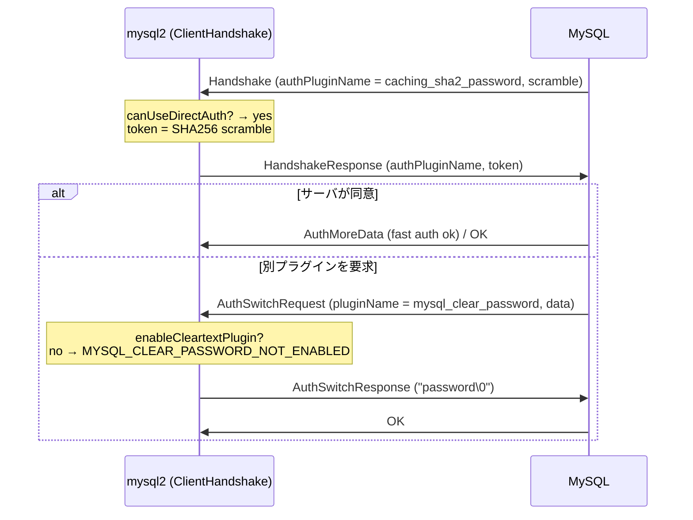

## 何を学んだか

MySQL の認証は、パスワードを送って終わりではない。サーバが最初の Handshake パケットで「このユーザには `caching_sha2_password` を使え」のように**認証プラグイン名**を名乗り、クライアントはそれに合ったトークンを返す。合わなければサーバが `AuthSwitchRequest` で「こっちのプラグインで出し直せ」と言い、クライアントは対応するプラグインで再計算する。

mysql2 はこの交渉を `ClientHandshake` コマンドと `auth_switch.js`、そして `lib/auth_plugins/` の 4 つのプラグインで実装している。

| プラグイン              | 送るもの                                                | 直接使える条件                                                   |
| ----------------------- | ------------------------------------------------------- | ---------------------------------------------------------------- |
| `mysql_native_password` | SHA1 ベースのスクランブル                               | 常に                                                             |
| `caching_sha2_password` | SHA256 ベースのスクランブル、初回は RSA か平文 (TLS 時) | 常に                                                             |
| `sha256_password`       | 平文 (TLS 時) または RSA 暗号化                         | TLS または UNIX ソケット                                         |
| `mysql_clear_password`  | **平文** `password\0`                                   | TLS または UNIX ソケット、**かつ `enableCleartextPlugin: true`** |

最後の行がこのページの主題である。`mysql_clear_password` は「パスワードをそのまま送る」プラグインで、mysql2 は `enableCleartextPlugin` が立っていなければ `MYSQL_CLEAR_PASSWORD_NOT_ENABLED` という致命的エラーで**接続を拒否する**。Aurora の IAM 認証ユーザはこのプラグインを要求するので、ラッパは `ssl` 設定時だけこのフラグを自動で立てる ([MySQL で IAM を使うと cleartext になる](../iam-cleartext-on-mysql/))。



## ソースコードのどこか

### 最初の応答でどのプラグインを使うか

[`lib/commands/client_handshake.js#L77`](https://github.com/sidorares/node-mysql2/blob/d8932925b237f07b6410263770379998df973502/lib/commands/client_handshake.js#L77)。

```js title="lib/commands/client_handshake.js"
// Optimization: Try to use the server's preferred authentication method
// to avoid an unnecessary auth switch roundtrip
const serverAuthMethod = this.handshake.authPluginName;
const isSecureConnection = connection.config.ssl || connection.config.socketPath;
// ...
// Determine which auth method to use
// Try to use server's preferred method if we can, otherwise fallback to native
const canUseDirectAuth =
  !hasCustomAuthPlugin &&
  !hasLegacyAuthSwitchHandler &&
  this.canUseAuthMethodDirectly(serverAuthMethod, isSecureConnection) &&
  (serverAuthMethod !== "mysql_clear_password" || connection.config.enableCleartextPlugin);

const clientAuthMethod = canUseDirectAuth ? serverAuthMethod : "mysql_native_password";
```

サーバが名乗ったプラグインをそのまま使えるなら 1 往復で済む。使えなければ `mysql_native_password` で応えて、サーバの `AuthSwitchRequest` を待つ。「使えるか」の判定が `canUseAuthMethodDirectly` ([`#L205`](https://github.com/sidorares/node-mysql2/blob/d8932925b237f07b6410263770379998df973502/lib/commands/client_handshake.js#L205))。

```js title="lib/commands/client_handshake.js"
canUseAuthMethodDirectly(authMethod, isSecureConnection) {
  switch (authMethod) {
    case 'mysql_native_password':
    case 'caching_sha2_password':
      // These methods work with or without SSL
      return true;

    case 'sha256_password':
    case 'mysql_clear_password':
      // These methods require secure connection for direct use
      return isSecureConnection;

    default:
      // Unknown methods - fallback to native password
      return false;
  }
}
```

トークンの計算は `calculateAuthToken` ([`#L183`](https://github.com/sidorares/node-mysql2/blob/d8932925b237f07b6410263770379998df973502/lib/commands/client_handshake.js#L183)) で、`sha256_password` と `mysql_clear_password` は同じ分岐に入る。

```js title="lib/commands/client_handshake.js"
case 'sha256_password':
case 'mysql_clear_password':
  // These methods send plaintext password over secure connections
  return password
    ? Buffer.from(`${password}\0`, 'utf8')
    : Buffer.alloc(0);
```

**NUL 終端した平文**である。TLS の上に乗るから許される、という前提が `isSecureConnection` に込められている。

### AuthSwitchRequest の処理と、cleartext の拒否

ハンドシェイク応答の後、サーバから来るパケットは `handshakeResult` ([`#L317`](https://github.com/sidorares/node-mysql2/blob/d8932925b237f07b6410263770379998df973502/lib/commands/client_handshake.js#L317)) が受ける。先頭バイトが `0xfe` なら `AuthSwitchRequest`、`0x01` なら `AuthMoreData` で、それぞれ `auth_switch.js` に委ねる。

[`lib/commands/auth_switch.js#L54`](https://github.com/sidorares/node-mysql2/blob/d8932925b237f07b6410263770379998df973502/lib/commands/auth_switch.js#L54)。

```js title="lib/commands/auth_switch.js"
function authSwitchRequest(packet, connection, command) {
  const { pluginName, pluginData } = Packets.AuthSwitchRequest.fromPacket(packet);
  // ...
  if (pluginName === "mysql_clear_password") {
    const hasCustomPlugin =
      connection.config.authPlugins &&
      Object.prototype.hasOwnProperty.call(connection.config.authPlugins, "mysql_clear_password");
    if (!hasCustomPlugin && !connection.config.enableCleartextPlugin) {
      const err = new Error(
        "Server requested authentication using mysql_clear_password, " +
          "which sends the password in plaintext over the network and is " +
          "disabled by default. To enable it, set the `enableCleartextPlugin` " +
          "option to `true` in your connection configuration, or provide a " +
          "custom `mysql_clear_password` auth plugin via the `authPlugins` " +
          "option. Only use this over a secure connection (TLS/SSL).",
      );
      err.code = "MYSQL_CLEAR_PASSWORD_NOT_ENABLED";
      err.fatal = true;
      throw err;
    }
  }

  const authPlugin = getAuthPlugin(pluginName, connection);
  if (!authPlugin) {
    throw new Error(`Server requests authentication using unknown plugin ${pluginName}. ...`);
  }
  connection._authPlugin = authPlugin({ connection, command });
  Promise.resolve(connection._authPlugin(pluginData))
    .then((data) => {
      if (data) {
        connection.writePacket(new Packets.AuthSwitchResponse(data).toPacket());
      }
    })
    .catch((err) => {
      authSwitchPluginError(err, command);
    });
}
```

要点は 2 つ。`mysql_clear_password` **だけ**が特別扱いで、`enableCleartextPlugin` か `authPlugins` による差し替えが無ければ `fatal` エラーになる。そして、ここでは `isSecureConnection` を**見ていない**。`enableCleartextPlugin: true` を立てれば平文の TCP でも通る。「TLS で使え」はエラーメッセージ上の注意にとどまり、強制ではない。ラッパが `ssl` の有無を自分で確かめてからフラグを立てる (`MySQL2DriverDialect.setCleartextPluginForTokenAuth`、[`mysql2_driver_dialect.ts#L89`](https://github.com/aws/aws-advanced-nodejs-wrapper/blob/6d0ba1bdae81a4e1fd274b3569c5dc50cf0a7095/mysql/lib/dialect/mysql2_driver_dialect.ts#L89)) のは、この強制が mysql2 側に無いからである。

### プラグインはファクトリが返す状態機械

[`lib/commands/auth_switch.js#L18`](https://github.com/sidorares/node-mysql2/blob/d8932925b237f07b6410263770379998df973502/lib/commands/auth_switch.js#L18)。

```js title="lib/commands/auth_switch.js"
const standardAuthPlugins = Object.assign(Object.create(null), {
  sha256_password: sha256_password({}),
  caching_sha2_password: caching_sha2_password({}),
  mysql_native_password: mysql_native_password({}),
  mysql_clear_password: mysql_clear_password({}),
});
```

`Object.create(null)` はサーバから来た `pluginName` が `"__proto__"` や `"toString"` だったときにプロトタイプのプロパティを拾わないため、とコメントにある。サーバが名乗る文字列を信用していない。

各プラグインは `(pluginOptions) => ({ connection, command }) => (data) => Buffer | null` という 3 段のカリー化で、最内のクロージャが状態を持つ。`mysql_clear_password` は状態が無い ([`lib/auth_plugins/mysql_clear_password.js`](https://github.com/sidorares/node-mysql2/blob/d8932925b237f07b6410263770379998df973502/lib/auth_plugins/mysql_clear_password.js))。

```js title="lib/auth_plugins/mysql_clear_password.js"
const create_mysql_clear_password_plugin = (pluginOptions) =>
  function mysql_clear_password_plugin({ connection, command }) {
    const password = command.password || pluginOptions.password || connection.config.password;

    return function (/* pluginData */) {
      return bufferFromStr(password);
    };
  };
```

`pluginData` (サーバからの乱数) を無視して `password\0` を返す。スクランブルも何もない。

対照的に `caching_sha2_password` ([`lib/auth_plugins/caching_sha2_password.js`](https://github.com/sidorares/node-mysql2/blob/d8932925b237f07b6410263770379998df973502/lib/auth_plugins/caching_sha2_password.js)) は 4 状態を持つ。初回はスクランブルから SHA256 トークンを作って送り、サーバが `3` (fast auth 成功、サーバ側キャッシュにヒット) を返せば終わり、`4` (full authentication) なら TLS 上では平文、そうでなければサーバの RSA 公開鍵を要求 (`2`) して暗号化した平文を送る。MySQL 8.0 の既定プラグインがこれで、「2 回目以降はキャッシュで速い」という設計になっている。

### `enableCleartextPlugin` の既定

[`lib/connection_config.js#L157`](https://github.com/sidorares/node-mysql2/blob/d8932925b237f07b6410263770379998df973502/lib/connection_config.js#L157) で `Boolean(options.enableCleartextPlugin)`、つまり既定 false。`ssl` は同ファイルで文字列プロファイル (`"Amazon RDS"` など) かオブジェクトを受け、指定が無ければ `false` である。

## なぜそうなっているか

### なぜサーバがプラグインを決めるのか

MySQL の認証プラグインはユーザごとの属性で (`CREATE USER ... IDENTIFIED WITH <plugin>`)、パスワードのハッシュ形式もプラグインで決まる。クライアントはユーザを名乗るまでどのプラグインか分からないので、サーバの Handshake でまず既定のプラグイン名が来て、ユーザが違うプラグインなら `AuthSwitchRequest` で訂正される。**最初の応答は当てずっぽう**で、mysql2 の「サーバの既定に合わせて 1 往復を節約する」最適化はその当てずっぽうの命中率を上げる工夫である。

### なぜ `mysql_clear_password` だけ拒否するのか

他のプラグインはスクランブルや公開鍵でパスワードを守るが、`mysql_clear_password` は文字通り平文を流す。しかもこのプラグインを要求するのは**サーバ側**なので、悪意ある (あるいは乗っ取られた) サーバが `AuthSwitchRequest` で `mysql_clear_password` を要求すれば、クライアントは何も知らずにパスワードを渡してしまう。既定で拒否するのは、この「サーバ主導のダウングレード」に対する防御である。libmysqlclient にも同じ `ENABLE_CLEARTEXT_PLUGIN` オプションがあり、mysql2 はそれに倣っている。

### なぜ IAM がこれに当たるのか

Aurora / RDS の IAM 認証ユーザは `AWSAuthenticationPlugin` で作られ、サーバはクライアントに `mysql_clear_password` を要求する。パスワードの代わりに送るのは署名付き URL (トークン) で、サーバはそれを IAM に検証してもらう。**トークンはハッシュ化できない** (署名の検証にそのままの文字列が要る) ので、平文プラグイン以外の選択肢が無い。ラッパの IAM プラグインが `ssl` を必須にするのはこのためで、[IAM DB 認証の仕組み](../iam-db-auth/) で続ける。

## どう活かすか

- **認証方式はサーバとの交渉であり、クライアントの設定だけでは決まらない。** ユーザ作成時のプラグインが接続時の挙動を決める。DB 側の `CREATE USER` 文とクライアント設定を一緒に読む
- **「平文を送る」機能は既定で切り、有効化を明示させる。** mysql2 は TLS の有無を強制しないので、有効化する側 (ラッパ) が `ssl` を確かめてから立てる。防御の責任がどの層にあるかを決めておく
- **外部から来る識別子でオブジェクトを引くなら、プロトタイプの無いオブジェクトを使う。** `Object.create(null)` の 1 行で `__proto__` 問題が消える
- **状態機械はクロージャで十分なことが多い。** `caching_sha2_password` は `state` 変数 1 つと `switch` で 4 状態を回している。クラスにする必要はない

### 実務で踏む失敗パターン

- **IAM 認証で `ssl` を付けずに `MYSQL_CLEAR_PASSWORD_NOT_ENABLED`。** 3.0.0 以降のラッパは `ssl` があれば自動で `enableCleartextPlugin` を立てるが、無ければ警告を出して立てない。接続は失敗する
- **`enableCleartextPlugin: true` を平文 TCP で使う。** mysql2 は止めない。トークン (15 分有効) が平文で流れる
- **`caching_sha2_password` で初回だけ遅い、または RSA 鍵取得で失敗する。** TLS 無しの初回接続は公開鍵の往復が要る。TLS を使うか `serverPublicKey` を渡す
- **`authSwitchHandler` (旧 API) が残っている。** deprecated 警告が出る。`authPlugins` に移行する
