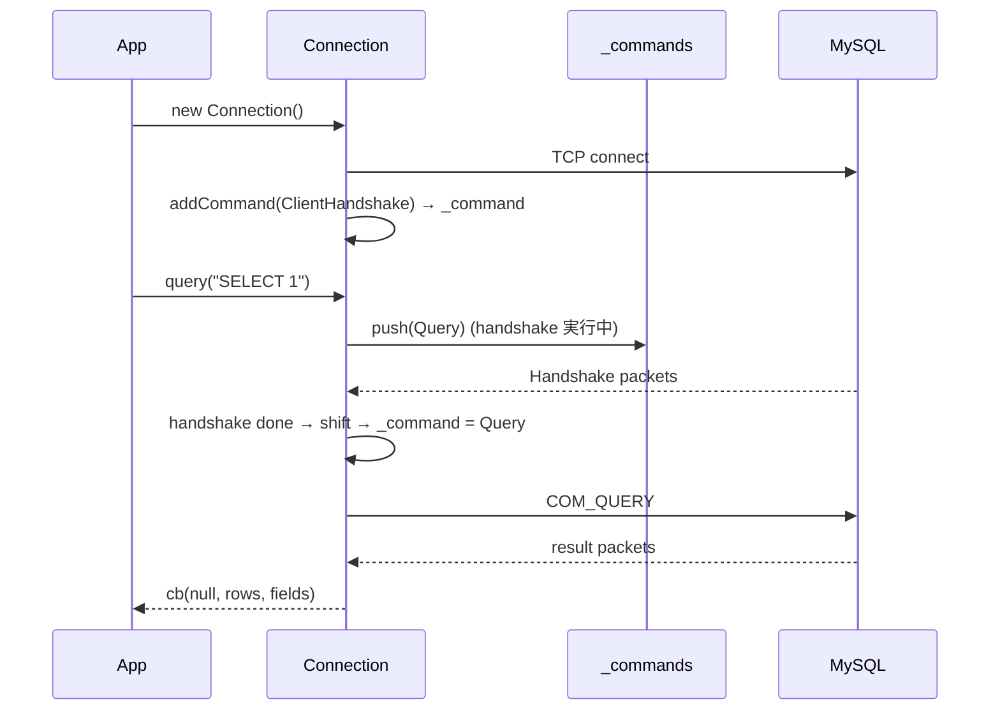

## 何を学んだか

mysql2 の `Connection` は、**TCP ソケット 1 本と、その上を流れるコマンドのキュー**である。API の見た目は `query()` / `execute()` / `end()` だが、内部はすべて `addCommand(cmd)` に還元される。

ラッパを読むうえで押さえておくべき mysql2 の性質は 5 つ。

1. **接続は暗黙に始まる。** `new Connection()` の時点でソケットを開き、`ClientHandshake` コマンドを積む。`connect(cb)` はその完了を待つだけで、呼ばなくても最初の `query()` がハンドシェイクの後ろに並ぶ
2. **致命的エラーは全コマンドに配られ、接続は閉じる。** `_notifyError` がキューを空にし、コールバックの無いコマンドがあれば `'error'` イベントを emit する。プール接続なら常に emit する
3. **エラーの文言は固定文字列。** `Connection lost: The server closed the connection.`、`connect ETIMEDOUT`、`Query inactivity timeout`、`Can't add new command when connection is in closed state` の 4 つは、ラッパの `MySQLErrorHandler.isNetworkError` がそのまま `includes` で照合している
4. **タイムアウトは 2 種類。** `connectTimeout` (既定 10 秒) は接続確立まで、`timeout` はクエリごとにオプションで渡す。クエリの既定タイムアウトは無い
5. **Promise API は `[rows, fields]` を返す。** `PromiseConnection.query()` は `makeDoneCb` でタプルに包む

## ソースコードのどこか

### コンストラクタでソケットを開き、ハンドシェイクを積む

[`lib/base/connection.js#L45`](https://github.com/sidorares/node-mysql2/blob/d8932925b237f07b6410263770379998df973502/lib/base/connection.js#L45)。

```js title="lib/base/connection.js"
class BaseConnection extends EventEmitter {
  constructor(opts) {
    super();
    this.config = opts.config;
    if (!opts.config.stream) {
      if (opts.config.socketPath) {
        this.stream = Net.connect(opts.config.socketPath);
      } else {
        this.stream = Net.connect(opts.config.port, opts.config.host);

        // Optionally enable keep-alive on the socket.
        if (this.config.enableKeepAlive) {
          this.stream.on('connect', () => {
            this.stream.setKeepAlive(true, this.config.keepAliveInitialDelay);
          });
        }
        this.stream.setNoDelay(true);
      }
    }
    // ...
    this._commands = new Queue();
    this._command = null;
    // ...
    this.stream.on('error', this._handleNetworkError.bind(this));
```

`Net.connect` はコンストラクタの中で呼ばれる。`enableKeepAlive` は `connection_config.js` で `options.enableKeepAlive !== false`、つまり**既定 true** で、TCP keep-alive は最初から有効になっている。ラッパの `wrapperKeepAliveProperties` が MySQL では例外になる (`MySQL2DriverDialect.setKeepAliveProperties`) のは、mysql2 に PG の `keepAlive` に相当する後付けの設定口が無いからである ([2 種類の Dialect](../two-dialects/))。

続けてハンドシェイクを積む ([`#L131`](https://github.com/sidorares/node-mysql2/blob/d8932925b237f07b6410263770379998df973502/lib/base/connection.js#L130))。

```js title="lib/base/connection.js"
let handshakeCommand;
if (!this.config.isServer) {
  handshakeCommand = new Commands.ClientHandshake(this.config.clientFlags);
  handshakeCommand.on("end", () => {
    // ...
    this._handshakePacket = handshakeCommand.handshake;
    this.threadId = handshakeCommand.handshake.connectionId;
    this.emit("connect", handshakeCommand.handshake);
  });
  handshakeCommand.on("error", (err) => {
    this._closing = true;
    this._notifyError(err);
  });
  this.addCommand(handshakeCommand);
  // ...
}
if (this.config.connectTimeout) {
  const timeoutHandler = this._handleTimeoutError.bind(this);
  this.connectTimeout = Timers.setTimeout(timeoutHandler, this.config.connectTimeout);
}
```

`connect(cb)` ([`#L985`](https://github.com/sidorares/node-mysql2/blob/d8932925b237f07b6410263770379998df973502/lib/base/connection.js#L985)) は、すでに `_handshakePacket` があれば即座に `cb(null, this)`、無ければ `'connect'` / `'error'` を 1 回ずつ待つだけである。ラッパの `AwsMySQLClient.query()` が未接続なら自動で `connect()` する ([AwsMySQLClient](../aws-mysql-client/)) のは、この暗黙接続と同じ使い勝手を保つためだ。

### コマンドキュー

`addCommand` ([`#L567`](https://github.com/sidorares/node-mysql2/blob/d8932925b237f07b6410263770379998df973502/lib/base/connection.js#L567))。

```js title="lib/base/connection.js"
addCommand(cmd) {
  if (!this._command) {
    this._command = cmd;
    this.handlePacket();
  } else {
    this._commands.push(cmd);
  }
  return cmd;
}
```

実行中のコマンドが無ければ即座に開始し、あれば `_commands` に並べる。`handlePacket` ([`#L494`](https://github.com/sidorares/node-mysql2/blob/d8932925b237f07b6410263770379998df973502/lib/base/connection.js#L494)) が受信パケットを `_command.execute` に渡し、コマンドが完了 (`done`) したら次を `shift` する。**MySQL プロトコルは 1 接続で 1 コマンドしか同時に走らない**ので、キューは必然である。



### 致命的エラーの配り方

エラー経路は 3 本あり、全部 `_handleFatalError` → `_notifyError` に合流する ([`#L214`](https://github.com/sidorares/node-mysql2/blob/d8932925b237f07b6410263770379998df973502/lib/base/connection.js#L214))。

```js title="lib/base/connection.js"
_handleFatalError(err) {
  err.fatal = true;
  // stop receiving packets
  this.stream.removeAllListeners('data');
  this.addCommand = this._addCommandClosedState;
  this.write = () => {
    this.emit('error', new Error("Can't write in closed state"));
  };
  this._notifyError(err);
  this._fatalError = err;
}

_handleNetworkError(err) {
  if (this.connectTimeout) {
    Timers.clearTimeout(this.connectTimeout);
    this.connectTimeout = null;
  }
  // Do not throw an error when a connection ends with a RST,ACK packet
  if (err.code === 'ECONNRESET' && this._closing) {
    return;
  }
  this._handleFatalError(err);
}

_handleTimeoutError() {
  if (this.connectTimeout) {
    Timers.clearTimeout(this.connectTimeout);
    this.connectTimeout = null;
  }
  this.stream.destroy && this.stream.destroy();
  const err = new Error('connect ETIMEDOUT');
  err.errorno = 'ETIMEDOUT';
  err.code = 'ETIMEDOUT';
  err.syscall = 'connect';
  this._handleNetworkError(err);
}
```

`_handleFatalError` の要点は **`this.addCommand = this._addCommandClosedState`** である。インスタンスのメソッドを、常に失敗する関数で上書きする。以降の `query()` は全部これに落ちる ([`#L202`](https://github.com/sidorares/node-mysql2/blob/d8932925b237f07b6410263770379998df973502/lib/base/connection.js#L202))。

```js title="lib/base/connection.js"
_addCommandClosedState(cmd) {
  const err = new Error(
    "Can't add new command when connection is in closed state"
  );
  err.fatal = true;
  if (cmd.onResult) {
    cmd.onResult(err);
  } else {
    this.emit('error', err);
  }
}
```

そして `_notifyError` ([`#L253`](https://github.com/sidorares/node-mysql2/blob/d8932925b237f07b6410263770379998df973502/lib/base/connection.js#L253))。

```js title="lib/base/connection.js"
_notifyError(err) {
  // ...
  // prevent from emitting 'PROTOCOL_CONNECTION_LOST' after EPIPE or ECONNRESET
  if (this._fatalError) {
    return;
  }
  let command;
  // if there is no active command, notify connection
  // if there are commands and all of them have callbacks, pass error via callback
  let bubbleErrorToConnection = !this._command;
  if (this._command && this._command.onResult) {
    this._command.onResult(err);
    this._command = null;
  } else if (
    !(
      this._command &&
      this._command.constructor === Commands.ClientHandshake &&
      this._commands.length > 0
    )
  ) {
    bubbleErrorToConnection = true;
  }
  while ((command = this._commands.shift())) {
    if (command.onResult) {
      command.onResult(err);
    } else {
      bubbleErrorToConnection = true;
    }
  }
  // notify connection if some comands in the queue did not have callbacks
  // or if this is pool connection ( so it can be removed from pool )
  if (bubbleErrorToConnection || this._pool) {
    this.emit('error', err);
  }
  // close connection after emitting the event in case of a fatal error
  if (err.fatal) {
    this.close();
  }
}
```

ここに、ラッパがエラーリスナを付け替える理由がある。**実行中のコマンドが無いとき (アイドル中) にサーバが接続を切ると、`bubbleErrorToConnection` が true になり `'error'` が emit される**。Node.js の `EventEmitter` は、リスナのいない `'error'` を throw するので、プロセスが落ちる。ラッパの `MySQLErrorHandler` は `execute` の外側で noOp リスナを、内側で tracking リスナを付けてこれを吸収し、次の `execute` の冒頭で「アイドル中に来たエラー」として投げ直す ([MySQLErrorHandler](../mysql-error-handler/))。

ソケットが閉じたときの文言は `stream.on('close')` で作られる ([`#L115`](https://github.com/sidorares/node-mysql2/blob/d8932925b237f07b6410263770379998df973502/lib/base/connection.js#L115))。`this._closing` が立っていれば (自分で `end()` / `destroy()` した後なら) 何もしないが、そうでなければ `Connection lost: The server closed the connection.` (`PROTOCOL_CONNECTION_LOST`) を `_notifyError` に流す。

### 2 種類のタイムアウト

`connectTimeout` は上で見たとおり接続全体に 1 本のタイマで、既定は `connection_config.js` の [`#L115`](https://github.com/sidorares/node-mysql2/blob/d8932925b237f07b6410263770379998df973502/lib/connection_config.js#L115) で `10 * 1000`。最初の `'data'` 受信で解除される。

クエリのタイムアウトは `Query` コマンドのオプション `timeout` で、`_setTimeout` / `_handleTimeoutError` ([`lib/commands/query.js#L344`](https://github.com/sidorares/node-mysql2/blob/d8932925b237f07b6410263770379998df973502/lib/commands/query.js#L344)) にある。

```js title="lib/commands/query.js"
_handleTimeoutError() {
  if (this.queryTimeout) {
    Timers.clearTimeout(this.queryTimeout);
    this.queryTimeout = null;
  }

  const err = new Error('Query inactivity timeout');
  err.errorno = 'PROTOCOL_SEQUENCE_TIMEOUT';
  err.code = 'PROTOCOL_SEQUENCE_TIMEOUT';
  err.syscall = 'query';

  if (this.onResult) {
    this.onResult(err);
  } else {
    this.emit('error', err);
  }
}
```

`fatal` は付いていない。つまり**クエリタイムアウトは接続を閉じない**。タイムアウト後もサーバはクエリを実行し続け、結果パケットは後から届く。mysql2 はそれを次のコマンドの応答と混同しないよう扱う必要があり、ラッパ側はこれを網羅的に信用せず、`ClientUtils.queryWithTimeout` で `Promise.race` の自前タイムアウトも掛ける ([AwsMySQLClient](../aws-mysql-client/))。`MySQLClientWrapper.query()` は `MySQL2DriverDialect.setQueryTimeout` で `wrapperQueryTimeout` を各クエリの `timeout` に写してから mysql2 に渡す。

### `end()` と `destroy()`

[`#L1087`](https://github.com/sidorares/node-mysql2/blob/d8932925b237f07b6410263770379998df973502/lib/base/connection.js#L1087) と [`#L944`](https://github.com/sidorares/node-mysql2/blob/d8932925b237f07b6410263770379998df973502/lib/base/connection.js#L944)。

```js title="lib/base/connection.js"
end(callback) {
  // ...
  // trigger error if more commands enqueued after end command
  const quitCmd = this.addCommand(new Commands.Quit(callback));
  this.addCommand = this._addCommandClosedState;
  return quitCmd;
}

destroy() {
  this.close();
}

close() {
  if (this.connectTimeout) {
    Timers.clearTimeout(this.connectTimeout);
    this.connectTimeout = null;
  }
  this._closing = true;
  this.stream.end();
  this.addCommand = this._addCommandClosedState;
}
```

`end()` は `COM_QUIT` を**キューの最後に**積む。先行するクエリは完走する。`destroy()` はソケットをすぐ閉じる。ラッパの EFM が不健全と判定した接続を切るときは `abortConnection` → `destroy()` を使う ([HostMonitor](../host-monitor/))。実行中のクエリを待っていては、TCP タイムアウトを待つのと同じになるからだ。

### Promise API と `[rows, fields]`

[`lib/promise/connection.js#L31`](https://github.com/sidorares/node-mysql2/blob/d8932925b237f07b6410263770379998df973502/lib/promise/connection.js#L31) と [`lib/promise/make_done_cb.js`](https://github.com/sidorares/node-mysql2/blob/d8932925b237f07b6410263770379998df973502/lib/promise/make_done_cb.js)。

```js title="lib/promise/make_done_cb.js"
function makeDoneCb(resolve, reject, stackHolder) {
  return function (err, rows, fields) {
    if (err) {
      applyCapturedStack(err, stackHolder);
      reject(err);
    } else {
      resolve([rows, fields]);
    }
  };
}
```

ラッパの `AwsMySQLClient.query()` の戻りが `[rows, fields]` のタプルなのはこれをそのまま通しているからで、3.0.0 で型が `[T, FieldPacket[]]` になった。ラッパ内部で `res[0][0]["host"]` のような添字が頻出するのも同じ理由である。

### Pool

`Pool.getConnection` ([`lib/base/pool.js#L54`](https://github.com/sidorares/node-mysql2/blob/d8932925b237f07b6410263770379998df973502/lib/base/pool.js#L54)) は `_freeConnections` から取り、無ければ `connectionLimit` まで新規作成、それも無理なら `_connectionQueue` に待たせる。`PoolConnection` ([`lib/pool_connection.js#L5`](https://github.com/sidorares/node-mysql2/blob/d8932925b237f07b6410263770379998df973502/lib/pool_connection.js#L5)) は `'end'` と `'error'` を 1 回ずつ待ち、来たら自分をプールから外す。だから上の `_notifyError` に `|| this._pool` があった。

ラッパの内部プール (`AwsMysqlInternalPoolClient`) は、この `_freeConnections` / `_allConnections` を直接読んで接続数を数える ([内部コネクションプール](../internal-connection-pool/))。

## なぜそうなっているか

### コマンドキューは MySQL プロトコルの制約そのもの

MySQL のクライアント/サーバプロトコルは、1 接続で 1 つのコマンドを送り、その応答を全部受け取ってから次を送る。パイプライニングは無い。だからライブラリは必ずキューを持ち、ラッパが差し替える対象も「接続 1 本」という粒度になる。

### `addCommand` を差し替えるのは、状態フラグより確実だから

`if (this._closed) throw` を各メソッドに書く代わりに、メソッドそのものを置き換える。`query()` / `execute()` / `end()` は全部 `addCommand` を通るので、1 か所の差し替えで網羅できる。ラッパの側から見ると、閉じた接続に何を投げても同じ文言 (`Can't add new command when connection is in closed state`) になるので、それを 1 つの判定条件にできる。

### `'error'` を emit する条件が複雑なのは、後方互換のため

コールバック付きのコマンドにはコールバックで、無ければイベントで、というのは mysqljs/mysql からの互換である。ラッパのように「アプリの代わりに接続を持つ」層にとっては、**アイドル中のエラーはイベントでしか来ない**という点だけ覚えておけばよい。

## どう活かすか

- **ライブラリのエラー文言を契約とみなすなら、その生成箇所を全部リンクしておく。** ラッパは 4 つの固定文字列に依存している。mysql2 の文言が変われば壊れるので、依存を明示しておく (このページがその一覧になる)
- **「閉じた後」の振る舞いをメソッド差し替えで実装する。** 状態チェックの書き忘れが起きない
- **タイムアウトは「何を守るか」で分ける。** `connectTimeout` は接続確立、`timeout` はクエリの応答、そしてラッパの `queryWithTimeout` は「ライブラリのタイムアウトが効かなかったとき」の保険。層が違う
- **`EventEmitter` の `'error'` は必ず誰かが受ける。** ラッパが noOp リスナを付けているのは、これを怠るとプロセスが落ちるから。接続を長期間持つコードでは、アイドル中の `'error'` に対するリスナを必ず置く

### 実務で踏む失敗パターン

- **`timeout` を設定したのに接続が占有され続ける。** クエリタイムアウトは接続を閉じない。サーバ側でクエリは走り続ける。本当に止めたければ `KILL QUERY` か `destroy()` が要る
- **`end()` が返ってこない。** 先行クエリの完了を待つ。長いクエリの後ろに積むと、その分待つ
- **プールから借りた接続で `end()` を呼ぶ。** `gracefulEnd` が無効なら警告を出して `release()` に読み替えられる。ラッパの `AwsMySQLPooledConnection` はこの違いを吸収している ([AwsMySQLPoolClient](../aws-mysql-pool-client/))
