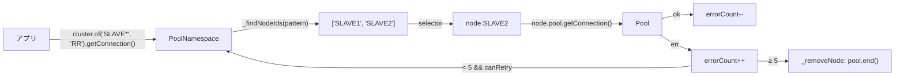

## 何を学んだか

mysql2 に「複数ノード」を扱う仕組みは `PoolCluster` しかない。[`lib/pool_cluster.js`](https://github.com/sidorares/node-mysql2/blob/d8932925b237f07b6410263770379998df973502/lib/pool_cluster.js) は 375 行で、やっていることは次の通り。

- ノードはアプリが `add(id, config)` で**静的に登録**する。`id` を省略すると `CLUSTER::N`
- `of(pattern, selector)` で、名前のワイルドカードパターンとセレクタ (RR / RANDOM / ORDER) の組を作る
- 健全性は **`getConnection` が失敗した回数だけ**で判定する。`removeNodeErrorCount` (既定 5) に達したら `_removeNode` で恒久削除し、そのプールを `end()` する
- `restoreNodeTimeout` (既定 0) を設定したときだけ、削除ではなく一時オフラインになる
- 接続に成功するとエラーカウントを 1 減らす
- クエリ実行中のエラーは一切数えない
- 接続オブジェクトには `_clusterId` を付けるだけで、他は何も足さない

つまり PoolCluster は「**アプリが列挙したプールの集合から、名前で 1 つ選ぶ**」機能であって、writer/reader の役割・DNS の古さ・フェイルオーバー後の役割変化・セッション状態・認証のどれも扱わない。`MASTER` という id は文字列であって、そのノードが本当に writer かどうかは誰も見ない。



## ソースコードのどこか

### セレクタは 10 行

[`#L13`](https://github.com/sidorares/node-mysql2/blob/d8932925b237f07b6410263770379998df973502/lib/pool_cluster.js#L13)。

```js title="lib/pool_cluster.js"
const makeSelector = {
  RR() {
    let index = 0;
    return (clusterIds) => clusterIds[index++ % clusterIds.length];
  },
  RANDOM() {
    return (clusterIds) => clusterIds[Math.floor(Math.random() * clusterIds.length)];
  },
  ORDER() {
    return (clusterIds) => clusterIds[0];
  },
};
```

`RR` は単純な巡回で、重みも接続数も見ない。`ORDER` は常に先頭で、フォールバック用 (先頭が落ちたら `_findNodeIds` から外れるので次が先頭になる)。ラッパの `roundRobin` が重み付きでクラスタ単位にキャッシュされ、`leastConnections` が内部プールの接続数を数え、`fastestResponse` が応答時間を監視するのとは、扱っている情報の量が違う ([ホスト可用性戦略と選択戦略](../host-availability-and-selection/))。

### ノードの登録と名前

`add` ([`#L188`](https://github.com/sidorares/node-mysql2/blob/d8932925b237f07b6410263770379998df973502/lib/pool_cluster.js#L188))。

```js title="lib/pool_cluster.js"
add(id, config) {
  if (typeof id === 'object') {
    config = id;
    id = `CLUSTER::${++this._lastId}`;
  }
  if (typeof this._nodes[id] === 'undefined') {
    this._nodes[id] = {
      id: id,
      errorCount: 0,
      pool: new Pool({ config: new PoolConfig(config) }),
      _offlineUntil: 0,
    };
    this._serviceableNodeIds.push(id);
    this._clearFindCaches();
  }
}
```

ノードは `{ id, errorCount, pool, _offlineUntil }` の 4 フィールドしか持たない。役割を表すフィールドは無い。README の例で `MASTER` / `SLAVE1` / `SLAVE2` と名付けるのは慣習で、コードはその文字列を `_findNodeIds` の正規表現マッチにしか使わない。

`of` ([`#L174`](https://github.com/sidorares/node-mysql2/blob/d8932925b237f07b6410263770379998df973502/lib/pool_cluster.js#L174)) は `pattern + selector` をキーに `PoolNamespace` をキャッシュする。`patternRegExp` が `*` を `.*` に変換して `^...$` で囲むので、`SLAVE*` は `SLAVE1`、`SLAVE2` にマッチする。

### 接続取得と、失敗回数だけの健全性判定

`PoolNamespace.getConnection` ([`#L59`](https://github.com/sidorares/node-mysql2/blob/d8932925b237f07b6410263770379998df973502/lib/pool_cluster.js#L59))。

```js title="lib/pool_cluster.js"
getConnection(cb) {
  const clusterNode = this._getClusterNode();
  if (clusterNode === null) {
    let err = new Error('Pool does Not exist.');
    err.code = 'POOL_NOEXIST';

    if (this._cluster._findNodeIds(this._pattern, true).length !== 0) {
      err = new Error('Pool does Not have online node.');
      err.code = 'POOL_NONEONLINE';
    }

    return cb(err);
  }
  return this._cluster._getConnection(clusterNode, (err, connection) => {
    if (err) {
      if (
        this._cluster._canRetry &&
        this._cluster._findNodeIds(this._pattern).length !== 0
      ) {
        this._cluster.emit('warn', err);
        return this.getConnection(cb);
      }

      return cb(err);
    }
    return cb(null, connection);
  });
}
```

`canRetry` (既定 true) のとき、失敗したら**同じパターンの別ノードで**再帰的にやり直す。「別ノード」になるのは、失敗で `errorCount` が増えて削除されるか、セレクタが次を返すかのどちらかによる。`POOL_NOEXIST` はパターンに合うノードが 1 つも無い、`POOL_NONEONLINE` は合うノードはあるが全部オフライン、という 2 つのエラーコードがある。

`_getConnection` ([`#L347`](https://github.com/sidorares/node-mysql2/blob/d8932925b237f07b6410263770379998df973502/lib/pool_cluster.js#L347)) がカウントを動かす唯一の場所である。

```js title="lib/pool_cluster.js"
_getConnection(node, cb) {
  node.pool.getConnection((err, connection) => {
    if (err) {
      this._increaseErrorCount(node);
      return cb(err);
    }
    this._decreaseErrorCount(node);

    connection._clusterId = node.id;
    return cb(null, connection);
  });
}
```

**`node.pool.getConnection` の成否だけ**である。取得した接続でクエリが `Connection lost` になっても、`errno 1290` で書けなくても、このコードには戻ってこない。`connection._clusterId = node.id` が、PoolCluster が接続に足す唯一の情報だ。

`_increaseErrorCount` / `_decreaseErrorCount` ([`#L310`](https://github.com/sidorares/node-mysql2/blob/d8932925b237f07b6410263770379998df973502/lib/pool_cluster.js#L310))。

```js title="lib/pool_cluster.js"
_increaseErrorCount(node) {
  const errorCount = ++node.errorCount;

  if (this._removeNodeErrorCount > errorCount) {
    return;
  }

  if (this._restoreNodeTimeout > 0) {
    node._offlineUntil =
      getMonotonicMilliseconds() + this._restoreNodeTimeout;
    this.emit('offline', node.id);
    return;
  }

  this._removeNode(node);
  this.emit('remove', node.id);
}

_decreaseErrorCount(node) {
  let errorCount = node.errorCount;

  if (errorCount > this._removeNodeErrorCount) {
    errorCount = this._removeNodeErrorCount;
  }

  if (errorCount < 1) {
    errorCount = 1;
  }

  node.errorCount = errorCount - 1;

  if (node._offlineUntil) {
    node._offlineUntil = 0;
    this.emit('online', node.id);
  }
}
```

既定 (`restoreNodeTimeout = 0`) では 5 回目の失敗で `_removeNode` に入り、[`#L360`](https://github.com/sidorares/node-mysql2/blob/d8932925b237f07b6410263770379998df973502/lib/pool_cluster.js#L360) で `_serviceableNodeIds` から外し、`delete this._nodes[id]`、そして `node.pool.end()` する。**戻す手段は `add()` し直す以外に無い。** `restoreNodeTimeout` を設定した場合だけ `_offlineUntil` で一時的に外れ、`_findNodeIds` ([`#L273`](https://github.com/sidorares/node-mysql2/blob/d8932925b237f07b6410263770379998df973502/lib/pool_cluster.js#L273)) が時刻を見て復帰させる。

### 接続を得た後は Pool と同じ

`PoolNamespace.query` ([`#L95`](https://github.com/sidorares/node-mysql2/blob/d8932925b237f07b6410263770379998df973502/lib/pool_cluster.js#L95)) は `getConnection` → `conn.query(query)` → `'end'` で `conn.release()`。Pool の `query` にあった「read-only エラーなら `destroy()`」の分岐 ([mysql2 の接続とクエリ](../mysql2-connection-and-query/)) すら無く、1290 を受けた接続もそのまま `release()` されてプールに戻る。

Promise 版 [`promise.js#L60`](https://github.com/sidorares/node-mysql2/blob/d8932925b237f07b6410263770379998df973502/promise.js#L60) の `PromisePoolCluster` は、コールバック版を Promise に包み `warn` / `remove` / `online` / `offline` イベントを転送するだけである。

## なぜそうなっているか

### mysql2 は「1 本の接続」のライブラリだから

mysql2 の責務は MySQL プロトコルを正しく話すことで、クラスタは責務の外にある。PoolCluster は mysqljs/mysql から引き継いだ互換 API で、「複数のプールを名前で束ねる」以上の機能を足す動機が mysql2 側に無い。健全性判定が接続取得に限られているのは、それが Pool の API (`getConnection` の失敗) だけで実装できる範囲だからである。

クエリ実行中のエラーを数えるには、接続に発生したエラーを PoolCluster まで戻す配線が要る。`connection._clusterId` を付けているので不可能ではないが、実装されていない。

### 役割を検証しないのは、役割という概念が無いから

`MASTER` / `SLAVE` は README の例に出てくる名前にすぎず、PoolCluster に「writer」という型は存在しない。したがって、フェイルオーバーで `MASTER` に登録した instance-1 が reader に降格しても、PoolCluster にとっては「接続が取れるノード」のままである。`of('MASTER').getConnection()` は instance-1 を返し続け、`INSERT` は毎回 1290 で落ちる。

ラッパがこれを解決するには、(1) 役割を DB に聞く手段 (`@@innodb_read_only`)、(2) 実行時エラーを分類する手段 (`MySQLErrorHandler`)、(3) 接続を差し替える場所 (plugin chain) の 3 つが要り、それがこの章の群 3・4・2 に対応する。

### 恒久削除が既定なのは、復帰の判断材料が無いから

PoolCluster は「いつ戻ってくるか」を知る術を持たない。`restoreNodeTimeout` は「N ミリ秒後にもう一度試す」という時間だけの推測で、既定で無効なのは、根拠なく再試行して失敗を繰り返すよりは削除して `remove` イベントでアプリに知らせるほうが安全という判断だろう。ラッパは `NOT_AVAILABLE` にした上で `exponentialBackoff` で徐々に再試行し、トポロジクエリで「戻ってきた」ことを確認できる。

## どう活かすか

- **「クラスタ対応」と書いてあっても、何を検知して何をするかを読む。** PoolCluster の検知は接続取得失敗、動作は削除。それ以上の期待をすると本番で外れる
- **名前に意味を持たせるなら、検証する仕組みをセットにする。** `MASTER` と名付けるだけでは何も保証されない。ラッパの `HostRole` は `getHostRole` で確かめた結果として付く
- **健全性の観測点を「接続時」だけにしない。** 接続はできるが使えない、という状態 (read-only、レプリカ遅延、過負荷) は実行時にしか見えない
- **削除と一時停止を分ける。** PoolCluster は `restoreNodeTimeout` で切り替えているが、既定が削除なのはユーザに判断を委ねている。自分で設計するなら、一時停止 + 指数バックオフを既定にし、削除は明示操作にする

### 実務で踏む失敗パターン

- **PoolCluster で Aurora の failover を乗り切れると思う。** 旧 writer は接続を受け付けるので `errorCount` は増えず、`MASTER` はずっと旧 writer を指す。書き込みは全部 1290 で落ちる
- **`removeNodeErrorCount` に達して `MASTER` が消え、`POOL_NOEXIST` で全滅する。** ネットワーク断が 5 回続くと `MASTER` が恒久削除される。復帰したくても `add()` し直すコードが要る
- **`SLAVE*` に reader だけ登録したつもりが、フェイルオーバーで 1 台が writer になる。** 書き込みが reader に飛ぶことは無いが、読み取り負荷が writer に乗る。PoolCluster にはこれを検知する手段が無い

比較表での総括は [PoolCluster と何が違うのか](../vs-pool-cluster/) にある。
