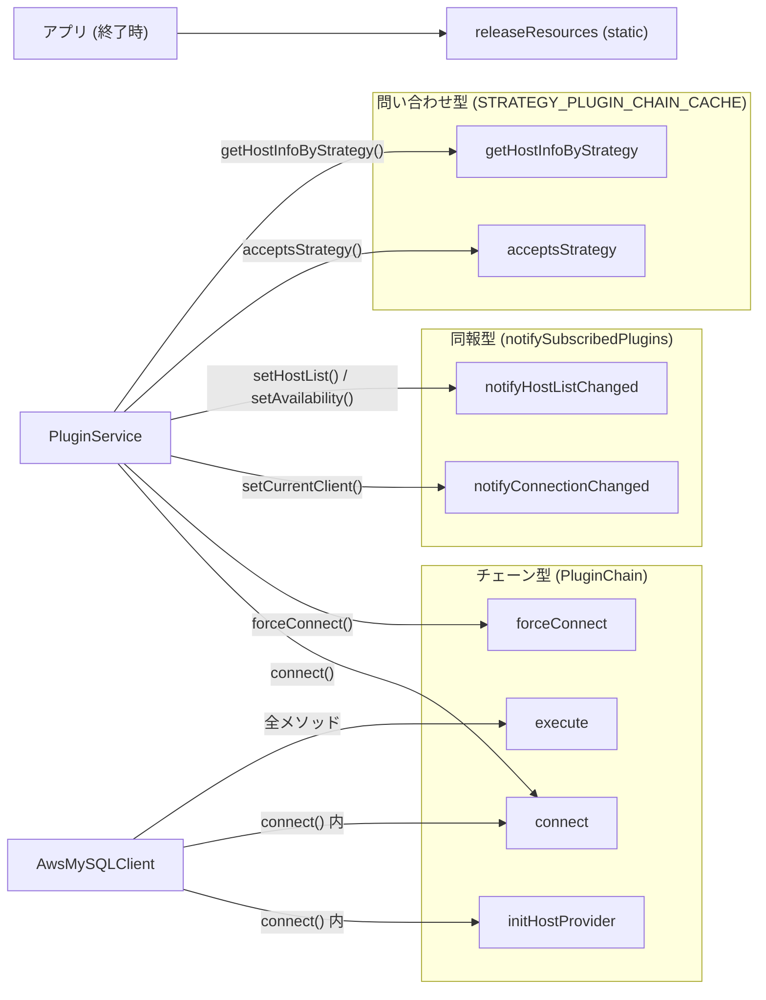

## この層の責務

`docs/development-guide/Pipelines.md` は「plugin pipeline is an execution workflow achieving a specific goal」と言い、9 本を列挙する。ただし docs は 9 本を同じ調子で並べているだけで、**呼び方が 4 種類ある**ことは書いていない。`PluginManager` を読むと、9 本は次のように分かれる。

| 種類       | パイプライン                                     | 呼び方                                                                                   |
| ---------- | ------------------------------------------------ | ---------------------------------------------------------------------------------------- |
| チェーン   | connect, forceConnect, execute, initHostProvider | 購読者をクロージャで入れ子にし、外側から順に呼ぶ。次を呼ぶかは各プラグインが決める       |
| 同報       | notifyConnectionChanged, notifyHostListChanged   | 購読者を配列順に `await` で全部呼ぶ。次を呼ぶ関数はない                                  |
| 問い合わせ | acceptsStrategy, getHostInfoByStrategy           | 購読者を順に聞き、最初に答えた者の結果を返す。購読者集合は静的にキャッシュ               |
| 終了処理   | releaseResources                                 | `CanReleaseResources` を実装するプラグインを、`PluginManager` の static メソッドから呼ぶ |

このページは、各パイプラインについて「誰が起動するか」「終端は何か」「戻り値はどう合成されるか」を確定させる。

## 主要な型とその関係



チェーン型の仕組みは [PluginChain](../plugin-chain/) で扱った。ここでは 4 本それぞれの**終端**と**起動者**を見る。

## 処理の流れ

### connect / forceConnect

[`plugin_manager.ts#L147`](https://github.com/aws/aws-advanced-nodejs-wrapper/blob/6d0ba1bdae81a4e1fd274b3569c5dc50cf0a7095/common/lib/plugin_manager.ts#L147) と [`#L180`](https://github.com/aws/aws-advanced-nodejs-wrapper/blob/6d0ba1bdae81a4e1fd274b3569c5dc50cf0a7095/common/lib/plugin_manager.ts#L180)。

```ts title="common/lib/plugin_manager.ts"
return this.executeWithSubscribedPlugins<ClientWrapper>(
  hostInfo,
  props,
  PluginManager.CONNECT_METHOD,
  (plugin, nextPluginFunc) =>
    this.runMethodFuncWithTelemetry(
      () => plugin.connect(hostInfo, props, isInitialConnection, nextPluginFunc),
      plugin.name,
    ),
  async () => {
    throw new AwsWrapperError("Shouldn't be called.");
  },
  pluginToSkip,
);
```

`targetFunc` は「呼ばれたら例外」。終端は `DefaultPlugin.connect` ([`default_plugin.ts#L70`](https://github.com/aws/aws-advanced-nodejs-wrapper/blob/6d0ba1bdae81a4e1fd274b3569c5dc50cf0a7095/common/lib/plugins/default_plugin.ts#L70)) で、これは `connectFunc` を**呼ばずに** `ConnectionProvider` へ行く。だから `"Shouldn't be called."` は本当に呼ばれない。

2 本の差は終端だけである。

|                     | connect                                                                                        | forceConnect                                                     |
| ------------------- | ---------------------------------------------------------------------------------------------- | ---------------------------------------------------------------- |
| 終端が使う provider | `connectionProviderManager.getConnectionProvider(hostInfo, props)` (effective があればそれ)    | `getForceConnectionProvider()` (常に `DriverConnectionProvider`) |
| 起動者              | `AwsMySQLClient.connect()` (`isInitialConnection = true`)、`pluginService.connect()` (`false`) | `pluginService.forceConnect()` のみ                              |
| 主な用途            | アプリの接続、フェイルオーバー時の張り直し                                                     | 監視用接続 (efm / トポロジモニタ)、内部プールを迂回したいとき    |

`forceConnect` が存在する理由は、内部コネクションプール (`InternalPooledConnectionProvider`) を `connectionProvider` に設定していても、**監視用の接続だけはプールから取りたくない**からである。監視接続はプールに返さず殺す前提なので、プールを経由すると壊れた接続がプールに戻る ([DefaultPlugin と ConnectionProvider](../default-plugin-and-connection-provider/))。

`bg` プラグインが `forceConnect` を購読しないことをコメントで明示している ([`blue_green_plugin.ts#L38`](https://github.com/aws/aws-advanced-nodejs-wrapper/blob/6d0ba1bdae81a4e1fd274b3569c5dc50cf0a7095/common/lib/plugins/bluegreen/blue_green_plugin.ts#L38))。自分の監視接続を自分で止めないためである。購読集合を分ける価値がここに出ている。

### execute

[`#L123`](https://github.com/aws/aws-advanced-nodejs-wrapper/blob/6d0ba1bdae81a4e1fd274b3569c5dc50cf0a7095/common/lib/plugin_manager.ts#L123)。終端は `AwsMySQLClient` が渡した `methodFunc` そのもので、`DefaultPlugin.execute` はそれをテレメトリで包んで呼ぶだけである。

`connect` と違い、**前後にエラーリスナの付け替え**がある。

```ts title="common/lib/plugin_manager.ts"
const currentClient: ClientWrapper = this.fullServicesContainer.pluginService.getCurrentClient().targetClient;
this.fullServicesContainer.pluginService.attachNoOpErrorListener(currentClient);
try {
  return await telemetryContext.start(() => this.executeWithSubscribedPlugins(...));
} finally {
  this.fullServicesContainer.pluginService.attachErrorListener(currentClient);
}
```

`currentClient` を**実行前に**捕まえていることに注意。フェイルオーバーで `targetClient` が差し替わっても、`finally` で追跡リスナが付くのは**古い**接続である。新しい接続には `DriverConnectionProvider.connect` が張った時点で追跡リスナを付けている ([`driver_connection_provider.ts#L95`](https://github.com/aws/aws-advanced-nodejs-wrapper/blob/6d0ba1bdae81a4e1fd274b3569c5dc50cf0a7095/common/lib/driver_connection_provider.ts#L95)) ので、辻褄は合う ([MySQLErrorHandler](../mysql-error-handler/))。

### initHostProvider

[`#L244`](https://github.com/aws/aws-advanced-nodejs-wrapper/blob/6d0ba1bdae81a4e1fd274b3569c5dc50cf0a7095/common/lib/plugin_manager.ts#L244)。`AwsClient.internalConnect()` から、接続前に 1 回だけ起動される。終端の `DefaultPlugin.initHostProvider` は `// do nothing`。

```ts title="common/lib/aws_client.ts#L138"
const hostListProvider: HostListProvider = this.pluginService
  .getDialect()
  .getHostListProvider(this.properties, this.properties.get("host"), this.fullServiceContainer);
this.pluginService.setHostListProvider(hostListProvider);
await this.pluginService.refreshHostList();
const initialHostInfo = this.pluginService.getInitialConnectionHostInfo();
if (initialHostInfo != null) {
  await this.pluginManager.initHostProvider(
    initialHostInfo,
    this.properties,
    this.fullServiceContainer.hostListProviderService,
  );
  await this.pluginService.refreshHostList();
}
```

順序が大事で、**Dialect が決めた `HostListProvider` を先に置いてから**パイプラインを走らせる。購読者 (initialConnection / staleDns / failover / failover2 / readWriteSplitting) は `hostListProviderService.getHostListProvider()` を見て「これは `RdsHostListProvider` か」を確認し、そうでなければ自分を無効化したり例外を投げたりする。`Pipelines.md` は「plugins may set up their own host list provider」と書くが、組み込みプラグインで実際に差し替えるものはなく、確認と設定の読み込みに使われている。

同期メソッドである点も特徴で、`ConnectionPlugin.initHostProvider` は `void` を返す。`PluginManager` 側で `Promise.resolve()` に包んで他と同じ形にしている。

### notifyConnectionChanged / notifyHostListChanged

[`#L264`](https://github.com/aws/aws-advanced-nodejs-wrapper/blob/6d0ba1bdae81a4e1fd274b3569c5dc50cf0a7095/common/lib/plugin_manager.ts#L264)。

```ts title="common/lib/plugin_manager.ts"
protected async notifySubscribedPlugins(methodName, pluginFunc, skipNotificationForThisPlugin) {
  for (const plugin of this._plugins) {
    if (plugin === skipNotificationForThisPlugin) {
      continue;
    }
    if (plugin.getSubscribedMethods().has(PluginManager.ALL_METHODS) || plugin.getSubscribedMethods().has(methodName)) {
      await pluginFunc(plugin, () => Promise.resolve());
    }
  }
}
```

入れ子ではなく**配列順に逐次 `await`**。`nextPluginFunc` 相当は `() => Promise.resolve()` のダミーで、誰も呼ばない。

- `notifyConnectionChanged(changes)` は `pluginService.setCurrentClient()` から呼ばれ、各プラグインの `OldConnectionSuggestionAction` を `Set` に集めて返す。`PRESERVE` が 1 つでもあれば旧接続を閉じない。`DISPOSE` と `NO_OPINION` の区別は現状の `setCurrentClient` では使われていない ([`plugin_service.ts#L546`](https://github.com/aws/aws-advanced-nodejs-wrapper/blob/6d0ba1bdae81a4e1fd274b3569c5dc50cf0a7095/common/lib/plugin_service.ts#L546))
- `notifyHostListChanged(changes)` は `setHostList()` (差分があったとき) と `setAvailability()` から呼ばれる。戻り値なし

`changes` の語彙は `HostChangeOptions` ([`host_change_options.ts`](https://github.com/aws/aws-advanced-nodejs-wrapper/blob/6d0ba1bdae81a4e1fd274b3569c5dc50cf0a7095/common/lib/host_change_options.ts)) の 10 種で、`HOSTNAME` / `PROMOTED_TO_WRITER` / `PROMOTED_TO_READER` / `WENT_UP` / `WENT_DOWN` / `CONNECTION_OBJECT_CHANGED` / `INITIAL_CONNECTION` / `HOST_ADDED` / `HOST_CHANGED` / `HOST_DELETED`。`PluginServiceImpl.compare()` が 2 つの `HostInfo` を比べて作る。

### acceptsStrategy / getHostInfoByStrategy

[`#L309`](https://github.com/aws/aws-advanced-nodejs-wrapper/blob/6d0ba1bdae81a4e1fd274b3569c5dc50cf0a7095/common/lib/plugin_manager.ts#L309) と [`#L340`](https://github.com/aws/aws-advanced-nodejs-wrapper/blob/6d0ba1bdae81a4e1fd274b3569c5dc50cf0a7095/common/lib/plugin_manager.ts#L340)。

```ts title="common/lib/plugin_manager.ts"
private static readonly STRATEGY_PLUGIN_CHAIN_CACHE = new Map<ConnectionPlugin[], Set<ConnectionPlugin>>();
```

購読者集合を `_plugins` 配列を**キー**にした static Map にキャッシュする。配列の参照が同じなら同じ `Set` が返る。初回は全プラグインを走査しながら答えを探し、2 回目以降はキャッシュ済みの `Set` だけを回る。

`getHostInfoByStrategy` は、対応していないプラグインが例外を投げる前提で `try/catch` で握り潰し、最初に `HostInfo` を返したプラグインの答えを採用する。`AbstractConnectionPlugin.getHostInfoByStrategy` の既定実装が例外を投げるのはこのため。

終端は `DefaultPlugin` で、`ConnectionProviderManager` に委ねる。`DriverConnectionProvider` は `random` と `roundRobin` を受け付け、`fastestResponseStrategy` プラグインは自分で `fastestResponse` を答える ([ホスト可用性戦略と選択戦略](../host-availability-and-selection/))。

### releaseResources

[`#L381`](https://github.com/aws/aws-advanced-nodejs-wrapper/blob/6d0ba1bdae81a4e1fd274b3569c5dc50cf0a7095/common/lib/plugin_manager.ts#L381)。

```ts title="common/lib/plugin_manager.ts"
static async releaseResources() {
  for (const plugin of PluginManager.PLUGINS) {
    if (PluginManager.implementsCanReleaseResources(plugin)) {
      try {
        await plugin.releaseResources();
      } catch (error) {
        // Do nothing
      }
    }
  }

  PluginManager.STRATEGY_PLUGIN_CHAIN_CACHE.clear();
  await CoreServicesContainer.releaseResources();

  PluginManager.PLUGINS = new Set();
}
```

`static` なので特定のクライアントに紐づかない。`PluginManager.PLUGINS` はプロセス内の全クライアントの全プラグインを溜めた `Set` で、`CanReleaseResources` (= `releaseResources()` メソッドを持つか、で判定する構造的な型ガード) を実装するものだけを呼ぶ。実装しているのは tracker / readWriteSplitting / efm / customEndpoint / bg / iam / secretsManager。

`Pipelines.md` は「will be called ... when `Client.end()` is called」と書くが、`AwsMySQLClient.end()` は `PluginManager.releaseResources()` を**呼ばない**。呼ぶのはアプリの責任で、呼ばないとモニタのタイマーが生き続ける ([バックグラウンドタスクと Node.js プロセス](../background-tasks-and-process/))。

## 守られている不変条件

- **チェーン型 4 本の終端は `DefaultPlugin` か `methodFunc`。** `connect` / `forceConnect` / `initHostProvider` は `DefaultPlugin` が終端で `targetFunc` に到達しない。`execute` だけが `targetFunc` に到達する
- **同報型はプラグインの戻りを待ってから次へ進む。** `Promise.all` ではない。1 つのプラグインの `notifyHostListChanged` が遅いと、後続の通知も遅れる
- **問い合わせ型のキャッシュは `_plugins` 配列の同一性に依存する。** `init()` を呼び直して配列を作り直すと、古い配列のキャッシュは残ったまま新しいエントリが増える。`releaseResources()` まで消えない
- **`pluginToSkip` が効くのはチェーン型 2 本 (`connect` / `forceConnect`) と同報型 1 本 (`notifyConnectionChanged`) だけ。** `execute` は常に `null` を渡す

## つまずきどころ

- **docs の 9 本には `abort` / `end` / `rollback` のような「購読できるメソッド名」が混ざっていない。** `LoadablePlugins.md` の「Plugins can subscribe to any of the methods listed below」は `connect` / `forceConnect` / `query` / `initHostProvider` / `notify*` / `rollback` / `end` を挙げるが、実際には `AwsMySQLClient` が `execute` に渡すメソッド名なら何でも購読できる。`NETWORK_BOUND_METHODS` の一覧のほうが正確
- **`notifyConnectionChanged` は接続の差し替えが終わった後に届く。** `setCurrentClient` の中で `targetClient` を書き換え、セッション状態を転送した**後**に呼ばれる。通知を受けた時点で `pluginService.getCurrentClient().targetClient` はもう新しい接続を指している
- **`forceConnect` は `isInitialConnection` に `false` しか渡らない**... と思いきや、`PartialPluginService.forceConnect` は `true` を渡す ([`partial_plugin_service.ts#L361`](https://github.com/aws/aws-advanced-nodejs-wrapper/blob/6d0ba1bdae81a4e1fd274b3569c5dc50cf0a7095/common/lib/partial_plugin_service.ts#L361))。モニタが張る監視接続は「その (最小構成の) サービスコンテナにとって最初の接続」として扱われる
- **`acceptsStrategy` に `HostRole.UNKNOWN` を渡すと `DefaultPlugin` は常に `false`。** writer か reader かを明示しないと戦略は使えない
