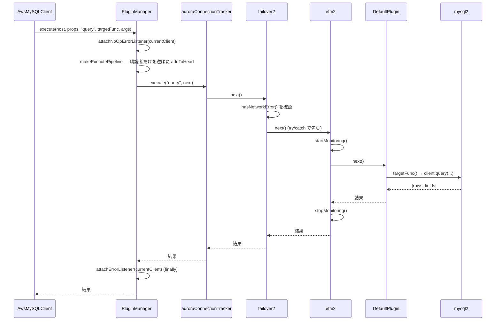

## この層の責務

「全メソッドが plugin chain を通る」の、chain の正体がここにある。`PluginManager` は呼び出しごとに、**そのメソッド名を購読しているプラグインだけ**を選び、**配列の末尾から先頭へ**クロージャで包んでいく。出来上がるのは `() => Promise<T>` が 1 つで、それを呼ぶと先頭のプラグインから順に `execute` が走り、各プラグインが `nextPluginFunc()` を呼ぶことで内側へ進む。

Express のミドルウェアや tower の `Service` と同じ構造だが、**毎回組み直す**点と、**購読していないプラグインは層にすら現れない**点が違う。

## 主要な型とその関係

### `ConnectionPlugin`: 割り込みの契約

[`common/lib/connection_plugin.ts#L24`](https://github.com/aws/aws-advanced-nodejs-wrapper/blob/6d0ba1bdae81a4e1fd274b3569c5dc50cf0a7095/common/lib/connection_plugin.ts#L24)。

```ts title="common/lib/connection_plugin.ts"
export interface ConnectionPlugin {
  name: string;
  getSubscribedMethods(): Set<string>;

  connect(
    hostInfo,
    props,
    isInitialConnection,
    connectFunc: () => Promise<ClientWrapper>,
  ): Promise<ClientWrapper>;
  forceConnect(
    hostInfo,
    props,
    isInitialConnection,
    forceConnectFunc: () => Promise<ClientWrapper>,
  ): Promise<ClientWrapper>;
  execute<T>(methodName: string, methodFunc: () => Promise<T>, methodArgs: any[]): Promise<T>;
  initHostProvider(
    hostInfo,
    props,
    hostListProviderService,
    initHostProviderFunc: () => void,
  ): void;

  notifyConnectionChanged(changes: Set<HostChangeOptions>): Promise<OldConnectionSuggestionAction>;
  notifyHostListChanged(changes: Map<string, Set<HostChangeOptions>>): Promise<void>;
  acceptsStrategy(role: HostRole, strategy: string): boolean;
  getHostInfoByStrategy(role: HostRole, strategy: string, hosts?: HostInfo[]): HostInfo | undefined;
}
```

上 4 つ (`connect` / `forceConnect` / `execute` / `initHostProvider`) は「次を呼ぶ関数」を引数に取る。この 4 つが**チェーン型**のパイプラインで、このページの対象である。下 4 つは次を呼ぶ関数を持たない**通知・問い合わせ型**で、[9 本のパイプライン](../pipelines/) で扱う。

`AbstractConnectionPlugin` ([`abstract_connection_plugin.ts#L25`](https://github.com/aws/aws-advanced-nodejs-wrapper/blob/6d0ba1bdae81a4e1fd274b3569c5dc50cf0a7095/common/lib/abstract_connection_plugin.ts#L25)) は全メソッドを「次を呼ぶだけ」で実装した素通しの基底で、組み込みプラグインは全部これを継承している。`name` は `this.constructor.name` で、テレメトリのスパン名になる。

### `PluginChain`: 34 行の入れ子ビルダ

[`common/lib/plugin_manager.ts#L39`](https://github.com/aws/aws-advanced-nodejs-wrapper/blob/6d0ba1bdae81a4e1fd274b3569c5dc50cf0a7095/common/lib/plugin_manager.ts#L39)。

```ts title="common/lib/plugin_manager.ts"
type PluginFunc<T> = (plugin: ConnectionPlugin, targetFunc: () => Promise<T>) => Promise<T>;

class PluginChain<T> {
  private readonly targetFunc: () => Promise<T>;
  private chain?: (
    pluginFunc: PluginFunc<T>,
    targetFunc: () => Promise<T>,
    pluginToSkip: ConnectionPlugin | null,
  ) => Promise<T>;

  constructor(targetFunc: () => Promise<T>) {
    this.targetFunc = targetFunc;
  }

  addToHead(plugin: ConnectionPlugin, pluginToSkip: ConnectionPlugin | null) {
    if (this.chain === undefined) {
      this.chain = (pluginFunc, targetFunc, pluginToSkip) => pluginFunc(plugin, targetFunc);
    } else {
      const pipelineSoFar = this.chain;
      // @ts-ignore
      if (plugin !== pluginToSkip) {
        this.chain = (pluginFunc, targetFunc, pluginToSkip) => {
          return pluginFunc(plugin, () => pipelineSoFar(pluginFunc, targetFunc, pluginToSkip));
        };
      }
    }
    return this;
  }

  execute(pluginFunc: PluginFunc<T>, pluginToSkip: ConnectionPlugin | null): Promise<T> {
    if (this.chain === undefined) {
      throw new AwsWrapperError(Messages.get("PluginManager.pipelineNone"));
    }
    return this.chain(pluginFunc, this.targetFunc, pluginToSkip);
  }
}
```

3 つの関数が登場する。

| 名前         | 誰が渡す           | 何をするか                                                                                                     |
| ------------ | ------------------ | -------------------------------------------------------------------------------------------------------------- |
| `targetFunc` | `AwsMySQLClient`   | 最内側。mysql2 のメソッドを呼ぶ本体                                                                            |
| `pluginFunc` | `PluginManager`    | 「このプラグインの、このメソッド (execute / connect / ...) を、次の関数を渡して呼ぶ」という 1 段分の呼び出し方 |
| `chain`      | `PluginChain` 自身 | ここまで組んだ入れ子                                                                                           |

`addToHead` は名前の通り**先頭に足す**。最初の 1 個は `pluginFunc(plugin, targetFunc)` で、以降は `pluginFunc(plugin, () => これまでの chain)` と包む。だから、`makeExecutePipeline` は配列を**逆順**に回す。

```ts title="common/lib/plugin_manager.ts#L225"
makeExecutePipeline<T>(hostInfo, props, name, methodFunc, pluginToSkip): PluginChain<T> {
  const chain = new PluginChain(methodFunc);

  for (let i = this._plugins.length - 1; i >= 0; i--) {
    const p = this._plugins[i];
    if (p.getSubscribedMethods().has("*") || p.getSubscribedMethods().has(name)) {
      chain.addToHead(p, pluginToSkip);
    }
  }

  return chain;
}
```

`_plugins` の末尾は常に `DefaultPlugin` で、それが `"*"` を購読しているので必ず最初に `addToHead` される。つまり `chain` が `undefined` のままになることはなく、`pipelineNone` の例外は実質「`init()` を呼び忘れた」場合にしか出ない。

### `pluginFunc`: 1 段分の呼び方

`execute` パイプラインなら、[`plugin_manager.ts#L123`](https://github.com/aws/aws-advanced-nodejs-wrapper/blob/6d0ba1bdae81a4e1fd274b3569c5dc50cf0a7095/common/lib/plugin_manager.ts#L123) で作られる。

```ts title="common/lib/plugin_manager.ts"
(plugin, nextPluginFunc) =>
  this.runMethodFuncWithTelemetry(
    () => plugin.execute(methodName, nextPluginFunc, options),
    plugin.name,
  );
```

`connect` パイプラインなら `plugin.connect(hostInfo, props, isInitialConnection, nextPluginFunc)`。**メソッドが違っても `PluginChain` は同じ**で、違うのは各段で何を呼ぶかを表す `pluginFunc` だけである。

## 処理の流れ

既定プラグイン `initialConnection,auroraConnectionTracker,failover2,efm2` + `DefaultPlugin` で `client.query()` を呼んだ場合を追う。

### 購読の判定

各プラグインの購読集合はこうなっている。

| プラグイン              | 購読                                                                | 場所                                                                                                                                                                                                                        |
| ----------------------- | ------------------------------------------------------------------- | --------------------------------------------------------------------------------------------------------------------------------------------------------------------------------------------------------------------------- |
| initialConnection       | `initHostProvider`, `connect`                                       | [`aurora_initial_connection_strategy_plugin.ts#L34`](https://github.com/aws/aws-advanced-nodejs-wrapper/blob/6d0ba1bdae81a4e1fd274b3569c5dc50cf0a7095/common/lib/plugins/aurora_initial_connection_strategy_plugin.ts#L34)  |
| auroraConnectionTracker | `NETWORK_BOUND_METHODS` + `end`, `abort`, `notifyHostListChanged`   | [`aurora_connection_tracker_plugin.ts#L31`](https://github.com/aws/aws-advanced-nodejs-wrapper/blob/6d0ba1bdae81a4e1fd274b3569c5dc50cf0a7095/common/lib/plugins/connection_tracker/aurora_connection_tracker_plugin.ts#L31) |
| failover2               | `initHostProvider`, `connect`, `query`                              | [`failover2_plugin.ts#L49`](https://github.com/aws/aws-advanced-nodejs-wrapper/blob/6d0ba1bdae81a4e1fd274b3569c5dc50cf0a7095/common/lib/plugins/failover2/failover2_plugin.ts#L49)                                          |
| efm2 (efm の派生)       | `"*"`、ただし `execute` の中で `NETWORK_BOUND_METHODS` 以外は素通し | [`host_monitoring_connection_plugin.ts#L57`](https://github.com/aws/aws-advanced-nodejs-wrapper/blob/6d0ba1bdae81a4e1fd274b3569c5dc50cf0a7095/common/lib/plugins/efm/v1/host_monitoring_connection_plugin.ts#L57)           |
| DefaultPlugin           | `"*"`                                                               | [`default_plugin.ts#L48`](https://github.com/aws/aws-advanced-nodejs-wrapper/blob/6d0ba1bdae81a4e1fd274b3569c5dc50cf0a7095/common/lib/plugins/default_plugin.ts#L48)                                                        |

`NETWORK_BOUND_METHODS` は `connect` / `forceConnect` / `query` / `execute` / `rollback` / `beginTransaction` / `commit` / `changeUser` / `pause` / `resume` / `prepare` / `unprepare` ([`subscribed_method_helper.ts#L18`](https://github.com/aws/aws-advanced-nodejs-wrapper/blob/6d0ba1bdae81a4e1fd274b3569c5dc50cf0a7095/common/lib/utils/subscribed_method_helper.ts#L18))。

`"query"` に対して残るのは tracker / failover2 / efm2 / Default の 4 つで、initialConnection は層に現れない。

### 入れ子の実体

逆順に `addToHead` するので、最終的な `chain` はこう展開される。

```text
tracker.execute("query", () =>
  failover2.execute("query", () =>
    efm2.execute("query", () =>
      DefaultPlugin.execute("query", () =>
        targetFunc()          // mysql2 の client.query(...)
      )
    )
  )
)
```



読み方のポイントは、**外側ほど「前後に何かする」プラグイン、内側ほど「本体に近い」プラグイン**という並びになっていることだ。

- failover2 が efm2 の**外側**にいるので、efm2 が監視で接続を殺して例外が上がってきたとき、failover2 の `catch` がそれを受け取れる
- efm2 が DefaultPlugin の**すぐ外**にいるので、監視の開始と停止が本体の実行時間だけを囲む

この並びは `plugins` に書いた順ではなく weight で決まる ([プラグインの並び順](../plugin-order/))。

### `pluginToSkip`: 自分を飛ばして再入する

`addToHead` の `plugin !== pluginToSkip` は、**プラグインが自分自身を除いたチェーンで `connect` を呼び直す**ためにある。典型は failover で、フェイルオーバー中に新しい接続を張るとき `pluginService.connect(hostInfo, props, this)` と自分を渡す。そうしないと、新しい接続の `connect` パイプラインでまた failover プラグインの `connect` が走り、無限に再入する。

ただし `chain === undefined` の分岐 (= 最初に足される `DefaultPlugin`) では skip 判定をしていない。`DefaultPlugin` を skip すると接続を張る者がいなくなるので、これで正しい。

### 例外の伝播

`PluginChain` は例外を何もしない。プラグインの `execute` が `await nextPluginFunc()` を `try` で囲んでいなければ、そのまま外側へ抜ける。だから「例外を捕まえて別のことをする」のはプラグイン側の責務で、failover2 の `execute` は `try { result = await methodFunc() } catch (e) { ... }` の形になっている。`PluginManager.execute` の `finally` はエラーリスナの付け替えだけを保証する ([MySQLErrorHandler](../mysql-error-handler/))。

## 守られている不変条件

- **チェーンは呼び出しごとに使い捨て。** `makeExecutePipeline` の結果はどこにも保存されない。プラグインの購読集合が実行中に変わっても、次の呼び出しから反映される。コストは呼び出しごとに O(プラグイン数) のクロージャ生成で、既定 5 個なら無視できる
- **同じメソッドを購読するプラグインの相対順は `_plugins` の順。** `addToHead` は逆順に回して先頭に足すので、結果の外側から内側は `_plugins` の先頭から末尾と一致する
- **`DefaultPlugin` が最内側。** `_plugins` の末尾に固定されているので、逆順ループで最初に `addToHead` され、最内側になる。本体 (`targetFunc`) を呼ぶのは `DefaultPlugin.execute` だけである
- **`"*"` 購読は全パイプラインに乗る。** `"*"` は `execute` だけでなく `connect` / `forceConnect` / `initHostProvider` / 通知系すべてに反応する。efm2 が `"*"` なのに `forceConnect` で監視接続を作れているのは、`AbstractConnectionPlugin.forceConnect` が素通しだからで、efm2 の `execute` だけが中身を持つ

## つまずきどころ

- **購読していないメソッドの前後には何も起きない。** `ping` は `NETWORK_BOUND_METHODS` に入っていないので、failover2 も tracker も反応しない。「`ping()` でフェイルオーバーを検知する」は成立しない
- **`"*"` で購読して重い処理を挟むと、全メソッドが遅くなる。** `escape` や `format` のようなネットワークに出ないメソッドも通るため。`LoadablePlugins.md` の TIP がこれを警告している。自前プラグインを書くなら `NETWORK_BOUND_METHODS` を使う
- **`methodArgs` は `execute` にだけ渡る。** `connect` パイプラインには `hostInfo` / `props` / `isInitialConnection` が渡り、`args` はない。`query` の引数を見て何かするプラグインは `execute` 側で `methodArgs[0]` (= `options`) を読む。`getQueryFromMethodArg` が文字列と `{ sql }` の両方を吸収する
- **`PluginFunc` の第 2 引数はクロージャなので、2 回呼ぶと本体が 2 回走る。** リトライ目的で `await methodFunc()` を 2 回呼ぶプラグインは、内側のプラグインも 2 回走らせている。failover2 がリトライ後に本体を再実行しないのは、この理由もある ([FailoverSuccessError](../failover-success-error/))
- **`connect` パイプラインの終端は `"Shouldn't be called."`。** `PluginManager.connect` が渡す `methodFunc` は例外を投げるだけで、実際の接続は `DefaultPlugin.connect` が `connectFunc` を呼ばずに `ConnectionProvider` へ行く。`DefaultPlugin` より内側に何かを足すことはできない
