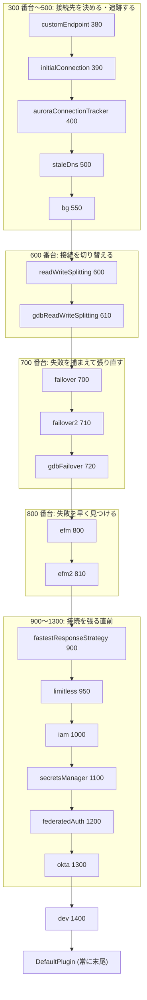

## この層の責務

`plugins: "iam,failover2,efm2"` のような文字列から `ConnectionPlugin[]` を作るのが `ConnectionPluginChainBuilder` ([`common/lib/connection_plugin_chain_builder.ts`](https://github.com/aws/aws-advanced-nodejs-wrapper/blob/6d0ba1bdae81a4e1fd274b3569c5dc50cf0a7095/common/lib/connection_plugin_chain_builder.ts)) の仕事で、179 行のうち本体は `getPlugins` の 70 行しかない。しかしこの 70 行が決める**配列の順序**が、前ページの入れ子の外側と内側を決め、ひいては「efm が接続を殺したとき failover が捕まえられるか」「IAM トークンが最後に付くか」を決めている。

## 主要な型とその関係

### プラグインコードと weight の表

[`#L62`](https://github.com/aws/aws-advanced-nodejs-wrapper/blob/6d0ba1bdae81a4e1fd274b3569c5dc50cf0a7095/common/lib/connection_plugin_chain_builder.ts#L62)。

```ts title="common/lib/connection_plugin_chain_builder.ts"
static readonly WEIGHT_RELATIVE_TO_PRIOR_PLUGIN = -1;

static readonly PLUGIN_FACTORIES = new Map<string, PluginFactoryInfo>([
  ["customEndpoint", { factory: CustomEndpointPluginFactory, weight: 380 }],
  ["initialConnection", { factory: AuroraInitialConnectionStrategyFactory, weight: 390 }],
  ["auroraConnectionTracker", { factory: AuroraConnectionTrackerPluginFactory, weight: 400 }],
  ["staleDns", { factory: StaleDnsPluginFactory, weight: 500 }],
  ["bg", { factory: BlueGreenPluginFactory, weight: 550 }],
  ["readWriteSplitting", { factory: ReadWriteSplittingPluginFactory, weight: 600 }],
  ["gdbReadWriteSplitting", { factory: GlobalDbReadWriteSplittingPluginFactory, weight: 610 }],
  ["failover", { factory: FailoverPluginFactory, weight: 700 }],
  ["failover2", { factory: Failover2PluginFactory, weight: 710 }],
  ["gdbFailover", { factory: GlobalDbFailoverPluginFactory, weight: 720 }],
  ["efm", { factory: HostMonitoringPluginFactory, weight: 800 }],
  ["efm2", { factory: HostMonitoring2PluginFactory, weight: 810 }],
  ["fastestResponseStrategy", { factory: FastestResponseStrategyPluginFactory, weight: 900 }],
  ["limitless", { factory: LimitlessConnectionPluginFactory, weight: 950 }],
  ["iam", { factory: IamAuthenticationPluginFactory, weight: 1000 }],
  ["secretsManager", { factory: AwsSecretsManagerPluginFactory, weight: 1100 }],
  ["federatedAuth", { factory: FederatedAuthPluginFactory, weight: 1200 }],
  ["okta", { factory: OktaAuthPluginFactory, weight: 1300 }],
  ["dev", { factory: DeveloperConnectionPluginFactory, weight: 1400 }],
  ["connectTime", { factory: ConnectTimePluginFactory, weight: ConnectionPluginChainBuilder.WEIGHT_RELATIVE_TO_PRIOR_PLUGIN }],
  ["executeTime", { factory: ExecuteTimePluginFactory, weight: ConnectionPluginChainBuilder.WEIGHT_RELATIVE_TO_PRIOR_PLUGIN }]
]);
```

weight が小さいほど**配列の前 = 入れ子の外側**になる。数字を層で読み直すとこうなる。



- **認証 (1000〜1300) が最内側**にあるのは、`connect` パイプラインで「接続を張る直前」にトークンを `props` に書き込む必要があるから。failover が張り直す接続にも、readWriteSplitting が reader に張る接続にも、同じ認証が効く
- **efm (800) が failover (700) の内側**にあるのは、efm が「監視で死亡と判定 → `abortConnection` → 実行中クエリが例外で落ちる」を起こす側で、その例外を外側の failover が捕まえる必要があるから。逆だと failover は efm が起こした例外を知らずに終わる
- **readWriteSplitting (600) が failover (700) の外側**にあるのは、`setReadOnly` で reader に切り替えた接続でフェイルオーバーが起きたとき、failover が新しい接続を張った後で readWriteSplitting の `notifyConnectionChanged` が動く必要があるから
- **customEndpoint (380) が最外側**なのは、許可ホスト一覧を `PluginService` に流し込んでから、内側の全員が `getHosts()` を見るため

### `-1` は「直前のプラグインにくっつく」

`connectTime` / `executeTime` の weight は `WEIGHT_RELATIVE_TO_PRIOR_PLUGIN = -1` で、これは数値ではなくフラグである。

```ts title="common/lib/connection_plugin_chain_builder.ts#L149"
let lastWeight = 0;
pluginCodeList.forEach((p) => {
  const factoryInfo = ConnectionPluginChainBuilder.PLUGIN_FACTORIES.get(p);
  if (factoryInfo) {
    if (factoryInfo.weight === ConnectionPluginChainBuilder.WEIGHT_RELATIVE_TO_PRIOR_PLUGIN) {
      lastWeight++;
    } else {
      lastWeight = factoryInfo.weight;
    }
    pluginFactoryInfoList.push({ factory: factoryInfo.factory, weight: lastWeight });
  }
});
```

`"iam,executeTime,connectTime,failover"` なら `executeTime` は 1001、`connectTime` は 1002 になり、ソート後も iam の直後に並ぶ。「計測プラグインは、計測したい相手のすぐ内側に置く」という意図をコード側で保証している。テスト "sort plugins with stick to prior" ([`tests/unit/connection_plugin_chain_builder.test.ts#L91`](https://github.com/aws/aws-advanced-nodejs-wrapper/blob/6d0ba1bdae81a4e1fd274b3569c5dc50cf0a7095/tests/unit/connection_plugin_chain_builder.test.ts#L91)) がこの並びを固定している。

`PluginManager.registerPlugin(code, factory)` ([`plugin_manager.ts#L431`](https://github.com/aws/aws-advanced-nodejs-wrapper/blob/6d0ba1bdae81a4e1fd274b3569c5dc50cf0a7095/common/lib/plugin_manager.ts#L431)) で登録した自前プラグインも weight は `-1` になる。つまり**自前プラグインは、`plugins` で直前に書いたプラグインのすぐ内側**に置かれる。

## 処理の流れ

`getPlugins` ([`#L108`](https://github.com/aws/aws-advanced-nodejs-wrapper/blob/6d0ba1bdae81a4e1fd274b3569c5dc50cf0a7095/common/lib/connection_plugin_chain_builder.ts#L108)) は `PluginManager.init()` から 1 回だけ呼ばれる。

1. `configurationProfile` があればそこからファクトリ一覧を取る (MySQL では例外になるので実質通らない)
2. なければ `props.get("plugins")`。未設定なら `WrapperProperties.DEFAULT_PLUGINS`
3. `usingDefault = pluginCodes === DEFAULT_PLUGINS` を記録する。**文字列の完全一致**である
4. カンマで割り、各コードを `PLUGIN_FACTORIES` で引く。ないコードは `unknownPluginCode` で例外
5. `!usingDefault && 要素数 > 1 && autoSortWrapperPluginOrder (既定 true)` のときだけ weight でソートし、並び替えたことを `logger.info` する
6. 各ファクトリの `getInstance(servicesContainer, props)` を `await` で順に呼ぶ
7. 最後に `new DefaultPlugin(...)` を `push`

3 と 5 の関係が面白い。既定文字列そのままなら**ソートをスキップ**する。既定の 4 つ (`390, 400, 710, 810`) はもともと昇順で書かれているので結果は同じだが、「既定で使っている人のログに『並び替えました』が出ない」ための分岐である。

`usingDefault` が `true` になるのは文字列が完全一致した場合だけなので、`"initialConnection, auroraConnectionTracker,failover2,efm2"` のようにスペースが入ると `false` になり、ソートは走るが順序は変わらず、ログだけが出る。

### 既定の 4 つ

[`wrapper_property.ts#L269`](https://github.com/aws/aws-advanced-nodejs-wrapper/blob/6d0ba1bdae81a4e1fd274b3569c5dc50cf0a7095/common/lib/wrapper_property.ts#L269)。

```ts
static readonly DEFAULT_PLUGINS = "initialConnection,auroraConnectionTracker,failover2,efm2";
```

| コード                    | 役割                                                                                                 | 詳細ページ                                                      |
| ------------------------- | ---------------------------------------------------------------------------------------------------- | --------------------------------------------------------------- |
| `initialConnection`       | 最初の接続で writer / reader を検証し、フェイルオーバー直後の DNS のずれを吸収する。2.1.1 で既定入り | [initialConnection プラグイン](../initial-connection-strategy/) |
| `auroraConnectionTracker` | 開いた接続を追跡し、writer 交代時に遊休接続を切る                                                    | [auroraConnectionTracker](../connection-tracker/)               |
| `failover2`               | 実行時エラーを捕まえて接続を差し替える。v1 の `failover` の後継                                      | [全体像](../failover-overview/)                                 |
| `efm2`                    | 監視用接続で生死を判定し、実行中クエリを早く落とす                                                   | [efm と efm2 の違い](../efm-v1-vs-v2/)                          |

4 つとも Aurora 前提である。素の RDS MySQL や自前 MySQL に繋ぐと、`initialConnection` と `failover2` は `RdsHostListProvider` がないので初期化時にほぼ何もしない状態になる。認証系 (`iam` / `secretsManager`) は既定に入っていないので、使うなら `plugins` に明示する。そのとき**既定の 4 つも書き直す**必要がある。`plugins: "iam"` と書くと iam だけになる。

### 何を「既定にしないか」の判断

表の中で既定外のものを見ると、方針が読める。

- `failover` (v1) と `efm` (v1) は残っているが既定は v2。v1 は Multi-AZ での動作確認が取れている唯一の failover で、消せない ([Multi-AZ 向け FailoverRestriction](../failover-restriction-multi-az/))
- `readWriteSplitting` は接続を 2 本持つので、明示的に選ばせる
- `staleDns` は `initialConnection` と役割が重なる。2.1.1 で `initialConnection` が既定入りしたのはその置き換えである

## 守られている不変条件

- **`DefaultPlugin` は `plugins` の値に関わらず末尾に 1 つ。** `plugins: ""` でも `[DefaultPlugin]` になり、mysql2 素のまま相当で動く。逆に `plugins` に `"default"` のようなコードはなく、ユーザが位置を動かすことはできない
- **同じ weight のプラグインは書いた順。** `Array.prototype.sort` は安定ソートなので、`-1` 系で同じ値になった場合も入力順が保たれる
- **`failover` と `failover2` を両方書いても弾かれない。** 700 と 710 で並ぶだけ。互換性表で「排他」とされている組み合わせを検証するコードはない ([互換性表を読む](../compatibility-matrix/))
- **ファクトリの `getInstance` は逐次 `await`。** 並列ではない。認証系プラグインのファクトリが optional peerDependency を動的 import するので、ここで初めて「パッケージがない」エラーが出る

## つまずきどころ

- **`UsingTheNodejsWrapper.md` の "The plugins will be initialized and executed in the order they have been specified" は、`autoSortWrapperPluginOrder: false` のときだけ正しい。** 既定はソートされる。順序を自分で決めたい場合は明示的に `false` にする。テスト "preserve plugin order" ([`#L72`](https://github.com/aws/aws-advanced-nodejs-wrapper/blob/6d0ba1bdae81a4e1fd274b3569c5dc50cf0a7095/tests/unit/connection_plugin_chain_builder.test.ts#L72)) がその挙動を確認している
- **`plugins` を上書きすると既定が全部消える。** `plugins: "iam"` で failover が消えたことに気づかないのが最頻。`"iam,initialConnection,auroraConnectionTracker,failover2,efm2"` と書く
- **`autoSortWrapperPluginOrder: false` で `efm2,failover2` の順に書くと、efm2 が外側になる。** efm2 が接続を殺した例外は failover2 の外を通り、アプリにそのまま届く。`WrapperProperty` の説明文に "Disable it at your own risk" とある理由
- **`profileName` は MySQL で例外。** `AwsClient` のコンストラクタが `DriverConfigurationProfiles.getProfileConfiguration` を引き、`configurationProfileNotFound` を投げる ([`aws_client.ts#L76`](https://github.com/aws/aws-advanced-nodejs-wrapper/blob/6d0ba1bdae81a4e1fd274b3569c5dc50cf0a7095/common/lib/aws_client.ts#L76))。プリセットは PG 専用
- **`PluginManager.PLUGINS` は静的な `Set`。** `init()` のたびに全プラグインが追加され、`PluginManager.releaseResources()` が呼ばれるまで溜まる。`AwsMySQLPoolClient.query()` はクエリごとに `init()` を呼ぶので、プール経由でクエリを流し続けるとこの `Set` は増え続ける ([AwsMySQLPoolClient](../aws-mysql-pool-client/))
