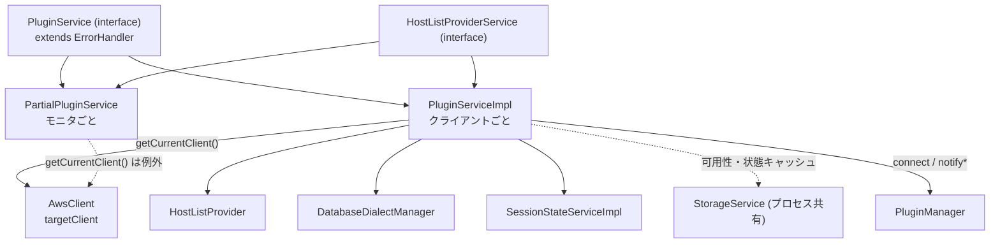
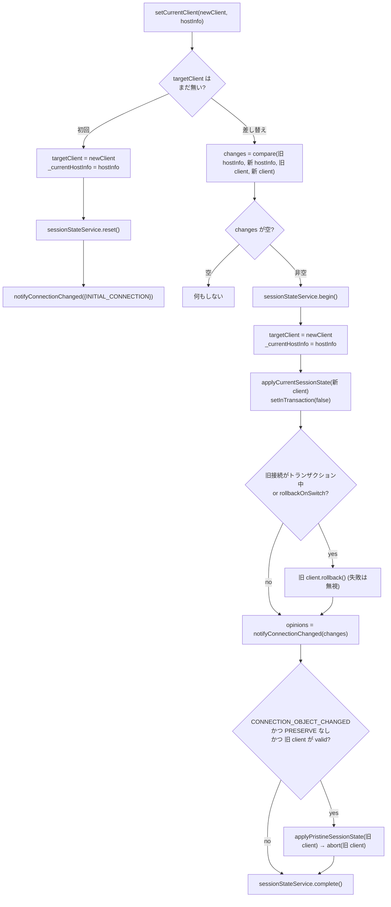

## この層の責務

`docs/development-guide/LoadablePlugins.md` の "What is Not Allowed in Plugins" の 1 番目はこうである。

> Keeping local copies of shared information: information like current connection, or the host list provider are shared across all plugins. Shared information may be updated by any plugin at any time and should be retrieved via the plugin service when required.

failover2 が接続を差し替えた瞬間に、efm2 は新しい接続を監視し、tracker は新しい接続を追跡し、readWriteSplitting は「今 writer にいるか」を知る必要がある。これを各プラグインがフィールドで持っていたら、誰かが更新するたびに全員に伝えて回ることになる。代わりに、**状態を 1 か所に置いて全員がそこを読む**。それが `PluginService` で、プラグインは `FullServicesContainer` 経由で同じインスタンスを受け取る。

`PluginService` が持つ状態は 5 種類に整理できる。

| 状態               | フィールド                                                    | 読む側の代表                                 |
| ------------------ | ------------------------------------------------------------- | -------------------------------------------- |
| 現在の接続と接続先 | `_currentClient.targetClient`, `_currentHostInfo`             | 全プラグイン                                 |
| ホスト一覧         | `hosts`, `_hostListProvider`, `allowedAndBlockedHosts`        | failover, readWriteSplitting, customEndpoint |
| Dialect            | `dialect`, `_isDialectConfirmed`, `driverDialect`             | 全プラグイン (エラー分類・クエリ)            |
| セッション状態     | `sessionStateService`, `_isInTransaction`                     | failover (rollback 判断), readWriteSplitting |
| 一時的なフラグ     | `routedHostInfo`, `_isPooledClient`, `_trackedConnectionHost` | initialConnection, tracker, bg               |

## 主要な型とその関係



`PluginService` インタフェースは [`plugin_service.ts#L52`](https://github.com/aws/aws-advanced-nodejs-wrapper/blob/6d0ba1bdae81a4e1fd274b3569c5dc50cf0a7095/common/lib/plugin_service.ts#L52) にあり、`ErrorHandler` を継承する。つまり `pluginService.isNetworkError(e)` が呼べる。実装の `PluginServiceImpl` ([`#L166`](https://github.com/aws/aws-advanced-nodejs-wrapper/blob/6d0ba1bdae81a4e1fd274b3569c5dc50cf0a7095/common/lib/plugin_service.ts#L166)) は `HostListProviderService` も実装していて、`FullServicesContainer` の `pluginService` と `hostListProviderService` は**同じインスタンス**である ([`service_utils.ts#L43`](https://github.com/aws/aws-advanced-nodejs-wrapper/blob/6d0ba1bdae81a4e1fd274b3569c5dc50cf0a7095/common/lib/utils/service_utils.ts#L43))。

コンストラクタでやるのは Dialect の初期判定とセッション状態サービスの生成だけである。

```ts title="common/lib/plugin_service.ts#L189"
this.dbDialectProvider = new DatabaseDialectManager(knownDialectsByCode, dbType, this.props);
this.driverDialect = driverDialect;
this.initialHost = props.get(WrapperProperties.HOST.name);
this.dialect =
  WrapperProperties.CUSTOM_DATABASE_DIALECT.get(this.props) ??
  this.dbDialectProvider.getDialect(this.props);
this.sessionStateService = new SessionStateServiceImpl(this, this.props);
```

### メソッドを 5 つの束で読む

**接続を扱う束。** `connect(hostInfo, props, pluginToSkip?)` と `forceConnect(...)` は `PluginManager` の connect / forceConnect パイプラインに戻すだけ。`setCurrentClient(newClient, hostInfo)` が差し替えの本体。`abortCurrentClient()` / `abortTargetClient()` は `ClientWrapper.abort()` (= mysql2 の `destroy()`) を呼ぶ。`isClientValid()` は Dialect の `SELECT 1`。

**ホスト一覧を扱う束。** `refreshHostList()` は `HostListProvider.refresh()` を呼んで差分があれば `setHostList()`。`forceRefreshHostList()` と `forceMonitoringRefresh(shouldVerifyWriter, timeoutMs)` は `DynamicHostListProvider` にしか通らず、`ConnectionStringHostListProvider` だと `UnsupportedMethodError`。`getAllHosts()` は全部、`getHosts()` は `allowedAndBlockedHosts` でフィルタした後。`setAvailability()` は可用性を `StorageService` に書き、変化があれば `notifyHostListChanged`。

**Dialect を扱う束。** `getDialect()` / `getDriverDialect()` / `updateDialect(targetClient)` / `isDialectConfirmed()`。`updateDialect` は `DefaultPlugin.connectInternal` から接続のたびに呼ばれ、判定が変われば `HostListProvider` も作り直す ([Dialect の自動判定](../dialect-resolution/))。

**セッション状態を扱う束。** `updateState(sql)` が SQL を解析して 5 つの設定を更新し、`updateInTransaction(sql)` がトランザクション境界を追う。`getSessionStateService()` が本体を返す ([SessionState](../session-state/))。

**エラー分類の束。** `isLoginError` / `isNetworkError` / `isSyntaxError` / `isReadOnlyConnectionError` / `hasNetworkError` / `attach*ErrorListener` は全部 `this.getDialect().getErrorHandler()` への委譲である ([MySQLErrorHandler](../mysql-error-handler/))。

## 処理の流れ

### `getCurrentHostInfo()`: 遅延して決まる接続先

[`#L238`](https://github.com/aws/aws-advanced-nodejs-wrapper/blob/6d0ba1bdae81a4e1fd274b3569c5dc50cf0a7095/common/lib/plugin_service.ts#L238)。`_currentHostInfo` が未設定なら、その場で決める。

1. `_initialConnectionHostInfo` (接続文字列の先頭ホスト) があればそれ
2. なければ `getAllHosts()` から writer を探す。writer が `getHosts()` (許可フィルタ後) に**いなければ例外** `currentHostNotAllowed`
3. writer もなければ `getHosts()[0]`
4. それでもなければ `currentHostNotDefined`

`AwsMySQLClient` の全メソッドが最初に `getCurrentHostInfo()` を呼んで `pluginManager.execute` に渡すので、ホスト一覧が空だとどのメソッドも `hostListEmpty` で落ちる。「接続文字列が空」はここで検出される。

### `setCurrentClient()`: 接続の差し替え

[`#L546`](https://github.com/aws/aws-advanced-nodejs-wrapper/blob/6d0ba1bdae81a4e1fd274b3569c5dc50cf0a7095/common/lib/plugin_service.ts#L546)。このメソッドが「接続を差し替えても壊れないようにする」群の入口で、呼び出し元は `AwsMySQLClient.connect()` (初回)、failover / failover2 / gdbFailover / readWriteSplitting / efm (v1) である。



読みどころは 3 つある。

- **`targetClient` の書き換えは `applyCurrentSessionState` の前。** 新しい接続に `SET autocommit` などを流すとき、`getCurrentClient()` がすでに新しい接続を指している必要があるから
- **旧接続の `rollback` は「トランザクション中だった」か「`rollbackOnSwitch` (既定 true)」で行う。** 失敗は握り潰す。旧接続はもう死んでいることが多い
- **旧接続を閉じるかどうかを、通知の戻り値 (`PRESERVE`) と旧接続の生存確認 (`isClientValid` = `SELECT 1`) で決める。** 死んでいる接続に `applyPristineSessionState` を流しても無駄なので、生きているときだけリセットして閉じる。ただしこの `isClientValid` は `wrapperQueryTimeout` (既定 20 秒) まで待つ可能性がある

`compare()` ([`#L386`](https://github.com/aws/aws-advanced-nodejs-wrapper/blob/6d0ba1bdae81a4e1fd274b3569c5dc50cf0a7095/common/lib/plugin_service.ts#L386)) が返す `changes` は、接続オブジェクトの同一性 (`Object.is`)、host:port、役割、可用性の 4 観点の差分である。同じ接続オブジェクトを同じ `HostInfo` で `setCurrentClient` すると `changes` は空になり、何も起きない。

### `setHostList()`: ホスト一覧の差分通知

[`#L420`](https://github.com/aws/aws-advanced-nodejs-wrapper/blob/6d0ba1bdae81a4e1fd274b3569c5dc50cf0a7095/common/lib/plugin_service.ts#L420)。旧一覧と新一覧を `url` をキーに突き合わせ、`HOST_DELETED` / `HOST_ADDED` / (`compare` の結果) を `Map<string, Set<HostChangeOptions>>` にまとめる。**差分がゼロなら `this.hosts` を更新しない**し、通知もしない。トポロジクエリの結果が前回と同じなら、30 秒ごとの更新は何も起こさない。

その前段の `updateHostAvailability()` は、新一覧の各ホストに `StorageService` の `HostAvailabilityCacheItem` (5 分 TTL) を当てはめる。トポロジクエリの結果には可用性が含まれないので、ラッパ側の記憶で補う。

### `identifyConnection()`: この接続はどのインスタンスか

[`#L111`](https://github.com/aws/aws-advanced-nodejs-wrapper/blob/6d0ba1bdae81a4e1fd274b3569c5dc50cf0a7095/common/lib/plugin_service.ts#L111)。`connectionHostInfo` が渡されれば `HostIdCacheService` を経由し、なければ `HostListProvider.identifyConnection` へ。Aurora なら `SELECT @@aurora_server_id` を投げてトポロジと照合する ([identifyConnection](../identify-connection/))。

### `getStatus` / `setStatus`: クラスをキーにした共有メモ

[`#L759`](https://github.com/aws/aws-advanced-nodejs-wrapper/blob/6d0ba1bdae81a4e1fd274b3569c5dc50cf0a7095/common/lib/plugin_service.ts#L759)。`${clusterId}::${clazz}` をキーに `StorageService` の `StatusCacheItem` (60 分 TTL) を読み書きする。`clusterBound: true` なら `HostListProvider.getClusterId()` をキーに混ぜる。bg プラグインが `BlueGreenStatus` を、Dialect 確定フラグが `DialectConfirmed` を置く。**`StorageService` はプロセス共有**なので、同じ `clusterId` の別クライアントからも見える。

## 守られている不変条件

- **`getCurrentClient().targetClient` の書き手は `setCurrentClient` と `AwsMySQLClient.end` だけ。** プラグインは `setCurrentClient` を経由する。直接代入する場所は `plugin_service.ts` の中と `client.ts` の `end()` にしかない
- **`hosts` は差分があるときだけ入れ替わる。** 参照の同一性で「変わっていない」を判定するプラグインがいても壊れない
- **`PluginServiceImpl` はプラグインの存在を知らない。** `isPluginInUse(plugin)` は `PluginManager` への委譲で、`PluginService` 自身はプラグインのリストを持たない。依存の向きは プラグイン → `PluginService` の一方向である
- **`FullServicesContainer` の `pluginService` と `hostListProviderService` は同一。** `HostListProvider` がコンストラクタで受け取る `hostListProviderService` は `PluginServiceImpl` そのもので、`getHostInfoBuilder()` / `getConnectionUrlParser()` / `setInitialConnectionHostInfo()` をそこから呼ぶ

## `PartialPluginService`: モニタのための縮退版

[`partial_plugin_service.ts#L52`](https://github.com/aws/aws-advanced-nodejs-wrapper/blob/6d0ba1bdae81a4e1fd274b3569c5dc50cf0a7095/common/lib/partial_plugin_service.ts#L52)。クラスコメントが目的を言い切っている。

> A PluginService containing some methods that are not intended to be called. This class is intended to be used by monitors, which require a PluginService, but are not expected to need or use some of the methods.

`ClusterTopologyMonitor` の各ホスト監視 ([`cluster_topology_monitor.ts#L464`](https://github.com/aws/aws-advanced-nodejs-wrapper/blob/6d0ba1bdae81a4e1fd274b3569c5dc50cf0a7095/common/lib/host_list_provider/monitoring/cluster_topology_monitor.ts#L464)) と failover v1 の `WriterFailoverHandler` ([`writer_failover_handler.ts#L81`](https://github.com/aws/aws-advanced-nodejs-wrapper/blob/6d0ba1bdae81a4e1fd274b3569c5dc50cf0a7095/common/lib/plugins/failover/writer_failover_handler.ts#L81)) が `ServiceUtils.createMinimalServiceContainerFrom()` で作る。

| メソッド                                     | `PluginServiceImpl`                                       | `PartialPluginService`                 |
| -------------------------------------------- | --------------------------------------------------------- | -------------------------------------- |
| `getCurrentClient()`                         | `AwsClient` を返す                                        | `unexpectedMethodCall` 例外            |
| `connect()`                                  | connect パイプライン                                      | 例外                                   |
| `forceConnect()`                             | forceConnect パイプライン (`isInitialConnection = false`) | forceConnect パイプライン (`true`)     |
| `updateDialect()`                            | 判定して更新                                              | 何もしない (渡された Dialect を信じる) |
| `updateState()` / `getSessionStateService()` | 動く                                                      | 例外                                   |
| `getHosts()` / `setAvailability()`           | 動く                                                      | 動く (独自実装)                        |

モニタは「アプリの接続」を持たないので `getCurrentClient()` に意味がなく、監視接続は必ず `forceConnect` で張る。この縮退版があることで、モニタ側のコードは通常の `PluginService` と同じ型で書ける。

## つまずきどころ

- **`getHosts()` と `getAllHosts()` は違う。** customEndpoint プラグインが `setAllowedAndBlockedHosts` を呼ぶと `getHosts()` は絞られるが、`getAllHosts()` は絞られない。`getCurrentHostInfo()` の writer 探索は `getAllHosts()` で探して `getHosts()` で検証するので、カスタムエンドポイントに writer が含まれないと `currentHostNotAllowed` で落ちる
- **`refreshHostList()` は接続がなくても呼べるが、`RdsHostListProvider` は接続がないとトポロジを取れない。** 接続前の 2 回 (`internalConnect`) は初期ホストだけが返る。トポロジが初めて埋まるのは接続後の `internalPostConnect` である
- **`forceMonitoringRefresh` の `AwsTimeoutError` は握り潰されて `false` が返る。** failover2 の writer フェイルオーバーは戻り値の `boolean` を見るので、タイムアウトと「トポロジは取れたが writer が見つからない」を区別しない ([failover2 の writer フェイルオーバー](../failover2-writer/))
- **`setCurrentClient` の中で `isClientValid(oldClient)` が最大 `wrapperQueryTimeout` 待つ。** 旧接続が半死 (TCP は開いているが応答しない) だと、フェイルオーバーの完了がその分遅れる
- **`updateConfigWithProperties(props)` は `AwsClient.config` を丸ごと置き換える。** iam プラグインがトークンを `password` に入れた `props` で呼ぶので、`client.config.password` にトークンが見える
