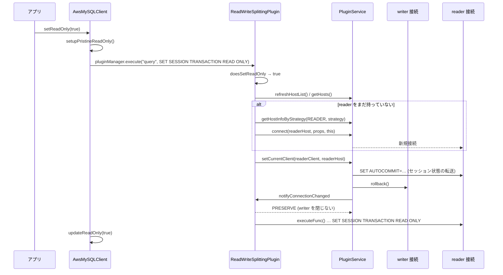

## 何を学んだか

`await client.setReadOnly(true)` を呼ぶと、以降のクエリは reader インスタンスに流れる。これを実現している `ReadWriteSplittingPlugin` の仕組みは、名前から想像するものと少し違う。

- プラグインは **`setReadOnly` というメソッドを購読していない**。購読しているのは `query` で、そこに流れてきた SQL を解析して `SET SESSION TRANSACTION READ ONLY` を見つけたら、**その SQL を実行する前に**接続を reader に差し替える
- 1 つの `AwsMySQLClient` が **writer 用と reader 用の 2 本の物理接続**を抱える。切り替えは `PluginService.setCurrentClient` で、セッション状態の転送はそこに任せる ([転送とリセット](../transfer-and-reset/))
- 差し替え時に `notifyConnectionChanged` で **PRESERVE** を返すことで、古い接続を閉じさせない。次の切り替えで再利用するためである
- reader 接続は `CacheItem` に包まれ、`cachedReaderKeepAliveTimeoutMs` (既定 0 = 無期限) で寿命を持つ。内部プール由来なら寿命 0 で、切り替えのたびにプールに返す
- 購読が `query` だけなので、`execute()` (prepared statement) で `SET SESSION TRANSACTION READ ONLY` を打っても切り替わらない



## ソースコードのどこか

### 購読メソッドと `execute`

[`common/lib/plugins/read_write_splitting/abstract_read_write_splitting_plugin.ts#L35`](https://github.com/aws/aws-advanced-nodejs-wrapper/blob/6d0ba1bdae81a4e1fd274b3569c5dc50cf0a7095/common/lib/plugins/read_write_splitting/abstract_read_write_splitting_plugin.ts#L35)。

```ts title="common/lib/plugins/read_write_splitting/abstract_read_write_splitting_plugin.ts"
private static readonly subscribedMethods: Set<string> = new Set(["initHostProvider", "connect", "notifyConnectionChanged", "query"]);

override async execute<T>(methodName: string, executeFunc: () => Promise<T>, methodArgs: any): Promise<T> {
  const statement = SqlMethodUtils.parseMethodArgs(methodArgs, this.pluginService.getDriverDialect());
  const statements = SqlMethodUtils.parseMultiStatementQueries(statement);

  const updateReadOnly: boolean | undefined = SqlMethodUtils.doesSetReadOnly(statements, this.pluginService.getDialect());
  if (updateReadOnly !== undefined) {
    try {
      await this.switchClientIfRequired(updateReadOnly);
    } catch (error) {
      await this.closeIdleClients();
      throw error;
    }
  }

  try {
    return await executeFunc();
  } catch (error: any) {
    if (error instanceof FailoverError) {
      logger.debug(Messages.get("ReadWriteSplittingPlugin.failoverErrorWhileExecutingCommand", methodName));
      await this.closeIdleClients();
    } else {
      logger.debug(Messages.get("ReadWriteSplittingPlugin.errorWhileExecutingCommand", methodName, error.message));
    }
    throw error;
  }
}
```

`methodArgs` は `AwsMySQLClient.query()` が渡す `[options, values]` で、`parseMethodArgs` が先頭要素から SQL 文字列を取り出す (`MySQL2DriverDialect.getQueryFromMethodArg` は文字列ならそのまま、オブジェクトなら `.sql`)。ここでは `client.format` によるプレースホルダ展開は**行われない**。`updateState` の解析とは別経路で、同じ `doesSetReadOnly` を使うが入力が異なる ([SQL を読んで状態を追う](../tracking-state-from-sql/))。

`executeFunc()` は plugin chain の次段で、最終的に mysql2 の `query()` に至る。切り替えが終わってから呼ぶので、`SET SESSION TRANSACTION READ ONLY` は**差し替え後の reader 接続で実行される**。

### `switchClientIfRequired` — 切り替えの判断

[`abstract_read_write_splitting_plugin.ts#L111`](https://github.com/aws/aws-advanced-nodejs-wrapper/blob/6d0ba1bdae81a4e1fd274b3569c5dc50cf0a7095/common/lib/plugins/read_write_splitting/abstract_read_write_splitting_plugin.ts#L111)。

```ts title="common/lib/plugins/read_write_splitting/abstract_read_write_splitting_plugin.ts"
async switchClientIfRequired(readOnly: boolean) {
  const currentClient = this.pluginService.getCurrentClient();
  if (!(await currentClient.isValid())) {
    logAndThrowError(Messages.get("ReadWriteSplittingPlugin.setReadOnlyOnClosedClient", currentClient.targetClient?.id ?? "undefined client"));
  }

  await this.refreshAndStoreTopology(currentClient.targetClient);

  const currentHost = this.pluginService.getCurrentHostInfo();
  if (currentHost == null) {
    logAndThrowError(Messages.get("ReadWriteSplittingPlugin.unavailableHostInfo"));
  } else if (readOnly) {
    if (!this.pluginService.isInTransaction() && currentHost.role != HostRole.READER) {
      try {
        await this.switchToReaderTargetClient();
      } catch (error: any) {
        if (!(await currentClient.isValid())) {
          logAndThrowError(Messages.get("ReadWriteSplittingPlugin.errorSwitchingToReader", error.message));
        }
        logger.warn(Messages.get("ReadWriteSplittingPlugin.fallbackToWriter", currentHost.url));
      }
    }
  } else if (currentHost.role != HostRole.WRITER) {
    if (this.pluginService.isInTransaction()) {
      logAndThrowError(Messages.get("ReadWriteSplittingPlugin.setReadOnlyFalseInTransaction"));
    }
    try {
      await this.switchToWriterTargetClient();
    } catch (error: any) {
      logAndThrowError(Messages.get("ReadWriteSplittingPlugin.errorSwitchingToWriter", error.message));
    }
  }
}
```

`isValid()` は `SELECT 1` を打つ ([`mysql_database_dialect.ts#L120`](https://github.com/aws/aws-advanced-nodejs-wrapper/blob/6d0ba1bdae81a4e1fd274b3569c5dc50cf0a7095/mysql/lib/dialect/mysql_database_dialect.ts#L120))。`refreshAndStoreTopology` は `refreshHostList()` でトポロジを取り直し、writer を `writerHostInfo` に控える ([`read_write_splitting_plugin.ts#L92`](https://github.com/aws/aws-advanced-nodejs-wrapper/blob/6d0ba1bdae81a4e1fd274b3569c5dc50cf0a7095/common/lib/plugins/read_write_splitting/read_write_splitting_plugin.ts#L92))。つまり `setReadOnly` を呼ぶたびに `SELECT 1` とトポロジ更新 (キャッシュが新しければクエリは飛ばない) が走る。

reader への切り替え失敗は **warn を出して writer のまま続行**、writer への切り替え失敗は**例外**、という非対称がある。トランザクション中の扱いも非対称で、`setReadOnly(true)` は黙って切り替えず、`setReadOnly(false)` は例外を投げる ([トランザクション境界の追跡](../transaction-boundary/))。

### `switchToReaderTargetClient` — キャッシュか新規か

[`abstract_read_write_splitting_plugin.ts#L213`](https://github.com/aws/aws-advanced-nodejs-wrapper/blob/6d0ba1bdae81a4e1fd274b3569c5dc50cf0a7095/common/lib/plugins/read_write_splitting/abstract_read_write_splitting_plugin.ts#L213)。

```ts title="common/lib/plugins/read_write_splitting/abstract_read_write_splitting_plugin.ts"
async switchToReaderTargetClient() {
  const currentHost = this.pluginService.getCurrentHostInfo();
  const currentClient = this.pluginService.getCurrentClient();
  if (this.isReader(currentHost) && currentClient) {
    return;
  }

  await this.closeReaderIfNecessary();

  this._inReadWriteSplit = true;
  if (this.readerCacheItem == null || !(await this.isTargetClientUsable(this.readerCacheItem.get()))) {
    await this.initializeReaderClient();
  } else {
    try {
      await this.switchCurrentTargetClientTo(this.readerCacheItem.get(), this.readerHostInfo);
    } catch (error: any) {
      await this.closeReaderClientIfIdle();
      await this.initializeReaderClient();
    }
  }
  if (this.isWriterClientFromInternalPool) {
    await this.closeWriterClientIfIdle();
  }
}
```

`readerCacheItem.get()` は期限切れなら `null` を返す (`CacheItem.get(returnExpired=false)`)。`isTargetClientUsable` は `isClientValid` = `SELECT 1` である。キャッシュが使えれば `switchCurrentTargetClientTo` → `pluginService.setCurrentClient` に進み、使えなければ `initializeReaderClient` で新しい reader を張る。

`closeReaderIfNecessary` は、キャッシュしている reader が**最新のトポロジに含まれていない** (`containsHostAndPort` で判定) 場合に捨てる ([`read_write_splitting_plugin.ts#L177`](https://github.com/aws/aws-advanced-nodejs-wrapper/blob/6d0ba1bdae81a4e1fd274b3569c5dc50cf0a7095/common/lib/plugins/read_write_splitting/read_write_splitting_plugin.ts#L177))。インスタンスが削除された、あるいは customEndpoint で許可リストから外れた場合に効く。

### `getNewReaderClient` — 候補数の 2 倍まで試す

[`read_write_splitting_plugin.ts#L145`](https://github.com/aws/aws-advanced-nodejs-wrapper/blob/6d0ba1bdae81a4e1fd274b3569c5dc50cf0a7095/common/lib/plugins/read_write_splitting/read_write_splitting_plugin.ts#L145)。

```ts title="common/lib/plugins/read_write_splitting/read_write_splitting_plugin.ts"
protected async getNewReaderClient() {
  let targetClient = undefined;
  let readerHost: HostInfo | undefined = undefined;

  const hostCandidates: HostInfo[] = this.getReaderHostCandidates();
  const connectAttempts = hostCandidates.length * 2;

  for (let i = 0; i < connectAttempts; i++) {
    const host = this.pluginService.getHostInfoByStrategy(HostRole.READER, this.readerSelectorStrategy, hostCandidates);
    if (host) {
      try {
        const copyProps = new Map<string, any>(this._properties);
        copyProps.set(WrapperProperties.HOST.name, host.host);
        targetClient = await this.pluginService.connect(host, copyProps, this);
        this.isReaderClientFromInternalPool = this.pluginService.isPooledClient();
        readerHost = host;
        break;
      } catch (any) {
        logger.warn(Messages.get("ReadWriteSplittingPlugin.failedToConnectToReader", host.hostAndPort));
      }
    }
  }
  if (targetClient == undefined || readerHost === undefined) {
    logAndThrowError(Messages.get("ReadWriteSplittingPlugin.noReadersAvailable"));
    return;
  }
  await this.setReaderClient(targetClient, readerHost);
  await this.switchCurrentTargetClientTo(this.readerCacheItem?.get(), this.readerHostInfo);
}
```

`pluginService.connect(host, copyProps, this)` の第 3 引数は `pluginToSkip` で、connect パイプラインから**自分自身を外す**。外さないと `connect` を購読している自分の `connect` が再帰的に呼ばれる ([PluginChain](../plugin-chain/))。`readerSelectorStrategy` は `readerHostSelectorStrategy` プロパティ (既定 `random`) で、`leastConnections` は内部プールとの組み合わせでだけ意味を持つ ([ホスト可用性戦略と選択戦略](../host-availability-and-selection/))。

`connectAttempts = 候補数 × 2` は、選択戦略が同じホストを 2 回返す可能性を見込んだ上限で、失敗したホストを候補から除く処理はない。

ホストが 1 台しかない (reader がいない) 場合は `initializeReaderClient` が warn を出して writer に留まる ([L125](https://github.com/aws/aws-advanced-nodejs-wrapper/blob/6d0ba1bdae81a4e1fd274b3569c5dc50cf0a7095/common/lib/plugins/read_write_splitting/read_write_splitting_plugin.ts#L125))。

### PRESERVE — 古い接続を生かす

[`abstract_read_write_splitting_plugin.ts#L72`](https://github.com/aws/aws-advanced-nodejs-wrapper/blob/6d0ba1bdae81a4e1fd274b3569c5dc50cf0a7095/common/lib/plugins/read_write_splitting/abstract_read_write_splitting_plugin.ts#L72)。

```ts title="common/lib/plugins/read_write_splitting/abstract_read_write_splitting_plugin.ts"
override async notifyConnectionChanged(changes: Set<HostChangeOptions>): Promise<OldConnectionSuggestionAction> {
  try {
    await this.updateInternalClientInfo();
  } catch (e) {
    // pass
  }
  if (this._inReadWriteSplit) {
    return Promise.resolve(OldConnectionSuggestionAction.PRESERVE);
  }
  return Promise.resolve(OldConnectionSuggestionAction.NO_OPINION);
}
```

`setCurrentClient` は差し替え後に全プラグインへ `notifyConnectionChanged` を投げ、誰かが PRESERVE と言えば古い接続を `abort` しない ([転送とリセット](../transfer-and-reset/))。`_inReadWriteSplit` は最初の切り替えで true になり、**二度と false に戻らない**。以後この client では、フェイルオーバーによる差し替えでも PRESERVE が返る。フェイルオーバー時の古い接続は死んでいるので `isClientValid` が false になり、結果は変わらない。

`updateInternalClientInfo` は差し替え後の現在接続を役割に応じて `writerTargetClient` / `readerCacheItem` に控える。フェイルオーバーで新しい writer に切り替わった場合、それを writer として覚え直すのはここである。

### reader キャッシュの寿命

[`abstract_read_write_splitting_plugin.ts#L289`](https://github.com/aws/aws-advanced-nodejs-wrapper/blob/6d0ba1bdae81a4e1fd274b3569c5dc50cf0a7095/common/lib/plugins/read_write_splitting/abstract_read_write_splitting_plugin.ts#L289)。

```ts title="common/lib/plugins/read_write_splitting/abstract_read_write_splitting_plugin.ts"
async setReaderClient(readerTargetClient: ClientWrapper | undefined, readerHost: HostInfo): Promise<void> {
  await this.closeReaderClientIfIdle();
  this.readerCacheItem = new CacheItem(readerTargetClient, this.getKeepAliveTimeout(this.isReaderClientFromInternalPool));
  this.readerHostInfo = readerHost;
}

protected getKeepAliveTimeout(isPooledClient: boolean): bigint {
  if (isPooledClient) {
    return BigInt(0);
  }
  const keepAliveMs = WrapperProperties.CACHED_READER_KEEP_ALIVE_TIMEOUT.get(this._properties);
  return keepAliveMs > 0 ? getTimeInNanos() + convertMsToNanos(keepAliveMs) : BigInt(0);
}
```

`CacheItem` の期限 0 は「期限なし」を意味する ([`cache_map.ts#L28`](https://github.com/aws/aws-advanced-nodejs-wrapper/blob/6d0ba1bdae81a4e1fd274b3569c5dc50cf0a7095/common/lib/utils/cache_map.ts#L28))。`cachedReaderKeepAliveTimeoutMs` の既定は 0 なので、**reader 接続は client が生きている限り閉じない**。期限を設定すると、期限切れ後の `setReadOnly(true)` で `readerCacheItem.get()` が `null` を返し、新しい reader が選ばれ直す。負荷を reader 間で散らしたいときの手段である。

内部プール由来 (`isReaderClientFromInternalPool`) なら期限 0 だが、`switchToWriterTargetClient` の末尾で `closeReaderClientIfIdle` が呼ばれてプールに返される ([L206](https://github.com/aws/aws-advanced-nodejs-wrapper/blob/6d0ba1bdae81a4e1fd274b3569c5dc50cf0a7095/common/lib/plugins/read_write_splitting/abstract_read_write_splitting_plugin.ts#L206))。プールなら借り直しが安いので、抱え込まない ([内部コネクションプール](../internal-connection-pool/))。

`releaseResources()` は `closeIdleClients()` で、現在使っていない側の接続を `abort` する ([L298](https://github.com/aws/aws-advanced-nodejs-wrapper/blob/6d0ba1bdae81a4e1fd274b3569c5dc50cf0a7095/common/lib/plugins/read_write_splitting/abstract_read_write_splitting_plugin.ts#L298))。`PluginManager.releaseResources()` から呼ばれる ([接続の寿命管理](../connection-lifetime/))。

### 初回接続での役割検証

[`read_write_splitting_plugin.ts#L52`](https://github.com/aws/aws-advanced-nodejs-wrapper/blob/6d0ba1bdae81a4e1fd274b3569c5dc50cf0a7095/common/lib/plugins/read_write_splitting/read_write_splitting_plugin.ts#L52)。`connect` では、初回接続かつ動的なホストリスト (Aurora / Multi-AZ) のときだけ `getHostRole` で役割を確認し、`initialConnectionHostInfo` の役割を上書きする。`readerHostSelectorStrategy` に対応していない戦略名なら `acceptsStrategy` が false を返して例外になる。

## なぜそうなっているか

### なぜメソッドではなく SQL を見るのか

`client.setReadOnly(true)` は内部で `SET SESSION TRANSACTION READ ONLY` を `query` として流す ([`mysql/lib/client.ts#L118`](https://github.com/aws/aws-advanced-nodejs-wrapper/blob/6d0ba1bdae81a4e1fd274b3569c5dc50cf0a7095/mysql/lib/client.ts#L118))。プラグインが `query` の SQL を見れば、**`setReadOnly()` を呼んだ場合もアプリが生 SQL を書いた場合も同じ経路**で拾える。メソッド名で購読する設計だと生 SQL は拾えない。

副産物として、切り替えの判断ロジックが `DatabaseDialect.doesStatementSetReadOnly` に集約され、PostgreSQL 版 (`SET SESSION CHARACTERISTICS AS TRANSACTION READ ONLY`) との差が Dialect の 1 メソッドに閉じる。

### なぜ切り替え後に SQL を流すのか

`SET SESSION TRANSACTION READ ONLY` 自体は Aurora の reader で実行しても害はない (reader は既に読み取り専用である)。むしろ writer で実行すると、writer 接続がその後 `INSERT` を受け付けなくなる。切り替えてから流すのは、**この SQL の副作用を reader 側に閉じ込める**ためでもある。

### なぜ reader 切り替えの失敗は warn で済ませるのか

reader に繋がらない状況 (reader が 0 台、全 reader が落ちている) で例外を投げると、読み取りクエリまで止まる。writer で読めば結果は返る。可用性を分割の正しさより優先している。逆に writer への切り替え失敗は、書き込みが reader に流れて `read-only` エラーになるだけなので、早く例外にした方が原因が分かりやすい。

### なぜ `_inReadWriteSplit` は戻らないのか

PRESERVE の目的は「writer と reader の両方を抱えたまま、次の切り替えを安くする」ことで、一度分割を始めた client は以後もその使い方を続ける、という前提である。戻す条件を定義するより、常に PRESERVE でよいという判断で、害が出るのは「古い接続が生きていて、他のプラグインが閉じたい」場合だけだが、そのケースは現状ない。

### なぜ `execute` を購読しないのか

コードにも docs にも理由は書かれていない。`AwsMySQLClient.execute()` は `"execute"` というメソッド名で plugin chain を通り、`updateState` も走るが、このプラグインの `subscribedMethods` に `execute` がないので素通りする。prepared statement で `SET SESSION TRANSACTION READ ONLY` を打つ使い方は稀なので、実害は限定的である。

## どう活かすか

- **ユーザ操作を「メソッド」ではなく「結果として流れる SQL」で捕まえる。** API の入口が複数あっても、最終的に同じ SQL になるなら、SQL を見る 1 箇所で済む
- **2 本の接続を抱えるなら、どちらを「現在」と呼ぶかを 1 箇所 (`PluginService.targetClient`) に置く。** プラグインは `writerTargetClient` / `readerCacheItem` を控えるだけで、現在の接続は `setCurrentClient` に決めさせている。二重管理を避ける構造である
- **他の仕組み (`setCurrentClient`) を再利用するとき、その副作用 (古い接続の abort) を止める手段を用意する。** `OldConnectionSuggestionAction.PRESERVE` は、差し替え処理を書き換えずに「閉じないで」と伝える最小の口である
- **キャッシュに「期限なし」の既定を置くなら、それが意味する資源を書く。** reader 接続 1 本は、Aurora 側の `max_connections` を 1 消費する。client 数 × 2 本になることを docs で伝える

### 実務で踏む失敗パターン

- **接続数が想定の 2 倍になる。** 1 client あたり writer + reader の 2 本。client を大量に作る構成 (リクエストごとに `new AwsMySQLClient`) では、内部プールを使わないと reader 側の接続が爆発する
- **`execute()` で `SET SESSION TRANSACTION READ ONLY` を打っても reader に行かない。** `query()` か `setReadOnly()` を使う
- **トランザクション中に `setReadOnly(true)` しても writer のまま。** 例外は出ず、warn も出ない (`isInTransaction` で分岐が飛ぶだけ)。読み取りは writer で行われる
- **`setReadOnly(false)` がトランザクション中に例外を投げる。** `commit()` / `rollback()` してから呼ぶ
- **reader が削除されたのに古い reader に繋ぎ続ける。** `closeReaderIfNecessary` はトポロジ更新後に判定する。`setReadOnly` を呼び直すまでは古い reader のままで、その接続が切れると failover が走る
- **Aurora 以外で使えない。** docs のとおり非 Aurora クラスタは未対応。`ConnectionStringHostListProvider` では reader を見つけられない
