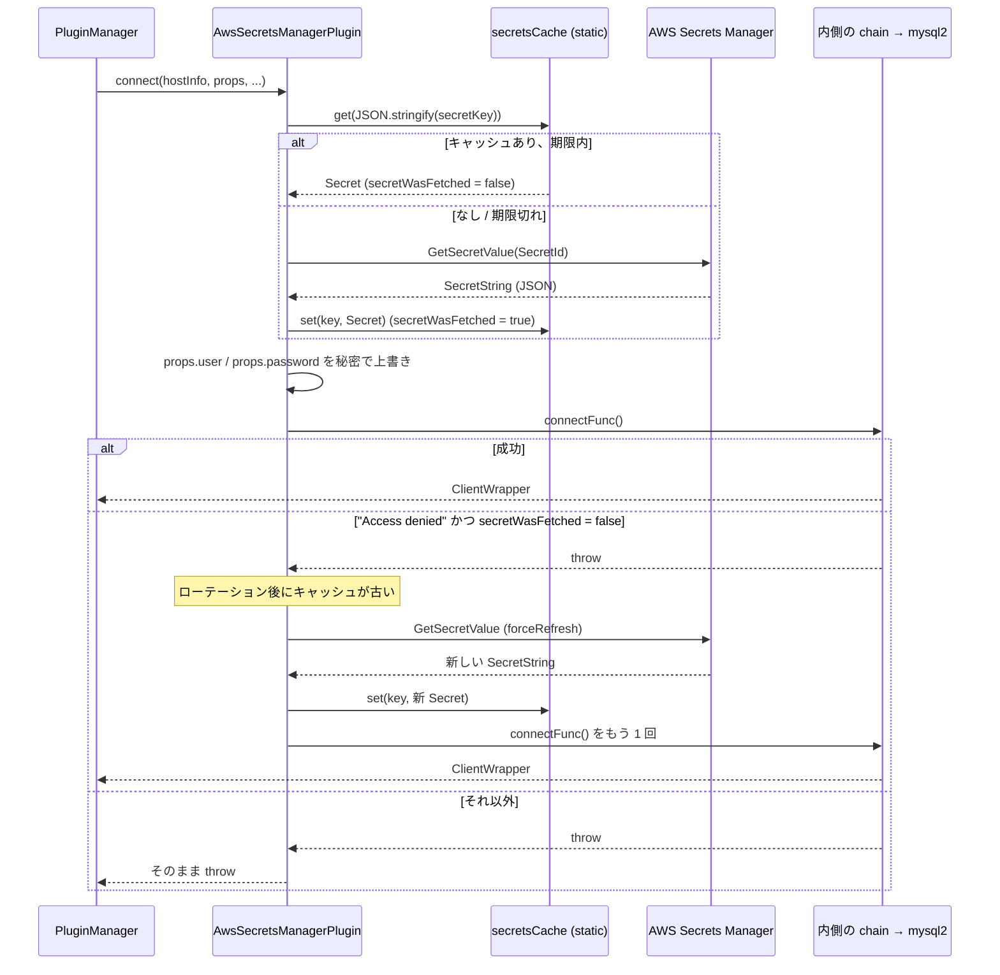

## 何を学んだか

`secretsManager` プラグインは、パスワードの出所を「設定ファイル」から「Secrets Manager の秘密」に変える。[IAM 認証プラグイン](../iam-plugin/) と骨格は同じで、`connect` / `forceConnect` だけを購読し、mysql2 に渡る直前に `props` の `user` と `password` を書き換える。

違いは 3 つある。

- **取ってくるのは user と password の両方。** 秘密は `{"username": ..., "password": ...}` の JSON で、キー名は `secretUsernameProperty` / `secretPasswordProperty` で変えられる
- **ローテーションに追従する。** ログインに失敗し、かつそのとき使った秘密がキャッシュ由来なら、`forceRefresh` で取り直して 1 回だけ再接続する。Secrets Manager 側でパスワードが回転しても、アプリの再起動は要らない
- **AWS 認証情報は SDK の既定チェーンに固定。** `SecretsManagerClient` に `credentials` を渡していないので、`awsProfile` も `customAwsCredentialProviderHandler` も効かない。docs は「両プラグインに適用」と書いているが、コードは IAM プラグインだけがそれを読む

## ソースコードのどこか

[`common/lib/authentication/aws_secrets_manager_plugin.ts`](https://github.com/aws/aws-advanced-nodejs-wrapper/blob/6d0ba1bdae81a4e1fd274b3569c5dc50cf0a7095/common/lib/authentication/aws_secrets_manager_plugin.ts) は 232 行で、プラグイン本体 + `SecretCacheKey` + `Secret` の 3 クラスがある。

### コンストラクタで設定を検証し、region を決める

[`#L51`](https://github.com/aws/aws-advanced-nodejs-wrapper/blob/6d0ba1bdae81a4e1fd274b3569c5dc50cf0a7095/common/lib/authentication/aws_secrets_manager_plugin.ts#L51)。

```ts title="common/lib/authentication/aws_secrets_manager_plugin.ts"
private static SECRETS_ARN_PATTERN: RegExp = new RegExp("^arn:aws[^:]*:secretsmanager:(?<region>[^:\\n]*):[^:\\n]*:([^:/\\n]*[:/])?(.*)$");
static secretsCache: Map<string, Secret> = new Map();

constructor(pluginService: PluginService, properties: Map<string, any>) {
  super();
  this.pluginService = pluginService;
  const secretId = WrapperProperties.SECRET_ID.get(properties);
  const endpoint = WrapperProperties.SECRET_ENDPOINT.get(properties);
  let region = WrapperProperties.SECRET_REGION.get(properties);

  this.expirationSec = WrapperProperties.SECRET_EXPIRATION_SEC.get(properties);
  this.usernameKey = WrapperProperties.SECRET_USERNAME_PROPERTY.get(properties);
  this.passwordKey = WrapperProperties.SECRET_PASSWORD_PROPERTY.get(properties);

  const config: SecretsManagerClientConfig = {};

  if (!secretId) {
    throw new AwsWrapperError(Messages.get("AwsSecretsManagerConnectionPlugin.missingRequiredConfigParameter", WrapperProperties.SECRET_ID.name));
  }
  if (!this.usernameKey || !this.passwordKey) {
    throw new AwsWrapperError(Messages.get("AwsSecretsManagerConnectionPlugin.emptyPropertyKeys"));
  }
  if (this.expirationSec < 0) {
    throw new AwsWrapperError(Messages.get("AwsSecretsManagerConnectionPlugin.invalidExpirationTime", String(this.expirationSec)));
  }

  if (!region) {
    const groups = secretId.match(AwsSecretsManagerPlugin.SECRETS_ARN_PATTERN)?.groups;
    if (groups?.region) {
      region = groups.region;
    } else {
      throw new AwsWrapperError(Messages.get("AwsSecretsManagerConnectionPlugin.missingRequiredConfigParameter", WrapperProperties.SECRET_REGION.name));
    }
  }

  config.region = region;
  if (endpoint) {
    config.endpoint = endpoint;
  }

  this.secretKey = new SecretCacheKey(secretId, region);
  this.secretsManagerClient = new SecretsManagerClient(config);
  // ...
}
```

設定ミスは**コンストラクタで**落ちる。つまり `new AwsMySQLClient(...)` の直後、`connect()` を呼ぶ前ではなく、プラグイン chain を組む `ConnectionPluginChainBuilder.getPlugins` の中 ([プラグインの並び順](../plugin-order/)) で `AwsWrapperError` になる。

`secretId` が `arn:aws:secretsmanager:us-east-1:123456789012:secret:name-AbCdEf` の形なら、正規表現の `region` グループから region を抜く。名前だけなら `secretRegion` が必須。

`config` に入るのは `region` と `endpoint` だけで、`credentials` は無い。[`aws_credentials_manager.ts`](https://github.com/aws/aws-advanced-nodejs-wrapper/blob/6d0ba1bdae81a4e1fd274b3569c5dc50cf0a7095/common/lib/authentication/aws_credentials_manager.ts) を呼んでいるのは `iam_authentication_plugin.ts` と `global_db_region_utils.ts` の 2 か所だけで、このファイルからは参照されていない。

### `connectInternal` — 取って、入れて、繋いで、失敗したら取り直す

[`#L124`](https://github.com/aws/aws-advanced-nodejs-wrapper/blob/6d0ba1bdae81a4e1fd274b3569c5dc50cf0a7095/common/lib/authentication/aws_secrets_manager_plugin.ts#L124)。

```ts title="common/lib/authentication/aws_secrets_manager_plugin.ts"
private async connectInternal(props: Map<string, any>, connectFunc: () => Promise<ClientWrapper>): Promise<ClientWrapper> {
  let secretWasFetched = await this.updateSecret(false);
  try {
    WrapperProperties.USER.set(props, this.secret?.username ?? "");
    WrapperProperties.PASSWORD.set(props, this.secret?.password ?? "");
    this.pluginService.updateConfigWithProperties(props);
    return await connectFunc();
  } catch (error) {
    if ((error.message.includes("password authentication failed") || error.message.includes("Access denied")) && !secretWasFetched) {
      // Login unsuccessful with cached credentials
      // Try to re-fetch credentials and try again

      secretWasFetched = await this.updateSecret(true);
      if (secretWasFetched) {
        WrapperProperties.USER.set(props, this.secret?.username ?? "");
        WrapperProperties.PASSWORD.set(props, this.secret?.password ?? "");
        return await connectFunc();
      }
    }
    logger.debug(Messages.get("AwsSecretsManagerConnectionPlugin.unhandledError", `${error.name}: ${error.message}`));
    throw error;
  }
}
```



IAM プラグインとの対応関係は明快である。`isCachedToken` が `!secretWasFetched` に、`isLoginError(e)` が `error.message.includes(...)` に置き換わっている。

ログインエラーの判定は**文字列直書き**で、`"password authentication failed"` (PG) と `"Access denied"` (MySQL) の両方を 1 行に並べている。`pluginService.isLoginError` を使えば Dialect ごとの `ErrorHandler` に委譲できるのに ([MySQLErrorHandler](../mysql-error-handler/))、ここは使っていない。MySQL の `Access denied` は `ER_ACCESS_DENIED_ERROR` のメッセージ先頭なので実用上は一致するが、`sqlState 28000` を見る経路より脆い。

再接続の分岐で `updateConfigWithProperties` を呼び直していない点も IAM プラグインと違う。`props` は書き換わるので mysql2 には新しい資格情報が渡るが、`AwsClient.config` は古いままになる。

### `updateSecret` — キャッシュと取得

[`#L148`](https://github.com/aws/aws-advanced-nodejs-wrapper/blob/6d0ba1bdae81a4e1fd274b3569c5dc50cf0a7095/common/lib/authentication/aws_secrets_manager_plugin.ts#L148)。

```ts title="common/lib/authentication/aws_secrets_manager_plugin.ts"
private async updateSecret(forceRefresh: boolean): Promise<boolean> {
  // ... telemetry
  return await telemetryContext.start(async () => {
    let fetched = false;
    this.secret = AwsSecretsManagerPlugin.secretsCache.get(JSON.stringify(this.secretKey)) ?? null;

    if (!this.secret || this.secret.isExpired() || forceRefresh) {
      try {
        this.secret = await this.fetchLatestCredentials();
        fetched = true;
        AwsSecretsManagerPlugin.secretsCache.set(JSON.stringify(this.secretKey), this.secret);
      } catch (error: any) {
        if (error instanceof AwsWrapperError) {
          throw error;
        }
        if (error instanceof SecretsManagerServiceException) {
          logAndThrowError(Messages.get("AwsSecretsManagerConnectionPlugin.failedToFetchDbCredentials", error.message));
        } else if (error instanceof Error && error.message.includes("AWS SDK error")) {
          logAndThrowError(Messages.get("AwsSecretsManagerConnectionPlugin.endpointOverrideInvalidConnection", error.message));
        } else {
          logAndThrowError(Messages.get("AwsSecretsManagerConnectionPlugin.unhandledError", error.message));
        }
      }
    }
    return fetched;
  });
}

private async fetchLatestCredentials(): Promise<Secret> {
  const command = new GetSecretValueCommand({ SecretId: this.secretKey.secretId });
  const result: GetSecretValueCommandOutput = await this.secretsManagerClient.send(command);
  const secretJson: string = JSON.parse(result.SecretString ?? "");
  const username = secretJson[this.usernameKey];
  const password = secretJson[this.passwordKey];
  if (!username || !password) {
    throw new AwsWrapperError(Messages.get("AwsSecretsManagerConnectionPlugin.emptySecretValue", this.usernameKey, this.passwordKey));
  }
  return new Secret(username, password, this.expirationSec);
}
```

キャッシュキーは `JSON.stringify(SecretCacheKey)` で、`{"_secretId":"...","_region":"..."}` という文字列になる。`Map` のキーにオブジェクトを使うと参照比較になるので、文字列化している。`secretsCache` は IAM の `tokenCache` と同じく `static` で、プロセス内の全クライアントが共有する。

`GetSecretValue` の結果は `SecretString` しか見ない。`SecretBinary` で保存した秘密は `JSON.parse("")` で `SyntaxError` になり、`unhandledError` に包まれる。JSON はフラットである前提で、ネストしたキーは `secretUsernameProperty: "db.user"` のようには指定できない。docs の "Only un-nested JSON format is supported at the moment" がこれである。

### `Secret` と `SecretCacheKey`

[`#L200`](https://github.com/aws/aws-advanced-nodejs-wrapper/blob/6d0ba1bdae81a4e1fd274b3569c5dc50cf0a7095/common/lib/authentication/aws_secrets_manager_plugin.ts#L200)。

```ts title="common/lib/authentication/aws_secrets_manager_plugin.ts"
export class Secret {
  readonly username: string;
  readonly password: string;
  readonly expirationTime: number;

  constructor(username: string, password: string, expirationSec: number) {
    this.username = username;
    this.password = password;
    this.expirationTime = Date.now() + expirationSec * 1000;
  }

  isExpired(): boolean {
    return Date.now() >= this.expirationTime;
  }
}
```

`expirationSec` の既定は [`wrapper_property.ts#L387`](https://github.com/aws/aws-advanced-nodejs-wrapper/blob/6d0ba1bdae81a4e1fd274b3569c5dc50cf0a7095/common/lib/wrapper_property.ts#L387) で **870 秒**。IAM トークンの 900 秒より 30 秒短い。

### 遅延 import と `releaseResources`

[`aws_secrets_manager_plugin_factory.ts#L29`](https://github.com/aws/aws-advanced-nodejs-wrapper/blob/6d0ba1bdae81a4e1fd274b3569c5dc50cf0a7095/common/lib/authentication/aws_secrets_manager_plugin_factory.ts#L29) は IAM と同じ遅延 import だが、`catch` で `error.code === "MODULE_NOT_FOUND"` のときだけ `errorImportingPlugin` に包み、それ以外 (コンストラクタの設定エラー) はそのまま投げる。IAM のファクトリは全部包むので、設定ミスが "error importing plugin" に化ける。Secrets Manager のほうが後から直された形である。

`releaseResources` は `secretsCache.clear()` だけ。

## なぜそうなっているか

### なぜログイン失敗で取り直すのか

Secrets Manager の主な使い道はパスワードのローテーションで、ローテーション用 Lambda が DB 側のパスワードを変え、秘密の新バージョンを書く。この瞬間、ラッパのキャッシュにある password は DB では無効になる。

次の `connect` はキャッシュの password で `Access denied` を受ける。ここで「取り直せば通るかもしれない」失敗と「取り直しても通らない」失敗を分けるのが `secretWasFetched` である。今回 `GetSecretValue` を呼んだばかりなら、Secrets Manager にあるのが最新で、それで失敗したなら DB 側とずれている (ローテーション途中、または秘密が間違っている)。再試行しても同じ結果なので投げる。

IAM プラグインの `isCachedToken` と同じ切り分けで、書き方だけが違う。

### なぜ 870 秒なのか

`GetSecretValue` は API 呼び出しごとに課金され、レート制限もある。接続のたびに呼ぶわけにはいかないので、キャッシュは必須である。一方で長すぎると、ローテーション後に古い password で失敗する接続が増える (失敗しても取り直すので繋がりはするが、1 回分の往復が無駄になる)。

870 は 15 分から 30 秒を引いた値で、IAM トークンの 900 秒と並べると「同じ 15 分の粒度で、少し手前で切れる」設計に見える。ラッパのコードやコメントに理由の記述は無い。

### なぜ AWS 認証情報の指定が効かないのか

コードを読む限り、理由は書かれていない。`SecretsManagerClient` は `credentials` を省略すると SDK の既定チェーンを使うので、環境変数や IAM ロールで動く環境では問題にならず、`awsProfile` を使う開発環境でだけ「効かない」と気づく形になる。docs の `AwsCredentialsConfiguration.md` は "Applicable plugins: AWS IAM Authentication Plugin, AWS Secrets Manager Plugin" と書いているので、docs とコードのどちらかが直されるべき状態である。

## どう活かすか

- **ローテーションする資格情報のキャッシュには「失敗したら 1 回だけ取り直す」を付ける。** TTL だけに頼ると、ローテーション直後の TTL 残り時間ぶんの接続が全部失敗する。失敗を検知して取り直せば、失敗は 1 接続あたり 1 回で済む
- **「取り直しても無駄な失敗」を先に判定する。** 今フェッチしたばかりかどうかを bool で持ち回るだけで実装できる
- **設定ミスはコンストラクタで落とす。** `secretId` 無し、region 決定不能、負の TTL は `connect()` を待たずに分かる。遅延 import と組み合わせるときは、import エラーと設定エラーを別の例外にする (このプラグインはそうしている、IAM はしていない)
- **外部サービスを呼ぶクライアントの認証情報は、1 か所の `getProvider` から取る。** 2 か所で別々に組み立てると、片方だけ設定が効かないという今回の状態になる

### 実務で踏む失敗パターン

- **`awsProfile` を設定したのに `[default]` プロファイルで `GetSecretValue` が叩かれる。** このプラグインは `awsProfile` を読まない。`AWS_PROFILE` 環境変数で SDK の既定チェーン側に伝える
- **`secretId` を名前で指定して `secretRegion` を忘れる。** コンストラクタで `missingRequiredConfigParameter` になる。ARN で指定すれば region は要らない
- **秘密が `SecretBinary`。** `SecretString` しか読まないので `JSON.parse("")` で落ちる。JSON 文字列として保存し直す
- **RDS が自動生成した秘密のキー名。** RDS のマネージドパスワードは `username` / `password` なので既定のまま動く。自前の秘密で `user` / `pass` のようなキーにしたなら `secretUsernameProperty` / `secretPasswordProperty` を合わせる
- **`iam` と `secretsManager` を同時に有効化する。** 両方 `password` を上書きするので後勝ちになる。互換性表では認証系は排他 ([互換性表を読む](../compatibility-matrix/))
- **内部プールとの組み合わせ。** プールは作成時の `props` で `createPool` されるので、ローテーション後にプールが増やす物理接続は古い password を使う。IAM の 15 分より頻度は低いが、ローテーション周期ごとに `provider.releaseResources()` でプールを作り直すか、`AwsMySQLPoolClient` の失敗を検知して作り直す運用が要る ([内部コネクションプール](../internal-connection-pool/))
