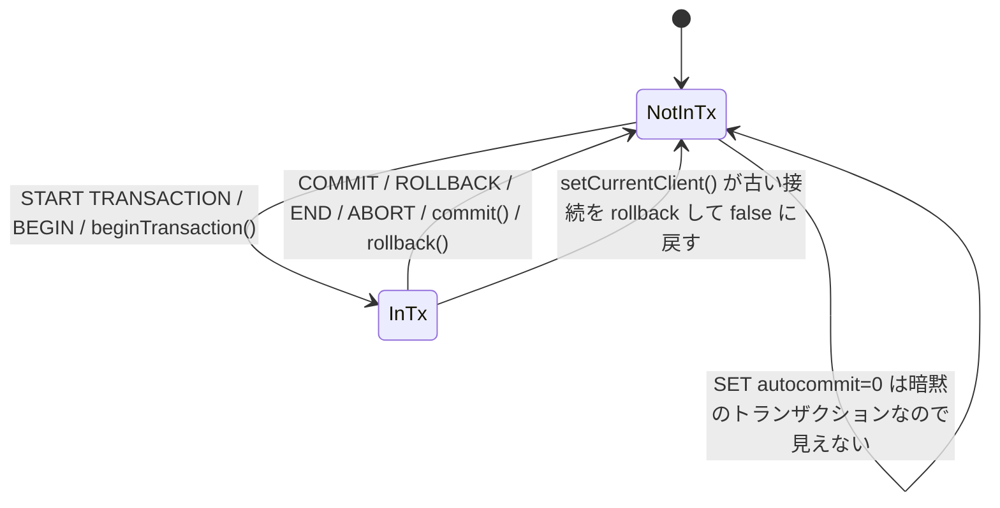

## 何を学んだか

フェイルオーバーで接続を差し替えるとき、進行中のトランザクションは**新しい接続には移せない**。コミットされていない変更は古い接続とともに消える。だからラッパは「いまトランザクション中か」を常に知っていたい。

- `PluginService` が **`_isInTransaction` という boolean を 1 つ**持つ。`START TRANSACTION` / `BEGIN` で true、`COMMIT` / `ROLLBACK` / `END` / `ABORT` で false になる
- 判定は**最初の文だけ**を見る。`SELECT 1; BEGIN` は拾えない
- `beginTransaction()` / `commit()` / `rollback()` の API 経由でも同じ関数を通るが、**ドライバを呼ぶ前**にフラグを倒す。ドライバ側が失敗してもフラグは進む
- 読む側は 3 つ: `setCurrentClient` (差し替え時に古い接続を `rollback` する)、readWriteSplitting (トランザクション中は切り替えない)、failover2 (成功時の例外を `TransactionResolutionUnknownError` に変える)
- failover2 は**自分用のコピー**を持っていて、それは一度 true になると戻らない。長寿命の client でこれが効く



## ソースコードのどこか

### フラグの置き場と更新

[`common/lib/plugin_service.ts#L172`](https://github.com/aws/aws-advanced-nodejs-wrapper/blob/6d0ba1bdae81a4e1fd274b3569c5dc50cf0a7095/common/lib/plugin_service.ts#L172)。

```ts title="common/lib/plugin_service.ts"
private _isInTransaction: boolean = false;

isInTransaction(): boolean {
  return this._isInTransaction;
}

setInTransaction(inTransaction: boolean): void {
  this._isInTransaction = inTransaction;
}

updateInTransaction(sql: string) {
  if (SqlMethodUtils.doesOpenTransaction(sql)) {
    this.setInTransaction(true);
  } else if (SqlMethodUtils.doesCloseTransaction(sql)) {
    this.setInTransaction(false);
  }
}
```

`updateInTransaction` は `updateState` の 1 行目で呼ばれる ([L636](https://github.com/aws/aws-advanced-nodejs-wrapper/blob/6d0ba1bdae81a4e1fd274b3569c5dc50cf0a7095/common/lib/plugin_service.ts#L636))。つまり `query()` / `execute()` を通る SQL は全部ここを通る ([SQL を読んで状態を追う](../tracking-state-from-sql/))。

### 判定 — 最初の文の先頭だけ

[`common/lib/utils/sql_method_utils.ts#L22`](https://github.com/aws/aws-advanced-nodejs-wrapper/blob/6d0ba1bdae81a4e1fd274b3569c5dc50cf0a7095/common/lib/utils/sql_method_utils.ts#L22)。

```ts title="common/lib/utils/sql_method_utils.ts"
static doesOpenTransaction(sql: string) {
  const firstStatement = SqlMethodUtils.getFirstSqlStatement(sql);
  if (!firstStatement) {
    return false;
  }
  return firstStatement.toLowerCase().startsWith("start transaction") || firstStatement.toLowerCase().startsWith("begin");
}

static doesCloseTransaction(sql: string) {
  const firstStatement = SqlMethodUtils.getFirstSqlStatement(sql);
  if (!firstStatement) {
    return false;
  }
  return (
    firstStatement.toLowerCase().startsWith("commit") ||
    firstStatement.toLowerCase().startsWith("rollback") ||
    firstStatement.toLowerCase().startsWith("end") ||
    firstStatement.toLowerCase().startsWith("abort")
  );
}
```

`getFirstSqlStatement` は `;` で割った先頭を小文字化してブロックコメントを剥がす ([L108](https://github.com/aws/aws-advanced-nodejs-wrapper/blob/6d0ba1bdae81a4e1fd274b3569c5dc50cf0a7095/common/lib/utils/sql_method_utils.ts#L108))。テストは `/*COMMENT*/START   /*COMMENT*/TRANSACTION;` や ` bEgIn ;` が true になることを固定している ([`tests/unit/sql_method_utils.test.ts#L25`](https://github.com/aws/aws-advanced-nodejs-wrapper/blob/6d0ba1bdae81a4e1fd274b3569c5dc50cf0a7095/tests/unit/sql_method_utils.test.ts#L25))。

`end` と `abort` は PostgreSQL の構文で、MySQL にはない。MySQL 用の判定も PG 用も `SqlMethodUtils` で共通なので、MySQL でも `END` が「閉じる」と判定される。逆に `ROLLBACK TO SAVEPOINT x` は `startsWith("rollback")` に一致して**トランザクションを閉じたことになる**。savepoint への部分ロールバック後はまだトランザクション中だが、フラグは false になる。

### API 経由 — ドライバより先にフラグを倒す

[`mysql/lib/client.ts#L234`](https://github.com/aws/aws-advanced-nodejs-wrapper/blob/6d0ba1bdae81a4e1fd274b3569c5dc50cf0a7095/mysql/lib/client.ts#L234)。

```ts title="mysql/lib/client.ts"
async beginTransaction(): Promise<void> {
  await this.pluginManager.execute(
    this.pluginService.getCurrentHostInfo(),
    this.properties,
    "beginTransaction",
    async () => {
      if (this.targetClient) {
        this.pluginService.updateInTransaction("START TRANSACTION");
        return await this.targetClient.client.beginTransaction();
      }
      return null;
    },
    null
  );
}

async rollback(): Promise<any> {
  return this.pluginManager.execute(
    this.pluginService.getCurrentHostInfo(),
    this.properties,
    "rollback",
    async () => {
      if (this.targetClient) {
        this.pluginService.updateInTransaction("rollback");
        return await this.targetClient.rollback();
      }
      return null;
    },
    null
  );
}
```

`beginTransaction` / `commit` / `rollback` の 3 つとも、`updateInTransaction` に**固定の文字列**を渡してからドライバを呼ぶ。SQL 解析と同じ経路を使うことで判定ロジックを 1 箇所に寄せている。ただし順序が「フラグ → ドライバ」なので、`beginTransaction()` がネットワークエラーで失敗しても `_isInTransaction` は true のままになる。

なお、これらのメソッド名 (`beginTransaction` / `commit` / `rollback`) は failover2 の `subscribedMethods` (`initHostProvider` / `connect` / `query`) に**含まれない**。`commit()` 中に接続が切れてもフェイルオーバーは走らず、mysql2 のエラーがそのまま返る ([failover-triggers](../failover-triggers/))。

### 読み手 1 — `setCurrentClient`

[`common/lib/plugin_service.ts#L564`](https://github.com/aws/aws-advanced-nodejs-wrapper/blob/6d0ba1bdae81a4e1fd274b3569c5dc50cf0a7095/common/lib/plugin_service.ts#L564)。

```ts title="common/lib/plugin_service.ts"
const isInTransaction = this.isInTransaction();
this.sessionStateService.begin();
try {
  this.getCurrentClient().targetClient = newClient;
  this._currentHostInfo = hostInfo;
  await this.sessionStateService.applyCurrentSessionState(this.getCurrentClient());
  this.setInTransaction(false);

  if (oldClient && (isInTransaction || WrapperProperties.ROLLBACK_ON_SWITCH.get(this.props))) {
    try {
      await oldClient.rollback();
    } catch (error: any) {
      // Ignore.
    }
  }
```

差し替えの瞬間にフラグを **false に戻し**、古い接続に `rollback()` を投げる。`rollbackOnSwitch` の既定は `true` なので、実際にはトランザクション中でなくても毎回 `rollback` が飛ぶ ([`wrapper_property.ts#L328`](https://github.com/aws/aws-advanced-nodejs-wrapper/blob/6d0ba1bdae81a4e1fd274b3569c5dc50cf0a7095/common/lib/wrapper_property.ts#L328))。古い接続が死んでいれば `rollback` は失敗するが、握りつぶされる。

### 読み手 2 — readWriteSplitting

[`common/lib/plugins/read_write_splitting/abstract_read_write_splitting_plugin.ts#L122`](https://github.com/aws/aws-advanced-nodejs-wrapper/blob/6d0ba1bdae81a4e1fd274b3569c5dc50cf0a7095/common/lib/plugins/read_write_splitting/abstract_read_write_splitting_plugin.ts#L122)。

```ts title="common/lib/plugins/read_write_splitting/abstract_read_write_splitting_plugin.ts"
} else if (readOnly) {
  if (!this.pluginService.isInTransaction() && currentHost.role != HostRole.READER) {
    try {
      await this.switchToReaderTargetClient();
    } catch (error: any) { /* ... */ }
  }
} else if (currentHost.role != HostRole.WRITER) {
  if (this.pluginService.isInTransaction()) {
    logAndThrowError(Messages.get("ReadWriteSplittingPlugin.setReadOnlyFalseInTransaction"));
  }
  try {
    await this.switchToWriterTargetClient();
  } catch (error: any) { /* ... */ }
}
```

`setReadOnly(true)` はトランザクション中なら**黙って切り替えない** (writer のまま読む)。`setReadOnly(false)` はトランザクション中なら**例外**を投げる。非対称なのは、reader 上のトランザクションを writer に移すと書き込み意図のある処理が途中で消えるのに対し、writer 上で読む分には害がないからである ([readWriteSplitting](../read-write-splitting/))。

### 読み手 3 — failover2 の別コピー

[`common/lib/plugins/failover2/failover2_plugin.ts#L441`](https://github.com/aws/aws-advanced-nodejs-wrapper/blob/6d0ba1bdae81a4e1fd274b3569c5dc50cf0a7095/common/lib/plugins/failover2/failover2_plugin.ts#L441)。

```ts title="common/lib/plugins/failover2/failover2_plugin.ts"
protected _isInTransaction: boolean = false;

async invalidateCurrentClient() {
  // ...
  if (this.pluginService.isInTransaction()) {
    this._isInTransaction = this.pluginService.isInTransaction();
    try {
      await client.rollback();
    } catch (error) {
      // Do nothing.
    }
  }
  // ...
}

protected throwFailoverSuccessException(): void {
  if (this._isInTransaction || this.pluginService.isInTransaction()) {
    throw new TransactionResolutionUnknownError(Messages.get("Failover.transactionResolutionUnknownError"));
  } else {
    throw new FailoverSuccessError();
  }
}
```

failover2 は差し替え前に `PluginService` のフラグを**自分のフィールドにコピー**する。差し替え中に `setCurrentClient` が `PluginService` 側を false にしてしまうので、「差し替え前はトランザクション中だった」という事実を保持するためのコピーである。

問題は、このコピーを **false に戻す箇所がない**ことである。1 つの `AwsMySQLClient` でトランザクション中に一度フェイルオーバーすると、以後そのプラグインインスタンスは `_isInTransaction === true` のままで、次のフェイルオーバーではトランザクション外でも `TransactionResolutionUnknownError` が投げられる。v1 の `failover_plugin.ts` も同じ構造である ([TransactionResolutionUnknownError](../transaction-resolution-unknown/))。

## なぜそうなっているか

### なぜサーバに聞かないのか

MySQL には「いまトランザクション中か」を返す単独のセッション変数がない。`performance_schema.events_transactions_current` や `information_schema.innodb_trx` を引けば分かるが、権限が要るうえ、**クエリのたびに往復を 1 回足す**ことになる。

もっと本質的には、フェイルオーバーの文脈では**古い接続はすでに死んでいる**。聞きたいときに聞く相手がいない。だから接続が生きているうちに、クライアント側で追跡しておくしかない。

### なぜ最初の文だけなのか

`START TRANSACTION; INSERT ...; COMMIT` のようなマルチステートメントは、mysql2 では `multipleStatements: true` を明示しないと送れない。既定では 1 回の `query()` に 1 文なので、先頭だけ見れば十分という判断である。

その代わり、マルチステートメントを有効にしたアプリでは `INSERT ...; COMMIT` の `COMMIT` を見落とす。フラグは true のままになり、次のフェイルオーバーで `TransactionResolutionUnknownError` が投げられる。

### なぜ `SET autocommit=0` を「開始」と見なさないのか

`autocommit=0` にすると、次の文から暗黙のトランザクションが始まる。ラッパはこれを追跡しない。`autocommit` は `SessionState` として別に追跡されるが、それはあくまで「新しい接続に `SET autocommit=0` を転送する」ためで、トランザクション境界の判定には使われない。

結果として、`autocommit=0` で `INSERT` を 3 回打った後にフェイルオーバーすると、コミットされていない 3 行は消えるのに、例外は `FailoverSuccessError` (成功) になる。アプリが「成功なら再実行不要」と扱うと、3 行分が失われる。`autocommit=0` を使うなら明示的に `beginTransaction()` / `START TRANSACTION` を書くほうが、ラッパの追跡と一致する。

### なぜフラグを「ドライバより前」に倒すのか

`beginTransaction()` が失敗した場合を考える。ドライバより後に倒す設計だと、失敗時にフラグは false のまま残る。しかし失敗の原因がネットワーク断なら、次の `query()` で failover2 が動くので、そこで「トランザクション中だったか」は問われない。逆に成功したのに倒し忘れる事故のほうが怖いので、先に倒す。`rollback()` も同じで、失敗してもフラグは false になるが、それは差し替え時の `rollback` と同じ「安全側」の判断である。

## どう活かすか

- **状態を 1 箇所に置き、コピーを持つならリセット条件を書く。** `PluginService` のフラグは `setCurrentClient` で必ず false になるが、failover2 のコピーには戻す経路がない。コピーを作るときは「いつ元に揃えるか」を同じコミットで書く
- **暗黙の状態遷移は追跡対象から外すなら、docs に明記する。** `autocommit=0` の暗黙トランザクションが追跡されないことは、コードを読まないと分からない。境界の定義 (何を「開始」と数えるか) を利用者に見せる
- **`rollbackOnSwitch` のような「常に安全側」の既定は、コストを見積もってから決める。** 差し替えのたびに古い接続へ `rollback` を 1 回投げるのは、死んだ接続に対しては即失敗するだけで安い。生きている接続 (readWriteSplitting) に対しては 1 往復増えるが、汚れたトランザクションを残すリスクと比べて安い

### 実務で踏む失敗パターン

- **`ROLLBACK TO SAVEPOINT` の後にフェイルオーバーして `FailoverSuccessError` が返る。** `startsWith("rollback")` でトランザクションが閉じたと判定されている。savepoint を使うなら、フェイルオーバー時の扱いをアプリ側で「常に未確定」として扱う
- **一度 `TransactionResolutionUnknownError` が出た client が、以後ずっと同じ例外を出す。** failover2 のコピーが戻らない。その client を捨てて作り直す
- **`multipleStatements: true` で `...; COMMIT` を送っている。** 先頭しか見ないので `COMMIT` を見落とす。`commit()` を別に呼ぶ
- **`commit()` 中に接続が切れたのに failover が走らない。** `commit` は failover2 の購読メソッドではない。エラーをそのまま受け取るので、次の `query()` で改めてフェイルオーバーが起きる ([failover-triggers](../failover-triggers/))
