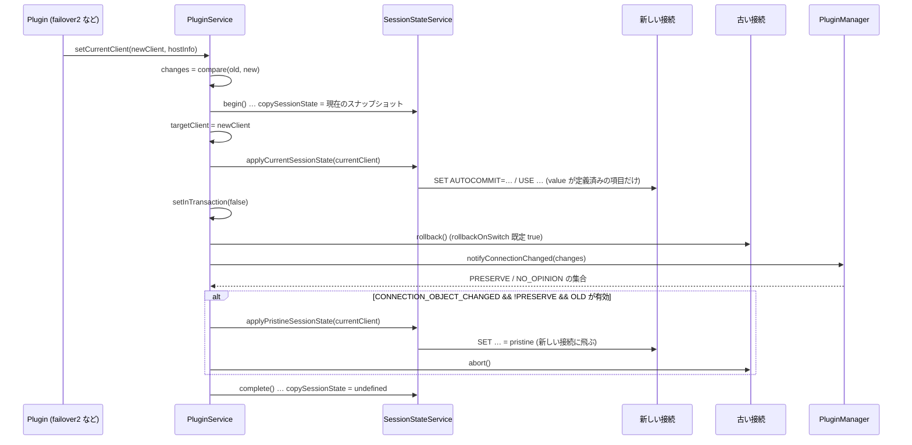

## 何を学んだか

`PluginService.setCurrentClient(newClient, hostInfo)` が、ラッパ内で**物理接続を差し替える唯一の関数**である。failover2、failover (v1)、readWriteSplitting、gdbFailover、efm (v1) の全部がここを呼ぶ。

- 差し替えは「`begin()` でスナップショット → `targetClient` を入れ替え → **現在値を新接続に転送** → 古い接続を `rollback` → プラグインに `notifyConnectionChanged` で意見を聞く → 条件が揃えば **pristine に戻して abort** → `finally` で `complete()`」の順に進む
- 転送 (`applyCurrentSessionState`) は 5 項目のうち `value !== undefined` のものだけ SQL を投げる。MySQL で非対応の `schema` は `UnsupportedMethodError` が握りつぶされる
- リセット (`applyPristineSessionState`) は **`targetClient` を入れ替えた後に `getCurrentClient()` を渡す**ので、SQL は古い接続ではなく**新しい接続**に飛ぶ。古い接続 (プールから借りたもの) は汚れたままプールに戻る
- しかもリセットの分岐に入る条件は「接続オブジェクトが変わった かつ どのプラグインも PRESERVE と言わない かつ 古い接続がまだ生きている」で、フェイルオーバー (古い接続は死んでいる) でも readWriteSplitting (PRESERVE を返す) でも入らない
- `end()` はリセットを呼ばない。`resetSessionStateOnClose` という名前が示す「close 時」は、実装上はこの狭い分岐だけを指す



## ソースコードのどこか

### `setCurrentClient` 本体

[`common/lib/plugin_service.ts#L546`](https://github.com/aws/aws-advanced-nodejs-wrapper/blob/6d0ba1bdae81a4e1fd274b3569c5dc50cf0a7095/common/lib/plugin_service.ts#L546)。

```ts title="common/lib/plugin_service.ts"
async setCurrentClient(newClient: ClientWrapper, hostInfo: HostInfo): Promise<Set<HostChangeOptions>> {
  if (!this.getCurrentClient().targetClient) {
    this.getCurrentClient().targetClient = newClient;
    this._currentHostInfo = hostInfo;
    this.sessionStateService.reset();
    const changes = new Set<HostChangeOptions>([HostChangeOptions.INITIAL_CONNECTION]);
    if (this.servicesContainer.pluginManager) {
      await this.servicesContainer.pluginManager.notifyConnectionChanged(changes, null);
    }
    return changes;
  } else {
    if (this._currentHostInfo) {
      const oldClient = this.getCurrentClient().targetClient;
      const changes: Set<HostChangeOptions> = this.compare(this._currentHostInfo, newClient.hostInfo, oldClient!, newClient);

      if (changes.size > 0) {
        const isInTransaction = this.isInTransaction();
        this.sessionStateService.begin();

        try {
          this.getCurrentClient().targetClient = newClient;
          this._currentHostInfo = hostInfo;
          await this.sessionStateService.applyCurrentSessionState(this.getCurrentClient());
          this.setInTransaction(false);

          if (oldClient && (isInTransaction || WrapperProperties.ROLLBACK_ON_SWITCH.get(this.props))) {
            try {
              await oldClient.rollback();
            } catch (error: any) {
              // Ignore.
            }
          }

          const pluginOpinions: Set<OldConnectionSuggestionAction> = await this.servicesContainer.pluginManager!.notifyConnectionChanged(
            changes,
            null
          );

          const shouldCloseConnection =
            changes.has(HostChangeOptions.CONNECTION_OBJECT_CHANGED) &&
            !pluginOpinions.has(OldConnectionSuggestionAction.PRESERVE) &&
            oldClient &&
            (await this.isClientValid(oldClient));

          if (shouldCloseConnection) {
            try {
              await this.sessionStateService.applyPristineSessionState(this.getCurrentClient());
            } catch (error: any) {
              // Ignore.
            }

            try {
              await this.abortTargetClient(oldClient);
            } catch (error: any) {
              // Ignore.
            }
          }
        } finally {
          this.sessionStateService.complete();
        }
      }
      return changes;
    }
    throw new AwsWrapperError(Messages.get("HostInfo.noHostParameter")); // Should not be reached
  }
}
```

初回接続 (`targetClient` が空) は `reset()` して `INITIAL_CONNECTION` を通知するだけである。2 回目以降が本題で、`compare` が返す差分の集合 `changes` が空なら何もしない。

### `compare` — 何が「変わった」と数えられるか

[`common/lib/plugin_service.ts#L386`](https://github.com/aws/aws-advanced-nodejs-wrapper/blob/6d0ba1bdae81a4e1fd274b3569c5dc50cf0a7095/common/lib/plugin_service.ts#L386)。

```ts title="common/lib/plugin_service.ts"
private compare(hostInfoA: HostInfo, hostInfoB: HostInfo, clientA?: ClientWrapper, clientB?: ClientWrapper): Set<HostChangeOptions> {
  const changes: Set<HostChangeOptions> = new Set<HostChangeOptions>();

  if (clientA && clientB && !Object.is(clientA, clientB)) {
    changes.add(HostChangeOptions.CONNECTION_OBJECT_CHANGED);
  }
  if (hostInfoA.host !== hostInfoB.host || hostInfoA.port !== hostInfoB.port) {
    changes.add(HostChangeOptions.HOSTNAME);
  }
  if (hostInfoA.role !== hostInfoB.role) {
    if (hostInfoB.role === HostRole.WRITER) {
      changes.add(HostChangeOptions.PROMOTED_TO_WRITER);
    } else if (hostInfoB.role === HostRole.READER) {
      changes.add(HostChangeOptions.PROMOTED_TO_READER);
    }
  }
  if (hostInfoA.availability !== hostInfoB.availability) {
    // WENT_UP / WENT_DOWN
  }
  if (changes.size > 0) {
    changes.add(HostChangeOptions.HOST_CHANGED);
  }
  return changes;
}
```

`Object.is(clientA, clientB)` で**参照の同一性**を見る。efm (v1) は同じ `targetClient` を `hostInfo` だけ変えて渡すので `CONNECTION_OBJECT_CHANGED` にならず、転送も rollback も走らない。

### 転送 — `applyCurrentSessionState`

[`common/lib/session_state_service_impl.ts#L48`](https://github.com/aws/aws-advanced-nodejs-wrapper/blob/6d0ba1bdae81a4e1fd274b3569c5dc50cf0a7095/common/lib/session_state_service_impl.ts#L48)。

```ts title="common/lib/session_state_service_impl.ts"
async applyCurrentSessionState(newClient: AwsClient): Promise<void> {
  if (!this.transferStateEnabledSetting()) {
    return;
  }
  const transferSessionStateFunc = SessionStateTransferHandler.getTransferSessionStateOnCloseFunc();
  if (transferSessionStateFunc) {
    const isHandled = transferSessionStateFunc(this.sessionState, newClient);
    if (isHandled) {
      return;
    }
  }
  const targetClient: ClientWrapper = newClient.targetClient;
  for (const key of Object.keys(this.sessionState)) {
    const state = this.sessionState[key];
    if (state instanceof SessionStateField) {
      await this.applyCurrentState(targetClient, state);
    } else {
      throw new AwsWrapperError(`Unexpected session state key: ${key}`);
    }
  }
}

private async applyCurrentState(targetClient: ClientWrapper, sessionState: SessionStateField<any>): Promise<void> {
  if (sessionState.value !== undefined) {
    sessionState.resetPristineValue();
    this.setupPristineState(sessionState);
    await this.setStateOnTarget(targetClient, sessionState);
  }
}

private async setStateOnTarget(targetClient: ClientWrapper, sessionStateField: SessionStateField<any>): Promise<void> {
  try {
    await targetClient.query(sessionStateField.getQuery(this.pluginService.getDialect(), false));
    SessionState.setState(sessionStateField, this.sessionState);
  } catch (error: any) {
    if (error instanceof UnsupportedMethodError) {
      return;
    }
    throw error;
  }
}
```

`Object.keys(this.sessionState)` で 5 項目を回し、`value` が定義済みのものだけ `getQuery(dialect, false)` の SQL を新接続に投げる。投げる前に `resetPristineValue()` → `setupPristineState()` で pristine を取り直すが、`setupPristineState` は `getClientValue` (= ラッパの記憶 = 現在の `value`) を写すので、**転送後は pristine === value** になる。新しい接続にとって「触る前」は転送直後の状態である、という定義になる。

転送に失敗した場合 (`UnsupportedMethodError` 以外) は例外がそのまま上がり、`setCurrentClient` の `finally` で `complete()` だけ走る。`targetClient` はすでに新接続に入れ替わっているので、**転送に失敗しても差し替え自体は戻らない**。

### リセット — `applyPristineSessionState`

[`common/lib/session_state_service_impl.ts#L75`](https://github.com/aws/aws-advanced-nodejs-wrapper/blob/6d0ba1bdae81a4e1fd274b3569c5dc50cf0a7095/common/lib/session_state_service_impl.ts#L75)。

```ts title="common/lib/session_state_service_impl.ts"
async applyPristineSessionState(client: AwsClient): Promise<void> {
  if (!this.resetStateEnabledSetting()) {
    return;
  }
  // (custom handler の確認は転送と同じ)
  if (this.copySessionState === undefined) {
    return;
  }
  const targetClient: ClientWrapper = client.targetClient;
  for (const key of Object.keys(this.copySessionState)) {
    const state = this.copySessionState[key];
    if (state instanceof SessionStateField) {
      await this.setPristineStateOnTarget(targetClient, state, key);
    }
  }
}

private async setPristineStateOnTarget(targetClient, sessionStateField, sessionStateName): Promise<void> {
  if (sessionStateField.canRestorePristine() && sessionStateField.pristineValue !== undefined) {
    try {
      await targetClient.query(sessionStateField.getQuery(this.pluginService.getDialect(), true));
      this.setState(sessionStateName, sessionStateField.pristineValue);
      SessionState.setPristineState(sessionStateField, this.copySessionState);
    } catch (error: any) {
      if (error instanceof UnsupportedMethodError) {
        return;
      }
      throw error;
    }
  }
}
```

`begin()` で取った `copySessionState` (差し替え前の value / pristine のペア) を回し、`canRestorePristine()` な項目に `getQuery(dialect, true)` を投げる。送り先は `client.targetClient` で、呼び出し側は `this.getCurrentClient()` を渡している。L568 で `targetClient = newClient` にした後なので、**pristine への戻しは新しい接続に飛ぶ**。

新しい接続には直前に現在値を転送したばかりなので、この戻しは**転送を打ち消す**。たとえば `autocommit` の pristine が `true`、value が `false` なら、新接続に `SET AUTOCOMMIT=false` を送った直後に `SET AUTOCOMMIT=true` を送り、ラッパの記憶も `true` に戻す。一方、古い接続には何も送られず、直後に `abort()` される。古い接続がプール由来 (`PoolClientWrapper`) なら `abort()` は `release()` なので、**`autocommit=0` のままプールに返る**。

さらに `readOnly` は `getQuery` が `isPristine` を無視して `this.value` を使う ([`session_state.ts#L114`](https://github.com/aws/aws-advanced-nodejs-wrapper/blob/6d0ba1bdae81a4e1fd274b3569c5dc50cf0a7095/common/lib/session_state.ts#L114)) ので、pristine ではなく現在値が再送される。単体テスト `test reset client readOnly` は `query` をモックして `getReadOnly()` の戻り値しか見ないため、送られる SQL のずれは検出されない ([`tests/unit/session_state_service_impl.test.ts#L74`](https://github.com/aws/aws-advanced-nodejs-wrapper/blob/6d0ba1bdae81a4e1fd274b3569c5dc50cf0a7095/tests/unit/session_state_service_impl.test.ts#L74))。

### この分岐に入る条件は狭い

`shouldCloseConnection` の 3 条件を、`setCurrentClient` の呼び出し元ごとに当てはめると次のようになる。

| 呼び出し元                                     | CONNECTION_OBJECT_CHANGED      | PRESERVE を返す者   | 古い接続が有効        | 入るか                 |
| ---------------------------------------------- | ------------------------------ | ------------------- | --------------------- | ---------------------- |
| failover2 / failover (v1) のネットワークエラー | あり                           | なし                | **無効** (切れている) | 入らない               |
| failover2 の read-only エラー (strict-writer)  | あり                           | なし                | 有効                  | **入る**               |
| readWriteSplitting の `setReadOnly`            | あり                           | **自分が PRESERVE** | 有効                  | 入らない               |
| efm (v1) の hostInfo 更新                      | **なし** (同じ `targetClient`) |                     |                       | `changes` 自体がほぼ空 |
| 初回接続                                       |                                |                     |                       | 別分岐                 |

事実上、リセットが走るのは「古い接続が生きているのにフェイルオーバーした」ケースだけで、その古い接続は `MySQLClientWrapper.abort()` = mysql2 の `destroy()` で捨てられる。捨てる接続をリセットする意味はないので、**設計意図 (プールに返す前に掃除する) が実装で実現されている経路は、MySQL クライアントには存在しない**。`end()` ([`mysql/lib/client.ts#L196`](https://github.com/aws/aws-advanced-nodejs-wrapper/blob/6d0ba1bdae81a4e1fd274b3569c5dc50cf0a7095/mysql/lib/client.ts#L196)) も `AwsMySQLPooledConnection.release()` も `applyPristineSessionState` を呼ばない。

### カスタムハンドラ

[`common/lib/session_state_transfer_handler.ts#L20`](https://github.com/aws/aws-advanced-nodejs-wrapper/blob/6d0ba1bdae81a4e1fd274b3569c5dc50cf0a7095/common/lib/session_state_transfer_handler.ts#L20)。

```ts title="common/lib/session_state_transfer_handler.ts"
export class SessionStateTransferHandler {
  static resetSessionStateOnCloseFunc:
    ((sessionState: SessionState, client: AwsClient) => boolean) | undefined;
  static transferSessionStateOnCloseFunc:
    ((sessionState: SessionState, client: AwsClient) => boolean) | undefined;

  static setResetSessionStateOnCloseFunc(resetFunc) {
    this.resetSessionStateOnCloseFunc = resetFunc;
  }
  static setTransferSessionStateOnCloseFunc(resetFunc) {
    this.transferSessionStateOnCloseFunc = resetFunc;
  }
  // clear / get も同形
}
```

プロセス全体で 1 つの static 関数を差し替える。`true` を返せばラッパ側の処理は丸ごとスキップされる。転送用の関数まで `...OnCloseFunc` と名付けられているのは、`SessionState.md` で「`setTransferSessionStateOnCloseFunc`」と案内されているとおりで、名前と用途がずれたまま公開 API になっている。5 項目以外 (たとえば `time_zone`) を転送したいなら、この関数で `SessionState` を受け取り、自分で `client.targetClient.query(...)` を打つのが唯一の拡張点である。

## なぜそうなっているか

### なぜ `begin()` / `complete()` で括るのか

`begin()` は `copySessionState` があれば `"Previous session state transfer is not completed."` を投げる。差し替えの再入を防ぐガードで、`finally` の `complete()` と対になっている。転送の途中で例外が出ても `complete()` は走るので、次の差し替えは通る。スナップショットを取る理由は、転送で `pristine` を取り直す (`resetPristineValue` → `setupPristineState`) ため、リセットに使う「差し替え前のペア」を別に保持する必要があるからである。

### なぜリセットが新しい接続に向いているのか

コードからは、`this.getCurrentClient()` を渡すことで「現在の client」を意味したかったのか、「古い接続」を意味したかったのかは読めない。`SessionState.md` の記述 (「Before closing a connection, the driver sets its session state settings with the pristine values」) と、`abort(oldClient)` の直前に置かれていることから、意図は古い接続へのリセットだと読める。`applyPristineSessionState` の引数は `AwsClient` 型なので、`ClientWrapper` である `oldClient` をそのまま渡せず、`getCurrentClient()` を渡した結果このずれが生じた、というのがコード構造からの推測である。

### なぜ `rollbackOnSwitch` が既定で true なのか

古い接続が生きたまま差し替わる場合 (readWriteSplitting)、古い接続にはロックや未コミットの変更が残りうる。`rollback` を 1 回投げるコストは 1 往復で、死んだ接続なら即失敗して握りつぶされる。安全側に倒して損がない。

## どう活かすか

- **状態を移す操作は「スナップショット → 適用 → finally で完了」の形にする。** `begin()` / `complete()` の対は、途中で例外が出ても次の操作を塞がないための最小構成である
- **「誰に対して」を引数の型で縛る。** `applyPristineSessionState(client: AwsClient)` は「現在の client」しか渡せない型になっていて、古い接続を渡す手段がない。型がずれた時点で意図が実装できなくなった例と読める
- **リセットとフォールバックは、実際に走る経路をテーブルで確認する。** 上の表のように呼び出し元ごとに条件を当てはめると、「動いていない機能」が見える。単体テストがモックしか見ていないと気づけない
- **公開 API の名前は実装より先に固まる。** `setTransferSessionStateOnCloseFunc` は明らかに転送用だが `OnClose` が付いている。命名を直すのは破壊的変更なので、最初の命名を慎重にする

### 実務で踏む失敗パターン

- **内部プールを使っているのに、次に借りた接続が `autocommit=0` のままだった。** ラッパのリセットは古い接続に届かない。mysql2 の `resetOnRelease` (既定 `false`、`COM_RESET_CONNECTION` を送る) をプール設定で立てるか、借りた直後に自分で `SET` し直す
- **`SET time_zone` が転送されない。** 5 項目の外。`setTransferSessionStateOnCloseFunc` で自前の転送を書くか、`FailoverSuccessError` 時に打ち直す
- **転送の SQL が失敗して例外が返ったが、接続はすでに差し替わっていた。** `finally` は `complete()` しか戻さない。転送失敗の例外を受けたら、その client のセッション状態は信用せず、設定をやり直す
- **`transferSessionStateOnSwitch=false` にしたら `getAutoCommit()` が `undefined` になった。** 転送だけでなく記録 (`setState`) も止まる。フラグの粒度が粗い
