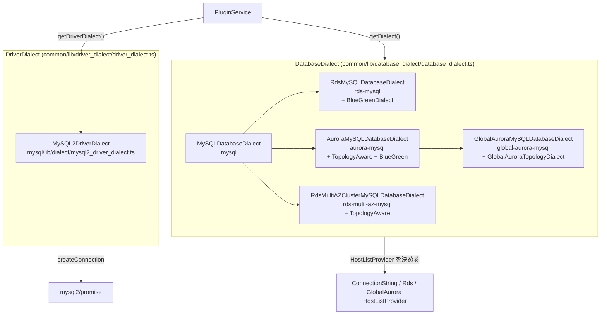

## この層の責務

ラッパは `pg` と `mysql2` の両方に乗る。同じ「MySQL」でも、素の MySQL / RDS MySQL / Aurora MySQL / Multi-AZ / Global で、トポロジを聞く SQL も、自分が writer かを知る変数も違う。この 2 軸の違いを 1 つの抽象に押し込まず、**2 種類の Dialect** に分けている。

|                | DriverDialect                                                             | DatabaseDialect                                               |
| -------------- | ------------------------------------------------------------------------- | ------------------------------------------------------------- |
| 何の癖か       | Node.js ライブラリ (mysql2 / pg)                                          | DB エンジン (MySQL / Aurora MySQL / ...)                      |
| 例             | `createConnection` の呼び方、タイムアウトのオプション名、keepAlive の可否 | トポロジクエリ、`@@innodb_read_only`、`SET autocommit` の構文 |
| MySQL 側の実装 | `MySQL2DriverDialect` 1 つ                                                | `MySQLDatabaseDialect` と派生 4 つ                            |
| 決まり方       | クライアントの型で固定                                                    | URL から推測し、接続後に SQL で確定                           |
| docs           | `DriverDialects.md`                                                       | `DatabaseDialects.md`                                         |

`docs/using-the-nodejs-wrapper/DriverDialects.md` の言い方を借りれば、DriverDialect は「properly pass calls to a target driver」、DatabaseDialect は「determine what kind of underlying database is being used」である。

## 主要な型とその関係



### `DriverDialect` の 8 メソッド

[`common/lib/driver_dialect/driver_dialect.ts#L22`](https://github.com/aws/aws-advanced-nodejs-wrapper/blob/6d0ba1bdae81a4e1fd274b3569c5dc50cf0a7095/common/lib/driver_dialect/driver_dialect.ts#L22)。

```ts title="common/lib/driver_dialect/driver_dialect.ts"
export interface DriverDialect {
  getDialectName(): string;
  connect(hostInfo: HostInfo, props: Map<string, any>): Promise<ClientWrapper>;
  preparePoolClientProperties(
    props: Map<string, any>,
    poolConfig: AwsPoolConfig | undefined,
  ): unknown;
  getAwsPoolClient(props: unknown): AwsInternalPoolClient;
  setConnectTimeout(props: Map<string, any>, wrapperConnectTimeout?: number): void;
  setQueryTimeout(props: Map<string, any>, sql?: unknown, wrapperQueryTimeout?: number): void;
  setKeepAliveProperties(props: Map<string, any>, keepAliveProps: unknown): void;
  getQueryFromMethodArg(methodArg: unknown): string;
}
```

全部「ラッパの語彙をドライバの語彙に翻訳する」メソッドである。`wrapperConnectTimeout` → mysql2 の `connectTimeout`、`wrapperQueryTimeout` → mysql2 の `timeout`、`AwsPoolConfig.maxConnections` → `PoolOptions.connectionLimit`。

### `DatabaseDialect` の 24 メソッド

[`common/lib/database_dialect/database_dialect.ts#L31`](https://github.com/aws/aws-advanced-nodejs-wrapper/blob/6d0ba1bdae81a4e1fd274b3569c5dc50cf0a7095/common/lib/database_dialect/database_dialect.ts#L31)。4 つの束に分かれる。

| 束                   | メソッド                                                                                                              | MySQL での中身                                                                                                                 |
| -------------------- | --------------------------------------------------------------------------------------------------------------------- | ------------------------------------------------------------------------------------------------------------------------------ |
| 接続の基本           | `getDefaultPort`, `getHostAliasQuery`, `getServerVersionQuery`, `isClientValid`, `getErrorHandler`, `getDatabaseType` | 3306、`SELECT CONCAT(@@hostname, ':', @@port)`、`SHOW VARIABLES LIKE 'version_comment'`、`SELECT 1`、`new MySQLErrorHandler()` |
| セッション状態の SQL | `getSet{ReadOnly,AutoCommit,TransactionIsolation,Catalog,Schema}Query`, `doesStatementSet*`                           | `SET SESSION TRANSACTION READ ONLY` などの生成と、逆方向の文字列解析                                                           |
| 判定                 | `isDialect`, `getDialectUpdateCandidates`                                                                             | 次ページ                                                                                                                       |
| トポロジ             | `getHostListProvider`, `getHostRole`, `getFailoverRestrictions`, `filterAvailableHosts?`                              | Dialect ごとに違う                                                                                                             |

`TopologyAwareDatabaseDialect` ([`topology_aware_database_dialect.ts#L21`](https://github.com/aws/aws-advanced-nodejs-wrapper/blob/6d0ba1bdae81a4e1fd274b3569c5dc50cf0a7095/common/lib/database_dialect/topology_aware_database_dialect.ts#L21)) は `queryForTopology` / `identifyConnection` / `getHostRole` / `getWriterId` / `getInstanceId` の 5 つを足す。Aurora と Multi-AZ がこれを実装し、`RdsHostListProvider` を返す。素の MySQL と RDS MySQL は実装せず、`ConnectionStringHostListProvider` を返す。

## 処理の流れ

### `MySQL2DriverDialect.connect`: mysql2 に渡す直前の 4 手順

[`mysql/lib/dialect/mysql2_driver_dialect.ts#L43`](https://github.com/aws/aws-advanced-nodejs-wrapper/blob/6d0ba1bdae81a4e1fd274b3569c5dc50cf0a7095/mysql/lib/dialect/mysql2_driver_dialect.ts#L43)。

```ts title="mysql/lib/dialect/mysql2_driver_dialect.ts"
async connect(hostInfo: HostInfo, props: Map<string, any>): Promise<ClientWrapper> {
  const driverProperties = WrapperProperties.removeWrapperProperties(props);
  // MySQL2 does not support keep alive, explicitly check and throw an error if this value is set to true.
  this.setKeepAliveProperties(driverProperties, props.get(WrapperProperties.KEEPALIVE_PROPERTIES.name));
  this.setConnectTimeout(driverProperties, props.get(WrapperProperties.WRAPPER_CONNECT_TIMEOUT.name));
  this.setCleartextPluginForTokenAuth(driverProperties, props);
  const targetClient = await createConnection(Object.fromEntries(driverProperties.entries()));
  return Promise.resolve(new MySQLClientWrapper(targetClient, hostInfo, props, this));
}
```

1. **ラッパ固有のキーを剥がす** ([WrapperProperties](../wrapper-properties/))。残ったキーはそのまま mysql2 の `ConnectionOptions` になる。`ssl` / `timezone` / `enableKeepAlive` / `charset` などは触られずに通る
2. **`wrapperKeepAliveProperties` に `keepAlive` があれば例外。** 後述
3. **`wrapperConnectTimeout` (既定 10000) を mysql2 の `connectTimeout` に写す**
4. **トークン認証なら `enableCleartextPlugin: true` を立てる** ([MySQL で IAM を使うと cleartext になる](../iam-cleartext-on-mysql/))

そして `mysql2/promise` の `createConnection` を `await` する。mysql2 側 ([`promise.js#L21`](https://github.com/sidorares/node-mysql2/blob/d8932925b237f07b6410263770379998df973502/promise.js#L21)) は `connect` イベントで resolve、`error` イベントで reject するので、ここで認証失敗や `ECONNREFUSED` が例外として上がる。

戻りは `MySQLClientWrapper` で、mysql2 の `PromiseConnection` と `HostInfo` と**元の `props` (剥がす前)** を束ねる。`ClientWrapper.properties` に `wrapperQueryTimeout` が残っているから、`MySQLClientWrapper.queryWithTimeout` がそれを読める。

### `setQueryTimeout`: mysql2 の `timeout` は inactivity timeout

[`#L107`](https://github.com/aws/aws-advanced-nodejs-wrapper/blob/6d0ba1bdae81a4e1fd274b3569c5dc50cf0a7095/mysql/lib/dialect/mysql2_driver_dialect.ts#L107)。

```ts title="mysql/lib/dialect/mysql2_driver_dialect.ts"
setQueryTimeout(props: Map<string, any>, sql?: any, wrapperQueryTimeout?: any) {
  if (!sql) {
    return;
  }
  const timeout = wrapperQueryTimeout ?? props.get(WrapperProperties.WRAPPER_QUERY_TIMEOUT.name);
  if (timeout && !sql[MySQL2DriverDialect.QUERY_TIMEOUT_PROPERTY_NAME]) {
    sql[MySQL2DriverDialect.QUERY_TIMEOUT_PROPERTY_NAME] = Number(timeout);
  }
}
```

接続オプションではなく**クエリオブジェクト** (`{ sql, timeout }`) に書く。mysql2 の `timeout` は `lib/commands/query.js` で `_setTimeout` → `_handleTimeoutError` として実装されていて ([`query.js#L344`](https://github.com/sidorares/node-mysql2/blob/d8932925b237f07b6410263770379998df973502/lib/commands/query.js#L344))、エラーは `'Query inactivity timeout'` (`PROTOCOL_SEQUENCE_TIMEOUT`)。名前の通り「パケットが来ない時間」の上限で、行が少しずつ流れてくる長いクエリは切れない。

呼ぶのは `MySQLClientWrapper.query(sql)` ([`mysql_client_wrapper.ts#L49`](https://github.com/aws/aws-advanced-nodejs-wrapper/blob/6d0ba1bdae81a4e1fd274b3569c5dc50cf0a7095/common/lib/mysql_client_wrapper.ts#L49)) で、これは**ラッパ内部のクエリ** (トポロジクエリ、`SELECT 1`、Dialect 判定) 用である。アプリの `client.query()` は `ClientUtils.queryWithTimeout` の `Promise.race` を使い、この `timeout` は付けない。同じ `wrapperQueryTimeout` が 2 つの別の仕組みに使われている。

### `setKeepAliveProperties`: 「非対応」の正確な意味

[`#L117`](https://github.com/aws/aws-advanced-nodejs-wrapper/blob/6d0ba1bdae81a4e1fd274b3569c5dc50cf0a7095/mysql/lib/dialect/mysql2_driver_dialect.ts#L117)。

```ts title="mysql/lib/dialect/mysql2_driver_dialect.ts"
setKeepAliveProperties(props: Map<string, any>, keepAliveProps: any) {
  if (keepAliveProps instanceof Map) {
    keepAliveProps = Object.fromEntries(keepAliveProps);
  }
  if (keepAliveProps && keepAliveProps[MySQL2DriverDialect.KEEP_ALIVE_PROPERTY_NAME] !== undefined) {
    throw new UnsupportedMethodError("Keep alive configuration is not supported for MySQL2.");
  }
}
```

コメントは "MySQL2 does not support keep alive" だが、mysql2 自身は `enableKeepAlive` (既定 `true`) と `keepAliveInitialDelay` を持ち、ソケットに `setKeepAlive` を掛けている ([`lib/connection_config.js#L127`](https://github.com/sidorares/node-mysql2/blob/d8932925b237f07b6410263770379998df973502/lib/connection_config.js#L127)、[`lib/base/connection.js#L63`](https://github.com/sidorares/node-mysql2/blob/d8932925b237f07b6410263770379998df973502/lib/base/connection.js#L63))。正確には「ラッパの汎用キー `wrapperKeepAliveProperties.keepAlive` を mysql2 のオプションに翻訳する対応がない」であって、TCP keepalive 自体は mysql2 の既定で有効になっている。`enableKeepAlive` / `keepAliveInitialDelay` を接続オプションに直接書けば、手順 1 でそのまま通る。テスト `test_connectWithKeepAliveProps_MySQL_shouldThrow` ([`tests/unit/driver_dialect.test.ts#L26`](https://github.com/aws/aws-advanced-nodejs-wrapper/blob/6d0ba1bdae81a4e1fd274b3569c5dc50cf0a7095/tests/unit/driver_dialect.test.ts#L26)) が例外側の挙動を固定している。

### `preparePoolClientProperties`: `AwsPoolConfig` → mysql2 `PoolOptions`

[`#L53`](https://github.com/aws/aws-advanced-nodejs-wrapper/blob/6d0ba1bdae81a4e1fd274b3569c5dc50cf0a7095/mysql/lib/dialect/mysql2_driver_dialect.ts#L53)。

| `AwsPoolConfig`      | mysql2 `PoolOptions` |
| -------------------- | -------------------- |
| `maxConnections`     | `connectionLimit`    |
| `idleTimeoutMillis`  | `idleTimeout`        |
| `maxIdleConnections` | `maxIdle`            |
| `waitForConnections` | `waitForConnections` |
| `queueLimit`         | `queueLimit`         |

ここでは `setCleartextPluginForTokenAuth` を**呼んでいない**。内部プール経由で IAM 認証を使う場合、cleartext の自動設定は効かない。`enableCleartextPlugin` を自分で書く必要がある。

### `MySQLDatabaseDialect`: 5 種の共通部分

[`mysql/lib/dialect/mysql_database_dialect.ts#L33`](https://github.com/aws/aws-advanced-nodejs-wrapper/blob/6d0ba1bdae81a4e1fd274b3569c5dc50cf0a7095/mysql/lib/dialect/mysql_database_dialect.ts#L33)。派生 4 つは `isDialect` / `getDialectUpdateCandidates` / `getHostListProvider` と、トポロジ系を上書きするだけで、セッション状態の SQL 生成と解析、`isClientValid`、`getErrorHandler` は全部ここにある。

```ts title="mysql/lib/dialect/mysql_database_dialect.ts"
async isClientValid(targetClient: ClientWrapper): Promise<boolean> {
  try {
    return await ClientUtils.queryWithTimeout(
      targetClient.query("SELECT 1").then(() => true).catch(() => false),
      targetClient.properties
    );
  } catch (error) {
    return false;
  }
}

getErrorHandler(): ErrorHandler {
  return new MySQLErrorHandler();
}
```

`isClientValid` は `SELECT 1` に `queryWithTimeout` を掛け、失敗もタイムアウトも `false` に潰す。efm の生死判定と `setCurrentClient` の旧接続確認の両方がこれを使う。

`getErrorHandler` は**呼ばれるたびに新しいインスタンス**を返す。`PluginServiceImpl` は `this.getDialect().getErrorHandler().isNetworkError(e)` のように毎回呼ぶので、`MySQLErrorHandler` のフィールド (`unexpectedError`、リスナ付与フラグ) は呼び出しをまたいで残らない。この性質が [MySQLErrorHandler](../mysql-error-handler/) の読みどころになる。

派生ごとの差分は次の通り。

| Dialect                                 | `getHostListProvider`                                  | 追加の役割                                            | `getFailoverRestrictions`                   |
| --------------------------------------- | ------------------------------------------------------ | ----------------------------------------------------- | ------------------------------------------- |
| `MySQLDatabaseDialect`                  | `ConnectionStringHostListProvider`                     | なし                                                  | `[]`                                        |
| `RdsMySQLDatabaseDialect`               | 同上                                                   | `BlueGreenDialect` (`mysql.rds_topology`)             | `[]`                                        |
| `AuroraMySQLDatabaseDialect`            | `RdsHostListProvider` + `AuroraTopologyUtils`          | `TopologyAware` + `BlueGreen`                         | `[]`                                        |
| `RdsMultiAZClusterMySQLDatabaseDialect` | `RdsHostListProvider` + `AuroraTopologyUtils`          | `TopologyAware`                                       | `DISABLE_TASK_A`, `ENABLE_WRITER_IN_TASK_B` |
| `GlobalAuroraMySQLDatabaseDialect`      | `GlobalAuroraHostListProvider` + `GlobalTopologyUtils` | `GlobalAuroraTopologyDialect`、`filterAvailableHosts` | `[]` (Aurora を継承)                        |

Multi-AZ が `AuroraTopologyUtils` を使い回しているのは、`TopologyQueryResult` の形 (`host` / `isWriter` / `weight` / `port` / `id`) を Aurora と揃えているからで、`queryForTopology` の中身だけが違う ([トポロジクエリ (Multi-AZ MySQL)](../topology-query-multi-az/))。

## 守られている不変条件

- **`DriverDialect` はクライアント生成時に固定され、変わらない。** `BaseAwsMySQLClient` のコンストラクタが `new MySQL2DriverDialect()` を渡し、`PluginServiceImpl.driverDialect` は `readonly`
- **`DatabaseDialect` は `PluginServiceImpl.dialect` の 1 か所にだけ保持され、`updateDialect` だけが書き換える。** プラグインは `getDialect()` で都度取る
- **Dialect インスタンスは状態を持たない。** `knownDialectsByCode` の 5 つはクラスの static Map で全クライアント共有。`getErrorHandler` が毎回 new するのも、Dialect に状態を持たせないため
- **`DatabaseDialect` は `ClientWrapper` にしか触らない。** `targetClient.query(sql)` の戻りが `[rows, fields]` である前提で `res[0][0]["host"]` のように読む。この「戻りの形」は `MySQLClientWrapper.query` が保証する

## つまずきどころ

- **`dialect` を明示するなら `DatabaseDialectCodes` の文字列。** `"aurora-mysql"` / `"rds-multi-az-mysql"` など。`customDatabaseDialect` にオブジェクトを渡すこともでき、その場合は `dialect` を無視して `custom` になる。`DatabaseDialectManager` は `getDialectName` を持つかで `DatabaseDialect` かどうかを判定する ([`database_dialect_manager.ts#L56`](https://github.com/aws/aws-advanced-nodejs-wrapper/blob/6d0ba1bdae81a4e1fd274b3569c5dc50cf0a7095/common/lib/database_dialect/database_dialect_manager.ts#L56))
- **`wrapperQueryTimeout` は内部クエリでは mysql2 の inactivity timeout、アプリのクエリでは壁時計。** 意味が違うので、値を大きくしても「内部クエリは切れないがアプリのクエリは切れる」ことがある
- **`isClientValid` の `SELECT 1` にも `wrapperQueryTimeout` が効く。** 監視接続の生死判定を速くしたければ `monitoring_wrapperQueryTimeout` を短くする ([HostMonitor](../host-monitor/))
- **`doesStatementSet*` は小文字化された SQL に `includes` を掛ける素朴な解析。** `SET autocommit = 0` は `"set autocommit"` を含み `"="` で割った 2 番目が `"0"` なら `false`。コメントや複数の `=` があると外れる ([SQL を読んで状態を追う](../tracking-state-from-sql/))
- **`getHostRole` は素の `MySQLDatabaseDialect` では `UnsupportedMethodError`。** `AwsMySQLClient.connect()` は `try/catch` で握り潰しているので、素の MySQL では役割確認がスキップされる。Aurora は `@@innodb_read_only`、Multi-AZ は `@@read_only` で、変数名が違う
