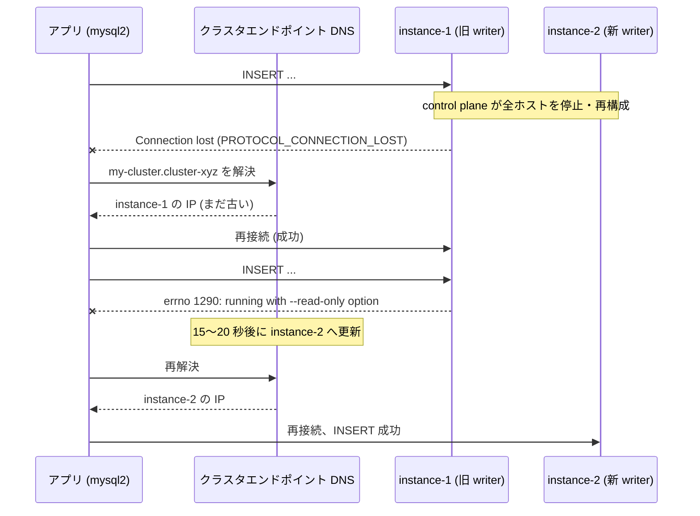

## 何を学んだか

Aurora MySQL のフェイルオーバーを、クライアント側から見た事実として 3 つに絞ると次のようになる。

1. **全ホストが一瞬止まる。** 落ちた 1 台だけでなく、control plane が全インスタンスを再構成する。「writer 以外は無事」ではない
2. **DNS は遅れて追いつく。** クラスタエンドポイントの更新は AWS 側で 15〜20 秒、その先のリゾルバでさらに遅れる。その間、旧 writer に繋がる
3. **旧 writer は死なずに reader になる。** 接続はできるが書き込めない。`INSERT` は `errno 1290` (`--read-only option`) で落ちる

mysql2 がこれらに対して返すのは `Connection lost: The server closed the connection.`、`connect ETIMEDOUT`、そして 1290 / 1836 のエラーオブジェクトであって、「フェイルオーバーが起きた」という情報はどこにもない。ラッパの群 3〜5 は、この 3 つの事実にそれぞれ対応する形で組まれている。



## ソースコードのどこか

### 3 つの事実は docs の 3 つの節にある

[`FailoverConfigurationGuide.md`](https://github.com/aws/aws-advanced-nodejs-wrapper/blob/6d0ba1bdae81a4e1fd274b3569c5dc50cf0a7095/docs/using-the-nodejs-wrapper/FailoverConfigurationGuide.md) の「Tips to Keep in Mind」に、短いが決定的な記述が 3 つ並んでいる。

**Host Availability** (全ホストが止まる):

> It seems as though just one host, the one triggering the failover, will be unavailable during the failover process; this is actually not true. When failover is triggered, all hosts become unavailable for a short time. This is because the control plane, which orchestrates the failover process, first shuts down all hosts, then starts the writer host, and finally starts and connects the remaining hosts to the writer.

続けて「failover の時間設定を攻めすぎると、ホストがまだ戻っていない段階でタイムアウトして失敗する」とある。これが [時間設計](../failover-timing/) のページで `failoverTimeoutMs` の既定が 300 秒と長い理由になる。

**Writer Cluster Endpoints After Failover** (DNS が遅れる):

> On the AWS DNS server, this change is updated usually between 15-20 seconds, but the other DNS servers sitting between the application and the AWS DNS server may not be updated in time.

**2-Host Clusters** (2 台では役割交換にしかならない):

> the two hosts simply switch roles; the reader becomes the writer and the writer becomes the reader. If failover is triggered because one of the hosts has a problem, this problem will persist because there aren't any extra hosts to take the responsibility of the one that is broken.

### 「reader のトポロジは古いことがある」

もう 1 つ、[`UsingTheFailover2Plugin.md`](https://github.com/aws/aws-advanced-nodejs-wrapper/blob/6d0ba1bdae81a4e1fd274b3569c5dc50cf0a7095/docs/using-the-nodejs-wrapper/using-plugins/UsingTheFailover2Plugin.md) の Picture 3 の説明が、フェイルオーバー直後の**もう一段深い落とし穴**を書いている。

> When Aurora failover occurs, the new writer host is the first host to reflect the true topology of the cluster. Other hosts connect to the new writer shortly after and update their local copies of the topology. Topology information acquired from a reader host may be outdated/inaccurate for a short period after failover.

`information_schema.replica_host_status` は各インスタンスが持つ**ローカルコピー**であって、フェイルオーバー直後に reader へ聞くと「instance-3 がまだ writer」という古い答えが返ることがある。だから failover2 は全ホストに「**自分は** writer か」と聞いて回る ([「自分は writer か」を全ホストに聞く](../am-i-a-writer/))。

### mysql2 が返すもの

接続が切れたとき、mysql2 は TCP ソケットの `close` イベントでエラーを作る ([`lib/base/connection.js#L115`](https://github.com/sidorares/node-mysql2/blob/d8932925b237f07b6410263770379998df973502/lib/base/connection.js#L115))。

```js title="lib/base/connection.js"
this.stream.on("close", () => {
  // we need to set this flag everywhere where we want connection to close
  if (this._closing) {
    return;
  }
  if (!this._protocolError) {
    // no particular error message before disconnect
    this._protocolError = new Error("Connection lost: The server closed the connection.");
    this._protocolError.fatal = true;
    this._protocolError.code = "PROTOCOL_CONNECTION_LOST";
  }
  this._notifyError(this._protocolError);
});
```

接続しようとして応答がないときは `connectTimeout` (既定 10 秒) の後に `connect ETIMEDOUT` を作る ([`#L238`](https://github.com/sidorares/node-mysql2/blob/d8932925b237f07b6410263770379998df973502/lib/base/connection.js#L238))。どちらも `fatal = true` で、以降そのコネクションにはコマンドを積めなくなる。

書き込みが read-only インスタンスに届いたときの扱いは、mysql2 の Pool にだけある ([`lib/base/pool.js#L16`](https://github.com/sidorares/node-mysql2/blob/d8932925b237f07b6410263770379998df973502/lib/base/pool.js#L16))。

```js title="lib/base/pool.js"
// Source: https://github.com/go-sql-driver/mysql/blob/76c00e35a8d48f8f70f0e7dffe584692bd3fa612/packets.go#L598-L613
function isReadOnlyError(err) {
  if (!err || !err.errno) {
    return false;
  }
  // 1792: ER_CANT_EXECUTE_IN_READ_ONLY_TRANSACTION
  // 1290: ER_OPTION_PREVENTS_STATEMENT (returned by Aurora during failover)
  // 1836: ER_READ_ONLY_MODE
  return (
    err.errno === Errors.ER_OPTION_PREVENTS_STATEMENT ||
    err.errno === Errors.ER_CANT_EXECUTE_IN_READ_ONLY_TRANSACTION ||
    err.errno === Errors.ER_READ_ONLY_MODE
  );
}
```

コメントに「returned by Aurora during failover」と明記されている。mysql2 はこのエラーを見たとき、`pool.query()` の中でそのコネクションを `release()` ではなく `destroy()` する ([`#L258`](https://github.com/sidorares/node-mysql2/blob/d8932925b237f07b6410263770379998df973502/lib/base/pool.js#L250))。プールに戻すと、次に借りた人も同じ旧 writer に当たるからだ。**しかし、それ以上のことはしない**。エラーはそのままアプリに返り、次の `getConnection` はまた DNS を引く。

ラッパ側は同じ 2 つのコードを `MySQLErrorHandler.READ_ONLY_ERROR_CODES = [1290, 1836]` ([`mysql/lib/mysql_error_handler.ts#L27`](https://github.com/aws/aws-advanced-nodejs-wrapper/blob/6d0ba1bdae81a4e1fd274b3569c5dc50cf0a7095/mysql/lib/mysql_error_handler.ts#L27)) として持ち、`failoverMode` が `strict-writer` のときだけフェイルオーバーのトリガにする ([`failover2_plugin.ts#L495`](https://github.com/aws/aws-advanced-nodejs-wrapper/blob/6d0ba1bdae81a4e1fd274b3569c5dc50cf0a7095/common/lib/plugins/failover2/failover2_plugin.ts#L495))。これは 3.0.0 で入った挙動で、[何をトリガとするか](../failover-triggers/) で読む。

## なぜそうなっているか

### 共有ストレージだから昇格は速く、再構成は全員に及ぶ

Aurora のデータは 1 つのストレージ層にあるので、新 writer は「これから書いていい」と言われるだけで昇格できる。データのコピーも、binlog の追いつきも要らない。だから Aurora のフェイルオーバーは 30 秒前後で終わる。

一方で、reader は writer からキャッシュ無効化通知を受ける相手を切り替えなければならず、writer 側も全 reader との接続を張り直す必要がある。control plane がこれを「全部止めて、writer を起こして、reader を繋ぎ直す」という手順で行うため、**落ちていない reader も一度止まる**。クライアント側で「reader 経由なら安全」と考えると外れる。

### DNS は結果整合で、しかもクライアントが制御できない

クラスタエンドポイントは CNAME で、TTL は短い (5 秒程度)。しかし TTL を守るかどうかはリゾルバ次第で、Java の古い InetAddress キャッシュや一部の企業内 DNS は TTL を無視する。AWS 側の更新も即時ではない。

ラッパはこの問題を **DNS を使わないことで**解決している。トポロジは SQL で取り、インスタンスエンドポイントはテンプレートで組み立てる ([Aurora MySQL クラスタの構造](../aurora-mysql-cluster/))。クラスタエンドポイント経由の接続には、繋いだ先が本当に writer か確かめる `staleDns` / `initialConnection` の仕組みを置く ([StaleDns](../stale-dns/)、[initialConnection プラグイン](../initial-connection-strategy/))。

### 旧 writer が「生きている」ことが一番厄介

ネットワーク断なら TCP のエラーで済む。旧 writer は接続を受け付け、`SELECT` にも答え、`INSERT` だけ 1290 で断る。アプリケーションから見ると「DB は生きているのに書けない」という状態で、これを「フェイルオーバーで古い場所に繋いでいる」と解釈できるのは、**役割が変わりうる**ことを知っているクライアントだけである。

PoolCluster を含む mysql2 は、この解釈をしない。ノードは名前で `MASTER` と自称するだけで、誰も検証しない ([mysql2 の PoolCluster](../mysql2-pool-cluster/))。

## どう活かすか

- **フェイルオーバーは「1 台の障害」ではなく「クラスタ全体の再構成」として設計する。** リトライやタイムアウトを決めるとき、reader も止まる前提で全体の待ち時間を見積もる
- **DNS TTL を信じない。** 高可用性を DNS 切り替えで実現するシステムでは、クライアント側のリゾルバキャッシュが最大の不確定要素になる。可能なら、名前解決とは別の経路で「今どれが正か」を確認する手段を持つ
- **「生きているが役割が違う」を障害の一種として扱う。** ヘルスチェックが `SELECT 1` だけだと、降格した旧 writer は健全に見える。役割 (`@@innodb_read_only`) まで見る
- **2 台構成で failover をテストしても意味がない。** 役割交換にしかならず、本番の「3 台以上で 1 台落ちる」挙動を再現しない。テスト環境も 3 台にする

### 実務で踏む失敗パターン

- **failover 系の時間設定を攻めすぎて、ホストが戻る前にタイムアウトする。** `failoverTimeoutMs` を 30 秒などに縮めるときは、Host Availability の記述を読んでからにする
- **FailoverSuccessError を「エラー」として扱って接続を捨てる。** ラッパは新 writer への接続を張り終えてから例外を投げる。捨てると、せっかくの接続も捨てることになる ([FailoverSuccessError](../failover-success-error/))
- **reader に聞いたトポロジを信じて旧 writer に張り直す。** フェイルオーバー直後の数秒間、reader の `replica_host_status` は古い。自分で同じクエリを打つツールを書くなら、writer から取るか複数ホストで突き合わせる
