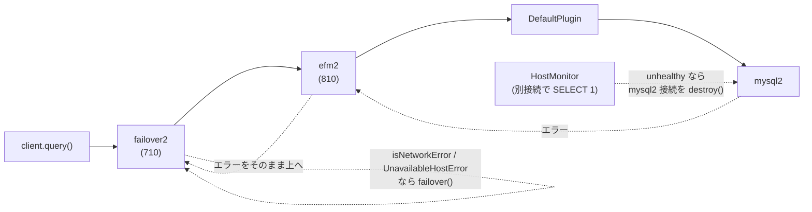

## 何を学んだか

フェイルオーバーは「エラーを捕まえて接続を差し替える」仕組みなので、**エラーが出るまでは何も始まらない**。問題は、ホストが黙って消えたときにエラーが出るまでの時間である。

- mysql2 は、クエリを送った後は**サーバからのパケットを待つだけ**で、生存確認をしない。ネットワークが黒穴になれば、OS の TCP 再送が諦めるまで (分単位) 何も起きない
- ラッパは `wrapperQueryTimeout` (既定 20 秒) で自前のタイムアウトを掛けるが、これは**「20 秒返ってこないクエリ」を全部落とす**。10 分かかるバッチと死んだホストの区別がつかない
- EFM (Enhanced Failure Monitoring) は、**アプリのクエリとは別の接続**で `SELECT 1` を打ち続け、「ホストが応答するか」だけを見る。応答しなくなったらアプリ側の接続を強制的に切り、エラーを発生させて failover に渡す

つまり EFM は、フェイルオーバーの**入口を早める**ための仕組みで、単体では接続を切るだけである。

監視が動くのは**メソッド呼び出しの実行中だけ**である。`execute` の入口で `startMonitoring`、`finally` で `stopMonitoring` するので、遊休中の接続は EFM の対象外になる。遊休中に mysql2 が `error` を emit した場合は、`PluginManager.execute` が付け替える tracking リスナが拾い、次の呼び出しの冒頭で failover2 が投げ直す ([MySQLErrorHandler](../mysql-error-handler/)、[全体像](../failover-overview/))。EFM が「遊休中に気づく」ことはない。

もう 1 つ、既定値の関係を先に押さえておく。既定の `wrapperQueryTimeout` は 20 秒、既定の EFM が不健全を確定させるのは猶予 30 秒 + 5 秒 × 3 回 = 45 秒後である。**既定値のままでは EFM より先にラッパのタイムアウトが来る**。EFM が意味を持つのは、長いクエリのために `wrapperQueryTimeout` を伸ばした構成だけである。

## ソースコードのどこか

### mysql2 が持っている時間の概念は 2 つだけ

mysql2 側にある「待ちを打ち切る」仕組みは、接続時の `connectTimeout` と、クエリ単位の `timeout` の 2 つである。

[`lib/base/connection.js#L193`](https://github.com/sidorares/node-mysql2/blob/d8932925b237f07b6410263770379998df973502/lib/base/connection.js#L193) で `connectTimeout` (既定 10 秒) が張られるが、これはハンドシェイク完了までの話で、接続後には何もしない。クエリ側の `timeout` は [`lib/commands/query.js#L344`](https://github.com/sidorares/node-mysql2/blob/d8932925b237f07b6410263770379998df973502/lib/commands/query.js#L344) で「パケットが一定時間来ない」ことを検出するもので、既定では無効である。

```js title="lib/commands/query.js (mysql2)"
_handleTimeoutError() {
  if (this.queryTimeout) {
    Timers.clearTimeout(this.queryTimeout);
    this.queryTimeout = null;
  }

  const err = new Error('Query inactivity timeout');
  err.errorno = 'PROTOCOL_SEQUENCE_TIMEOUT';
  err.code = 'PROTOCOL_SEQUENCE_TIMEOUT';
  err.syscall = 'query';
```

どちらも「このクエリが遅い」しか言えない。ホストが生きているかどうかは、別の経路で聞くしかない。

### ラッパのタイムアウトも同じ限界を持つ

`AwsMySQLClient.query()` は mysql2 の `query()` を `ClientUtils.queryWithTimeout` で包む ([`mysql/lib/client.ts#L112`](https://github.com/aws/aws-advanced-nodejs-wrapper/blob/6d0ba1bdae81a4e1fd274b3569c5dc50cf0a7095/mysql/lib/client.ts#L112))。中身は `Promise.race` である ([`common/lib/utils/client_utils.ts#L24`](https://github.com/aws/aws-advanced-nodejs-wrapper/blob/6d0ba1bdae81a4e1fd274b3569c5dc50cf0a7095/common/lib/utils/client_utils.ts#L24))。

```ts title="common/lib/utils/client_utils.ts"
const timeoutTask = getTimeoutTask(timer, Messages.get("ClientUtils.queryTaskTimeout"), timeout);
return await Promise.race([timeoutTask, newPromise]);
```

この `queryTaskTimeout` のメッセージは `MySQLErrorHandler.isNetworkError` の一致リストに入っているので ([`mysql/lib/mysql_error_handler.ts#L49`](https://github.com/aws/aws-advanced-nodejs-wrapper/blob/6d0ba1bdae81a4e1fd274b3569c5dc50cf0a7095/mysql/lib/mysql_error_handler.ts#L49))、20 秒経てば failover は始まる。ただし正常な長時間クエリも同じ経路で落ちる。長いクエリのために `wrapperQueryTimeout` を伸ばすと、そのぶん障害検知も遅れる。この 2 つを切り離すのが EFM の役割である。

### EFM は plugin chain の中で failover の後ろにいる

`efm` は weight 800、`efm2` は 810 で、`failover` (700) / `failover2` (710) の後ろに並ぶ ([`common/lib/connection_plugin_chain_builder.ts#L73`](https://github.com/aws/aws-advanced-nodejs-wrapper/blob/6d0ba1bdae81a4e1fd274b3569c5dc50cf0a7095/common/lib/connection_plugin_chain_builder.ts#L73))。既定の 4 プラグイン `initialConnection,auroraConnectionTracker,failover2,efm2` でも同じ順である ([プラグインの並び順](../plugin-order/))。



この順序に意味がある。EFM が発生させたエラーは、chain を**外側に向かって**戻る。EFM が failover より内側 (後ろ) にいるから、failover2 の `execute` の `catch` がそれを受け取れる ([`common/lib/plugins/failover2/failover2_plugin.ts#L206`](https://github.com/aws/aws-advanced-nodejs-wrapper/blob/6d0ba1bdae81a4e1fd274b3569c5dc50cf0a7095/common/lib/plugins/failover2/failover2_plugin.ts#L206))。

```ts title="common/lib/plugins/failover2/failover2_plugin.ts"
private shouldErrorTriggerClientSwitch(error: any): boolean {
  if (!this.isFailoverEnabled()) {
    logger.debug(Messages.get("Failover.failoverDisabled"));
    return false;
  }

  if (error instanceof UnavailableHostError) {
    return true;
  }

  if (error instanceof Error) {
    if (this.pluginService.isNetworkError(error)) {
      return true;
    }
```

`UnavailableHostError` は `efm` (v1) が投げる例外で、failover2 はそれを名指しで受け付ける。逆順に並べると、EFM のエラーは failover を通らずにアプリへ届いてしまう。docs の `UsingTheHostMonitoringPlugin.md` が「`failover,...,efm` の順で」と念を押しているのはこのためで、`autoSortWrapperPluginOrder` を切ったときだけ自分で守る必要がある。

### 「障害」の再現方法が問題の形を教えてくれる

統合テストは toxiproxy の `bandwidth` toxic を `rate: 0` で上下両方向に入れて障害を作る ([`tests/integration/container/tests/utils/proxy_helper.ts#L47`](https://github.com/aws/aws-advanced-nodejs-wrapper/blob/6d0ba1bdae81a4e1fd274b3569c5dc50cf0a7095/tests/integration/container/tests/utils/proxy_helper.ts#L47))。

```ts title="tests/integration/container/tests/utils/proxy_helper.ts"
await proxy.addToxic(<ICreateToxicBody<Bandwidth>>{
  attributes: <Bandwidth>{ rate: 0 },
  type: "bandwidth",
  name: "DOWN-STREAM",
  stream: "downstream",
  toxicity: 1,
});
```

TCP 接続を閉じるのではなく、**開いたまま 1 バイトも流さない**。これが EFM の想定する障害で、`Connection lost` も `ECONNRESET` も来ない。mysql2 の `close` イベントハンドラ ([`lib/base/connection.js#L115`](https://github.com/sidorares/node-mysql2/blob/d8932925b237f07b6410263770379998df973502/lib/base/connection.js#L115)) は socket が閉じて初めて `PROTOCOL_CONNECTION_LOST` を作るので、この状況ではクエリの Promise は永久に pending のままになる。

性能テストの計測値が docs に残っている ([`docs/development-guide/PluginPipelinePerformanceResults.md`](https://github.com/aws/aws-advanced-nodejs-wrapper/blob/6d0ba1bdae81a4e1fd274b3569c5dc50cf0a7095/docs/development-guide/PluginPipelinePerformanceResults.md))。`SELECT SLEEP(60)` の実行中に障害を入れ、エラーが出るまでの時間を測ったものである。

| failureDetectionTime | Interval | Count | 障害開始 (クエリ開始からの ms) | 検知までの平均 ms |
| -------------------- | -------- | ----- | ------------------------------ | ----------------- |
| 30000                | 5000     | 3     | 5000                           | 35530             |
| 30000                | 5000     | 3     | 30000                          | 10528             |
| 30000                | 5000     | 3     | 60000                          | 10534             |
| 6000                 | 1000     | 1     | 1000                           | 5530              |
| 6000                 | 1000     | 1     | 6000                           | 927               |

障害がクエリ開始直後に起きると、猶予時間 (`failureDetectionTime`) を待ってから検知が始まるので遅い。猶予が過ぎた後なら、`Interval × Count` 前後で検知される。この表は `efm` (v1) で測ったもので、監視ループが書き直される前の数値である ([efm と efm2 の違い](../efm-v1-vs-v2/))。

## なぜそうなっているか

### 別接続でなければ「遅い」と「死んだ」を区別できない

同じ接続の上では、パケットが来ないことしか観測できない。パケットが来ない理由が「サーバがまだ計算中」なのか「サーバがいない」なのかは、**同じ接続からは原理的に分からない**。MySQL プロトコルはクエリ実行中に別のコマンドを流せない (1 接続 1 コマンドの逐次実行) ので、実行中の接続で `SELECT 1` を割り込ませることもできない。

だから EFM は接続を 1 本余分に張る。監視用接続は `SELECT 1` にしか使わないので、応答がなければそれはホストの問題だと言い切れる。この監視用接続の作り方と、プローブの判定ロジックは [HostMonitor](../host-monitor/) で読む。

### EFM が「切る」だけで「繋ぎ直さない」理由

EFM 自身は接続を差し替えない。`UsingTheHostMonitoringPlugin.md` の言葉を借りると、failover プラグインなしで EFM を使うと「the connection would be terminated up to the user application level」で、アプリにエラーが届いて終わりである。

これは責務の分割で、EFM は**検知**、failover は**回復**を担当する。EFM を failover なしで使う場面もある。「死んだホストにいつまでも張り付いているより、早くエラーにしてアプリ側のリトライに任せたい」という要求はそれ単体で成立する。

### いらない場面もある

docs は「クエリの実行時間が予測可能で短く、長時間の SQL を実行しないなら EFM は必要ないかもしれない」と書いている。短いクエリなら `wrapperQueryTimeout` で十分に早く落ちるし、監視用接続は**ホストごとに 1 本**の追加接続と、その上で流れ続ける `SELECT 1` というコストを持つ。接続数の上限が厳しい環境では、そのコストが見合わないことがある。

### RDS Proxy と相性が悪い理由

docs の警告を要約すると、RDS Proxy はリクエスト単位で背後のインスタンスを選び直すので、**「この接続がどのインスタンスに繋がっているか」が確定しない**。EFM は接続時に `@@aurora_server_id` でインスタンスを特定し ([identifyConnection](../identify-connection/))、そのインスタンスのエンドポイントに監視用接続を張る。Proxy 経由では、アプリの接続と監視用接続が別のインスタンスに振り分けられうるので、監視結果がアプリの接続の状態を表さない。

Proxy 自体への疎通は監視できるので「致命的な問題ではない」が、インスタンス単位の健全性判定としては役に立たず、偽陽性の原因になる。EFM を切るか、Proxy を使わないか、どちらかにせよというのが docs の結論である。

## どう活かすか

- **「遅い」と「死んだ」を分けたいなら、観測経路を分ける。** 同じチャネルのタイムアウトは両者を区別できない。ヘルスチェックを本線とは別の接続・別のエンドポイントで回す設計は、DB クライアントに限らず使える
- **検知と回復を別のコンポーネントにする。** EFM は「切る」だけで、「繋ぎ直す」は failover に任せている。片方だけ使える構成にしておくと、リトライをアプリ側で持つ設計にも合う
- **障害の再現方法を先に決める。** toxiproxy の `bandwidth 0` は「接続は生きているのに何も来ない」を作る。`kill -9` や接続クローズで再現すると `Connection lost` が即座に来てしまい、EFM がなくても通るテストになる
- **ミドルウェアの中間層を挟むと、インスタンス単位の監視は成立しなくなる。** RDS Proxy に限らず、L4 ロードバランサ越しに「この接続の先」を監視しようとすると同じ問題が出る

### 実務で踏む失敗パターン

- **既定値のまま「EFM を入れたのに何も変わらない」。** `wrapperQueryTimeout` 20 秒 < EFM の 45 秒なので、EFM が判定する前にクエリがタイムアウトしている。`failureDetectionTime` を縮めるか、`wrapperQueryTimeout` を伸ばすかしないと EFM の出番はない
- **`wrapperQueryTimeout` を伸ばしたら障害検知まで遅くなった。** 長いクエリのために 10 分にすると、EFM がない構成では障害検知も 10 分になる。長いクエリと早い検知を両立したいなら EFM を入れ、監視用接続には `monitoring_wrapperQueryTimeout` で短いタイムアウトを別に与える ([HostMonitor](../host-monitor/))
- **遊休接続の障害を EFM が検知すると思っている。** 監視はメソッド実行中だけ。遊休中に切れた接続は、次の呼び出しで failover2 が `hasNetworkError()` か実行時エラーで気づく
- **プラグインを手で並べて EFM を failover の前に置いた。** `autoSortWrapperPluginOrder` を切っていると、EFM のエラーが failover を素通りしてアプリに届く。並べ替えを切る理由がなければ既定のまま使う
- **RDS Proxy 経由で EFM を有効にして偽陽性が出た。** 監視用接続が別インスタンスに振られている。Proxy を使うなら `failureDetectionEnabled: false` にする
