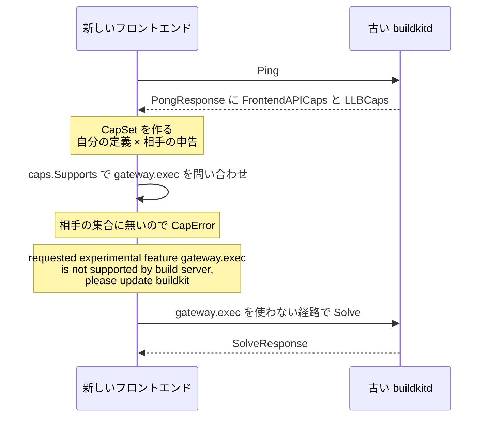

## 何を学んだか

BuildKit のクライアント・デーモン・フロントエンドは、それぞれ独立にバージョンが上がる。組み合わせは無数にあり、「デーモン v0.12 以上なら X が使える」というバージョン比較では管理しきれない。BuildKit の答えは、**機能ごとに不変な文字列 ID を振り、相手が対応 ID の集合を申告し、使う前に集合に入っているか聞く**というものだ。

```go title="util/apicaps/caps.go"
// CapID is type for capability identifier
type CapID string
```

([util/apicaps/caps.go L35-L36](https://github.com/moby/buildkit/blob/ca4838f8ddbd3612bca94bcb8a938d8a326110a3/util/apicaps/caps.go#L35-L36))

実際の ID は `"source.git.subdir"`、`"exec.mount.cache.sharing"`、`"gateway.exec.signals"` のような、**機能を名指しする文字列**だ。番号ではないので、機能の追加順序にも依存しない。ID の集合は 3 系統ある — LLB の op が使う `solver/pb`、gateway API が使う `frontend/gateway/pb`、そして両者が共有するインフラ `util/apicaps`。

## Cap の定義は 9 フィールド

```go title="util/apicaps/caps.go"
// Cap describes an API feature
type Cap struct {
	ID                  CapID
	Name                string // readable name, may contain spaces but keep in one sentence
	Status              CapStatus
	Enabled             bool
	Deprecated          bool
	SupportedHint       map[string]string
	DisabledReason      string
	DisabledReasonMsg   string
	DisabledAlternative string
}
```

([util/apicaps/caps.go L38-L49](https://github.com/moby/buildkit/blob/ca4838f8ddbd3612bca94bcb8a938d8a326110a3/util/apicaps/caps.go#L38-L49))

`Status` と `Enabled` / `Deprecated` は別物だ。`CapStatus` は 3 値しかない。

```go title="util/apicaps/caps.go"
const (
	// CapStatusStable refers to a capability that should never be changed in
	// backwards incompatible manner unless there is a serious security issue.
	CapStatusStable CapStatus = iota
	// CapStatusExperimental refers to a capability that may be removed in the future.
	// If incompatible changes are made the previous ID is disabled and new is added.
	CapStatusExperimental
	// CapStatusPrerelease is same as CapStatusExperimental that can be used for new
	// features before they move to stable.
	CapStatusPrerelease
)
```

([util/apicaps/caps.go L23-L33](https://github.com/moby/buildkit/blob/ca4838f8ddbd3612bca94bcb8a938d8a326110a3/util/apicaps/caps.go#L23-L33))

コメントの「非互換な変更をするときは、以前の ID を無効化して新しい ID を足す」が原則そのものだ。**ID は書き換えない。増やすだけ。** `Enabled` はその実行バイナリで有効かどうか (機能フラグ)、`Deprecated` は将来警告を出すための予約 (proto のコメントに `Unused. May be used for warnings in the future` とある)。

登録は各パッケージの `init()` で行われる。

```go title="frontend/gateway/pb/caps.go"
var Caps apicaps.CapList

// Every backwards or forwards non-compatible change needs to add a new capability row.
// By default new capabilities should be experimental. After merge a capability is
// considered immutable. After a capability is marked stable it should not be disabled.
```

([frontend/gateway/pb/caps.go L5-L9](https://github.com/moby/buildkit/blob/ca4838f8ddbd3612bca94bcb8a938d8a326110a3/frontend/gateway/pb/caps.go#L5-L9))

同じコメントが `solver/pb/caps.go` にも一字一句同じ形で置かれている ([solver/pb/caps.go L5-L9](https://github.com/moby/buildkit/blob/ca4838f8ddbd3612bca94bcb8a938d8a326110a3/solver/pb/caps.go#L5-L9))。**「マージされた cap は不変」**が、このコードベースで最も強く守られているルールだ。

その証拠がこれ。

```go title="solver/pb/caps.go"
	// NOTE the historical typo
	CapSourceHTTPUIDGID          apicaps.CapID = "soruce.http.uidgid"
```

([solver/pb/caps.go L46-L47](https://github.com/moby/buildkit/blob/ca4838f8ddbd3612bca94bcb8a938d8a326110a3/solver/pb/caps.go#L46-L47))

`source` の綴りを間違えた ID が、`// NOTE the historical typo` というコメント付きで残っている。直せば、この cap を申告している既存のクライアントとデーモンが互いを認識できなくなる。**ID はプロトコルの一部であり、内部の識別子ではない。**

## 突き合わせは `CapSet.Supports` の 15 行

```go title="util/apicaps/caps.go"
// CapSet is a configuration for detecting supported capabilities
type CapSet struct {
	list *CapList
	set  map[string]*pb.APICap
}

// Supports returns an error if capability is not supported
func (s *CapSet) Supports(id CapID) error {
	err := &CapError{ID: id}
	c, ok := s.list.m[id]
	if !ok {
		return errors.WithStack(err)
	}
	err.Definition = &c
	state, ok := s.set[string(id)]
	if !ok {
		return errors.WithStack(err)
	}
	err.State = state
	if !state.Enabled {
		return errors.WithStack(err)
	}
	return nil
}
```

([util/apicaps/caps.go L100-L123](https://github.com/moby/buildkit/blob/ca4838f8ddbd3612bca94bcb8a938d8a326110a3/util/apicaps/caps.go#L100-L123))

判定に 2 つの辞書が要ることに注意したい。

- `s.list` は **自分のバイナリがコンパイル時に知っている cap の定義**。ここに無ければ「そんな cap は知らない」
- `s.set` は **相手が申告してきた cap の状態**。ここに無ければ「相手が古い」、あっても `Enabled` が false なら「相手が意図的に切っている」

3 つの失敗はすべて `CapError` に集約され、`Error()` がどの段階で落ちたかを見てメッセージを組み立てる。

```go title="util/apicaps/caps.go"
	b := &strings.Builder{}
	fmt.Fprintf(b, "requested %sfeature %s %s", typ, e.ID, name)
	if e.State == nil {
		fmt.Fprint(b, " is not supported by build server")
		if hint, ok := e.Definition.SupportedHint[ExportedProduct]; ok {
			fmt.Fprintf(b, " (added in %s)", hint)
		}
		fmt.Fprintf(b, ", please update %s", ExportedProduct)
	} else {
		fmt.Fprint(b, " has been disabled on the build server")
		if e.State.DisabledReasonMsg != "" {
			fmt.Fprintf(b, ": %s", e.State.DisabledReasonMsg)
		}
	}
	return b.String()
```

([util/apicaps/caps.go L154-L168](https://github.com/moby/buildkit/blob/ca4838f8ddbd3612bca94bcb8a938d8a326110a3/util/apicaps/caps.go#L154-L168))

出来上がるのはこういう文字列で、テストにそのまま書かれている。

```
requested experimental feature cap2 (a second test cap) has been disabled on the build server
```

([util/apicaps/caps_test.go L41](https://github.com/moby/buildkit/blob/ca4838f8ddbd3612bca94bcb8a938d8a326110a3/util/apicaps/caps_test.go#L41))

エラーメッセージのために 3 つの仕掛けが入っている。

1. **`SupportedHint` は製品名でキーされる。** `map[string]string{"docker": "Docker v19.03", "buildkit": "BuildKit v0.5.0"}` のように、同じ cap でも Docker 経由と buildkitd 直の場合で「いつ入ったか」が違う ([solver/pb/caps.go L493-L501](https://github.com/moby/buildkit/blob/ca4838f8ddbd3612bca94bcb8a938d8a326110a3/solver/pb/caps.go#L493-L501))。どちらを表示するかは `apicaps.ExportedProduct` というグローバル変数で決まり、buildkitd と buildctl は起動時に `"buildkit"` を入れる。gateway 経由で起動されたフロントエンドは、環境変数 `BUILDKIT_EXPORTEDPRODUCT` から受け取る ([frontend/gateway/grpcclient/client.go L80-L82](https://github.com/moby/buildkit/blob/ca4838f8ddbd3612bca94bcb8a938d8a326110a3/frontend/gateway/grpcclient/client.go#L80-L82))。BuildKit を vendor して別製品として出す人が上書きできるように、と `ExportedProduct` の宣言コメントに書かれている
2. **`Status` がメッセージの語彙になる。** experimental / prerelease なら `requested experimental feature ...` と前置きされ、ユーザは「これは安定機能ではない」と分かる
3. **`DisabledReasonMsg` は相手から送られてくる。** サーバ運用者が「この機能はポリシーで切っている」と理由を書けば、クライアントにそのまま出る

`Contains` は `Supports` と違って自分の定義を見ない。

```go title="util/apicaps/caps.go"
// Contains checks if cap set contains cap. Note that unlike Supports() this
// function only checks capability existence in remote set, not if cap has been initialized.
func (s *CapSet) Contains(id CapID) bool {
	_, ok := s.set[string(id)]
	return ok
}
```

([util/apicaps/caps.go L125-L130](https://github.com/moby/buildkit/blob/ca4838f8ddbd3612bca94bcb8a938d8a326110a3/util/apicaps/caps.go#L125-L130))

## 配布経路 — Ping で全部渡す

gateway API では、フロントエンドが最初に投げる `Ping` の応答に caps がまるごと乗る。

```proto title="frontend/gateway/pb/gateway.proto"
message PongResponse{
	repeated moby.buildkit.v1.apicaps.APICap FrontendAPICaps = 1;
	repeated moby.buildkit.v1.apicaps.APICap LLBCaps = 2;
	repeated moby.buildkit.v1.types.WorkerRecord Workers = 3;
}
```

([frontend/gateway/pb/gateway.proto L300-L304](https://github.com/moby/buildkit/blob/ca4838f8ddbd3612bca94bcb8a938d8a326110a3/frontend/gateway/pb/gateway.proto#L300-L304))

デーモンは自分が知っている全 cap を無条件に返す。

```go title="frontend/gateway/gateway.go"
	return &pb.PongResponse{
		FrontendAPICaps: pb.Caps.All(),
		Workers:         pbWorkers,
		LLBCaps:         opspb.Caps.All(),
	}, nil
```

([frontend/gateway/gateway.go L1024-L1028](https://github.com/moby/buildkit/blob/ca4838f8ddbd3612bca94bcb8a938d8a326110a3/frontend/gateway/gateway.go#L1024-L1028))

2 種類あるのは、フロントエンドが**デーモンに RPC する** (gateway API) のと、**LLB を組み立てて送る** (LLB op) の 2 つの互換性を同時に気にする必要があるからだ。

受け取った側は `CapSet` を作る。

```go title="frontend/gateway/grpcclient/client.go"
	if resp.FrontendAPICaps == nil {
		resp.FrontendAPICaps = defaultCaps()
	}

	if resp.LLBCaps == nil {
		resp.LLBCaps = defaultLLBCaps()
	}

	return &grpcClient{
		// ...
		caps:      pb.Caps.CapSet(resp.FrontendAPICaps),
		llbCaps:   opspb.Caps.CapSet(resp.LLBCaps),
		// ...
	}, nil
```

([frontend/gateway/grpcclient/client.go L49-L76](https://github.com/moby/buildkit/blob/ca4838f8ddbd3612bca94bcb8a938d8a326110a3/frontend/gateway/grpcclient/client.go#L49-L76))

`nil` のときのフォールバックが、**caps 機構が導入される前のデーモンへの対応**だ。

```go title="frontend/gateway/grpcclient/client.go"
// defaultLLBCaps returns the LLB capabilities that were implemented when capabilities
// support was added. This list is frozen and should never be changed.
func defaultLLBCaps() []*apicaps.PBCap {
```

([frontend/gateway/grpcclient/client.go L264-L266](https://github.com/moby/buildkit/blob/ca4838f8ddbd3612bca94bcb8a938d8a326110a3/frontend/gateway/grpcclient/client.go#L264-L266))

「caps 対応が入った時点で実装されていた機能のリスト。これは凍結され、決して変更してはならない」。caps 機構自体のブートストラップも、caps と同じ不変性の原則で扱われている。



## LLB 側 — 頂点が自分の要求 cap を持ち歩く

gateway API の caps は「RPC を呼ぶ前に聞く」形だが、LLB の caps は少し違う。**LLB を組み立てるクライアントが、各頂点に「この頂点はどの cap を要求するか」を書き込む。**

```proto title="solver/pb/ops.proto"
// OpMetadata is a per-vertex metadata entry, which can be defined for arbitrary Op vertex and overridable on the run time.
message OpMetadata {
	// ...
	map<string, bool> caps = 5;
	// ...
}
```

([solver/pb/ops.proto L219-L234](https://github.com/moby/buildkit/blob/ca4838f8ddbd3612bca94bcb8a938d8a326110a3/solver/pb/ops.proto#L219-L234))

書き込むのは `llb` パッケージの marshal 経路。

```go title="client/llb/state.go"
	md.Caps = map[apicaps.CapID]bool{
		// ...
			md.Caps[pb.CapMetaIgnoreCache] = true
		// ...
			md.Caps[pb.CapMetaDescription] = true
```

([client/llb/state.go L169-L183](https://github.com/moby/buildkit/blob/ca4838f8ddbd3612bca94bcb8a938d8a326110a3/client/llb/state.go#L169-L183))

デーモン側は LLB をロードするときにこれを検証する。

```go title="solver/llbsolver/vertex.go"
func WithValidateCaps() LoadOpt {
	cs := pb.Caps.CapSet(pb.Caps.All())
	return func(_ *pb.Op, md *pb.OpMetadata, opt *solver.VertexOptions) error {
		if md != nil {
			for c := range md.Caps {
				if err := cs.Supports(apicaps.CapID(c)); err != nil {
					return err
				}
			}
		}
		return nil
	}
}
```

([solver/llbsolver/vertex.go L56-L67](https://github.com/moby/buildkit/blob/ca4838f8ddbd3612bca94bcb8a938d8a326110a3/solver/llbsolver/vertex.go#L56-L67))

`cs := pb.Caps.CapSet(pb.Caps.All())` は「自分の定義 × 自分の申告」なので、実質「自分が知っていて有効な cap かどうか」の判定になる。**古いデーモンが新しい LLB を受け取ったとき、その op のフィールドを黙って無視するのではなく、「この機能は知らない」と明示的に落ちる。** proto3 は未知のフィールドを無視するので、これがなければ `--mount=type=cache,sharing=locked` の `sharing` が黙って落ちて、ビルドが「動くが意味が違う」状態になる。

この設計は marshal の決定性とも噛み合っている ([決定性 marshal がキャッシュの前提になっている](../deterministic-marshal/))。cap は `OpMetadata` に入っており、`Op` 本体のダイジェストには影響しない — つまり **cap を記録してもキャッシュキーは変わらない**。

## なぜそうなっているか

バージョン番号による互換管理は、コンポーネントが 2 つのときにしか機能しない。BuildKit には最低 3 つある。

- **クライアント** (buildctl / buildx / docker CLI)。ユーザのマシンにあり、頻繁に上がる
- **デーモン** (buildkitd)。CI ホストや Docker Desktop に固定され、古いまま残りやすい
- **フロントエンド** (`docker/dockerfile:1` イメージ)。Dockerfile の 1 行目でユーザが選び、タグを固定していれば何年も古いままになる

しかも矢印は一方向ではない。クライアントはデーモンに LLB を送り、フロントエンドはデーモンに RPC し、デーモンはフロントエンドに opts を渡す。「A は B より新しい」という順序を仮定できる組み合わせが 1 つもない。

機能単位の ID にすれば、比較は集合の包含だけになる。新しい側は「相手が持っている機能だけ使う」というコードを、機能ごとの `if err := caps.Supports(X); err != nil` で書ける。実際、`forwardGateway` の `Inputs` 呼び出し ([#syntax=](../syntax-directive/))、`ToState` の `CapReferenceOutput` チェック ([gateway-ref](../gateway-ref/))、`client/build.go` の 10 箇所以上のガードは全部この形をしている。

ID を不変にする代償として、リポジトリには使われなくなった cap も typo のある cap も残り続ける。`solver/pb/caps.go` は 659 行あり、その大半が `Caps.Init` の繰り返しだ。だがこの冗長さは意図的なもので、**行数はコンポーネント間の互換性の記録**そのものになっている。新しい機能を足すときの作業が「cap を 1 行足して、使う場所で `Supports` を呼ぶ」に固定される点も大きい — 互換性の判断をレビュー時に人間が思い出す必要がない。

## どう活かすか

- **独立にバージョンが上がるコンポーネントが 3 つ以上あるなら、バージョン番号ではなく機能 ID の集合で互換を管理する。** 「A は B より新しい」という仮定が置けない構成では、番号の比較は意味を持たない。集合の包含なら、どの組み合わせでも同じコードで判定できる。
- **ID を発行したら二度と変えない。typo でも変えない。** BuildKit は `soruce.http.uidgid` をコメント付きで残した。「内部の識別子だから直してもいい」と思ったものが実はプロトコルの一部だった、というのは互換性を壊す典型的な経路だ。外に出た文字列は API だと考える。
- **「相手が知らない」と「相手が意図的に無効化した」を区別できるようにしておく。** BuildKit は前者に「更新してください」、後者に「サーバ管理者が理由を書けるメッセージ」を出す。ユーザが取るべき行動が正反対なので、この 2 つを同じ「未対応」で括ると誰も直せない。
- **未知のフィールドを黙って無視させない。** proto3 は未知フィールドを無視するので、機能追加が「エラーにならないが意味が変わる」形で壊れる。BuildKit は各頂点に要求 cap を書かせ、受け取り側で照合することでこれを防いだ。宣言的なデータをやりとりする API では、「このメッセージを正しく解釈するには何が必要か」をメッセージ自身に書かせるのが効く。
- **互換の仕組み自体にもブートストラップが要る。** `defaultCaps()` / `defaultLLBCaps()` は「caps が無い時代のデーモンだったら、この集合だと見なす」という凍結されたリストだ。互換管理の機構を後から入れるときは、機構が無かった時代を表す定数を必ず用意することになる。
