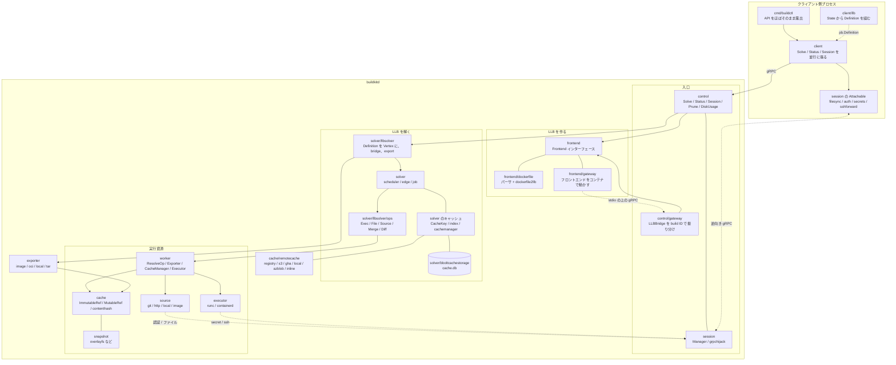

## 何を学んだか

BuildKit のトップレベルのディレクトリは、そのまま責務の分割になっている。境界は 3 本引かれていて、それぞれが章の構成に対応する。

1. **LLB を作る側と解く側** — `client/llb` と `frontend/` が前者、`solver/` が後者。境界は `pb.Definition` というバイト列。
2. **solver コアと LLB 固有の実装** — `solver/*.go` は「頂点が何をするか」を知らず、`solver/llbsolver/` が LLB を知っている。境界は `solver.Vertex` / `solver.Op` インターフェース。
3. **デーモンとクライアント** — `control/` の向こうにデーモン、`session/` の向こうにクライアント。境界は gRPC。

`worker/` はこの 3 本のどれにも属さない位置にいて、「Op の実行に必要なものを全部束ねたもの」として cache / executor / source / exporter への入口になっている。

## 全体図



以下、ブロックごとに何をしているかを見る。

## control — 入口とライフサイクル

`control/control.go` の `Controller` が gRPC サービスの実装で、`Opt` にデーモンの全部品が集まる。

```go title="control/control.go"
type Opt struct {
	SessionManager            *session.Manager
	WorkerController          *worker.Controller
	Frontends                 map[string]frontend.Frontend
	CacheManager              solver.CacheManager
	ResolveCacheExporterFuncs map[string]remotecache.ResolveCacheExporterFunc
	ResolveCacheImporterFuncs map[string]remotecache.ResolveCacheImporterFunc
	// ...
	CacheStore                *bboltcachestorage.Store
	LeaseManager              *leaseutil.Manager
	ContentStore              *containerdsnapshot.Store
	// ...
}
```

([control/control.go L69-L88](https://github.com/moby/buildkit/blob/ca4838f8ddbd3612bca94bcb8a938d8a326110a3/control/control.go#L69-L88))

`Controller.Solve` の仕事は、リクエストのパース・エクスポータの解決・キャッシュエクスポータの構成・attestation プロセッサの用意で、ビルドそのものは `llbsolver.Solver.Solve` に丸投げする。GC の起動 (`throttledGC`)、ビルド履歴の記録 (`history.Queue`)、OpenTelemetry のトレース転送もここに乗っている。

`control/gateway` は別の gRPC サービス (`LLBBridge`) を同じサーバに登録する。フロントエンドコンテナからの呼び出しを、build ID をキーに正しい bridge へ振り分ける ([gateway — コンテナの stdin/stdout の上に gRPC を張る](../gateway-grpc/))。

## frontend — LLB を作る側の拡張点

`frontend/frontend.go` はインターフェースだけの小さなファイルで、実装は 2 つある。

- `frontend/dockerfile` — Dockerfile のパーサ ([「複雑な言語には向かない」と自嘲するパースツリー](../dockerfile-parser/)) と、AST を LLB に変換する `dockerfile2llb` ([8 フェーズ・パイプライン](../dockerfile2llb-phases/))
- `frontend/gateway` — フロントエンドをコンテナイメージとして pull し、実行し、その stdin/stdout の上に gRPC を張る

`frontend/subrequests` は「ビルドせずに情報だけ返す」経路 (`buildctl build --opt requestid=...`) を担当する。

## solver — DAG を解くコア

`solver/` 直下は LLB を知らない。ここにあるのは 4 種類のファイルだ。

- **ジョブとグラフ** — `jobs.go` (`Solver` / `Job` / `state` / `sharedOp`)、`edge.go`、`scheduler.go`
- **キャッシュキー** — `cachekey.go`、`cachemanager.go`、`index.go`、`combinedcache.go`
- **ストレージ** — `cachestorage.go` (インターフェース)、`memorycachestorage.go`、`bboltcachestorage/`
- **型** — `types.go`

`solver/llbsolver/` が LLB 固有の層になる。`vertex.go` が `pb.Definition` を `solver.Vertex` の DAG に復元し、`bridge.go` / `provenance.go` がフロントエンドと solver をつなぎ、`ops/` に Op の実装が並ぶ。

worker が `Vertex.Sys()` を見て Op を選ぶところが、この 2 層の接合点になっている。

```go title="worker/base/worker.go"
func (w *Worker) ResolveOp(v solver.Vertex, s frontend.FrontendLLBBridge, sm *session.Manager, proxyOpt worker.ProxyOpt) (solver.Op, error) {
	if baseOp, ok := v.Sys().(*pb.Op); ok {
		switch op := baseOp.Op.(type) {
		case *pb.Op_Source:
			return ops.NewSourceOp(v, op, baseOp.Platform, w.SourceManager, w.ParallelismSem, sm, w)
		case *pb.Op_Exec:
			// ...
			return ops.NewExecOp(v, op, baseOp.Platform, w.CacheMgr, w.ParallelismSem, sm, exec, w, linuxResources, proxyNetwork)
		case *pb.Op_File:
			return ops.NewFileOp(v, op, w.CacheMgr, w.ParallelismSem, w)
		// ...
		}
	}
	return nil, errors.Errorf("could not resolve %v", v)
}
```

([worker/base/worker.go L406-L439](https://github.com/moby/buildkit/blob/ca4838f8ddbd3612bca94bcb8a938d8a326110a3/worker/base/worker.go#L406-L439))

solver から見れば `Sys()` は `any` で、この switch は worker の中にある。solver は `pb.Op` を知らない ([Vertex は何も知らない — solver コアの抽象境界](../vertex-abstraction/))。

## worker — 実行資源の束

`Worker` インターフェースは大きい。実行に要るものを全部持っているからだ。

```go title="worker/worker.go"
type Worker interface {
	io.Closer
	// ID needs to be unique in the cluster
	ID() string
	Labels() map[string]string
	Platforms(noCache bool) []ocispecs.Platform
	// ...
	// ResolveOp resolves Vertex.Sys() to Op implementation.
	ResolveOp(v solver.Vertex, s frontend.FrontendLLBBridge, sm *session.Manager, proxyOpt ProxyOpt) (solver.Op, error)
	ParseSource(op *pb.SourceOp, platform *pb.Platform) (source.Identifier, error)
	// ...
	Exporter(name string, sm *session.Manager) (exporter.Exporter, error)
	// ...
	ContentStore() *containerdsnapshot.Store
	Executor() executor.Executor
	CacheManager() cache.Manager
	LeaseManager() *leaseutil.Manager
	// ...
}
```

([worker/worker.go L29-L54](https://github.com/moby/buildkit/blob/ca4838f8ddbd3612bca94bcb8a938d8a326110a3/worker/worker.go#L29-L54))

「worker」という名前は分散を想定した命名で、`worker.Controller` が複数を持てるようになっている。ただし `Controller.Solve` には `// TODO: multiworker` というコメントが残り、実際にはデフォルト worker 1 つを使う。

```go title="control/control.go"
	// TODO: multiworker
	// This is actually tricky, as the exporter should come from the worker that has the returned reference. We may need to delay this so that the solver loads this.
	w, err := c.opt.WorkerController.GetDefault()
```

([control/control.go L432-L434](https://github.com/moby/buildkit/blob/ca4838f8ddbd3612bca94bcb8a938d8a326110a3/control/control.go#L432-L434))

実装は `worker/runc` と `worker/containerd` の 2 つで、どちらも `worker/base` を共有する。

## cache — ref とレイヤ

`cache/` は「ビルド結果のファイルシステムそのもの」を管理する。solver のキャッシュキーとは別の層なので混同しやすい。

```go title="cache/manager.go"
type Accessor interface {
	MetadataStore

	GetByBlob(ctx context.Context, desc ocispecs.Descriptor, parent ImmutableRef, opts ...RefOption) (ImmutableRef, error)
	Get(ctx context.Context, id string, pg progress.Controller, opts ...RefOption) (ImmutableRef, error)

	New(ctx context.Context, parent ImmutableRef, s session.Group, opts ...RefOption) (MutableRef, error)
	GetMutable(ctx context.Context, id string, opts ...RefOption) (MutableRef, error) // Rebase?
	IdentityMapping() *user.IdentityMapping
	Merge(ctx context.Context, parents []ImmutableRef, pg progress.Controller, opts ...RefOption) (ImmutableRef, error)
	Diff(ctx context.Context, lower, upper ImmutableRef, pg progress.Controller, opts ...RefOption) (ImmutableRef, error)
}
```

([cache/manager.go L60-L71](https://github.com/moby/buildkit/blob/ca4838f8ddbd3612bca94bcb8a938d8a326110a3/cache/manager.go#L60-L71))

`ImmutableRef` / `MutableRef` の 2 種類と参照カウントがこの層の中心で ([cacheRecord と 2 種類の ref](../cache-record-refs/))、実体は `snapshot/` 経由で containerd の snapshotter に落ちる。snapshotter そのものは [containerd 章](../../containerd/) の領分になる。

サブパッケージのうち `cache/contenthash` は COPY のキャッシュ用のファイルツリーハッシュ ([immutable radix tree に「ディレクトリ 2 レコード」を置く](../contenthash-radix-tree/))、`cache/remotecache` はリモートキャッシュの 6 バックエンド ([manifest がある世界とない世界](../remotecache-backends/)) を持つ。

## session — 逆向きの gRPC

`session/` は 2 つの役割を持つ。デーモン側の `Manager` はセッション ID から `Caller` を引く登録簿で、`grpchijack` は `Control.Session` の双方向ストリームを `net.Conn` に変換する。

その上に載るサービスがサブディレクトリになっている。

- `filesync` — ビルドコンテキストの転送と、`--output` でのクライアント側書き出し
- `auth` — レジストリ認証のトークン発行
- `secrets` / `sshforward` — `RUN --mount=type=secret` / `type=ssh`
- `content` / `upload` / `exporter` — OCI レイアウトのやりとりなど

デーモンの中の `source` (image pull の認証)、`executor` (secret / ssh のマウント)、`exporter` (ローカル出力・レジストリ push) がこれらの利用者になる。

## source / executor / exporter — 端

**`source/`** は「外から持ってくる」担当で、`Source` インターフェースにスキームを登録する形になっている。

```go title="source/manager.go"
type Source interface {
	// Schemes returns a list of SourceOp identifier schemes that this source
	// should match.
	Schemes() []string

	// Identifier constructs an Identifier from the given scheme, ref, and attrs,
	// all of which come from a SourceOp.
	Identifier(scheme, ref string, attrs map[string]string, platform *pb.Platform) (Identifier, error)

	// Resolve constructs an instance of the source from an Identifier.
	Resolve(ctx context.Context, id Identifier, sm *session.Manager, vtx solver.Vertex) (SourceInstance, error)
	// ...
}
```

([source/manager.go L17-L28](https://github.com/moby/buildkit/blob/ca4838f8ddbd3612bca94bcb8a938d8a326110a3/source/manager.go#L17-L28))

`git` / `http` / `local` / `containerimage` / `containerblob` の 5 つが登録される ([git source](../git-source/))。

**`executor/`** は極端に小さい。

```go title="executor/executor.go"
type Executor interface {
	// Run will start a container for the given process with rootfs, mounts.
	// ...
	Run(ctx context.Context, id string, rootfs Mount, mounts []Mount, process ProcessInfo, started chan<- struct{}) (resourcestypes.Recorder, error)
	// Exec will start a process in container matching `id`. ...
	Exec(ctx context.Context, id string, process ProcessInfo) error
}
```

([executor/executor.go L66-L74](https://github.com/moby/buildkit/blob/ca4838f8ddbd3612bca94bcb8a938d8a326110a3/executor/executor.go#L66-L74))

2 メソッドしかない。実装は `runcexecutor` と `containerdexecutor`、OCI ランタイム spec の生成は `executor/oci` ([runc executor が 1 回の Run でやること](../runc-executor/))。

**`exporter/`** は `Resolve` (属性から実体を作る) と `Export` (実行) の 2 段構えで、`Export` はさらに `FinalizeFunc` を返して 2 相に分かれる。

```go title="exporter/exporter.go"
	// Export performs the export operation and optionally returns a finalize
	// callback. This separates work that must run sequentially from work that
	// can run in parallel with other exports (e.g., cache export).
	//
	// For exporters that complete all work during Export (tar, local),
	// return nil for the finalize callback.
	Export(ctx context.Context, src *Source, buildInfo ExportBuildInfo) (
		response map[string]string,
		finalize FinalizeFunc,
		ref DescriptorReference,
		err error,
	)
```

([exporter/exporter.go L38-L49](https://github.com/moby/buildkit/blob/ca4838f8ddbd3612bca94bcb8a938d8a326110a3/exporter/exporter.go#L38-L49))

コメントが分割の理由を書いている。「順に走らなければいけない仕事」と「他のエクスポート (キャッシュエクスポートなど) と並行できる仕事」を分けるためだ ([Export と Finalize の 2 相分割](../export-finalize/))。

## なぜそうなっているか

この分割で一貫しているのは、**インターフェースが「上位が下位に何を要求するか」の側に置かれている**ことだ。`solver.Op` は solver パッケージにあり、実装は `solver/llbsolver/ops` にある。`exporter.Exporter` は exporter パッケージにあり、実装は `exporter/containerimage` などにある。`source.Source` も同じ。Go の慣習どおりだが、結果として **solver のコアは自分より下のパッケージを import しない**という依存の向きが保たれる。

例外的に大きいのが `worker.Worker` インターフェースだ。これは「Op の実行に必要なものの集合」を 1 つの型にまとめたもので、README の Key features にある `Distributable workers` を見据えた抽象になっている。実際には多 worker はまだ完成しておらず、`Controller.Solve` にその旨の TODO が残る。**未完成の抽象がインターフェースとして先に存在している**という状態なので、読むときは「なぜここで抽象化されているのか」の答えが現在のコードには無いことがある。

## どう活かすか

**「知らない」ことをディレクトリ構成で強制する。** solver が `pb.Op` を import しないのは、`Vertex.Sys() any` という 1 つの穴を開けて実装を worker 側に追い出したからだ。レイヤ分割は命名規約ではなく、import できないという事実で担保されると壊れにくい。

**大きなインターフェースは「まとめた理由」を疑う。** `worker.Worker` の 20 個超のメソッドは、責務が混ざっているのではなく「分散したときに 1 台の向こう側に行くもの」を集めた結果だと読める。インターフェースが大きいとき、それが設計不良なのか、境界を跨ぐ単位として正しいのかを見分ける必要がある。

**入口のパッケージには、ビルドそのもののロジックを置かない。** `control/control.go` の `Solve` は 200 行以上あるが、やっているのはパース・解決・組み立て・委譲だけだ。gRPC のハンドラにドメインロジックが染み出さないようにしておくと、API の変更とロジックの変更が独立に扱える。
