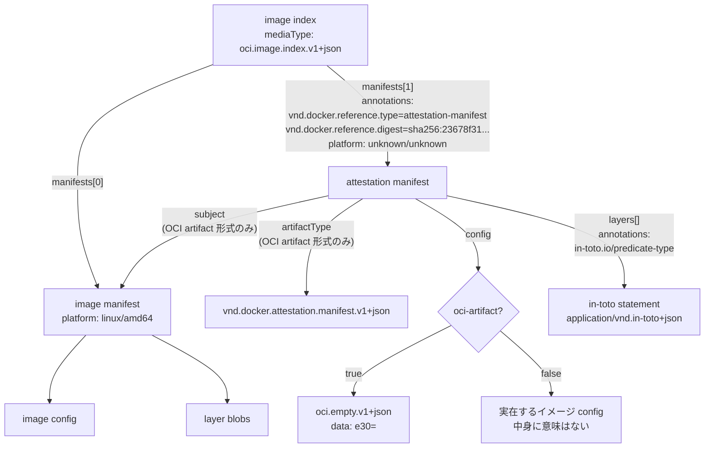

## 何を学んだか

BuildKit の attestation（SBOM や provenance）は、イメージの index に**もう 1 枚マニフェストを足す**形で格納される。そのマニフェストは実行できるイメージではないので、`platform` を `unknown/unknown` にして runtime に無視させる。

形式は 2 つある。**OCI artifact 形式**（`artifactType` を立て、`subject` で対象マニフェストを指し、`config` は OCI の空 JSON descriptor）と、**レガシー形式**（`config` に実在するイメージ config を置く）。どちらを使っても index 側の descriptor には `vnd.docker.reference.type` / `vnd.docker.reference.digest` アノテーションが付く。切り替えは `oci-artifact` オプション、既定値は `compatibility-version` で決まる。

そして重要な点として、**BuildKit は OCI referrers API を使わない**。`subject` フィールドは OCI artifact 形式で立てるが、attestation の発見手段はあくまで index 内のアノテーションだ。

## Attestation はどこから来るか

型は `solver/result` にある。ref かコンテンツ生成関数のどちらかで中身を持つ。

```go title="solver/result/attestation.go"
type Attestation[T any] struct {
	Kind pb.AttestationKind

	Metadata map[string][]byte

	Ref         T
	Path        string
	ContentFunc func(context.Context) ([]byte, error)

	InToto InTotoAttestation
}
```

([solver/result/attestation.go L21-L31](https://github.com/moby/buildkit/blob/ca4838f8ddbd3612bca94bcb8a938d8a326110a3/solver/result/attestation.go#L21-L31))

エクスポータ側では `T` が `cache.ImmutableRef` に具体化される。

```go title="exporter/exporter.go"
type Attestation = result.Attestation[cache.ImmutableRef]
```

([exporter/exporter.go L15](https://github.com/moby/buildkit/blob/ca4838f8ddbd3612bca94bcb8a938d8a326110a3/exporter/exporter.go#L15))

`Kind` は 2 種類。`InToto` は「この 1 ファイルが 1 つの in-toto 述語」、`Bundle` は「このディレクトリの中に in-toto ステートメントが複数ある」。

メタデータのキーは 3 つだけ。

```go title="solver/result/attestation.go"
const (
	AttestationReasonKey     = "reason"
	AttestationSBOMCore      = "sbom-core"
	AttestationInlineOnlyKey = "inline-only"
)

const (
	AttestationReasonSBOM       = "sbom"
	AttestationReasonProvenance = "provenance"
)
```

([solver/result/attestation.go L10-L19](https://github.com/moby/buildkit/blob/ca4838f8ddbd3612bca94bcb8a938d8a326110a3/solver/result/attestation.go#L10-L19))

`inline-only` は「イメージに埋め込むときだけ出す」の意味で、[image exporter](../image-exporter/) の `attestation.Filter` がこれを見て local / tar 出力から落とす。

## SBOM の生成経路 — スキャナはコンテナとして走る

SBOM は BuildKit が自前で作るのではなく、**指定されたイメージをスキャナとして実行して作らせる**。`attest:sbom=generator=<image>` を指定すると `SBOMProcessor` が動く。

```go title="frontend/attestations/sbom/sbom.go"
env = append(env, "BUILDKIT_SCAN_DESTINATION="+outDir)
env = append(env, "BUILDKIT_SCAN_SOURCE="+path.Join(srcDir, "core", CoreSBOMName))
if len(extras) > 0 {
	env = append(env, "BUILDKIT_SCAN_SOURCE_EXTRAS="+path.Join(srcDir, "extras/"))
}
// ...
runscan.AddMount(path.Join(srcDir, "core", CoreSBOMName), ref, llb.Readonly)
for k, extra := range extras {
	runscan.AddMount(path.Join(srcDir, "extras", ExtraSBOMPrefix+k), extra, llb.Readonly)
}

stsbom := runscan.AddMount(outDir, llb.Scratch())
```

([frontend/attestations/sbom/sbom.go L63-L96](https://github.com/moby/buildkit/blob/ca4838f8ddbd3612bca94bcb8a938d8a326110a3/frontend/attestations/sbom/sbom.go#L63-L96))

スキャン対象を read-only でマウントし、出力先に空のマウントを置いて、スキャナのエントリポイントを走らせる。結果は `Bundle` kind の attestation になる。

```go title="frontend/attestations/sbom/sbom.go"
return result.Attestation[*llb.State]{
	Kind: gatewaypb.AttestationKind_Bundle,
	Ref:  &stsbom,
	Metadata: map[string][]byte{
		result.AttestationReasonKey: []byte(result.AttestationReasonSBOM),
		result.AttestationSBOMCore:  []byte(CoreSBOMName),
	},
	// ...
}, nil
```

([frontend/attestations/sbom/sbom.go L97-L107](https://github.com/moby/buildkit/blob/ca4838f8ddbd3612bca94bcb8a938d8a326110a3/frontend/attestations/sbom/sbom.go#L97-L107))

「core」は最終ステージのスキャン、「extras」はそれ以外のスキャン対象。何を extras に入れるかは `BUILDKIT_SBOM_SCAN_CONTEXT` / `BUILDKIT_SBOM_SCAN_STAGE` というビルド引数が決める。

```go title="frontend/dockerfile/dockerfile2llb/convert.go"
if ds.scanContext {
	res.SBOM.Extras["context"] = ds.opt.buildContext
}
// ...
for dsi := range allReachableStages(ds) {
	if ds != dsi && dsi.scanStage {
		res.SBOM.Extras[dsi.stageName] = dsi.state
```

([frontend/dockerfile/dockerfile2llb/convert.go L100-L113](https://github.com/moby/buildkit/blob/ca4838f8ddbd3612bca94bcb8a938d8a326110a3/frontend/dockerfile/dockerfile2llb/convert.go#L100-L113))

「ビルドに使ったが最終イメージには残っていないビルド用ステージ」も SBOM の対象にできる、というのがこの仕組みの狙いだ。ビルドステージで入れたコンパイラの脆弱性も追跡したい、という要求に対応している。

## unbundle と検証 — フロントエンドを信用しない

エクスポータは attestation を扱う前に `Unbundle` を通す。Bundle kind ならディレクトリを読んで in-toto ステートメントに展開し、In-toto kind ならそのまま通す。このときに**フロントエンドが provenance を騙ることを禁止する**。

```go title="exporter/attestation/unbundle.go"
case gatewaypb.AttestationKind_InToto:
	if strings.HasPrefix(att.InToto.PredicateType, "https://slsa.dev/provenance/") {
		if att.ContentFunc == nil {
			// provenance may only be set buildkit-side using ContentFunc
			return errors.New("frontend may not set provenance attestations")
		}
	}
	unbundled[i] = append(unbundled[i], att)
case gatewaypb.AttestationKind_Bundle:
	// ...
	for _, att := range atts {
		if strings.HasPrefix(att.InToto.PredicateType, "https://slsa.dev/provenance/") {
			return errors.New("frontend may not bundle provenance attestations")
		}
	}
```

([exporter/attestation/unbundle.go L34-L70](https://github.com/moby/buildkit/blob/ca4838f8ddbd3612bca94bcb8a938d8a326110a3/exporter/attestation/unbundle.go#L34-L70))

`ContentFunc` は Go のクロージャなので、gRPC で送られてくるフロントエンドからは絶対に設定できない。ref 経由の（＝フロントエンドがコンテナの中で作った）ファイルが SLSA provenance を名乗ろうとすると弾かれる。[信頼境界](../scope-and-trust/) がここに引かれている。

読み込みには上限がある。

```go title="exporter/attestation/make.go"
const maxAttestationBytes int64 = 80 << 20
```

([exporter/attestation/make.go L20](https://github.com/moby/buildkit/blob/ca4838f8ddbd3612bca94bcb8a938d8a326110a3/exporter/attestation/make.go#L20))

`Unbundle` はさらに並び替えもする。`sbom-core` メタデータと一致する名前のものを先頭に持ってくる（[exporter/attestation/unbundle.go L92-L117](https://github.com/moby/buildkit/blob/ca4838f8ddbd3612bca94bcb8a938d8a326110a3/exporter/attestation/unbundle.go#L92-L117)）。

## SPDX への後付け — どのレイヤに入っているか

SBOM が SPDX で、かつ core のものなら、エクスポータは中身を書き換えて「各ファイルがどのレイヤに入っているか」を足す。

```go title="exporter/containerimage/attestations.go"
desc, err := layers.find(ctx, s, f.FileName)
if err != nil {
	if !errors.Is(err, fs.ErrNotExist) {
		return err
	}
	return nil
}
f.FileComment = fmt.Sprintf("layerID: %s", desc.Digest.String())
```

([exporter/containerimage/attestations.go L82-L90](https://github.com/moby/buildkit/blob/ca4838f8ddbd3612bca94bcb8a938d8a326110a3/exporter/containerimage/attestations.go#L82-L90))

探索は `fileLayerFinder` が担当する。レイヤチェーンを**上から下へ**辿り、見つけたファイルを全部キャッシュに入れていく。

```go title="exporter/containerimage/attestations.go"
// find finds the layer that contains the file, returning the ImmutableRef and
// descriptor for the layer. If the file searched for was deleted, find returns
// the layer that created the file, not the one that deleted it.
```

([exporter/containerimage/attestations.go L167-L169](https://github.com/moby/buildkit/blob/ca4838f8ddbd3612bca94bcb8a938d8a326110a3/exporter/containerimage/attestations.go#L167-L169))

whiteout ファイル（`.wh.` 接頭辞）はスキップするので、「削除された層」ではなく「作成した層」が返る。既にコメントが入っているファイルは触らない（SPDX の `FileComment` は非構造データなので、上書きするとスキャナ側の情報を壊す）。

## 2 つの形式

マニフェストを作るのは `commitAttestationsManifest`。`ociArtifact` フラグで分岐する。

```go title="exporter/containerimage/writer.go"
configDesc := ocispecs.DescriptorEmptyJSON
config := configDesc.Data

if !ociArtifact {
	var err error
	config, err = attestationsConfig(layers)
	// ...
	configDesc = ocispecs.Descriptor{
		Digest:    digest.FromBytes(config),
		Size:      int64(len(config)),
		MediaType: configType,
	}
}

mfst := ocispecs.Manifest{
	MediaType: manifestType,
	// ...
	Config: configDesc,
}

if ociArtifact {
	mfst.ArtifactType = attestationManifestArtifactType
	mfst.Subject = &ocispecs.Descriptor{
		Digest:    target.Digest,
		Size:      target.Size,
		MediaType: target.MediaType,
	}
}
```

([exporter/containerimage/writer.go L618-L650](https://github.com/moby/buildkit/blob/ca4838f8ddbd3612bca94bcb8a938d8a326110a3/exporter/containerimage/writer.go#L618-L650))

```go title="exporter/containerimage/writer.go"
const attestationManifestArtifactType = "application/vnd.docker.attestation.manifest.v1+json"
```

([exporter/containerimage/writer.go L51](https://github.com/moby/buildkit/blob/ca4838f8ddbd3612bca94bcb8a938d8a326110a3/exporter/containerimage/writer.go#L51))

レガシー形式で作られる config は、形だけイメージ config で中身に意味は無い。

```go title="exporter/containerimage/writer.go"
func attestationsConfig(layers []ocispecs.Descriptor) ([]byte, error) {
	img := ocispecs.Image{}
	img.Architecture = intotoPlatform.Architecture
	img.OS = intotoPlatform.OS
	// ...
	img.RootFS.Type = "layers"
	for _, layer := range layers {
		img.RootFS.DiffIDs = append(img.RootFS.DiffIDs, digest.Digest(layer.Annotations[labels.LabelUncompressed]))
	}
```

([exporter/containerimage/writer.go L723-L736](https://github.com/moby/buildkit/blob/ca4838f8ddbd3612bca94bcb8a938d8a326110a3/exporter/containerimage/writer.go#L723-L736))

`docs/attestations/attestation-storage.md` にはこう書かれている。

> The image config will not contain attestation-specific details, and should be ignored as it is only included for compatibility purposes.

`layers` の中身はどちらの形式でも同じで、in-toto ステートメントそのものが blob になる。

```go title="exporter/containerimage/writer.go"
desc := ocispecs.Descriptor{
	MediaType: intoto.PayloadType,
	Digest:    digest,
	Size:      int64(len(data)),
	Annotations: map[string]string{
		labels.LabelUncompressed:    digest.String(),
		"in-toto.io/predicate-type": statement.PredicateType,
	},
}
```

([exporter/containerimage/writer.go L602-L610](https://github.com/moby/buildkit/blob/ca4838f8ddbd3612bca94bcb8a938d8a326110a3/exporter/containerimage/writer.go#L602-L610))

`in-toto.io/predicate-type` アノテーションのおかげで、「SPDX だけ欲しい」という消費者は blob を落とさずに選別できる。

そして**返り値の descriptor は、形式によらず同じアノテーションを持つ**。

```go title="exporter/containerimage/writer.go"
return &ocispecs.Descriptor{
	Digest:    mfstDigest,
	Size:      int64(len(mfstJSON)),
	MediaType: manifestType,
	Annotations: map[string]string{
		attestationTypes.DockerAnnotationReferenceType:   attestationTypes.DockerAnnotationReferenceTypeDefault,
		attestationTypes.DockerAnnotationReferenceDigest: string(target.Digest),
	},
}, nil
```

([exporter/containerimage/writer.go L681-L689](https://github.com/moby/buildkit/blob/ca4838f8ddbd3612bca94bcb8a938d8a326110a3/exporter/containerimage/writer.go#L681-L689))

```go title="util/attestation/types.go"
const (
	DockerAnnotationReferenceType        = "vnd.docker.reference.type"
	DockerAnnotationReferenceDigest      = "vnd.docker.reference.digest"
	DockerAnnotationReferenceDescription = "vnd.docker.reference.description"

	DockerAnnotationReferenceTypeDefault = "attestation-manifest"
)
```

([util/attestation/types.go](https://github.com/moby/buildkit/blob/ca4838f8ddbd3612bca94bcb8a938d8a326110a3/util/attestation/types.go))

`platform` は呼び出し側で `unknown/unknown` にされる。

```go title="exporter/containerimage/writer.go"
desc, err := ic.commitAttestationsManifest(ctx, opts, *desc, stmts, opts.OCIArtifactEnabled())
if err != nil {
	return nil, err
}
desc.Platform = &intotoPlatform
attestationManifests = append(attestationManifests, *desc)
```

([exporter/containerimage/writer.go L345-L350](https://github.com/moby/buildkit/blob/ca4838f8ddbd3612bca94bcb8a938d8a326110a3/exporter/containerimage/writer.go#L345-L350))



## 既定値は compatibility-version が決める

```go title="exporter/containerimage/export.go"
// DefaultOCIArtifact returns the default attestation manifest format.
func DefaultOCIArtifact(compatibilityVersion int, opts *ImageCommitOpts) bool {
	return compatibilityVersion >= compat.CompatibilityVersion031 && opts.OCITypesEnabled()
}
```

([exporter/containerimage/export.go L594-L597](https://github.com/moby/buildkit/blob/ca4838f8ddbd3612bca94bcb8a938d8a326110a3/exporter/containerimage/export.go#L594-L597))

`CompatibilityVersion031` は `30`（現行）。それより古い互換性バージョンを選ぶとレガシー形式になる。`oci-artifact=true` と `oci-mediatypes=false` の組み合わせは矛盾なので明示的に禁止されている。

```go title="exporter/containerimage/opts.go"
if c.OCIArtifactEnabled() && !c.OCITypesEnabled() {
	return errors.New("exporter option \"oci-artifact=true\" conflicts with \"oci-mediatypes=false\"")
}
```

([exporter/containerimage/opts.go L88-L90](https://github.com/moby/buildkit/blob/ca4838f8ddbd3612bca94bcb8a938d8a326110a3/exporter/containerimage/opts.go#L88-L90))

同様に、attestation があるのに `oci-mediatypes=false` を指定するとエラーになる。

```go title="exporter/containerimage/writer.go"
if !opts.OCITypesEnabled() && len(inp.Attestations) > 0 {
	return nil, errors.New("cannot export attestations with \"oci-mediatypes=false\"")
}
```

([exporter/containerimage/writer.go L207-L209](https://github.com/moby/buildkit/blob/ca4838f8ddbd3612bca94bcb8a938d8a326110a3/exporter/containerimage/writer.go#L207-L209))

## なぜ 2 つの形式が要るのか

**レガシー形式の存在理由は、レジストリが「イメージマニフェスト」の形しか受け付けないから。** OCI の `artifactType` と `subject` は image-spec v1.1 で入った比較的新しいフィールドで、それ以前のレジストリは知らないフィールドを拒否したり、`config` が空 JSON descriptor だと弾いたりする。レガシー形式は「これはただのイメージマニフェストです」という顔をして通り抜けるための偽装で、`config` の中身は意味を持たないのに置かれている。

**OCI artifact 形式に移行したい理由は、`subject` と `artifactType` が標準だから。** レジストリ側が理解すれば、referrers API で「このイメージを subject とする artifact 一覧」を引けるようになる。ただし**現時点の BuildKit はその API を使っていない**。`subject` を立てているのは、対応レジストリが referrers インデックスを自動で維持してくれるのを期待してのことで、BuildKit 自身の書き込み経路は「index に足す」の一本だ。

**なぜどちらの形式でも `vnd.docker.reference.*` アノテーションを付けるのか。** これが実際の発見手段だからだ。消費者は index の `manifests` を舐め、`vnd.docker.reference.type == "attestation-manifest"` のものを拾い、`vnd.docker.reference.digest` で対象マニフェストと突き合わせる。referrers API に依存しないので、どんなレジストリでも動く。形式を切り替えてもこの経路は変わらない。

**なぜ `platform` を `unknown/unknown` にするのか。** ドキュメントが明言している。

> To prevent container runtimes from accidentally pulling or running the image described in the manifest

index を読む runtime はプラットフォームで選別する。存在しないプラットフォームにしておけば、どの runtime も選ばない。「実行できないものを実行可能なコンテナのカタログに混ぜる」という無理を、既存のフィルタ機構を悪用して安全にしている。

## どう活かすか

- **移行期には「新しい形式」と「偽装した古い形式」を並べ、発見手段だけは共通にする。** BuildKit は形式を切り替えても index 側のアノテーションを変えない。だから消費者は 1 通りの読み方だけ実装すればよく、形式の移行を意識しない。逆に発見手段まで新形式に寄せると、消費者側も同時に移行しないと壊れる。
- **新しい形式の既定値をバージョン番号で切り替える。** `DefaultOCIArtifact(compatibilityVersion, opts)` の形なら、既定値を進めつつ「古い出力を再現する」も残せる。フラグ 1 本の on/off より、バージョン軸のほうが同時に動く複数の既定値をまとめて扱える。
- **既存機構のフィルタを流用して「無視させる」。** `platform: unknown/unknown` は新しいフィールドを 1 つも増やしていない。既存のクライアントに「これは無視してください」と伝える手段が既にあるなら、それを使うほうが互換性の負債が小さい。
- **信頼境界は型で引く。** 「provenance は `ContentFunc` でしか設定できない」という規則は、`ContentFunc` が gRPC を越えられない Go のクロージャであることに支えられている。実行時チェックも入れてはいるが、そもそも越境できない場所に置くのが第一の防御になっている。
- **後付けするデータは、既にある値を壊さない条件を書く。** SPDX の `FileComment` を埋めるコードは「既に何か入っていたら触らない」「見つからなければ黙って諦める」の 2 つを守っている。他人のフォーマットの非構造フィールドを使うときの最低限の作法だ。
