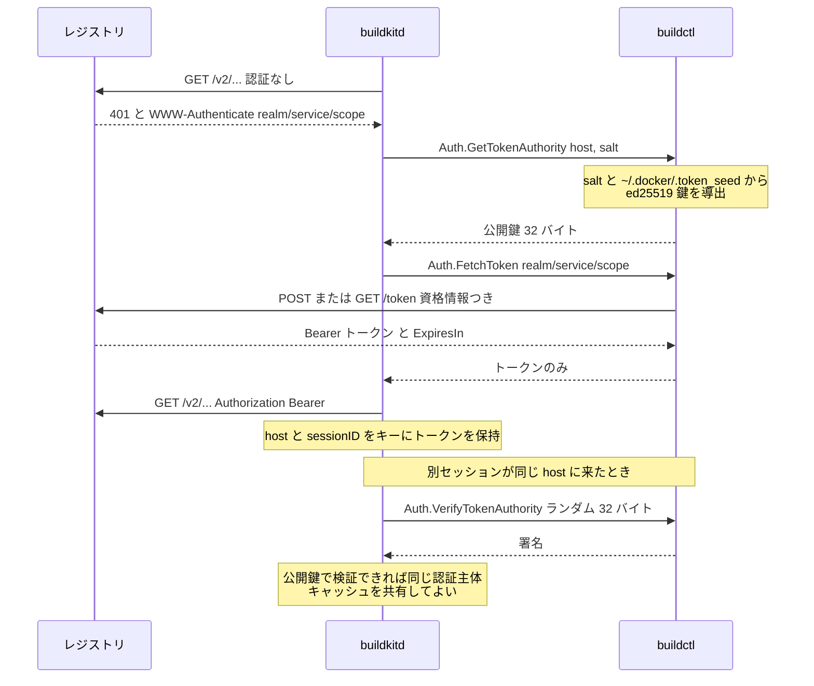

## 何を学んだか

`docker login` した資格情報はクライアントの credential helper の中にある。BuildKit のデーモンはそれを一切見ない。`Auth` サービスの `FetchToken` は「この realm と scope でトークンを取ってこい」という依頼で、実際にレジストリの `/token` エンドポイントを叩くのはクライアントだ。デーモンが受け取るのは、期限つき・スコープつきの Bearer トークンだけになる。

そのうえで BuildKit は、**「このトークンを取ってきた主体が誰か」をパスワードを見ずに判定する**仕組みを持っている。`GetTokenAuthority` でクライアント側の公開鍵を受け取り、`VerifyTokenAuthority` でランダムなペイロードに署名させる。鍵はクライアントの資格情報から導出されるので、署名が検証できれば「同じ資格情報を持つクライアント」だと分かる。デーモンのトークンキャッシュを、資格情報を知らないまま安全に共有するための道具だ。

## ソースコードのどこか

### 4 つの RPC

```proto title="session/auth/auth.proto"
service Auth{
	rpc Credentials(CredentialsRequest) returns (CredentialsResponse);
	rpc FetchToken(FetchTokenRequest) returns (FetchTokenResponse);
	rpc GetTokenAuthority(GetTokenAuthorityRequest) returns (GetTokenAuthorityResponse);
	rpc VerifyTokenAuthority(VerifyTokenAuthorityRequest) returns (VerifyTokenAuthorityResponse);
}
```

([session/auth/auth.proto L7](https://github.com/moby/buildkit/blob/ca4838f8ddbd3612bca94bcb8a938d8a326110a3/session/auth/auth.proto#L7))

役割は 2 系統に分かれる。

- `Credentials` — 生のユーザ名とパスワードを返す。**古い経路**で、Basic 認証のレジストリや、クライアントが `FetchToken` に対応していない場合のフォールバック。
- `FetchToken` / `GetTokenAuthority` / `VerifyTokenAuthority` — 資格情報を渡さずにトークンだけを渡す**新しい経路**。

```proto title="session/auth/auth.proto"
message FetchTokenRequest {
	string ClientID = 1;
	string Host = 2;
	string Realm = 3;
	string Service = 4;
	repeated string Scopes = 5;
}

message FetchTokenResponse {
	string Token = 1;
	int64 ExpiresIn = 2; // seconds
	int64 IssuedAt = 3; // timestamp
}
```

`Realm` / `Service` / `Scopes` は、デーモンがレジストリから受け取った `WWW-Authenticate` チャレンジをそのまま転記したものだ。つまり「どこに何を要求するか」を決めるのはデーモンで、「その要求を誰の資格情報で実行するか」を握るのがクライアント、という分担になっている。

### クライアント側の実装

`authProvider.FetchToken` が、レジストリの認証エンドポイントを実際に叩く。

```go title="session/auth/authprovider/authprovider.go"
func (ap *authProvider) FetchToken(ctx context.Context, req *auth.FetchTokenRequest) (rr *auth.FetchTokenResponse, err error) {
	ac, err := ap.getAuthConfig(ctx, req.Host, req.Scopes)
	// ...
	// check for statically configured bearer token
	if ac.RegistryToken != "" {
		return toTokenResponse(ac.RegistryToken, time.Time{}, 0), nil
	}

	creds := toCredentials(*ac)
	to := authutil.TokenOptions{
		Realm:    req.Realm,
		Service:  req.Service,
		Scopes:   req.Scopes,
		Username: creds.Username,
		Secret:   creds.Secret,
	}
```

([session/auth/authprovider/authprovider.go L100](https://github.com/moby/buildkit/blob/ca4838f8ddbd3612bca94bcb8a938d8a326110a3/session/auth/authprovider/authprovider.go#L100))

資格情報が入っているのは `to` (ローカル変数) までで、レスポンスに載るのはトークンだけだ。

`creds.Secret` の有無で叩き方が変わる。あれば OAuth の POST、なければ匿名で GET。POST が 404 / 401 / 405 を返す場合は GET にフォールバックする経路もあって、そこにはレジストリごとの実情がコメントで残っている。

```go title="session/auth/authprovider/authprovider.go"
				// Registries without support for POST may return 404 for POST /v2/token.
				// As of September 2017, GCR is known to return 404.
				// As of February 2018, JFrog Artifactory is known to return 401.
```

([session/auth/authprovider/authprovider.go L145](https://github.com/moby/buildkit/blob/ca4838f8ddbd3612bca94bcb8a938d8a326110a3/session/auth/authprovider/authprovider.go#L145))

`Credentials` の方は生の資格情報を返すが、返すときに進捗ログへ `[auth] sharing credentials for <host>` と出す。

```go title="session/auth/authprovider/authprovider.go"
	resp := toCredentials(*ac)
	if resp.Secret != "" {
		// ...
		_, ok := ap.loggerCache[req.Host]
		ap.loggerCache[req.Host] = struct{}{}
		if !ok && ap.logger != nil {
			return resp, progresswriter.Wrap(fmt.Sprintf("[auth] sharing credentials for %s", req.Host), ap.logger, func(progresswriter.SubLogger) error {
				return err
			})
		}
	}
```

([session/auth/authprovider/authprovider.go L221](https://github.com/moby/buildkit/blob/ca4838f8ddbd3612bca94bcb8a938d8a326110a3/session/auth/authprovider/authprovider.go#L221))

「パスワードをデーモンに渡した」という事実がユーザに見える形になっている。ホストごとに 1 回だけ (`loggerCache`)。

### 委譲の証明 — 鍵は資格情報から導出される

`GetTokenAuthority` と `VerifyTokenAuthority` が触る鍵は、こう作られる。

```go title="session/auth/authprovider/authprovider.go"
func (ap *authProvider) getAuthorityKey(ctx context.Context, host string, salt []byte) (ed25519.PrivateKey, error) {
	if v, err := strconv.ParseBool(os.Getenv("BUILDKIT_NO_CLIENT_TOKEN")); err == nil && v {
		return nil, status.Errorf(codes.Unavailable, "client side tokens disabled")
	}

	ac, err := ap.getAuthConfig(ctx, host, nil)
	if err != nil {
		return nil, err
	}

	creds := toCredentials(*ac)
	seed, err := ap.seeds.getSeed(host)
	if err != nil {
		return nil, err
	}

	mac := hmac.New(sha256.New, salt)
	if creds.Secret != "" {
		mac.Write(seed)
	}

	sum := mac.Sum(nil)

	return ed25519.NewKeyFromSeed(sum[:ed25519.SeedSize]), nil
}
```

([session/auth/authprovider/authprovider.go L280](https://github.com/moby/buildkit/blob/ca4838f8ddbd3612bca94bcb8a938d8a326110a3/session/auth/authprovider/authprovider.go#L280))

読むべき点が 3 つある。

**`mac.Write(seed)` が条件つき。** 資格情報を持っていなければ seed を混ぜない。つまり「匿名アクセスの鍵」は salt だけから決まり、同じ salt を使う全クライアントで同じになる。認証済みのクライアントの鍵は seed が混ざるので別物になる。デーモン側から見れば、「匿名同士は同じ authority、認証済みは資格情報ごとに違う authority」として区別できる。

**seed はクライアントのディスクに保存される。**

```go title="session/auth/authprovider/tokenseed.go"
	// we include client side randomness to avoid chosen plaintext attack from the daemon side
	dt, err := os.ReadFile(fp)
```

([session/auth/authprovider/tokenseed.go L48](https://github.com/moby/buildkit/blob/ca4838f8ddbd3612bca94bcb8a938d8a326110a3/session/auth/authprovider/tokenseed.go#L48))

`~/.docker/.token_seed` にホストごとの 16 バイト乱数を持つ (`config.Dir()` 配下、`flock` で排他)。コメントが理由を書いている — salt はデーモンが決める値なので、salt だけから鍵を作ると、デーモンが選んだ salt に対する署名を集めることになる。クライアント側の乱数を混ぜることでそれを封じる。

**salt はデーモンの起動ごとに変わる。**

```go title="session/auth/auth.go"
// getSalt returns unique component per daemon restart to avoid persistent keys
func getSalt() []byte {
	saltOnce.Do(func() {
		salt = make([]byte, 32)
		rand.Read(salt)
	})
	return salt
}
```

([session/auth/auth.go L22](https://github.com/moby/buildkit/blob/ca4838f8ddbd3612bca94bcb8a938d8a326110a3/session/auth/auth.go#L22))

デーモンが再起動すれば公開鍵も全部変わるので、古いキャッシュエントリが新しいクライアントとマッチすることはない。

`GetTokenAuthority` は導出した鍵の公開鍵部分だけを返す。

```go title="session/auth/authprovider/authprovider.go"
func (ap *authProvider) GetTokenAuthority(ctx context.Context, req *auth.GetTokenAuthorityRequest) (*auth.GetTokenAuthorityResponse, error) {
	key, err := ap.getAuthorityKey(ctx, req.Host, req.Salt)
	// ...
	return &auth.GetTokenAuthorityResponse{PublicKey: key[32:]}, nil
}

func (ap *authProvider) VerifyTokenAuthority(ctx context.Context, req *auth.VerifyTokenAuthorityRequest) (*auth.VerifyTokenAuthorityResponse, error) {
	key, err := ap.getAuthorityKey(ctx, req.Host, req.Salt)
	// ...
	priv := new([64]byte)
	copy((*priv)[:], key)

	return &auth.VerifyTokenAuthorityResponse{Signed: sign.Sign(nil, req.Payload, priv)}, nil
}
```

([session/auth/authprovider/authprovider.go L241](https://github.com/moby/buildkit/blob/ca4838f8ddbd3612bca94bcb8a938d8a326110a3/session/auth/authprovider/authprovider.go#L241))

`ed25519.PrivateKey` は 64 バイトで、後半 32 バイトが公開鍵。`nacl/sign` の 64 バイト秘密鍵形式と互換なので、そのままキャストして署名できる。

デーモン側の検証:

```go title="session/auth/auth.go"
		payload := make([]byte, 32)
		rand.Read(payload)
		resp, err := client.VerifyTokenAuthority(ctx, &VerifyTokenAuthorityRequest{
			Host:    host,
			Salt:    getSalt(),
			Payload: payload,
		})
		// ...
		var dt []byte
		dt, ok = sign.Open(nil, resp.Signed, pubKey)
		if ok && subtle.ConstantTimeCompare(dt, payload) == 1 {
			verified = true
		}
```

([session/auth/auth.go L85](https://github.com/moby/buildkit/blob/ca4838f8ddbd3612bca94bcb8a938d8a326110a3/session/auth/auth.go#L85))

毎回ランダムな 32 バイトを送って署名させるチャレンジ・レスポンスだ。`sign.Open` で署名を検証し、中身が送ったペイロードと一致するか `subtle.ConstantTimeCompare` で比べる。

### デーモン側の使いどころ

トークン取得のフローに繋げると、なぜ 2 つの RPC に分かれているかが分かる。

レジストリから 401 とチャレンジが返ったとき、デーモンはまず公開鍵を要求する。

```go title="util/resolver/authorizer.go"
			var username, secret string
			sessionID, pubKey, err := sessionauth.GetTokenAuthority(ctx, host, a.sm, a.session)
			// ...
			if pubKey == nil {
				sessionID, username, secret, err = a.getCredentials(ctx, host)
				// ...
			}

			common, err := auth.GenerateTokenOptions(ctx, host, username, secret, c)
			// ...
			handlerNS.set(host, sessionID, newAuthFetcher(host, a.client, c.Scheme, pubKey, common))
```

([util/resolver/authorizer.go L197](https://github.com/moby/buildkit/blob/ca4838f8ddbd3612bca94bcb8a938d8a326110a3/util/resolver/authorizer.go#L197))

`pubKey` が取れれば `username` / `secret` は空のまま `authFetcher` を作る。デーモンのメモリに資格情報が載らない経路だ。`pubKey` が nil (古いクライアント、または `BUILDKIT_NO_CLIENT_TOKEN=1`) のときだけ、従来どおり `Credentials` を呼ぶ。

`authFetcher` は `authority` の有無で挙動が変わる。

```go title="util/resolver/authorizer.go"
	if ah.authority != nil {
		resp, err := sessionauth.FetchToken(ctx, &sessionauth.FetchTokenRequest{
			ClientID: "buildkit-client",
			Host:     ah.host,
			Realm:    to.Realm,
			Service:  to.Service,
			Scopes:   to.Scopes,
		}, sm, g)
		// ...
		expires = int(resp.ExpiresIn)
		// ...
		token = resp.Token
		return nil, nil
	}
```

([util/resolver/authorizer.go L351](https://github.com/moby/buildkit/blob/ca4838f8ddbd3612bca94bcb8a938d8a326110a3/util/resolver/authorizer.go#L351))

`authority` があればセッション経由でトークンを取り、なければデーモン自身がレジストリを叩く。

そして `VerifyTokenAuthority` が効くのは、**キャッシュエントリを別セッションに貸し出すとき**だ。

```go title="util/resolver/authorizer.go"
	// link existing fetcher
	for k, h := range a.fetchers {
		// ... k を host と sessionID に分割し、host が一致するものについて
		if h.authority != nil {
			sessionID, ok, err := sessionauth.VerifyTokenAuthority(ctx, host, h.authority, sm, g)
			if err == nil && ok {
				a.fetchers[host+"/"+sessionID] = h
				h.lastUsed = time.Now()
				return h
			}
		} else {
			sessionID, username, password, err := sessionauth.CredentialsFunc(ctx, sm, g)(host)
			if err == nil {
				if username == h.common.Username && password == h.common.Secret {
					a.fetchers[host+"/"+sessionID] = h
					h.lastUsed = time.Now()
					return h
				}
			}
		}
	}
```

([util/resolver/authorizer.go L77](https://github.com/moby/buildkit/blob/ca4838f8ddbd3612bca94bcb8a938d8a326110a3/util/resolver/authorizer.go#L77))

2 つの分岐が同じことをしている。**新しいセッションが、既存のキャッシュエントリと同じ認証主体かどうか**の判定だ。

- `authority` がある場合: チャレンジに署名させる。署名が通れば同じ資格情報から導出された鍵、つまり同じ主体。
- `authority` がない場合: 生の username / password を取り寄せて文字列比較する。

上が下の置き換えになっているのがよく分かる。同じ判定を、パスワードを知らずにやるための機構が `GetTokenAuthority` / `VerifyTokenAuthority` だ。



### トークンのキャッシュと期限

トークンは scope 単位でキャッシュされる。

```go title="util/resolver/authorizer.go"
	// Docs: https://distribution.github.io/distribution/spec/auth/scope
	scoped := strings.Join(to.Scopes, " ")

	res, err := ah.g.Do(ctx, scoped, func(ctx context.Context) (*authResult, error) {
		// ...
		r, exist := ah.scopedTokens[scoped]
		// ...
		if exist {
			if r.expires.IsZero() || r.expires.After(time.Now()) {
				return r, nil
			}
		}
		r, err := ah.fetchToken(ctx, sm, g, to)
```

([util/resolver/authorizer.go L307](https://github.com/moby/buildkit/blob/ca4838f8ddbd3612bca94bcb8a938d8a326110a3/util/resolver/authorizer.go#L307))

`ah.g.Do` は singleflight で、同じ scope に対する同時取得を 1 本にまとめる。多段ビルドで同じベースイメージを複数の vertex が同時に引くとき、`/token` への同時リクエストが 1 本に潰れる。

期限の扱いには余裕が入っている。

```go title="util/resolver/authorizer.go"
		if err == nil {
			r = &authResult{token: token}
			if issuedAt.IsZero() {
				issuedAt = time.Now()
			}
			if exp := issuedAt.Add(time.Duration(float64(expires)*0.9) * time.Second); time.Now().Before(exp) {
				r.expires = exp
			}
		}
```

([util/resolver/authorizer.go L345](https://github.com/moby/buildkit/blob/ca4838f8ddbd3612bca94bcb8a938d8a326110a3/util/resolver/authorizer.go#L345))

有効期限の 90% で切る。残り 10% は、レジストリとの時刻ずれ・転送中の失効・リトライのための余白だ。`expires` が返ってこないレジストリ向けには `defaultExpiration = 60` (秒) がある ([authprovider.go L37](https://github.com/moby/buildkit/blob/ca4838f8ddbd3612bca94bcb8a938d8a326110a3/session/auth/authprovider/authprovider.go#L37))。

クライアント側にも別のキャッシュ期限がある。

```go title="session/auth/authprovider/authprovider.go"
	if cfg.ExpireCachedAuth == nil {
		cfg.ExpireCachedAuth = func(created time.Time, _ string) bool {
			// Tokens for Google Artifact Registry via Workload Identity expire after 5 minutes.
			return time.Since(created) > 4*time.Minute+50*time.Second
		}
	}
```

([session/auth/authprovider/authprovider.go L60](https://github.com/moby/buildkit/blob/ca4838f8ddbd3612bca94bcb8a938d8a326110a3/session/auth/authprovider/authprovider.go#L60))

こちらは credential helper から取った資格情報そのもののキャッシュで、5 分の 10 秒手前で捨てる。具体的なサービス名が理由として書かれているのが率直でよい。

### `Credentials` はまだ必要

新しい経路があっても `Credentials` は消えていない。`WWW-Authenticate` が `Basic` を要求するレジストリでは、トークンという概念自体がないからだ。

```go title="util/resolver/authorizer.go"
		case auth.BasicAuth:
			sessionID, username, secret, err := a.getCredentials(ctx, host)
			// ...
			if username != "" && secret != "" {
				handlerNS.set(host, sessionID, newAuthFetcher(host, a.client, c.Scheme, nil, auth.TokenOptions{
					Username: username,
					Secret:   secret,
				}))
```

([util/resolver/authorizer.go L218](https://github.com/moby/buildkit/blob/ca4838f8ddbd3612bca94bcb8a938d8a326110a3/util/resolver/authorizer.go#L218))

この経路ではパスワードがデーモンのメモリに載る。だからこそクライアント側が `[auth] sharing credentials for ...` と進捗に出す。

`sessionAuthTimeout = 60 * time.Second` が全 4 RPC に共通で入っている ([session/auth/auth.go L17](https://github.com/moby/buildkit/blob/ca4838f8ddbd3612bca94bcb8a938d8a326110a3/session/auth/auth.go#L17))。credential helper が対話的にパスワードを聞いたり、キーチェーンのロック解除を待ったりすることがあるので、単純な RPC にしては長めに取ってある。

## なぜそうなっているか

デーモンは共有される。CI で 1 台の buildkitd を複数のジョブが使うのは普通の構成だし、rootless でないなら他のユーザのビルドも同じプロセスの中で走る。ここに `docker login` のパスワードを渡すと、権限の範囲がプロセス全体に広がってしまう。

トークンに変換してから渡せば、露出するのは「そのレジストリの、その scope に対する、数分間の権限」に縮む。`FetchToken` の引数が `Realm` / `Service` / `Scopes` を持っているのは、デーモンが「必要な最小の権限」を明示的に要求する形にするためだ。

一方でトークンをキャッシュしたいという要求がある。ジョブごとに `/token` を叩き直すのは遅いし、レジストリのレート制限にも当たる。だがキャッシュを共有するには「この 2 つのセッションは同じ認証主体か」を判定しなければならず、パスワードを持っていないデーモンにはそれができない。

`GetTokenAuthority` / `VerifyTokenAuthority` は、この判定だけを外部化したものだ。デーモンは「同じかどうか」だけを知り、「何が同じなのか」は知らない。等値判定を鍵の同一性に置き換えた、と言ってもいい。しかも salt をデーモンが毎回起動時に決めることで、公開鍵そのものが再起動をまたいで意味を持たないようにしてある。

`~/.docker/.token_seed` のコメント (`to avoid chosen plaintext attack from the daemon side`) が明示しているとおり、この設計は**デーモンを完全には信用しない**前提で書かれている。salt をデーモンに選ばせつつ、クライアント側の秘密を必ず混ぜる。悪意あるデーモンが特定の salt を選んで署名を集めても、seed を知らなければ他の salt に対する鍵は作れない。

`BUILDKIT_NO_CLIENT_TOKEN=1` という逃げ道が残っているのも実務的だ。クライアント側でトークンを取れない環境 (ネットワーク的にレジストリに届かないクライアント) では、`getAuthorityKey` が `codes.Unavailable` を返し、デーモン側は `pubKey == nil` と見て `Credentials` の経路に落ちる。

この委譲の恩恵を受けるのは、イメージを引く側 ([image ソース](../image-source/)) と押す側 ([image エクスポータ](../image-exporter/)) の両方だ。どちらも同じ `util/resolver` を通るので、認証の経路は 1 本しかない。

## どう活かすか

- **資格情報ではなく、資格情報から作った有効期限つきのトークンを渡す。** 「誰に何を渡すか」を決めるとき、権限の範囲 (scope) と時間 (expiry) の両方を絞れる形に変換してから渡す。BuildKit は変換の実行主体を、資格情報を持っている側 (クライアント) に置いた。
- **等値判定だけが必要なら、値そのものを渡さずに済ませられる。** 「同じ資格情報か」を知りたいだけなら、資格情報から鍵を導出してチャレンジ・レスポンスすればいい。値を渡して比較するのは、必要以上のことをしている。
- **相手が選ぶ値だけから鍵を導出しない。** salt をサーバが決めるなら、クライアント側の秘密を必ず混ぜる。`.token_seed` の 1 行コメントがその理由をそのまま書いている。
- **キャッシュの有効期限は、名目の期限より手前で切る。** BuildKit は 90%。時計のずれ・往復の時間・リトライの余地を、期限側で吸収する。
- **セキュリティ的に劣る経路は消せなくても、使ったことを見えるようにする。** `[auth] sharing credentials for <host>` は 1 行のログだが、「今どちらの経路を通ったか」をユーザに知らせている。
- **無効化のスイッチを 1 つ用意する。** `BUILDKIT_NO_CLIENT_TOKEN` は、新しい経路が動かない環境で古い経路に落とすためのもの。凝った機構を入れるほど、それを止める手段が要る。
